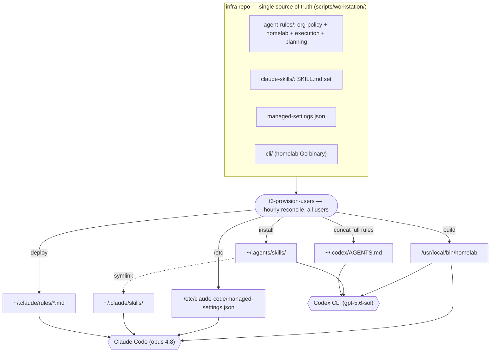
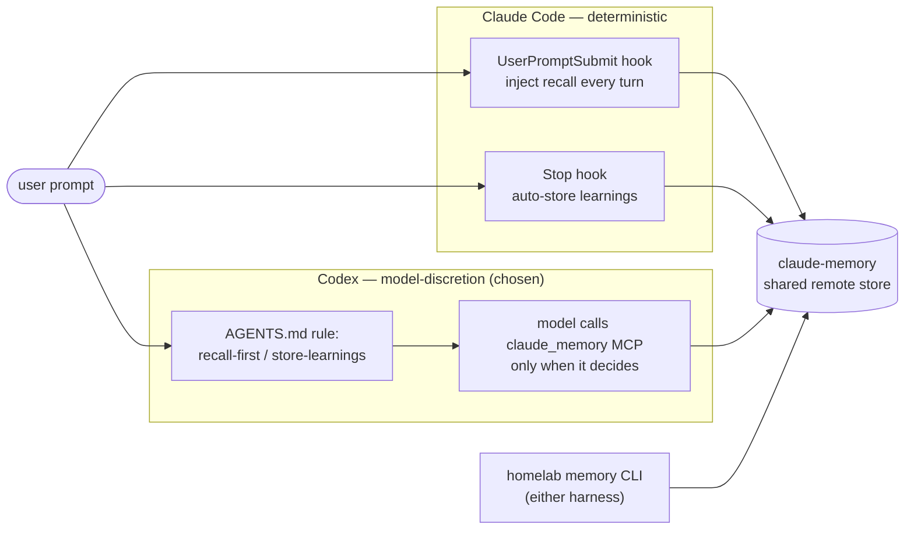

# Codex Harness Parity — making the devvm "Codex-ready"

- **Status:** Draft — for review
- **Owner:** Viktor / wizard
- **Date:** 2026-07-14
- **Owning repo:** `infra` (`scripts/workstation/`, `scripts/t3-provision-users.sh`)
- **Trigger:** Viktor may migrate his daily driver from Claude Code to OpenAI Codex CLI and wants the *same prompts to trigger the same behaviours* — memory recall/store, `homelab` CLI usage, skills, and the org/global rules.

## Goal / non-goals

**Goal.** A prompt typed into Codex on the devvm behaves like the same prompt typed into Claude Code: the agent recalls/stores memory against the shared store, prefers the `homelab` CLI, auto-invokes the same skills, and follows the same org + engineering rules — provisioned fleet-wide from one source so the two harnesses never drift.

**Non-goals.**
- Changing the model. Codex stays on its native GPT model (`gpt-5.6-sol`) via the existing shared `/opt/codex-shared/auth.json` — an existing contract, **no new agent-initiated spend**. Pointing Codex at Claude is explicitly out of scope (Codex's `wire_api` is `responses`-only; it would need an OpenAI-Responses shim in front of Anthropic — a separate project).
- Retiring Claude Code. The design serves a **dual-run** period and survives a later full cutover; we are not removing the Claude Code config.
- Hard OS-level policy enforcement (see Decision 4).

## TL;DR — the decisions

| # | Decision | Choice |
|---|----------|--------|
| 1 | Memory recall + store on Codex | **`claude_memory` MCP tool + AGENTS.md instruction. No Codex hooks.** (model-discretion, accepted) |
| 2 | Rules → `~/.codex/AGENTS.md` | **One canonical rule set in the infra repo → concatenated into `AGENTS.md` *and* fed to `~/.claude/rules`.** Both harnesses, fleet-wide. |
| 3 | Codex native memory | Already off (`features.memories = experimental/false`). **Pin it off** via provisioning; single brain = `claude-memory`. |
| 4 | Enforcement | **Provision-only, no `/etc/codex/requirements.toml`.** Hourly reconcile re-asserts config; user-overridable; drift self-heals. |
| 5 | Skills | **`~/.agents/skills` = single skills home for both harnesses; roll fleet-wide** (extend `SKILL_USERS`). |
| — | `memory_recall` approval friction | Flip `approval_mode` off `"approve"` → `"auto"` (mechanical). |
| — | Model / cost | Keep GPT via existing shared auth — zero new spend. |

## Background — how Claude Code fires these behaviours today

| Behaviour | Mechanism (Claude Code) |
|-----------|-------------------------|
| Auto memory recall | `UserPromptSubmit` hook → `homelab-memory-recall.py` runs `homelab memory recall` and **injects the results into context every turn** (deterministic) |
| Auto memory store | `Stop` hook → `auto-learn.py` extracts learnings and `homelab memory store`s them |
| Rules | `~/.claude/rules/{execution,planning,homelab}.md` auto-loaded (cwd-independent) + org `claudeMd` from root-owned `managed-settings.json` |
| Skills | model-auto-invoked `SKILL.md` under `~/.claude/skills/` |
| `homelab` CLI | `/usr/local/bin/homelab` on PATH — already harness-agnostic |
| Compaction | `PreCompact` + `UserPromptSubmit` recovery hooks (**legacy** — reference the retired MCP + a local sqlite) |

Everything is deployed per-user by the root `t3-provision-users` systemd timer (hourly + on boot) from `infra/scripts/workstation/`.

## Findings — Codex 0.144.3 is at near-parity out of the box

Verified live on the box (fleet-wide: wizard, emo, ancamilea all have `~/.codex`, authed via shared `/opt/codex-shared/auth.json`):

- **Native hooks engine** — `hooks` feature is `stable`. `UserPromptSubmit` can inject computed stdout into context *deterministically*, a ~1:1 match for the Claude Code recall hook. (We are choosing **not** to use it — Decision 1.)
- **AGENTS.md** loads globally every session. The full rule set fits the 32 KiB budget: org-policy 3.6K + homelab 12.1K + execution 6.9K + planning 1.6K ≈ **24.2K**.
- **Skills** are core/stable and **model-auto-invoked** from `~/.agents/skills/**/SKILL.md`, same format as Claude Code; the installer already dual-targets that dir.
- **`features.memories` = `experimental`/`false`** — native memory is already off; **`goals`** is on (harmless session-goal tracking).
- **`config.toml` already mirrors** `claude_memory`, `ha`, `playwright`, `paperless`, `google_workspace`, `phpipam` MCP servers "for codex/claude parity" — but `memory_recall` is gated behind `approval_mode = "approve"`.
- **`requirements.toml`** (root-owned `/etc/codex/`) exists as a real enforced-policy tier (zero-cost, self-hosted) — we are choosing not to use it (Decision 4).

### The gaps and the fix for each

| # | Gap today | Fix |
|---|-----------|-----|
| G1 | `~/.codex/AGENTS.md` carries **only** the 3.6K org `claudeMd` — none of the homelab/engineering rules | Expand `refresh_codex_mirror` to concatenate the full canonical rule set (D2) |
| G2 | No deterministic memory recall/store on Codex | AGENTS.md instruction + `claude_memory` MCP, `approval_mode=auto` (D1) |
| G3 | Native Codex memory could fragment the store | Pin `features.memories=false` (D3) |
| G4 | Skills only provisioned for `emo` | Extend `SKILL_USERS`; `~/.agents/skills` as single home (D5) |
| G5 | Rules canonical sources are scattered (chezmoi + monorepo + managed-settings); non-admins may lack `execution`/`planning` entirely | Consolidate one canonical set in the infra repo, deploy to both harnesses (D2) — **also closes a latent Claude Code gap** |
| — | Legacy compaction hooks | Dropped — not ported (no hooks; the CC ones are stale anyway) |

## Architecture — one source, both harnesses

## Memory mechanism — the accepted trade-off

Claude Code recall/store are **deterministic** (hooks fire every turn). On Codex we deliberately chose **model-discretion** (MCP tool + AGENTS.md instruction), trading strict "same behaviour" for less UI noise and zero hook machinery. The reliability floor drops — the model *may* skip a recall or a store — and this was accepted with eyes open (see Decision 1).

## Decisions & rationale

**D1 — Memory = MCP + AGENTS.md instruction, no hooks.** Recall *and* store ride the already-wired `claude_memory` MCP server, nudged by an AGENTS.md rule; `memory_recall` drops its `approve` gate. *Rationale (Viktor):* avoids Codex's per-turn "injected developer message" UI noise and a parallel hook system to maintain. *Flag raised & held:* this is model-discretion, so it is **not** a strict "same prompt → same behaviour" guarantee — store especially degrades (models routinely end a turn without self-storing). Viktor accepted this after a specific pushback on the store path; "same behaviours" is understood here as "best-effort behaviours."

**D2 — One canonical rule set → both harnesses.** The rules (org-policy + homelab + execution + planning ≈ 24K, under the 32K budget) become one canonical set in the infra repo. `refresh_codex_mirror` concatenates the full set into `~/.codex/AGENTS.md`; the same sources feed `~/.claude/rules`. A rule edit updates both harnesses; neither drifts. Claude-only tool names (Skill tool, `EnterWorktree`) are phrased harness-neutrally. *Rationale:* the memory decision makes AGENTS.md the *entire* behaviour engine on Codex, so the rules must be complete and drift-proof.

**D3 — Single memory brain.** `features.memories` is already off; we pin it `false` in provisioning so it can't drift on and fragment the store. `goals` left as-is (harmless).

**D4 — Provision-only, no enforcement.** No `/etc/codex/requirements.toml`. Config, AGENTS.md, and the feature pin are provisioned by the hourly reconcile and remain user-overridable; drift self-heals within an hour. *Rationale (Viktor):* keeps the GitOps-reconcile ethos; the multi-user red-lines are accepted as reconcile-asserted rather than OS-locked. *Note:* `requirements.toml` (permissions, MCP allowlist, feature pinning) remains available as a later hardening step if the trust model changes.

**D5 — Single skills home, fleet-wide.** `~/.agents/skills` is the canonical skills dir for both harnesses (Claude via the `~/.claude/skills` symlink, Codex natively). Roll the homelab skill set there for all users by extending `SKILL_USERS`. Start with the portable homelab/infra skills (they mostly call the `homelab` CLI); adapt or leave-Claude-only the few plugin-derived ones (superpowers, grilling) whose `SKILL.md` isn't harness-neutral.

## Implementation plan (fleet-wide, via the reconcile)

All changes land in the `infra` repo and deploy through `t3-provision-users` on the next hourly tick (or `sudo t3-provision-users` to apply immediately). Worktree-first per `execution.md`.

**Phase 1 — Consolidate the canonical rule set (unblocks D2, closes G5).**
1. Create `scripts/workstation/agent-rules/` in the infra repo with the canonical `homelab.md`, `execution.md`, `planning.md` (relocate from the monorepo `~/code/docs/agents/` and wizard's chezmoi; keep harness-neutral phrasing). Org policy stays sourced from `managed-settings.json` `claudeMd`.
2. Add a reconcile step to deploy those files to every user's `~/.claude/rules/` (fixes the latent gap where non-admins may only have the org `claudeMd` today — confirm at build).
3. Repoint the monorepo/chezmoi copies at the new canonical source (symlink or generated) so there is exactly one source.

**Phase 2 — Expand the Codex AGENTS.md mirror (G1).**
4. Rewrite `refresh_codex_mirror` to assemble `~/.codex/AGENTS.md` = header + org `claudeMd` + `homelab.md` + `execution.md` + `planning.md` (in that precedence order). Keep the existing first-line marker guard (so a user-customised AGENTS.md is never clobbered) and the `install -o "$user" -m 0644` (user-owned, per D4). Assert total < `project_doc_max_bytes` (32768); if it ever exceeds, bump that key in the provisioned `config.toml`.

**Phase 3 — Codex config tweaks (G2, G3).**
5. Provision per-user `~/.codex/config.toml` (new idempotent `sync_codex_config`, same marker-guard + user-owned pattern as the mirror): ensure `[mcp_servers.claude_memory]` present, set `[mcp_servers.claude_memory.tools.memory_recall] approval_mode = "auto"`, and pin `[features] memories = false`.
6. Add a crisp, imperative memory rule to the canonical `homelab.md` (so both harnesses inherit it): *recall via the `claude_memory` tool / `homelab memory recall` before non-obvious work; store durable learnings via the same at the end of a turn.*

**Phase 4 — Skills fleet-wide (G4, D5).**
7. Extend `SKILL_USERS` (line 34) to the codex/claude tiers (or all users).
8. Audit the vendored `claude-skills/` set for harness-neutral `SKILL.md` front matter; adapt or exclude non-neutral ones. Confirm Codex auto-invokes them (verify item V2).

## Verification

- **V1 (memory):** On Codex, a prompt referencing prior context triggers a `claude_memory` recall with no approval prompt; a store persists to the shared remote (`homelab memory recall` on the CC side sees it).
- **V2 (skills):** `codex features list` shows skills active; a task matching a skill's description auto-loads that skill (resolve the researcher conflict on auto-invocation empirically).
- **V3 (rules):** A fresh Codex session's `~/.codex/AGENTS.md` contains the memory mandate, reuse-first, zero-cost, presence, versioning, and the engineering rules; size < 32K.
- **V4 (parity):** The same non-trivial prompt run in both harnesses produces materially the same process (recall → homelab CLI → presence claim before mutating → worktree).
- **V5 (no regression):** Claude Code sessions still load their rules and hooks after the Phase-1 relocation.

## Open facts to confirm at build

- **F1:** Exact SKILL.md front-matter compatibility between Claude Code and Codex, and whether `allow_implicit_invocation` is on by default on 0.144.3 (research surfaced one conflicting claim; the box has the dirs + a stable skills feature, so strong-yes — verify).
- **F2:** Whether non-admin users currently receive `execution.md`/`planning.md` at all (Phase 1 assumes not and fixes it either way).
- **F3:** How `~/.codex/config.toml` is authored today for non-admins (wizard's is chezmoi/hand-managed) — Phase 3 introduces reconcile management without clobbering user customisation.

## Vocabulary

- **Harness** — the agent CLI shell (Claude Code or Codex CLI), distinct from the **model** it drives.
- **Canonical rule set** — the single infra-repo copy of org-policy + homelab + execution + planning rules that *both* harnesses derive from.
- **AGENTS.md mirror** — the generated `~/.codex/AGENTS.md`, Codex's global always-loaded instruction file; the Codex analog of `~/.claude/rules/*.md` + `claudeMd`.
- **Single skills home** — `~/.agents/skills`, read natively by Codex and via symlink by Claude Code; one `SKILL.md` serves both.
- **Provision-only** — config asserted by the hourly reconcile and user-overridable, as opposed to OS-enforced (root-owned) policy.
- **Model-discretion memory** — recall/store that fire only when the model chooses to call the tool, vs. Claude Code's deterministic hook-driven memory.
