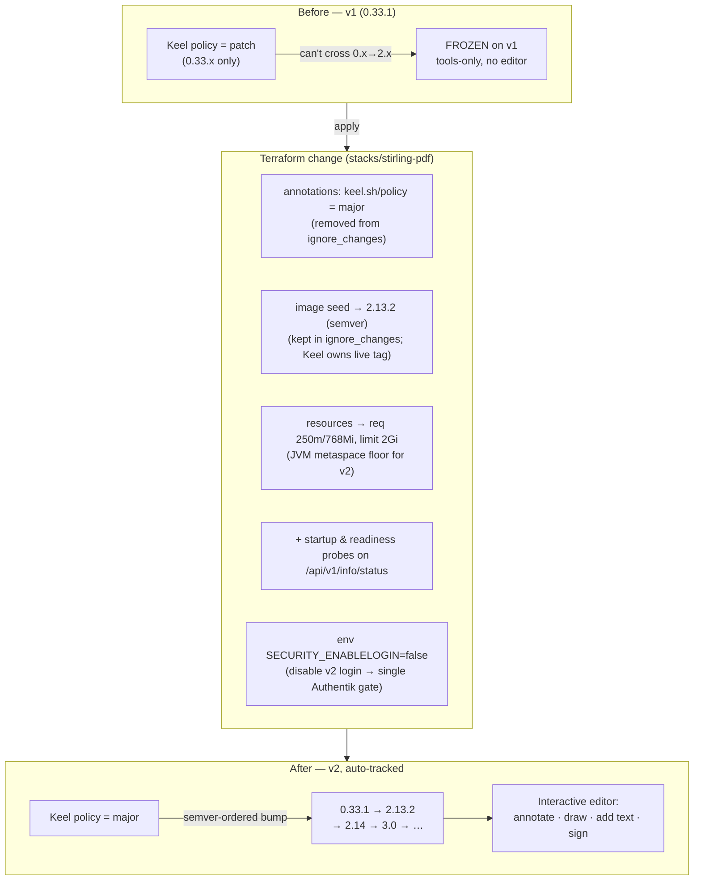
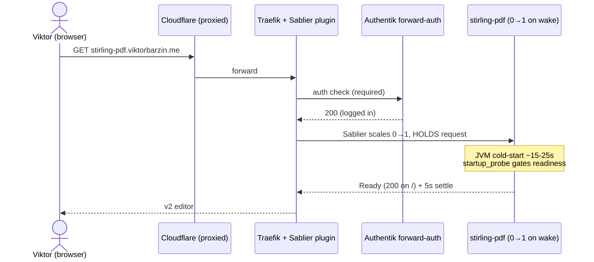

# Stirling-PDF v1 → v2 upgrade — sign / draw / annotate / add-text

- **Status:** executing → done
- **Date:** 2026-07-16
- **Owner:** Viktor (wizard)
- **Stack:** `stacks/stirling-pdf`
- **Blast radius:** one tier-4-aux service, scale-to-zero, auth-gated. Low.

## TL;DR

We already run **Stirling-PDF**, but pinned at **`0.33.1` (v1)** — the legacy
discrete-tools suite (merge / split / convert / OCR), which has **no interactive
editor**. That's why it never felt like "editing" PDFs. **Stirling-PDF v2** (the
"open-source Adobe Acrobat" rewrite, currently `2.13.2`) adds exactly what was
asked: an interactive viewer with **annotate, draw, add text/images**, plus a
dedicated **Sign** tool. This is an **in-place upgrade of the existing stack**,
not a new service (reuse-first).

The upgrade is a single Terraform change to `stacks/stirling-pdf/main.tf`:
flip Keel to a semver-ordered policy (which performs the v1→v2 jump and tracks
latest thereafter), bump resources for the heavier v2 runtime, and add
startup/readiness probes so the scale-to-zero cold-wake never 502s.

## Why the premise was wrong

| Question | Finding |
|---|---|
| "Do we have a PDF service?" | **Yes** — Stirling-PDF at `stirling-pdf.viktorbarzin.me`, auth-gated, scale-to-zero, on the homepage under *Productivity*. |
| "Why doesn't it edit PDFs?" | It runs **v1 (`0.33.1`)** — a batch-tools suite, no editor canvas. |
| "Do we need a new tool?" | **No.** v2 covers sign/draw/annotate/add-text. Upgrade, don't rebuild. |

Editing *existing body text* is a v2 alpha feature partly gated to paid tiers —
but **sign / draw / add-text / annotate are all free & open**, which is the
stated need. (For true text-content editing later, OnlyOffice's PDF editor is
the self-hosted option; out of scope here.)

## Decisions (grilled 2026-07-16)

| # | Decision | Choice | Rationale |
|---|---|---|---|
| 1 | Approach | **Upgrade v1→v2 in place** | Reuse-first; v2 delivers the exact feature set. |
| 2 | Image variant | **Standard `latest`** (v2) | Full editor + sign + OCR + office-conversion at ~1 GB. Fat (extra fonts / max-fidelity conversion) not needed; OCR overlaps paperless-ngx anyway. |
| 3 | Update tracking | **Keel `major`** | Auto-tracks latest incl. future majors, hands-off — *but semver-ordered*, unlike `force`. |
| 4 | Availability | **Keep scale-to-zero** | Tier-4-aux Sablier pattern; cold-wait bites only once per idle window. Probes added so the wake never 502s. |

### The `force` → `major` correction (load-bearing)

Q3 was initially answered as "Keel tracks `latest` via `force`". Verification
against the infra rules surfaced a **house red-line**:

> **NEVER `keel.sh/policy=force` on an upstream multi-tag repo** — force ignores
> semver ordering and rolled **paperless-ngx `2.20.15` → `1.5.0`** within minutes
> (2026-07-14, memory #9838).

`stirlingtools/stirling-pdf` is precisely an upstream multi-tag repo. `force`
would risk the same backward-roll. The **safe** implementation of the same
intent ("always track latest, incl. majors, hands-off") is
**`keel.sh/policy=major`**: semver-*ordered*, so it only ever moves to a higher
version, performs the initial `0.33.1 → 2.x` jump, and can never roll backward.
Excalidraw uses `force` safely only because it's a *first-party single-`:latest`*
image — a different case.

## Architecture / migration mechanism



**Request path (unchanged, scale-to-zero):**



### How the flip actually lands

1. **Keel policy** — `keel.sh/policy=major` is set explicitly in the Deployment
   annotations and **removed from `ignore_changes`**, so `terraform apply`
   reconciles the live `patch → major`. Kyverno's cluster default is
   `+(keel.sh/policy)=patch` (add-*if-absent*), so the explicit value wins with
   no fight.
2. **Image** — stays Keel-managed (`ignore_changes` / `KEEL_IGNORE_IMAGE`). The
   TF value is a **semver seed** (`2.13.2`, not `:latest`) so the semver policy
   has an ordered base on any fresh recreate. On the existing (parked)
   deployment, Keel's next poll bumps `0.33.1 → 2.13.2`.
3. **Config** — v1→v2 is config-compatible (`/configs` volume, env, DB schema
   auto-migrate). The 1 Gi `proxmox-lvm` PVC and Authentik forward-auth
   (`auth = "required"`) are unchanged. Stirling stores no user documents
   (processing is ephemeral), so there is nothing to migrate.

## Resources

| | v1 (before) | v2 (after) |
|---|---|---|
| CPU request | 25m | **250m** (JVM boot) |
| Mem request | 320Mi | **768Mi** |
| Mem limit | 512Mi | **2Gi** |
| QoS | Burstable | Burstable (tier-4-aux) |

**2Gi is a floor, not slack** — see the metaspace gotcha below. Goldilocks/VPA
is gone cluster-wide; right-size later with `krr` but do not drop below 2Gi.

## Gotchas found during execution (both fixed + verified live)

1. **1Gi → JVM Metaspace OOM crashloop.** v2's entrypoint sizes the JVM from
   the container memory *limit*: at `1024MB` it caps `MaxMetaspaceSize=128m`,
   too small for v2's class graph → `OutOfMemoryError: Metaspace` →
   `-XX:+ExitOnOutOfMemoryError` self-terminates (`exitCode 0`, *not* a kernel
   OOMKill/137) → CrashLoopBackOff. At **2Gi** the entrypoint sets
   `MaxMeta=192m` and the app boots in ~28s. My initial ~1 GB estimate was
   wrong for the standard image (it bundles LibreOffice/unoserver/Xvfb/tesseract/
   calibre/ghostscript alongside the JVM).
2. **v2 enables its OWN login by default** (`security.enableLogin: true` in the
   standard image) — unlike v1, which served openly. So `/` returned **401**:
   the startup probe on `/` failed, *and* a real user behind Authentik would hit
   a second (Stirling) login. Fix: `SECURITY_ENABLELOGIN=false` env →
   Authentik forward-auth is the single gate, `/` serves openly. Probe points at
   the auth-free `/api/v1/info/status` (stays 200 regardless of login state).
   **Final state: local login.** Login was re-enabled on Viktor's request; SSO
   was attempted but Stirling paywalls OIDC (see the reverted follow-up below),
   so it's LOCAL username/password (`loginMethod=normal`). Probe choice holds.

## Rollback

Single-line revert: pin `image = "stirlingtools/stirling-pdf:0.33.1"` and set
`keel.sh/policy = "never"`, apply, `kubectl set image` back to `0.33.1`. v1
reads the same `/configs` volume, so rollback is clean.

## Verification

- `terraform apply` reconciles policy + resources + probes (CI on push to master).
- Keel bumps the live image `0.33.1 → 2.13.2` (semver-ordered).
- Wake via `https://stirling-pdf.viktorbarzin.me/` → editor loads; confirm the
  running image is `2.13.2` and the version banner shows v2.
- Exercise: open a PDF → add text, draw, place a signature.

## Update — user login via Authentik OIDC (2026-07-16 follow-up)

> **⛔ REVERTED same day — Stirling paywalls OIDC.** The wiring below is
> mechanically correct and was applied, but at login Stirling returned
> `OAuth login blocked for new user … no paid license for auto-creation`:
> **OAuth2/OIDC SSO is a Server-tier ($99/mo) feature**, and the free tier
> blocks auto-provisioning of new SSO users → infinite login loop. Per the
> zero-cost rule, SSO was removed and Stirling reverted to **LOCAL
> username/password login** (`loginMethod=normal`, `auth="app"` kept). The
> Authentik app/provider/group were destroyed. Kept here as the record of why
> SSO isn't used. (SAML is also enterprise-only; there is no free header/proxy
> auth mode.)

Viktor asked to enable Stirling's **user/login mode** and link it to Authentik.
So the auth model changed from "login off, forward-auth is the single gate" to
**Stirling login ON, wired to Authentik via generic OIDC (SSO)**:

- **Ingress `auth = "required"` → `"app"`** — Stirling is now the gate; Authentik
  forward-auth is removed so it can't intercept the OIDC callback.
- **New `stacks/stirling-pdf/authentik.tf`** — an `authentik_provider_oauth2`
  (confidential client `stirling-pdf`, RS256 signing key) + `authentik_application`
  (slug `stirling-pdf` → issuer `…/application/o/stirling-pdf/`) + a
  **"Stirling PDF Users"** group bound to the app (only members can complete the
  flow). Mirrors the postiz pattern.
- **Stirling OIDC env** (`main.tf`): `SECURITY_ENABLELOGIN=true`,
  `LOGINMETHOD=all` (SSO + local fallback for admin bootstrap), `OAUTH2_ENABLED=true`,
  `OAUTH2_PROVIDER=authentik` (→ callback `/login/oauth2/code/authentik`, registered
  strict in Authentik), `OAUTH2_ISSUER`, `OAUTH2_CLIENTID`/`CLIENTSECRET` (straight
  from the provider), `OAUTH2_USEASUSERNAME=email`, `OAUTH2_AUTOCREATEUSER=true`.
- **Existing accounts preserved** — the embedded H2 user DB (`/configs/stirling-pdf-DB-*.mv.db`)
  persists across the v1→v2 upgrade; SSO auto-provisions the Authentik identity
  (keyed by email). `loginMethod=all` keeps the local admin reachable to promote
  the SSO user to admin if needed.

```mermaid
sequenceDiagram
    actor U as User (browser)
    participant S as Stirling-PDF (auth="app")
    participant AK as Authentik (IdP)
    U->>S: GET / (no session)
    S-->>U: 302 → Authentik authorize
    U->>AK: SSO login (group: Stirling PDF Users)
    AK-->>S: callback /login/oauth2/code/authentik + code
    S->>AK: exchange code → ID token (email claim)
    S-->>U: session; user auto-created by email
```

**Trade-off flagged:** `auth="app"` means Stirling's login is the internet-facing
gate (Cloudflare + CrowdSec still front it); the group binding limits who can SSO.
Also, with no forward-auth, an unauthenticated hit now *wakes* the scaled-to-zero
pod (then meets Stirling's login) — a minor cost for an aux tool.

## References

- Stirling-PDF OAuth2/OIDC SSO — https://docs.stirlingpdf.com/Configuration/OAuth%20SSO%20Configuration/
- Stirling-PDF v2 docs — https://docs.stirlingpdf.com/ (Read & Annotate; Sign; Migration v1→v2)
- Keel semver policies — house convention: `patch` default, `minor`/`major` overrides
- Memory #9838 — paperless-ngx `force` backward-roll incident (2026-07-14)
- ADR-0022 — scale-to-zero (Sablier)
