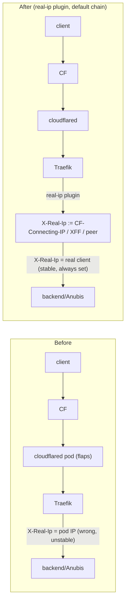
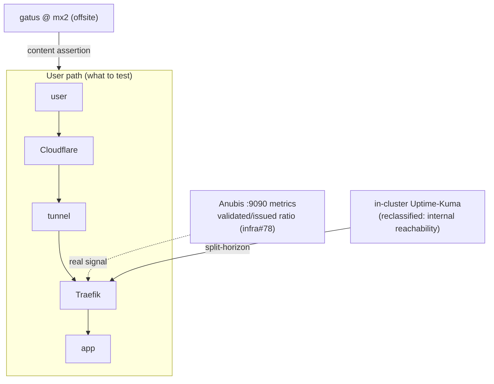
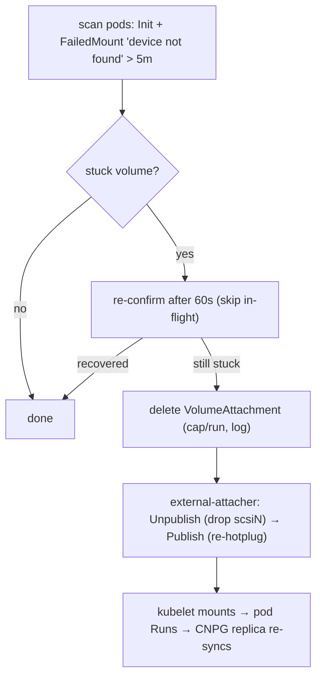

# Cluster root-cause fixes — design

- **Status:** draft (brainstorm output; awaiting review → implementation plan)
- **Date:** 2026-07-17
- **Owner:** Viktor / wizard
- **Scope:** 3 systemic fixes. Explicitly **out of scope** (deferred by decision): the sablier-un-enroll / idle-right-size safeguard class (the novelapp replicas=0 and 320Mi-OOM bites) — parked cheap-to-resume.

## Why

Five recent production issues turned out to be **four systemic root causes**, several behind more than one symptom. This spec fixes the three highest-leverage ones at the root, replacing the symptomatic patches already shipped.

| Symptom (shipped patch) | Root cause | Fix here |
|---|---|---|
| Anubis blank pages, then follow-up 500s (`drop-x-real-ip` strip) | Proxy chain never hands the backend a stable real client IP | **Fix 1** |
| Anubis breakage invisible to monitors + monitor probes *caused* the 500s | Monitoring path ≠ user path (in-cluster monitors hit the internal LB, headerless) | **Fix 2** (folds in infra#78) |
| Postgres replica down 13h (manual delete-VA) | Proxmox CSI hot-plug silently fails; detection exists, remediation doesn't | **Fix 3** |
| homepage dup tiles / broken icons; novelapp replicas=0 & OOM; TraefikDown on rolls | Unsafe factory defaults / unverified procedures / alerts model steady-state | *deferred (safer-defaults theme)* |

Post-mortems / references: `docs/post-mortems/2026-07-14-anubis-x-real-ip-cookie-flap.md`, memories on the CSI wedge and the novelapp bites, infra#78 (Anubis metrics gap).

---

## Fix 1 — Real client IP at the edge

### Problem / root cause
For Cloudflare-tunneled traffic, Traefik hands every backend `X-Real-Ip` = the **immediate peer (a cloudflared pod IP)**, which flaps per request across the 3 cloudflared replicas. The real client survives only in `CF-Connecting-IP` and `X-Forwarded-For`. Anything IP-sensitive (Anubis's cookie binding, per-IP logic, logs) is fed a wrong, unstable value. The shipped patch (`drop-x-real-ip` middleware + `strip_x_real_ip` on Anubis stacks) made Anubis fall back to XFF — but that 500s any request with neither header (in-cluster/headerless callers), so it needed a proxied-vs-non-proxied carve-out. That's per-app plumbing around a platform defect.

### Design
Vendor a small **`real-ip` Traefik local plugin** (same `localPlugins` load path as the sablier plugin in `stacks/traefik/modules/traefik/main.tf`) and add it as the **first middleware in the default `ingress_factory` chain** (`modules/kubernetes/ingress_factory/main.tf`, ahead of retry/error-pages/rate-limit/csp/auth). Per request it sets:

```
X-Real-Ip := CF-Connecting-IP            # present iff via Cloudflare (always, for proxied)
          else first public XFF entry     # direct/pfSense path (RFC1918/loopback/CGNAT skipped)
          else leave the existing value    # in-cluster/headerless: the real peer — non-empty
```

Then **remove** the `drop-x-real-ip` middleware, the `strip_x_real_ip` variable, and every `strip_x_real_ip = true` from the Anubis stacks. Anubis reads a correct, stable, always-present `X-Real-Ip` directly — the flap, the strip, and the headerless-500 hole all disappear in one place.



### Plugin selection (implementation decision)
Prefer a vetted OSS local plugin (there are mature Traefik "real IP from Cloudflare" plugins) vendored + pinned exactly like the sablier plugin (never fetched at runtime). Fallback: a ~30-line custom Yaegi plugin — the logic is trivial. The plan phase picks one; both are in-pattern.

### Error handling / edge cases
- **Non-proxied (f1, kms):** no `CF-Connecting-IP`; XFF via pfSense PROXY carries the real client → correct. If XFF is also absent, leave the peer (already the real client on the direct path).
- **In-cluster / headerless (monitors, cluster callers):** no CF/XFF → leave the peer (the caller's pod IP) → **non-empty**, so Anubis returns its 200 challenge, never a 500. This is what closes the hole the strip opened.
- **Spoofing:** the plugin only trusts `CF-Connecting-IP` (set by CF, and CrowdSec edge-blocks bypass attempts) and public XFF entries; a client-forged XFF is already the pre-existing trust model (PoW still required). No new exposure vs today.
- **CrowdSec unaffected:** proxied enforcement is at the CF edge, direct is nftables/ETP=Local — neither relies on Traefik's `X-Real-Ip` header.

### Testing / verification
- `echo` header-reflector (auth temporarily bypassed or via an authed session) shows backend `X-Real-Ip` = real client on the CF path.
- Anubis logs show `x-real-ip` = real client (not pod IP) and the cookie survives across requests (the flap A/B from the incident, now stable).
- A headerless in-cluster probe to an Anubis site returns 200 (challenge), not 500.
- A normal app (non-Anubis) is unaffected.

### Rollout / risk
**Highest blast radius in this spec** — the plugin runs on *every* ingress request. Per `planning.md` §2b, gate with **blind adversarial-challenger review** before applying, and stage: (1) plugin loaded but attached to one test ingress → verify; (2) one Anubis site → verify + drop its strip; (3) default chain fleet-wide + remove strip everywhere. Rollback = remove the middleware from the default chain (single revert); the strip removal is the last step so the known-good state is always reachable.

---

## Fix 2 — Monitoring path = user path (+ infra#78)

### Problem / root cause
The in-cluster "[External]" Uptime-Kuma monitors resolve `*.viktorbarzin.me` via split-horizon DNS to the **internal Traefik LB (`.203`)**, so they (a) never traverse the real DNS→CF→tunnel path they claim to test, and (b) arrive headerless — which both **hid** the Anubis blank-page breakage (the challenge page is HTTP 200 = "up") and **caused** the follow-up 500s. And for an Anubis site, *no* cookieless probe (Uptime-Kuma, gatus, curl) can distinguish healthy from broken on a single GET — the challenge page is the correct response for a client without a solved cookie.

### Design (three parts)
1. **gatus-on-mx2 authoritative for user-facing non-Anubis sites.** mx2 (OCI, `status.viktorbarzin.me`, ADR-0020, `stacks/backup-mx`) is a true offsite vantage. Add the key user-facing **non-Anubis** sites there with **content assertions** (body must contain a real app marker), so a blank/500/challenge page fails the check.
2. **Anubis sites → validated/issued ratio alert (this *is* infra#78).** Scrape Anubis's `:9090` metrics (`anubis_challenges_issued`, `anubis_challenges_validated`, `anubis_proxied_requests_total`) across all 7 instances and alert when `sum(rate(validated)) ≈ 0` while `sum(rate(issued))` is above the probe baseline (the incident signature: ~900 issued / 1 validated over 3 days). This is the only real health signal for Anubis sites.
3. **Reclassify the in-cluster monitors.** Rename the mislabeled "[External]" Uptime-Kuma monitors to what they are — internal reachability — so a challenge-200 never again reads as "the site works." (Fix 1 independently removes the 500s these probes were causing.)



### Error handling / testing
- gatus content-assertion tuned so a legitimate redirect/login page doesn't false-fail (assert on stable app markup).
- The validated/issued alert has a floor so a genuinely quiet site (0 issued) doesn't divide-by-zero or false-fire.
- Verify by replaying the incident: an Anubis site serving challenge-to-everything drives the ratio → 0 → alert fires; gatus on a broken non-Anubis site goes red.

### Rollout / risk
Contained (monitoring only). No user-facing blast radius. Ship gatus probes + the Anubis metrics scrape/alert first (additive), then reclassify the Uptime-Kuma monitors.

---

## Fix 3 — CSI wedge auto-remediation

### Problem / root cause
Proxmox CSI hot-plugs each PVC as a virtio-scsi disk via `qm set`; the config write can succeed while the **hot-plug into the running QEMU silently fails** (`device_add` never lands). The disk is in the VM config and the LV is intact, but the guest can't enumerate it → `NodeStage` fails `device /dev/disk/by-id/wwn-… not found` → pod stuck `Init:0/1` **forever** (the Postgres replica sat down 13h). The existing `csi-ghost-reconcile` job (`stacks/proxmox-csi/ghost-reconcile.tf`) only fixes the *inverse* — a scsiN in config with **no** VA ("ghost") — so it reports `ghosts=0` and does nothing for a wedge. The health check *detects* it (`csi_ghost_drift … wedged=N`) but nothing acts.

### Design
Extend the same `csi-ghost-reconcile` job with a **wedge pass**, keyed on the Kubernetes-level symptom (no extra Proxmox introspection needed):

- **Detect:** a pod in `Init`/`ContainerCreating` carrying a `FailedMount … device … not found` event for its PVC, persisting past a threshold (e.g. ≥5 min, i.e. past a couple of kubelet retries).
- **Remediate:** delete that PV's **VolumeAttachment** → external-attacher runs `ControllerUnpublish` (removes the stale scsiN from config) then `ControllerPublish` (fresh hot-plug, which succeeds on the retry). Exactly the manual dance that cleared the incident.
- **Reuse the job's existing safety pattern:** only `vm-9999-pvc-*` volumes; re-confirm the stuck-state after a 60s sleep (never catch an in-flight attach); cap remediations per run; log every action; scoped CSI token.



### Guards (chosen posture: auto-remediate)
Auto-remediation was chosen over alert-only. Guards keep it safe on DB-class storage: acts **only** on a pod already stuck with the exact wedge signature (never an in-use/mounted volume), re-confirms before acting, caps per run, and logs. Deleting a VA for a stuck-`Init` pod is non-destructive (volume not yet mounted; LV untouched).

### Testing / verification
- Reproduce a wedge (or replay against the known signature) and confirm the job deletes the VA and the pod recovers within one reconcile cycle.
- Confirm it does **not** touch a healthy in-use volume or a pod stuck for other reasons (image pull, quota).
- A distinct `CSIVolumeWedged` metric/alert still fires so the event is visible even after auto-heal.

### Rollout / risk
Ship with a **dry-run log-only first pass** in the same job (log what it *would* delete) for a short observation window, then flip to live — de-risks the first automated action on storage without a separate phase. Rollback = set the wedge pass back to dry-run.

---

## Cross-cutting note
Fixes 1 and 2 reinforce each other: Fix 1 makes `X-Real-Ip` always-present, which **independently removes the monitor-induced 500s** that Fix 2's reclassification would otherwise still be papering over. Do Fix 1 first.

## Verification summary (per fix)
- **Fix 1:** Anubis `x-real-ip` = real client + cookie stable; headerless probe = 200; normal apps unaffected; strip fully removed.
- **Fix 2:** incident replay drives the Anubis ratio alert; gatus catches a broken non-Anubis site; no monitor reads challenge-200 as healthy.
- **Fix 3:** injected wedge auto-heals within a cycle; healthy volumes untouched; `CSIVolumeWedged` visible.

## Out of scope (deferred, cheap-to-resume)
Safer factory defaults / unverified procedures: atomic sablier enroll-un-enroll with a post-condition replica check; a guard against right-sizing request-driven apps from idle metrics (novelapp bit twice); a lifecycle-aware TraefikDown-class alert pattern. Root causes are recorded in memory; pick up when ready.
