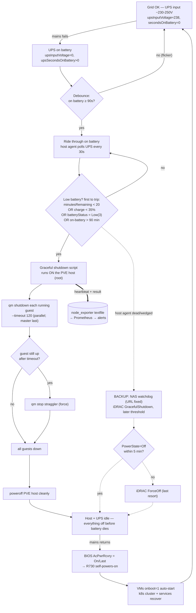

# Graceful shutdown on power loss — root cause + robust fix

- **Date:** 2026-07-18
- **Status:** DRAFT / proposal (read-only investigation; no changes applied — awaiting human review)
- **Trigger:** Grid power outage 2026-07-18 dawn. The Dell R730 (Proxmox host `pve`, `192.168.1.127`) ran on UPS battery for ~2 h and then **died hard** — no graceful shutdown of the host or its VMs.
- **Scope:** Sofia homelab. Single PVE host, no cluster/HA. UPS = Huawei UPS2000 (SNMP card `192.168.1.5` / `ups.viktorbarzin.lan`, community `‹snmp-community redacted›`). iDRAC `192.168.1.4`. Synology NAS `NAS_Barzini` `192.168.1.13`.

---

## TL;DR

The low-battery watchdog **did detect the outage and did fire on schedule** — at 05:30 it correctly computed "12 minutes remaining, turning off server" (14 min before the host died) and issued an iDRAC `GracefulShutdown`. **The shutdown had no effect** because the watchdog POSTs the Redfish reset request to the *wrong URL* — the bare iDRAC root `https://192.168.1.4` instead of the reset-action endpoint `…/redfish/v1/Systems/System.Embedded.1/Actions/ComputerSystem.Reset`. The request errored, but `main()` **discards the error**, so the failure was silent. The host never received a shutdown signal and ran until the battery was exhausted, dying uncleanly at **05:44:37**.

This was **not** a detection problem (Prometheus already fired `PowerOutage`, `OnBattery`, `LowUPSBattery` today; the NAS watchdog also detected correctly). It was an **actuation** problem in a safety mechanism that has almost certainly never worked and had zero observability. The fix moves the shutdown decision+action onto the PVE host itself (reusing the *proven* SNMP data path), does explicit `qm shutdown` per VM, and adds alerting so a broken shutdown path can never again be invisible.

---

## 1. Verdict: unclean shutdown — confirmed

| Evidence | Finding |
|---|---|
| `journalctl --list-boots` on `pve` | Boot `-1` last entry **Sat 2026-07-18 05:44:37 EEST**; next boot `0` first entry **09:33:49 EEST**. A 3h49m gap with **no shutdown sequence**. |
| `last -x` | `reboot … Sat Jul 18 09:30 - still running` with **no paired `shutdown` line** (contrast: clean reboots on Apr 1 / Jan 6 show `shutdown system down` entries). |
| PVE journal tail before the gap | Normal operational logs right up to 05:44:37, then nothing — the classic signature of power being cut mid-run, not an orderly `systemctl poweroff`. |
| NAS watchdog logs | Ran every 10 min through **05:40:02**, then a gap to **09:30:02** — the NAS lost power at the same time as the host (~05:44) and rebooted with the grid (~09:27). |

**Conclusion:** the host hard-died on battery exhaustion. No graceful shutdown occurred.

### Outage timeline (real local time, EEST)

| Time (EEST) | Event | Source |
|---|---|---|
| ~03:43 | Mains fails. UPS transfers to battery. | NAS log: last "on AC" run 03:40; first "on Battery" run **03:50** (mains dropped between 03:40–03:50). iDRAC SEL AC-loss (BMC clock +3 h skew). |
| 03:50 | Watchdog: "UPS on Battery power. **Minutes remaining is 90.** Server will not be shutdown yet." | NAS `…INFO.20260718-035001` |
| 03:46 | Prometheus `PowerOutage` fires (`ups_upsInputVoltage < 150` for 3m). | prometheus rules |
| ~04:13 | Prometheus `OnBattery` fires (`ups_upsSecondsOnBattery > 0` for 30m). | prometheus rules |
| 04:00–05:20 | Runtime estimate erratic: 99, 75, 68, 54, 60, 52, 36, 26, 20 min. | NAS logs (10-min cadence) |
| ~05:20 | Prometheus `LowUPSBattery` fires (`minutesRemaining < 25 & inputVoltage < 150`). | prometheus rules |
| **05:30:02** | Watchdog: **"Minutes remaining is too low - 12 Turning off server. Starting graceful reset type GracefulShutdown!"** → iDRAC reset **issued but ineffective**. | NAS `…INFO.20260718-053001` |
| **05:40:02** | Watchdog fires again: "…too low - 2 … GracefulShutdown!" — still no effect. | NAS `…INFO.20260718-054001` |
| **05:44:37** | Host + NAS lose power (battery exhausted). Hard death. | PVE journal last entry |
| ~09:27–09:33 | Mains returns. NAS boots 09:27; **R730 self-powers-on**, host boot 09:33:49; VMs auto-start (`onboot=1`). | uptime / journal |

The UPS held **~2 h 01 m** (03:43 → 05:44). The runtime estimate collapsed at the end (20 → 12 → 2 min over the final 20 min).

---

## 2. What exists today (two mechanisms, both non-functional for shutdown)

### 2a. NUT on the PVE host — installed but dead (red herring)

`/etc/nut/` is populated and `nut-server` (`upsd`) runs, but it is a half-finished config that has **never worked**:

- **`nut-monitor` (`upsmon`, the shutdown controller) fatally fails on every boot:**
  `Fatal error: insufficient power configured! Sum of power values: 0 / Minimum value (MINSUPPLIES): 1`. Cause: `upsmon.conf` has **no `MONITOR` line**. Service is in `failed` state (restart-looped out at boot).
- **The UPS driver can't connect:** `ups.conf` defines `[huaweiups] driver = blazer_ser port = /dev/ttyUSB0` — a **serial** driver, but there is no `/dev/ttyUSB0`: `Can't connect to UPS [huaweiups] (blazer_ser-huaweiups): No such file or directory` every 5 min.
- `SHUTDOWNCMD "/sbin/shutdown -h +0"` — even if it ran, this does **not** explicitly stop guests.

**Net:** NUT contributed nothing to the outage and misleads investigation (looks like host UPS monitoring exists). It should be either properly reconfigured (see §5 alternative) or disabled/masked so it stops failing at boot.

### 2b. Synology NAS watchdog — the real mechanism; detects fine, actuation broken

- **Source in-repo:** `scripts/server_safe_poweroff/` (Go). Built for arm64 and rsynced to the NAS (`deploy_to_nas.sh`) as `~/server-power-cycle/powercheck-armv8` (binary dated 2025-03-09).
- **Schedule:** Synology Task Scheduler task `id=1`, driven by `/etc/crontab`: `0,10,20,30,40,50 * * * *` → `synology_main.sh` → runs the binary, ships glog output to Synology's log + prunes logs >7 d. **Runs every 10 minutes; ran reliably.**
- **Logic (`main.go`, `ups_utils.go`, `idrac_utils.go`):**
  1. Read server power state via iDRAC Redfish `GET /redfish/v1/Systems/System.Embedded.1` (creds `root`/`‹default-pw redacted›`).
  2. Read UPS via SNMP `192.168.1.5` (community `‹snmp-community redacted›`, v2c): input voltage OID `1.3.6.1.2.1.33.1.3.3.1.3.1`, minutes-remaining OID `1.3.6.1.2.1.33.1.2.3.0`.
  3. If server **On** and UPS on battery (`inputVoltage == 0`) and `minutesRemaining < 20` → `performGracefulShutdown()` (iDRAC).
  4. If server **Off** and on AC and `minutesRemaining >= 20` → `performPowerOn()` (iDRAC).
- The NAS is on battery-backed power (it survived to 05:40 and died with the host at ~05:44), so **NAS availability was not the failure**.

---

## 3. Root cause (definitive)

**The iDRAC reset request is POSTed to the wrong URL, and the resulting error is silently swallowed.**

`scripts/server_safe_poweroff/idrac_utils.go`:

```go
func performResetType(idracCredentials idracCredentials, resetType ResetType) error {
    glog.Warningf("Starting graceful reset type %s!\n", resetType)   // <-- last thing logged today
    payload := map[string]string{"ResetType": string(resetType)}
    ...
    // BUG: POSTs to the bare host root, not the reset action endpoint
    req, err := http.NewRequest("POST", idracCredentials.url, bytes.NewBuffer(payloadBytes))
    //                                   ^^^^^^^^^^^^^^^^^^^  == "https://192.168.1.4"
    ...
    resp, err := client.Do(req)
    if err != nil { return fmt.Errorf(...) }                          // error path
    if resp.StatusCode != 200 && resp.StatusCode != 202 { return ... }// error path
    glog.Infof("Reset type %s initiated successfully.\n")            // <-- NEVER logged today
```

`main.go` calls it and **ignores the return value**:

```go
performGracefulShutdown(idracCredentials)   // error discarded
```

**Proof from today's logs:** at 05:30 and 05:40 the last line is `idrac_utils.go:88 Starting graceful reset type GracefulShutdown!` — the success line (`idrac_utils.go:122`) never appears, and no error is logged (because `main` drops it). The host meanwhile logged normally until 05:44 and shut down at no point → the reset action was never invoked.

**The correct endpoint** (verified live, read-only, today — creds `root`/`‹default-pw redacted›` return HTTP 200):

```
POST https://192.168.1.4/redfish/v1/Systems/System.Embedded.1/Actions/ComputerSystem.Reset
Body: {"ResetType":"GracefulShutdown"}
ResetType@Redfish.AllowableValues: On, ForceOff, ForceRestart, GracefulShutdown, PushPowerButton, Nmi
```

The code POSTs `{"ResetType":"GracefulShutdown"}` to `https://192.168.1.4` (no path). That hits the iDRAC web root, not the reset action → no reset. Because the error is discarded, the watchdog has been **failing silently since at least the current code** (git: unchanged logic since the 2025-10 move; deployed binary 2025-03). Prior outages were brief AC-flickers (per SEL history) that never reached the threshold, so this is the **first outage long enough to exercise the shutdown path — and it was broken.**

### Contributing / latent factors

1. **Silent failure + zero observability.** `main` discards the shutdown error; nothing alerts on "shutdown attempted but host still up". A safety mechanism was broken for months, invisibly.
2. **Actuation via iDRAC ACPI cascade is indirect.** Even a *correct* `GracefulShutdown` only presses the virtual power button; the host must then cascade to guests. `acpid` is **inactive** on `pve` (relies on systemd-logind default `HandlePowerKey=poweroff`), and host shutdown relies on `pve-guests` to stop VMs (per-guest timeout, can force-kill). Doing explicit `qm shutdown` on the host is more deterministic.
3. **Unreliable runtime estimate + coarse cadence.** `minutesRemaining` bounced (90→99→75→…→20→12→2); 10-min polling vs a 20-min threshold leaves only ~2 polls of margin. `upsBatteryCurrent`/`upsBatteryTemperature` read `2.147e9` (garbage, matches memory #7228). Need multi-signal thresholds + finer polling + debounce.
4. **Watchdog lives off-host, off-GitOps, undocumented.** A single hand-built binary on the NAS, not in Terraform, no runbook, no monitoring. It also shares the UPS with the host (dies with it) — fine for shutdown, but a single point of failure with no backup.
5. **NUT half-config** fails every boot and masquerades as host UPS monitoring.

---

## 4. Proposed design

**Principle:** the machine that must be protected should be the one that decides to save itself, using the data path we have *proven* works, taking the most *direct* shutdown action, and *loudly* reporting health. Keep power-on in firmware (already works). Add a second, independent last-resort layer.



### 4a. Primary — host-local shutdown agent (recommended)

- **Where:** on the PVE host as a **systemd service** (long-running loop, or oneshot + 30 s timer). Deployed the same out-of-band way as the other host scripts (`/usr/local/bin/…`, `scp`), source tracked in `scripts/server_safe_poweroff/`.
- **What:** reuse the existing Go program (static binary — no net-snmp needed on the hypervisor; `pve` has **no** `snmpget`), adding a `--local` mode that:
  - Keeps the **proven** SNMP polling (the two OIDs that read correctly today) and additionally reads `upsEstimatedChargeRemaining`, `upsSecondsOnBattery`, `upsBatteryStatus` for robustness.
  - Replaces the iDRAC drive with a **local graceful-shutdown script** (below).
  - **Fixes error handling:** never discard the shutdown result; log + retry; write a heartbeat/result metric.
  - Runs a **debounce** (≥ 90 s continuously on battery) before counting down — ignores the recurring dawn AC-flickers.
- A small shell/Python rewrite is acceptable too, but the Go static binary is the lowest-dependency fit for the hypervisor.

### 4b. Trigger thresholds (multi-signal, first-to-trip; debounced)

Trigger graceful shutdown when **any** of these holds for ≥ 2 consecutive polls, after the on-battery debounce:

| Signal (live metric) | Threshold | Why |
|---|---|---|
| `upsEstimatedMinutesRemaining` | `< 20` | Original signal; erratic, so not sole trigger. |
| `upsEstimatedChargeRemaining` | `< 35 %` | Charge % is steadier than the minutes estimate. |
| `upsBatteryStatus` | `== 3` (batteryLow) | Firmware's own low-battery flag (if populated). |
| `upsSecondsOnBattery` | `> 5400` (90 min) | Hard ride-through cap so we never gamble the last of the battery on a bad estimate. |

Rationale: the UPS gives ~2 h, so most outages ride through untouched (good — that's the point of the UPS). We only shut down when the battery is genuinely low, leaving a comfortable margin for 6 VMs + host to stop (shutdown takes a few minutes; today 14 min was available and would have sufficed). Poll every 30 s (finer than the 10-min cron) so the countdown is tracked closely.

### 4c. Graceful guest shutdown script (deterministic)

```
for vmid in <running guests, workers first, k8s-master last>:
    qm shutdown $vmid --timeout 120 &        # ACPI + guest agent (all VMs have agent:1 except pfsense→ACPI)
wait / poll qm status
for vmid still running after timeout:
    qm stop $vmid                            # force-stop stragglers
poweroff                                     # only after all guests are down
```

- All node VMs (200–205), pfsense (101), devvm (102) have `onboot=1` → auto-restart on power-on.
- All have `agent:1` except pfsense (101), which stops via ACPI. `qm shutdown` handles both.
- Explicit `qm` avoids relying on `pve-guests`/`acpid`/logind cascades.
- Single node, no corosync/HA → no fencing complications.

### 4d. Backup layer — fixed NAS watchdog as last resort (optional but recommended)

Keep the NAS watchdog for defense-in-depth, but:
- **Fix the URL** → `…/Actions/ComputerSystem.Reset`; **stop ignoring the error**; after `GracefulShutdown`, poll `PowerState` and escalate to **`ForceOff`** if not `Off` within ~5 min.
- Give it a **later** threshold than the host agent (e.g., `< 12` min / `< 20 %`) so the host agent is primary and the NAS only acts if the host agent is dead/wedged.
- Two independent triggers, same UPS, different hosts and mechanisms (local `poweroff` vs remote iDRAC `ForceOff`).

### 4e. Power-on — leave in firmware (already works)

The R730 self-powered-on when the grid returned (09:33) — the NAS watchdog's power-on path was never needed (and has the same URL bug). **Action:** verify iDRAC/BIOS **AC Power Recovery = On** (or **Last**) so this is guaranteed (the BIOS attribute couldn't be read via Redfish this session — confirm in the iDRAC UI / `racadm get BIOS.SysSecurity.AcPwrRcvry`). No software needed for power-on; VMs already `onboot=1`.

### 4f. Retire the broken NUT config

Remove or `systemctl mask nut-monitor nut-server` (and fix `ups.conf`/`upsmon.conf`) so it stops failing every boot and stops looking like working monitoring. (Or adopt the NUT alternative in §5.)

### 4g. Monitoring — close the silent-failure gap (the real systemic fix)

Detection already exists and fired today (`PowerOutage`, `OnBattery`, `LowUPSBattery` — `stacks/monitoring/modules/monitoring/prometheus_chart_values.tpl`). Add **actuation observability** so a broken shutdown path is loud:

- **Agent liveness:** the host agent writes a node_exporter **textfile** (node_exporter already runs on `pve`): `power_shutdown_agent_last_run_timestamp`, `power_shutdown_agent_last_result` (0=ok/1=fail), `power_shutdown_agent_on_battery`. Alert `ShutdownAgentStale` if the timestamp is stale.
- **Shutdown-attempt visibility:** alert `GracefulShutdownTriggered` (info, so the event shows in Slack) and — critically — `GracefulShutdownFailed`: fires if a shutdown was triggered **but the host is still up** N minutes later (exactly today's signature). Because the cluster dies with the host, this alert is best evaluated cheaply (agent result metric + external heartbeat), not from in-cluster inference alone.
- Keep thresholds consistent with the agent (alert `LowUPSBattery` at 25 min ≈ agent trigger at 20 min).

### 4h. Where each piece lives

| Piece | Location | Managed as |
|---|---|---|
| Host shutdown agent + graceful-shutdown script | `scripts/server_safe_poweroff/` (source) → `/usr/local/bin/` + `/etc/systemd/system/` on `pve` | Out-of-band host config (scp), like `nfs-mirror` etc. Documented in a runbook. |
| NAS backup watchdog (fixed) | `scripts/server_safe_poweroff/` → NAS `~/server-power-cycle/` | Out-of-band (`deploy_to_nas.sh`). |
| UPS detection alerts | `stacks/monitoring/.../prometheus_chart_values.tpl` | **Terraform** (already exists). |
| Actuation-observability alerts + textfile scrape | `stacks/monitoring/...` | **Terraform** (new). |
| Runbook | `docs/runbooks/power-loss-graceful-shutdown.md` (new) + link from `docs/runbooks/proxmox-host.md` | Git. |
| BIOS AcPwrRcvry | iDRAC/BIOS | Out-of-band; documented + verified. |

---

## 5. Alternative considered — NUT done properly (`snmp-ups`)

Instead of a custom agent, reconfigure the existing NUT on `pve`: driver `snmp-ups` against `192.168.1.5` (not the broken serial `blazer_ser`), add the missing `MONITOR` line, and a custom `SHUTDOWNCMD` that runs the graceful-guest-shutdown script. This is the standard, battle-tested homelab pattern, runs on the host, and polls continuously.

**Why it is the *alternative*, not the primary:** its low-battery detection depends on NUT's Huawei→`ups.status OB/LB` MIB mapping, which is **unvalidated** on this 2017-firmware Huawei card (memory #7228 documents multiple garbage/unpopulated registers). The specific OIDs the custom agent needs (`upsInputVoltage`, `upsEstimatedMinutesRemaining`, `upsEstimatedChargeRemaining`) **did** read correctly today, so the custom agent reuses only proven data. Recommend: if Viktor prefers the standard daemon, first validate `upsc huaweiups` reports usable `battery.charge`/`battery.runtime`/`ups.status LB` on battery (test per §6), then it becomes viable. Until then, the custom host agent is lower-risk.

---

## 6. Testing plan (safe — no real outage required first)

1. **Dry-run decision (zero risk):** run the agent in `--dry-run` against a **mock SNMP responder** (snmpsim / tiny fake) returning `inputVoltage=0, minutes=10, charge=25` → confirm it *decides* to shut down and writes the result metric, without acting.
2. **Guest-shutdown path on one VM (low risk, maintenance window):** run the graceful-shutdown logic against a **single non-critical guest** (throwaway test VM, or `devvm` in a window) — confirm `qm shutdown --timeout` → clean stop, and `qm stop` fallback works, then it restarts. Validates actuation without powering off the host.
3. **iDRAC backup path (read-only):** already verified the Reset action endpoint + AllowableValues respond (HTTP 200) — do **not** POST a reset; just confirm the corrected URL is reachable.
4. **NUT validation (if pursuing §5):** temporarily bring up `snmp-ups` and check `upsc` reports OB/LB + battery.charge/runtime on battery (can simulate by briefly running the driver while the UPS is on battery, or trust the alternative only after a real-outage observation).
5. **Full end-to-end (supervised, once, after the fix):** with fresh backups, during a window, **physically pull mains** (or trip UPS input) and watch: debounce → ride-through → threshold → `qm shutdown` all VMs → `poweroff` **before** the battery empties; then restore mains → confirm **auto-power-on** + VM `onboot`. This is the only true test of the whole chain; repeat periodically.
6. **Verify BIOS AcPwrRcvry = On/Last** so power-on is guaranteed.

---

## 7. Open questions / decisions for Viktor

1. **Primary engine:** custom host agent (recommended, reuses proven OIDs) vs NUT `snmp-ups` (standard, needs MIB validation first)?
2. **Keep the NAS backup layer** (fixed URL + ForceOff last resort), or single host-local agent only?
3. **Trigger tuning:** shut down at `< 20 min / < 35 % / > 90 min on battery` — or shut down **earlier** (bigger margin, less ride-through) given the erratic estimate?
4. **iDRAC creds:** `root`/`‹default-pw redacted›` are the Dell defaults and work today. Rotate and store in Vault (`secret/viktor`), consuming from there in both agents? (Also `‹snmp-community redacted›` SNMP community.)
5. **Retire vs repair NUT** on `pve`.

---

## Appendix A — key evidence

**Host boots (`journalctl --list-boots`):**
```
-1  9d1a7841… 2026-06-22 13:02:32 EEST → 2026-07-18 05:44:37 EEST   (hard death)
 0  db953e92… 2026-07-18 09:33:49 EEST → …                          (grid-return boot)
```

**NAS watchdog — the fire that had no effect (`…INFO.20260718-053001`):**
```
I0718 05:30:02  main.go:41] Server power state: On
W0718 05:30:02  main.go:70] UPS is on Battery power
W0718 05:30:02  main.go:72] Minutes remaining is too low - 12 Turning off server.
W0718 05:30:02  idrac_utils.go:88] Starting graceful reset type GracefulShutdown!
<end of log — no "initiated successfully", no error>
```

**Minutes-remaining trace (NAS logs, 10-min cadence):**
`03:50=90, 04:00=99, 04:10=75, 04:20=68, 04:30=54, 04:40=60, 04:50=52, 05:00=36, 05:10=26, 05:20=20, 05:30=12(→fire), 05:40=2(→fire), 05:44 dead`

**NUT on pve:** `nut-monitor` failed — `Fatal error: insufficient power configured! Sum of power values: 0` (no `MONITOR` line); driver `blazer_ser`/`/dev/ttyUSB0` → `No such file or directory`.

**iDRAC Redfish (live, read-only):** `GET …/Systems/System.Embedded.1` → HTTP 200 (root/‹default-pw redacted›), `PowerState: On`; Reset target `…/Actions/ComputerSystem.Reset`; AllowableValues `On, ForceOff, ForceRestart, GracefulShutdown, PushPowerButton, Nmi`.

## Appendix B — live UPS metrics (snmp-exporter, module=huawei, target=192.168.1.5)

| Metric | Value now (on AC) | Usable? |
|---|---|---|
| `upsEstimatedMinutesRemaining` | 324 | ✅ (dropped 90→2 during outage) |
| `upsEstimatedChargeRemaining` | 81 (%) | ✅ |
| `upsSecondsOnBattery` | 0 | ✅ (>0 on battery) |
| `upsInputVoltage{upsInputLineIndex="1"}` | 238 | ✅ (0 on battery) |
| `upsBatteryStatus` | 2 (normal) | ✅ (3 = low) |
| `upsBatteryVoltage` | 817 | ✅ |
| `upsBatteryCurrent` / `upsBatteryTemperature` | 2.147e9 | ❌ garbage |

Scraped by Prometheus (`snmp-ups` job, 30 s) as `ups_ups*`. Existing alerts: `PowerOutage`, `OnBattery`, `LowUPSBattery`, `UPSBatteryDegraded`, `UPSAlarmsActive`, `UPSOverloaded`, `UPSOutputVoltageAbnormal` — all in `prometheus_chart_values.tpl`.
