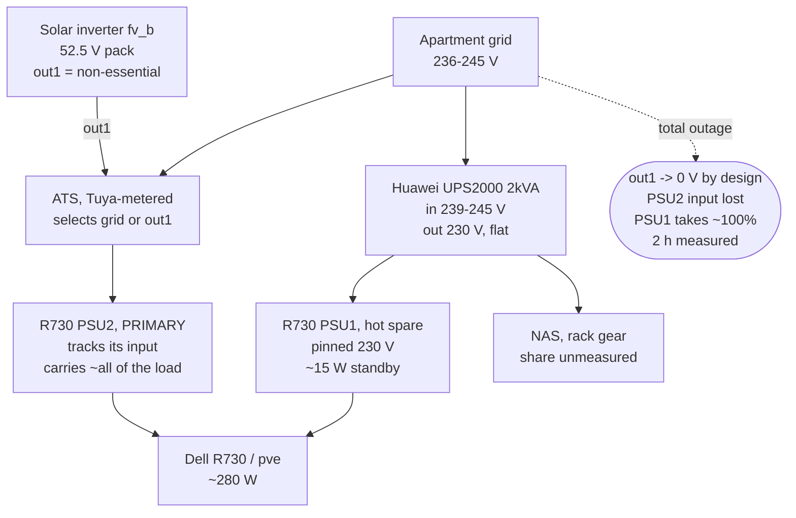
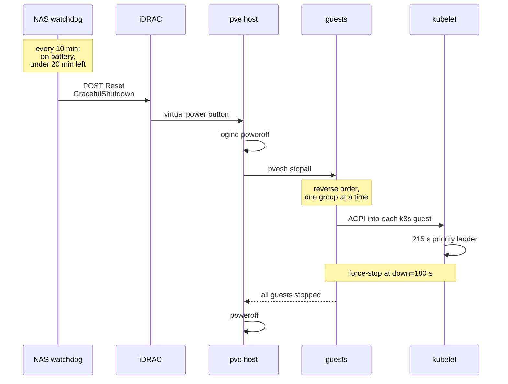

# Graceful shutdown on power loss — what is wired, what was decided, what is untested

- **Date:** 2026-07-18, rewritten 2026-09-05
- **Status:** the shutdown and power-on path is built, deployed and armed. One end-to-end drill remains, and it is parked because it needs a full estate outage that has not been scheduled.
- **Trigger:** the grid outage of 2026-07-18 (03:43 to ~09:27 EEST). The Dell R730 ran on battery for two hours and then died hard, with no shutdown of the host or its guests. Post-mortem: `docs/post-mortems/2026-07-18-sofia-power-outage-unclean-shutdown.md`.
- **Scope:** Sofia homelab. One PVE host, no cluster HA. Huawei UPS2000 2kVA (SNMP card `192.168.1.5` / `ups.viktorbarzin.lan`, community `‹snmp-community redacted›`). iDRAC `192.168.1.4`. Synology NAS `NAS_Barzini` `192.168.1.13`. Bead `code-xgcg`.
- **Bead:** `code-xgcg`.

> **This document replaces a proposal.** The 2026-07-18 draft recommended building a
> new shutdown agent on the PVE host and treating the NAS watchdog as a backup
> layer. That recommendation was rejected the next day and never built. If you came
> here looking for the host agent, read §5 first: it explains why it does not exist
> and should not be built.

---

## TL;DR

The watchdog that should have saved the host on 2026-07-18 is a Go binary on the
Synology NAS. It detected the outage correctly and fired on time. Its shutdown
command went to the wrong URL and the error was discarded, so it did nothing and
said nothing. Commit `601614d0` fixed the URL, the TLS client, and the error
handling, added a UPS-safe gate to the power-on side, and added Prometheus
metrics and alerts. That build has been deployed and armed on the NAS since
2026-07-19 and has run every ten minutes since.

Two things this rewrite settles that the original draft left open.

**Which battery feeds the server.** PSU1 sits on the Huawei UPS. PSU2, which is
the enforced primary, sits on the ATS, and the ATS selects between the apartment
grid and the solar inverter's non-essential `out1` line. That line drops to 0 V
when the building supply is gone, so a full outage takes PSU2 out by design. Every
AC-loss event in the iDRAC SEL, the 2026-07-18 outage included, names power supply
2 alone.

**Why the UPS says 5.5 hours and delivered 2.** PSU2 carries essentially the whole
server, and PSU1 idles on the UPS at roughly 15 W. When mains fails the UPS
inherits all ~280 W of it, so its load steps up by around 19x at the exact moment
its runtime estimate starts to matter. The estimate is computed from the load
before the step. Measured endurance on 2026-07-18 was 2 h 00 m 43 s against a
register that today reads 334 to 497 minutes at rest.

**What is still open.** The full chain from "iDRAC accepts the shutdown POST" to
"host is off" has never been observed on this machine, and §4 gives an arithmetic
reason to expect it does not fit inside the battery margin as currently
configured. Confirming that needs the parked drill (§7).

---

## 1. What runs today

`scripts/server_safe_poweroff/` (Go) builds `powercheck-armv8`, which is rsynced to
the NAS at `~/server-power-cycle/` by `deploy_to_nas.sh` and run from Synology's
Task Scheduler through `synology_main.sh`.

Verified live on 2026-09-05:

| Fact | Value | How it was read |
|---|---|---|
| Binary on the NAS | `powercheck-armv8`, dated 2026-07-19 14:31 | `ls -la ~/server-power-cycle/` |
| Actuation armed | yes, no `powercheck.disable` present | file listing, and `powercheck_actuation_disabled = 0` |
| Run cadence | every 10 minutes | `changes(powercheck_last_run_timestamp_seconds[24h])` = 143 |
| Last run | 2026-09-05 14:30:01 EEST, "Server On, UPS on mains (input 237V, charge 100%). Nothing to do." | `logs/powercheck-armv8.INFO` |
| Shutdown attempts since the fix | none (`last_shutdown_attempt: 0`) | `powercheck-state.json` |
| Power-on attempts since the fix | none (`last_power_on_attempt: 0`) | `powercheck-state.json` |
| Mains continuously up since | 2026-07-19 14:16 EEST, 48 days | `mains_online_since`, and `max_over_time(ups_upsSecondsOnBattery[60d]) = 0` |

The zeroes in the last three rows are the honest summary of the test coverage:
the fixed actuation code has never fired in production, because the grid has not
dropped since it was deployed.

### Thresholds in force

Flag defaults, overridden by `powercheck.env` on the NAS (mode 600, not in git).

| Setting | Effective value | Source |
|---|---|---|
| `SHUTDOWN_MIN_MINUTES` | 20 | flag default, not overridden |
| `POWERON_MIN_CHARGE_PCT` | 50 | `powercheck.env` |
| `MAINS_STABLE_DWELL_MINUTES` | 10 | `powercheck.env` |
| Pushgateway | `http://10.0.20.100:30091` | flag default |

### Observability

`main.go` pushes a gauge set to Pushgateway under `job=powercheck` on every run,
including the latched outcome of the last actuation attempt, so a failure
survives between runs. `stacks/monitoring/.../prometheus_chart_values.tpl` alerts
on: never reported, stale for 30 minutes, `powercheck_up == 0`, a failed shutdown
POST, a failed power-on POST, and shutdown issued but the server still on after
five minutes. That last one is the alert that would have caught the 2026-07-18
failure on the day it was introduced rather than years later.

One limit worth stating plainly. Pushgateway, Prometheus and Alertmanager all run
in the cluster, which runs on the host the watchdog is trying to save. Once the
host is down, none of these can report anything. Prometheus does not even hold
the record of the last outage: the TSDB has no samples between 2026-07-18 00:27
and 06:27 UTC, which is the whole on-battery window. The alerts fired at the time
(the post-mortem records them), so the most likely explanation is that the head
block was still in the write-ahead log when power was cut. Either way, in-cluster
monitoring cannot be the record of an event that kills the cluster.

---

## 2. How the power is actually wired

The bead asked which battery system feeds the R730, since the host died after two
hours while the UPS estimated 5.5. Both halves now have an answer that did not
need an outage.


```mermaid
flowchart TD
    GRID["Apartment grid<br/>236-245 V"]
    INV["Solar inverter fv_b<br/>52.5 V pack<br/>out1 = non-essential"]
    GRID --> ATS["ATS, Tuya-metered<br/>selects grid or out1"]
    INV -->|out1| ATS
    GRID --> UPS["Huawei UPS2000 2kVA<br/>in 239-245 V<br/>out 230 V, flat"]
    ATS --> PS2["R730 PSU2, PRIMARY<br/>tracks its input<br/>carries ~all of the load"]
    UPS --> PS1["R730 PSU1, hot spare<br/>pinned 230 V<br/>~15 W standby"]
    UPS --> OTHER["NAS, rack gear<br/>share unmeasured"]
    PS1 --> R730["Dell R730 / pve<br/>~280 W"]
    PS2 --> R730
    GRID -. "total outage" .-> X(["out1 -> 0 V by design<br/>PSU2 input lost<br/>PSU1 takes ~100%<br/>2 h measured"])
```

### The evidence for PSU1 on the UPS

PSU1's input voltage does not move. Everything else does.

| Sampled at | PSU1 in | UPS out | PSU2 in | ATS L1 | UPS in |
|---|---|---|---|---|---|
| now | 230 | 230 | 236 | 237 | 240 |
| 2 h ago | 230 | 230 | 236 | 236 | 239 |
| 6 h ago | 230 | 230 | 240 | 239 | 241 |
| 12 h ago | 230 | 230 | 244 | 242 | 245 |
| 24 h ago | 230 | 230 | 238 | 237 | 240 |
| 48 h ago | 230 | 230 | 242 | 243 | 245 |
| 7 d ago | 230 | 229 | 238 | 237 | 239 |

Volts. `r730_idrac_powerSupplyCurrentInputVoltage` by `powerSupplyIndex`,
`ups_upsOutputVoltage`, `ups_upsInputVoltage`,
`automatic_transfer_switch_voltage_l1_volts`.

PSU1 matches the UPS output in six of seven samples and is 1 V off in the
seventh. PSU2 stays within 2 V of the ATS across an 8 V grid swing. A regulated
UPS output holding 230 V while its own input sits 9 to 15 V higher is the
signature that separates the two feeds.

The iDRAC SEL says the same thing from the failure side. Every AC-loss event it
holds names supply 2 on its own:

```
2026-07-18T03:43:54+03:00  The power input for power supply 2 is lost.
2026-07-18T03:43:54+03:00  Power supply redundancy is lost.
2026-06-04T02:44:39+03:00  The power input for power supply 2 is lost.
2026-04-16T01:31:39+03:00  The power input for power supply 2 is lost.
2026-04-15T02:44:20+03:00  The power input for power supply 2 is lost.
```

The 03:43:54 timestamp agrees with the NAS watchdog's own logs, which show the
UPS on mains at 03:40 and on battery at 03:50, so the SEL clock is trustworthy
here. The post-mortem's note about a BMC clock offset does not apply to these
entries, which carry an explicit `+03:00`.

**Conclusion:** PSU1 is on the Huawei UPS2000 2kVA. PSU2 is on the ATS, which
selects between the apartment grid and the solar inverter's `out1` line.

This agrees with Viktor's hand-drawn wiring diagram of 2026-07-05 and with the
load-correlation work done at the time (memory #7218, #7230), which is the
stronger of the two instruments. **Identify a feed by load correlation, not by
voltage signature.** Reading the flat 230 V as "PSU1 is on the inverter" is a
mistake already made once, in July, and the readings above are corroboration
rather than the primary evidence.

Two details that follow from that diagram and matter here. `out1` carries
non-essential loads, and it drops to 0 V when the building common supply is gone,
so a total grid outage removes PSU2's input **by design** rather than by fault,
which is what the SEL entries above record. And the ATS's
`automatic_transfer_switch_voltage_battery_volts` (24.9 V) is the ATS's own DC
sensing, not a battery pack; the estate's second battery is the solar inverter's
52.5 V bank behind `out1`. What else the UPS carries beyond PSU1 is still not
inventoried.

### Why 2 hours, not 5.5

PSU2 is the primary by standing policy, enforced every 10 minutes by
`automation.r730_psu_primary_enforce_psu2` on ha-sofia since 2026-07-05. PSU1 is
a hot spare that sits on the UPS and carries almost nothing.

| Sampled at | PSU1 | PSU2 | System board | ATS meter |
|---|---|---|---|---|
| now | 0.4 A | 0.8 A | 280 W | 289.7 W |
| 6 h ago | 0.2 A | 1.0 A | 266 W | |
| 24 h / 48 h / 14 d ago | 0.4 A | 0.8 A | 280 W | |
| 7 d ago | 0.2 A | 1.0 A | 238 W | |

Read the PSU1 column with care. The iDRAC current probe quantises in 0.2 A steps,
so 0.2 A is its resolution floor rather than a measurement, and a sleeping spare's
true standby draw is closer to 15 W (established 2026-07-05 against the Tuya
meter). The ATS meter settles it from outside the server: it reads 289.7 W now
against the R730's own 280 W, and ranges 130 W to 346 W over 7 days, so the ATS
leg is carrying essentially the whole machine through PSU2.

So the transfer on mains loss is not a two-thirds shift. **The UPS goes from
holding roughly 15 W of the server to holding all ~280 W of it**, on top of
whatever else sits on it. The UPS computes `upsEstimatedMinutesRemaining` from
the load it sees at the time, which is the pre-transfer load, so the estimate is
structurally optimistic about exactly the event it is consulted for. Measured
against the one real discharge:

| | Value |
|---|---|
| Endurance measured 2026-07-18 | 2 h 00 m 43 s (03:43:54 to 05:44:37) |
| Register at rest today, 100% charge, 18% load | 334 min (watchdog) / 497 min (snmp-exporter) |
| Ratio | the register over-reads by 2.8x to 4.1x |

A load step of that size explains the direction and plausibly most of the
magnitude. Battery age and the non-linear relationship between discharge rate and
capacity would account for the rest. Neither is measured here, and the exact
on-battery load has never been observed, which is one of the things the drill in
§7 would capture.

Near empty the register behaves better. On 2026-07-18 it read 20 minutes at
05:20, 12 at 05:30 and 2 at 05:40, against a real death at 05:44:37, so in the
final half hour it under-read by 2 to 5 minutes. **Treat it as unusable above
roughly 30 minutes and roughly correct below it.** That asymmetry is what makes
the current 20-minute trigger workable at all, and it is the reason the trigger
should not be raised on the strength of the register alone.

---

## 3. The shutdown chain as it is wired

Every value below was read off the live system on 2026-09-05.


```mermaid
sequenceDiagram
    participant NAS as NAS watchdog
    participant BMC as iDRAC
    participant PVE as pve host
    participant G as guests
    participant K as kubelet

    Note over NAS: every 10 min:<br/>on battery,<br/>under 20 min left
    NAS->>BMC: POST Reset<br/>GracefulShutdown
    BMC->>PVE: virtual power button
    PVE->>PVE: logind poweroff
    PVE->>G: pvesh stopall
    Note over G: reverse order,<br/>one group at a time
    G->>K: ACPI into each k8s guest
    K->>K: 215 s priority ladder
    Note over G,K: force-stop at down=180 s
    G-->>PVE: all guests stopped
    PVE->>PVE: poweroff
```

### Confirmed at each hop

| Hop | State | Read from |
|---|---|---|
| Watchdog to iDRAC | correct Redfish action URL, `InsecureSkipVerify` client, error checked and latched | `idrac_utils.go`, `main.go` |
| iDRAC to host | ACPI "Power Button" input device present on pve | `/sys/class/input/event0/device/name` |
| Host power-key policy | `HandlePowerKey = poweroff`, `HandlePowerKeyLongPress = ignore` | `busctl get-property … login1.Manager` |
| Guest stop | `ExecStop` = `vzdump -stop` then `pvesh create /nodes/localhost/stopall`, `TimeoutStopUSec=infinity` | `systemctl show pve-guests` |
| Guest ordering | see the table below | `qm config <vmid>` on all 11 running guests |
| In-guest pod drain | 9-rung ladder, 215 s total, identical on all six nodes | live `/configz` via the apiserver proxy |
| Inhibitor window | `InhibitDelayMaxUSec = 480 s` on all six nodes, from `/etc/systemd/logind.conf.d/zz-kubelet-shutdown.conf` | `busctl` on each node |

### Guest shutdown order and per-guest ceiling

Proxmox stops guests in reverse startup order, waiting for each order group
before starting the next. Every guest here has a distinct order, so the whole
sequence is serial.

| Step | order | Guest | `down=` | Notes |
|---|---|---|---|---|
| 1 | 32 | Windows10 | 120 s | `agent: 1` |
| 2 | 31 | home-assistant | 60 s | `agent: 0`, ACPI only |
| 3 | 30 | devvm | 120 s | |
| 4 | 24 | k8s-node5 | 180 s | |
| 5 | 23 | k8s-node4 | 180 s | |
| 6 | 22 | k8s-node3 | 180 s | |
| 7 | 21 | k8s-node2 | 180 s | |
| 8 | 20 | k8s-node1 | 180 s | |
| 9 | 10 | k8s-master | 180 s | |
| 10 | 5 | docker-registry | 60 s | |
| 11 | 1 | pfsense | 60 s | `agent: 1` absent, ACPI only, stopped last |
| | | **Sum of ceilings** | **1500 s = 25 min** | |

All eleven carry `onboot: 1`, so the estate restarts by itself when the host
powers on.

### The kubelet ladder

Declared in `playbooks/k8s-node-tuning.yml` and read back today from each node's
live `/configz` rather than from the file. (This line said "reconciled hourly"
until 2026-09-05; nothing scheduled the playbook. An hourly drift CHECK,
`scripts/k8s-node-drift-check`, exists as of that date and alerts when the ladder
no longer matches — code-yypr.) All six nodes
return a byte-identical ladder (SHA-256 prefix `80ce6bfb04b3`), nine rungs,
215 s total, with `shutdownGracePeriod` and `shutdownGracePeriodCriticalPods`
both pinned at `0s` as kubelet 1.35 validation requires.

| Priority | Grace | Cumulative | Tier, per the playbook |
|---|---|---|---|
| 0 | 10 s | 10 s | apps |
| 200000 | 10 s | 20 s | apps |
| 400000 | 15 s | 35 s | edge |
| 600000 | 15 s | 50 s | gpu |
| 800000 | 90 s | 140 s | databases |
| 1000000 | 30 s | 170 s | core, Traefik drains in ~26 s |
| 1200000 | 15 s | 185 s | gpu-workload |
| 2000000000 | 15 s | 200 s | system-cluster / node critical |
| 2000001000 | 15 s | 215 s | system-node critical |

The ladder is 215 s inside a 180 s `down=` ceiling, so the last 35 s never runs
and the guest is force-stopped. That is deliberate: the design reaches the
database tier at 50 s and gives it 90 s of the budget, on the reasoning that apps
tolerate SIGKILL and databases do not. The per-tier numbers come from a full-node
drain drill on 2026-07-20, which measured a 9-minute uncapped drain and showed
kubelet consuming close to each tier's full grace in sequence rather than
short-circuiting.

**Caveat on provenance.** The 480 s logind drop-in that gives the ladder room to
run is dated 2026-07-20 on all six nodes and is not declared in any playbook. It
was placed by hand during that drill. Nothing reconciles it, so a node rebuild
would silently drop the inhibitor window back to the 5 s default and cut the
ladder short. Worth folding into `k8s-node-tuning.yml`; not done here.

---

## 4. The chain is longer than the margin

This is the open technical risk, and it is arithmetic on the numbers above rather
than an observation.

Because each k8s guest runs a 215 s ladder inside a 180 s ceiling, each of the six
consumes its full 180 s and is then force-stopped. That is a floor, not a
worst case:

| Component | Time |
|---|---|
| Six k8s guests, serial, each hitting its ceiling | 1080 s = 18 min |
| The other five guests, worst case at their ceilings | 420 s = 7 min |
| Host poweroff after the last guest | not measured |
| **Total** | **18 min floor, 25 min ceiling** |

Against the battery margin the trigger leaves:

| Scenario | Margin before battery death |
|---|---|
| Trigger fires exactly at the 20-minute threshold | ~24 min (from the 2026-07-18 curve) |
| What actually happened on 2026-07-18 | 14 m 35 s (fired 05:30:02, death 05:44:37) |

The best case is roughly the length of the chain. The observed case is shorter
than its floor. The 10-minute poll cadence is what turns one into the other: on
2026-07-18 the register read 20 at 05:20 and 12 at 05:30, so the trigger tripped
a full poll late.

Three levers exist, none of them applied here, and each wants its own change:

1. **Poll more often.** A 1 or 2 minute cadence removes up to 10 minutes of
   avoidable delay and costs nothing but Task Scheduler entries. This is the
   cheapest of the three.
2. **Collapse the k8s guests into one order group.** Giving all six nodes the
   same `startup order` shuts them down in parallel, taking the k8s portion from
   18 minutes to about 3. The cost is that they also start in parallel, which
   changes the boot behaviour the current staggered orders were chosen for.
3. **Trigger earlier.** The least attractive, because it spends ride-through on
   an estimate §2 shows is not trustworthy above 30 minutes, and because most
   outages here are short.

Whether the chain fits at all is the thing the parked drill would settle (§7).
Until then, treat "the estate shuts down cleanly on a long outage" as designed
and plumbed but not demonstrated.

---

## 5. Decisions taken

### The host-local shutdown agent was rejected and will not be built

The 2026-07-18 draft recommended moving the decision and the action onto the PVE
host, with the NAS as a backup layer. Viktor rejected that on 2026-07-18, for a
reason that holds regardless of implementation quality: **a host agent can turn
the host off but cannot turn it back on.** A powered-off host runs nothing. The
watchdog therefore has to live somewhere external that stays up, which is what the
NAS already is, and it drives the machine in both directions through iDRAC.

The work that followed fixed the NAS watchdog instead. Nothing in
`scripts/server_safe_poweroff/` runs on the PVE host, and the `--local` mode the
draft described was never written.

### BIOS AC power recovery stays ON

Commit `601614d0`'s message says the NAS watchdog becomes the sole power-on path
and that `AcPwrRcvry` should be set OFF once that path is validated. **That step
is cancelled** (Viktor, 2026-09-04). Turning it off buys nothing and makes a dead
Synology mean the server never powers on again.

The cost of keeping it on, stated plainly so nobody re-litigates this from
first principles: with `AcPwrRcvry` on, the R730 powers itself up the moment PSU2
sees mains, which is before the watchdog gets a say. The UPS-safe gate in
`handleWhenServerOff` (charge at least 50%, mains stable 10 minutes) therefore
never applies in practice, because the watchdog finds `PowerState=On` and has
nothing to do. A flapping grid can power-cycle the server on a battery that never
recharges. That is the accepted trade against the failure mode where a broken NAS
leaves the server dark indefinitely.

The gate is not dead code. It still covers the case where the server is off for
some other reason while the UPS is depleted.

**The setting's value cannot currently be read out of band.** Redfish
`/Systems/System.Embedded.1/Bios` returns an empty `Attributes` object, and
`racadm get BIOS.SysSecurity` reports no objects under the group, on iDRAC as of
2026-09-05. The behavioural evidence is strong: on 2026-07-18 the R730
self-powered-on at ~09:30 when the grid returned, at a time when the watchdog's
power-on path was broken by the same URL bug, so firmware did it. Nothing has
changed the setting since. Reading the value directly means the BIOS setup screen
at POST, or fixing whatever stops iDRAC publishing the BIOS attribute inventory.

### The NUT install on the host stays broken, and stays a red herring

Confirmed still true on 2026-09-05: `nut-monitor` is in `failed` state,
`upsmon.conf` has `MINSUPPLIES 1` and no `MONITOR` line, `ups.conf` still points
`blazer_ser` at a `/dev/ttyUSB0` that does not exist, and `upsc huaweiups`
answers `Error: Driver not connected`. `nut-server` is active and serving
nothing.

It contributes nothing and it looks like working UPS monitoring to anyone reading
the host. Masking both units, or reconfiguring the driver to `snmp-ups` against
`192.168.1.5`, would remove that. Neither is done, and neither is on this bead's
path, because the shutdown mechanism does not go through NUT.

### iDRAC credentials

Left as the Dell defaults (Viktor, 2026-07-18). They are supplied to the watchdog
through `powercheck.env` on the NAS (mode 600, not in git) rather than baked into
the binary. Rotating them into Vault remains available and unclaimed.

---

## 6. What is verified today, and how

| Claim | Verified | Instrument |
|---|---|---|
| Fixed watchdog deployed and armed on the NAS | yes | binary dated 2026-07-19, no `powercheck.disable`, `powercheck_actuation_disabled = 0` |
| Watchdog running on schedule | yes, every 10 min | `changes(powercheck_last_run_timestamp_seconds[24h])` = 143 |
| Watchdog reads both iDRAC and UPS | yes | `powercheck_up = 1`; its own log line |
| Metrics reach Prometheus, alerts exist | yes | 14 `job="powercheck"` series present; six alert rules |
| Redfish reset action URL is correct | code-reviewed, not exercised | `idrac_utils.go`; the endpoint answered 200 read-only in 2026-07 |
| PSU1 on the UPS, PSU2 on the ATS | yes | Viktor's 2026-07-05 wiring diagram and load correlation (#7218, #7230); corroborated by the 7-day voltage signature and the iDRAC SEL |
| PSU2 carries essentially the whole server | yes | ATS meter 289.7 W against the R730's 280 W |
| Runtime discrepancy explained | yes | load split, measured endurance, register comparison |
| Kubelet ladder in force on all six nodes | yes | live `/configz`, identical hash on all six |
| Logind inhibitor window admits the ladder | yes | `busctl`, 480 s on all six |
| Guest shutdown ordering and ceilings | yes | `qm config` on 11 guests |
| Host power-key policy | yes | `busctl`, `HandlePowerKey = poweroff` |
| Reset POST actually shuts the host down | **no** | needs the drill |
| Whole chain completes inside the battery margin | **no**, and §4 argues it may not | needs the drill |
| `AcPwrRcvry` value | **no**, inferred from 2026-07-18 behaviour | BIOS screen at POST |

---

## 7. The parked drill

Parked, not cancelled. Testing whether the NAS can power the server on requires
the server to be off, which is a full estate outage. It has not been scheduled.

**What it would involve.**

1. Pick a window with fresh backups and nobody depending on the estate. Everything
   in Sofia goes down: the cluster, pfSense, Home Assistant, the devvm.
2. Arm a stopwatch against `powercheck_ups_minutes_remaining` and the guest list.
3. Pull mains, or trip the UPS input. Do not shut anything down by hand.
4. Watch the ride-through. PSU2's input drops, PSU1 takes the whole load, and the
   UPS load steps up. Record the new `upsOutputPercentLoad` and how the minutes
   register moves under the real on-battery load, which is the one measurement
   nothing else can produce.
5. Let it reach the 20-minute threshold. Record when the watchdog POSTs, whether
   iDRAC accepts it, and how long after that the host starts shutting down.
6. Time each guest group as `stopall` walks the reverse order. This is the number
   §4 estimates at 18 to 25 minutes and cannot confirm.
7. Record whether the host reaches `poweroff` before the battery empties, and by
   how much.
8. Restore mains. The server should self-power-on from `AcPwrRcvry` within
   seconds, well before the watchdog's next 10-minute run. Confirm guests come
   back on `onboot`.

**What it would prove that nothing else can.**

- That the Redfish `GracefulShutdown` POST actually stops this host, rather than
  being accepted and ignored. This is the exact failure of 2026-07-18 and the only
  part of it still untested.
- The real on-battery runtime at the real on-battery load, which is the number the
  20-minute threshold should be set from.
- Whether the 18 to 25 minute shutdown chain fits, and which of the three levers in
  §4 is needed.
- That `AcPwrRcvry` is on, by observing the power-on with the watchdog unable to
  have caused it.
- Whether the estate comes back clean, or repeats the degraded cascade of
  2026-07-18 (post-mortem §4).

**Cheaper partial tests, if a full window stays out of reach.**

- Power-on only. If the host is off for any other reason, remove
  `powercheck.disable` and let the watchdog issue the `On` reset. Exercises the
  same `performResetType` code path as shutdown, which is what makes it useful.
- Single-guest stop timing. `qm shutdown` one k8s node in a window and time the
  ladder against its 180 s ceiling. Gives the per-node number that §4's floor is
  built from, without touching the host.
- Dry-run decision. `touch powercheck.disable` and point the binary at fabricated
  UPS values to confirm it decides to shut down and logs `[DRY-RUN]`.
  `decision_test.go` already covers the pure decision functions.

---

## 8. Open questions

1. **Does the chain fit?** §4 says the floor is 18 minutes against a best-case
   24-minute margin and an observed 14.6-minute one. Unresolved until the drill,
   and the most consequential thing on this page.
2. **Which lever, if it does not fit?** Faster polling is cheapest and least
   disruptive. Parallel k8s shutdown is the biggest win and changes boot
   behaviour. Preference not recorded.
3. **What else is on the UPS?** The UPS reads 18% load of 2 kVA while PSU1 draws
   roughly 92 W, so it carries more than the server. The NAS is on it (it died
   with the host on 2026-07-18 and rebooted with the grid). The rest is not
   inventoried.
4. **Should PSU2 stay the primary?** It is enforced policy since 2026-07-05, and
   it means the machine normally runs on the feed that dies first. The reasoning
   is that all the source selection and battery protection sit upstream of PSU2
   in the inverter and the ATS, so the PSU layer needs no logic of its own. Worth
   re-reading against §4 now that the shutdown budget is quantified.
5. **Should the 480 s logind drop-in be declared?** It is hand-placed on six
   nodes and reconciled by nothing. A rebuild loses it silently and cuts the
   ladder to 5 s.
6. **Retire or repair NUT on the host?** Still failing every boot, still
   misleading.
7. **Rotate the iDRAC credentials into Vault?** Available, unclaimed, and
   deliberately deferred once already.

---

## Appendix A — the 2026-07-18 failure, for reference

The mechanism, kept because it is the reason every alert in §1 exists.

`performResetType` POSTed `{"ResetType":"GracefulShutdown"}` to the bare iDRAC
root `https://192.168.1.4` instead of
`…/redfish/v1/Systems/System.Embedded.1/Actions/ComputerSystem.Reset`. The request
returned an error. `main()` discarded it. The watchdog logged the line before the
POST and nothing after, on both the 05:30 and 05:40 runs.

```
I0718 05:30:02  main.go:41] Server power state: On
W0718 05:30:02  main.go:70] UPS is on Battery power
W0718 05:30:02  main.go:72] Minutes remaining is too low - 12 Turning off server.
W0718 05:30:02  idrac_utils.go:88] Starting graceful reset type GracefulShutdown!
<end of log — no success line, no error>
```

Two further faults in the same path would each have broken it on their own: the
HTTP client had no `InsecureSkipVerify`, so it would have failed TLS against the
iDRAC self-signed certificate even with the URL right, and `performPowerOn` uses
the same function, so the power-on path was dead too. All three are fixed in
`601614d0`.

Minutes-remaining trace from the NAS logs, 10-minute cadence:
`03:50=90, 04:00=99, 04:10=75, 04:20=68, 04:30=54, 04:40=60, 04:50=52, 05:00=36,
05:10=26, 05:20=20, 05:30=12 (fired), 05:40=2 (fired), 05:44:37 dead`.

## Appendix B — live UPS registers

Read 2026-09-05 on mains, `snmp-ups` job, `module=huawei`, target `192.168.1.5`.

| Register | Value | Usable |
|---|---|---|
| `upsIdentManufacturer` / `upsIdentModel` | HUAWEI / UPS2000 2kVA | identity |
| `upsInputVoltage` | 239 V | yes, reads 0 on battery |
| `upsOutputVoltage` | 229 V | yes, the flat 230 V that identifies PSU1's feed |
| `upsOutputPercentLoad` | 18% | yes, but of a rating the card does not report |
| `upsEstimatedChargeRemaining` | 100% | yes |
| `upsEstimatedMinutesRemaining` | 334 to 497 | **only below ~30 min**, see §2 |
| `upsSecondsOnBattery` | 0 | yes |
| `upsBatteryStatus` | 2 (normal) | yes, 3 = low |
| `upsBatteryVoltage` | 815 (81.5 V) | yes |
| `upsAlarmsPresent` | 0 | yes |
| `upsConfigOutputVA` / `upsConfigOutputPower` | 0 | unpopulated |
| `upsBatteryCurrent` / `upsBatteryTemperature` | 2.147e9 | garbage, matches memory #7228 |
| `hwUpsOutputActivePowerA` | 1 to 3 | unit undocumented here, does not reconcile with 280 W |

Existing UPS alerts in `prometheus_chart_values.tpl`: `PowerOutage`, `OnBattery`,
`LowUPSBattery`, `UPSBatteryDegraded`, `UPSAlarmsActive`, `UPSOverloaded`,
`UPSOutputVoltageAbnormal`.
