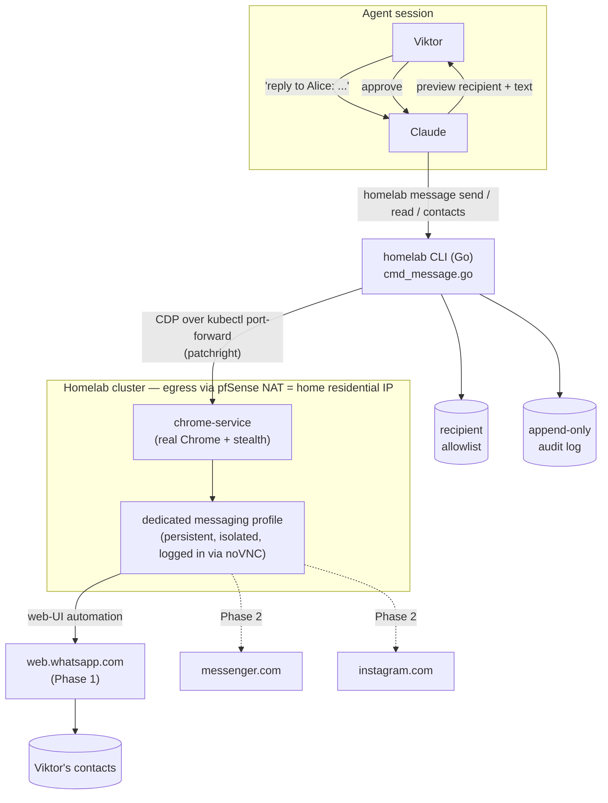
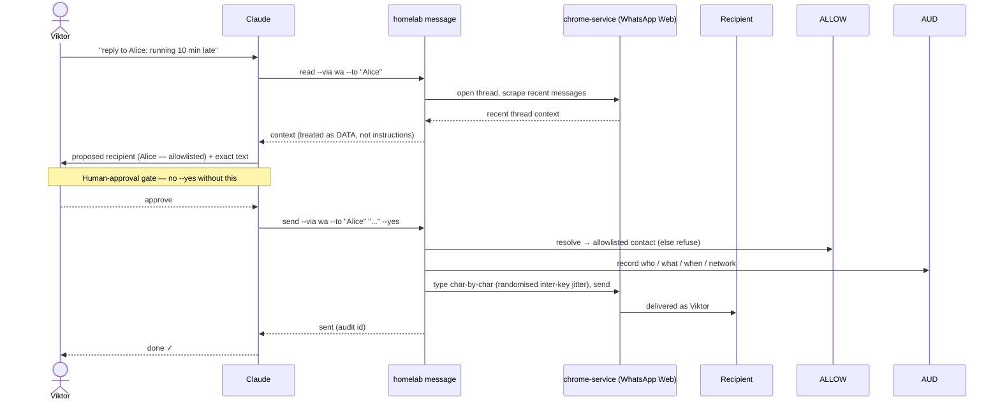

# `homelab message` — send/read personal messages as Viktor (WhatsApp → Messenger → Instagram)

- **Status:** Design — approved via grilling session 2026-07-20 (owner: Viktor). Build not yet started.
- **Owning repo:** `infra` (`cli/` + a new dedicated chrome-service profile; docs canonical here).
- **Grilled with:** `/grill-with-docs` (5 doc-research agents + 2 adversarial challengers; all load-bearing claims verified against primary sources — see References).

## TL;DR

Give the agent (Claude) the ability to **read the active thread and send messages as Viktor** to his own contacts on **WhatsApp** (Phase 1), then **Messenger + Instagram** (Phase 2), through a new `homelab message` CLI verb group.

There is **no official, terms-compliant way** to send as a *personal* account on any of the three platforms — every path is unofficial automation with a real, potentially-permanent account-ban risk. After weighing a Matrix-bridge architecture and rejecting it, the chosen mechanism is **browser automation of the real web clients via the existing chrome-service**, driven on-demand, from Viktor's home residential IP, with a **human-approval gate on every send**, a **recipient allowlist**, a **read/send injection firewall**, human-paced sending, and an audit log.

> ⚠️ **Accepted residual risk.** Automated sending from an unofficial client keeps a real, non-deterministic, potentially **permanent and irreversible** ban risk (a WhatsApp ban can lose all chat history/contacts). The guardrails below *reduce* this risk; they do not eliminate it. Viktor has accepted this for his real accounts, kept low-volume and warm. This was recommended *against* for a personal account and chosen anyway with eyes open.

## Goal & scope

**In scope**
- Interactive use: Viktor asks the agent to reply/send to a contact; the agent reads recent thread context, composes, Viktor approves, it sends **as Viktor**.
- Warm, existing contacts only; low volume; human-paced.
- Read the **active thread** for context, on demand (no synced inbox).

**Out of scope (explicitly)**
- Cold outreach / messaging strangers (highest ban risk; Instagram's official API forbids it anyway).
- A synced unified inbox / always-on mirror of all conversations.
- Unattended/automated/scheduled sending with no human in the loop.
- Bulk messaging of any kind.

## The hard reality (verified 2026-07)

No platform lets you send as your **personal** account and initiate a conversation via an official API:

| Platform | Official API for personal-you? | Why not |
|---|---|---|
| **WhatsApp** | ❌ | Cloud API needs a *separate* business number (registering kills the number's normal-app use), is template-gated, opt-in-only, cannot cold-contact, and is not free. |
| **Messenger** | ❌ | Page/business-only since 2015; the personal-profile chat API (XMPP) was shut off 2015. No personal-profile Send API exists. |
| **Instagram** | ❌ | Messaging API is reply-only inside a 24 h window (cannot *initiate*), requires a **Professional** account (which forces the account **public**), capped 200 msg/hr. |

So any "send as me" path is an unofficial client. The realistic families, all ToS-violating:
- **Protocol libraries** — `whatsmeow` (Go; the engine behind `mautrix-whatsapp` and Beeper), Baileys (Node), instagrapi (IG private mobile API).
- **Matrix bridges** — `mautrix-whatsapp`, `mautrix-meta` (one bridge covers Messenger **and** Instagram via the web-app API).
- **Browser automation** — driving the real web clients (`web.whatsapp.com`, `messenger.com`, `instagram.com`).

**Ban-risk evidence that shaped the design:**
- A `mautrix-whatsapp` user with *our exact profile* — *"only a few messages a day, all friends and family"* — was **permanently banned** (mautrix/whatsapp #792, closed & locked). "Warm + low-volume = safe" is **not** reliable.
- `mautrix-meta` documents Meta "suspicious activity" blocks/checkpoints as expected behaviour; ~15+ users reported them (mautrix/meta #44). **Instagram is the most ban-aggressive** of the three.
- Meta ban *waves* (Mar 2026) hit even ordinary users with **no working appeal**. Worst case is permanent, uncontestable account loss.
- The single biggest ban lever is **egress IP** and **behaviour**: a warm session on a **residential** IP at human pace is the lowest-risk profile; datacenter IPs are flagged near-instantly. The homelab egresses via home pfSense NAT = residential home IP. ✅

## Key decisions

| # | Decision | Choice | Rationale |
|---|---|---|---|
| 1 | Use case | Interactive send/reply to *my* contacts, on request; warm, low-volume | Lowest-risk profile; matches "send as me". |
| 2 | Read scope | Active thread for context, on demand — **no synced inbox** | Only enough to reply in context. |
| 3 | Accounts | Real personal accounts; residual ban risk accepted | "As me to my contacts" ⇒ burners are pointless. |
| 4 | Architecture | **Browser automation via chrome-service** | See below — pivoted away from Matrix bridges. |
| 5 | Addressing | Fuzzy contact-name match **gated by an allowlist**; multi-match → list & pick | Natural to drive; allowlist kills wrong-recipient. |
| 6 | Send gate | **Human approval on every send**; `--dry-run`; append-only audit log; **no unattended `--yes`** | Sends are irreversible and often agent-composed. |
| 7 | Send model | **Agent sends** via browser automation (not draft-only) | Viktor's informed choice; guardrails below. |
| 8 | Rollout | **WhatsApp first**, then Messenger + Instagram | Prove ergonomics on one; IG reassessed last. |

### Why not the alternatives (options considered)

| Option | Verdict | Why rejected |
|---|---|---|
| Official platform APIs | ✗ | Cannot send as personal-you / cannot initiate (see reality table). |
| **Matrix bridges** (`mautrix-meta` + `mautrix-whatsapp` on existing tuwunel) | ✗ | Bridges are an **always-on full-inbox sync engine** — there is *no* on-demand history fetch, so "read the active thread" is inseparable from the synced inbox we ruled out (decision 2). Unencrypted portals store **all DMs in cleartext** in tuwunel + bridge DBs on shared homelab infra (E2EE can't rescue it on tuwunel); the mautrix maintainer won't support non-Synapse homeservers (standing breakage risk). Attaches to tuwunel v1.7.1 *today* (the `whoami` blocker #219 is fixed), but wrong-shaped for the need. |
| `whatsmeow`-direct in the Go CLI | ◑ (recommended runner-up) | Same engine as the bridge, minus the homeserver/appservice/inbox; isolated Vault-secured session, real JIDs. Rejected only because Viktor preferred the real-browser fingerprint of browser automation. |
| Draft-only (agent drafts, Viktor sends from phone) | ◑ (safest; not chosen) | The **only** path with near-zero ban risk (send leaves the genuine device). Rejected because it doesn't literally "let the agent send". |

**Why browser automation was chosen** (Viktor's call): the real web client in the warm, human-logged-in chrome-service profile on the home IP is the best *client-fingerprint* camouflage of the automated send options, and reading a thread is genuinely **on-demand** (open it, scrape it) with **no inbox mirror** — honouring decision 2 and dropping the Matrix homeserver/plaintext-corpus problems entirely. Trade-offs accepted: **DOM-fragility** (breaks on web-UI changes) and shared-identity-browser exposure (mitigated below).

## Architecture



**Components**
- **`homelab message` (Go)** — a new verb group appended to `buildRegistry()` in `cli/homelab.go`, backed by `cli/cmd_message.go`. Reuses the existing `homelab browser` machinery (patchright CDP client, `browser.go`) to drive chrome-service; talks to it over `kubectl port-forward` to `svc/chrome-service:9222`.
- **chrome-service** — existing real-Chrome service (codec-capable, stealth.js, persistent profile warmed by manual noVNC login). Egress is the cluster's pfSense NAT = **home residential IP** (the key ban-avoidance lever).
- **Dedicated messaging profile** — a persistent browser context isolated from the shared identity/reel-ingest profile (hardening; see below). Assumed to always hold a logged-in session (Viktor logs in via noVNC).
- **Allowlist + audit log** — config + append-only log the CLI consults/writes on every operation.

## Send flow (the human-approval gate)



## Safety model

1. **Human approval on every send.** The agent shows Viktor the resolved recipient + exact text; Viktor approves in-chat; only then does it send. The CLI defaults to preview+confirm; `--yes` exists **only** to be passed *after* that in-chat approval. **No unattended, scheduled, or batch sending** — ever.
2. **Recipient allowlist.** Sends only reach contacts on an explicit allowlist. A fuzzy name lookup must resolve to an allowlisted entry, displayed for confirmation. Eliminates wrong-recipient (a top mis-send mode with fuzzy matching).
3. **Read/send separation (prompt-injection firewall).** Incoming message text is untrusted **data**, never instructions; a send is never fired in the same step as reading unread incoming content. This defends against indirect prompt injection (OWASP LLM-risk #1) via a contact's message steering a reply/send.
4. **Human-paced, low volume, warm-only.** Randomised delays, a low daily send cap (warn/block above it), existing contacts only. This is the lever that maps to platform behavioural detection.
5. **`--dry-run`** resolves the recipient and prints the message without sending.
6. **Append-only audit log** of every send (recipient, network, text hash/preview, timestamp), shipped to Loki like other logs.
7. **Human-like typing (anti-bot-detection).** Messages are typed **character-by-character with a non-deterministic inter-keystroke delay** — never instant-pasted (an instant full-string fill is itself a bot tell). Delays are drawn from a realistic, right-skewed distribution rather than a constant: an illustrative base of ~60–150 ms/char with per-character jitter, **longer pauses after spaces and punctuation** (word/sentence boundaries), occasional rare "thinking" pauses, plus small randomised delays **before** starting to type and **before** pressing send. Implementation note: Playwright/patchright's built-in per-key `delay` option is a *fixed constant* — insufficient; the jitter must be applied in a per-character loop (`pressSequentially` / `keyboard.type` with a randomised sleep between characters). Parameters are illustrative and tuned at build time.

> **Honest scope:** keystroke jitter defends against *client-side* input-behaviour fingerprinting (Meta's web apps are heavily instrumented). It does **not** move the dominant ban levers — message volume, egress IP, and warm-vs-cold recipients — so it is defence-in-depth layered on §4, not a safety upgrade on its own.

## Isolation (mitigating shared-browser exposure)

chrome-service is a **single identity profile** that other jobs (e.g. reel-ingest) and — subject to RBAC — other cluster users can drive; anyone reaching CDP hits `browser.contexts[0]`. Putting personal WhatsApp/FB/IG logins there widens exposure. **Mitigation:** a **dedicated persistent messaging profile/context**, access-gated, separate from the general identity browser, so the messaging sessions are not in the shared context.

> **Current state (2026-07-20):** Viktor has already logged a session into the *shared* profile. Phase 1 can start against it immediately; **migrating to the dedicated profile is a Phase-1 hardening step**, not a blocker.

## CLI surface

```
homelab message contacts --via wa [--search <q>]        # list/search allowlisted contacts
homelab message read     --via wa --to "Alice" [--limit N]   # read recent thread, on demand
homelab message send     --via wa --to "Alice" "text"   # preview + confirm → send
                                                        #   --dry-run : resolve + print, no send
                                                        #   --yes     : skip prompt (only after in-chat approval)
```
- `--via`: `wa` (Phase 1), then `messenger`, `ig` (Phase 2).
- Tiers (existing CLI `Tier` field): `read`/`contacts` = read; `send` = write.
- Implementation modelled on `cmd_browser.go` (drives chrome-service) rather than `cmd_memory.go` (HTTP client).

## Rollout

- **Phase 1 — WhatsApp.** `send` / `read` / `contacts` against `web.whatsapp.com` via the dedicated profile, with the full safety model. Prove reliability + ergonomics. Establish the DOM-selector maintenance pattern (expect periodic breakage).
- **Phase 2 — Messenger + Instagram.** Same mechanism against `messenger.com` / `instagram.com`. **Reassess Instagram last** — it is the most ban-aggressive; consider draft-only for IG specifically.
- **Ongoing.** Selector-drift monitoring; keep volume low; watch WhatsApp's Linked-Devices list (the automated session appears there; the phone must come online at least once every 14 days to keep companion devices linked — trivially satisfied by normal use).

## Residual risks (accepted) & adversarial findings

- **Permanent ban / account loss** — real, non-deterministic, mitigated-not-eliminated (mautrix/whatsapp #792). Worst case: irreversible loss of WhatsApp history/contacts or FB/IG lockout with no appeal.
- **DOM-fragility** — the transport breaks when Meta/WhatsApp change their web UI; recurring repair toil is expected and owned.
- **AI-as-sender** — wrong-recipient, off-tone/hallucinated content, prompt injection, irreversibility. Mitigated by human-approval + allowlist + read/send separation; **not** by `--yes` used without a human.
- **Shared-browser exposure** — mitigated by the dedicated messaging profile (Phase-1 hardening).
- **Ethics/consent** — recipients aren't told a message may be agent-composed; a human (Viktor) is the author-of-record on every send (approval gate), which is the defensible posture. (EU AI Act Art. 50 transparency norms apply from Aug 2026; personal/household use likely exempt, noted not resolved.)

## Glossary

- **Send as me / puppeting** — a message that leaves as Viktor's own account, indistinguishable to the recipient from one he typed.
- **Warm contact** — someone Viktor already has an existing conversation/thread with (low-risk recipient).
- **Identity browser** — the shared, single-profile chrome-service instance warmed with Viktor's manual logins.
- **Dedicated messaging profile** — an isolated persistent browser context used only for `homelab message`.
- **Human-approval gate** — the in-chat step where Viktor approves the exact recipient + text before any send.
- **Injection firewall** — the rule that incoming message content is data, never instructions, and never triggers a send in the same step it is read.
- **Allowlist** — the explicit set of contacts the CLI is permitted to send to.

## Build follow-ups (for the execution phase)

1. `cli/cmd_message.go` + `messageCommands()` wired into `buildRegistry()`; bump `cli/VERSION`.
2. WhatsApp Web automation script (open/search thread, scrape recent, compose, send) via chrome-service — including a **human-like typing engine**: per-character jittered inter-keystroke delays (right-skewed, longer at word/punctuation boundaries, pre-type + pre-send pauses), NOT the fixed Playwright `delay`.
3. Allowlist config + append-only audit log (→ Loki).
4. Dedicated persistent messaging profile in chrome-service (hardening); migrate the logged-in session off the shared profile.
5. Tests (contact resolution, allowlist refusal, dry-run, audit-log write); selector-drift smoke check.
6. Phase 2: `messenger` + `ig` verbs; Instagram reassessment.

## References

- WhatsApp Cloud API constraints — developers.facebook.com/documentation/business-messaging/whatsapp (business number, templates, 24 h window, pricing).
- Messenger Platform (Page-only) — developers.facebook.com/docs/messenger-platform; XMPP shutdown 2015.
- Instagram Messaging API (reply-only, Professional/public) — developers.facebook.com/docs/instagram-platform/instagram-api-with-instagram-login/messaging-api.
- `whatsmeow` — github.com/tulir/whatsmeow (engine behind mautrix-whatsapp / Beeper).
- `mautrix-whatsapp` ban report (our profile) — github.com/mautrix/whatsapp/issues/792; auth caveats — docs.mau.fi/bridges/go/whatsapp/authentication.html.
- `mautrix-meta` suspicious-activity blocks — github.com/mautrix/meta/issues/44; auth — docs.mau.fi/bridges/go/meta/authentication.html.
- `whatsapp-web.js` "not totally safe" — github.com/pedroslopez/whatsapp-web.js.
- tuwunel appservice support / `whoami` fix #219 — matrix-construct.github.io/tuwunel/appservices.html, github.com/matrix-construct/tuwunel/issues/219.
- Meta 2026 ban wave (no appeal) — piunikaweb.com/2026/03/28.
- Prompt injection (OWASP LLM01) — genai.owasp.org/llmrisk/llm01-prompt-injection.
- chrome-service — `infra/docs/architecture/chrome-service.md`.
