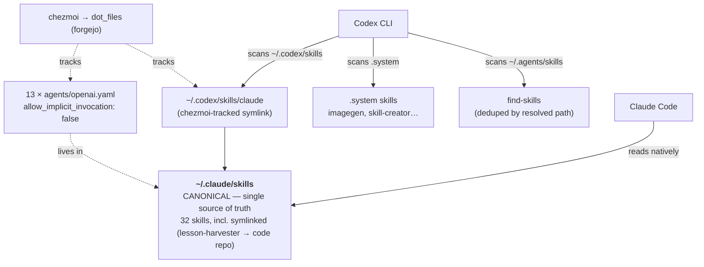

# Claude Code ⇄ Codex — one shared skill set on the devvm

> Status: done · grilled + executed 2026-07-24 · Owner: wizard
> Scope: `wizard@devvm` — `~/.claude`, `~/.codex`, and the chezmoi `dot_files` repo.
> Goal: Claude Code and Codex sessions read the **same** skills, with **no
> duplication**, and stay in sync **automatically** — porting the architecture
> Viktor uses on another (Meta) machine, adapted to what this devvm actually runs.

## TL;DR outcome

A **single symlink** — `~/.codex/skills/claude -> ~/.claude/skills` — makes Codex
see every one of Claude's 41 skill entries. Codex **dedups by resolved path**, so
nothing is duplicated even though it also natively scans `~/.agents/skills`. Thirteen
user-invoke-only skills got a Codex policy file so they stay `$skill`-invocable but
don't auto-fire. The bridge is tracked in chezmoi (portable symlink) so it survives
re-provisioning and replicates to other machines. Zero skill migration.

## Why the Meta-machine doc couldn't be ported verbatim

The pasted architecture assumed a Meta box; this devvm differs in three ways that
would have created a *second, conflicting* skills mechanism (the opposite of the
"no duplication" goal):

| Meta doc assumed | This devvm actually has |
|---|---|
| Canonical skills in `~/.claude/skills` | Fleet convention is `~/.agents/skills` (provisioner) — but wizard's skills already live as real dirs in `~/.claude/skills`, so `~/.claude/skills` **is** the pragmatic canonical here |
| `~/.llms/skills/claude-templates` meta-hook bridge | `~/.llms` doesn't exist; nothing consumes it → **dropped** |
| agent-market double-symlink layer | No `~/.claude/agent-market` here → **dropped** |
| DotSync replicates `.claude/.codex/.llms` | Sync is **chezmoi** (`dot_files` on forgejo) + the infra provisioner → used chezmoi instead |

## Architecture (final)

## Decisions (from the grilling)

| # | Question | Decision |
|---|---|---|
| 1 | Canonical skills home | `~/.claude/skills` (port Meta pattern; near-zero migration) |
| 2 | Scope | Skills **+** a CLAUDE.md scaffold |
| 3 | Instruction depth | Minimal scaffold, **no meta/org context** (no `@AGENTS.md` import) |
| 4 | Persistence | Live **+** chezmoi-tracked (reproducible via `chezmoi apply`) |
| 5 | Invoke policy | Generate `openai.yaml` for all **13** user-invoke-only skills |
| 6 | Stale source CLAUDE.md | Fix it repo-wide too (drop the retired-MCP-memory mandate) |

## What was executed

1. **Bridge (live):** `ln -sfn ~/.claude/skills ~/.codex/skills/claude`.
2. **Invoke-policy parity:** `agents/openai.yaml` (`policy.allow_implicit_invocation: false`
   + `interface.display_name`/`short_description`) added to the 13 user-invoke-only skills
   (grill-me, grill-with-docs, handoff, implement, teach, triage, wayfinder, to-spec,
   to-tickets, improve-codebase-architecture, ask-matt, setup-matt-pocock-skills,
   writing-great-skills). Inert for Claude (it ignores `openai.yaml`).
3. **CLAUDE.md scaffold (live):** minimal `~/.claude/CLAUDE.md` — a `## Claude Code only`
   section + a breadcrumb; **no** `@AGENTS.md` import (would double-inject the org policy
   that managed-settings already provides).
4. **Shield it:** `.claude/CLAUDE.md` added to the `devvm` block of chezmoi's
   `.chezmoiignore`, mirroring how `settings.json` is handled.
5. **Track + push:** `chezmoi add` the bridge (as a homeDir-templated
   `dot_codex/skills/symlink_claude.tmpl`) and the 13 `openai.yaml`; committed to the
   `dot_files` repo, staging only those files by name (no bulk add — avoids leaking
   internal skill content like `email`/`tripit-cli` into the repo).
6. **Repo-wide fix:** the stale `dot_claude/CLAUDE.md` (which mandated the **retired**
   `memory_store`/`memory_recall` MCP tools) was corrected so no machine is misled on
   `chezmoi apply`.

## Verification (evidence)

- **Bridge discovery proven** with a throwaway probe: Codex finds a skill through a
  symlinked depth-2 subdir of `~/.codex/skills`.
- **Full parity, no dup:** through the bridge Codex listed **41** entries; `find-skills`
  (reachable via both `~/.agents/skills` and the bridge) appeared **exactly once**.
- **Policy honored through the bridge:** after adding the 13 `openai.yaml`, Codex's
  implicit skill list dropped **41 → 28** (exactly the 13 removed); `grilling`, `email`,
  `tripit-cli`, `publish-plan`, etc. remained. The 13 stay explicitly `$skill`-invocable.
- **Claude unaffected:** its `SKILL.md` frontmatter is untouched; `openai.yaml` sits in
  an `agents/` subdir Claude ignores.
- **chezmoi:** templated symlink renders to `/home/wizard/.claude/skills`; `chezmoi verify`
  passes; `.claude/CLAUDE.md` is ignored on devvm. Commit `bac57f0` pushed to `dot_files`.

## Explicitly out of scope / deferred

- No skill migration; `~/.agents/skills` left untouched (dedup makes it harmless).
- No `~/.llms` / agent-market layers.
- **Full instruction parity** (making `AGENTS.md` carry the homelab/execution/planning
  rules for Codex, via infra's `refresh_codex_mirror`) stays deferred — that is the
  separate, drafted plan #9863.

## Note on re-provisioning & other machines

The infra provisioner only writes `~/.codex/AGENTS.md`; it never touches
`~/.codex/skills`, so it will not wipe the bridge. chezmoi is **not** auto-applied on
the devvm (it is a push-only backup here), so the bridge persists as a live symlink;
other machines pick it up on their next `chezmoi apply`. **Restart open Claude/Codex
sessions** to load the new skill set and policies.
