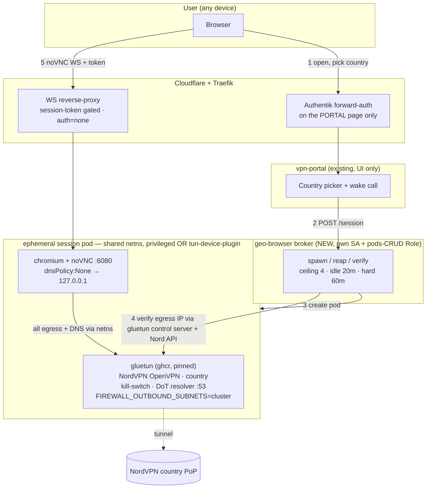

# Geo-Browser — browse from any country via NordVPN

**Status:** Draft (grilling session, 2026-07-24) · **Owner:** Viktor
**Committed first step:** Phase-0 spike (browser-only, one hardcoded country)
**Adversarially reviewed:** two blind challenger agents (findings folded in below)

---

## Goal

A self-service way for Viktor + a few trusted people to open a **remote web
browser** — and, later, a proxy — whose internet traffic egresses through a
**NordVPN tunnel in a country of their choice**, established **dynamically on
demand** and torn down when idle. Reuses the existing NordVPN subscription and
the homelab cluster at **zero new cost**. Zero client config: it's just a web
page, usable from any device including locked-down ones.

## Scope (decided in grilling)

- **Phase 0 — SPIKE (committed):** prove the risky core in isolation before any
  broker/portal. One hand-launched pod, one hardcoded country, verify egress +
  no leaks + noVNC reachability. Details below.
- **Phase 1 — on-demand ephemeral browser (designed, build after spike):**
  country picker in `vpn-portal` → broker → egress-verified session → per-session
  noVNC → idle-reaped → ≤4 concurrent.
- **Deferred (out of scope now):** public proxy surface (SOCKS5/Shadowsocks),
  subscription-URL integration, persistent per-user profiles, warm pool, the
  WireGuard/NordLynx speed option.

## Decisions (resolved in the interview)

| # | Decision | Choice | Why |
|---|----------|--------|-----|
| 1 | Audience | Viktor + a few trusted people, Authentik-gated | Contains ToS/abuse to personal use; fits the connection cap |
| 2 | Delivery surface | Both eventually; **browser first** | Browser = zero-config anywhere; proxy = native speed (deferred) |
| 3 | Tunnel protocol | **OpenVPN + service credentials** | Stable creds; avoids NordLynx key-extraction fragility (#8307/#8308) |
| 4 | Provisioning | **On-demand + idle-teardown** | Matches "dynamic"; only active countries consume resources |
| 5 | Selection / wake | **Portal-driven** (vpn-portal UI) | One Authentik-gated surface = picker + wake; no always-on router |
| 6 | Proxy reachability (deferred) | Public WAN endpoints | Consistent with existing OCI-exposed proxies |
| 7 | Browser state | **Ephemeral per session** | Privacy + isolation; nothing to back up |
| 8 | Concurrency ceiling | **4 concurrent** (self-imposed resource limit) | See correction below — NordVPN's real cap is 10, so 4 is headroom, not the Nord limit |
| 9 | Home | vpn-portal = UI; **separate RBAC'd broker** = pod spawner | vpn-portal has no k8s RBAC; broker must own pod-CRUD (like chrome-broker) |

## Adversarial review — what broke and how the design changed

Two blind challengers were briefed to *disprove* the design against the real
cluster. Five of the load-bearing claims changed the design:

1. **NordVPN SOCKS5 is dead (Feb 2025).** The "simplest" alternative — Chromium
   `--proxy-server=socks5h://…nordvpn…` with no tunnel — **is impossible**;
   NordVPN retired proxy servers. → We **must** run a real tunnel (OpenVPN).
2. **`/dev/net/tun` has zero in-cluster precedent and won't work with `NET_ADMIN`
   alone.** The device cgroup denies `open()` → `Operation not permitted`. It
   needs **`privileged: true`** (via the Kyverno namespace exclude-list, the
   `android-emulator` pattern) **or** a **`generic-device-plugin`** DaemonSet
   advertising tun (no privileged, but a new cluster component). WireGuard here
   uses `SYS_MODULE`+kernel netdev, *not* tun — not a precedent.
3. **DNS leak, confirmed live.** The Chromium container's `/etc/resolv.conf`
   points at CoreDNS `10.96.0.10`; gluetun can't rewrite a sibling container's
   resolv.conf. → Browser resolves via home WAN IP (leak + home-geo answers).
   **Fix:** pod `dnsPolicy: None` + `dnsConfig.nameservers: ["127.0.0.1"]` so both
   containers use gluetun's in-netns DoT resolver. (Own the `dns_config` +
   `ignore_changes` to survive Kyverno ndots injection.)
4. **Kill-switch drops replies to kubelet probes and the noVNC proxy.** gluetun's
   default-DROP OUTPUT blocks the reply packets to in-cluster callers. **Fix:**
   `FIREWALL_OUTBOUND_SUBNETS` = pod CIDR `10.10.0.0/16` + svc CIDR
   `10.96.0.0/12` + node subnet. (Must be paired with the DNS fix, or the leak
   returns.)
5. **noVNC-over-WebSocket cannot sit behind Authentik forward-auth** — the
   `android-emulator` stack sets its noVNC paths to `auth = "none"` precisely
   because "Authentik would break the noVNC websocket flow." → The portal page is
   Authentik-gated, but the **per-session WS is gated by a session token at the
   proxy layer**, not Authentik. Per-session dynamic WS fan-out is **net-new**
   build (the pool exposes only CDP:9222; human noVNC exists only on the singleton
   master pod). Also carry noVNC's rate-limit bump.

**Corrections to the concurrency model:** NordVPN's real limit is **10** (not
"the reason for 4"), and an over-limit connection is **refused with a ~10-min
cooldown**, not silently dropped. So **4 is a self-imposed cluster-resource
ceiling well under 10** — we never hit Nord's cap. The broker must **never
evict-then-instantly-reconnect** expecting a freed Nord slot, must handle
`AUTH_FAILED` with backoff, and must **diversify server/protocol per session**
(two same-country OpenVPN sessions can collide on one server).

**Survived unchanged:** OpenVPN + service credentials is current and correct
(but **pin the gluetun image** — `:latest` ships an OpenVPN 2.6.20 that rejects
NordVPN's `handshake-window`, gluetun #3306 — and refresh the server list
periodically). Egress verification is feasible **via gluetun's control server
`GET /v1/publicip` + NordVPN's own API** (`web-api.nordvpn.com/v1/ips/info`),
not flaky generic geo-IP. Netns-share is proven (the chrome pod already runs 3
containers). IPv6 leak is moot (single-stack IPv4 cluster).

## Architecture (final — tunnel route)



```mermaid
sequenceDiagram
    participant U as User
    participant P as vpn-portal
    participant B as broker
    participant K as apiserver
    participant Pod as session pod
    participant N as NordVPN
    U->>P: pick "Japan" (Authentik-gated page)
    P->>B: POST /session {country, owner}
    B->>B: capacity check (≤4; reap idle first, no evict-reconnect race)
    B->>K: create privileged/tun pod [gluetun(JP,OpenVPN)+chrome-novnc]
    Pod->>N: OpenVPN handshake (service creds)
    N-->>Pod: tunnel up · kill-switch armed · DoT resolver up
    B->>Pod: GET gluetun /v1/publicip → verify ∈ Japan (Nord API)
    B-->>P: ready + per-session token
    P-->>U: redirect to WS proxy /s/<token>
    U->>Pod: noVNC WS (token-gated at proxy, NOT Authentik)
    Note over B,Pod: idle 20m / hard 60m → reap
```

## Required-fixes checklist (baked into the build)

- [ ] gluetun image from **ghcr**, **pinned** (not `:latest`); periodic
      `gluetun update -providers nordvpn` server-list refresh.
- [ ] Tun access: **privileged + Kyverno ns exclude** (spike/fast) **or**
      **generic-device-plugin** (production/no-privileged) — decide after spike.
- [ ] `dnsPolicy: None` + `dnsConfig → 127.0.0.1` + `ignore_changes[dns_config]`.
- [ ] `FIREWALL_OUTBOUND_SUBNETS = 10.10.0.0/16,10.96.0.0/12,<node subnet>`.
- [ ] Egress verify via gluetun control server + `web-api.nordvpn.com/v1/ips/info`.
- [ ] Broker = separate component, own SA + namespaced pods-CRUD Role.
- [ ] noVNC WS: session-token proxy, `auth=none` on the WS path + rate-limit bump.
- [ ] Concurrency = resource ceiling 4; `AUTH_FAILED` backoff; diversify server.

## Phase 0 — spike (concrete)

1. Get NordVPN **service credentials** (dashboard → Manual setup) → Vault.
2. Throwaway namespace, added to `security_policy_exclude_namespaces`. One pod:
   `gluetun` (`VPN_SERVICE_PROVIDER=nordvpn`, `VPN_TYPE=openvpn`,
   `OPENVPN_USER/PASSWORD`, `SERVER_COUNTRIES=Japan`, `NET_ADMIN`, privileged,
   hostPath `/dev/net/tun`, `FIREWALL_OUTBOUND_SUBNETS=<cluster>`) + a
   `chrome-service-novnc` sidecar sharing netns; pod `dnsPolicy:None`→`127.0.0.1`.
3. Verify from the chrome container: **egress IP ∈ Japan / Nord ASN**; **DNS**
   resolves via the tunnel (not CoreDNS/home); **kill-switch** stops egress when
   the tunnel drops; **probes/noVNC** reachable from the node.
4. Load a geo-check site over noVNC (temp port-forward) and confirm it sees Japan.

**Exit criterion:** all checks green, zero home-IP leakage → routing proven →
Phase 1 unblocked, and the privileged-vs-device-plugin call can be made.

## Alternatives considered

- **NordVPN SOCKS5 + `--proxy-server` (no tunnel):** eliminated — NordVPN retired
  SOCKS5 in Feb 2025.
- **Off-cluster tunnel proxy (gluetun on a VM/LXC, k8s pods use `socks5h://VM`):**
  keeps k8s unprivileged, but moves orchestration off the Terraform/k8s golden
  path onto a docker-on-VM controller. Viable fallback if privileged/device-plugin
  is rejected.
- **Switch provider (Mullvad/Proton — stable WireGuard `.conf`, higher device
  cap):** rejected — new monetary cost (violates zero-cost) and the premise is to
  use the *existing* NordVPN subscription.

## Risks, ToS, cost

- **Security footprint:** privileged pods (or a new device-plugin) are the real
  cost; contained to one namespace via the exclude-list, mirroring
  `android-emulator`. Decide the exact mechanism after the spike.
- **ToS/abuse:** trusted-only audience keeps this personal-use; abuse would trace
  to Viktor's NordVPN account. Public proxy surface stays deferred.
- **Cost: zero new spend** — existing NordVPN sub + cluster; gluetun/noVNC OSS.

## Open items
- Exact NordVPN plan connection limit (confirm ≥ our ceiling of 4 + personal use).
- Privileged-excluded-ns vs generic-device-plugin (resolve after spike).
- gluetun's exact ghcr image path + known-good pinned tag (gluetun #3306).
