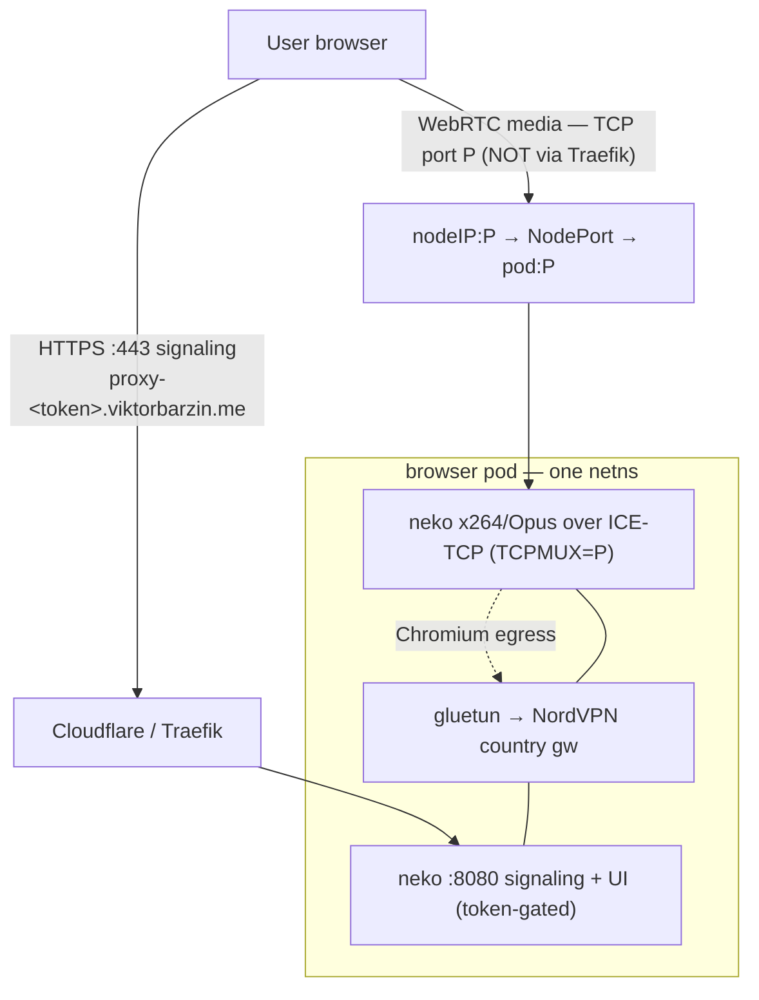

> **DECISION (Viktor, 2026-07-25):** adopt neko; keep **Authentik** as the entry
> gate (only authenticated users get a browser + token — unchanged); make it
> reachable **from anywhere without a VPN**, with the WebRTC media relayed through
> the existing **coturn** (one hardened, rate-limited relay — NOT raw per-browser
> WAN ports). This is the "truly-public" path below. Gating first step: a
> **neko↔coturn spike** (neko `ICELITE=false` + coturn as a backend TURN server)
> to confirm media relays cleanly, before the full build + the one pfSense NAT.

# Proxy: swap KasmVNC → neko for smooth video + audio

## Problem

Per-user proxy browsers (each surfing via a NordVPN country gateway) stream their
screen with **KasmVNC 1.3.3**, whose software WebP/JPEG tile encoding tops out at
**~13–17 fps** for full-motion video and has **no audio at all** (the Xvnc binary
has zero audio support). Video stutters even at 320p; audio is impossible. No
KasmVNC tuning fixes it — it's the wrong tool for video.

## Solution (spike + adversarial review verified)

Replace the KasmVNC+Chrome container with **neko** (`ghcr.io/m1k1o/neko/chromium`),
streaming Chromium over **WebRTC with software H.264 video + Opus audio**. Measured
live: **~25 fps @ 1080p**, crisp stills, working Opus audio, **no GPU** (x264,
~1.2 cores while playing / ~0 idle), **no TURN**, ~460 MiB. Everything else stays:
NordVPN gateways, broker, encrypted per-user profile PVCs, per-user subdomain, token.

## Verified by adversarial review (2 blind challengers)

- **Make-or-break — neko media survives the gluetun/NordVPN netns: PROVEN SOUND.**
  kube-proxy DNATs inbound media to `podIP:P`, so neko's reply is sourced from the
  pod eth0 IP and caught by gluetun's `ip rule` **pref 100** (`from <podIP> lookup
  200` → eth0) *before* the fwmark→tun0 rule. Verified via live `ip route get` for
  LAN/VPN/external/node clients + an end-to-end NodePort test (HTTP 200 through
  kube-proxy DNAT into the netns) **while egress stayed on the Sweden exit (no
  leak)**. gluetun's `OUTPUT … RELATED,ESTABLISHED ACCEPT` passes the reply, so
  adding the media port to `FIREWALL_INPUT_PORTS` is sufficient. Spike G (#10214)
  does **not** apply — that was *forwarded transit*; neko media is *locally
  terminated*, a different routing path.
- **Two required corrections** to the first draft (below): the port-mapping
  encoding, and the resource sizing.

## Architecture

## Media-port model (corrected)

Per browser the broker assigns a unique **NodePort P** (30000–32767, cluster-unique;
ample for a ~10-user house) and wires it with **no port remapping** (neko forbids
remap — the advertised ICE candidate port == the mux listen port):

- neko env: **`NEKO_WEBRTC_TCPMUX = P`**, `NEKO_WEBRTC_ICELITE=true`, `udpmux=0`,
  **`NEKO_WEBRTC_NAT1TO1 = [<reachable-ip>]`** (a **bare-IP list**, no `:port`).
- Service: a **NodePort** with `nodePort == targetPort == P` (pod listens on P
  inside the gluetun netns). **ETP=Cluster** (proven; neko doesn't need the real
  client IP, and cluster ETP means every node IP works). Signaling stays a
  ClusterIP `:8080` behind the per-user subdomain ingress (same shape as KasmVNC's
  `:6080` today).
- gluetun: add **`P`** to `FIREWALL_INPUT_PORTS` (alongside 8080).
- Broker sequencing: create the NodePort Service, read back `.spec.ports[].nodePort`
  (synchronous — no race), then create the pod with `TCPMUX=P`, or pick P and
  request `nodePort=P`+`targetPort=P` with retry-on-409. Set `NAT1TO1` to the
  pod's node IP; **on reschedule/drain rewrite `NAT1TO1` + restart neko** (the
  advertised candidate goes stale even though the NodePort works cluster-wide).

**`NAT1TO1` is a LIST** — a browser can advertise **both** an internal node IP
**and** the WAN IP on the same port P; ICE picks whichever the client can reach.
So LAN + public for the *same* browser needs **no hairpin** — the access models
compose.

## Access model — THE decision for Viktor

| | Media `NAT1TO1` | Firewall | Security |
|---|---|---|---|
| **A. VPN/LAN** (users on Headscale/WireGuard/LAN) | internal node IP | **none** | best — media stays on the private net |
| **B. + Public** (also reachable from the open internet) | node IP **+ WAN IP** | pfSense NAT `WAN:P→node:P` **per browser** | media port bypasses Cloudflare + CrowdSec, is DoS-able |

- **Confidentiality is sound either way** (verified): the media port can't be
  decoded/injected without the token-gated signaling handshake (ICE ufrag/pwd →
  DTLS → SRTP). An attacker who finds the port can't watch or hijack the session.
- **But availability/attack-surface is the catch for B**: a raw WAN NodePort
  never transits Traefik, so **CrowdSec can't see or ban it**, Cloudflare can't
  absorb a flood, and neko's ICE agent must parse every junk packet — a DoS
  starves the real stream. This contradicts `security.md`'s "no public-IP access
  for sensitive services." So **B is a deliberate posture trade** and its pfSense
  NAT is an out-of-band firewall change needing explicit approval (execution.md §1).
- **Recommendation: build Model A.** Onboard any "external" users to the existing
  Headscale/WireGuard — they *become* Model A: zero firewall change, zero new
  attack surface, and it's neko's documented VPN pattern. Add per-browser WAN NAT
  (the `NAT1TO1` list already supports it) only if a truly-public, non-VPN user is
  a hard requirement.
- **coturn** (live, idle, zero consumers) is the alternative *only if* truly-public
  is mandated at scale — it collapses N WAN ports to one hardened relay, but needs
  `ICELITE=false` (its own spike), a pfSense NAT (Spike A found it missing), and a
  resource bump. Not needed for A.

## Broker + stack changes (`stacks/proxy`)

1. **`build_br_pod`**: swap the `kasmvnc` container for `neko` (image **digest-pinned**).
   Env per above + member password = the per-user token. Chromium profile → the
   existing profile PVC. Add a **`/dev/shm` emptyDir** — but sized to fit the
   memory limit (see resources). Add `P` to gluetun `FIREWALL_INPUT_PORTS`.
   Mount the `CommandLineFlagSecurityWarningsEnabled=false` Chrome policy (kills the
   `--no-sandbox` bar in neko's Chromium too).
2. **`build_br_service`**: signaling ClusterIP `:8080` (behind ingress) **+** a
   NodePort `P→P` for media (ETP=Cluster). Broker reads `nodePort` back for env.
3. **`build_br_ingress`**: unchanged shape; backend → `:8080`.
4. **`add podAntiAffinity`** (preferred) spreading `proxy-browser` pods across
   node2–5 (they already can't land on node1/master — both tainted — so no
   nodeSelector needed, just spread).

## Resources / quota (corrected)

- neko container: **CPU request ≈ 1.0–1.2** (matches measured active cost; the
  0.5 draft under-requested → scheduler over-packs → CFS throttles the encoder →
  dropped frames). **No CPU limit** (house policy). **Memory limit ≈ 2 Gi** — a
  `medium:Memory` `/dev/shm` (size it ~768 Mi–1 Gi) counts against the pod limit,
  so neko ~460 Mi + shm + Chromium heap needs the headroom; **1 Gi would OOM on
  playback**. (Net footprint ≈ today's KasmVNC pod, not lower — the draft's "lighter"
  claim was wrong once shm is counted.)
- ResourceQuota: raise `requests.cpu` to the real concurrency target (~1.2 ×
  expected simultaneous-video browsers + gateways + broker). Node2–5 have ~26
  idle cores now, but the quota — not headroom — is the binding limit and must be
  sized to intent. Memory quota can stay ~as-is (per-pod limit drops 3584→~2048 Mi).

## Rollout

Greenfield (no production users, infra#81) → no migration dance:
1. Pin the neko image; land broker + stack changes; apply.
2. Recreate the (test) browser; verify end-to-end via Playwright: H.264 fps,
   live audio track, **NordVPN egress intact (no home-IP leak)**, profile
   persistence, infobar gone, and media actually connects on the chosen access path.
3. Confirm a real client (LAN/VPN) gets smooth video + sound.

## Risks

1. **Access model** (above) — the one decision; shapes whether a WAN change is needed.
2. **No adaptive bitrate** over ICE-lite/TCP (spike: estimator passive) — a slow
   remote uplink can buffer. Fine on LAN/VPN/fat links.
3. **`NAT1TO1` staleness** on pod reschedule/node-drain → media breaks until the
   broker rewrites it + restarts neko. Broker must handle this (reconcile loop).
4. **CPU under concurrent video** — ~1.2 cores each; bound by the (raised) quota +
   anti-affinity spread, not by node headroom alone.
5. **Media-port DoS** (Model B only) — mitigated by keeping media on the private
   net (Model A); if public, accept it or front with coturn.
6. **neko `:latest` drift** — digest-pin (house SHA rule).

## Out of scope

GPU (T4 NVENC) offload — x264 is enough, T4 is VRAM-budgeted (ADR-0016). coturn —
only if truly-public is later mandated.
