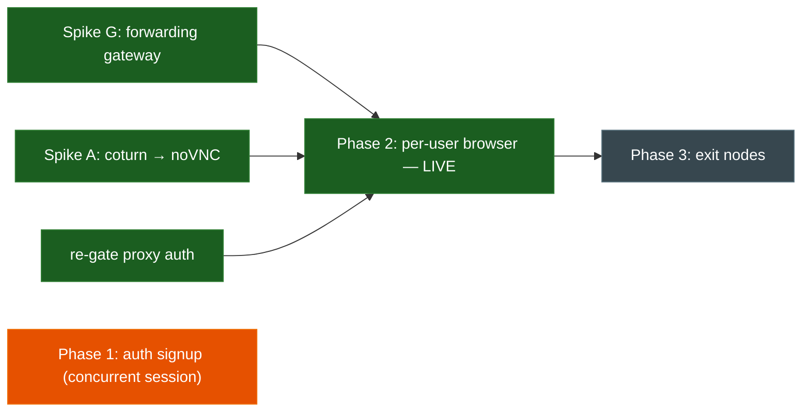
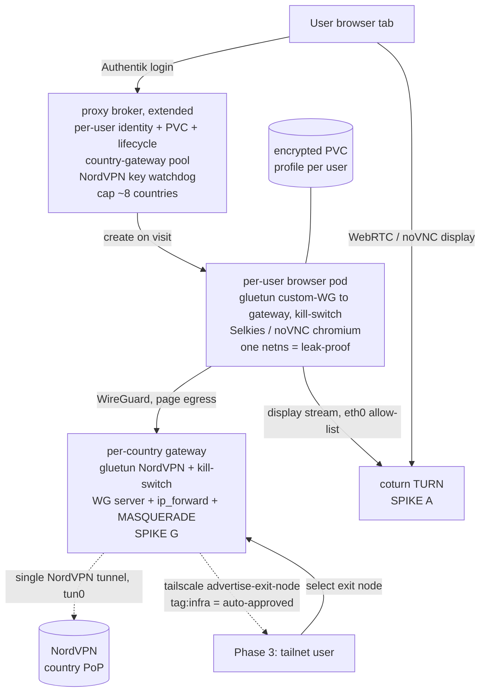

# Proxy — scale-up: per-user persistent browsers, VPN-chaining, accounts

**Status:** Executing (approved 2026-07-25, `/to-spec` → infra#81) · **Owner:** Viktor
**Builds on:** `docs/plans/2026-07-24-proxy-nordvpn-design.md` (the shipped
ephemeral remote browser at `proxy.viktorbarzin.me`)
**Adversarially reviewed:** two blind challenger agents against live infra;
findings folded in. The SOCKS5 egress model was disproven (leaks the home IP)
and replaced — with Viktor's pick — by a **shared per-country L3 gateway**,
which turns out to be the *same* primitive the VPN-chaining requirement needs.

## Goal

Evolve the shipped ephemeral remote browser into a small **multi-user service**
for a trusted circle (~5–20 accounts): each user gets their **own persistent,
multi-tab browser** exiting from a country of their choice via NordVPN, plus a
way for **existing VPN (Headscale) users to route their own traffic through
NordVPN**. One NordVPN account, within its ~10-tunnel cap, zero new cost.

## Execution progress (2026-07-25)

- **✅ Spike G — forwarding gateway: PROVEN end-to-end.** The make-or-break was
  the `ip_forward` posture: the runtime mounts `/proc/sys` read-only, so a pod
  cannot set `net.ipv4.ip_forward` at runtime even with `NET_ADMIN`. Fix
  (Viktor-approved): add it to the kubelet `allowedUnsafeSysctls` allowlist —
  applied live to workers node2–5, IaC'd in the node-tune script, documented in
  `security.md`. Then a live spike confirmed a browser-side pod routing over
  WireGuard into a shared gluetun gateway egresses **NordVPN NL with no home-IP
  leak** (baseline home IP → tunnelled NL IP). The full recipe — incl. the
  non-obvious return-path `ip rule ... lookup main pref 90` that works around
  gluetun's fwmark policy routing — is captured in memory #10214.
- **✅ Phase 2 — per-user browser: BUILT + LIVE + verified end-to-end.** The
  broker was rewritten (greenfield) for the shared-gateway model: `POST
  /api/browser {country}` mints WireGuard keys (`wgkeys.py`, X25519), spins up a
  shared per-country gateway pod, an encrypted per-user PVC, and a browser pod
  (gluetun custom-WireGuard → gateway + Chromium + noVNC), and registers the
  peer via a ConfigMap the gateway sidecar reconciles. **Live test:** a browser
  egressed **NordVPN NL (86.106.20.118), no home-IP leak**; the encrypted
  profile PVC survived a browser delete (persistence). Re-gated to
  `auth=required` (per-user identity). Display is **tuned noVNC** (Spike A:
  coturn's public TURN path is NXDOMAIN + needs a pfSense NAT — deferred).
  Logic + keygen are pure + unit-tested (27 tests). Gateways pinned to the
  `ip_forward`-enabled workers (node2-5) via a node label.
- **🟠 Phase 1 — auth: owned by a concurrent session.** A parallel agent session
  is implementing the invite-gated Google social signup + `#alerts` (the same
  root cause this plan predicted — invite lost across the OAuth round-trip); it
  is recovering its terraform (broken import blocks). Left to them to avoid
  colliding on `stacks/authentik`; the proxy re-gate waits on it.
- **⬜ Phase 3 — Headscale exit nodes:** unblocked by Spike G (same forwarding
  primitive), not yet started.

## The one primitive everything hangs on: the per-country forwarding gateway

The adversarial pass collapsed three of the five surfaces into **one** shared
building block:

> **Per-country gateway** = a pod running `gluetun` (NordVPN WireGuard for that
> country, kill-switch on) **+ a WireGuard server + `ip_forward` + MASQUERADE on
> `tun0` + a FORWARD-accept rule**. It holds the **single** NordVPN tunnel for
> that country and **forwards** other pods'/peers' traffic out through it.

- **Browsers** join their country's gateway over WireGuard (leak-proof L3) →
  many browsers share one country's tunnel.
- **Headscale exit-node** users route into the *same* gateway (a
  `tailscale --advertise-exit-node` co-located in it) → no extra NordVPN tunnel.
- So the ~10-tunnel cap limits **concurrent countries (~8 after reserve)**, not
  users — and browser users + tailnet users on the same country share one tunnel.

The catch the challengers surfaced: **forwarded (non-local-origin) traffic hits
gluetun's kill-switch on the FORWARD chain**, which drops it unless FORWARD-accept
+ MASQUERADE + `ip_forward=1` are added — and `ip_forward` may need either a
runtime `sysctl -w` (fine under the current unprivileged NET_ADMIN posture) or a
kubelet unsafe-sysctl allowlist + a Kyverno exclude (a node/policy change). **This
gateway is the make-or-break spike (Spike G).** Everything else is plumbing we've
largely shipped.

## Decisions (interview; ⚑ = revised by the adversarial pass)

| # | Decision | Choice | Why |
|---|----------|--------|-----|
| 1 | Audience / scale | **~5–20 trusted accounts**, account-gated | Fits the ~10-tunnel ceiling; contains abuse/ToS |
| 2 ⚑ | Browser → tunnel | **Shared per-country gateway, joined at L3 (WireGuard), leak-proof** — NOT app-level SOCKS5 | Chromium has no SOCKS5-UDP → a proxy leaks QUIC/WebRTC/UDP to the home IP; L3 + kill-switch cannot leak, and shares one tunnel across many browsers |
| 3 | Browser lifecycle | **On-demand pod + persistent encrypted PVC profile** | Persistent *profile*, not a 24/7 pod; browsers/country unlimited, ~8 countries concurrent |
| 4 ⚑ | Browser display | **Selkies+coturn IF the coturn-reachability spike passes; else tuned noVNC (fallback)** | coturn's public TURN path is currently unreachable + never exercised; noVNC is proven + leak-safe |
| 5 | Auth / enrollment | **Fix social-only signup + add passkey (WebAuthn) enrollment**; re-gate proxy to `auth=required` | Social signup is broken; passkey = a real 2nd path |
| 6 ⚑ | VPN-chaining (req 4) | **Headscale exit node = tailscale co-located in the per-country gateway** (`tag:infra` → auto-approved) | Same forwarding primitive as #2; shares the tunnel — no extra NordVPN slot |
| 7 | User-facing SOCKS5 (req 5) | **Dropped for now** | Deferred by Viktor |
| 8 | Country UX | **Pick at launch; relaunch to switch** (profile persists) | Simple, robust |
| 9 | Profile storage | **Encrypted PVC per user, no backup** | Persist across visits, encrypted; rare loss = re-login |
| 10 | Phasing | **Auth + per-user browser first**, then exit nodes | The browser is the flagship; each phase spike-gated |

## Adversarial review — what the two challengers found

**Survived (sound / already shipped):**
- **Same NordLynx key on multiple concurrent tunnels works** — the shipped broker already runs up to 4 same-key tunnels to different countries (`broker.py`). The "impossible" premise was false. *Caveats below.*
- **A gluetun pod can serve traffic to other pods** (`FIREWALL_INPUT_PORTS`/`FIREWALL_OUTBOUND_SUBNETS`, like today's noVNC inbound path). gluetun even ships a **built-in** HTTP proxy + Shadowsocks — but *consuming a proxy from Chromium is the leak*, so we use L3, not the proxy.
- **coturn's auth format matches Selkies** (`use-auth-secret`/`static-auth-secret` = TURN REST; Selkies takes `SELKIES_TURN_HOST/SECRET`) — no second coturn needed.
- **Disabling the page's WebRTC doesn't break Selkies' display** (separate processes) — confirmed independent.
- **Passkey *enrollment* exists in Authentik** (`authentik_stage_authenticator_webauthn` in an enrollment flow).
- **Exit-route auto-approval already works** — Vault `headscale_acl` has `autoApprovers` for exit nodes / `0.0.0.0/0` **to `tag:infra`**; a `tag:infra` preauth key → no manual approve. (`headscale routes` CLI is gone in 0.28 → `headscale nodes approve-routes`; `docs/architecture/vpn.md`'s "admin manually approves" is stale for tagged nodes.)

**Broke / gated (drove the ⚑ revisions):**
- **Browser-via-SOCKS5 = home-IP leak.** Chromium has no SOCKS5 UDP ASSOCIATE → QUIC/WebRTC-STUN/UDP egress the pod's `eth0` → pfSense NAT → **home public IP**. (`socks5h` isn't even a Chromium scheme; `CHROME_CLI` is a startup-URL, not a flags channel.) → **Replaced by the L3 gateway** (decision #2). Leaks are kernel-*impossible* under gluetun's kill-switch; today's shipped browser already proves this for the local-origin case.
- **The gateway's FORWARD-chain crux** (the shared-tunnel AND exit-node blocker, above) → **Spike G**.
- **coturn public TURN is unproven:** `turn.viktorbarzin.me` = **NXDOMAIN** (raw MetalLB LB, no ingress/record); 3478/udp + relay 49152-49252/udp aren't Cloudflare-carriable (need pfSense NAT, out-of-band); **zero consumers ever**. → **Spike A** gates Selkies; noVNC is the fallback.
- **Social signup:** the flow is **social-only** (the `proxy-enrollment.tf` comment claiming an email path is now false — `user_fields` was cleared), and the break is `invitation-validation` (first stage after OAuth) denying because the Google callback carries **no `itoken`** — the invite context doesn't survive the round-trip. **Not** empty-username. → **Spike D** + rework.
- **Passkey enrollment isn't standalone:** must follow a username-yielding `user_write`; the existing webauthn stage is `resident_key/uv=preferred` (need `required` for discoverable passkeys); and passkey *login* is a **separate** login-flow change.

**NordVPN ~10-tunnel caveats (design must honor):** the 10 is a hard wall; over-limit is **refused with a ~10-min cooldown** (memory #10182). Shared across gateways + Viktor's own devices → **reserve 1–2 slots**; **one gateway per distinct country** (same-key-same-server flaps); **never evict-then-instant-reconnect**; add a **key-rotation watchdog** — the NordLynx key rotates on any multi-device login, so long-lived gateway tunnels need re-fetch-and-roll (the shipped short-lived sessions dodge this).

## Architecture (revised — shared L3 gateway, no proxied egress)

## Spikes (build gates — before committing each phase)

- **Spike G — per-country forwarding gateway (THE make-or-break; powers shared browsers AND exit nodes).** One pod: `gluetun`(NordVPN country, kill-switch) + WG server (browser side) / `tailscale --advertise-exit-node` (tailnet side); add `ip_forward=1` + MASQUERADE on `tun0` + FORWARD-accept + `FIREWALL_OUTBOUND_SUBNETS` for the client subnet(s). **Determine whether `sysctl -w net.ipv4.ip_forward=1` works at runtime with just NET_ADMIN (stay unprivileged, no ns exclude) or needs a kubelet unsafe-sysctl allowlist + Kyverno exclude.** Prove: a client (WG browser pod / second tailnet node) routes through → curl an IP-echo showing the **NordVPN country IP, no leak**. `tag:infra` preauth so the exit route auto-approves.
- **Spike A — coturn reachability (gates Selkies; else noVNC).** Add non-proxied `turn.viktorbarzin.me` A → public IP; create/confirm pfSense NAT for **3478/udp + 49152-49252/udp → `.200`**; prove one TURN allocation from off-LAN.
- **Spike B — leak-safe browser pod.** Browser pod = gluetun(custom WG → gateway, kill-switch) + Selkies/noVNC, netns-share; page egress only via WG→gateway→NordVPN, display allow-listed to coturn on `eth0`; verify **zero IP leak** (curl / DNS / WebRTC / QUIC / IPv6 all show the NordVPN IP or are dropped) + display works.
- **Spike D — social-signup repro + fix.** Mint the `proxy-signup` invite, attempt a real Google signup, watch flow-execution + `goauthentik-server` logs; confirm the `itoken`-across-OAuth failure; test the fix (invite-survival vs moving the invite-check into the source enrollment flow) + a username-derivation policy on `user_write` (memory #6165).

## Phasing

- **Phase 1 — Auth:** Spike D → fix social signup; add a passkey-enrollment stage (after a username-yielding `user_write`, `resident_key/uv=required`) + wire passkey *login*; re-gate `proxy.viktorbarzin.me` to `auth=required` (per-user identity keys the browser + PVC).
- **Phase 2 — Per-user browser over shared gateways:** Spike G + A + B → the per-country gateway; per-user browser pods (WG into the gateway) with encrypted PVC profiles + on-demand lifecycle; extend the broker for per-user identity, the country-gateway pool, the NordVPN key-rotation watchdog, and the ~8-country cap; pick-country-at-launch.
- **Phase 3 — Headscale exit nodes:** add `tailscale --advertise-exit-node` (`tag:infra`) to the per-country gateways — tailnet users route through the *same* tunnels, no extra NordVPN slots.

## Cost / guardrails
- **Zero new spend** — existing NordVPN sub + cluster + coturn.
- **~10 concurrent country-tunnel ceiling → ~8 concurrent countries** (reserve 1–2 for Viktor's own devices); browsers-and-tailnet-users **per country are unlimited** and share the one tunnel; one gateway per country; cooldown-aware evictions; key-rotation watchdog.
- **Leak-safety is the load-bearing invariant:** L3 into the tunnel + kill-switch only; never proxy the browser's egress. Every hop fails closed.
- **Privilege posture:** Spike G decides whether `ip_forward` stays inside the current unprivileged NET_ADMIN posture or needs a node/Kyverno change — a gate on Phase 2/3, surfaced not buried.
- **Abuse/ToS:** re-gated to accounts (not public); per-user identity for audit.
