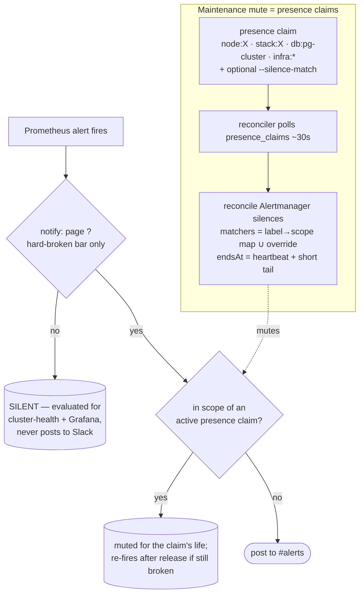

# Alert-notification noise reduction — design

- **Status:** approved (grilling session 2026-07-26)
- **Owner:** Viktor / wizard
- **Scope:** `stacks/monitoring` (Alertmanager routing + alert rules), the `alert-digest` CronJob, the `presence` CLI (`scripts/presence`), and a new small reconciler.
- **Goal (Viktor's words):** *"reduce the number of notifications we get when things are fine, and only escalate when something is truly broken."*

## 1. Problem

The cluster already runs **alert-on-change** routing (each alert notifies once, warnings/info never re-ping, criticals re-ping every 6 h), a daily 08:00 **digest**, and **inhibit rules** (kured-reboot blast, cascade-from-NodeDown). It is *not* hourly spam. The residual noise is structural:

- **Every distinct alert firing/resolving still posts to `#alerts`** — including transient (rollout/restart churn), expected (a deferred k8s upgrade's version skew), and known-chronic (offline Sofia HA devices) states. The truly-broken signal is buried in that traffic.
- **Self-inflicted churn dominates.** A routine `terragrunt apply` / helm upgrade / kured reboot rolls pods → replica-mismatch, pod-crashloop, scrape-down, helm-pending, brief service/DB-down — each a Slack post, none of it "broken."
- **The daily digest re-lists the whole standing board**, so long-known items (offline HA devices) are re-surfaced every morning.

A representative `/cluster-health` snapshot during a routine apply: `PASS 39 / WARN 7 / FAIL 3`, where **all 3 FAIL + most WARN were transient (my apply) or expected (Sunday upgrade) or known-chronic (HA devices)** — zero were "act now." That ratio is the problem.

## 2. Principle

**An alert firing should MEAN something is truly broken.** We do not route noise to a quieter tier — we stop generating noisy notifications:

1. Alerts that clear the **hard-broken bar** post to `#alerts`.
2. Everything else is **silent** — still evaluated (visible in `/cluster-health` + Grafana) but never posts to Slack.
3. Pure-noise / known-flaky alerts are **removed**.
4. Genuine issues are **fixed, not muted** (e.g. the version skew).
5. Self-inflicted churn is **suppressed at the source** — tied to `presence` claims (deliberate-work signal) — and ridden out with longer `for:`.

### The hard-broken bar (what earns a `#alerts` post)

A user-facing service down or erroring (Traefik / Authentik / cloudflared / ingress 5xx-storm / mailserver / email-roundtrip) · data-loss / backup-gap / imminent-cert-expiry risk · a security signal (`lane=security`) · node Down/NotReady · OOMKilled · disk or PVC full · a database down (PostgreSQL / MySQL / Redis / CNPG) · egress / WAN / external-DNS down · apiserver / etcd down.

**Explicitly NOT hard-broken** (→ silent): capacity/headroom warnings (`ClusterCannotTolerateNonGpuNodeLoss`, resourcequota) · version skew (fix the upgrade, keep the alert silent) · single-pod flaps · thermals-WARN · CSI ghost-drift WARN · image-update notices · latency / 4xx-rate warnings · exporter/probe-staleness plumbing · "degraded but working."

## 3. Design

### 3.1 High-signal alert set (`notify: page` label)

- Add a **`notify: page`** label to every rule that meets the hard-broken bar. Absence of the label ⇒ **silent**. This is decoupled from `severity` (which keeps meaning *how bad*, for dashboards/triage), so we don't have to overload severity semantics.
- **Alertmanager routing** becomes: a top route that sends `notify="page"` to the `slack-*` receivers (keeping the existing `[CRITICAL]/[WARNING]/[SECURITY]` styling by severity), and a catch-all child that routes everything else to a **blackhole receiver** (a `receiver` with no `slack_configs`) — evaluated, never sent. `lane=security` continues to page (it is always hard-broken by definition).
- Net effect: `#alerts` only ever shows something that needs action.

### 3.2 Remove the daily digest

Delete the `alert-digest` CronJob + `alert_digest.tf` / `alert_digest.py` (monitoring ns). With silent alerts visible in `/cluster-health` and Grafana, the digest adds only re-surfaced known-state noise. (The `#alerts` Slack read in cluster-health check #49 stays — it now sees only real alerts.)

### 3.3 Stop alerting on HomeAssistant entities

HA entity-unavailable is known-flaky (devices sleep/roam). Drop the HA-entity alerts from the `page` set (they become silent or are removed per the audit). `/cluster-health`'s HA checks (#26/#45) remain as an on-demand surface; they just don't page.

### 3.4 Version skew — fix, don't mute

`K8sVersionSkew` stays (silent). The fix is completing the upgrade: the self-healing k8s-upgrade change already landed this session makes **Sunday's scheduled run converge master+workers**, clearing the skew at the source.

### 3.5 Presence-claim maintenance mute (the reconciler)

`presence` already records *who is mutating what, since when* in the MySQL `presence_claims` table (beads DB `10.0.20.200`). A claim **is** the "deliberate work in progress" signal.

- **Reconciler:** a small always-on Deployment in `monitoring` (reconcile loop ~30 s — chosen over a CronJob for timeliness + no per-tick pod spin). Each loop: read active claims → for each, compute Alertmanager **silence** matchers → create/refresh/delete AM silences so the live silence set matches the live claim set. Idempotent (silences tagged `createdBy=presence-reconciler`, one per claim keyed by `resource_label`+`session_id`).
- **Mute scope = everything in the claim's scope**, for the claim's life. A claim says "I'm actively on this — hush it." Anything **still firing after `release`** re-fires immediately (silence gone) → you get told. The only blind window is *during* the claim, exactly when the claimer is watching; risk is bounded by scope + duration.
- **Label → scope convention** (with an optional `--silence-match '<matchers>'` override on `claim`, stored in `presence_claims`):

  | claim label | default silence matchers |
  |---|---|
  | `stack:<name>` | `namespace="<name>"` (most stacks == namespace; exceptions use override) |
  | `db:pg-cluster` | `namespace="dbaas"` + pg/CNPG alert set |
  | `service:<name>` | that service's/deployment's alerts |
  | `pvc:<ns>/<name>` | `namespace="<ns>"` |
  | `node:<name>` | `node="<name>"` (⚠ cluster-wide pod alerts carry no node label → partial; use override) |
  | `host:<name>` / `infra:<freeform>` | **none** — require `--silence-match` (no safe default) |

- **Auto-expiry / safety:** silence `endsAt = claim-heartbeat-expiry + short tail`, refreshed each loop while the claim heartbeats. A dead/crashed session stops heartbeating → the reconciler stops refreshing → the silence expires within the tail (self-healing, no orphan mute). Explicit `release` → deleted next loop. A hard max-duration cap (e.g. 8 h) backstops a forgotten long claim.
- **New presence bits (small):** a `--silence-match` flag + column on `claim`; the reconciler needs the `PRESENCE_DSN` (Vault) + in-cluster Alertmanager reachability.

### 3.6 Longer `for:` on churn-prone alerts

Raise `for:` on the rollout-sensitive rules (replica-mismatch, pod-crashloop, scrape-target-down, helm-pending, brief service/DB-down) so a *normal* apply/roll (minutes) never fires them at all — belt-and-suspenders with the claim mute (which covers *claimed* work; longer `for:` covers un-claimed routine churn like a Keel image roll).

## 4. Alert classification (audited 2026-07-26)

> _Filled from the full-rule audit — every current Prometheus/Loki rule classified `page` / `silent` / `remove` with rationale._

**Audit method:** all **326 distinct rules** enumerated — 291 Prometheus (inline in `prometheus_chart_values.tpl`, groups `:891-3763`; there is **no** `alerting_rules.yml`) + 35 Loki-ruler (`loki.tf`, HCL `alert =` form). Today **all 326 can reach `#alerts`**. After classification + Viktor's calls below: **≈136 PAGE · ≈188 SILENT · 2 REMOVE**.

**Viktor's calls (2026-07-26), applied on top of the default hard-broken bar:**
- **Home physical-safety → PAGE** (fuse fault/leakage/voltage ×6 + `ThermostatFreezing`) — fire/shock/pipe-burst is act-now even though it's not infra and rides the flaky tuya-bridge.
- **Any backup gap → PAGE** — every `*BackupStale` / `*NeverSucceeded` / `*Failing` pages, not just irreplaceable-data ones (Redis/Prometheus-TSDB/LVM-snap/NFS-mirror/offsite/vzdump/weekly/pfsense flip from the default SILENT to PAGE).
- **Security self-triggers → PAGE** (`MatrixNewUserRegistered`, `VaultwardenTOTPFetched`) — "I want to be aware of new signups." `NewTailscaleClient` likewise kept as PAGE (new-client awareness) rather than removed.
- **Borderlines → keep paging** ("keep them on"): `NodeDiskPressure`, `RpiSofiaDown`, `RpiSofiaFilesystemReadonly`, `WebterminalWebsocketDegraded`, `RegistryManifestIntegrityFailure`, `RegistryCatalogInaccessible` move to PAGE. *(Flagged as the most likely to revisit if `#alerts` still feels noisy — silencing any is a one-line label removal.)*

### PAGE — `notify: page` (posts to `#alerts`)

- **Power / UPS / ATS (11):** OnBattery, LowUPSBattery, PowerOutage, UPSAlarmsActive, UPSOutputVoltageAbnormal, PowercheckShutdownPostFailed, PowercheckPowerOnPostFailed, PowercheckShutdownIneffective, ATSFault, ATSPowerFault, ATSInputVoltageAbnormal
- **Host hardware (5):** iDRACSystemUnhealthy, iDRACMemoryUnhealthy, iDRACStorageDriveUnhealthy, iDRACSSDWearCritical, iDRACServerPoweredOff
- **Home safety — Viktor's call (7):** FuseMainFault, FuseGarageFault, FuseMainHighLeakage, FuseGarageHighLeakage, FuseMainVoltageAbnormal, FuseGarageVoltageAbnormal, ThermostatFreezing
- **Storage full / NFS (4):** NodeFilesystemFull, PVFillingUp, NFSServerUnresponsive, NFSMountFailures
- **Node / OOM (5 incl. Loki):** NodeDown, NodeNotReady, NodeDiskPressure, ContainerOOMKilled, KernelOOMKiller
- **Databases / auth path (6):** PostgreSQLDown, MysqlStandaloneDown, RedisDown, AuthentikDown, PgBouncerDown, PGConnectionsCritical
- **Secrets / password vault (4):** VaultRaftLeaderStuck, VaultHAStatusUnavailable, VaultwardenDown, VaultwardenSQLiteCorrupt
- **Backups — Viktor's call, ALL gaps (~31):** every `*BackupStale`/`*NeverSucceeded`/`*NeverRun`/`*Failing` across etcd, PostgreSQL, MySQL, Vault, Vaultwarden, Mailserver, Redis, Prometheus, LVM-snapshot, NFS-mirror, offsite-sync, vzdump, weekly, pfsense + `BackupDiskFull` + `CSIDriverCrashLoop`
- **Control plane / observability (7):** KubeAPIServerDown, KubeStateMetricsDown, PrometheusRuleEvaluationFailing, PrometheusNotificationsFailing, KubeletPLEGUnhealthy, KubeletRunningContainersDrop, KubeletImagePullErrors
- **Node runtime (Loki, 3):** KernelPanic, KernelSoftLockup, ContainerdDown; + CalicoNodeNotReady
- **User-facing ingress / auth / certs (13):** TraefikDown, IngressErrorRate5xxHigh, AnubisChallengeStoreErrors, AuthentikRootRouter5xxHigh, AuthentikForwardAuthFallbackActive, AuthentikOutpostForwardAuth400Spike, AuthentikOutpostMemoryCritical, AuthentikOutpostDevShmFull, CloudflaredDown, TechnitiumDNSDown, MetalLBControllerDown, TLSCertExpiringSoon, AuthentikWallingOffPublicPath (`lane=security`)
- **Access / egress / external (10 + Loki CloudflaredTunnelConnLoss):** MailServerDown, EmailRoundtripFailing, ViktorBarzinApexDrift, ClaudeOAuthTokenCritical, HeadscaleDown, WANGatewayUnreachable, InternetEgressDown, ExternalDNSResolutionDown, EgressOnlyDivergence, PfSenseVMDown, CloudflaredTunnelConnLoss
- **t3 (Loki, 3):** T3PairingBroken, T3AutoUpdateRollbackFailed, T3WatchdogExhausted
- **Security lane (Loki, all `lane=security` — 18 incl. Viktor's self-trigger + new-client calls):** VaultRootTokenCreated, VaultAuditDeviceModified, VaultSealChanged, VaultPolicyModified, VaultAuthFailureSpike, VaultViktorFromUnexpectedIP, K8sSATokenFromUnexpectedIP, K8sSensitiveSecretReadByUnexpectedActor, K8sExecIntoSensitiveNamespace, K8sMassDelete, K8sAuditPolicyModified, K8sClusterRoleWildcardCreated, K8sAnonymousBindingGranted, K8sViktorFromUnexpectedIP, PVEsshLoginFromUnexpectedIP, VaultwardenFetchVolumeHigh, VaultwardenTOTPFetched, MatrixNewUserRegistered, NewTailscaleClient
- **Borderlines kept-on — Viktor's call (4 more):** RpiSofiaDown, RpiSofiaFilesystemReadonly, WebterminalWebsocketDegraded, RegistryManifestIntegrityFailure, RegistryCatalogInaccessible

### REMOVE — delete the rule (2)

- `HomeAssistantCriticalSensorUnavailable` — HA entity-unavailable is known-flaky; Viktor's explicit "stop alerting on HA entities."
- `ExternalAccessDivergence` — **dormant since 2026-05-26**; its `external_internal_divergence_count` came from the disabled status-page pusher (superseded by gatus/mx2 + `StatusPageDown` + the egress probes). Dead metric, never fires.

### SILENT — keep the rule, evaluate for `/cluster-health` + Grafana, **never Slack** (≈188)

Everything not listed above. By category: GPU/VRAM + chrome-pool tooling · all thermals-WARN + perf/util/power `info` · **all `*MetricsMissing` / exporter-&-probe-staleness plumbing** · RPi-Sofia perf/thermal (except the two kept-on) · capacity/headroom (`ClusterCannotTolerateNonGpuNodeLoss`, resourcequota, `KubeQuotaAlmostFull`, PG/Redis-memory-pressure, CSI-LUN-usage) · single-pod flaps + non-critical replica/DS mismatches (`PodCrashLooping`, `Deployment/StatefulSetReplicasMismatch`, `DaemonSetMissingPods`) · leading indicators (`NodeMemoryPressure`, `PodStuckPending`, `PVPredictedFull`, `DNSQueryRateDropped`, `AuthentikOutpostMemoryHigh`) · fail-open safety layers (`CrowdSecDown`, `KyvernoDown`, `PoisonFountainDown`) · latency/4xx warnings (`HighServiceLatency`, `HighService4xxRate`, `HighServiceErrorRate`, `IngressTTFB*`) · `K8sVersionSkew` + the whole `K8sUpgrade*`/`Etcd*Snapshot`/`RecentNodeReboot`/`NodeMaintenanceInProgress` upgrade-pipeline set · IaC drift · GoFlow2/DNS-anomaly/netflow · minor/hobby apps (MAM, qbittorrent, hackmd, privatebin, dawarich) · redundant paths (`CloudflaredDegraded`, `BackupMxDown`, `AuthentikServerReplicasMismatch`, `HeadscaleReplicasMismatch`) · claude-memory degradation · analytics/finance-freshness (`BankSync*`, `ShareLinkGeoStale`).

> Two docs-vs-reality fixes to land with this change: CLAUDE.md's "Key alerts" names `ClusterMemoryRequestsHigh` + `ContainerNearOOM` (neither exists — the headroom alert is `ClusterCannotTolerateNonGpuNodeLoss`), and references an `alerting_rules.yml` (no such file — all Prometheus alerts are inline in `prometheus_chart_values.tpl`).

## 5. Implementation plan (ordered)

1. **Land the classification** (§4) as `notify: page` labels + the blackhole catch-all route in `prometheus_chart_values.tpl`; lengthen the churn `for:` durations. Remove HA-entity paging. *(One monitoring apply — needs the stuck `prometheus v284` helm record cleared first; that release is already blocking applies.)*
2. **Remove** the `alert-digest` CronJob (`alert_digest.tf`).
3. **Presence reconciler:** new stack/deployment + the `--silence-match` CLI/schema addition; ship with the convention map; verify a test claim silences its scope and `release` restores it.
4. **Verify:** trigger a routine apply under a claim → confirm `#alerts` stays quiet; confirm a real hard-broken alert (e.g. a genuine NodeDown) still pages; confirm post-release re-fire.

## 6. Risks & open items

- **Over-broad mute:** "everything in scope" during a claim could hide a *coincidental unrelated* failure in that scope. Bounded by scope + duration + post-release re-fire; accepted (the claimer is watching). `node:X` mapping is coarse (no node label on many pod alerts) — rely on `--silence-match` for node work.
- **Reconciler is now in the alerting trust path.** If it wrongly silences, real alerts are missed. Mitigations: max-duration cap, tag-scoped silences (only touches its own), and it can only *create* silences from *active* claims (fail-safe: no claims → no silences).
- **Stuck helm `prometheus v284`** must be cleared before step 1's apply (recurring #6073 class).
- **Classification is a judgment call** per alert; the §4 table's "unsure" set needs a final human pass.

## 7. Rollback

Each piece is independently revertible: drop the `notify` route child (everything pages again), re-add the digest CronJob, scale the reconciler to 0 (claims stop silencing; alerting reverts to as-is). No data or state migration.
