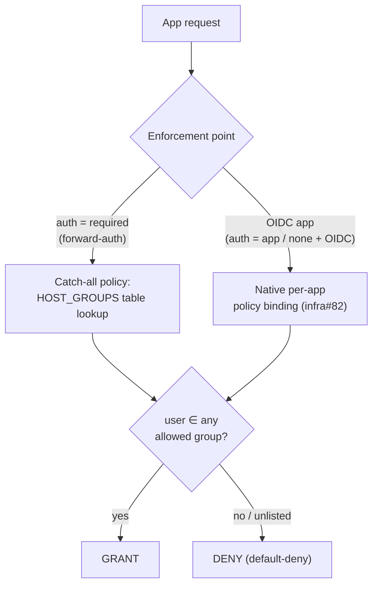
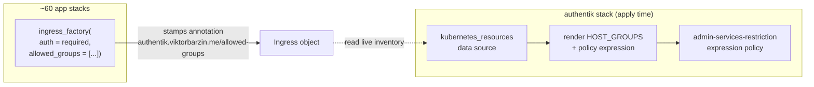

# Authentik forward-auth group-scoped authorization — design

## Problem

The homelab has **two authorization worlds**, and only one is granular:

1. **OIDC apps** (~11: Vault, Immich, Forgejo, Grafana, Kubernetes, TripIt, …) — each
   is its own Authentik *Application* with native per-app group bindings. infra#82
   made these **default-deny + explicit group allow-list**.
2. **Forward-auth apps** (`auth = "required"`, **~100 hosts**) — the *legacy
   catch-all*. They **all** share **one** `forward_domain` proxy provider → **one**
   Application ("Domain wide catch all") → **one** expression policy
   (`admin-services-restriction`). That policy only distinguishes **~17 admin-only
   hosts** (→ `Home Server Admins`) from **everything else → "allow ANY authenticated
   user."**

The gap: **~80 forward-auth apps are reachable by *any* logged-in identity** — including
a self-enrolled proxy/guest user. A `TripIt Users` member could reach hackmd, grampsweb,
trek, excalidraw, etc. There is no per-app group control, because these aren't separate
Applications — and Authentik's own docs state that *"domain-level forward auth cannot
enforce different application-level authorization rules for each protected application."*

**Goal:** every forward-auth app declares **which groups may enter**, enforced
**default-deny**, with the declaration living **where the app is declared** (the ingress)
so "who logs in where" is a single, automated, auditable source of truth.

## Decisions (grilling session, 2026-07-26)

| # | Decision | Choice |
|---|----------|--------|
| 1 | **Default posture** | **Default-deny everywhere.** Unlisted host, or user in none of a host's allowed groups → denied. |
| 2 | **Enforcement mechanism** | **One catch-all expression policy** holding a generated **host→groups table** — *not* ~100 per-app Authentik Applications. |
| 3 | **Source of truth** | `ingress_factory(allowed_groups = [...])` stamps an **annotation on the Ingress**. |
| 4 | **Generator** | **Pure Terraform** — the authentik stack reads the live Ingress inventory (`kubernetes_resources` data source) at apply time and renders the table. |
| 5 | **Baseline default** | `allowed_groups` defaults to `["Home Server Admins"]`. |
| 6 | **Invariant** | **Access is group membership, always** — no per-identity allow-lists, no attributes. |
| 7 | **Scope** | **Forward-auth apps only.** OIDC apps keep their native per-app bindings (infra#82). |

### Why a generated table, not per-app Applications (decision #2)

Per-app Authentik Applications (`forward_single` mode) is the "purest" model and would
unify forward-auth with the OIDC apps. It was **rejected** because:

- It is a **~250-object migration** (provider + application + binding per host) on the
  **critical, CI-auto-applying** `authentik` stack — a large blast radius for what is,
  at the access-decision level, an equivalent outcome.
- A greedy `forward_domain` catch-all and per-app providers **cannot cleanly coexist on
  one outpost** (proven live by the `Public` app, which needed its own dedicated
  outpost) — so per-app would require a second outpost + per-host middleware cutover.
- The only thing it buys over a table is **per-app tiles/logs in the Authentik UI** —
  observability, not access-decision robustness.

The table delivers the same per-host group allow-lists + default-deny by changing **one
small, unit-testable policy** fed by a generated table, leaving the entire proven auth
transport (outpost, middleware, provider) untouched. Rollback is one revert. See
[ADR-0023](../adr/0023-forward-auth-authz-generated-table.md).

## The model

**One conceptual model — "every app → allowed groups" — with two enforcement points:**



`Access is group membership.` The invite system (`homelab invite`, infra#82) grants
exactly one group — so **granting a group is the only way access is ever conferred.**

## Enforcement — the catch-all policy

`admin-services-restriction` collapses from a tangle of hardcoded host-sets +
per-identity branches into **one uniform rule**:

```python
host = request.context.get("host", "")
# The OAuth authorize step (proxy providers are OIDC clients) carries no host —
# grant so the session can establish; the per-request check (host set) gates.
if not host:
    return True

# HOST_GROUPS is GENERATED from ingress `allowed-groups` annotations (see below).
allowed = HOST_GROUPS.get(host)
if not allowed:
    return False                       # default-deny: unlisted host → nobody
return any(ak_is_group_member(request.user, name=g) for g in allowed)
```

Every prior special case becomes a **row**:
- `chrome` identity allow-list → the `Chrome Users` group (kept tighter than admin).
- `t3` → `["T3 Users"]`, `proxy` → `["Proxy Users", "Home Server Admins"]`.
- `k8s` dashboard carve-out → `["kubernetes-admins", "kubernetes-power-users",
  "kubernetes-namespace-owners", "Home Server Admins"]`.
- `proxy_only` **attribute** path is deleted — confinement is now pure `Proxy Users`
  membership.

**Admins are not god-mode.** They reach everything only because `Home Server Admins` is
the *default* row; `chrome` and `t3` deliberately omit it (tighter than admin,
preserving today's behavior).

## Source of truth + generator



- **`ingress_factory` gains `allowed_groups`** (list of Authentik group names), default
  `["Home Server Admins"]`, meaningful only when `auth = "required"`. It stamps the
  value as an annotation on the Ingress. Because it defaults, **every** `auth=required`
  ingress is annotated automatically → the table is **complete by construction** (no
  missing row → no accidental default-deny of a real app).
- **The authentik stack** lists all Ingresses via a `kubernetes_resources` data source,
  extracts `(host, allowed-groups)` pairs, and renders `HOST_GROUPS` into the policy
  expression via `templatefile`. Authz never leaves the reviewed Terraform apply path.
- **Apply-lag (accepted):** adding a new gated app requires an authentik-stack apply to
  pick up its row; until then the app is **denied** (fails safe), never open. The
  authentik plan showing a table diff after an ingress change is the "apply authentik"
  signal.

## The rows

Everything defaults to `["Home Server Admins"]`. Explicit non-admin rows (verified as the
*only* non-admin-facing forward-auth apps):

| Host | Allowed groups |
|------|----------------|
| `tripit.viktorbarzin.me` | `TripIt Users`, `Home Server Admins` |
| `proxy.viktorbarzin.me` | `Proxy Users`, `Home Server Admins` |
| `k8s.viktorbarzin.me` | `kubernetes-admins`, `kubernetes-power-users`, `kubernetes-namespace-owners`, `Home Server Admins` |
| `t3.viktorbarzin.me` | `T3 Users` |
| `chrome.viktorbarzin.me` | `Chrome Users` |

**Zero-lockout, verified:** non-admin users (Anca/`Wrongmove Users`, family/`Headscale
Users`) reach apps that are `auth="none"` (wrongmove, Anubis-fronted) or `auth="app"`
(headscale) — **not in this table**. Every other `auth=required` host is an admin tool
only Viktor + emo (both `Home Server Admins`) use. A proxy-only guest goes from "reaches
~56 admin tools" to "reaches only `proxy`."

## Groups / personas (the catalog)

Access is conferred by membership in exactly one of these (parent → inheritance noted):

- `Home Server Admins` (under `Allow Login Users`) — admin baseline; the default row.
- `TripIt Users`, `Proxy Users`, `Wrongmove Users`, `Headscale Users`, `T3 Users`,
  `Postiz Users`, … — per-app personas.
- `Chrome Users` — **new**; the former `chrome` identity list (`vbarzin@gmail.com`,
  `emil.barzin`, `akadmin`), kept deliberately tighter than admin.
- `kubernetes-admins` / `-power-users` / `-namespace-owners` — RBAC-tier groups.
- `Allow Login Users` — the "established user" parent; guests/`Proxy Users` are
  deliberately **outside** it.

Bundles: when a guest needs several apps, make one group bound to that bundle and point
the invite at it — "one code → one group" still holds. No speculative groups (create on
real need).

## Rollout (phased, zero-lockout)

1. **`ingress_factory` gains `allowed_groups`** (default `["Home Server Admins"]`) + the
   annotation. No behavior change yet (the policy still runs the old logic).
2. **Set the 5 explicit rows** on their ingresses; create the `Chrome Users` group +
   memberships.
3. **Flip the policy** to the table + default-deny form (reads the generated table).
4. **Verify:** PolicyEngine unit tests (TripIt user → tripit grant + k8s deny; proxy
   guest → proxy grant + everything-else deny; unlisted host → deny) + the wall-off
   probe + a manual "TripIt user can't reach k8s" check.
5. **Add the audit** (below).

## Audit / enforcement (extends infra#82's default-deny audit)

- **`scripts/tg` check** — every `auth=required` ingress's `allowed_groups` names a
  **real** Authentik group (a typo = a group that matches nobody = silent lockout).
  Same spirit as `check-ingress-auth-comments.py`.
- **Wall-off probe** — a blackbox/PolicyEngine assertion that a confined-group identity
  (`TripIt Users`) is **denied** on an admin host, catching a regression that reopens the
  leak. Same spirit as `AuthentikWallingOffPublicPath`.
- **PolicyEngine unit tests** — the exact seam infra#82 used, at both evaluation points
  (authorize: no host; per-request: host set).

## Risks / open items

- **Apply-lag footgun** — a newly-added gated app is denied until the authentik stack is
  applied. Fails safe (deny, not open); documented in the runbook.
- **Group-name typos** — a misspelled group in `allowed_groups` silently matches nobody →
  the audit check is the guard.
- **Empty-host authorize semantics** — `if not host: return True` is load-bearing for the
  OIDC-authorize step of proxy providers; preserved and unit-tested.
- **Provider-version churn** — the policy stays a single TF-managed
  `authentik_policy_expression`; no new Authentik objects, so no per-app UUID-pinning.

## Out of scope

- Re-reviewing *OIDC* apps' group assignments (e.g. "should Immich admit a family
  group?") — a separate per-app pass; infra#82 already default-denied the open ones.
- Per-app Authentik Applications for forward-auth (rejected — ADR-0023).
- The signup/enrollment flow and `homelab invite` (delivered by infra#82).
