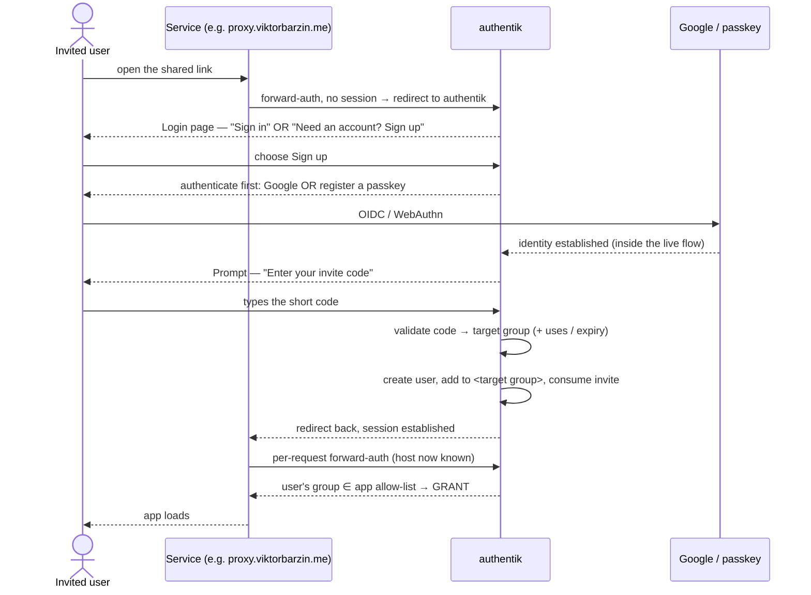
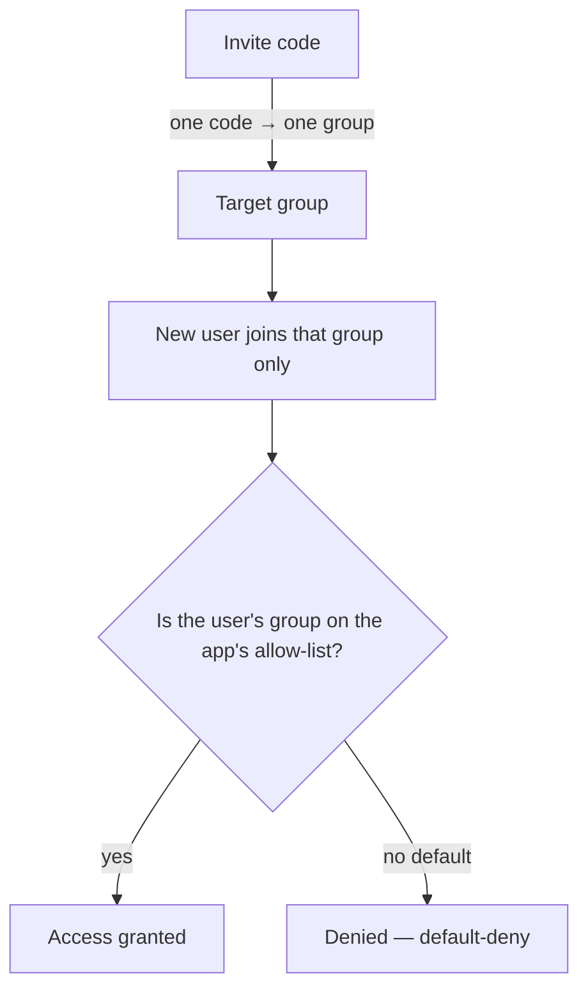

# Authentik invite-gated, group-scoped access — design

## Problem

Two linked problems, surfaced while getting the proxy self-signup working:

1. **Default permissions are too open.** Authentik applications default to
   *"allow any authenticated user"*. A **proxy-only guest** (the
   `edinpriqtelvirtual` test account, in `Proxy Users`, meant to reach *only*
   `proxy.viktorbarzin.me`) can currently see and log into **Kubernetes**,
   **Kubernetes Dashboard**, **TripIt**, and **Public** — because those apps
   have no restricting policy. The proxy forward-auth confines the guest at the
   *proxy* host, but nothing stops them OIDC-logging into other apps.
2. **Signup is fragile and complex.** Today's proxy signup rides a Google-social
   enrollment flow with a Postgres **cache "bridge"** (`capture-proxy-invite` /
   `validate-proxy-invite`) that exists only because an invite can't survive the
   Google OAuth round-trip. It took a lot of debugging and is brittle.

**Goal:** a simple, self-service, **invite-gated** signup where the invite alone
decides *exactly* what the new user can access — **one code → one group** — and
every app is **default-deny**, gated by explicit group membership.

## Decisions (grilling session, 2026-07-26)

| # | Decision | Choice |
|---|----------|--------|
| 1 | **Access model** | One invite code → one group. Every app is default-deny with an explicit group allow-list. "Who can access what" = group membership. |
| 2 | **Signup identity** | **OIDC (Google) + WebAuthn (passkeys)**. No email/password. |
| 3 | **Minting codes** | **homelab CLI** (`homelab invite …`). |
| 4 | **Open apps** | Kubernetes + K8s Dashboard → `kubernetes-*` groups + `Home Server Admins`; TripIt → new **`TripIt Users`** group; **Public** stays public. |

Design consequence that removes the complexity: **the invite code is entered
AFTER authentication** (post-Google-return / post-passkey), so it lives in the
live flow and never has to survive the OAuth round-trip. This lets us **delete
the entire cache-bridge**.

## The signup flow (no OAuth bridge)



Because the code is collected **after** auth, one validation policy replaces the
whole `google-proxy-enrollment` + `capture-proxy-invite` + `validate-proxy-invite`
+ `assign-proxy-group` machinery.

## The access model



- **Groups are the personas.** Reuse the existing per-app groups
  (`Proxy Users`, `Headscale Users`, `Postiz Users`, …). When a guest needs a
  *bundle* of apps, make one group bound to that bundle and point the invite at
  it. One invite still grants exactly one group.
- **Every app carries an explicit group allow-list** (authentik policy binding).
  No binding = the default-deny audit flags it (below).

### App → allowed groups (target state)

| App | Allowed group(s) | Change |
|-----|------------------|--------|
| Grafana, Immich, linkwarden, Cloudflare Access | `Home Server Admins` | none (already gated) |
| Forgejo | `Task Submitters`, `Forgejo Users` | none |
| Headscale / Postiz / wrongmove | `Headscale`/`Postiz`/`Wrongmove Users` | none |
| Vault | `Allow Login Users` | none |
| Domain wide catch all (proxy) | `Home Server Admins` + `admin-services-restriction` (confines `Proxy Users` to the proxy host) | none (just fixed) |
| **Kubernetes** (OIDC) | `kubernetes-admins`, `kubernetes-power-users`, `kubernetes-namespace-owners`, `Home Server Admins` | **ADD binding** |
| **Kubernetes Dashboard** | same as Kubernetes | **ADD binding** |
| **TripIt** | **new `TripIt Users`** (add Viktor) | **ADD binding + group** |
| **Public** | anonymous (public outpost) | keep public — intentional |

## Invite codes — the homelab CLI

```
homelab invite create --group "Proxy Users" [--uses 1] [--expires 7d] [--label "alex"]
  → prints: code  A1B2C3D4   link  https://proxy.viktorbarzin.me/   (share both)
homelab invite list
homelab invite revoke A1B2C3D4
```

- Backed by authentik's native **Invitation** object (API), so we reuse its
  lifecycle (single-use, expiry). `fixed_data` carries `{ code, target_group }`.
- **Short 8-char code** for the typed field (the Invitation UUID is too long to
  type). Defaults: **single-use, 7-day expiry**, both overridable.
- The enrollment prompt validates the typed code against open invitations
  (match `fixed_data.code`, check uses/expiry) and resolves the target group.

## Default-deny convention + enforcement

- **Convention:** every authentik Application MUST have a policy/group binding,
  or be explicitly marked public (only `Public`). Mirrors the repo's existing
  `ingress_factory` `auth` fail-closed rule.
- **Enforcement:** a small audit (homelab command + a scheduled check) lists any
  Application with no binding and alerts on regressions — the same spirit as
  `check-ingress-auth-comments.py` and the `AuthentikWallingOffPublicPath` probe.

## Rollout (no lock-outs)

1. **Audit existing users' group memberships** — make sure every legitimate
   user is already in the groups they need *before* anything flips to deny.
2. **Close the 4 open apps** — add the bindings above (+ create `TripIt Users`).
   Low-risk, immediate least-privilege win; independent of the signup rework.
3. **Build the new enrollment flow** — login-page "Sign up" link → OIDC/passkey
   → invite-code prompt → validate → join group → consume. Verify authentik's
   WebAuthn enroll stage works in-flow for brand-new users.
4. **Build `homelab invite`** (Go CLI, `infra/cli`) against the authentik API.
5. **Cut over + delete the bridge** — retire `google-proxy-enrollment`,
   `capture-proxy-invite`, `validate-proxy-invite`, `assign-proxy-group`. Existing
   `Proxy Users` are unaffected (already in the group); prove it with a fresh
   invite end-to-end.
6. **Add the default-deny audit.**

## What we remove (the simplification)

`google-proxy-enrollment` flow · `capture-proxy-invite` policy ·
`validate-proxy-invite` policy · `assign-proxy-group` policy · the
Postgres session-cache bridge — all replaced by **one** post-auth invite-code
prompt + **one** validation policy.

## Risks / open items

- **WebAuthn-first signup:** confirm authentik's `authenticator_webauthn` enroll
  stage registers a passkey for a not-yet-created user inside the enrollment
  flow (may need the user_write to run first, then bind the passkey).
- **Short-code entropy/collision:** 8 chars from a 32-symbol alphabet ≈ 10^12;
  enforce uniqueness at mint time.
- **"Sign up" on the main login page** is a visible UX change for everyone (they
  still can't finish without a valid code).
- **Existing-gate re-review (optional, follow-up):** this plan closes the 4 open
  apps; a fuller pass could re-check whether e.g. Immich should admit a family
  group, not just admins.

## Out of scope

- Re-architecting the proxy itself (done — neko + GPU + coturn).
- Non-authentik auth paths (native app logins, API tokens, Anubis).
