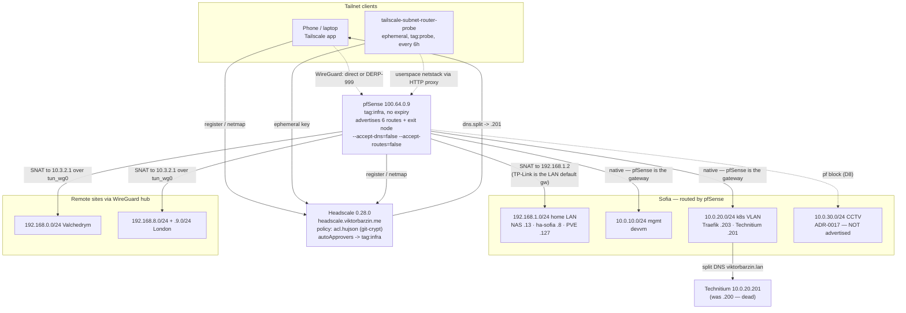

# pfSense as a Tailscale Subnet Router for the Sofia Estate — Design

**Status:** Done (built + verified 2026-08-03) · **Date:** 2026-08-03 · **Owner:** Viktor (wizard) · **Owning repo:** `infra`

> Produced via `/grill-with-docs`. Goal in Viktor's words: *"I want tailscale
> clients to be able to browse the LAN in Sofia … in a reproducible way, ideally
> terraform/ansible so that it persists."*

---

```stats
6 | routes advertised
100.64.0.9 | pfSense tailnet IP
6 h | connectivity probe interval
16 days | silently logged out before this
4 | latent defects found and fixed
0 | remote routers touched
```

## 1. Goal

Give Tailscale (Headscale) clients real access to the homelab LANs, and make that
state **reproducible from the repo** rather than hand-clicked in a web UI.

Concretely: a phone on the tailnet can open `192.168.1.x` and `10.0.20.x`
services by IP *and* by `.lan` name, from anywhere, and that keeps working across
pfSense reboots, package restarts, and a full pfSense rebuild.

### Non-goals

- Replacing the roaming WireGuard server or the site-to-site WG hub. Tailscale is
  an additional path, not a migration. (A consolidation exists as its own project:
  `docs/plans/2026-07-13-vpn-consolidation-config-portal-design.md`.)
- LAN → tailnet initiated traffic. Only tailnet → LAN is in scope (§4, D7).
- Reaching the CCTV segment. It stays isolated per ADR-0017 (§4, D8).
- Rewriting `docs/architecture/vpn.md`. That is Phase 0 of the consolidation
  project; this design only amends it.

---

## 2. Ubiquitous language

| Term | Meaning here |
|---|---|
| **Subnet router** | A tailnet node that advertises non-tailnet CIDRs, letting other nodes route to them. Here: pfSense. |
| **Advertised route** | A CIDR the subnet router *offers*. Carries no traffic until **approved** in Headscale. |
| **Approved route** | A route Headscale has accepted, either manually or via `autoApprovers`. Advertised-but-unapproved is silent — no traffic, no error. |
| **`tag:infra`** | Headscale ACL tag owned by `group:admin`, whose `autoApprovers` entries make pfSense's routes self-approving. A tagged node's ACL identity is the tag, not a user. |
| **`tag:probe`** | Tag for the connectivity probe. Its ACL grant is two HTTP endpoints — nothing else. |
| **Exit node** | A subnet router additionally offering `0.0.0.0/0` + `::/0`. Opt-in per client. |
| **Sofia LAN** | `192.168.1.0/24` — the physical home network (NAS, HA, PVE host). pfSense's WAN leg is `.2`; the **default gateway is the TP-Link at `.1`**, which is why return traffic needs SNAT. |

---

## 3. Starting state — as found (2026-08-03)

This was **not** greenfield. The pfSense Tailscale package was installed and
largely staged, but non-functional and partly wrong.

| Thing | State as found |
|---|---|
| `pfSense-pkg-Tailscale 0.1.4`, `tailscale 1.54.0` | Installed; `tailscaled` running since 18 Jul |
| `tailscale status` | **`Logged out`** — the pre-auth key in `config.xml` was spent/expired |
| Headscale nodes | 9 nodes, 4 users, **no pfSense node**; no `100.64.0.0/10` route in pfSense's kernel table |
| Advertised routes (staged) | `10.0.0.0/8`, `192.168.1.0/24`, `192.168.0.0/24`, `0.0.0.0/0`, **plus an empty row** |
| `--accept-dns` / `--accept-routes` | Both **on** |
| Outbound NAT | Exit-node rule `100.64.0.0/10 → wanip` present, **plus a stale rule translating to `100.64.0.3`** |
| pf rules | One `pass any→any` on the `Tailscale` interface group, with an empty description |
| Headscale ACL | Already had `hosts.sofia-lan`, `group:sofia-lan-users`, and `autoApprovers.routes` for `tag:infra` — the design intent was there, unused |
| ACL storage | A blob in Vault `secret/platform.headscale_acl` — no reviewable diff |

### 3.1 Findings

1. **The spent key was the proximate cause**, but not the only defect. Nothing
   alerted for ~2 weeks (2026-07-18 → 2026-08-03).
2. **The stale NAT rule pointed at a family laptop.** `100.64.0.3` was pfSense's
   own tailnet address in a *previous* registration; Headscale has since
   reassigned it to another node. Any LAN→tailnet traffic would have been
   masqueraded as that laptop.
3. **Headscale handed every client a dead DNS resolver.** `dns.split` for
   `viktorbarzin.lan` (and three reverse zones) plus the `technitium`
   `extra_record` and the ACL `technitium` host all pointed at **`10.0.20.200`**,
   where nothing listens on :53 (verified: query times out). Technitium's DNS
   LoadBalancer is **`10.0.20.201`**. Name-based LAN browsing could not have
   worked even with routes up.
4. **A blanket `10.0.0.0/8` advertisement is actively harmful**, not merely
   untidy: it swallows a client's own `10.x` network (office, hotel, CGNAT), the
   CCTV segment (`10.0.30.0/24`), and the k8s pod/service CIDRs
   (`10.10.0.0/16`, `10.96.0.0/12`) that pfSense cannot route.
5. **The empty route row produced a trailing comma** in
   `--advertise-routes=a,b,` because the package joins rows unconditionally.
6. **`--accept-dns` on a firewall is a self-inflicted wound**: tailscaled
   rewrites `/etc/resolv.conf` to MagicDNS while pfSense regenerates it on
   interface events, so the two fight. pfSense's Unbound is also what the k8s
   nodes use for `viktorbarzin.me` resolution.
7. **The rc script logs the auth key.** `pfsense_tailscaled` does
   `logger -s -t tailscale "Bringing up … with --auth-key=…"`, so any key put in
   `config.xml` lands in `/var/log/system.log` — and `config.xml` itself is
   copied nightly to NFS and Synology. This is the reason for D5.
8. **`docs/architecture/vpn.md` asserts this already worked** ("Connectivity
   test: `ping 10.0.20.100` … verifies full access to the homelab network").
   It did not.

---

## 4. Decisions

| # | Decision | Rationale |
|---|---|---|
| **D1** | Advertise exactly **six routes**: `192.168.1.0/24`, `10.0.10.0/24`, `10.0.20.0/24`, `192.168.0.0/24`, `192.168.8.0/24`, `192.168.9.0/24`. No blanket `/8`, no literal `0.0.0.0/0` row, no empty row. | Whole-estate reach without the finding-4 footguns. Exit node is a separate flag, not a route entry. |
| **D2** | Remote sites (London, Valchedrym) reached by **SNAT at the hub** to `10.3.2.1`, not by editing remote routers. | Their Sofia peer's `AllowedIPs` list only `10.0.0.0/8` + `192.168.x`, so WireGuard drops packets sourced from `100.64.0.0/10` and has no route back. One pfSense rule fixes both ends; touching two live remote routers (no console access) does not. Cost: remote hosts see `10.3.2.1`, not the client IP. |
| **D3** | Family ACL **unchanged** (`sofia-lan` only). `autoApprovers.routes` lists all six routes **explicitly**. | Least privilege: only `group:admin` reaches the mgmt/k8s VLANs and remote sites. Explicit listing removes any dependence on subnet-containment semantics. |
| **D4** | **Exit node yes**, IPv4 + IPv6, via `--advertise-exit-node`. | Already staged, already auto-approved, NAT rule already present, and the approved hostile-wifi runbook depends on it. Opt-in per client, so it costs nothing until selected. |
| **D5** | **Single-use, short-lived, `tag:infra`-tagged pre-auth key**, minted at run time and **blanked from `config.xml`** after registration. | Pre-auth-key registration yields a node with **no expiry** (verified: `expiry.seconds` negative), unlike OIDC's 180 d. And per finding 7, any stored key leaks to syslog + nightly backups; a spent one is worthless. Registered state lives in the tailscaled state dir, so nothing is lost by clearing it. |
| **D6** | `--accept-dns=false`, `--accept-routes=false`. | Finding 6. A subnet router advertises; it does not consume. `acceptdns` **must be explicitly present and not `on`** — the package's getter defaults it to `on` when the key is *absent*. |
| **D7** | **Delete** the stale `→100.64.0.3` NAT rule; no LAN→tailnet path. | Finding 2. Out of scope and actively wrong. |
| **D8** | pf: **block** `100.64.0.0/10 → 10.0.30.0/24`, then a pass scoped to `100.64.0.0/10`. | Defence in depth for ADR-0017. The ACL already withholds RFC1918 from family exit-node grants, but `group:admin`'s `*:*` would otherwise reach the cameras. **See §7 — this rule does not currently render.** |
| **D9** | **Ansible playbook** for pfSense; **ACL moved into git** as a git-crypt'd file rendered by the headscale stack. | Persistence was never the missing piece (`config.xml` → `rc.conf.d` already survives reboots); *reproducibility and reviewability* were. The ACL is now a diff, not an invisible Vault blob. |
| **D10** | **Connectivity probe every 6 h** with alerts. | Reversal of an earlier "no monitoring" decision, at Viktor's request mid-build — correctly, given finding 1. |
| **D11** | pfSense config mutations implemented as **one idempotent PHP program**, not `pfsensible.core` modules. | The collection addresses rules by `descr`, and three of the four objects here have **empty** descriptions or no module at all (the `<tailscale>` package block). Also avoids a new pinned dependency. The playbook remains the orchestration layer. |

### Rejected

- **Terraform for pfSense.** No provider covers the third-party Tailscale package,
  and CI auto-applies committed stack changes on push to master — putting the
  estate's single point of failure on an unattended apply path is a bad trade.
- **Plaintext ACL in git.** The GitHub mirror (`ViktorBarzin/infra`) is **public**
  and the ACL's group blocks carry five family email addresses.
- **Interactive OIDC registration.** `oidc.expiry: 180d` with
  `use_expiry_from_token: false` means LAN access would die twice a year and need
  a human with a browser. Also cannot carry a tag, so `autoApprovers` never fires.

---

## 5. Architecture



### 5.1 Why each leg needs (or does not need) SNAT

| Destination | Return path | SNAT? |
|---|---|---|
| `10.0.10.0/24`, `10.0.20.0/24` | Hosts default-route to pfSense (`.1`) | **No** — native |
| `192.168.1.0/24` | Hosts default-route to the **TP-Link `.1`**, which has no route to `100.64.0.0/10` | **Yes** → `192.168.1.2` (pre-existing exit-node rule covers it) |
| `192.168.0.0/24`, `192.168.8.0/24`, `192.168.9.0/24` | Remote WG peer has neither an `AllowedIPs` entry nor a route for `100.64.0.0/10` | **Yes** → `10.3.2.1` (new rule) |

### 5.2 Reproducibility surface

| Layer | Source of truth | Applied by |
|---|---|---|
| Tailscale package block, NAT, pf rules, registration | `playbooks/pfsense-tailscale.yml` + `playbooks/files/pfsense-tailscale-config.php` | `ansible-playbook` (human-triggered) |
| Reboot persistence | `config.xml` → `/usr/local/etc/rc.conf.d/pfsense_tailscaled` → `tailscale up` | pfSense itself (already worked) |
| ACL / autoApprovers / tags | `stacks/headscale/acl.hujson` (**git-crypt**) | Terraform (`stacks/headscale`) |
| Split DNS, DERP, OIDC | Vault `secret/platform.headscale_config` | Terraform (`stacks/headscale`) |
| Probe + alerts | `stacks/headscale/subnet-router-probe.tf`, `stacks/monitoring/.../prometheus_chart_values.tpl` | Terraform |

**Adding a route requires two edits** — the playbook's desired-state list *and*
`autoApprovers.routes` in `acl.hujson`. Advertised-but-unapproved is silent, so
the playbook asserts approval for every expected route.

---

## 6. Verification (2026-08-03)

| Check | Result |
|---|---|
| Node registered | ID 10, `pfsense`, `tag:infra`, `100.64.0.9`, `expiry` never, online |
| Routes | All 6 + `0.0.0.0/0` + `::/0` **approved and serving** (via `autoApprovers`, no manual approval) |
| `rc.conf.d` (reboot path) | `acceptdns=NO`, `acceptroutes=NO`, six routes with **no trailing comma**, `authkey=""`, `exitnode=YES` |
| Survives restart with a blanked key | Yes — re-authenticated from the state dir |
| Playbook idempotency | Second run: `changed=0, failed=0`, no key minted |
| NAT live | `nat on vtnet0 … 100.64.0.0/10 -> 192.168.1.2` and `nat on tun_wg0 … -> 10.3.2.1`; stale `→100.64.0.3` gone |
| **Sofia LAN data path** | HTTP 200 from `192.168.1.8:8123` **through the tunnel** via the `192.168.1.0/24` route |
| **k8s VLAN data path** | HTTP response from `10.0.20.203:80` through the `10.0.20.0/24` route |
| ACL enforcement | Negative control: `192.168.1.13:5000` (not granted to `tag:probe`) **denied** |
| Split DNS | Client netmap now shows `viktorbarzin.lan.:[10.0.20.201]` |
| Probe end-to-end | `enrolled=1 router_up=1 sofia=1 k8s=1 success=1`; all 6 series in Pushgateway |

### 6.1 Two false results worth recording

> [!CAUTION]
> Both of these produced confident green results while the path was dead. If you
> are ever verifying this again, distrust any check that does not read real
> payload back over the tunnel.

Both nearly produced a wrong conclusion, and both are traps for the next person:

1. **`tailscale nc` exits 0 without connecting.** It reported success against
   `192.168.1.127:22` while tcpdump on pfSense saw *no packets*. Only reading
   actual payload back (an SSH banner, an HTTP status line) proves a path.
2. **An in-cluster probe reaches the LAN without the tunnel.** A pod can reach
   `192.168.1.x` and `10.0.20.x` over ordinary cluster routing, so "can I reach
   the LAN" is not a tailnet test from inside the cluster. The probe therefore
   forces traffic through tailscaled's own outbound HTTP proxy and refuses to
   report success unless it first holds a `100.x` address. An early kernel-mode
   attempt where `tailscaled` failed to start (no `/dev/net/tun`) produced three
   confident "OK"s that were pure cluster-path artefacts.

A third trap: busybox `wget` resolves `localhost` to `::1` while tailscaled's
proxy listens on IPv4, giving a "Connection refused" indistinguishable from a
broken tunnel. Use `127.0.0.1`.

---

## 7. Honest limitations

> [!WARNING]
> **The CCTV block (D8) is not in force.** It is written and committed, but
> pfSense never renders it — so the cameras are gated by the Headscale ACL alone,
> which does not withhold them from `group:admin`. Closing this needs a decision
> (assign `tailscale0` as an interface); see the first bullet below.

- **The D8 CCTV block does not currently render.** pfSense generates filter rules
  from *config* interface-group membership, and the `Tailscale` group has **no
  members** in `config.xml` (the tun joins it only at runtime, via `ifconfig
  group`). So no rule bound to that group reaches pf — not the block, and not the
  pre-existing `pass any→any` either. Verified: `pfctl -sr` contains no reference
  to `tailscale0`, the group name, or `100.64`. The path works because pf never
  blocked it, not because a rule permits it. **CCTV is currently gated only by
  the Headscale ACL** (which does withhold RFC1918 from family exit-node grants,
  but not from `group:admin`'s `*:*`). Making D8 real requires assigning
  `tailscale0` as a pfSense interface (e.g. OPT5, IPv4/IPv6 config = None) and
  moving the rules there — a decision deliberately left open rather than taken
  unilaterally.
- **Remote-site client IPs are invisible** at London/Valchedrym (D2 SNAT). Native
  routing would need `100.64.0.0/10` added to both remote routers' `AllowedIPs`.
- **`docs/architecture/vpn.md` remains materially stale** beyond the amendment
  added here.
- **The repo's `secrets/fullchain.pem` is 28 days behind live** (repo Oct 2 vs
  live Oct 30). Every apply of a TLS-consuming stack writes the stale cert and
  Kyverno's `sync-tls-secret` (`synchronize: true`, source `kyverno/tls-secret`)
  reverts it. Harmless churn today, estate-wide, and **not** introduced by this
  work — but it is real drift.
- **`viktorbarzin.lan`'s apex A record points at `10.0.20.200`**, the same dead
  address corrected elsewhere. Left alone (Technitium zone data, low impact).
- **The probe is a 6-hourly sample, not continuous.** Worst-case detection is ~6 h
  plus the 10 m `for`; a breakage that self-heals within a window is invisible.

---

## 8. Operations

Runbook: [`docs/runbooks/pfsense-tailscale-subnet-router.md`](../runbooks/pfsense-tailscale-subnet-router.md)

```bash
scripts/presence claim infra:pfsense --purpose "tailscale subnet router"
ansible-playbook -i playbooks/inventory.ini playbooks/pfsense-tailscale.yml --check --diff
ansible-playbook -i playbooks/inventory.ini playbooks/pfsense-tailscale.yml
# node deleted or expired in Headscale:
ansible-playbook -i playbooks/inventory.ini playbooks/pfsense-tailscale.yml -e force_register=true
```

Alerts: `TailscaleSubnetRouterDown`, `TailscaleLanUnreachableViaTailnet`,
`TailscaleSubnetRouterProbeStale` — all warning/`subsystem: vpn`, inhibited under
`PfSenseVMDown` / `WANGatewayUnreachable` / `InternetEgressDown` / `HeadscaleDown`
and during `NodeMaintenanceInProgress`.
