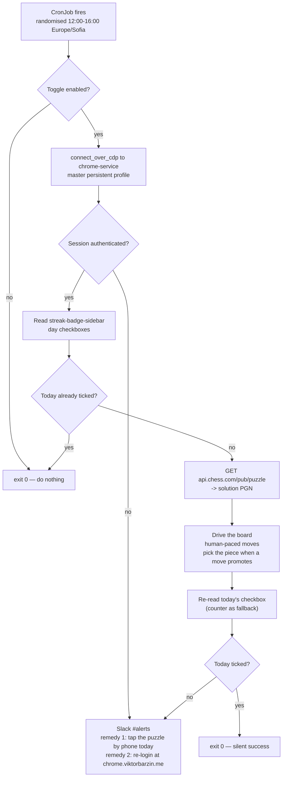

# Chess.com streak automation — design

**Status:** done (built and verified live 2026-08-08 — streak advanced 478 → 479)
**Date:** 2026-08-08 · revised 2026-08-09 (promotion handling and the success
signal — §7b)
**Owner:** Viktor Barzin (`wizard`)
**Origin:** `/grilling` session, 2026-08-08

---

## 1. Problem

Viktor wants to pause playing Chess.com without losing his activity streak, which
currently stands at 478 days. The account is `viktorbarzin`, joined 2020-02-03,
membership `basic`, Champion league.

```stats
478 | day streak at stake
5 | actions that qualify
2 | days of grace before reset
0 | rating impact allowed
```

The original framing was "log in daily and do some action to trigger the daily
streak". Research changed two load-bearing assumptions in that framing before any
design work began — see §2.

---

## 2. What the research established

An eight-agent research workflow (four parallel researchers, three adversarial
verifiers, one synthesis pass) checked official Chess.com sources, community
reports, the technical surface, and the Terms of Service. Live probes were re-run
on 2026-08-08.

### 2.1 Two corrections to the premise

Logging in does not count. The official qualifying-action list has exactly five
entries, and opening the site is not among them:

| Action | Scope |
|---|---|
| Complete a game | Any type (including Bots and Coach), time control, or variant |
| Make a move | In Daily games |
| Solve a Puzzle | Complete a Rated Puzzle **or** the Daily Puzzle |
| Complete a Lesson | Finish the final challenge on a Lesson |
| Run a Game Review | Review a game played |

The streak is not strictly daily. Missing a day *pauses* the streak; a two-day
grace follows, and it resets to zero only "if no qualifying action is performed
by the end of the third day." The practical requirement is one action every two
to three days.

The design still runs daily. The grace window is treated as failure margin rather
than as the schedule: the day-boundary timezone is undocumented (§8), and a
streak that resets cannot be recovered (§2.2).

### 2.2 No sanctioned recovery or automation path

- **No streak freeze, repair, or membership perk.** "If a streak is lost, there
  are no ways to recover it." Vacation Mode covers Daily-game move timers only.
  The one restoration ever offered was a one-off International Chess Day promo,
  20–26 July 2026.
- **No write API.** The Published-Data API is read-only and exposes no streak
  state. Chess.com's OAuth is application-gated and scoped to login and
  connected-board identity; no write capability is documented.

### 2.3 Why the Daily Puzzle is the chosen action

Candidate actions, ranked as automation targets:

| Action | Counts? | Availability | Rating impact | Notes |
|---|---|---|---|---|
| Daily Puzzle (chosen) | Yes — enumerated | Every member, every day | None (unrated) | Solution published free and unauthenticated |
| Game Review | Yes — enumerated | 1/day on Basic, needs an unreviewed game | None | Lowest risk, but no steady supply |
| Move in a Daily game | Yes — enumerated | None in progress (`/games/to-move` empty, verified today) | Rated game vs a human | Would mean deliberately playing badly |
| Game vs a Bot | Yes (since ~Mar 2026) | Always | None (unrated) | Requires playing a full game to completion |
| Lesson final challenge | Yes — enumerated | Finite supply, much is Premium-gated | None | Fragile multi-step UI |
| Rated Puzzle (excluded) | Yes — enumerated | 3/day on Basic | Moves puzzle rating | Engines and outside help are an explicit Fair Play violation here |

The Daily Puzzle is the only action that is unconditional, repeatable, and
rating-neutral. Chess.com publishes its solution openly — verified today,
`GET api.chess.com/pub/puzzle` returned `1. Rg3 Rxf6 2. Kd7 a2 3. Rg8#` — so no
engine is involved, and the help centre permits any tools on *unrated* puzzles.
The same help centre bars engines on Rated Tactics, which is why rated puzzles
are excluded despite qualifying.

### 2.4 Name collisions ruled out

- **Daily Puzzle streak** — the puzzle-calendar flames, a separate counter with a
  48h-per-puzzle back-fill window.
- **Puzzle Points "Streak bonus"** — consecutive-correct within a session.
- **"Puzzle Streak" solve-until-you-miss mode** — does not exist on Chess.com;
  `chess.com/puzzles/streak` returns 404. That mode is Lichess's.

The target is the profile flame, confirmed on-page today as
`profile-badge` → "478 Day Streak".

---

## 3. Decisions

| # | Decision | Choice | Rationale |
|---|---|---|---|
| 1 | Which streak | Daily activity flame | The counter Viktor tracks; currently 478 |
| 2 | Break length | Open-ended | Build for indefinite; degrades gracefully on early return |
| 3 | Authentication | Reuse the warm cluster-browser session | Viktor logged in manually at `chrome.viktorbarzin.me`; avoids the Turnstile challenge on the login page (§6.3) |
| 4 | Qualifying action | Solve the Daily Puzzle | Only unconditional, rating-neutral option |
| 5 | Rating impact | Zero — hard rule | Keeps the training baseline in `~/code/learn/chess` comparable |
| 6 | Cadence | Daily | Grace window reserved as failure margin |
| 7 | Schedule | Randomised within a window, with retries | Recovery room; avoids a to-the-second daily fingerprint |
| 8 | Stand-down | Check-first, act only if needed | Silently does nothing on days Viktor plays himself; also minimises footprint |
| 9 | Verification | Re-read today's box in the day strip | Confirms Chess.com credited the day, not just that the script ran (revised 2026-08-09: on that day the badge counter alone did not move on a solve the strip credited) |
| 10 | Alerting | Slack `#alerts`, failures only | Reuses Alertmanager; no daily noise during a break |
| 11 | Session death | Alert naming both remedies | Tap the puzzle by phone today; re-login via noVNC when convenient |
| 12 | Runtime | K8s CronJob via Terraform | Matches every other scheduled job; home-IP egress |
| 13 | Code location | New repo + ghcr image | Matches the first-party project standard (semver, GHA, ghcr) |
| 14 | Fallback action | None — alert instead | Smallest footprint; leans on the 2-day grace |

---

## 4. Design



### 4.1 Browser access

The job connects over CDP to `chrome-service.chrome-service.svc.cluster.local:9222`,
the pattern already used by `tripit` (`infra/stacks/tripit/main.tf`, `FARE_CDP_URL`).
Its namespace carries the label `chrome-service.viktorbarzin.me/client = "true"`
to pass the `chrome-service-ws-ingress` NetworkPolicy.

It attaches to the **master persistent profile** (`browser.contexts[0]` — the
`--shared-context` equivalent) rather than taking a pool worker. Pool workers are
seeded with a read-only copy of the master's cookies; any session-cookie rotation
inside a worker is discarded when the pod exits. Attaching to the master profile
lets rotation persist, so the session refreshes rather than ageing
out. The cost is roughly 30 seconds of contention on the shared browser per day.

`playwright` is pinned to **v1.48.0** to match chrome-service's image
(`mcr.microsoft.com/playwright:v1.48.0-noble`), per the caller contract documented
in `infra/stacks/chrome-service/main.tf`.

### 4.2 Run window

The streak's day-boundary timezone is not documented anywhere (§8). A window of
**12:00–16:00 Europe/Sofia** sits comfortably mid-day under all three plausible
hypotheses:

| Boundary hypothesis | Rolls over at (Sofia) | Margin from a 14:00 run |
|---|---|---|
| Pacific (Daily Puzzle publish time) | 10:00 | ~20 h |
| UTC | 03:00 | ~13 h |
| Account-local (Europe/Sofia) | 00:00 | ~10 h |

The job can also narrow this empirically over time by recording when the sidebar
day-strip resets.

### 4.3 Check-first gate

Each run reads the `streak-badge-sidebar` day checkboxes on the home page
(`streak-badge-sidebar-checked` marks completed days). If today is already
ticked — because Viktor played, or an earlier retry succeeded — the job exits
without touching the account. This makes the automation stand down on its own the
day he returns, and keeps the number of automated actions to the minimum that
preserves the streak.

### 4.4 Verification

Success is defined as Chess.com agreeing the day counted, not as the script
completing. After solving, the job re-reads today's box in the sidebar day strip
on `/home`; a ticked box is the proof. The badge counter ("N Day Streak") is
read alongside it, but only decides the outcome when the strip cannot be read:
on 2026-08-09 the counter sat at 479 either side of a solve the strip showed as
ticked. Anything else is a failure and alerts.

---

## 5. Build plan

1. New repo `~/code/chesscom-streak`, semver from `v0.1.0`, mirrored to GitHub for
   CI per infra ADR-0002.
2. Script written test-first: solution parsing, the check-first gate, and
   verification scraping are all unit-testable without a browser.
3. GitHub Actions: lint and test, then build and push
   `ghcr.io/viktorbarzin/chesscom-streak`.
4. New stack `infra/stacks/chesscom-streak/` with the CronJob, the namespace
   label for the CDP NetworkPolicy, and the Alertmanager route.
5. End-to-end run, reported against §8.

---

## 6. Risks accepted

### 6.1 Terms of Service

> [!WARNING]
> This design breaches Chess.com's Terms of Service, and the account cannot be
> restored if closed. The decision was made with the evidence below in view.

Chess.com's User Agreement §4(D) states that "any other automated access…
requires prior written authorization", with related clauses at §2(B) (no means
other than the provided interface) and §4(C) (automation and circumvention).
This design breaches that. The sanctioned alternative was checked and does not
exist: OAuth access is application-gated and scoped to identity, not activity.

§4(B) permits account closure "with or without cause, and without prior notice."
Published appeal statistics show 0.2% of roughly 28,000 reviews granted, and a
granted appeal produces a "Second Chance" account rather than a restoration.
The account carries 6.5 years of history.

Viktor made this call with the risk stated. Two factors keep the exposure
narrower than the general case: the Daily Puzzle is unrated, so no Fair Play
engine clause is engaged, and the check-first gate keeps automated actions to the
minimum needed.

### 6.2 Shared browser profile

The authenticated session lives in the chrome-service **master** profile, which
is shared with other devvm users' browser jobs. Any job on that profile can act
as Viktor on Chess.com. This mirrors how `homelab message` already operates for
WhatsApp and Messenger, and is a deliberate, known exposure.

### 6.3 Session longevity

`PHPSESSID` is set with no `Expires` and no `Max-Age`, and the remember-me
duration is published nowhere. The session will eventually end. Attaching to the
master profile (§4.1) extends its life but cannot guarantee it. When it does end,
the job alerts rather than attempting a scripted re-login, which would meet
Cloudflare Turnstile (`login_turnstile` active on `chess.com/login`, sitekey
`0x4AAAAAAAUltW_516cjiM-8`; tokens are single-use and valid 300 s, so there is no
harvest-and-replay path, and a paid solver would breach both §4(C) and the
zero-cost rule).

### 6.4 Geolocation

The cluster reached chess.com over IPv6 via a Hurricane Electric tunnel that
geolocates to Scotland, while the account history is Sofia, Bulgaria. Alternating
between the two looks like impossible travel and may trigger the "Extra Security"
email-code challenge. Forcing IPv4-only egress and pinning the browser timezone
to `Europe/Sofia` narrows this; it does not eliminate it. If the email challenge
does fire, the homelab already has authenticated IMAP to Viktor's mailboxes,
so reading the code is feasible — but that path is out of scope for v0.1.0.

---

## 7. What this does not do

- It does not play games, move in Daily games, or solve rated puzzles. Ratings
  are untouched by design (decision 5).
- It does not attempt a scripted login. Turnstile makes that unreliable (§6.3),
  so the job alerts instead and Viktor re-authenticates when convenient.
- It does not substitute a different qualifying action if the puzzle path fails
  (decision 14). It alerts and Viktor taps it manually.

---

## 7a. What the live run established (2026-08-08)

Built as `~/code/chesscom-streak` (v0.1.0) and run against the real account
before deploying. Results:

```stats
478 → 479 | streak counter after the run
3 | moves played
59 | unit tests
0 | ratings touched
```

- The Daily Puzzle does tick the activity streak — open question 2 below is
  now answered. The run solved "Give, Then Receive" and the profile badge went
  from 478 to 479.
- Click-to-move does not work; dragging does. Chess.com treats the move
  method as an account-level setting. Click-to-select-then-click was accepted by
  the page and played nothing — the board stayed in its start position and the
  streak did not move. Switching to a dragged pointer path landed all
  three moves, and the site auto-played the opponent's replies as expected.
  This was the design's predicted main risk (open question 3), and it resolved
  in favour of the automation rather than the fallback.
- Verification does not rely on on-screen wording. Success is established by
  comparing the board position against the position computed from the solution
  PGN. That check is what caught the failed click-based attempt.
- The check-first gate works. A second run immediately afterwards found the
  puzzle already solved and exited without acting.

---

<<<<<<< HEAD
## 7b. What the second day established (2026-08-09)

The first puzzle whose solution ends in a promotion, "All Roads Closed"
(`4. a8=Q`), failed every run that day. Logs cover attempts from 09:00 to 13:38
UTC, spanning the whole 12:00–16:00 window; the three runs still in the job
history each burned all three attempts. Two things came out of it.

```stats
9 | failed attempts still in the job history
4 | moves in the solution line
115 | unit tests after the fix
0 | ratings touched
```

- **A promotion needs the picker click.** The move code carried the origin and
  destination squares from the UCI string and dropped the trailing piece letter,
  so it dragged the pawn to `a8` and stopped. Chess.com opens a promotion window
  at that point and does not play the move until a piece is chosen, so the board
  stayed as it was, with no error anywhere. Moves now click the piece, matched on
  its class (`.promotion-piece.wq`). The window overlays the promotion file and
  its DOM order (bishop, knight, queen, rook) is not the order the pieces are
  drawn in, so a coordinate is not a stable handle here.
- **The badge counter did not reflect the solve.** It read 479 both before and
  after a solve the day strip showed as ticked. §4.4 now takes the strip as the
  primary signal and keeps the counter as a fallback. The strip is served on
  `/home` and not on the public profile page — the design said so in §4.3, but
  the implementation had been reading the profile page and getting an empty strip
  back, which is why the gate had been running on the already-solved check alone.
  Why the counter stood still is not established; see §8.

The position check refused to call the run a success, so the failure showed up in
the logs instead of passing as a solve. Both branches were re-verified live — the
promotion line played through and the final position matched, and a following run
stood down on the solved puzzle.

---

=======
>>>>>>> forgejo/master
## 8. Open — carried into the build

> [!NOTE]
> Questions 2 and 3 were answered by the live run (§7a). The two below remain.

1. **Day-boundary timezone.** Undocumented. Mitigated by the run-window choice in
   §4.2 rather than resolved. Worth narrowing empirically once the job has a few
   days of sidebar observations.
1a. **What the badge counter counts.** On 2026-08-09 it read 479 both before and
   after a solve that the day strip credited, having read 479 at the end of
   2026-08-08. Whether it lags the strip, updates at the day boundary, or counts
   days differently is unknown; §4.4 sidesteps this by treating the strip as the
   primary signal. Now that the strip is recorded on every run, a few days of
   paired readings should settle it.
2. **Whether the Daily Puzzle specifically ticks the activity streak.** The
   official list reads "Solve a Puzzle — Complete a Rated Puzzle **or** the Daily
   Puzzle", which is explicit. It has not been observed first-hand yet.
3. **Board interaction reliability.** Driving Chess.com's puzzle board through
   Playwright is the main implementation risk and is unproven. This is the most
   likely reason for the design to fall back to decision 14.
4. **End-to-end proof needs a day boundary.** A first run can establish the
   mechanics — session, solution fetch, board interaction, counter scrape — but
   proving the streak *increments* requires the following day's run. Results
   should be reported as "mechanics verified, increment pending" until then.

---

## Sources

- [What are Streaks? — Chess.com Help Center](https://support.chess.com/en/articles/9714718-what-are-streaks) (updated 2026-03-19)
- [Announcing Streaks — Chess.com News](https://www.chess.com/news/view/announcing-streaks) (2026-01-27)
- [How does Vacation work?](https://support.chess.com/en/articles/8583943-how-does-vacation-work-how-much-time-do-i-get) (2025-12-29)
- [Fair Play policy](https://www.chess.com/legal/fair-play) (2026-03-25)
- [User Agreement](https://www.chess.com/legal/user-agreement) (2026-03-25)
- [Puzzle Rush / Rated Tactics — what is not allowed](https://support.chess.com/en/articles/8583921) (2025-07-23)
- [Game Review limits on Basic](https://support.chess.com/en/articles/8562418)
- [What is the PubAPI and how do I use it?](https://support.chess.com/en/articles/9650547-what-is-the-pubapi-and-how-do-i-use-it)
- [Chess.com OAuth / Login / Connected Board Application](https://www.chess.com/blog/CHESScom/chess-com-oauth-login-connected-board-application)
- [Cloudflare Turnstile server-side validation](https://developers.cloudflare.com/turnstile/get-started/server-side-validation/)
