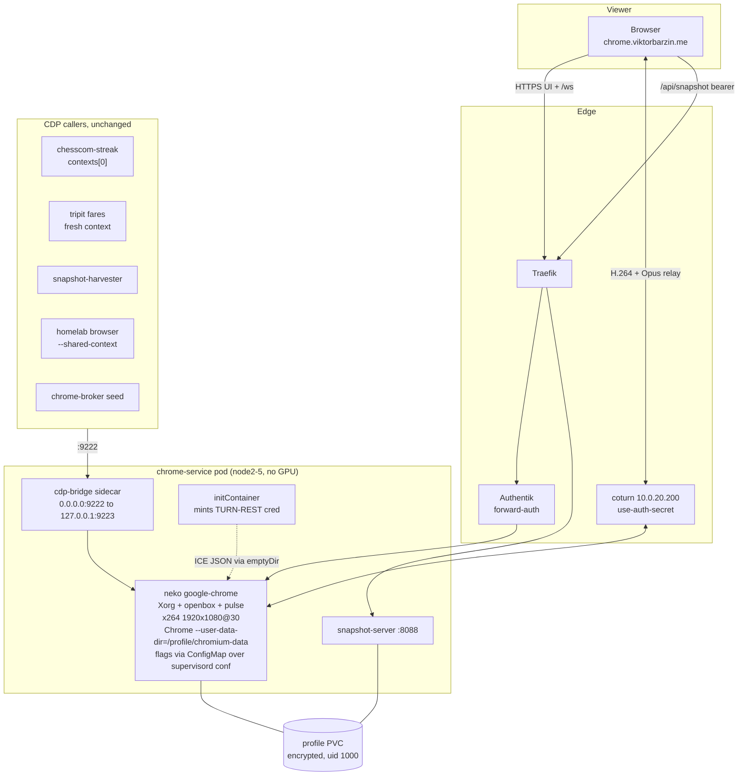

# chrome-service — neko WebRTC display for the master browser

**Status:** done — implemented and verified 2026-08-11
**Date:** 2026-08-11
**Owner:** Viktor
**Stack:** `infra/stacks/chrome-service` (+ a one-record addition to `infra/stacks/technitium`)
**Related:** infra#81 (proxy neko migration) · `docs/architecture/chrome-service.md` · `docs/plans/2026-07-25-proxy-scale-design.md`

## Goal

Give the long-lived chrome-service master browser the same viewing experience the
proxy per-user browsers already have: [neko](https://neko.m1k1o.net) v3 WebRTC —
H.264 video, Opus audio, a window manager, live resolution changes, and the neko
UI — replacing the current noVNC (`x11vnc` + `websockify`) view at
`chrome.viktorbarzin.me`.

Everything the master exists for stays exactly as it is: real Google Chrome with
proprietary codecs, the warmed persistent profile, CDP on `:9222`, and all five
callers.

```stats
1920x1080@30 | display resolution
~1.2 cores | while a viewer is attached
0 | GPU slices needed
5 | CDP callers preserved
```

### Terminology note

The proxy stack's README still describes its display as KasmVNC. That was true
until the neko migration landed; `stacks/proxy/files/broker/broker.py` now runs
`ghcr.io/m1k1o/neko/nvidia-chromium:3.1.4`. This design fixes that README line
as a side item so the next reader starts from the current picture.

## Starting state

| Surface | View today |
|---|---|
| **Master browser** (`chrome.viktorbarzin.me`) | noVNC — `x11vnc` → `websockify` :6080, `Xvfb :99` at `1920x1080x24`, no audio, no window manager, Authentik-gated |
| **FleetView** (`chrome-fleet`) | 4s-refresh CDP screenshots of pool sessions |
| **Pool workers** | no view |

The master pod is a single-replica Deployment with three containers:
`chrome-service` (Chrome + Xvfb + `cdp_bridge.py`), `novnc`, `snapshot-server`.

## Scope

**In scope:** the master browser's display only.

**Out of scope:** the pool workers and FleetView. Burst workers keep their
screenshot thumbnails; they are short-lived automation sessions where a live
interactive stream isn't what's needed, and one stream per worker (up to
`MAX_WORKERS=6`) would multiply encode cost for that.

## Decisions

### D1 — neko owns the browser; a ConfigMap keeps our Chrome flags

The `chrome-service` browser container is replaced by the stock upstream neko
**`google-chrome`** image (digest-pinned). neko brings its own Xorg, openbox,
PulseAudio and capture pipeline, and launches the browser from a supervisord
program file:

```ini
# /etc/neko/supervisord/google-chrome.conf  (upstream)
[program:google-chrome]
command=/usr/bin/google-chrome --no-sandbox --window-position=0,0
  --display=%(ENV_DISPLAY)s --user-data-dir=/home/neko/.config/google-chrome
  --no-first-run --start-maximized --bwsi --force-dark-mode
  --disable-file-system --disable-gpu --disable-software-rasterizer
  --disable-dev-shm-usage
```

That file is a plain config file, so a ConfigMap mounted over it (subPath) gives
us full control of Chrome's command line inside a stock image. We keep
chrome-service's current flag set verbatim — `--user-data-dir=/profile/chromium-data`,
`--remote-debugging-port=9223`, `--remote-allow-origins=*`,
`--disable-blink-features=AutomationControlled`,
`--autoplay-policy=no-user-gesture-required`, `--password-store=basic`,
`--use-mock-keychain` — and drop `--bwsi` (browse-without-sign-in) and
`--disable-file-system`, which would work against a persistent logged-in profile.

Consequences of this shape:

- **No profile migration.** The profile stays at `/profile/chromium-data` on the
  existing encrypted PVC. Verified: the master already runs as UID/GID 1000 with
  `fsGroup: 1000` and `/profile/chromium-data` is owned `1000:1000`; neko's `neko`
  user is also UID 1000, so no chown is needed.
- **No custom image and no new GHA workflow.** The pool workers keep using
  `ghcr.io/viktorbarzin/chrome-service-browser:latest`, so that image and its
  workflow stay as they are.
- **Real Google Chrome is preserved.** This is why the `google-chrome` variant is
  used rather than `chromium`: the Playwright-bundled and Chromium builds have
  proprietary H.264/AAC compiled out, which is the original reason the master
  moved to `google-chrome-stable`.

The alternative considered was neko as a capture-only sidecar against the
existing `Xvfb :99` (both `desktop.display` and `capture.video.display` exist).
It would have left the browser container untouched, but neko's supervisord owns
xorg/pulse/app, input injection prefers its own `xf86-input-neko` driver, and
Xvfb offers no RANDR mode list for live resizing — so it would deliver fewer of
neko's features (fixed resolution, no window manager) through a path upstream
doesn't document.

### D2 — Software x264 at 1920x1080@30, no GPU

The neko spike measured software x264 at ~25 fps @1920x1080 for ~1.2 cores
while a viewer is attached, ~0 idle (memory #10242). The master's framebuffer
is already 1920x1080, so this needs no GPU and no node pinning, and resolution
is still changeable live from the neko UI.

GPU NVENC was considered and set aside for now. It would give ~0.9 cores at
1440p, but it needs three things this design avoids: a custom
`nvidia-google-chrome` neko image (upstream publishes no such tag — the
`--flavor nvidia --application google-chrome` build combination exists but isn't
built for us), a `gpumem_total_mib` bump, and pinning an always-on pod to the
tainted GPU node1.

Current GPU budget, for the record: node1 advertises
`viktorbarzin.me/gpumem=14k` and declared tenants sum to 13,984 MiB → 16 MiB
free, while the T4 physically reports 9,892 of 15,360 MiB used. Declared budgets
exceed measured use, so a bump is physically defensible; it would spend the
margin that protects tenants from OOMing each other. The proxy's
`GPU_BROWSERS_MAX=1` slot is also already occupied.

If 1080p software encode turns out to be less smooth than the proxy in practice,
the container spec can gain a GPU branch later, the way the proxy broker already
branches on `NEKO_GPU`.

### D3 — Authentik forward-auth stays, plus a neko admin password

`chrome.viktorbarzin.me` keeps `auth = "required"`, unchanged from today, and
neko additionally runs with `NEKO_MEMBER_PROVIDER=multiuser` and an admin
password sourced from Vault via the existing ESO `chrome-service-secrets`. A
bookmark carrying `?pwd=…` keeps it one click.

Two gates rather than one is deliberate: this browser holds every cookie Viktor
has logged in by hand, so a single misconfigured gate shouldn't expose it. The
NetworkPolicy admitting only the `traefik` namespace to the UI port stays as a
third layer.

**To verify at rollout:** that Authentik forward-auth passes neko's `/ws`
upgrade. The `stacks/terminal` ttyd stack demonstrates same-origin WS working
behind forward-auth, and `NEKO_SERVER_PROXY=true` handles the proxy headers. The
proxy stack avoided forward-auth on its per-browser ingress for KasmVNC's WS —
if neko's `/ws` turns out to have the same problem, the fallback is the proxy's
token-in-URL model.

### D4 — Media relays through coturn, mirroring the proxy

WebRTC media uses the running coturn (`10.0.20.200`, `use-auth-secret`), exactly
as the proxy browsers do — no new network plumbing, and it works from anywhere.
Unlike the proxy browsers, chrome-service isn't behind gluetun, so it has
ordinary cluster DNS and can reach coturn by Service name.

A MetalLB IP with a direct host candidate was considered (16 IPs are free in
`10.0.20.200-220`) and set aside in favour of matching the proven proxy path.

**TURN credentials without a broker.** The proxy mints ephemeral TURN-REST creds
in its Python broker at pod-creation time; the master is a plain Terraform
Deployment with nothing equivalent. An initContainer computes
`HMAC-SHA1(turn_secret, "<expiry>:chrome-service")` at pod start and writes the
ICE-server JSON to a shared `emptyDir`; the neko container's command wraps the
stock entrypoint to load it:

```sh
export NEKO_WEBRTC_ICESERVERS_BACKEND="$(cat /ice/backend.json)" \
       NEKO_WEBRTC_ICESERVERS_FRONTEND="$(cat /ice/frontend.json)"
exec /usr/bin/supervisord -c /etc/neko/supervisord.conf
```

This re-mints on every restart, so there's no long-lived credential to rotate by
hand, and Reloader already restarts the pod when the synced secret changes.

### D5 — noVNC is removed; neko's screencast is the fallback

The `novnc` container, the `chrome-service-novnc` image and its
`build-chrome-service-novnc.yml` workflow all go away, and neko's built-in
fallback is enabled instead:

```
capture.screencast.enabled = true      # JPEG over HTTP when WebRTC can't connect
capture.screencast.rate    = 10/1
capture.screencast.quality = 60
```

Upstream is explicit that screencast is a fallback and not a primary stream
(high latency, low quality) — which is exactly the role noVNC was filling. Two
documented operational gotchas retire with the container: x11vnc's fd-table
sweep on a container with an unbounded `RLIMIT_NOFILE`, and the x11vnc
supervision loop that kept the view from going black after a browser restart.

### D6 — `/api/snapshot` keeps its path

neko serves its own `/api/*` (verified live: `GET /api/sessions` → 401,
`GET /health` → `true`). The snapshot ingress stays at
`chrome.viktorbarzin.me/api/snapshot` and relies on Traefik's longest-rule-wins
priority over neko's `PathPrefix(/)`, verified with one `curl` after rollout.

Three live consumers hardcode that URL —
`playwright-snapshot-refresh@{wizard,emo,ancamilea}`, every 30 minutes — so
moving it would need a coordinated edit on other people's machines. Their
failure mode is safe if the routing is ever wrong: the script writes a temp
file, checks the HTTP status, and only `mv -f`s on success, so a 401 leaves the
cached cookies untouched. `PLAYWRIGHT_SNAPSHOT_URL` overrides the URL if a move
is ever wanted.

### D7 — Internal DNS record for `turn.viktorbarzin.me`

Add `turn.viktorbarzin.me → 10.0.20.200` to the technitium stack.

> [!IMPORTANT]
> Without this record the new view won't connect from a client using LAN DNS,
> and the same gap affects the proxy view today. `stacks/technitium/main.tf`
> currently has uncommitted local edits from other work — coordinate before
> touching it.

Verified gap: Technitium is authoritative (`flags: aa`) for `viktorbarzin.me` and
returns **NXDOMAIN** for `turn.viktorbarzin.me`, while public DNS resolves it to
the WAN IP. A client using LAN DNS therefore gets no STUN and no TURN candidate,
and neko's remaining host candidate is a pod IP that isn't LAN-routable — so the
view wouldn't connect at all from such a client. The proxy view works today from
devices that bypass Technitium (browser DoH) or are off-LAN.

What this record fixes, and what it doesn't: it fixes name resolution, not the
network path.
coturn runs `listening-ip=0.0.0.0` with `external-ip=<WAN>` and no private
mapping, so relay candidates are always advertised on the WAN IP and LAN media
still hairpins through it. Giving LAN clients a LAN-local relay candidate would
need a dual `external-ip` mapping or a second listener — a possible follow-up,
not part of this change.

## Target shape



## Engineering calls (not decision points, recorded for review)

- **`cdp_bridge.py` moves to its own sidecar.** Stock Chrome ignores
  `--remote-debugging-address`, so the existing bridge (`0.0.0.0:9222` →
  `127.0.0.1:9223`) is still needed, and the neko image has no python3. It runs
  as a small `python:3.12-slim` sidecar in the same netns, mounting the existing
  `scripts` ConfigMap unchanged. The `/json/version` liveness probe — which
  catches the wedged-Chrome class that a TCP probe misses — runs from that
  sidecar.
- **Resources:** `cpu: request 1` with no limit (house policy), memory request
  3Gi / limit 4Gi, `/dev/shm` `emptyDir` sized 1Gi. The CPU request rises from
  today's `200m` because an encoder with a low request can be squeezed under node
  contention and drop frames; the encoder is idle when nobody is watching.
  `/dev/shm` on `medium: Memory` counts against the container memory limit.
- **Audio on** (PulseAudio → Opus), part of the display parity being asked for.
- **Image digest-pinned**, `keel.sh/policy = never` stays.
- **Port the proxy's fullscreen guard if it appears.** Chrome persists a
  fullscreen window state per profile that `--start-maximized` doesn't override;
  the proxy needed an F11 nudge after launch so the address bar stays reachable.
  With openbox now present this may not reproduce — check, and port the guard
  only if it does.

## Rollout

Cut over in place. Every consumer degrades gracefully, and reverting is a
Terraform revert.

1. **Snapshot the profile first** — a fresh `tar` of `/profile` beside the
   existing 6-hourly NFS backup, so the hand-made logins have a known-good
   restore point.
2. Claim presence on `stack:chrome-service`.
3. Land the stack change: neko container + ConfigMap flag override +
   initContainer + cdp-bridge sidecar; remove the `novnc` container, image and
   workflow; add the technitium record.
4. **Verify, in this order:**
   - `GET /health` on the pod → `true`; the neko UI loads through Authentik and
     `/ws` upgrades.
   - WebRTC connects and video is smooth; audio plays; a live resolution change
     works.
   - `curl -H "Authorization: Bearer …" https://chrome.viktorbarzin.me/api/snapshot`
     still returns the storage state (Traefik priority holds).
   - CDP callers: `chesscom-streak` against `contexts[0]` (the profile logins
     must still be there), a tripit fare quote, the snapshot-harvester CronJob,
     `homelab browser --shared-context`, and the broker's seed export.
   - From a LAN client on Technitium DNS, confirm the view connects now that
     `turn.viktorbarzin.me` resolves.
5. Update `docs/architecture/chrome-service.md` — the noVNC sections, the two
   x11vnc gotchas, and the stale `1280x720` window-size line (the deployment
   already runs 1920x1080) — and correct the proxy README's KasmVNC description.

**Revert:** Terraform revert of the stack change. The profile is untouched by
design (same path, same UID), and the tar from step 1 is the backstop.

## As-built — four things the stock image did that the design didn't predict

The shape above survived; these are the deltas found while rolling it out, each
fixed in place. All four came from the same root: the stock neko image is built
for a public kiosk browser, and this stack wants a scriptable one.

1. **Upstream's managed Chrome policy disables DevTools.** The image ships
   `/etc/opt/chrome/policies/managed/policies.json` with
   `DeveloperToolsAvailability: 2`, and Chrome then answers browser-level CDP
   (`/json/version`, `Browser.getVersion`) while refusing every per-page session
   with `-32001 Session with given id not found` — so `connect_over_cdp` hangs and
   times out, breaking all five callers. Isolated with a dependency-free raw CDP
   client (reproduced outside Playwright) plus the pool worker's Chrome as a
   control, where the identical probe returns `{"result":{}}`. Fixed by mounting
   our own copy of the policy with `DeveloperToolsAvailability: 0` (Chrome's
   default, and what this browser effectively had before),
   `IncognitoModeAvailability: 0` (`new_context()` is `Target.createBrowserContext`
   — the incognito mechanism) and `DownloadRestrictions: 0`. Diff + evidence:
   `stacks/chrome-service/files/neko/README.md`.
2. **The supervisord file holds two programs, and there is no entrypoint
   wrapper.** Upstream's `google-chrome.conf` defines `[program:openbox]`
   alongside the browser, and a subPath mount replaces the whole file — so the
   first version of our override silently removed the window manager. It also
   copied `/bin/entrypoint.sh` from the proxy's *chromium* variant, which does
   not exist in the google-chrome image, so Chrome never launched. Both fixed by
   reading the file out of the actual pinned image rather than from upstream's
   default branch.
3. **`NEKO_CAPTURE_VIDEO_CODEC=h264` alone does not change the encoder.** With no
   pipeline set, neko logs "no video pipelines specified, using default" and
   builds a `vp8enc` pipeline at ~2 Mbps regardless of the codec. The stream is
   H.264 only with an explicit `NEKO_CAPTURE_VIDEO_PIPELINE`; ours is the proxy's
   shape with `x264enc` (4 Mbps, `tune=zerolatency speed-preset=veryfast`) in
   place of its GPU `nvh264enc`.
4. **Chrome's profile singleton lock blocks startup across pod renames.** The
   lock is a symlink named `<hostname>-<pid>`; a rollout changes the pod name, so
   the previous pod's lock names a host Chrome cannot verify and it refuses to
   start. The `fix-perms` initContainer now clears the three `Singleton*` files.

Two operational notes worth keeping:

- **A subPath ConfigMap mount does not hot-update, and a liveness-driven
  container restart does not remount it** — only a pod recreation picks up a new
  ConfigMap. Expect a rollout, not a restart, when changing either file.
- **A push that lands while CI is mid-apply cancels it** (Woodpecker
  cancel-on-new-push). Here that left `neko-conf` and the turn ExternalSecret
  created in the cluster but absent from Terraform state, and the next apply
  failed with "already exists"; recovery was deleting the two orphaned objects so
  the following apply could own them. Avoid pushing again while an apply is
  running.

## Verified live (2026-08-11)

| Check | Result |
|---|---|
| Chrome + openbox + Xorg running under neko | yes, `Chrome/147.0.7727.55` |
| Encoder | `x264enc` H.264, 4 Mbps, 1920x1080@30 |
| CDP session (flattened auto-attach) | `Page.enable` → `{"result":{}}` |
| Persistent profile (`contexts[0]`) | 133 cookies / 33 domains, chess.com session present (23 cookies) |
| Fresh `new_context()` | isolated, 0 cookies |
| snapshot-harvester CronJob | wrote a 38,147-byte snapshot |
| `homelab browser --shared-context` | connected to the master, 133 cookies |
| chrome-broker `/seed` | 133 cookies |
| `chrome.viktorbarzin.me/api/snapshot` | HTTP 200, parses (Traefik priority holds) |
| `chrome.viktorbarzin.me/` unauthenticated | 302 → Authentik authorize |
| neko screencast fallback | endpoint live (401 = auth-gated) |
| `turn.viktorbarzin.me` on internal DNS | `10.0.20.200` (was NXDOMAIN) |

## Still to confirm in a browser

Not verifiable from a shell; these need the view opened once:

- neko's UI loading through Authentik forward-auth and its `/ws` upgrade
  surviving it (D3's assumption; the ttyd stack is the precedent, and the
  token-in-URL fallback is the remedy if it fails).
- WebRTC actually connecting through the coturn relay, audio, and a live
  resolution change — plus whether 1080p software x264 feels as smooth as the
  proxy's 1440p NVENC (D2 records the GPU path if not).
- The same from a LAN client, now that `turn.viktorbarzin.me` resolves.

## What we don't know yet

These were verification steps in the rollout above, and the ones now settled are
recorded in the table above:

- The ConfigMap-over-supervisord mount works (settled — see As-built 2 for what
  the file actually contained).
- Chrome's persisted fullscreen state did not reproduce under openbox during the
  rollout; the proxy's F11 guard was not needed and was not ported.
- The `/ws`-behind-Authentik question and the subjective smoothness comparison
  remain open — see "Still to confirm in a browser".
