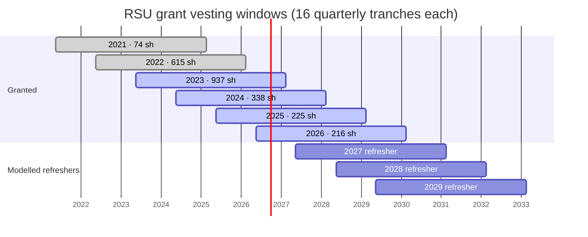
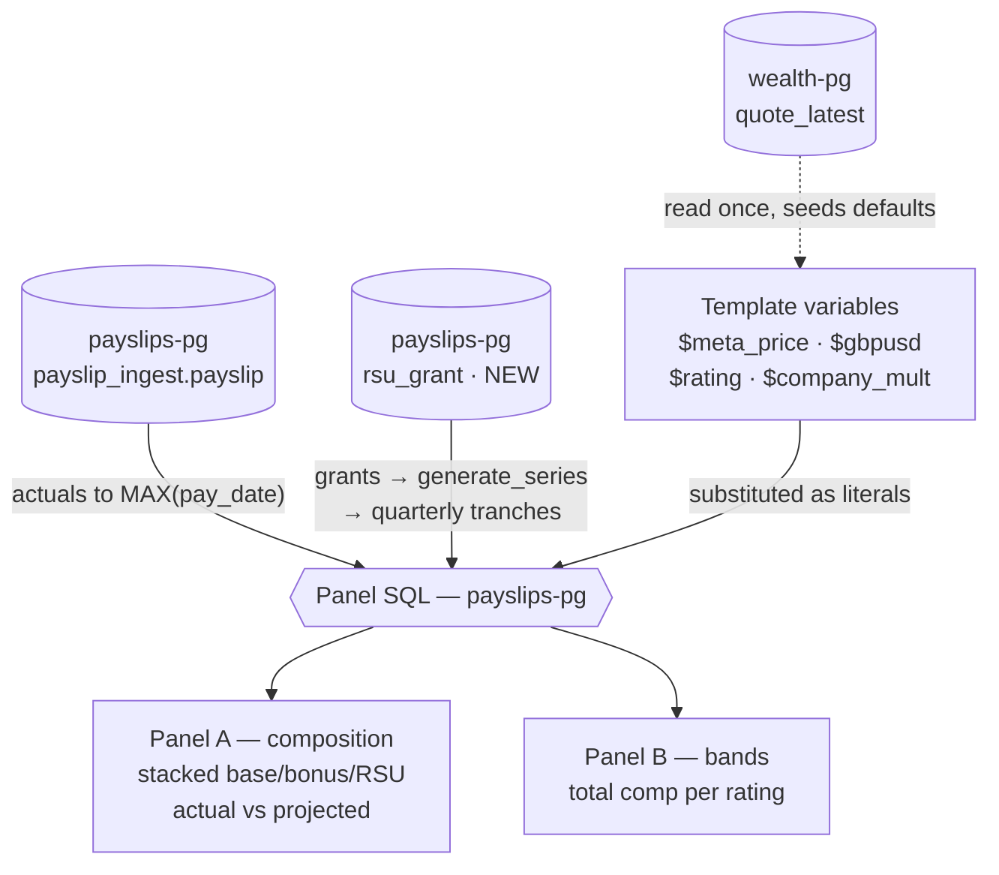

# Wealth dashboard — gross income projection (2026-08-11)

**Status:** proposed, awaiting approval
**Dashboard:** `wealth` (UID `wealth`), `stacks/monitoring/modules/monitoring/dashboards/wealth.json`
**Also touches:** `payslip-ingest` (new Alembic migration + seed)

## Goal

The `wealth` dashboard shows income history — net pay versus market gain, effective
hourly rate — but stops at the present. This adds a forward view of **gross total
comp** (base + bonus + RSU vest value) so the RSU vesting profile is visible several
years out rather than inferred.

Two assumptions are held fixed by request: base salary stays flat, and the META share
price stays where it is today. What moves is the **number of shares vesting**, which
is driven by the grant stack rolling off and new refreshers coming on.

A performance rating band is layered on top, because the same rating drives both the
cash bonus and the size of each year's equity refresher.

```stats
£348.5k | 2026 gross comp (Excellent)
£247.2k | steady state from 2031
2027 | first year of the step down
2 | new panels
```

> [!NOTE]
> This is a model, not a forecast. Base salary and the META price are held flat by
> design, so the shape reflects the share count vesting rather than any view on pay
> reviews or the stock.

## Decisions

Settled during the grilling interview on 2026-08-11.

| # | Decision | Choice |
|---|---|---|
| 1 | Income measure | Gross total comp (base + bonus + RSU), no tax model |
| 2 | Future refreshers | Included, scaled by rating |
| 3 | Grant data home | New `payslip_ingest.rsu_grant` table |
| 4 | Time axis | Calendar year, yearly bars |
| 5 | Composition | Stacked base / bonus / RSU, actual and projected as distinct series |
| 6 | Actual→projected boundary | Splice at `MAX(pay_date)`, self-healing as payslips land |
| 7 | Price and FX | Editable textbox variables, seeded from today's live quotes |
| 8 | Bonus | Formula-driven, `base × 15% × ratingMult × companyMult` |
| 9 | Placement | Top of the existing `Projections` row |
| 10 | Band scope | Rating drives bonus and refreshers together |
| 11 | Band rendering | Two panels — composition (one rating) + bands (all ratings) |
| 12 | Bands shown | Excellent (1.15) and Outstanding (2.0); Excellent is the default |
| 13 | Window | 2021 → 2032 fixed; company multiplier a textbox defaulting to 1.0 |

Decision 2 reverses an earlier granted-only choice. Rating affects RSUs only through
future refreshers — already-granted RSUs are contractually fixed — so a rating band
has no effect on equity unless refreshers are modelled.

## The comp model

Both formulas come from `rsu-calculator.js` (Viktor's copy, Nextcloud root; the
Meta-internal equity_refreshers source). They were checked against actual outcomes
before being adopted.

### Bonus

```
bonus paid in year Y = base salary paid in (Y−1) × bonusPct × ratingMult × companyMult(Y)
```

`bonusPct` for IC5 is 0.15. Validated to the pound across three years:

| Paid | Base (Y−1) | Rating | companyMult | Predicted | Actual |
|---|---|---|---|---|---|
| Mar 2024 | £110,467 | CME 1.0 | 1.50 | £24,855 | £24,855 |
| Mar 2025 | £115,068 | EE 1.25 | 1.25 | £26,969 | £26,969 |
| Mar 2026 | £119,347 | EE 1.25 | 1.15 | £25,734 | £25,734 |

### Equity refresher

```
refresher USD = countryMult × ratingMult × jobLevelBase
shares        = ceil(refresher USD ÷ stock price)
```

`countryMult` for GB is 0.8; `jobLevelBase` for IC5 is 149,625. Validated to the share:

| Grant | Calculation | Shares | Actual |
|---|---|---|---|
| 2026 | 0.8 × 1.25 × 149,625 = $149,625 ÷ $693.37 | 216 | 216 |
| 2025 | 0.8 × 1.25 × 157,797 = $157,797 ÷ $701.32 | 225 | 225 |

The company multiplier applies to the cash bonus only, not to equity.

### Rating multipliers

Grants from 2027 onward use the newer scale. The older scale applies to 2026 and
earlier, which matters only for reproducing history.

| Scale | Ratings |
|---|---|
| 2026 and earlier | RE 2.5 · GE 1.65 · EE 1.25 · CME 1.0 · MM · MS · MN · TNTE · OL · NA |
| 2027 onward | MetaAward 3.0 · Outstanding 2.0 · Excellent 1.15 · NRE 1.0 · NeedsImprovement 0.5 · NME 0 |

The calculator defines these multipliers for equity. That the **bonus** uses the same
multipliers is a derivation, not something the file states — it reproduced three years
of actual bonuses exactly on the older scale, so carrying it onto the newer scale is a
reasonable extension, though not independently confirmed.

### Vesting

Each grant vests in 16 equal quarterly tranches beginning **May of the grant year**,
then August, November, and February, so a grant spans just under four calendar years.

Reconstructed from live data rather than assumed. Payslip-derived gross RSU value
(`taxable_pay − salary − bonus + pension_sacrifice`) divided by each vest's FMV gives
an implied gross share count:

| Vest | Gross RSU | Implied shares | Model | Grants active |
|---|---|---|---|---|
| 2025-08 | £76,636 | ~134 | 132.2 | 2022, 2023, 2024, 2025 |
| 2025-11 | £61,480 | ~137 | 132.2 | 2022, 2023, 2024, 2025 |
| 2026-02 | £62,694 | ~132 | 132.2 | 2022, 2023, 2024, 2025 |
| 2026-05 | £49,442 | ~110 | 107.25 | 2023, 2024, 2025, 2026 |

The step down between Feb 2026 and May 2026 is the 2022 grant's final tranche. A
February vest start for that grant would put its last tranche in Nov 2025 and imply
withholding jumping from ~27% to ~49% between consecutive quarters, which the data
does not support. May start reproduces both quarters at a consistent ~51%.

Resulting windows:



## Data flow

Grafana cannot join across datasources, so price and FX cross the boundary as
template-variable text substitution rather than as a SQL join.



## Schema change

New table in the `payslip_ingest` schema, via Alembic migration `0009`. It holds
grants, not vest events; the panel SQL expands each grant into tranches with
`generate_series`.

```sql
CREATE TABLE payslip_ingest.rsu_grant (
    id           SERIAL PRIMARY KEY,
    grant_year   INTEGER      NOT NULL UNIQUE,
    ticker       VARCHAR(16)  NOT NULL DEFAULT 'META',
    shares       NUMERIC(14,4) NOT NULL,
    first_vest   DATE         NOT NULL,
    tranches     INTEGER      NOT NULL DEFAULT 16,
    grant_price_usd NUMERIC(12,4),
    source       VARCHAR(64),          -- e.g. 'paperless:297'
    note         TEXT,
    created_at   TIMESTAMPTZ  NOT NULL DEFAULT now()
);
```

Seed:

| grant_year | shares | first_vest | grant_price_usd | source |
|---|---|---|---|---|
| 2021 | 74 | 2021-05-15 | ~300 | Paperless id=47 |
| 2022 | 615 | 2022-05-15 | ~220 | Paperless id=102 |
| 2023 | 937 | 2023-05-15 | 184.07 | Paperless id=35 |
| 2024 | 338 | 2024-05-15 | 466.53 | Paperless id=230 |
| 2025 | 225 | 2025-05-15 | 701.32 | Paperless id=267 |
| 2026 | 216 | 2026-05-15 | 693.37 | Paperless id=297 |

Grant counts and prices are re-read from the Paperless documents at implementation
time rather than seeded from recall. `rsu_vest_events` (created by migration 0008,
currently empty) is left alone — its columns describe settled actuals and are not
meaningful for a projection.

Adding a year later is one `INSERT`, with no dashboard edit.

## Panels

Both go at the top of the `Projections` row, half width, side by side. `barchart` is
used rather than `timeseries` because its x-axis is categorical and therefore
independent of the dashboard time picker — the same reason the existing net-worth
projection is a `trend` panel.

### Panel A — "Gross income — composition"

Stacked `barchart`, x = calendar year, 2021 → 2032. Six series so actual and projected
are visually distinct:

- Base (actual) · Bonus (actual) · RSU (actual) — full opacity
- Base (projected) · Bonus (projected) · RSU (projected) — reduced opacity

Driven by `$rating`. Actual side reads `taxable_pay + pension_sacrifice`, split into
`salary`, `bonus`, and RSU-by-subtraction — the `rsu_vest` column is not used, for the
reason in *Related findings*.

The current year is spliced: months up to `MAX(pay_date)` are actual, later months
projected. Both portions appear in the same bar.

### Panel B — "Gross income — rating bands"

`timeseries` (lines), x = calendar year, one line per rating: Excellent (1.15) and
Outstanding (2.0), each plotting total gross comp. History is shared, so the lines
diverge from 2027 onward.

### Template variables

Five new, joining the nine already on the dashboard.

| Variable | Type | Default | Purpose |
|---|---|---|---|
| `meta_price` | textbox | `605.83` | META price held flat |
| `gbpusd` | textbox | `1.35126` | GBP/USD held flat |
| `rating` | custom | `Excellent` | Drives panel A; Excellent / Outstanding |
| `company_mult` | textbox | `1.0` | Bonus company multiplier |
| `ic_level` | constant | `IC5` | Level base 149,625; documents the assumption |

Defaults come from `wealth-pg.quote_latest` as of 2026-08-11 (META $605.83, GBP/USD
1.35126). Textbox variables give direct scenario control in both dimensions. They do
not refresh on their own — the live values stay visible in the `Price freshness` stat
already on the dashboard, and the panel description records the seed date so drift is
noticeable.

`company_mult` defaults to 1.0 because that is what the calculator itself carries for
2027, marked as a placeholder pending the CFO post. Recent history ranges 0.85–1.50.

## What the projection says

At $605.83, GBP/USD 1.35126, base £123,682, companyMult 1.0. Illustrative — the
panels compute these live.

**Excellent (1.15)** — refresher $137,655/yr ≈ 228 shares, bonus £21,335:

| Year | RSU shares | RSU £ | Base £ | Bonus £ | Total £ |
|---|---|---|---|---|---|
| 2026 | 453.9 | 203,520 | 123,682 | 21,335 | **348,538** |
| 2027 | 296.1 | 132,738 | 123,682 | 21,335 | **277,755** |
| 2028 | 231.1 | 103,624 | 123,682 | 21,335 | **248,641** |
| 2029 | 224.8 | 100,793 | 123,682 | 21,335 | **245,811** |
| 2030 | 227.2 | 101,886 | 123,682 | 21,335 | **246,903** |
| 2031+ | 228.0 | 102,223 | 123,682 | 21,335 | **247,240** |

**Outstanding (2.0)** — refresher $239,400/yr ≈ 396 shares, bonus £37,105:

| Year | RSU shares | RSU £ | Total £ |
|---|---|---|---|
| 2026 | 453.9 | 203,520 | **364,307** |
| 2027 | 327.6 | 146,861 | **307,647** |
| 2028 | 304.6 | 136,577 | **297,364** |
| 2029 | 340.3 | 152,577 | **313,364** |
| 2031+ | 396.0 | 177,544 | **338,331** |

The step from 2026 to 2028 is the 2022 and 2023 grants finishing — 615 and 937 shares
granted at roughly $220 and $184, now vesting at today's price. Under
Excellent that is about −£100k over two years, settling near £247k. Under Outstanding
the trough is shallower and recovers as larger refreshers stack, settling near £338k.

The 2026 figures above are whole-year model values; the delivered panel splices actual
data for January–May, where the real bonus was £25,734 rather than the formula value.

## Open questions

- **Bonus multipliers on the 2027+ scale are a derivation.** The calculator defines
  rating multipliers for equity only. They reproduced three years of bonuses exactly
  on the older scale, so the same mapping is applied to the newer one. Worth revisiting
  when the first new-scale bonus lands in March 2027.
- **2027+ config values are placeholders.** The calculator carries stock price 660.0
  and companyMultiplier 1.0 for 2027, both marked TODO. The price is overridden by
  `$meta_price`; the company multiplier is exposed as a textbox.
- **August 2024 shows about 35 more shares than the six known grants account for.**
  Every quarter from November 2024 onward matches the model, so this looks like a
  one-off award rather than an ongoing grant, and it does not affect any future vest.
  Worth a look in Paperless, but not blocking.
- **Level is assumed to stay IC5.** A promotion to IC6 would raise the level base to
  234,270 and the bonus target to 20%. Not modelled; `$ic_level` is a constant that
  documents the assumption and leaves room to extend.
- **Whole-share rounding is not modelled.** Tranches are computed as `shares ÷ 16`
  rather than the alternating whole-share pattern Meta actually pays. The difference is
  under one share per quarter.

## Related findings, out of scope here

- **Payslip ingest has been idle since 2026-06-02.** June and July 2026 payslips are
  absent; the last row is 2026-05-29. `payslip-ingest` is webhook-driven from
  Paperless, and the only CronJob in the namespace is a suspended actualbudget sync.
  The splice design tolerates this by keying on `MAX(pay_date)`, so the projection
  stays correct while the gap persists. Tracked separately.
- **`payslip.rsu_vest` under-reports by roughly half.** For calendar 2025 it reads
  £132,480, while `taxable_pay − salary − bonus + pension_sacrifice` gives £253,879,
  consistent with the known tax-year figure. Every panel here derives RSU by
  subtraction instead. Fixing the parser is separate work.

## Build, deploy, verify

1. **Grant data** — re-read grant counts and prices from the Paperless grant agreements
   and year-end letters; reconcile against `wealth-pg.activities` vest history before
   seeding.
2. **Migration** — add Alembic `0009_rsu_grant` to `payslip-ingest` with the table and
   seed. Tests first, per the repo's TDD convention.
3. **Deploy payslip-ingest** — push, watch the GitHub Actions build through to the
   rollout, confirm the migration applied and the table is populated.
4. **Panel SQL** — develop both queries against live `payslips-pg`, checking projected
   years against the tables above and actual years against the existing income panels.
5. **Dashboard** — add both panels and the five variables to `wealth.json` via a
   one-off builder script kept outside the repo; validate JSON, unique panel ids, clean
   `gridPos`.
6. **Apply** — claim presence, then
   `scripts/tg apply -target='module.monitoring.kubernetes_config_map.grafana_dashboards["wealth.json"]'`
   (targeted, since the monitoring stack carries unrelated drift).
7. **Verify** — ConfigMap matches the local file; both panels render without touching
   the time picker; the 2026 bar shows actual and projected portions; switching
   `$rating` moves panel A and both lines stay put in panel B.

## Risks

| Risk | Mitigation |
|---|---|
| Seeded grant data wrong | Re-read from Paperless; reconcile against vest history before seeding |
| Price/FX textboxes drift from reality | Panel description records the seed date; live values remain on the `Price freshness` stat |
| Projection read as a forecast | Panel titles and descriptions state the held-flat assumptions and the rating in force |
| Monitoring stack drift on apply | Targeted apply against the dashboard ConfigMap only |
| Migration fails on deploy | Additive table with no dependants; safe to roll back |
