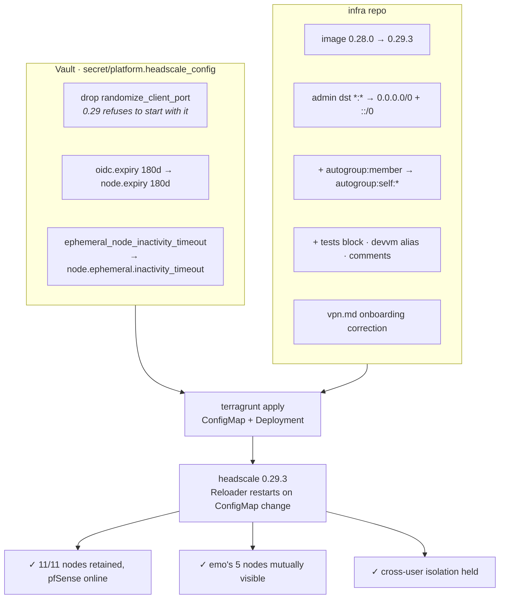

# Headscale 0.29.3 upgrade + per-user device reachability

**Status:** done (applied and verified 2026-08-14)
**Issue:** [infra#24](https://forgejo.viktorbarzin.me/viktor/infra/issues/24)
**Follow-ups:** infra#25 (pfSense client floor), infra#26 (backup-mx tailnet hygiene)

## The problem

Emo reported that two nodes registered under his own Headscale user could not
see or reach each other: `emo-laptop2` (100.64.0.60) and `devvm-emo`
(100.64.0.61). `tailscale ping` returned `no matching peer`, symmetrically and
stably across daemon restarts.

His diagnosis in the issue was correct. The `dst` lists for
`group:sofia-lan-users` and `group:wan-users` enumerate the public internet as
CIDR blocks that deliberately skip `100.64.0.0/10` — the range the tailnet
itself uses:

```
"100.0.0.0/10:*"    ->  100.0.0.0   - 100.63.255.255
"100.128.0.0/9:*"   ->  100.128.0.0 - 100.255.255.255
                         ^ 100.64.0.0/10 is the gap
```

The only rule permitting traffic *inside* the tailnet was DNS
(`tailnet → dnsvm:53, pfsense:53, technitium:53`), and `*:*` was granted only to
`group:admin`. So a non-admin user got the Sofia LAN and the internet, but never
their own second device. Viktor's nodes appeared in emo's peer list only because
`group:admin` holds `*:*`, which makes them mutually visible.

## Decision

Fix it generically rather than per-person:

```json
{ "action": "accept", "src": ["autogroup:member"], "dst": ["autogroup:self:*"] }
```

`autogroup:self` resolves per-node to untagged nodes sharing the source node's
`UserID`, and headscale filters the sources to that same user. One rule covers
every user's own devices, now and for any device added later, and grants nothing
across users. Tagged nodes (pfSense) never match it, by design.

Port scope is all-ports rather than the `:22` the issue proposed. Both ends are
one person's own machines, which already reach the Sofia LAN and the whole
internet; narrowing to SSH would have cost `ping` and RDP without removing a
capability an attacker holding one of those nodes wouldn't already have. No
`proto` block is needed — with no protocol set, 0.29 includes ICMP and IPv6-ICMP
in the default filter rules alongside TCP/UDP.

### Why this required the upgrade first

`autogroup:self` parses on 0.28.0, but using it flips `usesAutogroupSelf` and
moves the policy manager onto the per-node compile path. That path in 0.28.0
still carries the pre-[#3289](https://github.com/juanfont/headscale/pull/3289)
`invalidateAutogroupSelfCache`, which dereferences `node.User().ID()` at 11
sites. `User` is nil on some `SetNodes` write paths, and the upstream PR
describes the result plainly: *"A node restarting `tailscaled` on a tailnet with
an `autogroup:self` policy crashed the control server: every `/machine/map`
returned 500, so no node could fetch a map."* The fix (`TypedUserID()`) ships in
0.29.x. That path is gated behind the flag, so 0.28 was safe only as long as the
policy never used the token.

## What the pre-flight found

The upgrade is one legal hop — 0.29 enforces a strict version path (no skipping
minors, no minor downgrades), and 0.28 → 0.29.3 is exactly one minor. It is not
a tag bump, though. Five things surfaced, three of which would have caused a
visible failure:

| Finding | Effect if ignored |
|---|---|
| `randomize_client_port` removed in 0.29 | **headscale refuses to start** while the key is present |
| `oidc.expiry` → `node.expiry` | **headscale refuses to start**; found by running the 0.29.3 binary against the live config, not from the release notes |
| `ephemeral_node_inactivity_timeout` → `node.ephemeral.inactivity_timeout` | key silently ignored, timeout falls back to default |
| Bare `*` redefined to mean the tailnet ranges, not all IPs | `group:admin`'s `dst: ["*:*"]` **silently drops** the Sofia LAN, the mgmt/k8s VLANs behind the subnet router, and exit-node internet |
| Client floor raised to capver 113 (Tailscale ≥1.80) | a client below the floor is refused at `/key` and `/ts2021` |

All three config keys were already at their default values, so migrating them
changed no behaviour — with one exception worth recording: `node.expiry` applies
regardless of registration method, where `oidc.expiry` applied only to OIDC
registrations. Auth-key nodes (mx2) therefore inherit the 180-day expiry they
previously did not have. Tagged nodes stay exempt. Whether mx2 should be tagged
(and so exempt again) is infra#26.

### Client floor

Every node clears capver 113, but pfSense clears it with **zero margin**:

| node | version | headroom |
|---|---|---|
| localhost-8y1ccqtk | 1.102.2 | comfortable |
| localhost, localhost-mtne4hmu | 1.98.9 | comfortable |
| mx2, mx2-qu0j2tds | 1.98.8 | comfortable |
| ipad | 1.98.5 | comfortable |
| iphone-viktor | 1.96.5 | comfortable |
| bgsof-jr8lgx3 | 1.92.1 | comfortable |
| **pfsense** | **1.80.0-dev20250130** | **exactly at the floor** |

That build is tailscale commit `649a71f8a`, whose `CurrentCapabilityVersion` is
113 — verified against the tag rather than inferred from the version string.
pfSense is the subnet router for the whole Sofia estate and the exit node, so
the next headscale minor is expected to cut it off unless its package is
upgraded first. Tracked as infra#25; deliberately not bundled here, since it is
a change to a live network device.

## Applied change



The `group:admin` rewrite to explicit `0.0.0.0/0` + `::/0` preserves the old
"all IPs" meaning past the wildcard redefinition. It validates identically on
0.28.0 and 0.29.3, so it was safe regardless of which image was running when it
landed.

### Policy tests, and what they cannot assert

0.29 evaluates a beta `tests` block on `policy check` and on every SIGHUP
reload. Two assertions are now pinned: admin still reaches off-tailnet
destinations (a Sofia LAN host, the internal Traefik LB, and a public IP — a
tailnet-only `*:*` would still pass a test naming a tailnet IP, so these
deliberately name none), and no user reaches another user's devices.

Same-user reachability is deliberately **not** asserted. `evaluateTests()` builds
its filter from `globalFilterRules()` only, and `autogroup:self` rules are
excluded from the global filter by design because they compile per-node. The
evaluator is therefore structurally blind to them and reports DENIED for a grant
that works correctly in the real netmap. Adding such an assertion fails
`policy check` on a working policy. This is a limitation of the beta evaluator,
confirmed by reading `hscontrol/policy/v2/test.go` at the tag; same-user
reachability is verified against a live client instead.

### Two operational traps recorded in `acl.hujson`

The validation recipe previously documented in the file header could not run:
the in-cluster image is distroless, so `kubectl cp` (needs `tar`) and
`exec ... sh` (no shell) both fail. The working invocation runs the checker in a
local container instead.

That invocation needs `--bypass-grpc-and-access-database-directly`, because in
0.29 `policy check` is otherwise a gRPC client that expects a running server.
**That flag runs schema migrations on whatever database it opens** — it is not a
read-only operation. Always point it at a copy, never at `/mnt/db.sqlite` or at
a backup intended for restore.

## Verification

Taken from the live cluster after apply, not inferred:

- `headscale version` reports v0.29.3; pod `2/2 Running`, no restarts.
- All 11 nodes retained. Everything that was online before the restart came
  back, **including pfSense** (the capver-113 question) and the ephemeral
  `mx2-qu0j2tds`.
- Zero policy-test failures at boot, so the admin off-tailnet assertions and
  both cross-user deny assertions passed against live users and nodes.
- From `devvm-emo`, before: peers were `iphone-viktor`, `localhost-mtne4hmu`,
  `pfsense`. After: all four of emo's other devices appear, and
  `tailscale ping 100.64.0.60` returns `pong ... via 192.168.1.102:41641 in 5ms`
  over a direct path.
- Valentina's node is untagged and separate; it does not appear in emo's peer
  list, and his does not appear in hers.

## Rollback

A minor downgrade is blocked by 0.29's version-path enforcement, and the schema
migration is one-way, so rollback is a database restore rather than a tag
revert:

1. Restore `/srv/nfs/headscale/db.sqlite.bak.pre-0.29.3` (taken immediately
   before the upgrade: 11 nodes, pristine 0.28 schema) over the PVC's
   `db.sqlite`.
2. Revert the image to 0.28.0 **and** the ACL together — 0.28.0 rejects the new
   policy outright (`unknown field "tests"`), so they cannot be reverted
   independently.
3. Restore the previous Vault config revision (version 51).

## Open items

- infra#25 — pfSense tailscale package, before the next headscale minor.
- infra#26 — `tag:backup-mx` exists in the design doc but not in the live
  policy; a stale duplicate `mx2` node (id 7) still holds 100.64.0.7.
- Pre-existing, unrelated: `kubernetes_service.headscale-server` shows perpetual
  drift on the `metallb.io/ip-allocated-from-pool` annotation, which MetalLB
  re-adds after each apply. Present before this change; a fix would be a
  fleet-wide pattern decision rather than a headscale one.
