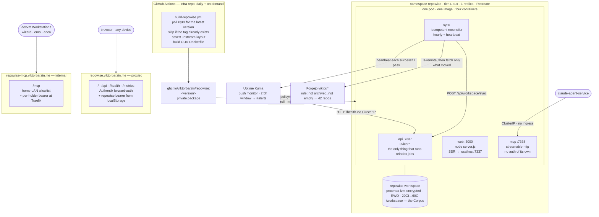

# Repowise — a codebase-intelligence index over the Forgejo Corpus

**Status:** executing · **Date:** 2026-08-14 · **Owner:** Viktor
**Stack:** `infra/stacks/repowise/` · **Image:** `.github/workflows/build-repowise.yml`

## What this is for

[repowise](https://github.com/repowise-dev/repowise) indexes a git repository
once and then answers questions about it: dependency graph, git hotspots and
ownership, code-health scores from 49 deterministic detectors, dead code, change
risk, and cross-repo API contracts. It exposes that through ten MCP tools, a
REST API, and a web dashboard.

We run it so that **AI agents get architectural context cheaply**. That is the
primary consumer, and where the dashboard and the MCP surface pull in different
directions, MCP correctness wins. The dashboard is a genuinely useful window
onto the same index, but it is not what the design optimises for.

It is AGPL-3.0 and self-hostable, and the deterministic half of it makes no LLM
calls at all — so this costs nothing beyond the cluster resources it occupies.

## The Corpus

**Corpus** is our term for the set of repositories repowise indexes, plus their
derived per-repo indexes. It is defined by a rule, not a list:

> every repository under Forgejo `viktor/*` that is neither archived nor empty

Today that is **42 repositories, about 383 MiB**. The reconciler re-evaluates
the rule every pass, so a repo created tomorrow is indexed without anyone
editing Terraform. `audiblez-web` is excluded automatically for being empty.

We say Corpus rather than "workspace" because that word is already taken here:
**Workstation** is a person's devvm environment, `~/code` is a workspace
directory, and the worktree-first workflow adds a third near-homonym. repowise's
own CLI keeps saying `repowise workspace list`; the glossary entry lives in
`CONTEXT.md`.

Repositories that exist only on GitHub (`health`, `learning`,
`interview-prep-app`) are **not** in the Corpus. ADR-0003 makes Forgejo
canonical, so the fix for a missing repo is to mirror it there, after which it
is picked up automatically — rather than teaching the reconciler a second
discovery path and carrying a second credential.

## Architecture

### Why everything lives in one pod

In workspace mode repowise stores each repository's index as SQLite **inside
that repository's clone** (`<repo>/.repowise/wiki.db`), and that path is
hard-coded — `create_engine(f"sqlite+aiosqlite:///{db_url_posix}")` in
`server/app.py`. Postgres is therefore not available for a multi-repo
deployment, however much the shared CNPG cluster would suit it.

Both the API and the MCP server write to those files. Multiple writers over NFS
lock semantics is the well-known route to a corrupted SQLite database, so the
Corpus lives on a **block** volume and everything that writes to it shares the
pod. Co-location is a consequence of the storage model rather than a packaging
preference — and it is why the git reconciler is a sidecar rather than a
CronJob: a ReadWriteOnce volume cannot be mounted by a second pod.

The volume uses **proxmox-lvm-encrypted**, matching the storage-class rule in
`.claude/CLAUDE.md`, which names git repos explicitly, and matching Forgejo's
own posture — this is a decrypted-at-rest mirror of the same private source.
`infra`'s secrets remain git-crypt ciphertext inside the clone.

### How the index stays current

repowise never fetches. Its built-in poller compares the index's
`last_sync_commit` against the **local** clone's HEAD, so something has to move
that HEAD. The reconciler does, hourly:

1. Resolve the Corpus from `/api/v1/repos/search` (see credentials below).
2. Clone what is missing, drop what disappeared upstream.
3. `git ls-remote` per repo — one ref advertisement, no object transfer. Fetch
   and `reset --hard` only the repos that actually moved.
4. `POST /api/workspace/sync`, which fans a reindex out to every stale repo
   through the same job machinery a manual sync uses.
5. Push an Uptime Kuma heartbeat.

The clone is a read-only mirror, so step 3 uses `reset --hard` rather than a
merge: local state on these clones could only ever make a later fetch conflict.

**The index is therefore up to about an hour behind master, and repowise's own
`stale_warning` will not tell you that.** That signal compares the index to the
local clone, and because we reindex immediately after fetching, the two stay in
lockstep whatever Forgejo has moved on to. This is a property of the topology,
not a bug we can fix upstream, and it is why the lag is documented for agents
rather than left to be discovered.

### What agents should and should not trust

The index describes **Forgejo master, as last indexed**. Agents work in
worktrees, on branches, with uncommitted edits, and repowise is structurally
blind to all of that — the file excerpts it returns come from the cluster's
checkout.

That boundary is fine for what these tools are actually good at: architecture,
dependency graph, git hotspots and ownership, code health, blast radius,
cross-repo contracts. None of it depends on anyone's uncommitted diff. Current
file content remains the job of Read and Grep. The guardrail is written into
`CLAUDE.md` so agents do not quote repowise excerpts as current code.

## Exposure and authentication

Two hostnames, and that is **required rather than stylistic**: combining the
home-LAN allowlist with a Cloudflare-proxied host would be self-defeating, since
cloudflared pod source IPs sit inside `10.0.0.0/8` and would satisfy the
allowlist (ADR-0021).

| Path | Host | Gate |
|---|---|---|
| `/` (dashboard) | `repowise.viktorbarzin.me`, proxied | Authentik forward-auth |
| `/api`, `/health`, `/metrics` | same host | Authentik + repowise bearer |
| `/mcp` | `repowise-mcp.viktorbarzin.me`, internal | home-LAN allowlist + per-holder bearer |

`/api` sits with the dashboard because it *is* the dashboard's data source,
fetched same-origin from the browser: the Authentik session cookie rides along,
and repowise's own bearer (pasted once into the dashboard's settings page, held
in localStorage) applies underneath it. Nothing programmatic needs `/api` —
agents use `/mcp` — so gating it costs nothing and the dashboard works from a
phone with no VPN.

`/health` and `/metrics` are routed to the API service alongside `/api` because
they live at the **root** of the API app, not under `/api`. Left unrouted they
would fall through to the Next.js service and 404.

### The MCP transport has no authentication

Worth stating plainly, because the code is easy to misread:
`repowise mcp --transport streamable-http` calls `mcp.run()` with no auth wiring
whatsoever. `REPOWISE_API_KEY` only silences a startup warning there — it does
not gate the tools. The Traefik `api-token-middleware` is consequently the
**only** credential gate on `/mcp`, sitting behind the LAN allowlist. It is
configured with per-holder tokens (wizard, emo, anca, claude-agent-service) so
one holder can be revoked without disturbing the others.

**Accepted residual risk:** in-cluster access to `/mcp` via the ClusterIP is
ungated — any pod can query it. The ingress path is gated; the cluster path is
not. A NetworkPolicy restricting it to the `claude-agent` namespace would close
this and has not been written.

**This widens Infra visibility.** That glossary term scopes non-admin
Workstations to public repo code plus their own RBAC view of the cluster.
Granting emo and anca MCP tokens gives them queryable architecture across all
24 private repos. It does not expose git-crypt secrets, which stay ciphertext in
the clone, but it is a deliberate widening and `CONTEXT.md` says so rather than
leaving the term quietly contradicted.

## The image

Upstream publishes to PyPI but ships no container image, so we build one on GHA
per ADR-0002. The dashboard is a Next.js app that exists only in the upstream
git tree, which is why this builds from a source checkout rather than a
`pip install`.

We build with **our own Dockerfile**. Upstream's `docker/Dockerfile` is broken as
of v0.42.0: its frontend stage copies only `packages/web` before `npm install`,
so the workspace siblings that package depends on (`@repowise-dev/api-client`,
`/types`, `/ui`) are looked up in the public registry and 404. They are local
workspace packages and are not published. Our Dockerfile follows the recipe from
upstream's own release workflow, which does build the dashboard correctly:
install and build through the root workspace so the siblings resolve from the
root lockfile, then flatten Next.js's nested standalone output.

Two deliberate differences from upstream's file:

- `NEXT_PUBLIC_REPOWISE_API_URL` is **empty**. It is baked into the browser
  bundle at build time and upstream's Dockerfile hardcodes `localhost:7337`,
  which no browser behind an ingress can reach. Empty yields same-origin
  requests. Upstream's release workflow also builds with `""`.
- The runtime uid/gid is pinned to **10001**, because the Deployment sets
  `fsGroup` on the workspace volume and `useradd -r` cannot promise a number.

The workflow asserts every source path the build depends on, and that
`packages/web` is still a declared workspace, before building — so an upstream
reshuffle fails loudly instead of producing a subtly wrong image.

The package is **private** on purpose: publishing a derived image of an
AGPL-3.0 work would be distribution and would carry a source-offer obligation,
whereas running it internally does not. It is pulled through the Kyverno-synced
`ghcr-credentials` allowlist, which Keel also needs in order to poll tags.

### Upgrades

The deployment references an explicit version. Keel runs `policy=patch`, so
`0.42.1` would roll automatically while `0.43.0` waits for a deliberate bump; a
scheduled workflow builds each new upstream release so Keel has tags to move
onto. `policy=force` is never appropriate here — it would roll to whatever tag a
poll happens to pick, regardless of semver order.

In practice upstream has been shipping minor bumps every couple of days and few
patch releases, so this will behave mostly like deliberate pinning. Schema
migrations are additive-safe: `init_db` back-fills missing columns and indexes
in place, and a non-additive change would be recovered by rebuilding the index,
which is cheap by design.

## Monitoring

Two monitors, because the failure that matters most is invisible to the obvious
one:

- **HTTP** — Kuma probes `/health` on the ClusterIP, so Authentik is never in
  the probe path. Catches the pod being down or crash-looping.
- **Push heartbeat** — the reconciler pushes after each successful pass, with a
  2.5-hour window against an hourly cadence. A frozen sync loop, an expired
  Forgejo token, or a Forgejo API change all surface as a real alert in
  `#alerts` instead of an index that is quietly hours stale.

`/metrics` is deliberately **not** scraped. It reports page-freshness and job
counts for the primary repo's DB only, so a fleet-wide reading of it would be
false reassurance.

## Backup

The Corpus is excluded from the offsite backup legs and keeps only LVM
snapshots:

| Copy | Included |
|---|---|
| Copy 1 — live on the sdc thin pool | yes |
| Twice-daily LVM snapshot, 7-day rollback | yes (copy-on-write, near-free) |
| Copy 2 — sda `/mnt/backup/pvc-data` | no |
| Copy 3 — Synology offsite | no |

Every byte of it is either already in Forgejo or derived from it, and the
reconciler rebuilds the whole thing unattended. This is the same call already
made for `ollama` and `prometheus-backup` — regenerable, live-only. Snapshots
are kept because they cost almost nothing and give a rollback point if an
upgrade corrupts an index.

This is a **deliberate exception** to the house convention that every
proxmox-lvm app adds a backup CronJob. Recovery is: delete the volume contents,
let the reconciler re-clone and reindex.

## Costs and resources

Deterministic-only: `embedder=mock`, `--index-only`, `--no-docs`, no provider
configured. The dependency graph, git analytics, the 49 health detectors, dead
code and change risk all work with zero LLM calls, and nothing leaves the
homelab. What we give up is semantic search, the prose wiki, and chat. The free
upgrade path, if we ever want it, is pointing the embedder at our own GPU
`llama-swap`, which would need an embedding model added to its model set.

Container requests total roughly 1.8 GiB, with burstable limits to about 6.5
GiB — the api and sync containers both parse with tree-sitter and spike during
reindexing (`REPOWISE_PARSE_WORKERS=4`). These are estimates; `krr` should
right-size them after a week of real data.

Not enrolled in Sablier: background polling and reindexing are the product, and
parking the pod would stop them.

## Open questions

- **First-run duration is unmeasured.** The initial index of 42 repositories
  runs inside the sync container and is resumable via `--resume`; the heartbeat
  stays silent until it completes, which is the honest signal. We will know the
  real number after the first bootstrap.
- **Resource sizing is an estimate**, per above.
- **In-cluster `/mcp` is ungated** (above). Open until a NetworkPolicy exists or
  we decide the cluster boundary is enough.
- **MCP client wiring is per-user.** Tokens exist for all four holders, but
  `~/.claude.json` is per-user mutable state that is never shared, so each
  Workstation opts in with its own `claude mcp add`. Written up in the
  architecture doc rather than done to other people's live config.

## Decisions, in the order they were made

| Decision | Choice |
|---|---|
| Primary consumer | AI agents via MCP |
| Deployment shape | In-cluster stack, not per-user local installs |
| Dashboard + `/api` | Public behind Authentik |
| `/mcp` | Internal only, LAN allowlist + per-holder bearer |
| Index scope | Master-scope accepted, boundary documented for agents |
| Corpus membership | All 42 non-empty `viktor/*` repos |
| Corpus definition | Discovered by rule from the Forgejo API, not a pinned list |
| GitHub-only repos | Out of scope; mirror to Forgejo to include one |
| Sync cadence | Hourly |
| Storage | `proxmox-lvm-encrypted`, block, single pod |
| MCP token holders | All devvm users plus claude-agent-service, per-holder tokens |
| Upgrades | Pinned version, Keel takes patches, minors deliberate |
| Monitoring | HTTP `/health` plus a sync heartbeat; `/metrics` unscraped |
| Backup | LVM snapshots yes, offsite no |
| Bootstrap | One idempotent reconciler, no separate Job |

## References

- Upstream: <https://github.com/repowise-dev/repowise> (AGPL-3.0)
- Storage-class rule, Keel conventions, ingress auth tiers: `.claude/CLAUDE.md`
- ADR-0002 (off-infra builds), ADR-0003 (Forgejo canonical), ADR-0021 (wildcard
  DNS / internal exposure), ADR-0023 (forward-auth group authorization)
- Glossary: `CONTEXT.md` → **Corpus**, **Infra visibility**
