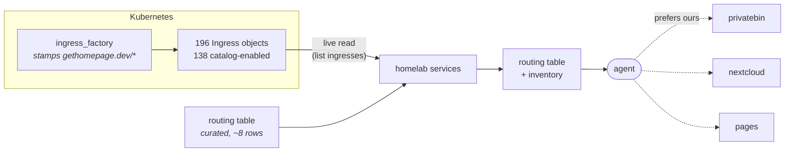
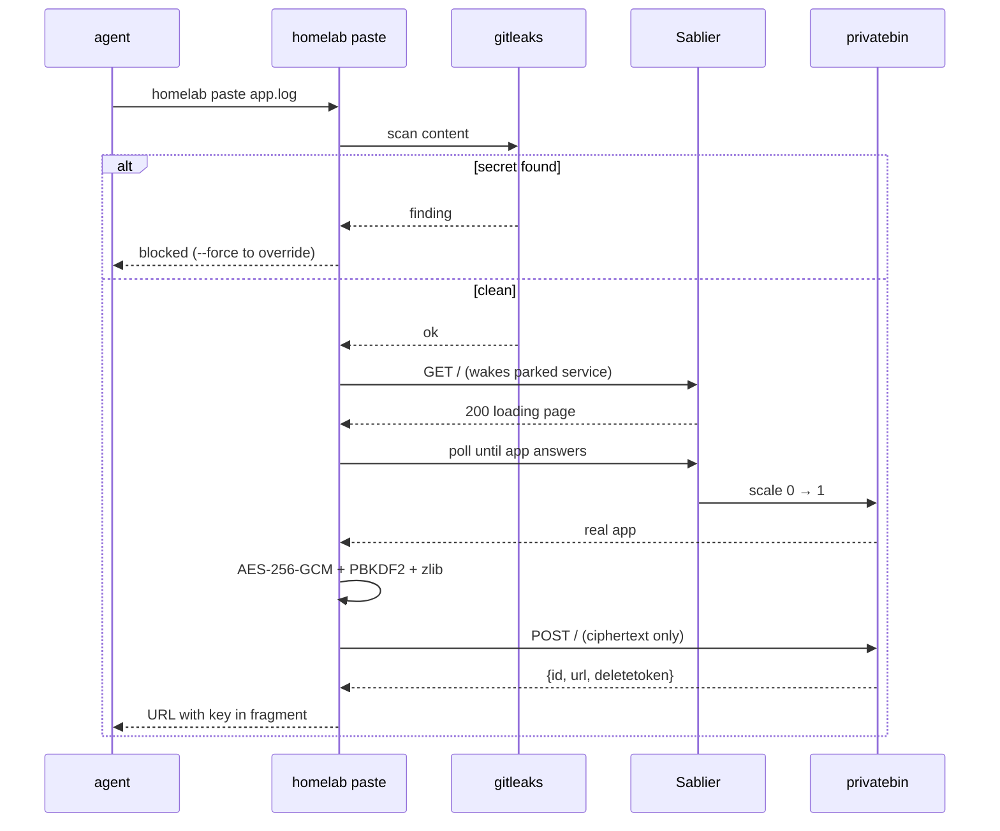

# Self-hosted service defaults — making agents reach for what we already run

**Status:** approved, not yet built
**Date:** 2026-08-15
**Owner:** Viktor
**Scope:** `infra/cli` (two new verbs + a catalog verb), ~22 stack annotations, one
line in the global agent rules

## The problem

We run 138 web-facing services. Agents working in this homelab rarely reach for
them. Asked to share a long log, an agent shows it inline or reaches for a public
paste service; asked to hand over a file, it has no path at all. PrivateBin is
deployed and reachable.

The goal is narrow: **make agents default to our own services for the handful of
operations they perform often.** Human browsing habits are out of scope.

```stats
138 | web-facing services
2,464 | calls/30d to memory (has a verb)
72 | HTTP requests/30d to privatebin (no verb)
2 | new verbs proposed
```

## What the data says

The first instinct is that this is an awareness problem — agents don't know what
exists, so publish an index. The usage data points somewhere else.

Across the capabilities measured below, the ones with a `homelab` verb are used
and the web-UI-only ones are not:

| Capability | Interface | Usage (30d) |
|---|---|---|
| memory | `homelab memory recall/store` | 2,464 calls |
| headful browser | `homelab browser run` | 383 calls |
| Loki | `homelab logs query` | 89 calls |
| pages | `homelab pages publish` | 16 calls |
| privatebin | web UI only | 72 HTTP requests |
| stirling-pdf | web UI only | 209 HTTP requests |
| cyberchef | web UI only | 0 |
| jsoncrack | web UI only | 0 |

`pages publish` is the closest thing we have to a controlled comparison. It is a
service that was previously unused, given a CLI verb and a rule naming its
trigger; sessions now reach for it by default. PrivateBin has neither and draws
roughly two requests a day. We have not attributed those requests, but that
volume is consistent with its uptime probe accounting for most of them.

> [!IMPORTANT]
> The hypothesis this design acts on: awareness is necessary but not sufficient;
> the binding constraint is a non-interactive one-command path. An agent cannot
> post to PrivateBin with `curl` — it is client-side encrypted — so even an agent
> that knows the service exists has nothing to invoke.

> [!WARNING]
> `send` and `hackmd` are at `replicas = 0` with no Sablier wake path. A verb
> pointed at either would 503 rather than wake the service.

There is a second-order effect worth naming, because it shapes what is buildable.
Services that went unused were later parked to reclaim resources (Sablier,
ADR-0022). Most park with a wake path. `send` and `hackmd` were vetted ineligible
for Sablier (both are WebSocket-core) and hand-parked at `replicas = 0` with no
wake mechanism, so they are currently unreachable. Low use led to parking, and
for these two the parking removed the option entirely.

### What we don't know yet

The rule this design ships is a plain principle without worked examples (see
"Decisions"). Whether that is enough to change agent behaviour is genuinely
open — the evidence above associates adoption with the presence of a verb, but
every verb in that table also arrived alongside a rule naming its trigger, so the
two are not separated. The verbs will exist and be sound regardless; the rule
strength is the uncertain part, and `homelab usage top` will show within about
30 days whether `paste` and `share` get called.

## Decisions

| # | Question | Decision |
|---|---|---|
| 1 | Whose behaviour changes? | Agents. Human discoverability is out of scope. |
| 2 | What gets built? | Catalog + rules + verbs — not a catalog alone. |
| 3 | Which verbs? | `paste` (privatebin) and `share` (Nextcloud). Not `notify`, not `shorten`. |
| 4 | Catalog shape? | Short routing table + full inventory, both behind one verb. |
| 5 | Rule strength? | Soft preference. |
| 6 | Rule detail? | Pure principle, no worked examples in the rules file. |
| 7 | Where does the routing table live? | In `homelab services` output, not the always-loaded rules. |
| 8 | Leak guard? | gitleaks scan before upload + a default TTL. |
| 9 | Backing infra (Postgres, Redis, …)? | Out of scope — web-facing services only. |
| 10 | Who can run `share`? | Everyone, via per-user credentials at `secret/<user>/nextcloud`. |
| 11 | The 28 blank catalog rows? | Fill all of them, plus a lint so it cannot regress. |

## Design

### `homelab services` — the catalog

The catalog is generated live rather than hand-maintained. `ingress_factory`
already stamps `gethomepage.dev/*` annotations on every ingress it creates, which
is what drives `home.viktorbarzin.me`. The same annotations are the catalog
source, so a new stack appears the moment it is applied and a removed stack
disappears — there is no list to update and nothing to drift.

Output is two sections:

1. **A routing table** — the ~8 operations that map to a verb (`share a paste →
   homelab paste`, `hand over a file → homelab share`, `publish a design doc →
   homelab pages publish`, …). This is the part that answers "what should I reach
   for?" and it is hand-curated, because a trigger phrase is a judgement, not an
   annotation.
2. **The inventory** — all 138 rows as `name | host | description`, filterable
   with `--search`.

Both live behind the verb rather than in the always-loaded rules, keeping the
per-session context cost at zero.



Both users who run agent sessions (`wizard`, admin; `emo`, power-user) hold
cluster-wide ingress read, so the live read works for both. The two
namespace-owner accounts are family members who do not run agent sessions; they
would see only their own namespaces' ingresses.

### `homelab paste` — PrivateBin

`homelab paste <file|->` prints a PrivateBin URL.

PrivateBin is client-side encrypted, so the verb does the cryptography rather
than posting plaintext. Against the deployed 2.0.6, the v2 format is:

```json
{"v":2,
 "adata":[[iv, salt, iterations, keysize, tagsize, "aes", "gcm", "zlib"],
          "plaintext", 0, 0],
 "ct": "<base64 ciphertext>",
 "meta": {"expire": "1week"}}
```

POSTed to `/`, returning `{status, id, url, deletetoken}`. The work is AES-256-GCM
with a PBKDF2-SHA256-derived key, zlib compression, and a base58-encoded master
key placed in the URL fragment so the server never sees it — an estimated ~250
lines of Go, using stdlib `crypto/aes`, `crypto/cipher` and `compress/zlib` plus
`golang.org/x/crypto/pbkdf2` and a base58 helper (neither is in the stdlib).

**PrivateBin is Sablier-parked**, so the first request wakes it and returns a
themed loading page with HTTP 200 — not the application. A verb that POSTs to
that first response would be posting to the loading page. The verb therefore polls
until the real application answers before submitting. This was confirmed live:
the first request woke the deployment from 0 to 1 replica and the second returned
the real page.

The paste is anonymous, so this verb works for every user with no credentials.

### `homelab share` — Nextcloud

`homelab share <file>` uploads over WebDAV and returns an unguessable public link
with a 30-day expiry.

Nextcloud is chosen over `send` deliberately. `send` is hand-parked with no wake
path, and reviving it means running a WebSocket service around the clock for a
capability Nextcloud already provides. The upload-and-share logic also already
exists in the `visualize` skill's `viz-publish.sh` (WebDAV upload, public share,
TTL, pruning); this generalises it into the CLI rather than writing it again.

Credentials come from `secret/<user>/nextcloud` as `{username, app_password}`,
matching the schema `secret/nextcloud/caldav` already uses. **No Vault policy
change is required**: the `personal-emo` policy already grants full CRUD on
`secret/data/emo/*`, and `homelab vault kv` deliberately uses the caller's own
token rather than the scoped Vaultwarden one.

**Provisioned and verified for `emo` on 2026-08-15**, ahead of the verb, so there
is no setup step left for him: WebDAV `PUT` returned 201, `PROPFIND` 207, an OCS
share with a 30-day expiry produced a public URL, and an unauthenticated fetch of
that URL returned the file. Test artifacts were removed afterwards. Nextcloud
accounts are `admin` (Viktor), `emo`, and `anca`.

### The leak guard

> [!CAUTION]
> Paste and share links are unguessable but reachable from the internet. The
> gitleaks gate and the TTLs below are what bound that exposure.

Both verbs mint internet-reachable URLs, and the content agents are most likely
to paste — logs, configs, `kubectl` output — is exactly where a credential tends
to turn up. The `visualize` skill already states this boundary: links are unguessable
but internet-reachable.

Both verbs run **gitleaks** over the content before upload. A hit prints the
finding and blocks, with an explicit `--force` override — the same interaction the
repo's pre-commit hook already uses, so the behaviour is familiar. gitleaks 8.30.1
is already installed. Where the binary is absent the scan degrades to a warning
rather than blocking, matching the pre-commit hook.

Default TTLs bound the exposure window: one week for pastes, 30 days for shares
(matching `visualize`).



### The rules change

One line in `~/code/docs/agents/homelab-rules.md`, stating the preference and
pointing at `homelab services`. No worked examples, no thresholds, no mandate —
agent judgement decides when it applies.

> [!NOTE]
> Found while writing this: NATS is referenced in the rules but is not deployed.

The same edit removes **NATS** from the existing "wire into capabilities already
running in the cluster (shared Postgres/Redis/NATS/Vault/…)" line. There is no
NATS namespace, service, or stack, so the line no longer matches what runs and
points agents at a capability that isn't there.

### Catalog data quality

28 of the 138 catalog rows carry no description, including several an agent might
plausibly route to — TripIt, tasks, nextcloud-todos, pages-publish, repowise, and
priority-pass, all of which already have skills. The rest are mostly `.lan`
exporters.

Each fix is one `extra_annotations` line in that stack's `ingress_factory` call,
across roughly 22 stacks. The change is annotation-only with no traffic impact,
and it improves `home.viktorbarzin.me` at the same time since both read the same
annotation. A lint then flags any new ingress that ships without a description, so
the gap does not reopen.

## Scope

**In:** `homelab services`, `homelab paste`, `homelab share`, the gitleaks guard
and TTLs, the one-line rules change plus the NATS correction, 28 descriptions, and
the description lint.

**Out:** `notify` and `shorten` verbs; backing infrastructure (Postgres, Redis,
Vault) in the catalog; reviving `send` or `hackmd`; worked examples or thresholds
in the rules; any prompt-submit hook.

## Verification

No instrumentation work is needed. `emitUsage` is called once centrally in the CLI
dispatcher, so both new verbs are counted automatically and appear in
`homelab usage top` alongside the existing ones. Reviewing that in about 30 days
shows whether the pure-principle rule is carrying the behaviour, and tightening
the rule to named triggers later is a one-line edit.

## Build order

1. `homelab services` — live ingress read, routing table, `--search`. Smallest and
   independently useful.
2. The 28 descriptions + the lint, so the catalog is complete before agents read it.
3. `homelab share` — generalise `viz-publish.sh` into the CLI; the credential path
   is already provisioned and proven for both users.
4. `homelab paste` — the crypto and the Sablier wake-poll; the largest piece.
5. The rules line, including the NATS correction.

Each step is independently landable. Steps 3 and 4 both need the gitleaks guard,
which is shared between them.

## Related

- ADR-0022 / `2026-07-12-scale-to-zero-sablier-design.md` — why privatebin is
  parked, why `send` and `hackmd` are not
- `docs/architecture/homepage.md` — the annotation scheme the catalog reads
- `2026-08-15` Nextcloud maintenance-mode incident — found while verifying the
  Nextcloud share path; fixed in the same session
