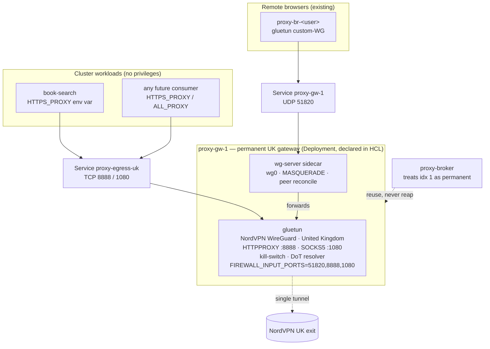
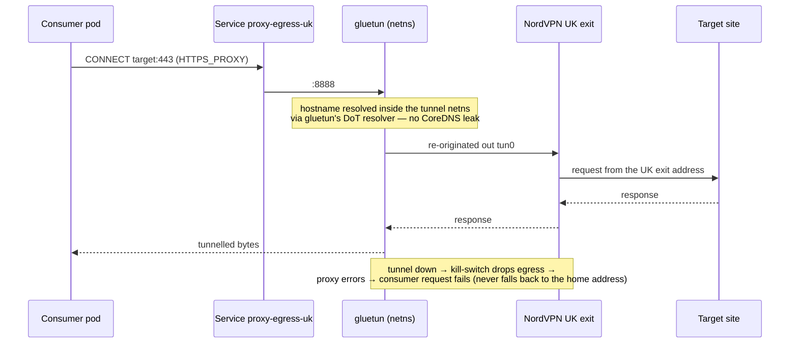

# Cluster VPN egress — NordVPN as a service any workload can use

**Status:** BUILT + APPLIED (2026-08-16), gateway held at 0 replicas pending a node fix · **Owner:** Viktor
**Stack:** `stacks/proxy` (extended) · **Namespace:** `proxy`
**Predecessors:** [`2026-07-24-geo-browser-nordvpn-design.md`](2026-07-24-geo-browser-nordvpn-design.md) · [`2026-07-25-proxy-scale-design.md`](2026-07-25-proxy-scale-design.md)

---

## Goal

Let any workload in the cluster reach the internet through the existing NordVPN
subscription — appearing as a different address, in a chosen country — by
setting an environment variable. No new privileges for the consumer, no new
monetary cost, and no second copy of the tunnel machinery.

The tunnel primitive already exists and is proven. What is missing is a
**consumption interface** for ordinary workloads: today the only things that
egress via NordVPN are the per-user remote browsers in `stacks/proxy`.

```stats
1 | always-on country (UK)
0 | extra NordVPN tunnels
0 | new privileges for consumers
£0 | new spend
```

## What already exists

`stacks/proxy` (infra#81) built and verified the hard part:

- A per-**country** gateway Pod — `gluetun` (NordVPN WireGuard) plus a
  `wg-server` sidecar in the same netns — that MASQUERADEs a `/24` of WireGuard
  clients out `tun0`. The forwarding recipe, including the non-obvious
  return-path rule (`ip rule add to <subnet> lookup main pref 90`), is recorded
  in memory #10214.
- A ClusterIP Service per gateway on `:51820/UDP`, because gluetun's
  custom-WireGuard mode needs an endpoint **IP**, not a name (memory #10222).
- Peer management without `kubectl exec`: the broker writes a peers ConfigMap,
  the sidecar reconciles `wg0` from it every 10 s.
- Gateways pinned to node2–5 via `proxy.viktorbarzin.me/gateway=true` — the
  nodes where `net.ipv4.ip_forward` is a kubelet-allowed unsafe sysctl.
- A tunnel budget: NordVPN allows roughly **10 concurrent tunnels**, and an
  over-limit connection is refused with an approximately 10-minute cooldown
  (memory #10182). `pool.py` encodes `MAX_COUNTRIES = 8`, `RESERVED_SLOTS = 2`.

"Phase 3 — Headscale exit nodes on the gateways" was deferred in the scale
design, unblocked by the same primitive. This work takes a different branch:
rather than routing tailnet users, it exposes the tunnel to in-cluster
workloads.

## The simplification this design rests on

The existing gateway is complex because it **forwards packets**: unsafe sysctl,
node pinning, MASQUERADE, FORWARD rules, return-path routing.

gluetun also ships **userspace proxy listeners** — an HTTP proxy and a SOCKS5
proxy — that run inside the tunnel netns. A client connects to the listener,
gluetun terminates that connection and **re-originates** the request out `tun0`.
That is local origination, not forwarding, so the proxy path needs none of the
forwarding machinery. Verified against the gluetun wiki on 2026-08-16:

| Variable | Default | Purpose |
|---|---|---|
| `HTTPPROXY` | `off` | Enable the internal HTTP proxy |
| `HTTPPROXY_LISTENING_ADDRESS` | `:8888` | Listening address |
| `HTTPPROXY_USER` / `HTTPPROXY_PASSWORD` | unset | Optional proxy auth |
| `SOCKS5_ENABLED` | `off` | Enable the internal SOCKS5 proxy |
| `SOCKS5_LISTENING_ADDRESS` | `:1080` | Listening address |
| `SOCKS5_USER` / `SOCKS5_PASSWORD` | unset | Optional proxy auth |

A consumer therefore needs no capabilities, no sidecar and no netns sharing —
only an environment variable.

## Decisions

Resolved in the grilling session on 2026-08-16. Each row is Viktor's choice.

| # | Decision | Choice | Why |
|---|---|---|---|
| 1 | Driving use cases | Scrapers blocked by IP · geo-unlock · general capability | Torrenting is deliberately not a target, so no full-tunnel client has to be supported on day one |
| 2 | Consumption interface | gluetun's built-in **HTTP `:8888`** and **SOCKS5 `:1080`** on a ClusterIP | Covers proxy-aware clients, which is every anchor consumer, at near-zero new code |
| 3 | Escape hatch | WireGuard sidecar **documented, not built** | Nothing needs it today; the browser pod is a working reference if something does |
| 4 | Lifecycle | **Always-on, declared in Terraform** | A background scraper has no user present to trigger an on-demand spawn, and a Deployment self-heals |
| 5 | Countries at launch | **United Kingdom**, one gateway | Matches the consumers: job-hunter is London-scoped, realestate-crawler is UK property |
| 6 | Home | **Extend `stacks/proxy`** | One namespace, one NordVPN token, one place where the tunnel budget is enforced in code |
| 7 | Same-country collision | **One UK gateway serves both** egress consumers and UK browsers | Avoids two tunnels to one country on an account-wide key; costs no extra slot |
| 8 | Tunnel budget | **Unchanged** | The permanent gateway occupies one of the existing six country slots, so the arithmetic already holds |
| 9 | Access control | **Open to the whole cluster** | Lowest friction to wire a consumer; trade-off recorded under Risks |
| 10 | Tunnel-down behaviour | **Fail closed**, plus a tunnel-down alert | gluetun's kill-switch already fails closed; the alert is what makes it visible |
| 11 | Pilot consumer | **book-search → Anna's Archive**, behind a flippable env var | The only consumer with proven live blocking, so it settles the question fastest |
| 12 | Fixed alongside | Orphaned-gateway bug · NordLynx key rotation | Both are live risks to an always-on gateway |
| 13 | Explicitly out of scope | gluetun image pinning · country-verification probe · reusable sidecar module | Recorded under Accepted risks rather than silently dropped |

### Superseded during the session

Decision 8 initially read "shrink `MAX_COUNTRIES` 8 → 6". Decision 7 removed the
need: because the permanent gateway is itself a pool gateway, it counts against
`MAX_COUNTRIES` on its own. Six concurrent countries (one permanently UK) plus
two reserved slots is eight, under the cap. `pool.py`'s constants stay as they
are.

## Architecture



Both products share one tunnel. Services terminate at gluetun's userspace
listener; browsers arrive over WireGuard and are forwarded. Neither path adds a
NordVPN connection beyond the one the gateway already holds.

### A consumer request, end to end



## Components to build

### 1. Permanent UK gateway (Terraform, `stacks/proxy`)

A Deployment plus two Services, replacing what the broker would otherwise spawn
for the UK:

- **Deployment `proxy-gw-1`**, one replica, `Recreate` strategy. Pod labels
  match what the broker already lists on (`app=proxy-gateway`,
  `proxy/gw-idx=1`, `proxy/country=united-kingdom`) plus a new
  `proxy/permanent=true`.
- Same pod shape as `build_gw_pod`: `nodeSelector` on the gateway label,
  `securityContext.sysctls` `net.ipv4.ip_forward=1`, `dnsPolicy: None` with
  `dnsConfig.nameservers: ["127.0.0.1"]`, and the `KYVERNO_LIFECYCLE_V1`
  `ignore_changes` on `dns_config`.
- gluetun env adds `HTTPPROXY=on` and `SOCKS5_ENABLED=on`, and
  `FIREWALL_INPUT_PORTS` becomes `51820,8888,1080`. The kill-switch drops
  inbound traffic to any port not listed; `:6080` hit exactly this during the
  geo-browser build, and loopback tests do not catch it — only a cross-pod
  request does.
- **Service `proxy-gw-1`** — `UDP 51820`, the WireGuard endpoint browsers dial.
  Moves from broker-created to HCL-declared.
- **Service `proxy-egress-uk`** — `TCP 8888` and `TCP 1080`, the consumer-facing
  endpoint.
- **ConfigMap `proxy-gw-1-peers`** stays broker-owned. Terraform creates it if
  absent and does not manage its contents.

### 2. Broker changes (`pool.py` + `broker.py`)

Small, and the pure decisions stay unit-testable in `pool_test.py`, matching the
existing split:

- `alloc_subnet_idx` never returns the reserved permanent index.
- `plan_gateway` returns `reuse` for the permanent gateway's country.
- `plan_reaping` never reaps a gateway marked permanent.
- Gateway identity resolves from the **`proxy/gw-idx` label rather than the pod
  name** — a Deployment's pods carry generated suffixes, so name-keyed lookup
  would miss the permanent gateway.
- Gateway deletion skips permanent entries.

### 3. Orphaned-gateway fix

> [!IMPORTANT]
> This is live right now, not hypothetical. Confirm it is cleared as part of the
> build.

Live example found while designing this: `proxy-gw-1`'s Service and peers
ConfigMap existed while the Pod did not, so a browser's gluetun spent roughly
four days reconnecting to an endpoint-less ClusterIP
(`dial tcp4: lookup github.com: i/o timeout`, restart, repeat) with no signal.

For the UK gateway this is fixed by construction — a Deployment restarts its
pod. For the on-demand gateways the reaper path still needs to guarantee that a
gateway's Service, peers ConfigMap and Pod are created and removed together, and
that a browser whose gateway has gone is either re-homed or surfaced rather than
left looping.

### 4. NordLynx key rotation

The NordLynx key is account-wide, and memory #8307 records it rotating on
multi-device login. The broker re-fetches it per spawn, but an always-on pod
holds its key in an environment variable, which never hot-reloads.

Adding `secret.reloader.stakater.com/reload: nordvpn-wg` to the Deployment makes
a rotated secret restart the gateway — the same mechanism already used elsewhere
in this cluster for rotated database credentials.

### 5. Tunnel-down alert

A readiness probe against gluetun's control server, plus one Prometheus alert
when the gateway is unready or its Service has no endpoints. Scoped deliberately
narrow: it catches the failure class observed above without a public-IP probe or
a country cross-check.

## Consumer contract

```yaml
env:
  - name: HTTPS_PROXY
    value: http://proxy-egress-uk.proxy.svc.cluster.local:8888
  - name: HTTP_PROXY
    value: http://proxy-egress-uk.proxy.svc.cluster.local:8888
  # Keep cluster-internal traffic off the tunnel.
  - name: NO_PROXY
    value: .svc,.svc.cluster.local,.cluster.local,localhost,127.0.0.1,10.0.0.0/8,192.168.0.0/16,172.16.0.0/12
```

Notes for consumers:

- Use `socks5h://` rather than `socks5://` when using the SOCKS5 endpoint, so
  hostnames resolve at the proxy. `socks5://` resolves locally through CoreDNS,
  which both leaks the lookup and can return home-geo answers.
- Set `NO_PROXY`. Without it, in-cluster calls take a round trip through the UK
  and arrive at cluster Services from an unexpected source address.
- Uppercase and lowercase forms of these variables both circulate in the wild;
  set whichever the consumer's HTTP library reads.

## Pilot and measurement

`book-search` reaches Anna's Archive and is currently getting
**HTTP 403** on `annas-archive.gl/search`, alongside **429** from the Google
Books API — the only consumer with blocking visible in Loki over the last seven
days.

> [!WARNING]
> It is also the case least likely to improve. Anna's Archive is behind
> Cloudflare, and NordVPN exits sit in hosting ASNs (the geo-browser spike's own
> Japan exit was `AS147049 PacketHub`) that anti-bot vendors score more harshly
> than a residential ISP address. The home WAN address is residential, so the
> tunnel may make this target harder rather than easier. Treat a worsened result
> as a valid finding, not a build failure.

The design accounts for that uncertainty: the switch is one environment
variable, reversible in a single apply, and the outcome is measured before
anything else is converted.

- **Metric:** rate of 403 responses from `annas-archive.gl` in Loki, over
  matched windows before and after.
- **Success:** 403 rate falls materially and searches return results.
- **Failure:** 403 rate holds or rises → revert the variable, record the finding,
  and treat "datacenter exits do not help Cloudflare-fronted targets" as
  established for future consumers.

MyAnonaMouse stays off the tunnel. Its `dynamicSeedbox.php` endpoint exists
to bind a session to a specific address; routing a private tracker through a
shared VPN exit risks the account.

## Escape hatch: full-tunnel via WireGuard sidecar

For a client that ignores proxy environment variables, the pattern already
exists in this stack and will be written into `stacks/proxy/README.md` rather
than turned into a module: give the consumer pod a gluetun sidecar in
custom-WireGuard mode pointing at `proxy-gw-1`'s ClusterIP, register its public
key in the peers ConfigMap, and share the netns. `build_br_pod` in `broker.py`
is the working reference.

A module is deliberately not built yet — there is no caller to validate its
interface against.

## Risks and accepted trade-offs

- **Open to the whole cluster.** Any pod that knows the Service name can egress
  as this NordVPN identity, and nothing records who does. Chosen for low
  friction; a NetworkPolicy allowlist remains the natural first hardening step
  if the cluster's tenancy assumptions change.
- **gluetun runs `:latest`.** `broker.py` defaults to
  `ghcr.io/qdm12/gluetun:latest` with no override in `main.tf`, the predecessor
  design's own checklist item for pinning is unticked, and memory #10182 records
  `:latest` once shipping a build that could not connect. An always-on gateway
  makes this a standing risk; pinning was considered and left out of this build.
- **No country verification.** A tunnel that is up but exiting from an
  unexpected country will not alert. Acceptable while the gateway serves one
  country and the consumer is a pilot.
- **Anti-bot efficacy is unproven.** See Pilot above. This design does not claim
  the tunnel will unblock scrapers; it makes the claim testable.
- **Coupled products.** One gateway now serves both remote browsers and cluster
  services. A gateway restart briefly interrupts both. The alternative — two UK
  tunnels on one account-wide key — was judged worse.
- **Cost: none.** Existing NordVPN subscription, existing cluster, existing
  images.

## Open questions

- The one-gateway-per-country invariant is documented in `pool.py` as "same
  NordLynx key on two tunnels to the same country flaps," citing memory #10214.
  That memory covers the forwarding recipe rather than the flap itself, so the
  precise mechanism is inferred rather than demonstrated. It is treated as
  binding here because the cost of being wrong is a silently dead tunnel.
- Whether gluetun's SOCKS5 listener is present in the `:latest` image currently
  running. The HTTP proxy is long-standing; SOCKS5 is a newer option. To be
  confirmed at build time, before anything depends on `:1080`.
- Whether NordLynx key rotation actually fires in practice on this account. The
  Reloader annotation is defensive; no rotation has been observed.

## Build outcome (2026-08-16)

Everything in this design is built, reviewed and applied: `2 imported, 2 added,
3 changed, 0 destroyed`. The two orphaned objects were adopted into Terraform
state, the broker now treats index 1 as permanent, and the egress Service
exists. 38 unit tests cover the permanent-gateway rules.

The gateway itself is held at **0 replicas** by one blocker found at apply time.

> [!IMPORTANT]
> **`net.ipv4.ip_forward` is missing from `allowedUnsafeSysctls` on every
> gateway node.** Each pod the Deployment creates is rejected at admission with
> `SysctlForbidden`, and the ReplicaSet retries in a tight loop — 27 rejected
> pods in about 40 seconds on the first apply.

This is pre-existing rather than caused by this change, and it is the missing
piece of the orphan story above. The allowlist is written only by
`modules/create-template-vm/k8s-node-post-join-tune.sh` as a cloud-init runcmd
at node-join time; nothing reconciles it afterwards. Verified absent on
node2-5 via `/api/v1/nodes/<node>/proxy/configz`, while the
`proxy.viktorbarzin.me/gateway=true` label is present on all four.

So the gateway pod that vanished around 2026-08-11 could never be recreated —
which is why a browser reconnected to an endpoint-less ClusterIP for four days.
It also means the remote-browser feature cannot currently start a gateway for
any country, not just the UK.

Restoring the allowlist is a node-level kubelet change (edit
`/var/lib/kubelet/config.yaml`, restart kubelet, once per node) with a wider
blast radius than this design covers, so it is being decided separately. Flip
`replicas` back to 1 in the same change that restores it.

**Open follow-up worth considering on its own merits:** a setting applied only
at node join, with no reconciliation and no alert, will drift again. A
periodic check that the allowlist is present on labelled gateway nodes would
turn a silent four-day outage into a signal.

## Verification plan

Each step is a gate: a failure stops the rollout until it is resolved.

1. Gateway pod reaches `2/2 Ready`; gluetun logs a completed WireGuard setup.
2. `GET /v1/publicip` on gluetun's control server returns a UK address, and
   `web-api.nordvpn.com/v1/ips/info` agrees it is a NordVPN address. Generic
   geo-IP services are not used here (memory #10182).
3. From an unrelated pod in another namespace:
   `curl -x http://proxy-egress-uk.proxy.svc.cluster.local:8888 https://ipinfo.io/json`
   returns the UK exit, not `176.12.22.76`.
4. The same through `socks5h://…:1080`.
5. Kill-switch: with the tunnel forced down, the same request **fails** rather
   than succeeding from the home address.
6. A UK remote browser still works — the broker reuses the permanent gateway
   instead of creating a second one, and no second tunnel appears.
7. Deleting the gateway pod brings it back automatically, and browsers recover.
8. `book-search` with the variable set: Anna's Archive 403 rate compared against
   the pre-change baseline.
