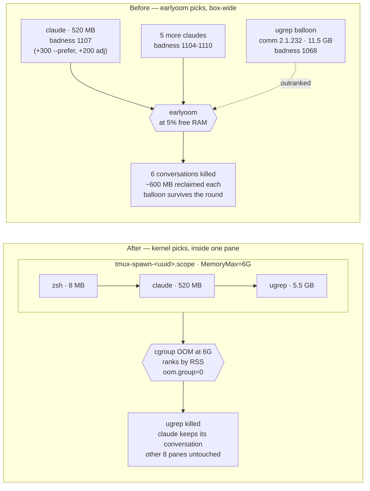

# devvm per-pane memory cap — kill the spawned hog, not the conversation

**Status:** implemented 2026-08-16
**Scope:** `scripts/workstation/setup-devvm.sh` §10, `scripts/tmux-persist.sh`
**Related:** `../post-mortems/2026-06-22-devvm-mem-io-overload-containment.md` (addendum 4 records the same findings)

## The problem

On 2026-08-16 six of wizard's nine Claude Code conversations were killed within
50 seconds. They were not the reason the box ran out of memory.

`earlyoom` is the box-wide backstop added in the 2026-06-22 containment work. It
picks a victim by `oom_score`, adjusted by its own `--prefer` (+300) and
`--avoid` (-300) lists. Two things combined to invert its ranking on this box.

**`claude` was in `--prefer`.** The list was written to target "the agent/browser
hogs", and at the time a claude process looked like a reasonable member of that
set.

**Every tmux-hosted process inherits `oom_score_adj=200`.** systemd sets
`DefaultOOMScoreAdjust=200` on the user manager; wizard runs tmux as a user
service (`~/.config/systemd/user/tmux.service`), so the tmux server and every
pane below it carry 200. That puts the baseline near 800 and leaves RSS moving
the score by roughly 0.014 points per MB.

Measured live on 2026-08-16: a 320 MB claude scored 804 and a 605 MB claude
scored 808 — 285 MB of difference moved the score by four points. A `--prefer`
match is worth 300. So the bounty on a small conversation outweighed a very
large amount of memory.

What that produced, from the 30 days of kills in Loki:

| Victim comm | Kills | Notes |
|---|---:|---|
| `claude` | 89 | 472–739 MiB each |
| `python3` | 5 | |
| `chrome` | 5 | |
| `2.1.233` | 1 | 18,685 MiB |

100 kills, 58.6 GiB reclaimed, **mean 600 MiB per kill**. On 2026-08-16 the six
conversations died at badness 1104–1168 while the 18,685 MiB process sat at
1068 and was not chosen.

The same window shows a per-user skew that nobody chose: in the 450–750 MB band,
uid 1000 (wizard) took 32 kills at mean badness 1107 while uid 1002 (emo) took 9
at mean badness 974. emo's tmux is not started by his user manager, so his
processes sit at `adj=0` — a 133-point difference at identical footprint. Left
as-is for now; it is one line in wizard's own `tmux.service` whenever we want it.

## What `2.1.233` actually is

`~/.local/bin/claude` symlinks to `~/.local/share/claude/versions/2.1.233`, and
Claude Code spawns its search tools **through its own binary**. The child keeps
`exe=~/.local/share/claude/versions/<ver>` and the kernel records `comm` as the
version string, while `argv` is the real tool.

`t3-cgroup-snap` (deployed in 2026-07 for exactly this question) has the
evidence. Across all rotations, every version-comm sample is a spawned search
tool and none is a session:

| argv | Samples |
|---|---:|
| `ugrep -G --ignore-files --hidden -I --exclude-dir=.git …` | 114 |
| `bfs -S dfs -regextype findutils-default / -name … ` | 25 |
| `rg --no-config --files --hidden …` | 3 |

One of them grew **10.1 → 11.5 GiB in 33 seconds** on 2026-08-14 (ppid 346827).

Two consequences:

1. **`ugrep` has been in `--prefer` since 2026-06-22 and has never matched.** The
   list named the right target; the kernel calls that process `2.1.232`.
2. This identifies the `Comm='2.1.205'` balloon left open in **addendum 3** of
   the 2026-06-22 post-mortem ("no installed tool reports version 2.1.205"). It
   was a claude-spawned search tool, and it is the same runaway class as the
   original "10G `ugrep`" that motivated the containment work in the first place.

Name-based matching is structurally weak here: the claude binary reports a
version string, and `t3 serve` reports `MainThread`. Any regex scheme mis-ranks
the processes that matter most.

## The gap in the current layering

The §10 header states that per-cgroup `MemoryMax` is the primary guard and
earlyoom is the aggregate net. In practice only the net fires.

| Layer | Intended role | State before this change |
|---|---|---|
| per-pane `tmux-spawn-*.scope` | — | `memory.max = max` (uncapped) |
| per-user `user-<uid>.slice` | primary guard | `MemoryMax=24G` **each**, on a 31.3 GiB box |
| earlyoom | aggregate net | the only guard that ever fires |

Two users at 24 G is 48 G of budget over 31.3 GiB of RAM, so the box-wide
threshold is reached long before either slice binds.

## The change

Cap each pane, and let the kernel choose the victim inside it.

tmux 3.4 links libsystemd and places every pane in its own transient
`tmux-spawn-<uuid>.scope`. That cgroup holds the shell, its claude, and
everything claude spawns. At the cap the kernel OOM-kills the single
highest-RSS task in that scope — `memory.oom.group=0`, so one task, not the
pane. Selection is raw RSS, which no comm string can distort.



**1. Per-pane cap** — `/etc/systemd/user/scope.d/50-devvm-pane-cap.conf`,
`[Scope] MemoryMax=6G`, all users.

A top-level `<type>.d/` drop-in applies to every unit of that type
(`systemd.unit(5)`). Verified on this box that it reaches *transient* units:
the value lands on a fresh pane, reaches already-running panes at the next
`systemctl --user daemon-reload`, and reverts when the file is removed.

6 G is about 5× the busiest pane measured on 2026-08-16 (working panes were
0.6–1.3 GB), leaving ~4.7 GB above a typical claude for builds, test suites and
browsers. `MemoryMax` only, never `MemoryHigh` — with `MemorySwapMax=0`
inherited from the user slice, a soft band livelocks instead of killing (the
2026-07-02 addendum).

**2. earlyoom ranking** — drop `claude` from `--prefer`, add
`[0-9]+\.[0-9]+\.[0-9]+`. Replaying 2026-08-16 with this list, the 18.6 GiB
process is picked first and the six conversations are not touched: one kill
instead of six.

`claude` is deliberately **not** moved to `--avoid`. A leaked session has to stay
killable, or the box has no way out.

**3. `resume_in_place` fix** — `tmux-persist.sh` typed the resume command with
`send-keys -t "=<name>"`. `send-keys` takes a pane target and tmux rejects a bare
`=name` there ("can't find pane"), so the branch logged a WARN and left a bare
shell on every run since it was written. `=<name>:` is accepted and still matches
exactly. This is the path that recovers a conversation after its claude dies, so
it matters more once kills are rare than it did when they were routine.
Regression test: `tests/tmux-persist/test_resume_in_place.sh`.

## What this does not do

- **It does not bound the aggregate.** Nine panes capped at 6 G is still 54 G of
  headroom on a 31.3 GiB box. The cap bounds one pane; earlyoom remains the net.
- **It does not protect a leaked claude.** If a session's own claude is the
  largest task in its pane, the kernel kills it. That is deliberate — it dies
  alone, rather than taking unrelated conversations with it.
- **It does not cover consumers without a pane scope** — t3-serve-hosted claudes
  live in `system-t3-serve.slice`, plus docker and stray scripts. Those still
  depend on earlyoom, which is why its ranking was worth correcting.
- **It does not address the `adj=200` skew** between wizard and emo.

## Diagnosing a kill

A cgroup OOM is logged by the kernel and shipped to Loki by the devvm promtail,
so an unexplained `Killed` in a build has a next step:

```bash
homelab logs query '{job="devvm-journal"} |= "Memory cgroup out of memory"' --since 24h
```

earlyoom's own kills, for the aggregate case:

```bash
homelab logs query '{job="devvm-journal"} |= "sending SIG"' --since 7d
```

Current caps and usage:

```bash
systemctl --user show <scope> -p MemoryMax -p MemoryCurrent
cat /sys/fs/cgroup/user.slice/user-$(id -u).slice/user@$(id -u).service/app.slice/tmux-spawn-*/memory.current
```

## Open questions

- The 6 G figure comes from one day's measurements of working panes. If
  legitimate work starts hitting it, re-derive from a longer sample rather than
  raising it reflexively.
- Whether `t3-serve@` instances should get the same per-thread treatment is
  untouched here; today they rely on the per-instance `MemoryMax` in
  `t3-serve@.service` plus earlyoom.
- Whether the version-comm pattern stays a clean separator depends on Claude
  Code continuing to spawn tools through its own binary while sessions launch via
  the `claude` symlink. Worth re-checking on a major version change.
