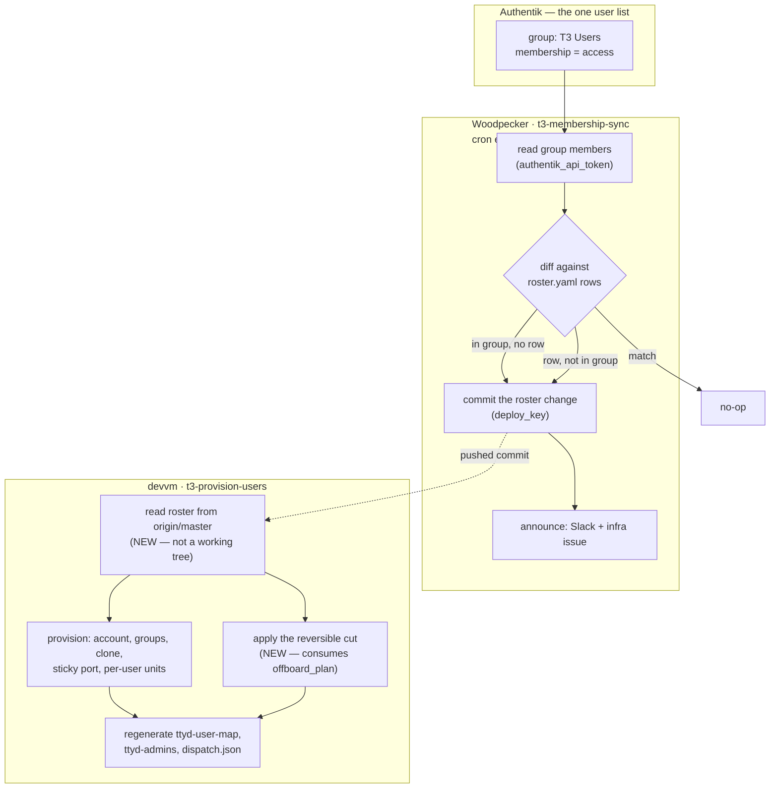

# Membership-driven provisioning — Authentik as the one user list

**Status:** built and verified in production 2026-08-17. **Author:** Viktor
Barzin (decisions), Claude (research + build).

## What we want

Adding someone to the Authentik **T3 Users** group should provision them on the
devvm; removing them should deprovision them. Today both directions are hand
work in two repos, and the two lists can drift. On 2026-08-17 that showed up
twice: a stale copy of the identity map in `terminal-lobby` would have dropped
`ancamilea` on the next deploy, and removing her took two commits, a manual
reconcile, and two propagation traps that the runbook did not mention.

Viktor's framing, and the decision this design rests on: **there should be a
single source of truth for users, and Authentik should be that place.**

```stats
3 | user lists today
5 | reversible actions already modelled
0 | things consuming offboard_plan
15 min | worst-case lag after this
```

## Prior art

This was designed once before, on 2026-06-09
(`2026-06-09-workstation-authentik-membership-{design,plan}.md`, "Workstation
Membership v2"), with the same goal and never implemented. It was found during the
2026-08-17 wrap-up rather than during this design's research, which is a miss worth
recording: it reached the same conclusion about Authentik owning membership, and it
proposed a route this design rejected for a reason that plan had already solved.

Where the two differ:

| | 2026-06-09 | shipped 2026-08-17 |
|---|---|---|
| `roster.yaml` | retired | kept, demoted to a policy table |
| Who reads the group | the devvm provisioner, with a read-only Authentik token minted in Terraform (its Task 3) | Woodpecker CI, which already holds a Vault credential |
| `os_user` from an email | `derive_os_user()` | `os_name_for()` — same idea |
| Floor default for a new member | yes | yes |

The roster was kept because a group cannot carry `tier`, `namespaces`, `k8s_user`,
`code_layout` or `repos`, and `tier` is a privilege grant that `validate_tiers`
checks against Vault `k8s_users`. The reader moved to CI because the devvm has no
unattended credential today — but that is exactly what the older plan's Task 3
would have provided, so **if the box should ever read Authentik directly, that token
and policy are the way to do it.**

## Who owns what

Authentik is the source of truth for **who exists and who has access**. It is
not the source of truth for **privilege**.

- Group membership is one bit, and access is one bit — and that is already how
  every other door in the estate works.
- `tier` is a privilege grant — it decides cluster-admin versus read-only versus
  namespace-owner. `roster_engine.validate_tiers` compares it against Vault
  `k8s_users` and **aborts the reconcile** on a conflict. That check, the code
  review, the diff and the 58 pytest cases are worth keeping.

So `roster.yaml` stops being a list of users and becomes a **policy table keyed
by user**. A row for someone not in the group is inert. The "who" then lives in
exactly one place, which is what makes this one source of truth rather than the
two lists we have now.

> [!IMPORTANT]
> This inverts today's mental model: **deleting a roster row no longer removes
> access.** It resets that person's policy to the floor, and the reconciler writes
> the row back. Removing access means removing them from the group.

## Where things stand today

| Piece | State |
|---|---|
| `roster.yaml` | source of truth for who + policy; 3 users (2 after today) |
| Authentik `T3 Users` | second user list, hand-maintained in HCL (`stacks/authentik/t3-users.tf`) |
| Vault `k8s_users` | third list, cluster RBAC; roster tier is validated against it |
| `roster_engine.offboard_plan` | computes the five reversible actions; nothing consumes it today |
| `t3-provision-users.sh` | applies the *provisioning* half; the offboard half is manual per the runbook |
| `.woodpecker/provision-user.yml` | manual pipeline; drives Vault + the Authentik API for the **cluster** side, never the roster |
| CI → devvm | no path exists; no pipeline reaches 10.0.10.10 |
| CI → Forgejo | commits back today (`renew-tls.yml`, via `secrets/deploy_key`) |

The engine already names what a cut is (`roster_engine.py:45`):

```
disable_instance · unmap_dispatch · remove_from_t3_group · lock_login · revoke_cluster_rbac
```

This work is mostly wiring up a plan that is already computed and tested.

## The design

Two halves with the roster as the hand-off: CI owns everything that talks to
Authentik and to git, the devvm owns everything that touches accounts. That split
is forced — CI holds the Authentik and git credentials and cannot reach the box;
the box can reach neither Vault (unattended) nor Authentik today.



### The three cases

| Authentik | roster row | what happens |
|---|---|---|
| member | present | nothing — steady state |
| member | absent | CI writes a row at the **floor tier** (`tier: namespace-owner`, `namespaces: [<user>]`, `code_layout: workspace`, no repos), commits, announces. The devvm provisions them on its next run. |
| not a member | present | CI **comments the row out** with a dated note, commits, announces. The devvm applies the reversible cut on its next run. |

Commenting rather than deleting is deliberate: the engine treats commented and
absent identically, so the row stays as a record and re-instating someone is one
edit.

### The floor tier, and the risk we are accepting

The floor is the same default `provision-user.yml` already writes into
`k8s_users`: `namespace-owner`, namespace named after the user. Anything above
the floor — `power-user`, `admin`, extra namespaces, `repos`, `code_layout` —
requires a reviewed commit, and `validate_tiers` still cross-checks it against
Vault.

> [!CAUTION]
> **Accepted risk, chosen deliberately (Viktor, 2026-08-17).** An auto-created
> account is a Unix account with a shell on a shared host, and
> `homelab invite create --group "T3 Users"` can drop a brand-new Google
> self-signup into that group — so an invite code aimed at T3 Users becomes a
> shell account. The mitigation is an audit trail rather than a gate, matching the
> allow-then-audit model already used for emo's direct-master push: every
> auto-creation posts to Slack and files an infra issue naming the user, the group
> event and the tier it was given. If that ever feels too loose, skipping accounts
> carrying `attributes.proxy_only` (which the signup flow stamps) is a one-line
> change.

### What the devvm gains

1. **The roster is read from `origin/master`, not from a working tree.** Today
   `WORKSTATION_DIR` points at `/home/wizard/code/infra/scripts/workstation` — the
   admin's own checkout — so a pushed roster change does nothing until that tree
   carries it, and `refresh_user_clone` bails on a dirty tree (`return 0` when
   `status --porcelain` is non-empty), which the admin's tree usually is. Without
   this fix the chain stops here with no error anywhere: CI reports success and
   the box keeps the previous roster.
   Step 0c fetches as `wizard` and materialises
   `git show origin/master:scripts/workstation/roster.yaml` into
   `/var/lib/t3-provision/roster.yaml`, falling back to today's path if the fetch
   fails, so a network blip degrades to current behaviour rather than to nothing.
2. **It consumes `offboard_plan`** and applies the reversible actions it already
   computes: `disable_instance` (`t3-serve@`, `playwright-mcp@`,
   `claude-auth-sync@`, `tl-t3-sync@`), `lock_login` (`passwd -l`), and
   `unmap_dispatch` (already implicit in regenerating the three files).
   `userdel_archive` stays out — never automatic, exactly as now.

### What stays outside this automation

- **`revoke_cluster_rbac`.** T3 Users means devvm access, not cluster access:
  Anca is out of the group and still owns the `plotting-book` namespace.
  Tying cluster RBAC to a group is a separate decision with its own group.
- **`Home Server Admins`**, which gates `terminal.viktorbarzin.me`. Not managed in
  this repo, and it is a different grant from devvm access.
- **The web terminal's sudo grant.** `terminal-lobby`'s
  `devvm/sudoers.d-ttyd-users` stays hand-maintained (Viktor, 2026-08-17): the
  roster says who exists, that file says which binaries may run as them. So a
  freshly auto-provisioned user reaches the lobby and sees their sidebar, and
  every attach fails until that grant is added and terminal-lobby is deployed.
  The announcement CI posts on auto-creation says so, with the file path: until
  it is done, a new user can open the lobby but not a terminal.

## Failure modes

| Failure | Behaviour |
|---|---|
| Authentik unreachable | the sync no-ops and says so; no roster change, nothing deprovisioned on a read failure |
| A cron tick missed | the next one reconciles; the state is a diff, not an event stream |
| CI cannot push | the pipeline fails and reports it; the roster is unchanged, so the box keeps the last known-good state |
| Someone hand-deletes a row while the user is in the group | the row is written back at the floor tier — access follows the group, by design |
| The roster fetch on the box fails | falls back to the working-tree copy (today's behaviour) rather than acting on an empty roster |
| Two sources disagree mid-flight | the box only ever acts on committed state, so a half-finished CI run cannot half-provision anyone |

## Build order

1. **Roster freshness on the devvm** (`t3-provision-users.sh` step 0c) — on its
   own, and verifiable on its own: commit a roster change, confirm the hourly run
   acts on it without touching any working tree. Everything else depends on this.
2. **Consume `offboard_plan`** for the reversible cut, with `DRY_RUN` output first
   so the actions can be read before they are applied.
3. **`.woodpecker/t3-membership-sync.yml`** — Vault k8s auth, read the group, diff,
   commit, announce. Register the `t3-membership-sync` cron (Woodpecker API, as
   `drift-detection` and `renew-tls-certificate` are).
4. **Drop `users` from `stacks/authentik/t3-users.tf`** so Terraform owns only the
   group's existence, and the group's membership has exactly one author: whoever
   adds or removes people in Authentik.
5. **Docs**: the offboard runbook loses the two manual steps this automates; the
   multi-tenancy architecture doc records Authentik as the user list and the
   roster as the policy table.

## Verification

End-to-end on a throwaway identity rather than on a real person: create
`t3probe@viktorbarzin.me` in Authentik, add it to T3 Users, and watch one cron
tick produce a floor-tier roster row, a Slack post, an issue, and — after the
devvm's next run — an account, a sticky port and a dispatch entry. Then remove it
from the group and watch the row get commented, the units disabled, the login
locked, and `t3-dispatch` answer 403 (allowing the 60-second dispatch reload).
Then `userdel_archive` by hand to clean up, which also exercises the one path this
automation deliberately never takes.

## What the build measured

Verified against the live estate on 2026-08-17, in this order. The devvm's
reconcile timer was paused for the group tests, so the throwaway identity never
became an account on the shared box.

| Check | Result |
|---|---|
| 78 engine tests (58 before) | pass — diff, floor tier, textual edits, CLI |
| `membership` against the real roster + real group | empty plan; steady state reads as steady state |
| Reversible cut, `DRY_RUN`, seeded snapshot | names all five units + `passwd -l`, data untouched |
| Roster read from `origin/master` | `roster: using origin/master (working tree differs)` — the trap, closed and visible in a log line |
| Cron registered | Woodpecker id 37, `*/15 * * * *`, branch master |
| Sync with membership already in step | pushed nothing, roster unchanged |
| Probe added to `T3 Users` | pipeline #2142 → commit `20f7e22a`, floor-tier row, dated note |
| Probe removed from `T3 Users` | pipeline #2144 → commit `19d96bda`, row commented out |
| `terraform apply` with `ignore_changes` | CI #1145 success; group membership unchanged (the failure that would have locked everyone out) |
| Probe account on the box | never created — `id t3probe` → no such user |
| Final state | map + dispatch back to 2 users; nothing cut |

Two defects were found and fixed during the build, both worth recording because
each would have failed quietly:

- The first cut of the reversible-cut wiring hand-loaded the engine with
  `importlib`, which breaks `@dataclass` (a module executed outside `sys.modules`
  cannot resolve its own annotations) — and the shell had `|| true` on it, so the
  traceback became "nobody left". Now a `deprovision` subcommand with tests, and
  a failure that logs instead of passing for empty.
- The cut's `systemctl` calls send output to `/dev/null`, which was swallowing
  the `[dry-run]` echo with it. A dry run that cannot show what it would do is
  not worth having, so the actions are named in the log line instead.

One thing the design assumed and the build corrected: `/tmp` is not shared
between Woodpecker steps, so the plan the announce step reads lands in the
workspace.

## Open questions

None blocking. One deferred by choice: whether cluster RBAC should eventually
hang off its own Authentik group the same way, which would make `k8s_users` a
derived artefact too and leave the estate with one user list rather than two and
a half.
