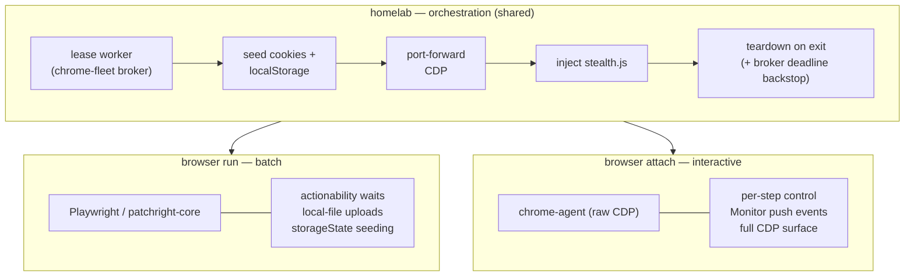
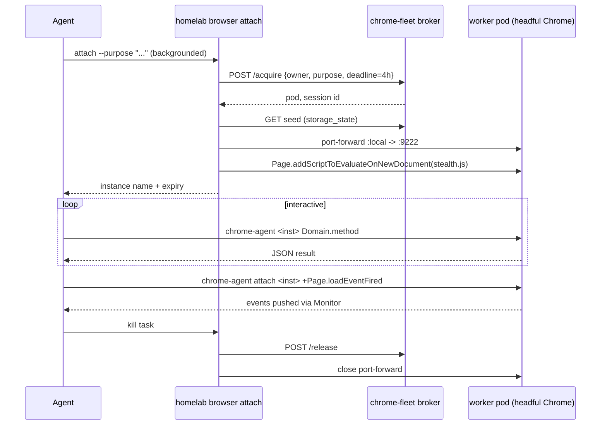

# `homelab browser attach` — interactive headful browsing

**Status:** approved (design), not yet implemented
**Date:** 2026-08-20
**Author:** Viktor Barzin (design session with Claude)
**Owning repo:** `infra` (CLI + chrome-service broker); guidance text in `~/code/docs/agents/shared/`

## Summary

Add an interactive mode to the cluster browser. Today `homelab browser run`
drives the shared headful Chrome as a **batch** script: you write the whole flow
up front, it runs start to finish, and you read the result. That fits
deterministic flows well. It does not fit exploratory work — driving a page a
step at a time, or watching what a page does while you work on something else.

This design adds `homelab browser attach`, which leases the same pool worker and
hands it to [`chrome-agent`](https://github.com/captivus/chrome-agent) as an
interactive driver. The orchestration layer (lease, cookie seed, port-forward,
stealth injection, teardown) is reused as-is; only the execution layer differs.

It also restructures the agent-facing guidance, because the current text
describes browser choice as a single escalation ladder, and this adds a second,
independent axis.

## What exists today

`homelab browser` (802 lines of Go across `cli/browser.go` and
`cli/cmd_browser.go`) is the orchestration layer, and it already solves the hard
parts:

- **Pool broker** (`chrome-fleet`) leases an isolated worker pod per caller, so
  concurrent callers do not contend and a wedged session is capped to its own pod.
- **Cookie + localStorage seeding** from the master's logged-in profile, applied
  via Playwright's `storageState`.
- **`--shared-context`** for the warmed persistent profile, used by write-back
  workflows and IndexedDB-bound auth.
- **stealth.js** (54 lines, vendored via `go:embed` from
  `stacks/chrome-service/files/stealth.js`) injected per context.
- **patchright-core 1.61.1** as the CDP client, chosen to avoid the
  `Runtime.enable` leak that Cloudflare and DataDome fingerprint.
- **Port-forward lifecycle** torn down on success and on error.

The worker pods also carry `--disable-blink-features=AutomationControlled` and
never pass `--enable-automation`, so `navigator.webdriver` is already false at
browser level for any client that connects.

The gap is interaction shape, not capability: `run` is batch by construction, so
there is no way to take one step, look, and decide the next — or to subscribe to
page events and be told when something happens.

## What chrome-agent is, and what we measured

`chrome-agent` is a CLI over the raw Chrome DevTools Protocol:
`chrome-agent <instance> Domain.method '{json}'` forwards straight to Chrome with
no schema validation, so the full protocol surface is reachable (81 domains on
Chrome 148). One runtime dependency (`websockets`), no bundled browser.

Project health, as of 2026-08-20: v0.5.7, MIT, created 2026-04-11, 153 stars,
~1,200 downloads/month, one maintainer, marked alpha. Last commit 2026-07-26;
three issues filed 2026-08-19 are still unanswered, one of which — no persistent
profile — matters for us.

Measured on the devvm (Chrome 148, headless) and against a pool worker:

| Measurement | Result |
| :-- | :-- |
| One-shot latency | ~238 ms median (215–290) |
| — of which CDP round-trip | ~57 ms; the rest is Python interpreter + import startup |
| Cold `launch` | ~632 ms |
| `Accessibility.getFullAXTree` on Hacker News | 1.15 MB JSON (~300k tokens) |
| Same page, `document.body.innerText` | 3.9 KB |
| Same page, ~30-line custom extractor | 16.6 KB, with refs and click coordinates |
| Playwright MCP snapshot, same page | 60 KB, written to a file rather than inlined |
| Wikipedia search task | Playwright MCP 2 calls; chrome-agent ~7 plus a viewport fix and a native-setter workaround |

The README's "~50–80 ms per call" figure measures the CDP round-trip. Wall-clock
per CLI invocation is roughly 238 ms because each call pays interpreter startup.

Two behaviours are worth recording because they cost time to discover:

- `launch --headless` gives a **780×493** viewport, at which responsive sites
  collapse widgets. Wikipedia's search input returned rect `[0,0,0,0]` with
  `offsetParent: false`, and coordinate clicks silently hit nothing.
  `Emulation.setDeviceMetricsOverride` resolves it. Pool workers already run at
  1920×1080, so this affects local launches only.
- Opening a second tab makes every subsequent one-shot exit non-zero with
  "Multiple page targets found" until `--target N` or `--url <substring>` is
  threaded through each call.

What chrome-agent does **not** do: it is blocked by anti-bot walls exactly as
headless Playwright is (DuckDuckGo served a CAPTCHA to both), and it deliberately
does not patch `navigator.webdriver` on the grounds that such overrides are
independently detectable.

### Feasibility of driving a cluster worker

Verified on 2026-08-20 rather than assumed. `chrome-agent`'s CDP client targets
`localhost:<port>`, and the liveness check in `registry.py::_instance_is_alive`
ends with:

```python
if not _port_is_listening(port):  return False
claimants = _cdp_port_claimants(port=port)
if not claimants:                 return True   # unattributable listener
```

A `kubectl port-forward` listens on localhost while no local process carries
`--remote-debugging-port`, so `claimants` is empty and the instance is judged
alive. With a port-forward to a warm worker and a hand-written registry entry,
the CLI drove the cluster browser: `status` reported `alive: true`,
`Browser.getVersion` returned Chrome/149.0.7827.155, and `Runtime.evaluate`
reported `webdriver: false`, `headless: false`, 1920×1080. No upstream change is
required.

## Architecture

`homelab` keeps orchestration for both modes; the execution layer is chosen by
task shape.



A session proceeds like this:



## The guidance model

The current text in `docs/agents/shared/10-homelab.md` presents browser choice as
one escalation ladder. That worked when there were two options, but `attach` and
`run` sit at the **same** anti-bot level — the same pod, the same stealth. If
they were presented as rungs 2 and 3, an agent blocked by a bot wall would
escalate from `run` to `attach` and find nothing had changed.

So the guidance separates the two questions:

```text
Browser work is TIERED. Escalate on a SIGNATURE, not a hunch.

1) WHICH BROWSER — escalate only on these:
   routine work                     -> Playwright MCP (default)
   loads, but gated action hangs    -> cluster headful
   ERR_FILE_NOT_FOUND, siblings 200 -> cluster headful
   Cloudflare / bot wall / CAPTCHA  -> cluster headful

2) WHICH MODE (same pod, same stealth — NOT an escalation):
   deterministic flow, run to completion
     -> homelab browser run <script.js>      (Playwright)
   need per-step feedback, or to WATCH events
     -> homelab browser attach + chrome-agent
```

The decision lives in `10-homelab.md` because that file is provisioned hourly to
every devvm user's `~/.claude/rules/` and is read at the start of every session.
The mechanics stay in `homelab browser --help`, which is read at the point of
use. This mirrors the split already working well for the error-code cheat sheet.

## Design decisions

| Area | Decision | Rationale |
| :-- | :-- | :-- |
| Execution layer | Hybrid: Playwright for `run`, chrome-agent for `attach` | A full swap would mean reimplementing localStorage seeding, actionability waits, and local-file uploads in-house — growing custom code rather than reducing it |
| Session TTL | attach 4h default, 8h ceiling via `--ttl`, clamped server-side; `run` unchanged at 1h | Covers a long interactive session; a fully-leaked pool still self-heals within 4h |
| Hold mechanism | Foreground-holding process | Reuses the existing `addTeardown` + signal path, so release is guaranteed and no new orphan class appears. Agents background it; humans Ctrl-C it |
| Stealth | `Page.addScriptToEvaluateOnNewDocument` with the same `go:embed` stealth.js; `homelab browser stealth <inst> --target N` re-applies for new tabs | Persists across navigations on that tab. Avoids `Target.setAutoAttach`, which produced `-32001` session failures here before (see the neko managed-policy incident) |
| chrome-agent version | Latest on each attach, into a homelab-owned dir, falling back to the installed copy if PyPI is unreachable | Viktor's call. The homelab-owned dir avoids clobbering a user's own `uv tool install` |
| Page reading | `homelab browser snapshot <instance>` | 16.6 KB versus 1.15 MB raw; gives the interactive mode a sensible default answer to "what is on this page" |
| `--shared-context` | Allowed, with a warning | Interactive write-back work is a real need; the warning notes contention with `chesscom-streak` and `tripit`. Pool remains the default |
| Uploads | Documented limitation; route to `run` | `DOM.setFileInputFiles` resolves paths inside the pod, so a local path would fail confusingly |

## Changes required

**`infra/stacks/chrome-service/files/broker/broker.py`** — per-session deadline,
following the existing stateless-labels idiom (state is reconstructed from pod
labels each request, no Redis):

- `/acquire` accepts an optional `deadline`, clamped server-side to the ceiling.
  Any devvm user can reach the broker, so a client-supplied value is not trusted.
- Bare burst pods pass it into `activeDeadlineSeconds`, which k8s enforces.
- Warm pool pods gain a `chrome-pool/deadline` annotation beside
  `chrome-pool/started`; `list_workers` reads it.
- The reaper's `now - started > DEADLINE` becomes
  `dl = float(w.get("deadline") or DEADLINE); now - started > dl`.

**`infra/cli/browser.go` / `cmd_browser.go`** — `attach`, `stealth`, `snapshot`,
and `release` subcommands; chrome-agent install-and-verify alongside the existing
patchright path; `--ttl`; `--viewport` / `--tall` carried over for parity.

**`~/code/docs/agents/shared/10-homelab.md`** — replace the tiering bullets with
the two-part table above. Provisioned hourly to all devvm users.

**`homelab browser --help`** — attach mechanics; the upload limitation; and a
note that `attach +Runtime.*` is the one chrome-agent path that sends
`Runtime.enable` (one-shots do not), so it is worth avoiding on sites that
fingerprint for it.

## Limitations and open questions

- **Uploads are unavailable in attach sessions.** `DOM.setFileInputFiles` takes
  paths the browser resolves, which for a pool worker means paths inside the pod.
  Flows needing an upload use `run`.
- **New tabs do not inherit stealth.js.** `addScriptToEvaluateOnNewDocument` is
  per-target. `homelab browser stealth <inst> --target N` re-applies it; this is
  a manual step, and an agent that forgets it gets a less-protected tab.
- **chrome-agent is alpha with a single maintainer.** Tracking latest means an
  upstream change can alter behaviour without warning. The mitigation today is
  that `attach` is additive — `run` is unaffected, so a broken chrome-agent
  degrades interactive mode rather than the whole browser capability.
- **Leaked attach sessions cost more than leaked `run` sessions.** Worst case is
  six abandoned 4h sessions wedging the pool. The broker reaper bounds it without
  intervention, but the window is four times longer than today.
- **Not yet decided:** whether `browser ls` should show remaining TTL per session
  (useful, small) and whether attach should refuse to start when the pool is
  already at `MAX_WORKERS` with all sessions claimed, rather than queueing.

## Out of scope

- No changes to `homelab browser run` or its script contract.
- No replacement of Playwright/patchright anywhere.
- Playwright MCP remains the default for routine browsing; nothing here changes
  the first rung.
