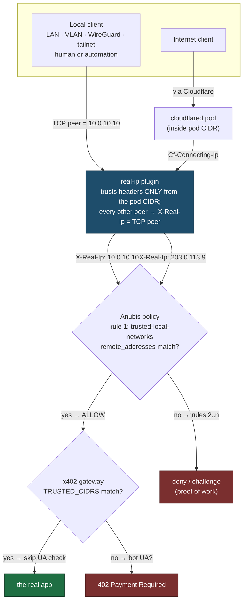

# Local networks skip the bot wall

Browsing our own sites from our own network means solving a proof-of-work
interstitial first, and anything without a browser engine cannot get past it at
all. This makes local browsing direct, without weakening what the wall does for
the internet.

The design rests on one property: the request carries a client address that a
caller cannot choose. Everything else follows from that.

## What it is like today

Seven stacks front their site with Anubis: `blog` (the apex), `homepage`
(`home`), `f1`, `kms`, `cyberchef`, `jsoncrack`, and `wrongmove`. Split-horizon
DNS points every `*.viktorbarzin.me` name at the internal Traefik LB
(`10.0.20.203`), so local traffic never reaches Cloudflare — it arrives straight
at Traefik and is challenged like any stranger.

Measured from the devvm before the change: `viktorbarzin.me`,
`f1.viktorbarzin.me`, `home.viktorbarzin.me` and `cyberchef.viktorbarzin.me` all
returned the Anubis challenge page, and Anubis logged the request with
`x-real-ip: 10.0.10.10` — the devvm's real address.

Two distinct costs:

- **Humans** pay a ~250 ms interstitial per fresh cookie. Mild, but it is on
  every path into our own dashboards.
- **Anything without JavaScript is refused outright.** `curl`, scripts, and
  headless browsers cannot solve a proof of work. Verifying an f1 UI change has
  therefore meant escalating to the shared headful Chrome, because a headless
  browser gets `Access Denied` rather than the app.

That second cost is not a challenge but a hard `DENY`, and the reason is worth
naming precisely: Anubis evaluates rules in order and the first match wins, and
the default policy's first import, `_deny-pathological`, pulls in
`headless-browsers.yaml`, which denies any `HeadlessChrome` user agent. This
single fact decides where the bypass rule has to sit.

### Anubis was not the only gate

Two other layers sit on the same requests, so fixing only Anubis would have
looked like success and left local scripts blocked:

| Layer | Status for local clients | Why |
| --- | --- | --- |
| CrowdSec | Not a blocker | Already whitelists `10/8`, `172.16/12`, `192.168/16`, `100.64/10` |
| `ai-bot-block` forwardAuth | Not a blocker | `bot-block-proxy` is a hard-coded `return 200` since poison-fountain scaled to zero |
| **x402 gateway** | **Blocker** | Live, not dry-run (wallet is set). 402s any UA matching `python-requests|scrapy|ClaudeBot|HeadlessChrome|…` |
| Traefik rate limit | Possible new pressure | 10/50 per client IP; local clients now fetch the real app rather than one small page |
| Authentik forward-auth | Out of scope | Authentication, not bot detection |

## The trust chain

Trust comes from where the address is stamped, not from anything the client
sends.

The load-bearing component is the vendored `real-ip` Traefik plugin
(`stacks/traefik/modules/traefik/real-ip-plugin/main.go`). It decides trust from
the TCP peer, which a client cannot spoof, and it *overwrites* `X-Real-Ip` for
every peer outside the pod CIDR. `ingress_factory` attaches it automatically to
any `anubis-*` backend, so no site can be wired without it. Anubis reads exactly
that header for CIDR matching (`lib/policy/checker.go:44`), and the x402 gateway
now reads it too.

So a request from the internet cannot present a private address, and the bypass
has no key that exists on the public side.

## Decisions

**Who is unblocked: humans and local automation.** Both, which forces an
IP-based rule rather than something a browser solves, and forces that rule above
the user-agent denies.

**Trusted set: private and CGNAT ranges only** — `10.0.0.0/8`,
`172.16.0.0/12`, `192.168.0.0/16`, `100.64.0.0/10`, `fc00::/7`, `fe80::/10`.
This mirrors what CrowdSec already declines to ban, so "trusted local" means one
thing across both layers.

**Our public egress IP (176.12.22.76) is deliberately excluded.** Including it
would cover devices that resolve through DoH and arrive via the public path, but
it would also give the bypass an internet-reachable key that depends on the ISP
keeping our lease — a reassignment would hand a stranger the bypass on eight
sites, silently. Leaving it out means the bypass is unreachable from the internet
by construction, which is a property rather than a promise.

**The module owns the policy's first line.** `modules/kubernetes/anubis_instance`
renders the `bots:` key itself, then the trusted-networks rule, then the
caller's rules. A new Anubis site inherits the bypass without doing anything,
and an existing one cannot drift out of it. `f1-stream`, the only stack with a
custom policy, would otherwise have been silently missed — its own copy of the
rules is exactly the kind of drift this structure removes.

**`policy_yaml` is renamed to `policy_rules_yaml`,** taking the rules list
without the `bots:` key. The rename is the point: a caller still passing a whole
document now fails at `terraform plan` with "Unsupported argument", rather than
rendering a valid-looking policy whose first rule is not the bypass.

**One canonical list, one deliberate mirror.** The list lives as the default of
`var.trusted_local_cidrs`, mirrored as the x402 gateway's `TRUSTED_CIDRS` in
`stacks/traefik`. Two copies is a considered choice, not an oversight: CI fans a
`modules/` edit out to that module's consuming app stacks, while a
`stacks/traefik` edit re-applies the traefik platform stack. A single shared
definition — in `config.tfvars` or a shared sub-module — would reach one side and
leave the seven Anubis app stacks holding the old list until some unrelated
apply, with nothing surfacing the gap. Each copy now lives where CI applies it.
Both files cross-reference each other.

**Verification is structural, not monitored.** The trusted proxy that knows the
exact address already exists and already sits in the path, so the guarantee is
architectural. We considered a recurring probe from the cluster VPN egress
(a genuinely untrusted public IP, `89.37.175.169`) sending a forged
`X-Real-Ip: 10.0.0.1` and asserting the challenge still appears. We did not add
it: an invariant beats a monitored assumption. The residual is named under Risks.

**Authentication is untouched.** Logins stay gated. Telling Authentik who is
calling is separate work with a service identity; an address is too weak a claim
to stand in for a login, and expressing an IP-conditional auth bypass in Traefik
would need a per-host `ClientIP`-matched route for each of the 92 `auth =
"required"` ingresses. Token and app-password minting is the proven path there.

**Rate limiting is left alone and measured.** Local clients now fetch whole
applications instead of one small page, so they push more requests through the
10/50 limiter than before. Eight services already carry per-app overrides for
exactly this pattern; if 429s appear, that is the established remedy. Guessing
numbers ahead of measurement would add moving parts to this change for no
evidence.

## Risks we accept

- **Local traffic also skips the AI and pathological denies.** A compromised
  device on our own network can scrape these eight sites freely. This matches the
  existing posture rather than widening it — CrowdSec already declines to ban
  those same ranges — but it is a real consequence of putting the rule first,
  which the headless-browser DENY requires.
- **A tailnet-enrolled device keeps the bypass until revoked in Headscale.** A
  lost or stolen device retains a valid node key until someone removes it.
- **Every in-cluster workload skips the challenge,** third-party images
  included, because the pod CIDR sits inside `10.0.0.0/8`. Those workloads can
  already reach backends directly by ClusterIP, so this grants no new reach.
- **The invariant has one moving part.** If `real-ip` were ever detached from an
  Anubis ingress, `X-Real-Ip` would become client-controlled and the bypass would
  become forgeable. `ingress_factory` attaches it automatically for `anubis-*`
  backends, which is what makes this unlikely rather than merely unlikely to be
  noticed. If that automatic attachment is ever changed, this is the reason to
  be careful.

## Known limitation

A device that resolves through DoH or a hardcoded resolver skips Technitium,
gets the Cloudflare address, and arrives on the public path with a public
`Cf-Connecting-Ip` — so it still sees the challenge on the proxied hosts. Using
the LAN resolver is the fix. Forcing it would mean pfSense changes, which are
not part of this.

## Side effect worth knowing

In-cluster probes now reach the real backend instead of the challenge page. That
closes the monitoring blind spot behind the six-day blog outage
(2026-05-26 → 06-01), where a front-door monitor stayed green on the challenge
page's HTTP 200 while the backend was crash-looping. Tightening those monitors
to assert real content is a separate improvement, not folded in here. The
external Gatus vantage on mx2 still sees the challenge, so its conditions behave
as before.

## What changed

| File | Change |
| --- | --- |
| `modules/kubernetes/anubis_instance/main.tf` | Owns `bots:`; renders the trusted-networks ALLOW rule first; new `trusted_local_cidrs`; `policy_yaml` → `policy_rules_yaml` |
| `stacks/f1-stream/main.tf` | Passes `policy_rules_yaml` (rules only) |
| `stacks/traefik/modules/traefik/main.tf` | `TRUSTED_CIDRS` on the x402 gateway, mirroring the module list |
| `x402-gateway` (`cmd/x402-gateway/main.go`) | `TRUSTED_CIDRS` parsed at startup; trusted sources skip the bot-UA check; malformed CIDR fails startup |
| `x402-gateway` (`decision_test.go`, `build.yml`) | Tests for the decision logic, now actually run in CI |

## Verification

Run against the live cluster on 2026-08-23, after the apply:

| Check | Result |
| --- | --- |
| All 7 policies carry `trusted-local-networks` first, 6 CIDRs | pass |
| From the devvm — apex, `f1`, `home` | real content, not the challenge |
| From the cluster VPN egress (`89.37.175.169`), non-proxied `f1` | challenged |
| Same, Cloudflare-proxied apex and `home` | challenged |
| Same, plus forged `X-Real-Ip: 10.0.0.1` and `Cf-Connecting-Ip` | challenged — the header cannot be claimed |
| Headless Playwright against the f1 SPA from the devvm | loads the real app (previously `Access Denied`) |
| `python-requests`, `Scrapy`, `ClaudeBot`, `HeadlessChrome` UAs from the devvm | 200 with real content, no 402 |
| 60 rapid local requests to the f1 SPA | 60 × 200, zero 429 |

The rate-limit question is answered by that last row: no per-site override is
needed. The forged-header row is the one that matters most, since the whole
design rests on `X-Real-Ip` being unclaimable, and it was tested from a
genuinely untrusted public address rather than reasoned about.

## Two things that went wrong on the way in

Both are worth recording, because each produced a green signal over an
unapplied change.

**A restarted pipeline applied nothing and reported success.** Woodpecker's
cancel-on-new-push killed the original run mid-apply. Restarting it re-ran with
no `CI_PREV_COMMIT_SHA`, so the pipeline fell back to `DIFF_BASE=HEAD~1` — and
for a merge commit that is the *first* parent, the feature-branch side, so the
diff showed only the other lineage's files and selected none of the changed
stacks. The pipeline's own comments warn about this for pushes; the restart path
reaches it too. A green pipeline is not evidence of an apply: check the live
resource. Landing a non-merge, fast-forward commit avoids it.

**`terraform validate` passed on a broken policy render.** The first version
concatenated with `+`, which in HCL is arithmetic — every Anubis stack failed
with `Invalid operand: a number is required`. Validating locally had not caught
it, because `validate` does not evaluate locals that depend on variables, and
because the pre-flight check was a Python imitation of the heredoc and YAML
rather than Terraform itself. What does catch it, needing no backend or
credentials: copy the module to a scratch directory, instantiate it once per
caller shape, `terraform init -backend=false`, then `plan` and assert on the
rendered resource via `terraform show -json`. That check was confirmed to fail
on the broken form and pass on the fix before landing.

## Open question

None outstanding. The rate-limit question that was open at design time was
measured after rollout and needs no change.
