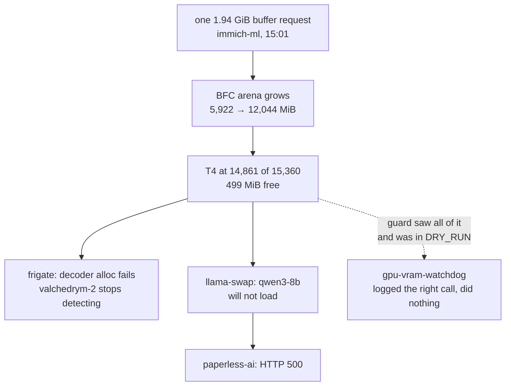
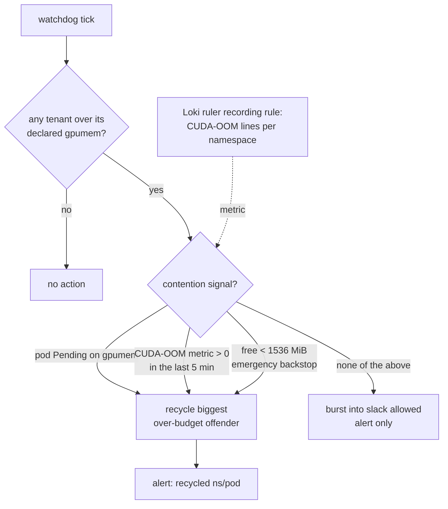

# GPU VRAM admission, contention-triggered recovery, and OOM observability

Status: approved 2026-08-31 (grilling session), implementing.

On 2026-08-31 a single tenant's GPU memory arena filled the shared Tesla T4 and
took three services with it. The guard built to prevent exactly this was
installed, correct, and running in dry-run. This document records what we
measured, what we decided, and how we verify it.

Scope: the T4 admission and recovery path, dawarich's host-memory OOM, and the
Prometheus-side OOM blindness that let both go unreported. Three one-line fixes
from the same health check ride along.

```stats
12,044 MiB | immich-ml arena at peak
1,958 MiB | its footprint when fresh
499 MiB | free VRAM at the worst point
60 days | the guard ran in dry-run
3 | services taken down with it
2m23s | cost of one recycle
```

## What happened

At 15:01 UTC immich-machine-learning's onnxruntime BFC arena stepped from
5,922 MiB to 12,044 MiB in one interval, taking the card to 14,861 MiB of
15,360 and leaving 499 MiB free. The trigger is in its own log:

```
RuntimeException: [ONNXRuntimeError] : 6 : RUNTIME_EXCEPTION :
Non-zero status code returned while running Conv node. Name:'Conv_3'
bfc_arena.cc:358 ... Failed to allocate memory for requested buffer of size 2081488896
```

One 1.94 GiB buffer request. The BFC allocator grew to serve it, did not
succeed, and did not release the pages afterwards.

Three services were affected:

| Service | Symptom |
|---|---|
| frigate, camera `valchedrym-2` | `CUDA_ERROR_OUT_OF_MEMORY` on decoder creation, rising from 69 to 565 errors/hour; the camera stopped detecting |
| llama-swap | `starting qwen3-8b failed`, `CUDA error: out of memory`, `cudaMemGetInfo failed` |
| paperless-ai | HTTP 500 from llama-swap on `/v1/chat/completions` |



claude-memory calls llama-swap only for `GET /v1/models` and was unaffected:
`memory_embed_write_total{status="ok"}=210`, `memory_embeddings_pending=0`.

This is the 2026-06-02 incident recurring
(`docs/post-mortems/2026-06-02-immich-ml-ttl-gpu-oom-recruiter.md`): same
tenant, same arena, 12.0 GB instead of 10.7 GB, and llama-swap's qwen3-8b
starved both times.

## What we measured

### immich-ml's memory is a ratchet, not growth

| Pod age | VRAM |
|---|---|
| Fresh, all four preloads resident | 1,958 MiB |
| ~14 h | 2,552 MiB |
| ~32 h (first large job) | 5,478 MiB |
| 2 to 10 days (flat) | 5,700 to 5,922 MiB |
| After the 1.94 GiB allocation | 12,044 MiB |
| After a recycle | 1,964 MiB |

The fresh figure matches ADR-0016's June measurement of ~2.1 GiB. The higher
numbers are accumulated high-water mark rather than a change in the workload.
Growth is driven by the size of the work, not by uptime; the arena was still at
1,964 MiB twelve minutes after a recycle.

**What grows, established 2026-09-01.** The four `MACHINE_LEARNING_PRELOAD__*`
models (CLIP textual and visual, buffalo_l detection and recognition) pin the
~1,960 MiB baseline and never unload. That is the keep-smart-search-warm design
working as intended, and it is not the thing that grows.

The growth comes from OCR. `PP-OCRv5_mobile` is not preloaded: it loads on
demand, works, and is unloaded by `model_ttl` after 600s. Its weights genuinely
are freed — resident VRAM visibly drops on unload — but onnxruntime's BFC arena
keeps the workspace chunks it extended, so the floor ratchets while the peaks
fall back:

```
19:05-22:05  1964 MiB   fresh, four preloaded models
22:22        OCR loads   -> 4790
23:05        TTL unload  -> 3426     (not back to 1964)
02:59        OCR loads   -> 4302
03:35        TTL unload  -> 3548
```

An earlier version of this document said the arena "holds the pages until the
process exits". That is not right: unloading a model does return its weights.
What persists is the arena's cached workspace, and only the floor moves.

**Why the peaks are so large.** `immich_ml/models/ocr/detection.py::_transform`
scales the *shorter* edge to `maxResolution` (736) and leaves the longer edge
unbounded, with the ratio clamped to at most 1.0 — so an image whose short edge
is already below 736 is not downscaled at all:

| asset | short edge | fed to detection |
|---|---|---|
| 4000x3000, a normal photo | 3000 | 981x736 = 0.7 Mpx |
| 7500x736 panorama | 736 | 7500x736 = 5.5 Mpx |
| 700x8464 scrolling screenshot | 700 | unchanged = 5.9 Mpx |

Of 181,980 assets, 70 exceed 2 Mpx after this transform and 8 exceed 4 Mpx.
Eight images — 0.004% of the library — set the VRAM floor for the whole
service, because the arena keeps whatever high-water mark they cause. One of
them produced the 1.94 GiB Conv request above.

The usual remedy does not apply here: Immich already creates the CUDA provider
with `arena_extend_strategy: kSameAsRequested`, so there is no power-of-two
doubling to switch off, and it exposes no setting for `cudnn_conv_algo_search`
or a CUDA memory cap. The available knobs are `model_ttl`, `model_arena` (CPU
only), `max_batch_size` and `preload`.

This matters because the budget we set determines when the guard acts. Budgeting
immich-ml at its plateau tolerates roughly 4 GB of retained arena on a card
that has 15.

> [!IMPORTANT]
> Measure immich-ml's footprint on a freshly restarted pod. A reading taken
> from a pod that has been up for days is its arena high-water mark, not its
> working set, and budgeting from it hands several GB of the card to retained
> memory. The same caution applies to any onnxruntime or glibc-arena workload.

### The guard was already built and already right

ADR-0016 established a `viktorbarzin.me/gpumem` extended resource for
schedule-time admission and a `gpu-vram-watchdog` for runtime enforcement. Both
have been running for 60 days. During the incident the watchdog logged the
correct decision every 60 seconds:

```
VRAM used=14861MiB free=499MiB floor=1536MiB total=15360MiB
PRESSURE: recycling immich/immich-machine-learning (used=12044MiB > budget=1800MiB,
          overshoot=10244MiB) [DRY_RUN]
```

`DRY_RUN` defaults to `true` with the description "Ships true
(observe-then-enforce); flip to false once a few cycles look right". The
observation period produced the evidence it was meant to produce. Flipping it
is the main change here.

### A recycle costs about two and a half minutes

Measured on the manual recycle taken during this session:

| Event | Time |
|---|---|
| Pod created | 18:50:13 |
| `Started server` | 18:51:59 |
| `Application startup` (all four preloads resident) | 18:52:36 |
| immich-server logs `Machine learning server became healthy` | 18:53:06 |

Smart search and face recognition are unavailable for that window. No job loss
was observed; immich-server detects health and resumes.

### qwen3-8b's footprint is its configuration, not drift

4.68 GiB of Q4_K_M weights (`model.gguf`, 5,027,784,512 bytes) plus roughly
2.25 GiB of KV cache at the configured `-c 16384` accounts for the 6,994 MiB
measured. Nothing has grown.

Load counts over the 30 days to 2026-08-31, by peak loads in a 24-hour window:
`qwen3-8b` 375, `qwen3vl-8b` 5, `qwen3vl-4b` zero, with no load line for the 4b
anywhere in the window.

An earlier reading of this during the design session reported both vision models
as unused. That came from a log query capped at 25 lines, which returned a
recent sample rather than a 30-day census. Corrected here: `qwen3vl-8b` is in
active use by tripit.

### Prometheus could not see either OOM class

Two independent gaps, both on the Prometheus side:

1. `kube_pod_container_status_last_terminated_reason` is exported by
   kube-state-metrics (134 series, including dawarich's `reason="OOMKilled"`)
   but does not reach Prometheus. The `kubernetes-service-endpoints` job carries
   a 74-entry `action: keep` allowlist that includes
   `kube_pod_container_status_restarts_total` and not this one.
2. `ContainerOOMKilled` alerts on `increase(container_oom_events_total[15m])`.
   That counter lives in the container's cgroup and is recreated at zero when
   the container restarts, roughly a second after an OOM kill of PID 1.
   Catching it requires a scrape inside that window. Cluster-wide, 447 series
   carry `container!=""` and one has ever been non-zero (`paperless-ai`, value
   1), against 152 kernel OOM kills on k8s-node5 in the same period.

The Loki ruler's `KernelOOMKiller` rule reads node journals and did fire. It is
currently the only working OOM detector, and it is how these incidents surfaced.

### Bounding the OCR ratchet (2026-09-01)

Three choices, taken after the investigation above:

- **Report upstream, carry no local patch.** The mechanism is a comment on
  [immich-app/immich#23462](https://github.com/immich-app/immich/issues/23462),
  which was already open with no maintainer response and no identified cause
  (#24024 is closed as its duplicate). Neither report had the mechanism. We do
  not patch `detection.py` locally, so the image stays unmodified.
- **Leave `maxResolution` at 736.** Lowering it to 512 would cut the worst case
  from 5.9 to 3.2 Mpx, but it degrades text recognition across all 181,980
  assets to tame a tail of 8, and screenshots are exactly the assets most likely
  to contain text worth reading.
- **Bound it operationally instead**, with a nightly `immich-ml-arena-recycle`
  CronJob at 04:45 that resets the arena to its ~1,960 MiB baseline. The
  gpu-vram-watchdog already recycles this pod, but only under contention; this
  is the unconditional floor, so growth is bounded whatever arrives in the
  library. An age guard skips the run when the pod is already under 6h old,
  since any restart resets the arena.

immich-ml keeps its 2,500 MiB seat rather than being raised to fit the plateau.
That means it reads as over-contract for much of the day, which is the intended
contract under ADR-0016: it is the designated sacrificial tenant, a recycle
costs ~2m23s, and the card cannot hold its plateau alongside qwen3-8b in any
case.

### dawarich's web container has the problem its sibling already fixed

The `dawarich` container runs two Puma cluster workers against a 896Mi ceiling:

```
557900 KB  puma: cluster worker 0
275480 KB  puma: cluster worker 1
208504 KB  puma master
```

Its cgroup reported 439 reclaim events since the last restart, and it was
OOMKilled four times on 2026-08-31. It sets no `MALLOC_ARENA_MAX`.

`dawarich-sidekiq` had the same glibc arena behaviour diagnosed on 2026-08-29,
documented in `stacks/dawarich/main.tf`, and fixed with `MALLOC_ARENA_MAX=2`
plus a limit raise. Node5's kernel OOM counter tracks both halves:

| Date | 08-25 | 08-26 | 08-27 | 08-28 | 08-29 | 08-30 | 08-31 |
|---|---|---|---|---|---|---|---|
| node5 kernel OOM kills | 12 | 18 | 18 | 48 | 41 | 0 | 15 |
| sidekiq restarts | 6 | 8 | 9 | 24 | 20 | 0 | 0 |
| web restarts | 0 | 0 | 0 | 0 | 0 | 0 | 4 |

## Decisions

### Seating chart

Budgets are set from measured footprints. The advertised total stays at 14,000 MiB.

| Tenant | Was | Becomes | Basis |
|---|---|---|---|
| immich-ml | 1,800 | 2,500 | fresh footprint 1,958, ~25% margin |
| frigate | 2,300 | 2,800 | measured peak 2,689 |
| immich-worker | 3,000 | 1,500 | 7-day peak 1,251 |
| f1-stream | undeclared | 500 | 418 MiB, active 1 hour of the last 169 |
| android-emulator | undeclared | 300 | 214 MiB, active 12 hours of the last 169 |
| proxy-browser | 384 | 384 | steady 50 MiB; declared outside this repo, unchanged |
| llama-swap | 5,000 | no declaration | opportunistic tenant, see below |
| stremio | 1,500 | no declaration | zero VRAM in 7 days |
| yt-highlights | undeclared | no declaration | zero VRAM in 7 days; moves to Sablier |

Always-on declared total: 7,984 of 14,000. The remaining 6,016 MiB is the slack
that qwen3-8b's 6,994 MiB load bursts into, alongside whatever immich-ml has
not yet ratcheted.

`llama-swap` keeps no reserved seat. It is idle almost all the time and a
7,000 MiB reservation would sit unused; it also cannot be scaled to zero by
Sablier because it has no ingress and its callers reach the ClusterIP directly.
In exchange it gets an explicit alert when a model load fails, so a starved load
is reported rather than silent.

**Only `yt-highlights` moves behind Sablier.** The intent was to enrol
`stremio` and `f1-stream` as well, and measuring their ingress traffic before
building it showed that neither would ever park:

| Candidate | Hours with ingress traffic (of 168) | Verdict |
|---|---|---|
| yt-highlights | 0 (zero requests in 7 days) | enrolled |
| stremio | 104, and every hour of the last 72 | not enrolled |
| f1-stream | 162, a ~12/h floor plus race-day peaks of 339-1369/h | not enrolled |

A Sablier group refreshes its session on every request, so a steady floor of
monitor and bot traffic holds a deployment awake indefinitely. For f1-stream the
middleware would also sit in front of Anubis, so requests that never pass the
proof-of-work challenge would still wake it. Enrolling either would add a
middleware, a label set and a lifecycle exception that never fire, and would
suggest a seat was being released when it was not.

stremio still gives its 1,500 MiB seat back, which is the change that actually
frees budget and does not depend on parking. f1-stream gets a declared seat
instead. Quietening the monitor and bot floor on those two ingresses would make
them viable candidates later; that is tracked rather than done here.

`qwen3-8b` stays at its current quantization and context, and all three models
stay in the llama-swap config. `qwen3vl-8b` is in active use. `qwen3vl-4b` has
not been loaded in 30 days, but `stacks/fire-planner` sets it as the default
`LLM_MODEL` and `stacks/tripit` sets it as `LLM_VISION_MODEL`, so removing it
would change the behaviour of two services outside this change set to reclaim
~3.3 GB of disk and no VRAM at all (llama-swap runs `-np 1` and holds one model
at a time). Tracked separately instead.

Worth noting for that follow-up: fire-planner's own comment gives its reason for
defaulting to the 4b as "use qwen3-8b when GPU has ≥5GB free; qwen3vl-4b when
immich-ml is using ~10GB". Bounding immich-ml at its fresh footprint removes the
condition that workaround was written for.

### The watchdog becomes contention-triggered

Enforcement moves from `DRY_RUN=true` to live, and the trigger changes from
"free VRAM below a floor" to "a tenant is over budget and something else
actually wants the card".



Why contention rather than free space: a free-space trigger cannot distinguish
"a tenant has retained garbage" from "a tenant is doing legitimately large
work". An immich batch job whose real working set exceeds its budget would be
recycled, retried, and recycled again without ever completing. Waiting for
evidence that another tenant is blocked keeps burst-into-slack, which ADR-0016
deliberately allowed, while still clearing space when it is genuinely needed.

The two contention signals are complementary and both are required:

- **Pending on gpumem.** Covers tenants that declare a budget. The scheduler
  marks them `Pending` with `Insufficient viktorbarzin.me/gpumem`, readable from
  the API.
- **CUDA-OOM events.** Covers tenants without a seat. llama-swap has no
  declaration by design, so it never goes `Pending`; it fails inside an already
  running pod. frigate fails the same way. A Loki **alerting** rule
  (`GpuCudaOom`) counts these log lines per namespace, and the watchdog reads
  the active alert from Alertmanager.

  The design called for a Loki *recording* rule feeding Prometheus. That path
  does not exist here: the Loki ruler is configured for alerting only, with no
  `remote_write`, so a recording rule would have nowhere to land that Prometheus
  could read. Building one would mean adding remote-write to the ruler and
  enabling Prometheus's remote-write receiver, which is a change to the
  monitoring core for no gain over reading the alert. The alerting path is the
  one `KernelOOMKiller` already uses and needs no new plumbing. Verified against
  live data: the expression returns the frigate CUDA-OOM series starting 15:08
  on 2026-08-31, seven minutes into the incident.

The 1,536 MiB floor is retained as an emergency backstop so a starvation that
produces neither signal still self-heals.

### Admission becomes complete

Four pods currently request `nvidia.com/gpu` with no `gpumem` declaration, which
makes them invisible to the watchdog regardless of what they consume. ADR-0016
deferred budgeting small on-demand tenants, and that deferral is what we are
now closing.

A Kyverno rule requires `gpumem` on any pod requesting `nvidia.com/gpu`. It
shipped in **audit** mode so we could see what it would block before it blocked
anything. f1-stream and android-emulator got the budgets above.

**Update 2026-09-04 (bead code-0twf): the rule is now in Enforce.** Audit turned
out to buy nothing here — cluster-wide policy reporting has been off since
2026-06-28, the kyverno namespace runs no reports controller, and
`kubectl get clusterpolicyreport` returns "No resources found", so every audit
verdict was computed and discarded. The pre-flip review read the live pod and
workload specs instead and found three gaps this section had not anticipated:
the `nvidia/gpu-pod-exporter` DaemonSet, `tts/chatterbox-tts`, and the three
`ebook2audiobook` deployments. The first is handled by excluding the `nvidia`
namespace; the rest took measured seats. `llama-cpp`, `stremio` and `ytdlp` are
excluded by namespace as the deliberately seatless tenants they always were.

The flip also exposed that the rule had never worked. Its `pattern` wrapped the
requirement in two conditional anchors, and a conditional anchor turns a
non-matching sub-pattern into a skip rather than a failure, so the rule passed
every pod from the day it shipped. Both anchors are now existence anchors
(`=(resources)`, `=(limits)`). The check that settles this is a
deliberately-violating resource, not a quiet report.

### Alerting

- `GPUVRAMLow` currently fires at 1,024 MiB free, below the 1,536 MiB action
  threshold, so it reports after the guard has acted. It moves above the
  threshold.
- A new alert fires when the watchdog recycles a pod, so an intervention is
  visible rather than inferred from a cold search.
- A new alert fires when a llama-swap model load fails, which is the one
  starvation path with no seat to go `Pending` on.

### dawarich

Mirror the fix already proven on `dawarich-sidekiq`: set `MALLOC_ARENA_MAX=2`,
raise the limit from 896Mi to 2Gi, and leave the request at 896Mi so node5
scheduling pressure does not move. Puma worker count is unchanged, since the
allocator behaviour is the measured cause and changing concurrency would alter
request handling for a problem that has a targeted fix.

### OOM observability

- Add `kube_pod_container_status_last_terminated_reason` to the
  `kubernetes-service-endpoints` keep allowlist.
- Replace `ContainerOOMKilled` with a rule based on `last_terminated_reason`,
  which persists past the restart rather than being reset by it.
- Keep the Loki `KernelOOMKiller` rule as an independent second signal.

### Folded in from the same health check

Three single-line fixes from the run that started this work:

- **CrowdSec bouncer selector.** `CrowdSecL7BouncerNotPolling` matches
  `bouncer="traefik"` exactly. Traefik pods register with LAPI as
  `traefik@<pod-ip>`, so the alert went permanently firing after a pod roll
  while every current pod was polling on schedule. Selector becomes
  `bouncer=~"traefik.*"`.
- **Repowise tag fetch.** `git fetch origin` on `terminal-lobby` exits 1 with
  `would clobber existing tag` for two re-pointed tags, which marks the whole
  42-repo sync pass failed even though `master` fetches cleanly. Fetch tags with
  force.
- **ATS threshold.** `ATSOverload` fires above 300W while the measured load
  oscillates between 165W and 337W on a roughly 4-minute duty cycle, with a
  daily peak of 304 to 337W on each of the last 7 days. Threshold moves above
  the duty-cycle peak.

## Rollout

One change set, budgets and enforcement together, so the guard never runs
against budgets it would immediately act on.

Order within the change set matters in one place: the `gpumem` capacity is
advertised by the nvidia stack, and a pod requesting an unadvertised extended
resource is unschedulable. The advertised total is unchanged at 14,000, so no
new ordering constraint is introduced here.

## Verification

| Check | Expected |
|---|---|
| `sum by (namespace) (gpu_pod_memory_used_bytes)` | immich-ml near 1,960 after a recycle, frigate near 2,611 |
| Sum of declared `gpumem` limits on node1 | 7,984, at or under the 14,000 advertised |
| Watchdog logs | `dry_run=false` at startup; no recycle while free VRAM is high and no contention signal is present |
| Forced contention test | load qwen3-8b while immich-ml is over budget; expect one recycle of immich-ml and a successful model load |
| `kube_pod_container_status_last_terminated_reason` in Prometheus | present, with dawarich's OOMKilled series visible |
| New `ContainerOOMKilled` rule | fires against a container whose last termination reason is OOMKilled |
| dawarich | no OOMKill over 24 h; `memory.events` `oom_kill` stays 0 and `max` reclaim events fall |
| Sablier | yt-highlights parks at zero replicas and wakes on a request within its 180s ready-after |
| Kyverno audit | policy reports on the pods lacking `gpumem`, blocks nothing. **Superseded 2026-09-04:** the policy is in Enforce; the check is now that a GPU pod without `gpumem` is rejected in a non-excluded namespace, every excluded one still admits, and no pod is Pending on `gpumem`. |
| CrowdSec alert | resolves, and stays resolved across a traefik pod roll |

## Open questions

- The contention-metric window (5 minutes of CUDA-OOM lines) is a first
  estimate. If it proves too long, a starved tenant waits; too short and a
  transient error triggers a recycle. Tune from observed behaviour.
- Whether the Kyverno rule moves from audit to enforce depends on what the
  audit reports, including any GPU workload created outside this repo such as
  the proxy-browser pods.
- immich-ml's ratchet is bounded by recycling rather than prevented, and the
  arena still grows between recycles. Answered 2026-09-01: the driver is OCR
  detection's resize, reported upstream, with a nightly recycle as the bound —
  see "Bounding the OCR ratchet" above. Preload trimming and arena tuning remain
  not taken; the preloads are the fixed baseline, not the growth.
- Sablier in front of f1-stream stacks with the Anubis gate already there. We
  expect them to compose; this is verified during rollout rather than assumed.

## Tracked separately

Filed as beads rather than carried here: a TEI embedding service so claude-memory
has no llama-swap dependency, the 33 drifting Terraform stacks climbing since
2026-08-25, k8s-node2 at 24 of 28 CSI attachments, NAS_Barzini at 11.0% free,
the offline dehumidifier and Баня Вълчедръм climate devices, the Kyverno
audit-to-enforce follow-up, retiring `qwen3vl-4b` together with the
fire-planner and tripit settings that reference it, and tripit's llama-swap
pick-segment call returning HTTP 400 and falling back to claude-agent-service
(a pre-existing fault, unrelated to VRAM).
