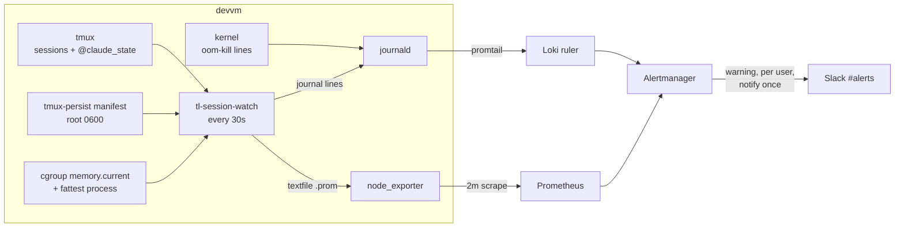

# Telling Viktor when a devvm Claude session dies

**Status:** approved, in execution
**Date:** 2026-09-01
**Owner:** wizard
**Predecessor:** [2026-08-16-devvm-pane-memory-cap.md](2026-08-16-devvm-pane-memory-cap.md)

## The gap

Claude sessions on the devvm sometimes disappear, and today the way that gets
noticed is by looking at the sidebar and counting. Nothing tells anyone. A
conversation can be gone for hours before its absence registers.

The containment work from 2026-08-16 did what it set out to do. earlyoom has
killed nothing on the box in the last 7 days, so the old failure — earlyoom
picking off every `claude` process box-wide — is no longer what is happening.
What remains is narrower and quieter, and it has no alerting at all.

## What is actually happening, measured 2026-09-01

| observation | measurement |
|---|---|
| earlyoom kills, last 7d | 0 |
| distinct tmux panes that hit the 6G cap, last 7d | 3 |
| of those, kills where the victim was `claude` itself | 2 (05:55 today, pid 2332819; and pid 3922236) |
| MemAvailable on devvm over 30d | p1 11.8%, p10 15.9%, p50 27.0% |
| earlyoom trigger | `-m 5,3` — SIGTERM at 5% available, SIGKILL at 3% |
| live pane memory against the 6G cap | 0.68–1.5 GB across 27 panes |
| all-in cost of one session | ~659 MB (467 MB claude + ~192 MB of per-session MCP servers) |

The live failure is the per-pane cap firing with `claude` as the highest-RSS
process in that pane. The cap is behaving as designed: it bounds one pane and
lets the kernel pick the fattest task inside it. When the fattest task is a
build or a test run, that is the outcome we want. When claude has grown past
everything else in its own pane, the same mechanism takes the conversation.

`CONSTRAINT_MEMCG` matters here. A pane can reach its own 6G ceiling while the
box has 20 GiB free, so box-level memory pressure does not predict this class at
all. The two need separate signals.

## Two shapes of loss, and which one lobby sessions take

Measured directly on 2026-09-01:

- **`kill -9` on a claude in a lobby-created session takes the whole session.**
  The pane command is `zsh -lic claude`, so claude's death closes the pane, and
  the last pane closing ends the session. The sidebar row disappears.
- **A claude started by hand inside a shell pane dies alone.** The session
  survives with a shell where the conversation used to be. Two of the 18 live
  sessions are that shape.

Both are worth reporting, and they need different evidence.

### Liveness comes from the process tree, not the cgroup

The first working version asked each pane's cgroup "is a claude in here", and on
its first run against the live box it called four of emo's live conversations
dead. The cause is worth recording, because it also changes what the pane metric
means:

- emo's claude for those sessions sits in a `run-r*.scope` holding 2.09 GB, while
  the `tmux-spawn` scope for the same pane holds only the shell and reports
  `memory.current` 0.
- Four of emo's 19 claudes share that one `run-r*.scope`, which carries a single
  6 GiB cap between them (1999 MB in use when measured). His other 15, and all of
  wizard's, have a scope each. So those four sessions have roughly 1.5 GB of
  headroom apiece rather than 6 GB, and a cap kill there takes whichever of them
  is largest.

tmux owns the pane pid, so the process tree under it is what answers "is a claude
alive". Pane memory comes from the cgroup around the **largest** process in that
tree, since that is the cap that will fire and the process it will take. Reading
the shell's scope instead reported 0 for every one of emo's sessions.

One consequence for anyone reading the metric: because panes can share a cgroup,
`tl_pane_memory_bytes` is what a session is exposed to, not its own share, and it
is not additive across sessions. The HELP string says so.

## What could not serve as the discriminator

The first design used the `@claude_state` stamp: `SessionEnd` clears it on an
orderly exit, and a `SIGKILL` cannot run a hook, so a stamp left behind would
mark a death. Two measurements ruled this out for a vanished session:

- `tmux kill-session` on a session running claude produced **zero**
  `claude-tmux-state` journal lines. Claude does not run `SessionEnd` on the
  `SIGHUP` tmux sends.
- The hook's `clear` branch never logged an event in any case. It unsets the
  tmux option and returns.

So for a session that disappears, the stamp goes with it and no journal line
marks either outcome. The stamp remains the right signal for the shape where
the session survives, where it is readable — a clean `/exit` was measured to
clear it, and a `SIGKILL` cannot run the hook that would.

## The discriminator that does serve

`tmux-persist` already separates the two cases, as a side effect of what it is
for. A kill through the lobby calls `sudo tmux-persist-forget <user> <name>`
(`tmux-api/main.go:825`) so that Restore cannot resurrect a session someone
deliberately ended. A death cannot make that call.

**A session that leaves tmux while its manifest row is still present is a
death.** Gone from both is a deliberate kill. This holds whoever did the
killing, because the forget is the act that carries the intent.

Verified 2026-09-01: 19 live sessions, 18 manifest rows, the sole difference
being the prewarm pool slot, and zero orphaned rows.

The manifest is written by a 5-minute timer, which is coarser than we want for
detection. So the two questions go to different sources:

- **Was it alive a moment ago?** `tl-session-watch`'s own 30-second snapshot.
- **Was ending it deliberate?** The manifest row.

Each source answers only what it is authoritative about, and the 5-minute lag
stops affecting detection latency.

## How the signals travel

Detection speed is deliberately decoupled from the scrape interval. Prometheus
scrapes devvm every 2 minutes and the house minimum for `for:` is 3 minutes, so
a metric-based rule cannot react to a pane that crosses its threshold and dies
inside one interval. The local check decides, at 30-second resolution, and logs
its decision. The exported metric exists for history and for tuning the
threshold once there is a week of it.

## The alerts

| name | condition | source | resolution |
|---|---|---|---|
| `ClaudeOOMKilled` | `oom-kill:` with `task=claude` | kernel, via Loki | after the fact |
| `ClaudeSessionDied` | gone from tmux with its manifest row intact, or a live session holding a stamp with no claude alive | `tl-session-watch`, via Loki | 30s |
| `PaneNearMemoryCap` | pane above 3G **and** claude is the fattest process in it | `tl-session-watch`, via Loki | 30s |
| `DevvmMemoryPressure` | `MemAvailable < 8%` for 10m | node_exporter, via Prometheus | ~5 min |
| `SessionWatchSilent` | no watcher heartbeat for 30m | `tl-session-watch`, via Loki | 30m |

All five carry `severity: warning` and group `by (user)` over a 2-hour window.
Warning routing notifies once and does not re-ping while an alert stays firing,
with the daily digest carrying standing state. Replaying the 2026-08-16 event
(~21 kills in two minutes) against this shape gives one message per affected
user rather than one per kill.

Since the grouping is per user, the message carries a count rather than names.
The description ships the `homelab logs query` that lists which sessions went,
following the 13 existing devvm-journal rules, which all carry their diagnostic
command in the description.

### Thresholds and why they sit there

**Pane at 3G, gated on claude being the fattest process.** The gate is what
makes the low threshold safe. A working claude measures around 0.5 GB and the
busiest pane observed is 1.5 GB, so a claude at 3G is roughly 6x its normal
size and nothing routine looks like that. Half the cap remains, which is the
runway to act in. The gate also keeps the alert quiet for the case where the cap
eats a test run, which is the mechanism working correctly — 1 of the 3 kills in
the last 7 days was `node (vitest)`.

**Box at 8% available.** Between the p1 of the last 30 days (11.8%) and
earlyoom's trigger (5%), so it marks an unusual moment with room left before
anything gets killed. This alert covers the box-wide class, which has not fired
in 7 days; it is not a predictor of the pane-cap class.

### Reboots

Every session leaves tmux on a reboot and `tmux-persist` restores them, so the
raw signal is a storm that means something different. `tl-session-watch`
recognises a boot and emits one line per user naming the reboot, with the count
before and the count restored. The restore gap is the part worth reading: a
reboot that brought back 18 of 20 is the case that would otherwise go unnoticed.

### Watching the watcher

`tl-session-watch` logs a heartbeat each tick, and a Loki
`absent_over_time(...[30m])` rule fires if the heartbeats stop. This mirrors
`DevvmJournalSilent`, which exists because a t3-watchdog drill's alert never
arrived and nothing said so.

## What ships where

**terminal-lobby** (its own files travel in its Debian package):

- `tl-session-watch/` — a Go module beside the other services, built into
  `bin/tl-session-watch` by `packaging/build-deb.sh`.
- `devvm/tl-session-watch.service`, copied by the existing `cp -a devvm/.` step.
  A plain service, not a timer: the comparison is between consecutive looks, so
  the previous snapshot, the confirm streak and the already-reported episodes all
  have to survive to the next tick. A timer-launched process starts blind every
  30 seconds and would either report nothing or report everything twice.
- Declarations in `release/manifest.go`: the binary, the unit file, the unit's
  file dependencies, `tl-session-watch` in `Enable`, and a `/health` check on
  `127.0.0.1:7689`. The health surface exists because the package's own tests
  require every service unit to have one, and it reports stale rather than up
  once ticks stop — a process answering 200 while wedged is the failure mode
  t3-watchdog exists for.

**infra**:

- Three Loki rules and one PromQL rule under `stacks/monitoring/`.
- `scripts/devvm-promtail.yaml`: add `tl-session-watch` to the `identifier`
  allowlist. Without it the label the rules select on is never set. The
  allowlist is deliberately narrow because stream cardinality is bounded by a
  global 5000-stream cap; one identifier adds one or two streams.
- `playbooks/devvm.yml`: node_exporter's textfile collector directory and the
  `--collector.textfile.directory` argument. This needs no new scrape target —
  the `devvm` job already scrapes `10.0.10.10:9100`.

### Privilege, and why this unit differs from the rest

The watcher runs as **root**, unlike every other unit in the package, for two
reads: the tmux-persist manifest is 0600 root-owned, and `/proc/<pid>/exe` for
another user's process needs privilege. The alternative was a new line in
`/etc/sudoers.d/ttyd-users`, which is per-box identity data the package
deliberately does not ship and which is maintained by hand. A sandboxed unit
that needs no grant is the smaller of the two surfaces, and it travels with the
package instead of drifting on the box.

The sandbox is `ProtectSystem=strict`, `ProtectHome=read-only`, one
`ReadWritePaths` for the metric file plus `/run` and `/tmp`, read-only
cgroups and kernel tunables, and `MemoryMax=128M`. Measured peak in the drills
was 2.2 MB.

Two directives that had to be got right, both found by running the unit rather
than reading it:

- **`PrivateTmp` must not be set.** tmux keeps its sockets in `/tmp/tmux-<uid>`,
  so a private `/tmp` hides every session on the box. The same binary reported
  `sessions=38` without it and `sessions=0` with it, exiting 0 either way — a
  watcher that cannot see a session cannot notice it leaving, and it would have
  looked healthy the whole time.
- **`setpriv`, not `sudo`, to read another user's tmux.** sudo opens a PAM
  session, and PAM logs an open/close pair plus the command for every
  invocation: two tmux calls per user every 30 seconds is roughly 360 journal
  lines an hour of bookkeeping, and `sudo` is in promtail's identifier
  allowlist, so all of it would ship to Loki and spend retention and part of a
  shared stream budget saying nothing. A root process does not need sudo to
  change uid. The sudo path stays as the fallback for an unprivileged install.

## Known gaps

- **`tmux kill-session` typed at a CLI, without a matching
  `tmux-persist-forget`, reads as a death.** Agents and scripts on this box do
  sometimes end sessions that way, so occasional false positives are expected
  until those paths call the forget wrapper.
- **A pane that goes from 1.5G to 6G inside 30 seconds gets no pre-warning.**
  30 seconds is the floor without a substantially hotter loop, and we have no
  history yet on how fast panes actually grow. The exported metric is what will
  answer that.
- **A false positive from a CLI kill was reproduced during the drills.** A
  scratch session ended with a plain `tmux kill-session`, while its row was still
  in a manifest snapshot, was reported as `session_died` exactly as the rules
  say it should be. The behaviour is correct and the report is wrong, which is
  the shape this gap will always take.
- **A manifest that disagrees with reality is not watched.** This shape was seen
  once, on 2026-08-21, and its cause was found and fixed. It stays out of scope
  until there is evidence it came back.
- **Recovery is out of scope.** The alerts report a loss; they do not undo one. A
  bare restart would put a fresh claude in the pane with none of the
  conversation, which makes the sidebar look healthy again and the loss harder
  to see. The manifest already carries each session's claude UUID, so
  `claude --resume` recovery is a short step from here whenever it is wanted.

## Verification

CI green and a correct-looking diff are not evidence that an alert arrives, so
both chains get exercised end to end, in sessions created and destroyed for the
purpose:

1. **The OOM chain.** A memory hog in a scratch session crosses the 6G cap. Look
   for the kernel line, then the Loki rule firing, then the Slack message.
2. **The death chain.** `kill -9` a claude in a scratch session. Look for
   `tl-session-watch` classifying it as a death against the manifest, then the
   Slack message.

Both follow the method the 2026-08-16 pane cap used, where a run whose kernel
log looked like a complete success had still lost a session. The outcome is what
gets checked, not the configuration.

## Open questions

- How fast does a pane actually grow when claude is the one growing? Today's
  kill logged `Bun Pool 6 invoked oom-killer`, which suggests an allocation
  burst rather than slow drift, but there is no per-pane history to confirm it.
  The 3G threshold is a starting point, and the exported metric is what will let
  us move it on evidence.
- Whether the false-positive rate from CLI kills is low enough to leave alone,
  or whether the scripts that kill sessions should call the forget wrapper.
