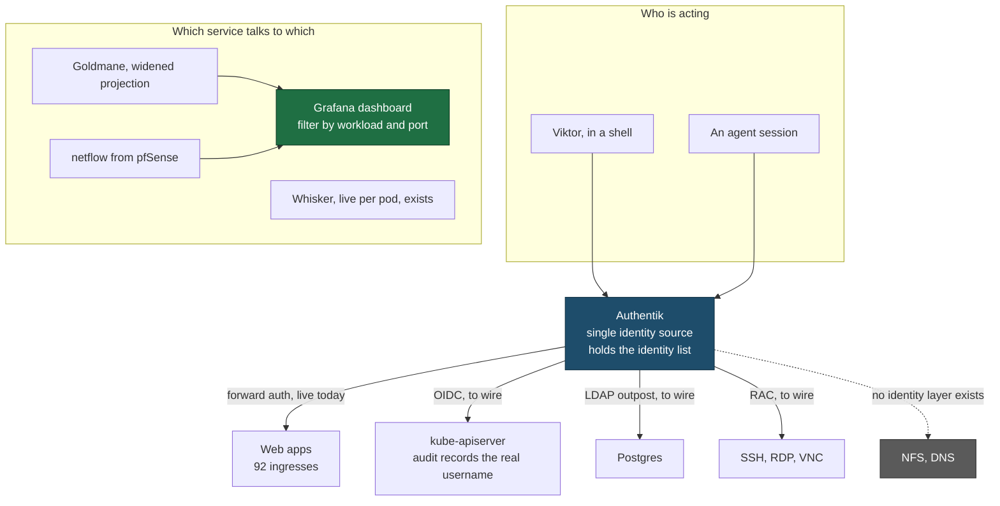

# Knowing who did what

Three questions we cannot answer today, and one capability we want to add.

1. Which service talks to which, including from the devvm.
2. Whether a request came from Viktor or from an agent.
3. What identity a request carries, rather than what we infer afterwards.
4. New: let an agent take on another user's identity to test a change.

Authentik becomes the single identity source. Each protocol integrates with it
natively rather than everything being proxied through it, because its proxy
provider speaks HTTP only.

```stats
447 | pods, 260 on the default SA
696 | namespace edges, 59 days
6 | columns in the durable flow table
0 | audited Kubernetes reads
```

## What we can attribute today

Measured on 2026-08-22 and 2026-09-01, not estimated.

| Actor or path | Attributable now | Source | Missing |
| --- | --- | --- | --- |
| Service to service, across namespaces | Partial | `goldmane_edges`, 696 edges since 2026-06-24 | Port, destination service, workload. No time series, only first and last seen |
| Service to service, same namespace | No | Whisker only, ~60 min | Dropped by the aggregator's `src == dst` rule |
| Host to host, host to internet | No | Nothing | Goldmane writes `-` for non workload ends, then the self edge rule deletes `('-','-')`. 98 src-dash + 140 dst-dash = 238, all dash rows, so zero survive |
| Cluster egress to the internet | Partial | Dash rows, largest are outbound | No peer address anywhere. Goldmane's proto has no IP field |
| HTTP on the 90 forward auth routers | Partial | `X-authentik-*`, unforgeable | Never recorded. CLF drops headers and only emits Referer and User-Agent |
| HTTP on the other 104 routers | Partial | Access log: client IP, router, backend, status | No principal at all |
| devvm human | Partial | sudo and ssh in Loki, Vault named tokens | auditd inactive, so non sudo commands leave no OS record |
| devvm agent | Partial | ADR-0025 session telemetry | No join key onto any request |
| devvm to kube-apiserver | Partial | Audit log stamps `credential-id` | One shared cluster-admin cert for every human, session and cron job |
| Any Kubernetes read | No | Nothing | 500 audit events over 6h are create, update, delete, patch. Zero get, list, watch. Secret reads recorded nowhere |

Two facts reframe the work. The audit log already discriminates by
`authentication.kubernetes.io/credential-id` on every event, so user versus
agent is a credential problem rather than a telemetry problem. And the fields
that would answer most of question 1 are already on Goldmane's wire, thrown away
at the adapter boundary.

## Shape



## Decisions

**The bar is attribution, and it must be complete.** Reconstruct who did what in
a cluster we trust. We are not defending against a principal lying about itself,
which is what makes self asserted markers acceptable and a service mesh
unnecessary.

**Each plane keeps its own principal.** The audit log keys on `credential-id`,
requests carry `X-authentik-username`, flows key on namespace and the widened
fields. Cross plane questions join on time and source address. No correlation id
threaded through every hop.

**Authentik is the single identity source, integrated per protocol.** Its proxy
provider is HTTP only, so kubectl, Postgres and SSH cannot be proxied through
it. They integrate natively instead. Every piece is free and inside a product we
already run.

| Surface | Mechanism | State |
| --- | --- | --- |
| Web apps | Proxy and forward auth | Live, 6 providers, 92 gated ingresses |
| Kubernetes | apiserver `--oidc-*` | Not wired. No `--oidc-*` flags on the apiserver today |
| Postgres | LDAP provider and PG `ldap` auth | No LDAP outpost |
| SSH, RDP, VNC | RAC provider, free and open source since Authentik 2025.2 | No RAC outpost. Endpoints also need a provider bump, see below |
| NFS, DNS | None short of Kerberos | Out of reach |

Teleport Community Edition was the alternative, free for personal use. It would
add per query database attribution and session recording that Authentik does not
give. We chose against it because four of five surfaces are reachable inside a
product already running, and Teleport for web apps would mean reaching 92
working ingresses a different way.

**Provenance comes from a per session credential.** At session start, mint a
short lived Kubernetes credential through the Vault engine already deployed,
named for the OS user, the actor kind and the session. The audit log then
answers who, human or agent, and which session, with no correlator. It is self
asserted, since an agent that wanted to hide could use Viktor's credential. That
is acceptable at this bar and worth stating plainly.

**On HTTP the session identity is client stamped, and the access log becomes
JSON.** CLF cannot emit an arbitrary header at all, so recording the principal
means changing format. Measure an hour of JSON volume before committing, and
port the two CLF anchored recording rules in the same change.

**Agents may impersonate any user, with a recorded reason.** Authentik has
impersonation built in, switched on globally, with `impersonation_require_reason`
defaulting to true. Measured on the live instance, which runs 2026.8.0 rather
than the 2026.2.4 this doc first claimed: it advertises `can_impersonate`
alongside `can_asn` and `can_geo_ip`, so no enterprise licence is needed for
impersonation, LDAP or RAC. An earlier finding still holds: it needs an authenticated
admin session rather than a bearer token. Both identities travel on an
impersonated request, the impersonated user so the app behaves correctly and the
acting agent so the audit trail keeps who really acted.

**The break glass principal becomes visible.** When the outpost returns 5xx, the
nginx fallback stamps `X-authentik-username: admin` from a static htpasswd, and
`X-Auth-Fallback` is not in `authResponseHeaders`. Backends and logs cannot tell
that principal from a real SSO admin. Adding the header to `authResponseHeaders`
fixes it, and the whole design rests on that header meaning something.

There is a second half to that, found while implementing and verified live. The
`strip-auth-headers` middleware blanks exactly the five `X-authentik-*` request
headers and not `X-Auth-Fallback`. Seven routes use it: `health/health-api`,
`tripit/tripit`, `tripit/tripit-api`, `tripit/tripit-app-api` and
`vpn-portal/vpn-portal-sub`, where it is the only anti spoof control, plus
`reverse-proxy/gw` and `reverse-proxy/idrac`, where it runs after forward auth.
So a client can send `X-Auth-Fallback` to the first five today and it arrives
untouched, while adding it to the strip list would delete the genuine marker on
the last two. Nothing reads the header yet, which is why this is a decision
rather than an incident, and it has to be settled before the header starts being
recorded.

**Flow coverage is Goldmane widened, plus netflow.** Persist workload, port,
destination service and endpoint type, all already on the wire. Stop deleting the
`('-','-')` class by testing endpoint type rather than string equality. Persist
per workload, not per pod, because pod names churn on every restart and Whisker
already serves live per pod drill down. Netflow from pfSense is planned as its
own piece of work, with an explicit ask before the firewall is touched.

**The dashboard is Grafana over that table.** Grafana runs with a Loki datasource
and nothing pointed at `goldmane_edges`. Add the datasource, then a view of all
traffic filterable by workload, namespace and port, with an unusual connections
panel. Unusual means a first seen edge, a workload using a port it never used,
or a namespace reaching the internet for the first time.

**Stray pods are an inventory question.** No traffic view answers it. Kyverno
already enforces `require-trusted-registries`, `deny-privileged-containers`,
`deny-host-namespaces` and `restrict-sys-admin`, so an untrusted or privileged
pod cannot be admitted. What does not exist is a reconciler comparing running
workloads against what Terraform declares.

## What we decided against

| Option | Why not |
| --- | --- |
| Client certificates as the platform mechanism | Only 126 of 696 edges touch Traefik, 18.1%. No Postgres, Redis, NFS, SMTP or DNS traffic does. The `traefik/mtls` TLSOption has been dangling for 196 days with no `ca-secret` |
| Service mesh or SPIFFE for identity on the wire | The only way to tag every connection, and unnecessary at attribution grade. ADR-0014 rejected it on measured grounds that still hold |
| Per service ServiceAccounts, now | 260 of 447 pods run as `default`, 84 distinct SAs. Goldmane carries no ServiceAccount field, so the identity cannot reach the flow record anyway |
| One correlation id threaded through every hop | Needs a wrapper on every client and app side logging changes, for cross plane questions we can usually answer by time and address |
| Authentik as a proxy for everything | Its proxy provider is HTTP only. kubectl auth and `exec`/`port-forward` streaming break behind forward auth |
| An IdP or WAF for the traffic dashboard | An IdP sees no pod to pod traffic. A WAF inspects HTTP content, which CrowdSec and Cloudflare already do, and produces no per pod view |

## Risks we accept

> [!WARNING]
> The impersonation decision is the sharpest thing in this design. It was taken
> with the consequence in view.

- **An agent identity that can impersonate any user can read every user's
  private data**, including family Immich libraries, mail and the finance apps. A
  prompt injection against that agent becomes exfiltration. Kept because
  reproducing a specific person's view is the point of the capability. Recorded
  reasons, Authentik's impersonation events and dual identity on the request are
  the controls. Two mitigations stay available if wanted later, restricting which
  groups are impersonable and requiring a human to approve each session.
- **Provenance is self asserted.** An agent running as Viktor's OS user holds
  whatever credential Viktor holds. Only separate OS users would make it an OS
  fact, and that costs the agent access to `~/code`, git credentials and
  `~/.claude`.
- **Authentik becomes the way into the cluster.** An Authentik outage then blocks
  kubectl. The existing shared cluster-admin certificate stays as a documented
  break glass, used in emergencies rather than daily.
- **NFS and DNS stay unattributed.** Neither protocol carries identity short of
  Kerberos. Technitium per client query logging closes the DNS half separately.

## Order of work

Cheapest first. The first item costs nothing.

| # | Step | Why here |
| --- | --- | --- |
| 0 | Open Whisker, which has run for 7d9h at `whisker.viktorbarzin.me` | Tells us which dashboard questions are already answered before we build panels |
| 1 | Add `X-Auth-Fallback` to `authResponseHeaders` | Smallest change, and the identity design depends on that header |
| 2 | Widen the aggregator projection, stop deleting the host class | Every field is already on the wire. One service, one migration |
| 3 | Postgres datasource and the Grafana dashboard | Turns the widened table into the view asked for |
| 4 | apiserver OIDC against Authentik, separate agent identity | Converts user versus agent into a recorded fact on the highest blast radius surface |
| 5 | Per session Vault credentials, JSON access log | Adds session granularity once per user identity exists |
| 6 | Declared versus running reconciler | Answers stray pods, which no traffic view can |
| 7 | LDAP outpost for Postgres, RAC for SSH | Extends identity to the remaining reachable protocols |
| 8 | Impersonation for agents | Last, because it is the most powerful and wants the audit trail already working |
| 9 | netflow from pfSense | Own piece of work. Needs an explicit ask before the firewall changes |

## Records

Amend ADR-0014 with two as built corrections. Host and internet flows are
collapsed to `-` and then deleted, not simply absent, which is a larger and
differently shaped hole than the ADR documents, and three docs repeat the wrong
version. The etcd constraint it cites has never been measured, because etcd is
not scraped at all. Its rejection of mesh, mTLS and SPIFFE stands.

Then a new ADR for per principal identity, which ADR-0014 never contemplated.

## Open questions

- What "unusual" should mean beyond first seen edges, once the widened table has
  a week of data.
- Whether `X-Auth-Fallback` should also be blanked by `strip-auth-headers`,
  closing spoofing on five routes at the cost of deleting the genuine marker on
  two others.
- RAC endpoints cannot be declared with the Authentik Terraform provider this
  repo pins. The 2026.8.0 API requires `auth_mode` on endpoint creation and
  provider 2024.12.1 has no such attribute, so the first SSH or RDP endpoint is
  either made by hand or waits on a provider bump.

Two questions this doc opened are now answered by measurement.

- Impersonation, LDAP and RAC need no enterprise licence. The live instance is
  2026.8.0 and advertises `can_impersonate`.
- JSON access log volume is not a constraint. Measured at 402 to 1,266 bytes a
  line raw, 3.15x the CLF line, 1.58x once compressed, so roughly 70 to 110 MB a
  day against a Loki volume sitting at 11.86 of 48.91 GiB.

One half of step 5 is still unbuilt. The JSON access log exists; the per session
Vault credential does not, and it wants scheduling rather than assuming it rode
along.
