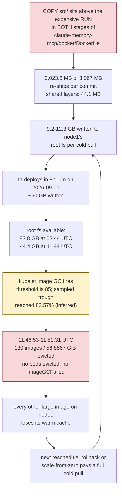
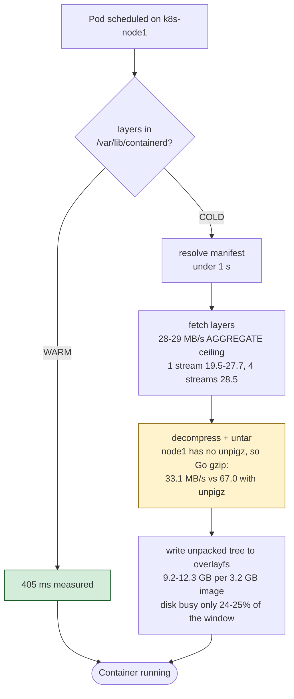
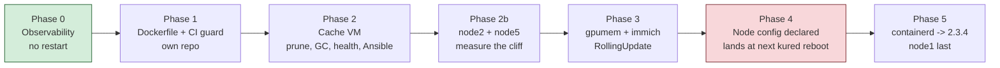

# Large-image handling on k8s-node1

**Status:** Phase 1 landed and verified 2026-09-02 (`d949a91`); Phases 0, 2, 2b, 3, 4 outstanding
**Date:** 2026-09-02
**Owner:** Viktor Barzin
**Origin:** "improve the boot time of images that have big image size, mostly GPU ones on node1"

Research behind this: a 13-agent measurement pass plus two blind challengers on
2026-09-01, three follow-up experiments, and a 6-round design interview. Every
number below was measured unless labelled otherwise. Findings the challengers
overturned are in §8 rather than deleted, so nobody re-proposes them.

---

## 1. What this does

The starting theory was that large images are slow to start because they are slow
to download, and that caching them on node1's disk would fix it. Measurement did
not support either half.

Caching is already in place twice over and it works. The same 3,216.9 MB image
pulled in **405 ms** warm and **6m24.561s** cold, on the same node on the same
day. containerd's store sits on node1's persistent root filesystem, so a reboot
costs no pull time at all. A LAN pull-through cache also already exists, wired
into every node's `certs.d` with upstream as a fallback host.

What recurs is disk, not seconds. One owned image re-ships 3,023.8 MB of its
3,067 MB on every commit, each cold pull writes 9.2-12.3 GB to node1, and on
2026-09-01 that filled the disk until kubelet discarded **130 images and
56.8567 GiB** of warm cache in one 4m38s pass. That eviction is what turns the
next reschedule into a cold pull.

So this plan ships fewer bytes, stops evicting the cache we have, and makes the
whole path measurable. It also picks up two things found along the way: node1
lacks `pigz`, and containerd versions have diverged past the point where three
nodes match the documented floor for the running kubelet.

## 2. How big the problem is

```stats
405 ms | warm pull, 3,216.9 MB image
6m24s | cold pull, same image
78 s/day | all 1-5 GB pulls on node1
56.86 GiB | cache evicted in one pass
3,023.8 MB | re-shipped per commit
2 of 35 | node1 pods a person waits on
```


| question | measured |
|---|---|
| 1-5 GB pull time on node1, 36.9 days | 2,898.408 s = 78 s/day |
| share on 2026-09-01 alone | 2,007.3 s = 69%, from 5 cold pulls |
| the other 35.9 days | 891.1 s, one real cold pull every ~7.2 days, 24.8 s/day |
| warm pull, same image | 405 ms |
| node1 pods with a pull in front of a person | 2 of 35 (immich-worker, immich-machine-learning) |
| pull cost of a node1 reboot | zero, the store is on the persistent root fs |
| worst single event | 130 images / 56.8567 GiB evicted in 4m38s |

Read this as a developer-experience and disk-stability problem. It bites on days
someone iterates on `claude-memory-mcp`, and its worst consequence is a cache
wipe nobody sees until the next reschedule.

## 3. The causal chain

Both challengers arrived at this independently, from opposite directions.



Every edge is measured except the ~50 GB (inferred from 5 pulls × 9.2-12.3 GB)
and the feedback edge (inferred; no instrument recorded a post-eviction cold
pull, which §9 covers).

`DiskPressure` flipping at 11:52:02 UTC is the same event, not a separate one.
The eviction manager ran 11:46:53-11:51:31 and the 5m0s
`evictionPressureTransitionPeriod` expiring accounts for the timestamp.

**The threshold crossing is inferred, not measured.** The eviction pass itself is confirmed — 131 journal lines, one
`eviction_manager: attempting to reclaim` plus 130 `Removing image to free
bytes`, read directly. What is not confirmed is *what tripped it*. The sampled
trough is 44,411,457,536 B available of 270,367,715,328 B, which is **83.57%
used**; crossing `imageGCHighThresholdPercent: 85` needs available at or below
40.56 GB, so the sampled minimum is **3.86 GB short of the threshold**. The
likely explanation is that a 30-second scrape interval missed a deeper dip while
a burst was writing 9-12 GB per pull, but that is a hypothesis. The kubelet
journal lines that would state the observed value against the threshold have
already rotated out of node1's volatile journal, which is itself the argument for
Phase 0. A second gap points the same way: available recovered 44.41 → 183.92 GB,
a 139.5 GB swing, while kubelet reported freeing 61.05 GB, leaving **78.5 GB
unaccounted** — plausibly released overlayfs snapshots kubelet sizes differently,
but unverified.

None of this changes what to do. The Dockerfile is still the only lever on the
front of the chain, and shipping fewer bytes reduces the pressure whichever
threshold fired.

## 4. Where the cold-pull time actually goes



Stage attribution for a median cold pull is **not settled**, and two earlier
attributions were disproved (§8). What survives: the network delivered 9.4 MB/s
against a 19.5-28.5 MB/s capability, the disk sat 75% idle, and one core was
saturated for the pull's whole duration. Installing `pigz` addresses the
saturated core, and roughly 190 of the 231.8 user CPU-seconds still have no
account. §9 names the experiment.

## 5. Decisions

| area | decision |
|---|---|
| Target | Disk stability and iteration cost, not pull latency |
| Observability | First. Full `kubelet_image_pull_duration_seconds` buckets, kubelet + containerd journals to Loki, alert on the GC pass |
| Dockerfile | Reorder both stages so source-dependent layers sit last; keep the exporter split for CI wall time; `touch -d @0` the export; CI guard failing past ~200 MB on a source-only commit |
| Cache VM | Keep nginx for request collapsing. Prune ~20 GB by explicit list, re-sequence garbage-collect to daily, healthcheck a real blob, add node-exporter, declare it in Ansible. Plus measure node2 and node5, which are nearer the GC cliff than node1 |
| node config | Absorb the erased post-join tune **except** `systemReserved`/`kubeReserved`/`evictionSoft` (they zero node2's headroom), plus `pigz`, `serializeImagePulls: true`, a finite `imageMaximumGCAge` and `discard_unpacked_layers = true`. One node at a time, each with a deliberate restart, because kured reboots nothing (`code-yr2i`) |
| Playbook | Extend `k8s-node-tuning.yml` and widen its stated scope. Add the cache VM to inventory; config in git, secrets from Vault |
| GPU memory | Unchanged. claude-memory's 5,000 MiB is a measured declaration, not slack (§7) |
| containerd | Converge on 2.3.4 LTS. node4, node5, then node2, node3, then master, then node1 |
| Not doing | Lazy loading, zstd, parallel pulls, moving node1's disk, yt-highlights trim, the immich `RollingUpdate` (§7) |

## 6. Phases



Each phase lands to master when its own verification passes. Phase 0 goes first
so later phases have a before-and-after; without it we would be claiming a
two-thirds reduction we cannot show.

### Phase 0 — Observability

`kubelet_image_pull_duration_seconds` is already exposed on every kubelet and is
excluded twice in `stacks/monitoring/.../prometheus_chart_values.tpl`: the
`_bucket` series are named in a drop rule, and the job then applies a `keep`
whitelist of 12 metrics that the metric is not in. Removing it from the drop rule
and adding it to the whitelist restores roughly 300-400 series across 6 nodes,
which buys percentiles and the per-size-class breakdown. The label is
`image_size_in_bytes` with bucketed string values (`1GB-5GB`, `100MB-500MB`, …),
not `image_size_in_gb`. The whitelist was a
deliberate cardinality decision and its comment records the reasoning, so this
widens it narrowly rather than removing it.

Also: ship `kubelet.service` and `containerd.service` journals to Loki, and add
an alert on the image-GC pass.

What is gone is narrower than it first appears. The **aggregate is still
live**: node1's kubelet has not restarted since 2026-07-27 02:08:39 EEST (which
is both the 36.9-day window's origin and the v1.35.7 upgrade behind the erasures
in Phase 3), and `kubelet_image_pull_duration_seconds_sum` is a cumulative
counter, so `2898.4080000000004` still re-reads off the live kubelet today —
meaning no new 1-5 GB pull has landed since. Prometheus holds the disk half at
26-week retention. What **has** rotated out of node1's `Storage=volatile`
journal is the per-event detail: the 5 cold pulls of 2026-09-01, the 11 deploys
in 8h10m, and the 130-image eviction. Those rest on in-session notes until this
phase ships the journals, which is the argument for doing it first.

Two file-location traps the repo docs flag. Every Prometheus alert here is
**inline in `prometheus_chart_values.tpl`** — there is no `alerting_rules.yml`
file, despite the `groups:` keys reading like one. Loki-ruler alerts live
separately in `stacks/monitoring/modules/monitoring/loki.tf`, and the chart key
there is `loki.rulerConfig`; plain `loki.ruler` is silently ignored, which is why
no Loki-ruler alert reached Alertmanager at all until that rename. Since the
GC-pass signal is a journal line rather than a metric, it belongs on the Loki
side, and an absence-style threshold there needs `or vector(0)` or it goes silent
at exactly zero.

Verification: query the histogram in Prometheus and read the GC alert firing
against the known 2026-09-01 event shape.

### Phase 1 — Dockerfile and CI guard

`claude-memory-mcp/docker/Dockerfile` has the same ordering issue in both stages:
`COPY src/ src/` at line 21 above the ONNX export at line 26, and at line 35
above the 2,094.6 MB CUDA and onnxruntime install at lines 52-54.

The fix is layer order, not stage splitting. BuildKit re-executes every layer
above a cache miss, and re-executing a `COPY` re-tars its content with a fresh
mtime, so a `COPY --from` above a source-dependent layer churns even when its
producer stage was fully `CACHED`. Verified on a 4-layer replica, twice
independently:

| `COPY --from` position | model layer across a source change |
|---|---|
| below the source-dependent layer | `31e9cea1a110` → `011490f1acfb`, churns |
| above it | `6102d03f7f61` → `6102d03f7f61`, holds |

Target order, source-dependent layers last:

1. `COPY pyproject.toml README.md alembic.ini`
2. `RUN pip install` third-party deps + `onnxruntime-gpu` — 2,094.6 MB, source-independent
3. `COPY --from=exporter /export /opt/onnx-embed` — 1,076.0 MB, source-independent
4. `RUN chmod -R a+rX /opt/onnx-embed` — measured 0.0 MB, no copy-up
5. `COPY src/`, `COPY migrations/`, `RUN pip install --no-deps .`
6. gate, `useradd`

Keep the exporter stage split, for CI wall time rather than bytes: the export
step measured 1,686 s and the gate 572 s, so keeping a source commit from
re-running the export saves about 38 minutes per commit. The split also makes the
fidelity gate stricter, scoring the bytes that ship rather than a staged copy, at
cosine 1.00000 on all five probes.

One addition the research made necessary. CI uses `cache-to: type=gha,mode=max`,
the GHA cache is 10 GB per repo with LRU eviction, and these intermediates
already exceed it, so the exporter is evicted periodically and the 1,076.0 MB
model layer churns on mtimes alone. `find /export -exec touch -d @0 {} +` at the
end of the export step closes that. It is necessary; whether it is sufficient
depends on the ONNX export being byte-reproducible, which is untested (§9).

The build guard replaces the fix with a property: compare layer digests against
the previous tag and fail when a commit touching only `src/` re-ships more than
~200 MB. It also reports the delta on every build, which is how the projected
result below gets verified for real.

Expected: from 3,023.8 MB to single-digit MB per source-only commit. **Projected,
not measured** — the mechanism is verified but the final arrangement was not
built end to end. The guard measures it on the first real build.

### Phase 2 — Cache VM

The VM sits at 658 MB free on a 63 GB disk, and its failure mode is self-masking:
`/v2/` and `/healthz` both answer 200 because both are storage-free probes, while
manifest and blob requests return 500 under ENOSPC. Nothing alerted for 45 days,
partly because of the probe shape and mostly because the VM is not scraped by
Prometheus at all, so the existing `NodeFilesystemFull` alert never had a chance.

| consumer | size | reclaimable |
|---|---|---|
| `/opt/registry`, 5 upstream mirrors | 33 G | weekly GC only |
| docker images | 12.25 G | 8.874 G |
| buildx cache | 11.55 G | 11.55 G |
| nginx cache volume | 5.28 G | 0 |

The reclaimable ~20 GB is residue from the private registry decommissioned
2026-05-07, before builds moved to GitHub Actions. Actions:

- Prune unused images and the buildx cache. Leaves the 3 running images and the 33 GB of mirror data untouched.
- Move `garbage-collect` from Sunday-only to daily. `cleanup-tags.sh` already deletes tags daily and its own log says "Run garbage-collect to reclaim space", so Monday to Saturday the references go and the blobs stay.
- Point `/healthz` at a real blob rather than `/v2/`.
- Add node-exporter so the VM joins `NodeFilesystemFull`.
- Add the VM to `playbooks/inventory.ini` and declare `/opt/registry` (compose file, 6 registry configs, `nginx.conf`, the scripts, the crontab). `htpasswd` and `tls/` come from Vault at apply time; no Vault path exists yet, so creating it is part of this phase.

Keep the nginx tier. It is there for request collapsing (`proxy_cache_lock on`,
5m lock timeout), which folds concurrent requests for one blob into a single
upstream fetch. Its low hit ratio is `proxy_cache_min_uses 2` behaving as
configured, not evidence the tier is idle.

**Do not use a bare `docker image prune -a`.** Only 3 of the 32 images on that VM
are in use, so `-a` would also delete `ghcr.io/viktorbarzin/infra-ci:latest`
(1.11 GB) — the break-glass CI image, whose own recovery path is a `ghcr`
pull-and-save onto this same VM. Prune by explicit list, sparing that tag.

**And re-sequence before moving garbage-collect to daily.** The existing crontab
already runs `fix-broken-blobs.sh` six days a week and restarts the registry
containers at 02:35, with its own comment recording that the registry otherwise
"serves 200 with 0 bytes for blobs that were GC-ed". Registry garbage-collect is
also documented upstream as unsafe to run concurrently with pushes. Running it
daily without keeping the restart strictly after it risks making truncated-blob
incidents **more** frequent, not fewer. Order: cleanup-tags → garbage-collect →
fix-broken-blobs → restart.

Verification: a real manifest fetch returning 200, `df` showing the reclaimed
space, the VM appearing in Prometheus, and `--check` a no-op on a second run.

### Phase 2b — node2 and node5 are closer to the cliff than node1

Folded in once measured, because it is the same failure as §3 on different nodes.
Live root-fs usage against the live `imageGCHighThresholdPercent: 85`:

| node | usage | headroom to the threshold |
|---|---|---|
| k8s-master | 44.2% | — |
| **k8s-node1** | **35.5%** | the node this plan was written about |
| k8s-node3 | 46.1% | — |
| k8s-node4 | 66.1% | — |
| **k8s-node2** | **80.4%** | 4.6 points |
| **k8s-node5** | **83.3%** | **1.7 points** |

node5 is within two points of a natural mass eviction of exactly the kind that
started this investigation, and nothing watches for it — there is no alert on an
image-GC pass anywhere today, which is what Phase 0 adds. node1, meanwhile, sits
at 35.5% because its own cliff already fired.

This phase is therefore: find what is consuming node2 and node5, and decide
whether a finite `imageMaximumGCAge` (Phase 3) is sufficient there or whether
something else is accumulating. It is deliberately scoped as *measure and
decide*, not *fix*, because the cause is not yet known and may not be images at
all.

### Phase 3 — Node config declared

This phase grew once the repo's own docs were read, and it now closes a
documented known issue rather than deleting its script.

`modules/create-template-vm/k8s-node-post-join-tune.sh` applied **once**, as a
cloud-init runcmd after `kubeadm join`, and nothing reconciled it afterwards.
`kubeadm upgrade node` rewrites `/var/lib/kubelet/config.yaml` from the
cluster-wide `kube-system/kubelet-config` ConfigMap, which does not carry these
keys, so the v1.35.7 upgrade on 2026-07-26/27 erased them from all six nodes.
`docs/known-issues.md` records the durable fix as either moving the keys into
that ConfigMap or re-running the tune from the upgrade pipeline, and says neither
is built. An Ansible playbook that reconciles on every run is a third option,
and it is the one this phase takes.

Extend `playbooks/k8s-node-tuning.yml`, whose header currently scopes it to
kernel sysctls, and widen that stated scope. It declares:

- **`shutdownGracePeriodByPodPriority` and `memorySwap: LimitedSwap`**, restored from the erased set. Live `configz` on every node reads `shutdownGracePeriod: 0s` with `shutdownGracePeriodByPodPriority` **absent**, and the script declares the full priority ladder at lines 81-90. This is the half tied to P1 bead `code-xgcg` ("no working graceful shutdown on power loss"), and it costs no capacity, so `code-xgcg` should be updated with what lands.
- **NOT `systemReserved`, `kubeReserved` or `evictionSoft`.** These three carve roughly 1,424 MiB out of every node's allocatable, and node2 has only ~1,455 MiB of schedulable headroom today (33,544,638,464 B allocatable against 32,019,316,736 B of running requests). Applying them takes node2 to roughly zero: nothing is evicted, but nothing can land there on the next reschedule either, and `PodStuckPending` follows. That is a capacity exercise with its own headroom audit, not a line in an image-size plan. Filed separately, with the arithmetic, so the rest of the erased set can land now.
- **`serializeImagePulls: true`, overriding the script**, which asked for `false` with `maxParallelImagePulls: 50`. 50 is wrong for this storage, and the measured gain is under 1.5x regardless because 28-29 MB/s is an aggregate ceiling containerd's own 5 streams already reach. `maxParallelImagePulls` is therefore not declared at all. The script is then deleted as **superseded**, not as a trap.
- **Not the image-GC thresholds.** An earlier draft declared `imageGCHighThresholdPercent: 70` / `Low: 60` as a "restoration", on the basis that `cloud_init.yaml` sets them and the upgrade erased them. That is wrong: a repo-wide grep for `imageGCHigh`/`imageGCLow`/`ThresholdPercent` outside `docs/` returns **zero matches**, so nothing in this repo has ever set them and live 85/80 is the upstream kubelet default. `.claude/CLAUDE.md` records an intent the code never carried. Lowering to 70 would be a genuinely new behaviour change, firing GC at 81.1 GB available instead of 40.6 GB on a 270.4 GB filesystem, and this plan's own §7 already argues that the threshold is not the knob that matches the cause — `imageMaximumGCAge` is. So it is out of scope here and belongs in its own decision if anyone wants it. Worth correcting `.claude/CLAUDE.md` separately.
- **A finite `imageMaximumGCAge`**, replacing `0s`. Live `configz` confirms `0s` is genuine here (unlike `imageMinimumGCAge`, whose on-disk `0s` resolves to the 2m default), so age-based collection really is disabled and unreferenced tags accumulate until the threshold discards them together.
- **`discard_unpacked_layers = true`** in containerd, worth ~23 GB of steady-state space on node1. Not a latency lever (§8), but the restart is already being spent and disk is what this plan targets.
- **`pigz` on node1, node4, node5.** containerd shells out to `unpigz` when it finds it and falls back to Go's decoder otherwise. Measured on a real 789.685 MB layer, one core: unpigz 67.0 MB/s, GNU gunzip 59.2, Go `compress/gzip` 33.1. node1's containerd PATH includes `/usr/bin`, and detection happens once at init, so it takes effect at the batched restart. Roughly 28-33 seconds off a 341-second cold pull.

Nothing here restarts kubelet or containerd. The config is written; something
else has to restart the kubelet for it to take effect.

**That something is not kured, and this is a correction to an earlier draft of
this plan.** kured has rebooted no node in the whole retained window, for two
independent reasons, both measured 2026-09-02 and filed as `code-yr2i`:

- **node1's gate is permanently closed by the GPU mitigation.** kured reboots only on `/var/run/gated-reboot-required`; the sentinel gate creates that only when `/var/run/reboot-required` exists; unattended-upgrades writes that only when it installs a kernel or libc. node1 holds six `linux-*` packages under the 26.04-userspace / 24.04-kernel GRUB pin, so it can never signal that a reboot is needed. Verified: neither file exists on node1, `apt-mark showhold` lists six `linux-*` entries, uptime 46 days, and its kured pod logs "Reboot not required" on every hourly tick. The mitigation that keeps the GPU working is the thing that closes the gate, so this is by construction rather than by accident.
- **The nodes whose gate IS open are halted by kured's own alert filter.** `alertFilterRegexp` in `stacks/kured/main.tf:103` ignores only `^(Watchdog|RebootRequired|KuredNodeWasNotDrained|InfoInhibitor|KernelOOMKiller)$`, against 12 alerts firing at the time of writing and a standing floor of five to eight. kured logs `Reboot blocked: 6 active alerts`, `7 active alerts`, `8 active alerts` on successive ticks. node2 has been pending-reboot since 2026-07-18.

Consequences for this phase, all of which change how it lands:

- **Each node needs a deliberate, human-driven kubelet restart or reboot.** Drop the "applies at the next kured reboot" assumption entirely.
- **Roll it one node at a time** with `--limit`. A bad combination of new kubelet keys stops kubelet from starting, and a node whose kubelet will not come up is discovered only at its own restart, with console-only recovery.
- **Give node1 its own restart for this phase, separate from Phase 4.** Otherwise every Phase 3 key and containerd 2.3 come up in the same boot and a bad boot has two candidate causes.
- A larger issue sits underneath and is out of scope here: kernel and libc security updates are not being taken on four nodes. `code-yr2i` carries the decision on whether to widen the alert filter or accept human-driven reboots.

One caution: on node1, `apt install` resolves against 26.04 suites (§4). Simulate
with `-s` and confirm nothing but `pigz` and its dependencies would move.

Verification is `scripts/check-node-kubelet-tune`, which already exists and reads
each kubelet's live `/configz` rather than the file on disk (exit 1 = drift,
2 = unreachable).

### Phase 4 — containerd convergence to 2.3.4

containerd 1.7 reaches EOL this month, and three nodes are below the documented
floor for the running kubelet, not simply behind it. The 1.7 row is narrower
still than the date suggests: committer support ended **2026-03-10**, and the
extension to September is footnoted as "focused on usage with Kubernetes 1.32,
1.31, and 1.30 via Google Kubernetes Engine. Changes may not be accepted if they
are not needed for this usage." Three nodes on 1.7 under kubelet 1.35 sit
outside that scope today.

| node | OS | containerd | source pkg | candidate | vs 1.35 floor (1.7.28+) |
|---|---|---|---|---|---|
| master | 26.04 | 2.2.2 | Ubuntu | 2.2.2-0ubuntu1.1 | ok |
| node1 (GPU) | 26.04, os-release reports 24.04 | 1.7.24 | Ubuntu | 2.2.2-0ubuntu1.1 | below |
| node2 | 26.04 | 1.7.27 | Docker | none | below |
| node3 | 26.04 | 1.7.27 | Docker | none | below |
| node4 | 24.04 | 2.2.4 | Docker | 2.3.4 | ok |
| node5 | 24.04 | 2.2.6 | Docker | 2.3.4 | ok |

2.3 is the target, and the reasoning carries one tension worth stating.
containerd supports sequential minor upgrades plus direct hops between sequential
LTS releases, so 1.7 → 2.3 is supported and 1.7 → 2.2 is not, which settles it
for node1, node2 and node3. For node4 and node5, 2.2 → 2.3 is a sequential minor,
also supported. 2.3 is LTS with an EOL of 2028-04-30, against 1.7's EOL this
month; 2.2 is not an LTS branch.

The tension: the Kubernetes support matrix row for 1.35 reads `2.2.0+, 2.1.5+,
1.7.28+` and does not name 2.3.x, which appears first in the 1.36 row as
`2.3.0+`. 2.3.0 shipped after the 1.35 row was written, and containerd commits to
"always a supported version of containerd for every supported version of
Kubernetes", so reading 2.3.x as fine for kubelet 1.35 is reasonable. It remains
an inference rather than a cited row (§9). Choosing 2.2.x instead would satisfy
the letter of that row while making the hop from 1.7 unsupported and landing on a
non-LTS branch, which is the worse trade.

Order, which follows from what each node can currently reach:

1. **node4, node5** — already on 2.2.x with 2.3.4 available from Docker's repo today.
2. **node2, node3** — a two-line repo edit, not a package-mechanism decision. Their `download.docker.com` source reads `Enabled: no` / `Suites: jammy`, but Docker **does** publish for resolute (`2.3.4-1~ubuntu.26.04~resolute` is in the live index, deps `libc6 >= 2.38`, `libseccomp2 >= 2.6.0`, both satisfied). Set `Enabled: yes` and `Suites: resolute`. That belongs in the playbook keyed off `ansible_distribution_release`, which fixes all four stale repo files at once. Ubuntu's own archive also offers `containerd 2.2.2-0ubuntu1.1` on both today, so two routes exist.
3. **master** — control plane, on Ubuntu's package rather than Docker's, so it needs a source decision as well as a version bump. This is the same decision as step 2's, since node2 and node3 can reach Ubuntu's `containerd 2.2.2-0ubuntu1.1` today on the same OS master already runs; the two steps probably merge once that choice is made.
4. **node1 last.** It carries the GPU and 35 pods including Vault, Immich, Frigate and claude-memory.

Constraints that shape this phase:

- The `containerd`, `containerd.io` and `runc` apt holds sit in `modules/create-template-vm/cloud_init.yaml` at **lines 153-154** (the blacklist at 117-151; 69-107 is unrelated `write_files`), placed after a 26-hour outage in March 2026. They are **not** uniform: node5 holds only `kubeadm kubectl kubelet`, so it has no runtime hold to lift, while the other five do. Lifting them is deliberate and temporary, per the existing cross-LTS pattern of pinning at `Pin-Priority: 1001` then unholding for the duration.
- The `containerd.io` deb bundles `runc` at containerd's pinned version, so the runc spread (1.1.12 on node1 up to 1.4.0 on master) partly resolves itself by moving master and node1 onto Docker's package.
- `dpkg -V containerd.io` is clean on only **2 of 6** nodes; node2-5 report `??5?????? c /etc/containerd/config.toml`, so the file is locally modified against the package everywhere. A conffile prompt will interrupt a non-interactive apt transaction — pass `-o Dpkg::Options::=--force-confold`.
- **An apt transaction on node1 could restore `/etc/os-release` and take the GPU to zero.** `/etc/os-release` is normally a symlink to `/usr/lib/os-release` owned by `base-files`; on node1 it was deliberately replaced with a regular file carrying Noble content (backup at `/etc/os-release.bak-pre-spoof-2026-05-17`). A `base-files` upgrade restoring the symlink makes NFD relabel the node `VERSION_ID=26.04`, the GPU operator computes a driver tag `…-ubuntu26.04` that does not exist on `nvcr.io`, and `nvidia.com/gpu` goes 100 → 0 with seven GPU tenants Pending. That is the May 2026 SEV-3 recurring, on the node that also holds the active Vault. Mitigations: never `full-upgrade`/`dist-upgrade` on node1, always `apt-get install <exact package>`; simulate with `-s` and confirm `base-files` is not in the transaction; checksum `/etc/os-release` before and after; and re-check `nvidia.com/gpu` allocatable as the first verification step after the node returns. A simulated `pigz` install on node1 was checked and moves only `pigz` ("0 upgraded, 1 newly installed, 0 to remove"), so Phase 3 is clear; this applies to Phase 4.
- **node1's state is a live mitigation, not drift.** It runs 26.04 userspace, boots 24.04's `6.8.0-117-generic` via a GRUB pin with `linux-*` held, and has `/etc/os-release` deliberately replaced with Noble content so NFD makes the GPU operator select a driver tag that exists. NVIDIA publishes zero `ubuntu26.04` driver images. Nothing in this phase may touch the kernel, `/etc/os-release`, the `linux-*` holds, or the gpu-operator pin. Background: `docs/post-mortems/2026-05-17-gpu-driver-ubuntu2604-mismatch.md`, `docs/known-issues.md`, bead `code-8vr0`.
- **node1's `config.toml` must be migrated to v3 in the same window as the binary, or containerd will not start.** The behaviour is version-specific. `LoadConfigWithPlugins` refuses a drop-in whose version exceeds the root config's: `if config.Version > rootConfigVersion { return fmt.Errorf("drop-in config version %d higher than root config version %d", …) }`. That check is **absent at v2.2.6** (the function does not exist yet) and **absent on `main`** (reverted 2026-08-11, commit `a8ed54668`, no stated reason), but present at **v2.3.4** around line 331, which is the version being installed. Meanwhile the nvidia toolkit keys its drop-in's version off `containerd config dump`, i.e. off the **binary**: node1 dumps `version = 2` today, node4 and node5 dump `version = 3` (verified live). So upgrading node1's binary while `/etc/containerd/config.toml` still says `version = 2` gives the toolkit's next reconcile a v3 drop-in against a v2 root, and the toolkit restarts containerd itself. Migrate the root config first, in the same transaction. `enable_cdi` is a separate and smaller matter: deprecated at v2.2 with removal targeted at v2.4, so it parses today and through the next minor.
- **Whether the image store survives is an open question.** The sentence "Container root file systems will be maintained on upgrade" sits *inside* RELEASES.md's **"Not Covered"** section, whose preceding lines read: "anything not mentioned in this document is not covered by the stability guidelines and may change in any release. Explicitly, this pertains to this non-exhaustive list of components: File System layout / Storage formats / **Snapshot formats**. Between upgrades of subsequent, _minor_ versions, we may migrate these formats." The maintained-on-upgrade promise is about **container** root filesystems, not about the content store or snapshotter format holding cached image layers. node1's 23 GB content store and 50 GB of overlayfs snapshots are precisely what that section excludes. There is also no in-fleet precedent: node4 and node5 show `<none>` as the prior version in `dpkg.log`, so both were *built* on 2.2.4 rather than upgraded from 1.7, and node5's 2.2.4 → 2.2.6 only demonstrates patch-level safety. Mitigation: run node4 or node5 first, since 2.2 → 2.3 is the "subsequent minor" case the document describes and neither carries a GPU, then inspect the content store either side. Take a Proxmox snapshot per node regardless. If the store does not survive, node1's step forces a 73 GB cold re-pull through a cache VM currently at 100% full, which is the outcome §3 describes, and Phase 4's scope changes.

The per-node mechanics reuse the documented cross-LTS pattern: Proxmox snapshot,
drain, pin and unhold, upgrade, migrate config, reboot, verify, re-hold,
uncordon, delete snapshot and `qm unlock` immediately. That sequence stays a
runbook step rather than moving into the playbook, because it needs a human
watching a control plane and a GPU node.

## 6b. Risks, from the adversarial pass

Two blind challengers attacked the plan. What survived, worst first. Everything
here is already reflected in the phases above; this is the summary a reviewer
wants without reading them.

| phase | what breaks | likelihood | blast radius | detection | reversible |
|---|---|---|---|---|---|
| 4 | An apt transaction restores `/etc/os-release` on node1, NFD flips to 26.04, the driver tag 404s, `nvidia.com/gpu` goes 100 → 0 | medium, depends on the apt verb | severe. Seven GPU tenants Pending on the only GPU node, which also holds the active Vault | 10+ min, and Phase 4's own reboot masks it | by hand, on a node with no GPU |
| 4 | A `version = 2` root config under a v3/v4 drop-in. containerd 2.3.x refuses it and does not start | medium-high if the config is not migrated in the same transaction | node1 runtime dead, 35 pods down, no `kubectl exec` to fix it | immediate | console only |
| 4 | The content store does not survive 1.7 → 2.3, forcing a 73 GB cold re-pull through a cache VM at 100% full | unknown, §9 q1 | a full cold re-pull of node1's images, the outcome §3 describes | at reboot | slow |
| 4 | Draining node1 evicts the active Vault leader | certain on drain | a write outage during leader election. Not quorum loss: 3 replicas, PDB allows 1 | seconds | self-heals |
| 3 | An invalid combination of new kubelet keys stops kubelet starting | low-medium | a node with no kubelet, found at its own reboot | at reboot | console only |
| 3 | Config written but never applied, because kured reboots nothing | **CONFIRMED**, not a risk | silent. Verification unachievable without a deliberate restart | never, by construction | n/a |
| 2 | `docker image prune -a` deletes the break-glass `infra-ci:latest`, whose recovery path needs this same full VM | high if `-a` is used | break-glass CI artefact gone | only when break-glass is needed | yes, re-pull |
| 2 | Daily garbage-collect without re-sequencing the restart makes truncated blobs more frequent | high | intermittent `ErrImagePull` cluster-wide | hours to days | yes |
| 1 | The reorder shifts dependency resolution and onnxruntime silently falls back to CPU | low, and guarded | recall latency regresses | the build-time `ort.preload_dlls()` + `pip check` guard | yes |

Three things the challengers examined and cleared: draining node1 does not
threaten CNPG quorum (its PDBs show `disruptionsAllowed=0` by design and drains
still succeed), nothing on node1 is mis-pinned, and only two tiny images use
`imagePullPolicy: Always`.

## 7. What we are not doing, and why

| rejected | reason |
|---|---|
| `serializeImagePulls: false` + `maxParallelImagePulls: N` | 28-29 MB/s is an aggregate ceiling, not per-stream: 1 stream 19.5-27.7, 4 streams 28.5. containerd already runs 5 concurrent downloads within one image. `imagePullSessionsCount` was 1 on all five real pulls, so serialisation contributed no queue wait. |
| zstd layers | Measured under 3% off a 341 s pull on decode. The sample compressed only 0.7% smaller because its payload is already compressed, so the transfer-bytes argument is untested and probably small here. |
| Lazy loading (stargz, SOCI, Nydus) | The mechanism fits better than expected: measured access density 7.7% immich-ml, 22.8% frigate, 19.8% neko against an 80% break-even. It fails on operations. 195 of 249 cluster images are third-party, the only writable registry is Forgejo, and 263 workloads carry keel or diun annotations a converted mirror drops out of auto-update. The disqualifier is availability: today a registry outage cannot touch a running container, and under lazy loading a first-touch page fault hours later returns EIO to a live NVR. |
| Raising `imageGCHighThresholdPercent` | Delays the cliff without stopping the accumulation. `imageMaximumGCAge` is the knob that matches the cause. |
| Removing the nginx tier | It provides request collapsing, which is independent of hit ratio. |
| Pre-pull DaemonSet or cache-warming CronJob | A static DaemonSet references a fixed tag, so it cannot pre-pull the tag about to be deployed, and keel's tag walk already fails on 429s. |
| Moving node1's containerd store to SSD | Attacks a stage whose share is unverified, and bead `code-oflt`'s etcd move should come first. |
| yt-highlights CUDA trim | ~1,075 MB of disk, no latency effect while it sits Sablier-parked at 0 replicas. Needs a real load test; filed separately. |
| Cutting claude-memory's `gpumem` from 5,000 MiB | Withdrawn. `gpu_pod_memory_used_bytes` is **per-process**, and this pod runs several, so reading one series gave 3,218 MiB when the pod's actual sum is **7,314 MiB live and 7,416 MiB over 7 days**. 3,218 turns out to be the 6-hour *minimum*. The service is therefore already **2,314 MiB over its current 5,000 declaration**, `gpu-vram-watchdog` is armed (`DRY_RUN=false`, `FLOOR_MIB=1536`) and logs it every 30s as "over budget … but nothing is blocked -> allowing the burst", and `MemoryRecallLatencyHigh` is firing today. Declaring 3,600 would have put it 3,714 MiB over, making it the largest offender the watchdog sees. **Always `sum()` a per-process VRAM metric before reading it as a pod total.** The kept 5,000 is also short, though closer than 3,600; it was measured against an earlier pod generation. Right-sizing it upward is its own change, and until then the filed immich rollout must stay filed. |
| immich-machine-learning `Recreate` → `RollingUpdate(maxSurge=1)` | Would remove a 2m03s pull from user-visible ML downtime on every immich bump, but needs 2,500 MiB of surge against 1,316 MiB free, and the row above removes the only place that headroom looked available. **Filed rather than done**, with the measurement attached, so the next attempt starts from why it is blocked. |
| Deleting `k8s-node-post-join-tune.sh` as a trap | It is not dead code. Its settings were erased by `kubeadm upgrade node` during the v1.35.7 upgrade, and they include `shutdownGracePeriodByPodPriority`, tied to P1 bead `code-xgcg`. Phase 3 absorbs the set into the playbook and deletes the script as **superseded** instead. |
| A second GPU node, new hardware, an image-preload controller | Not justified by 78 s/day. Nothing in this plan needs new spend. |

## 8. Corrections register

Claims that earlier passes of this analysis asserted and later work disproved.
None of the left column should appear in a plan or a follow-up.

| claim | status | what survives |
|---|---|---|
| "Disk write is ~48% of a ~290 s pull, network 35%" | disproved | The disk was busy 24-25% of two median pulls, achieving 87-93 MB/s while busy. The 62-66 MB/s behind it came from `dd conv=fsync`, a path containerd does not use. |
| "A real pull re-reads the blob at 14 MB/s, contending with the unpack write" | disproved | Reads were 0.0204 and 0.0226 GB against 9.2-9.3 GB written. The page cache serves it. The 14 MB/s came from `dd iflag=direct`. |
| "node1 dd 1 GiB direct read = 147 MB/s" | corrected | That measures the QEMU throttle. `qm config 201` sets `mbps_rd=150`. |
| "`discard_unpacked_layers=false` causes 3.2x writes; flipping it saves ~45 s" | disproved | The flag deletes the blob after unpack. Pull-time writes are unchanged. Its value is ~23 GB of steady-state space. |
| "Cold node1 goes from ~43 min to ~14 min with `maxParallelImagePulls=3`" | disproved | Aggregate, not per-stream, ceiling. |
| "The broken cache is the root cause, ~3x on wall-clock" | overstated | It fails in 0.445-0.466 s and containerd falls back, so ~5 s across 12 layers. Fix it because it served a truncated blob and caused a real `ErrImagePull`. |
| "Both fat layers differ in uncompressed `diff_id`, so the content changed" | disproved | `diff_id` hashes the tar and tar headers carry mtime. A producer emitting a fixed string still yielded a different digest across builds. |
| "Splitting the exporter stage takes new bytes to tens of MB" | disproved | The split alone measured 3,170.7 MB per source commit against a 3,023.8 MB baseline, slightly worse. Layer order is the lever. |
| "containerd's Go gzip may be several times slower than GNU gzip" | disproved | 1.78x, stable across two blobs. And containerd prefers `unpigz` where present, which is faster than GNU gunzip. |
| "Five of six containerd binaries are owned by no package, hand-dropped" | disproved | All six are dpkg-owned, `dpkg -V` clean. The divergence is two source packages across two OS releases plus deliberate apt holds. |
| "`max_concurrent_downloads` drifted 3/5 from a non-idempotent script" | disproved | Two different plugins on one node: `io.containerd.cri.v1.images` = 5, `io.containerd.transfer.v1.local` = 3. |
| "node1 is a half-finished dist-upgrade" | corrected | A deliberate, documented mitigation for the absent `ubuntu26.04` NVIDIA driver images. |
| "One real slow pull every ~3.6 days" | overstated | 5 of 10 real pulls were on one day. The prior rate is one per 7.2 days. |
| "24 cache-busting commits / 60 days = 0.4/day steady" | overstated | Bimodal: 11 on 2026-09-01, 9 on 2026-07-10, 3 on 07-11, 1 on 07-19, zero on the other 56 days. |
| "claude-memory reserves 5,000 MiB and uses 3,218, so 1,782 MiB is slack" | disproved | One instantaneous reading. The declaration was set from sustained load, where the arena reaches 4,236 MiB, and 4000 already tripped the watchdog. |
| "`k8s-node-post-join-tune.sh` is dead code applied on zero of six nodes" | corrected | The *application* was erased by `kubeadm upgrade node`, not absent by design. It is a documented known issue whose still-missing keys include graceful-shutdown work tied to P1 `code-xgcg`. |
| "`cloud_init.yaml` sets imageGC 70/60, so live 85/80 is a third erasure" | **disproved** | Repo-wide grep outside `docs/` returns zero matches for `imageGCHigh`/`imageGCLow`/`ThresholdPercent`. Live 85/80 is the upstream kubelet default; `.claude/CLAUDE.md` records an intent the code never carried. Lowering it would be a new decision, and it is now out of scope. |
| "RELEASES.md guarantees the image store survives the upgrade" | **disproved** | That sentence is inside the **"Not Covered"** section, which excludes File System layout, Storage formats and Snapshot formats and says they may be migrated between minor versions. It covers *container* root filesystems, not the content store. §9 question 1 reopens. |
| "5,000 MiB is claude-memory's measured declaration" | **overstated** | 5,000 was measured against an older pod generation (4,236 MiB). The live pod sustains 7,314 MiB, so the kept declaration is itself ~2,300 MiB short. Keeping it is still right — it is closer than 3,600 — but it is not correct, and the immich rollout must stay filed. |
| "the window that produced §3 is already gone" | **overstated** | The aggregate re-reads live: the kubelet has not restarted since 2026-07-27, so the cumulative counter still reads 2,898.408, and Prometheus holds the disk half for 26 weeks. Only the per-event detail rotated. |
| "claude-memory's 7-day peak is 3,206 MiB, so 5,000 is measured-but-generous" | **disproved** | The metric is per-process. The pod's sum is 7,314 MiB live, 7,416 MiB over 7d; 3,218 was the 6h minimum. It is 2,314 MiB OVER its current declaration, and the armed watchdog logs it every 30s. |
| "A drop-in version mismatch is not a hazard; the check does not exist" | **disproved** | It exists at **v2.3.4** (~line 331), the target version. It is absent at v2.2.6 (function not yet added) and on `main` (reverted 2026-08-11) — the two refs originally checked. node1's root config must be migrated in the same window as the binary. |
| "node2 and node3 have no upgrade candidate at all" | **disproved** | Docker publishes `2.3.4-1~ubuntu.26.04~resolute`; the source file is disabled and pointed at `jammy`. Ubuntu's archive also offers `containerd 2.2.2-0ubuntu1.1` on both today. |
| "The histogram gives an `image_size_in_gb` breakdown" | corrected | The label is `image_size_in_bytes`, with bucketed string values such as `1GB-5GB`. |
| "apt holds are codified at `cloud_init.yaml:69-107`" | corrected | Lines **153-154**; the unattended-upgrades blacklist is 117-151. And they are not uniform — node5 holds no runtime packages. |
| "a `keep` whitelist of 12 metrics" | corrected | 13 names in the regex. |
| "§3 crosses `imageGCHighThresholdPercent = 85`" | **overstated** | Sampled trough is 83.57% used, 3.86 GB short of the threshold. The eviction pass is confirmed; its trigger is inferred, and the journal that would settle it has rotated. |
| "`imageGCHighThresholdPercent` is 85, the Kubernetes default" | corrected | 85 is what live `configz` reads, but `cloud_init.yaml` sets 70 and the docs record the intent. So the live value is a **third instance of the same erasure**, not an untouched default. The causal chain in §3 is unaffected. |

## 9. Open questions

1. **Does the transition preserve node1's 23 GB content store and 50 GB of snapshots?** Still open. The RELEASES.md sentence that looked like a guarantee is inside the "Not Covered" section, which explicitly excludes snapshot and storage formats and says they may be migrated between minor versions. Settles by upgrading node4 or node5 first (2.2 → 2.3, no GPU) and inspecting the store either side.
2. ~~Does a version mismatch between the nvidia drop-in and the root config break containerd?~~ **Closed, and it was never a hazard.** Source at `v2.2.6` and `main` ignores root-versus-import version mismatches. `enable_cdi` is deprecated at v2.2 with removal at v2.4. The residual unknown is smaller: whether container-toolkit v1.18.2 rewrites the drop-in at all on a runtime change, and whether its own containerd restart lands mid-upgrade. Worth watching during node1's step rather than blocking on.
3. **Is containerd 2.3.x supported with kubelet 1.35?** Still open, and now sharper: the 1.35 row names `2.2.0+, 2.1.5+, 1.7.28+` and 2.3.x appears first in the 1.36 row. The choice of 2.3.4 accepts an inference in exchange for an LTS branch and a supported hop from 1.7. Worth a note in the bead so the trade is visible if something later misbehaves.
4. **Does Docker publish `containerd.io` for Ubuntu 26.04 resolute?** If not, node2 and node3 need Ubuntu's package or a static tarball, which changes Phase 5 step 2.
5. **Where do the remaining ~190 user CPU-seconds of a 341 s cold pull go?** Decode accounts for 43-76 of 231.8, and tar parsing for 1-3%. Overlayfs file creation and diffID hashing are the untested candidates. A `ctr image pull` on node3 with containerd's own metrics enabled would settle it, and it would confirm or retire the `pigz` estimate.
6. **Is the ONNX export byte-reproducible?** Decides whether `touch -d @0` is sufficient or only necessary. Settles by exporting twice in one container and diffing `model.onnx` and `model.onnx_data`.
7. ~~What is claude-memory's 7-day peak VRAM?~~ **Closed, and it changed a decision.** 7-day max is 3,206 MiB, but the exporter samples periodically and the documented sustained-load peak is 4,236 MiB. The declaration stays at 5,000 and the immich change is filed rather than done. What remains open is narrower: nobody has watched `nvidia-smi` directly under a driven recall load, which is the only way to establish the real ceiling.
8. **Who created `claude-memory-image-prewarm`?** A bare pod took a full 5m46.276s pull on node1 at 11:07 EEST on 2026-09-01, exists in no stack, and is gone. It means one of that day's five cold pulls was an experiment rather than organic load.

## 10. Verification

Per phase, exercised through the interface a person would use rather than from a
green pipeline.

| phase | verified by |
|---|---|
| 0 | The histogram queryable in Prometheus with `image_size_in_gb` populated; kubelet journal lines in Loki; the GC alert evaluated against the 2026-09-01 event shape |
| 1 | The CI guard's own reported delta on a source-only commit, and two consecutive builds showing a stable model-layer `diff_id` |
| 2 | A real manifest fetch returning 200, `df` showing the reclaimed space, the VM present in Prometheus, `--check` a no-op on re-run |
| 3 | `scripts/check-node-kubelet-tune` clean on all six nodes after the kured reboot (it reads live `configz`, not the file), `unpigz` present on node1/4/5, and a cold pull's decode time against the Phase 0 baseline |
| 4 | `containerd --version` uniform, the image store intact rather than re-pulled, `nvidia.com/gpu` allocatable back at 100 on node1, and a GPU workload actually running |

The claim this plan most needs to prove is Phase 1's byte reduction, and the CI
guard measures it on the first real build rather than relying on the projection
in §6.
