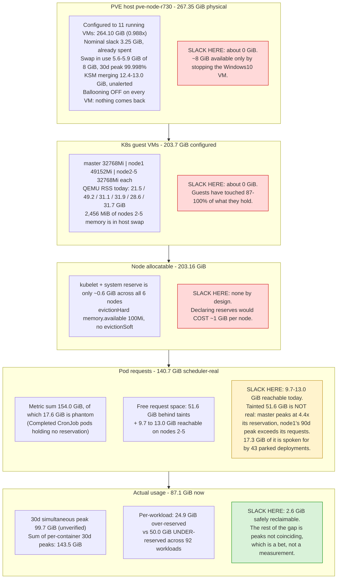

# Memory headroom: what we have, what the buffer protects, and what to do about it

Status: draft, not approved. Authored 2026-09-06.
Question it answers: are we stuck on memory requests while leaving real memory unused, and if so
how do we use it without re-creating the spiking-service storms we tuned the limits to stop?

Short answer: yes and no. The cluster reserves more than it uses, the scheduler is refusing pods
right now, and there is real slack. But it is roughly **2.6 GiB** of safely reclaimable scheduler
reservation, not the 50 GiB the headline arithmetic suggests, and the physical memory behind the
guests is already spoken for by the Proxmox host. The most valuable change in this document frees
no memory at all: it turns on the one metric that would have prevented the two right-sizing
incidents we have already had.

All measurements taken 2026-09-06 unless a different date is given. Every number carries its
window because the windows disagree with each other, and that disagreement is the main finding.

---

## 1. The state

### Cluster totals

| Quantity | Value | Window / source |
|---|---|---|
| PVE host physical memory | 267.35 GiB | `grep MemTotal /proc/meminfo` on 192.168.1.127 |
| Configured to running VMs | 264.10 GiB (0.988x physical) | `qm config` across 11 running VMs |
| Host swap in use | 5.6 to 5.9 GiB of 8 GiB | live; 30d peak 7.9997 GiB (99.998%) |
| K8s node allocatable | 203.16 GiB | `kube_node_status_allocatable` |
| Pod memory requests, metric sum | 154.0 GiB | `kube_pod_container_resource_requests` |
| Pod memory requests, scheduler-real | 140.7 GiB | sum of `kubectl describe node`, 6 nodes |
| Actual working set now | 87.1 GiB | `container_memory_working_set_bytes` |
| 30d simultaneous peak working set | 99.7 GiB (unverified, see §7) | supplied as ground truth, not re-derivable |
| Sum of independent per-node 30d peaks | 110.8 GiB | upper bound, not a simultaneous figure |
| Sum of per-container 30d peaks | 143.5 GiB | 1.35x the 106.6 GiB of requests for those containers |

The last row is the one that reframes the question. Sizing every container to its own 30-day peak
would **raise** total requests by 35%, not cut them. The cluster reserves less than the sum of what
its workloads have individually used; requests look generous only because peaks do not coincide.

### Per node

| Node | Allocatable | Requested | % req | Free req | Limits % | 30d peak used | Reserved-never-used | Schedulable? |
|---|---|---|---|---|---|---|---|---|
| k8s-master | 31.24 GiB | 2.26 GiB | 7% | 28.98 GiB | 28% | 10.02 GiB (30d), 10.23 GiB raw | negative 7.8 GiB | control-plane taint |
| k8s-node1 | 46.94 GiB | 24.28 GiB | 51% | 22.66 GiB | 133% | 29.52 GiB (90d) | negative 5.2 GiB | GPU taint (NoSchedule) |
| k8s-node2 | 31.24 GiB | 29.05 to 31.18 GiB | 92 to 99% | 0.8 to 2.2 GiB | 181 to 194% | 17.87 GiB | 13.31 GiB | yes |
| k8s-node3 | 31.24 GiB | 28.83 GiB | 91 to 92% | 2.5 to 3.2 GiB | 163 to 175% | 21.94 GiB | 6.90 GiB | yes |
| k8s-node4 | 31.25 GiB | 25.2 to 27.1 GiB | 80 to 86% | 5.0 to 6.3 GiB | 157 to 197% | 19.02 GiB | 8.08 GiB | yes |
| k8s-node5 | 31.25 GiB | 29.20 to 31.20 GiB | 93 to 99% | 0.8 to 2.1 GiB | 214 to 218% | 19.17 GiB | 12.03 GiB | yes |

The request percentages move by several GiB within minutes as CI pipeline pods come and go. Three
independent readings of free space across nodes 2 to 5 gave 9.65, 11.05 and 13.00 GiB within one
afternoon. Treat any single `kubectl describe node` snapshot as one sample of a noisy quantity, and
note that a 2.6 GiB prize expressed as a percentage of that denominator swings by a third depending
on when you looked.

### What binds today

The scheduler is refusing pods. Nine Woodpecker pipeline pods hit `FailedScheduling` with
`0/6 nodes are available: 2 node(s) had untolerated taint(s), 4 Insufficient memory` in a 45-minute
window, the most recent 19 seconds before the measurement. This is episodic rather than continuous:
at a later check there were zero Pending pods and zero Evicted pods, and the same event set also
contains failures citing pod affinity, GPU and PersistentVolume node affinity, so memory is not the
only constraint in play.

Nothing else binds. `MemoryPressure` has never been true on any node in 90 days. The minimum
`node_memory_MemAvailable_bytes` in 90 days was 8.93 GiB on the worst node, against a kubelet
`evictionHard` threshold of `memory.available<100Mi`, which is 89x the threshold. There have been
zero pod evictions of any kind in 60 days.

---

## 2. Where the memory actually goes

Reading the gap between 154.0 GiB of requests and 87.1 GiB of usage as 67 GiB of waste is wrong in
four separate ways.

**17.6 GiB is phantom.** `kube_pod_container_resource_requests` keeps emitting for roughly 100 to
109 Completed CronJob pods, which hold no scheduler reservation at all. The count moves as jobs
fire. The scheduler's own accounting sums to 140.7 GiB, and that is the number any scheduling
argument should start from.

**51.6 GiB is behind taints, and most of it is not real.** k8s-master shows 28.98 GiB of free
request space but its 30-day peak actual use is 10.02 GiB against a 2.26 GiB reservation, so the
scheduler is blind to roughly 8 GiB of real consumption there. k8s-node1 shows 22.66 GiB free but
its 90-day peak use of 29.52 GiB already exceeds its 24.28 GiB of requests. On both tainted nodes
usage exceeds reservation; their apparent headroom is much smaller than the arithmetic reads.

**17.3 GiB is parked, not free.** Sablier holds 43 deployments at 0 replicas (26 observed at one
reading), carrying that much latent request demand and zero reservation today. The four largest
(openclaw 2496Mi, t3-afk 2112Mi, osm-routing/otp 2048Mi, tts/chatterbox 2048Mi) could not all wake
concurrently into the current untainted headroom. Anything that consumes that headroom quietly
reduces how many parked services can wake at once.

**The remaining slack does not decompose into per-workload cuts.** The node-level reserved-never-used
figure on nodes 2 to 5 is 40.3 GiB. The per-container join gives a different picture: **24.9 GiB of
over-reservation across 176 containers, against 50.0 GiB of under-reservation across 92 workloads**.
The difference between the two views is exactly the non-coincidence of peaks. Ninety-nine of 301
containers already peak above their request at 30 days, and 41 above 2x their request.

The over-reservation is also flat. Only 2 workloads waste more than 1 GiB, the largest single entry
is 1.36 GiB, and the top 25 hold 44% of the total. Forty percent of all waste sits in containers
whose request is exactly 128Mi or 256Mi, which are the Kyverno tier LimitRange defaults
(`stacks/kyverno/modules/kyverno/resource-governance.tf:178-186`, `:292-300`, `:349-357`), not
per-app choices. Lowering that default was checked and rejected: 22 of the 40 default-sized
containers on nodes 2 to 5 would land below their measured 90-day peak, and 8 already exceed 256Mi.

### The instrument problem

Every peak in this document is a lower bound, and here is why.

- `container_memory_max_usage_bytes` (the cgroup high-water mark) and `container_memory_rss` are
  both dropped at scrape time by the relabel config at
  `stacks/monitoring/modules/monitoring/prometheus_chart_values.tpl:719`. cAdvisor emits
  max_usage on these nodes (292 series on k8s-node2, 1,134 across all six, non-zero on both kernel
  generations present); Prometheus discards it.
- The cadvisor scrape interval is 2 minutes (`prometheus_chart_values.tpl:447`, global, no per-job
  override). Anything shorter than that is invisible.
- `container_spec_memory_limit_bytes` is in the keep list at `:723` but already dropped by the
  `container_spec_.*` pattern one rule earlier. It has zero series. Limit-utilisation queries must
  use `kube_pod_container_resource_limits`.
- `container_oom_events_total` exists (298 series) but its series is replaced on container restart,
  so `increase()` loses kills. It reported 0 over 7 days for a container the kernel killed 43 times.
  **Verify OOM behaviour against the kernel journal in Loki, never against this metric.**

Three workloads prove the gap concretely. crowdsec-agent reads 508 MiB flat at 1d, 7d and 30d, a
ratio of 1.00, and the kernel killed it 43 times in about 9 days at anon-rss 499 to 508 MiB.
traefik reads 1,389 MiB flat and was killed 19 times at anon-rss up to 1,490 MiB, 101 MiB above
anything working_set ever reported. traefik/error-pages runs request equals limit equals 32Mi and
was killed 5 times at anon-rss 27 to 30 MiB.

The window matters as much as the metric. Measured 30d-versus-longer gaps: paperless-ngx/gotenberg
17 MiB at 1d, 101 at 7d, 384 at 30d, 2,770 at 90d (163x spread). repowise/sync 203 MiB at 1d, 221
at 7d, 1,613 at 30d, 1,691 at 90d, against a 192Mi request and a code comment saying "measured at
~35 MiB in steady state". stremio 121 MiB at 30d, 401 at 90d. technitium 634 MiB at 30d, 970 at
90d against a 1Gi request. dawarich-sidekiq resets on the 1st of each month and ramps: 571 MiB on
6 September, 3,355 MiB by month end, and growing month over month (860 MiB seven weeks earlier).

---

## 3. What the fine-tuned limits are protecting against

There was never one storm. There were three distinct failure classes, and only the first was ever
node-level.

| Date | Event | Mechanism | Blast radius |
|---|---|---|---|
| 2026-03-14 | k8s-node2 OOM crash | 250% memory-limit overcommit, 61GB of limits on a 24GB node | The node. Timeline and service list not recovered (predates the post-mortem directory) |
| 2026-03-14 onward | req==lim response | Rigid requests equal limits after the crash | 73 pods left unschedulable. This is why the cluster is deliberately all-Burstable today |
| 2026-03-14 to 03-29 | Two-week firefight | 20+ limit bumps on crash-looping services | FreshRSS 171 restarts, immich-server 34, ActualBudget 17, n8n 18 |
| 2026-04-19 | Redis cascade | 256Mi limit against a 204MB RDB; replica PSYNC forced BGSAVE fork, copy-on-write pushed RSS past the limit | Master OOM-looped, HAProxy flapped, Paperless uploads 500, Immich / Authentik / Dawarich degraded |
| 2026-06-26 | Alert storm | kube-state-metrics pinned at req==lim==256Mi by its namespace LimitRange, OOMKilled during a full object relist | ~10 false criticals fired simultaneously in a 5-minute window, then self-resolved |
| 2026-07-07 | Disk cascade with a memory root cause | immich-ml held 6750MiB VRAM against an 1800MiB budget, llama-server CUDA-OOM-looped every ~8s writing ~536MiB core dumps | ~148 GiB written in 50 minutes, imagefs DiskPressure, 1,847 pods evicted in ~6 minutes, DNS down 07:28 to 07:34 |
| 2026-07-12 | Right-sizing incident | immich-server set to req==lim==7Gi from a 7-day peak of 5.65Gi when the 30-day peak was 8.1Gi | OOMKilled at 01:07, roughly 4 user-facing 502s |
| 2026-07-16 | Right-sizing incident | novelapp trimmed 640Mi to 320Mi from idle working set | ~10 OOM kills in 23h while working_set never read above 211Mi |
| 2026-07-27 | Reboot deadlock | kured-sentinel-gate memcg-OOMed ~139 times in 6h at 22% node memory; KernelOOMKiller firing blocked kured from performing the reboot that would have stopped it | node5 stuck pending-reboot for days |
| 2026-09-02 | Ingress flap | Crawler swarm on forgejo from hundreds of IPv6 addresses; traefik pinned at 681Mi of a 768Mi limit | All three traefik pods OOMKilled 3 to 5 times each, every ingress flapped, forgejo OOMKilled, TLS dropped mid-connection |

Every one of those cascades is a small component dying at **its own limit** and taking its
dependents with it. None was a node running out of RAM.

That still holds today. Of 357 sampled kernel oom-kill lines over 30 days, 357 report
`constraint=CONSTRAINT_MEMCG` and zero report `CONSTRAINT_NONE`. `node_vmstat_oom_kill` sums to
roughly 1,131 kills over 30 days across the five workers (node3 858, node5 188, node4 57, node2 19,
node1 9, master 0), though that counter resets on reboot so the figure is an upper bound rather
than a count. Of the node3 total, 780 are the kured-sentinel-gate DaemonSet killing its own forked
`kubectl` (430) and `bash` (350) children inside its own cgroup. Those 780 never page, because the
KernelOOMKiller alert explicitly excludes `(kubectl)` and `(bash)` at
`stacks/monitoring/modules/monitoring/loki.tf:180`.

### Settings that are load-bearing because of a named incident

Do not change these without re-opening the incident that set them.

| Setting | Value | File | Why |
|---|---|---|---|
| novelapp | 640Mi req==lim | `stacks/novelapp/main.tf:215-228` | 2026-07-16 OOM loop. The file says "Do not re-trim from idle metrics" |
| redis master and replica | 768Mi | `stacks/redis/modules/redis/main.tf:267,270` | 2026-04-19 four-service cascade |
| kube-state-metrics | 64Mi / 512Mi | `prometheus_chart_values.tpl:377-382` | 2026-06-26 ten-false-critical alert storm |
| traefik | limit 1536Mi, request pinned at 768Mi | `stacks/traefik/modules/traefik/main.tf:521-534` | 2026-09-02 all-ingress flap; the request was deliberately left low to protect N-1 headroom |
| kured-sentinel-gate | 512Mi, MAX_ITER=12 | `stacks/kured/main.tf:292,368-373` | 2026-05-31 and 2026-07-27. Two mitigations, neither held |
| immich-worker / immich-ml | limits 10Gi / 4608Mi | `stacks/immich/main.tf:381-385`, `:1073-1076` | These limits exist because the 2026-07-06 request cut caused the 2026-07-12 OOM |
| proxmox-csi-plugin-node | 1024Mi | `stacks/proxmox-csi/modules/proxmox-csi/main.tf:86-88,103` | LUKS2 Argon2id unlock burst. One node measured 0.911 GiB at 90d and 1012.5 MiB high-water while five sit at 0.04 to 0.06 GiB |
| authentik goauthentik-server | 1.5Gi | `stacks/authentik/modules/authentik/values.yaml:131,261-262` | The file argues against trimming it. 90d peak 1.088 GiB, 73% of request |
| realestate-crawler-api | 512Mi req==lim | `stacks/real-estate-crawler/main.tf:519-529` | 256Mi OOMKilled it on a default-filter geojson request |
| paperless-ai | 6Gi / 8Gi | `stacks/paperless-ai/main.tf:259-297` | The 30-day-peak trap: 7d peak 0.16 GiB, 30d peak 11.75 GiB. Right-sized 2026-09-04 |
| anubis | one `memory` variable feeding both request and limit | `modules/kubernetes/anubis_instance/main.tf:95-102,467,471` | 128Mi is the bot wall in front of forgejo. Lowering the variable lowers the limit |

Two in-repo comments are now contradicted by measurement and should be treated as dated evidence:
`stacks/forgejo/main.tf:376-383` records a "7-day peak ~0.97Gi" and a 2026-07-06 cut to 1.5Gi /
2Gi, while the measured 90-day peak is 3,820 MiB and forgejo OOMKilled on 2026-09-02; and
`docs/architecture/compute.md:540-552` still documents requests-equal-limits for tiers 0 to 2 plus
VPA/Goldilocks right-sizing, both of which the cluster abandoned (VPA uninstalled 2026-06-12), and
links `docs/runbooks/right-sizing.md`, which does not exist.

### Controls that exist, and gaps in them

Admission-time governance is near-total: 6 PriorityClasses, 142 LimitRanges, 137 ResourceQuotas
across 151 namespaces, 318 of 340 pods carrying a priorityClassName, 27 PodDisruptionBudgets, and a
9-rung priority-ordered graceful-shutdown ladder live on the nodes.

Runtime-pressure levers are weaker.

- `systemReserved`, `kubeReserved` and `evictionSoft` are all unset on the live nodes. The only
  cushion is `evictionHard memory.available<100Mi`, the upstream default. There is no soft band.
- `NodeLowFreeMemory` is routed by Alertmanager at `prometheus_chart_values.tpl:98` and `:113` and
  defined nowhere. No `ContainerNearOOM` alert exists either, so nothing warns before a kill.
  `NodeMemoryPressure` fires only once the kubelet is already evicting.
- `ClusterCannotTolerateNonGpuNodeLoss` (`prometheus_chart_values.tpl:2623`) excludes GPU nodes from
  its numerator but not its denominator, while k8s-node1 carries a hard
  `nvidia.com/gpu=true:NoSchedule` taint (`stacks/nvidia/modules/nvidia/main.tf:82`). Its own
  comment at `:2604` says the taint is PreferNoSchedule; it is not. Measured: numerator 28.95 GiB,
  denominator 37.02 GiB of which 22.91 GiB is unreachable, so real fallback is 14.11 GiB. The alert
  is not firing on the condition it was written for, and it has 1,584 firing samples in 30 days and
  drove three past request trims including the one that broke immich.
- The descheduler's LowNodeUtilization plugin reads actual usage
  (`stacks/descheduler/values.yaml:126-137`, `metricsUtilization.metricsServer: true`), so its
  12:00 run logged "All nodes are under target utilization, nothing to do here" at 31 to 59% usage
  while the scheduler saw node4 at 90% of requests. Switching it to request-based accounting would
  start evicting immediately, up to 10 pods per hourly run, against PDBs of which two allow zero
  disruptions. That is not a small change and it is not in this plan.
- 33 BestEffort pods live in the nine namespaces with no LimitRange (calico-system 18,
  metallb-system 7, kube-system 6, calico-apiserver 2). A BestEffort pod is the first thing evicted
  under node pressure, and 7 of them carry the LoadBalancer data path.
- `InPlacePodVerticalScaling` is GA and enabled on these kubelets and is used nowhere in the repo.
  It makes a request change reversible without a restart, which is worth knowing for stage 5.

### The host is the real ceiling

264.10 GiB configured to running VMs against 267.35 GiB physical leaves 3.25 GiB of nominal slack,
which is already spent on PVE, the NFS server and QEMU overhead. The evidence it is spent: 5.6 to
5.9 GiB is in swap right now, on a rotational 10.7 TB disk (`sdc`) that also carries
`pve-data-tpool` (every PVC) and `/srv/nfs`. Swap-in peaked at 431 pages/s over 30 days, so those
are not merely cold pages.

KSM is merging 12.4 to 13.0 GiB of duplicate guest pages and is the only reason the host fits.
Nothing alerts on it. Ballooning is disabled on every VM by policy
(`modules/create-vm/main.tf:36-39`), so a guest that stops using a page never returns it.
`Committed_AS` is 275.6 GiB against a `CommitLimit` of 141.7 GiB (1.94x) with
`vm.overcommit_memory=0`, so nothing refuses an allocation; if swap ever exhausts, the host OOM
killer's largest-RSS victim is a KVM process, meaning a whole k8s node VM and every pod on it.

Per-VM swap attribution, measured during the adversarial review and previously listed as
unmeasurable: **5,218 MiB of the host's 5,874 MiB of swap is guest memory**, and the four untainted
worker VMs hold 2,456 MiB of it (node2 1,212, node3 507, node4 35, node5 702). The host is already
paging out the exact guests any "use the free memory" plan would ask to dirty more.

Free-of-charge host headroom is roughly 8 GiB, all of it from stopping the Windows10 VM (VMID 300,
8192 MiB configured, 7,778 MiB RSS, already flagged as a candidate in
`docs/plans/2026-02-28-storage-reliability-design.md:337-338`). Beyond that it is new DIMMs, which
is new spend and needs explicit approval.

---

## 4. The layers, and where the slack sits



The shape to take from this: slack does not accumulate down the stack. It exists only at the
request layer, and only on the four untainted nodes. Every layer above is full.

---

## 5. Recommendation

One plan, seven stages, ordered so the reversible and instrument-fixing work lands before anything
that changes a workload's memory. The honest total is **about 2.6 GiB of reclaimed request
reservation on nodes 2 to 5**, less roughly 0.44 GiB spent in stage 4, so a **net gain near
2.1 GiB** against the 9.7 to 13.0 GiB those nodes already have free. That is a 16 to 22% increase
in reachable placement headroom, not a transformation.

Two things this plan deliberately does not do, both because the adversarial review found them
unsafe:

- **No VM memory resize.** Shrinking master and node1 to grow nodes 2 to 5 sounds free because
  configured memory stays at 264.10 GiB, but configured is symmetric and realized RSS is not. The
  workers sit at 87 to 97% of their configured memory and would fill what they are given
  (up to +24 GiB of new host RSS), while master returns only ~5 GiB of RSS and node1 ~8 GiB. Worst
  case is roughly +18.5 GiB of host RSS against 15.67 GiB of host absorption (13.27 GiB MemFree plus
  2.40 GiB SwapFree). The likely failure is host swap thrash on the spindle backing every PVC and
  `/srv/nfs`, which surfaces as a storage incident with a memory root cause.
- **No batch tier for the CI pipeline.** A negative-priority preemptible tier is a good idea in the
  abstract, but Woodpecker here is deploy-only (`docs/adr/0002`), `scripts/tg` releases its Vault
  advisory lock via `trap ... EXIT` (line 154) which does not run on SIGKILL, `LOCK_MAX_AGE` is
  1800s, and `.woodpecker/default.yml:318,355` treat a held lock as SKIPPED rather than failed. A
  preempted deploy would report success while the stack was never applied, and it would remove the
  ability to ship a fix at the moment one is needed. If a batch tier is wanted later, it needs a
  different consumer than the deploy path, and the host absorption numbers above cap it well below
  the 8 GiB first proposed.

### Stage 1: turn on the cgroup high-water mark

**Change.** Remove `max_usage_bytes` from the cadvisor drop regex and add
`container_memory_max_usage_bytes` to the keep whitelist one rule below it. Leave
`container_memory_rss` dropped; it is largely redundant with working_set and doubles the series cost.

**File.** `infra/stacks/monitoring/modules/monitoring/prometheus_chart_values.tpl:719` (drop regex)
and `:723` (keep whitelist).

**Gain.** 0 GiB of memory. It is first because it is the instrument every later stage depends on.
Both right-sizing incidents on record (immich-server 2026-07-12, novelapp 2026-07-16) came from
sizing against a metric that could not see the spike, and this is the metric that can. It already
refuted one entry in the candidate trim list before anything was changed: nextcloud-cron reads a
127 MiB working_set and a 242.8 MiB high-water, a 1.9x understatement.

**Cost, measured.** cAdvisor already emits this on these nodes (292 series on k8s-node2, 1,134
across all six; non-zero on both kernel generations, 7.0.0-28 and 6.8.0-136). Adding it is about
1,129 new series against 104,294 head series, roughly 1.1%. prometheus-server reads 2,425Mi against
its 4Gi limit at rest; the 4,102Mi figure recorded during research was transient query load, not
steady state.

**Verify.**
```
homelab metrics query 'count(container_memory_max_usage_bytes)'     # ~1,129, currently no series
homelab metrics query 'prometheus_tsdb_head_series'                  # stays under ~107,000
homelab metrics query 'container_memory_working_set_bytes{pod=~"prometheus-server.*"}'
```
Spot-check that values are real high-water marks rather than copies of working_set: immich-worker
should pin at 10240.0 MiB (its 10Gi limit), forgejo at 2048.1 MiB, prometheus-server at 4096.4 MiB,
and proxmox-csi-plugin-node should read about 1012.5 MiB against a ~50.9 MiB working_set, which is
the LUKS burst that five separate 5-minute-resolution analyses could only infer.

**Caveat to state when reporting it.** The metric resets per container instance, so a container
that was actually killed loses its high-water mark. Read instantaneously right now, crowdsec-agent
shows 389.7 MiB and traefik 1,113.1 MiB, both below their kill-time rss, because both restarted.
A true 30-day high-water comes only from `max_over_time` across instances once the data has
accumulated. What this metric uniquely catches is the container that spikes to 95% of its limit and
survives, which today leaves no trace anywhere.

**Abort signal.** prometheus-server going NotReady, or its working_set exceeding 4,096Mi, within an
hour of the change. Revert the one line. Losing the observability layer during a memory exercise is
how the previous two attempts went blind.

### Stage 2: make the alerts tell the truth

**Change.** Three edits, all alerting, no workload touched.

1. Add the same non-GPU node-label exclusion to the **denominator** of
   `ClusterCannotTolerateNonGpuNodeLoss`, and correct the stale comment that calls the GPU taint
   PreferNoSchedule.
2. Define `NodeLowFreeMemory`, which is routed in two places and declared nowhere. A starting
   threshold of `node_memory_MemAvailable_bytes < 4Gi for 10m` on nodes 2 to 5 is a genuine
   excursion against a 30-day floor of 8.93 GiB; this value is proposed, not settled.
3. Define `ContainerNearOOM` on
   `container_memory_working_set_bytes / kube_pod_container_resource_limits > 0.85`.

**File.** `infra/stacks/monitoring/modules/monitoring/prometheus_chart_values.tpl:2604` (comment),
`:2623` (expr), plus two new rules.

**Gain.** 0 GiB. It stops the alert that drove three past request trims, one of which caused
user-facing 502s, from reading 22.91 GiB healthier than reality.

**Expect noise.** ContainerNearOOM at 0.85 will immediately fire for loki (30d peak 4,096 MiB =
100.0% of its 4Gi limit), prometheus-server (3,879 of 4,096 MiB), traefik, crowdsec-agent and
error-pages. That is correct, since six workloads are OOM-looping, but route it to a low-urgency
receiver first.

**Verify.** Recompute the corrected denominator by hand: it should equal about 14.11 GiB
(node2 3.264 + node3 4.143 + node4 4.404 + node5 2.295) and no longer include node1's 22.911 GiB.
Then `kubectl -n monitoring get prometheusrule -o yaml | grep -c 'NodeLowFreeMemory\|ContainerNearOOM'`
returns 2, and `homelab metrics query 'ALERTS{alertname="ClusterCannotTolerateNonGpuNodeLoss"}'`
shows the new state.

**Abort signal.** None beyond normal alert-noise judgement; revert if the new rules page for
conditions that are not real.

### Stage 3: stop the phantom 17.6 GiB

**Change.** Set `ttlSecondsAfterFinished` on the CronJob specs, or lower
`successfulJobsHistoryLimit`, so Completed pods are reaped.

**File.** The CronJob declarations across `infra/stacks/*`. No single file.

**Gain.** 0 GiB of memory. It makes the number every future right-sizing argument starts from
honest. A 154.0 GiB request total that is really 140.7 GiB is how a 54 GiB gap looked like 54 GiB.

**Verify.** `kubectl get pods -A --field-selector=status.phase=Succeeded --no-headers | wc -l`
falls from roughly 100 toward 0, and
`homelab metrics query 'sum(kube_pod_container_resource_requests{resource="memory"})/1024^3'`
converges from 154.0 toward the 140.7 GiB that `kubectl describe node` already reports.

**Abort signal.** None. The only loss is post-hoc `kubectl get pods` visibility into finished jobs,
whose logs are in Loki for 30 days regardless.

### Stage 4: give the metallb pods requests and a priority class

**Change.** Give the 7 metallb pods (1 controller, 6 speakers) an explicit memory request of about
64Mi and `priorityClassName: tier-0-core`. They are BestEffort at priority 0 today because
metallb-system is in the Kyverno excluded-namespaces list
(`stacks/kyverno/modules/kyverno/resource-governance.tf:16`), so no LimitRange reaches them, and
they carry the LoadBalancer data path.

**File.** `infra/stacks/metallb/`.

**Gain.** Negative: it **spends** roughly 448 MiB of request headroom (this figure is derived from
7 x 64Mi and was not independently verified). It is here because it is a prerequisite for any change
that raises node packing density, and it is worth doing on its own merits.

**Verify.**
```
kubectl -n metallb-system get pods -o json | jq -r '.items[] | "\(.metadata.name) \(.spec.priorityClassName) \(.status.qosClass)"'
homelab net check
```
All 7 should read tier-0-core / Burstable, and the LoadBalancer VIPs should still answer. Roll one
node at a time; a speaker restart briefly withdraws that node's advertisement.

**Abort signal.** Any LoadBalancer VIP failing to answer, or a speaker failing to re-establish.

### Stage 5: trim requests on the corroborated exporters and pollers

**Change.** Lower the **request** only, on containers whose oversizing is confirmed by two
independent instruments: a 30-day and a 30-to-60-day working_set peak, and the cgroup high-water
mark read during the adversarial review. **No limit moves anywhere in this stage.**

| Workload | Request now | 30d peak | High-water | Proposed request | Freed |
|---|---|---|---|---|---|
| nvidia/nvidia-operator-validator | 256Mi | 3 MiB | 5.0 MiB | 32Mi | 0.22 GiB |
| monitoring/redfish-exporter | 256Mi | 7 MiB | 9.0 MiB | 48Mi | 0.20 GiB |
| authentik/pgbouncer (3 replicas) | 128Mi | 8 MiB | 15.9 MiB | 32Mi | 0.28 GiB |
| coturn | 256Mi | 41 MiB (90d) | 20.2 MiB | 96Mi | 0.16 GiB |
| monitoring/snmp-exporter | 256Mi | 22 MiB | 25.3 MiB | 48Mi | 0.20 GiB |
| monitoring/proxmox-exporter | 256Mi | 42 MiB | 45.6 MiB | 80Mi | 0.17 GiB |
| monitoring/loki-canary (5 replicas) | 256Mi | 47 MiB | 48.8 MiB | 80Mi | 0.86 GiB |
| monitoring/alertmanager | 256Mi | 50 MiB | 51.5 MiB | 96Mi | 0.16 GiB |
| monitoring/node-exporter (6 replicas) | 100Mi | 36 MiB | not read | 64Mi | 0.21 GiB |
| nfs-csi/nfs (8 replicas) | 128Mi | 54 MiB | not read | 96Mi | 0.25 GiB |
| tasks | 384Mi | 101 MiB | 133.8 MiB | 256Mi | 0.13 GiB |
| nextcloud-todos | 384Mi | 101 MiB | 111.5 MiB | 288Mi | 0.09 GiB |

Roughly 2.9 GiB gross at these values. Every proposed request above is at least 1.5x the larger of
the two measured figures. **These are proposed values, not settled ones**; each should be
re-checked against `max_over_time(container_memory_max_usage_bytes[30d])` once stage 1 has 30 days
of retained data, and the last two rows in particular (node-exporter, nfs-csi) have no high-water
reading yet.

**Files.** `stacks/nvidia/modules/nvidia/`, `prometheus_chart_values.tpl` (redfish, snmp, proxmox,
alertmanager, node-exporter), `stacks/authentik/modules/authentik/pgbouncer.tf:89` (limit 512Mi at
`:92` unchanged), `stacks/coturn/main.tf:197`,
`stacks/monitoring/modules/monitoring/loki.yaml` (loki-canary has no resources block today and
inherits the chart default, so it needs a `lokiCanary.resources` stanza near `:91`),
`stacks/nfs-csi/modules/nfs-csi/main.tf:104`, `stacks/tasks/main.tf:225`,
`stacks/nextcloud-todos/main.tf:269`.

**Two entries removed from the original candidate list, and why.**

- **nextcloud-cron 384Mi to 256Mi: dropped.** Its cgroup high-water is 242.8 MiB, which is 95% of
  the proposed request, against the 127 MiB its working_set reports. This is the stage-1 argument
  demonstrated on a live candidate.
- **anubis 128Mi to 96Mi: dropped.** `modules/kubernetes/anubis_instance/main.tf` declares a single
  `memory` variable whose description reads "requests==limits memory", wired to requests at `:467`
  and limits at `:471`. Editing the value lowers the **limit** on six bot-wall sidecars in front of
  forgejo, and the 2026-09-02 incident was precisely a crawler swarm raising concurrency. If the
  module is ever split into `memory_request` and `memory`, do it as a no-op refactor that keeps the
  limit at 128Mi, in its own change.

Also noted for the record: the original stated reason for excluding node-exporter and nfs-csi
("2x their peak already exceeds their request") is arithmetically wrong (2 x 42.4 = 84.8 MiB
against a 100Mi request; 2 x 54.2 = 108.4 against 128Mi). They are included above at 1.5x, which
is why the sizing rule needs to be applied mechanically rather than by judgement.

**Verify.** Per rollout, `homelab deploy wait <ns>/<deploy>`. Then
`kubectl describe node k8s-node{2,3,4,5} | grep -A6 'Allocated resources'` should show the memory
request column down by the expected aggregate. For each trimmed container, over the following week,
`max_over_time(container_memory_max_usage_bytes{container="<c>"}[7d])` must stay below the new
request. Check for kills with the kernel journal, never with `container_oom_events_total`:
```
homelab logs query '{job="node-journal"} |~ "Memory cgroup out of memory"' --since 1h
```
For coturn and pgbouncer, drive the real path: log in through authentik in a browser, and confirm a
WebRTC session establishes through the TURN relay.

**Abort signal.** Any pod anywhere entering Evicted state. That count has read 0 for 60 days, so one
sample is unambiguous and is the signal that the eviction-ranking risk turned real. Also abort on any
trimmed container appearing in the kernel-journal OOM query, or entering CrashLoopBackOff. Revert is
a `git revert` of that stage's commit plus the CI apply, and each row is independently revertible.

**The risk this stage carries, stated plainly.** Every pod in this cluster is Burstable, and kubelet
ranks node-pressure eviction by usage-over-request. Lowering a request moves that pod up the kill
list. That is the mechanism behind the 2026-07-12 immich incident. These twelve are exporters,
pollers and a connection pooler with steady sub-140 MiB working sets and no periodic corpus job, so
the ranking change is theoretical for them, but the mechanism is real and it is why the list is
short and hand-screened rather than generated.

### Stage 6: raise one limit, on the workload measured at 96% of it

**Change.** crowdsec-agent limit 512Mi to 768Mi. **Leave the 128Mi request untouched.**

**File.** `infra/stacks/crowdsec/modules/crowdsec/values.yaml:23-25`.

**Gain.** 0 GiB of headroom; it costs 5 x 256Mi = 1.25 GiB of limit claim on nodes already at 157
to 218% limit overcommit. It removes 43 kills in about 9 days, every one at anon-rss 499 to 508 MiB
against a measured 30-day working_set peak of 491 MiB (96% of the limit), on the flattest series in
the cluster (30d/1d ratio 1.00).

**Why this is acceptable despite the overcommit.** Limits are claims, not reservations, so nothing
is displaced at schedule time. Node-level OOM is what limit overcommit risks, and it has never
happened here: 357 of 357 sampled kernel lines are CONSTRAINT_MEMCG, MemoryPressure has never been
true in 90 days, and the worst MemAvailable in 90 days was 8.93 GiB against a 100Mi threshold. This
is a judgement call and it does make node5 marginally worse (214% to about 215%).

**Verify.** After the change,
`homelab logs query '{job="node-journal"} |~ "Memory cgroup out of memory"' --since 7d` returns
zero crowdsec victims, and
`max_over_time(container_memory_max_usage_bytes{container="crowdsec-agent"}[7d])/1024^2` rises
above 508, which tells you the 508 was the limit rather than the demand.

**Abort signal.** Any node-level kernel OOM:
`homelab logs query '{job="node-journal"} |~ "oom-kill:constraint=CONSTRAINT_NONE"' --since 1d`.
That has returned nothing in 30 days across all six nodes. One line means the first genuine node
memory-exhaustion event in the cluster's recorded history.

### Stage 7: stop kured-sentinel-gate forking kubectl

**Change.** Rewrite the sentinel loop so it does not fork a `kubectl` process (a ~90 MiB Go binary)
per iteration inside its own cgroup. One watch, or one reused process. Do not raise the limit a
third time.

**File.** `infra/stacks/kured/main.tf:275-295` (loop and MAX_ITER guard), `:355-373` (resources).

**Gain.** 0 GiB of headroom. It removes roughly 780 of the cluster's ~1,131 kernel OOM kills per 30
days (430 kubectl victims, 350 bash), all on k8s-node3, and it is the failure that deadlocked
cluster reboots on 2026-07-27. It has been mitigated twice (64Mi to 256Mi on 2026-05-31, then
256Mi to 512Mi plus MAX_ITER=12 on 2026-07-27) and the 30-day window starts after the second fix,
so neither held.

**Verify.**
```
homelab logs query '{node="k8s-node3"} |~ "oom-kill:" | regexp "task=(?P<task>[^,]+)"' --since 2d
homelab metrics query 'sum by (node) (increase(node_vmstat_oom_kill[24h]))'
```
kubectl and bash victims should disappear from the first (they dominate today), and node3 should
fall from roughly 29 kills/day toward single digits.

**Abort signal.** kured failing to gate or perform reboots. Roll back the script, not the limit.
That path previously left node5 pending-reboot for days.

### Optional, needs a decision rather than an engineering step

Stopping the Windows10 VM (VMID 300) returns about 8 GiB to the host and is the only genuinely free
host memory available. It buys swap relief on the spindle that backs every PVC, not scheduler
headroom, so it does not help the FailedScheduling symptom. It needs a yes or no on whether that VM
still needs to run. Buying DIMMs is the only way to add real memory and is new spend requiring
explicit approval; the modules would go in slots A9 to A12 on CPU1 (all 12 B-bank slots are
electrically dead with only one CPU populated), and neither the price nor the 3-DIMM-per-channel
speed derating has been checked.

---

## 6. What we deliberately do not touch

Beyond the incident-anchored table in section 3, which is unchanged:

- **chrome-service chrome-worker (2Gi) and neko (3Gi).** Sampled from whichever burst pod is running,
  worker reads 0.22 GiB; across the 102 worker pods that existed in the 30-day window its true peak
  is 2.34 GiB, above its request. neko charges a 1Gi tmpfs against its own 4Gi limit
  (`stacks/chrome-service/main.tf:708-715`) and peaked at 4,007 of 4,096 MiB.
- **technitium (1Gi).** 30d peak 634 MiB, 90d peak 970 MiB, 97% of request. The clearest example of
  why a 30-day window is not always enough.
- **stremio (512Mi)**, 90d peak 401 MiB (80%) against a 30d peak of 121 MiB; **actualbudget http-api
  (768Mi req==lim)**, 90d peak 517 MiB.
- **rybbit clickhouse (1Gi).** Live exit 137, and `stacks/rybbit/main.tf:110` sets
  `max_server_memory_usage` to 1.17 GiB, above its request. Flat working_set here is the
  sub-scrape-spike signature, not headroom.
- **authentik goauthentik-worker (896Mi).** Already trimmed on 2026-09-04; 76% of request at 90d.
- **The whole immich set.** Requests were trimmed on 2026-07-26 and every 90-day peak now exceeds
  them (immich-worker 9,619 MiB against a 3,584 MiB request).
- **dawarich-sidekiq (768Mi req, 4Gi limit).** Resets on the 1st of each month and ramps all month.
  Do not measure it in the first ten days of a month.
- **forgejo (1.5Gi / 2Gi).** Needs a **limit** review, not a request cut: 90d peak 3,820 MiB and an
  OOMKill on 2026-09-02. Out of scope here because this plan does not raise limits except stage 6.
- **loki (1Gi / 4Gi) and prometheus-server (3Gi / 4Gi).** Query-driven and currently pinned at 100%
  and 94.7% of their limits. Measuring them is the load: prometheus went NotReady and took a SIGTERM
  under the research queries, and loki OOMKilled three times that day.
- **repowise/sync, paperless-ngx/gotenberg, servarr/qbittorrent, phpipam/import.** 30d-over-7d
  ratios of 7.3x, 163x (at 90d), 17.6x and 27.5x. Any window shorter than their slowest job is
  meaningless, and repowise/sync is already 8.4x under-reserved.
- **The 19 containers reading 0 MiB today** (scale-to-zero and cron), and all 43 sablier-parked
  deployments.
- **Anything on k8s-master or k8s-node1**, for the reasons in section 2.
- **Requests equal limits as a general policy.** It stranded 73 pods after the March 2026 node OOM.
- **The descheduler's utilization source.** Switching it from usage to requests would start evicting
  immediately and is a separate decision with its own blast radius.
- **MemoryQoS and guest swap.** MemoryQoS is ALPHA and reads 0 on these kubelets, so enabling it
  needs a `--feature-gates` change on all six nodes with recovery via the Proxmox console
  (`playbooks/k8s-node-tuning.yml:583-596`), and it would apply `memory.high` throttling to all 307
  Burstable containers at once. Guest swapfiles would land on the same rotational `sdc` that already
  carries the host's own swap, `pve-data-tpool` and `/srv/nfs`, converting memory pressure into IO
  pressure on shared storage.

---

## 7. Open questions and what we cannot measure

**Unverified numbers this document still leans on.**

- The **99.7 GiB 30-day simultaneous peak working set** was supplied as ground truth and could not
  be re-derived; the query that produces it returns 503 from prometheus-server. Every "requests are
  1.5x peak usage" framing inherits it.
- The **~1,131 OOM kills over 30 days** is an upper bound, not a count. `node_vmstat_oom_kill` resets
  on reboot (node5 reads 5,639 over 90d against a current counter of 4,728).
- The **~448 MiB cost of stage 4** is derived from 7 x 64Mi and was not independently verified.
- The **phantom Completed-pod total** is quoted at 17.6 GiB over 100 to 109 pods depending on when it
  was counted. The count moves as CronJobs fire; the direction is sound.

**Questions that would change the plan if answered.**

1. **What does a Woodpecker pipeline pod actually request?** The LimitRange defaultRequest is 128Mi
   and the namespace quota shows 384Mi used of 16Gi (2.4%), which does not explain
   `4 Insufficient memory` against 5.0 to 6.3 GiB free on k8s-node4. Repeated polling caught no live
   `wp-*` pod before garbage collection. Until this is captured, no stage in this plan can honestly
   claim it will clear those events. The same events also cite
   `1 node(s) didn't match PersistentVolume's node affinity`, and four orphaned `wp-*` local-path
   PVCs are Bound at 21 to 106 days old, one on each of nodes 2 to 5, so storage locality is a
   second and possibly dominant cause.
2. **Is the FailedScheduling pressure continuous or episodic?** `kube_pod_status_unschedulable` is
   not in this cluster's metric whitelist and the 30-day Pending-count subqueries time out, so there
   is no history. Kubernetes events are not shipped to Loki either. We can show the scheduler
   refusing pods today; we cannot show how often it did so over 30 days.
3. **Does k8s-master's 21.5 GiB of guest-free memory cost host RSS if used?** QEMU RSS
   double-counts KSM-shared pages and excludes swapped-out ones, so the host cost of filling it is
   bounded between 0 and about 11 GiB and is unmeasurable from here. This is why no stage puts work
   on master.
4. **What is the natural variance of KSM `pages_sharing`?** It drifted 2.1% (5,954,063 to 5,830,628
   pages) over one afternoon with nothing changed. Any abort band built on it needs a baseline over
   days, not hours.
5. **Was paperless-ngx/gotenberg's 2,770 MiB 90-day peak taken under its current 1536Mi limit?** The
   limit has one commit in history (2026-06-27) and the peak exceeds it. Unreconciled. A separate
   read of paperless-ngx/paperless-ngx showed an 8,192.7 MiB high-water, also unreconciled.
6. **Is claude-breakglass oversized?** One 30-to-60-day window read 286.4 MiB on one pod against a
   320Mi request while four siblings read 34 to 38 MiB; the live container's high-water is 61.7 MiB.
   Because max_usage resets on restart, neither figure refutes the other. Excluded from stage 5 as
   unresolved.
7. **What would declaring `systemReserved` / `kubeReserved` cost?** `playbooks/k8s-node-tuning.yml:530-543`
   records that three PromQL formulations of per-node requests disagreed with `kubectl` by up to
   1.1 GiB, which is larger than the headroom in question, so this was not attempted.

**Structurally unmeasurable with the current instruments.**

- Any spike shorter than the 120-second scrape interval. Stage 1 fixes this going forward for
  containers that survive; a container that is killed loses its high-water mark, so kill-time rss
  still comes only from the kernel journal.
- OOM history older than about 9 days. Loki returned no additional node-journal lines past that even
  at `--limit 2000`, and `kube_pod_container_status_last_terminated_reason` has no samples at a
  20-day offset. Every OOM count here is a ~9-day count reported against a 30-day frame.
- Whether any `CONSTRAINT_NONE` kernel OOM occurred across the full 30 days. Full-text Loki scans at
  14d and 30d timed out; CONSTRAINT_MEMCG was confirmed on every sampled line over 18h and 3d.
- Per-workload peaks for pool and cron workloads, where the observed peak reflects only whichever
  invocations landed in the window. chrome-worker is the sharpest case: its working set is set by
  whatever page a session opens.
- Whether the mass eviction 60 to 75 days ago (6,938 evicted pod-series, 98% technitium) had any
  memory component. It predates Loki retention. DiskPressure was true on all six nodes at some point
  in 90 days and MemoryPressure on none, which is strong circumstantial evidence it was disk.
