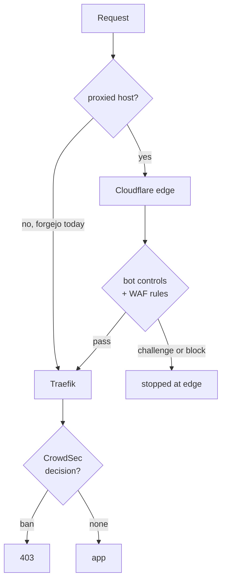

# Crawler defence at the Cloudflare edge

Status: executing — steps 1 to 4 done, step 5 (retiring the static lists) held
open pending false-positive observation on the new scenario
Date: 2026-09-06 (revised the same day; step 4 closed out 2026-09-09)
Author: Viktor Barzin (design worked through with Claude)

## Goal

Stop AI crawler swarms across **every host we run**, without maintaining a
hand-curated list of one vendor's address space, and with as little code of our
own as possible.

Scope is the whole estate, not one service. The edge controls below are
zone-wide and cover all ~110 proxied hosts the moment they are enabled. Forgejo
appears often in this document only because it is the single public HTTP host
currently outside that coverage, so it needs work to join. The handful of
non-HTTP names (`turn`, `vpn`, `xray-reality`) cannot be covered by Cloudflare
at all and stay with CrowdSec and the firewall bouncer, as today.

| surface | covered by |
|---|---|
| ~110 proxied HTTP hosts | Cloudflare edge, from step 1 |
| forgejo | Anubis proof-of-work from 2026-09-09, plus CrowdSec + firewall bouncer (step 3's edge proxying was reverted, infra#91) |
| every HTTP host | `viktor/distributed-crawl-range` in CrowdSec from 2026-09-09 |
| non-HTTP names, internal `.lan` | CrowdSec + firewall bouncer, unchanged |

## What changed, and why this document was rewritten

The first version of this design assumed Cloudflare was unavailable to us and
proposed building a Turnstile challenge into our first-party Traefik plugin.
Two measurements overturned that premise, and the design is much smaller as a
result.

**We already proxy almost everything.** Proxied hostnames ride a zone-wide `*`
wildcard CNAME through cloudflared, so `cloudflare_proxied_names = []` means no
per-name records are needed rather than nothing being proxied. Public DNS
confirms it:

| host | resolves to | proxied |
|---|---|---|
| blog, homepage, cyberchef | 172.67.130.8, 104.21.3.16 | yes |
| forgejo | 176.12.22.76 (our WAN IP) | no |

Forgejo is the exception, set explicitly at `stacks/forgejo/main.tf:472`, and it
is where the crawlers go: 22,115 of 22,189 Meta requests and 460 of 464 OpenAI
requests in 24h.

**The size cap that keeps Forgejo unproxied applies to uploads only.**
Cloudflare's free plan caps request bodies at 100 MB and does not limit response
size. Release downloads, one of the two reasons Forgejo was reverted to
non-proxied, were never affected.

**There is no out-of-band decision API.** Cloudflare has no endpoint that takes
request metadata we submit and returns a challenge or ban verdict. Their score
is computed from the TLS handshake and HTTP/2 fingerprint, which exist only on a
connection they terminate. Using their decisions means letting their edge see
the traffic.

## The edge as it stands today

Read live from the zone API on 2026-09-06. The zone is on the Free Website plan.

| setting | value |
|---|---|
| `fight_mode` (Bot Fight Mode) | **true**, already on |
| `enable_js` | true |
| `crawler_protection` | enabled |
| `ai_search` / `ai_training` / `ai_user` | **all disabled** |
| `ai_bots_protection` | disabled, migrated into `crawler_protection` |
| `is_robots_txt_managed` / `cf_robots_variant` | true / **off** |
| WAF custom rules | 1, disabled (a skip rule); 4 of 5 free slots unused |

We already have the machinery. The dials are off. Note that
`ai_bots_protection` had been recorded as enabled at block; Cloudflare has since
reorganised these settings and ours are currently not acting.

## Design



Two layers, and we already own both.

**Edge, Cloudflare, no code.** Turning on the `crawler_protection` categories
makes the edge act on declared AI crawlers across every proxied host.
Cloudflare defines the categories as Search ("crawlers that collect or index
your content to answer questions about it later"), Agent ("automated activity
acting in real time on a person's behalf") and Training. Whether OpenAI's
`OAI-SearchBot` is classified Search is not yet verified. One WAF custom rule
with the Managed Challenge action covers declared crawler user-agents; the free
plan allows 5 rules with every action except Log, and no regex. Managed
robots.txt makes Cloudflare publish and maintain the crawler directives so we
never curate them.

**Bot Fight Mode stays on.** It is running today, and on the free plan it is the
only control that detects undeclared automation. Cloudflare describes it as
catching "simple bots from cloud hosting providers and headless browsers". The
paid detection that would do this better, bot score and JA3/JA4 fingerprinting,
requires Enterprise with Bot Management, so on our plan Bot Fight Mode is the
detector for exactly the crawl shape Meta used on 2026-09-02, when it declared
itself nowhere.

It carries a real constraint. Cloudflare documents that "You cannot bypass or
skip Bot Fight Mode using WAF custom rules or Page Rules", that exceptions "for
example, your own API clients or monitoring tools" require Super Bot Fight Mode
(Pro and above), that JavaScript Detections "is automatically enabled and cannot
be disabled", and that these products "may challenge API or mobile app traffic".

That constraint does not bite here, because split DNS keeps our own automation
off the edge entirely:

| client | resolves `forgejo.viktorbarzin.me` to |
|---|---|
| in-cluster pods (Woodpecker, agent service) | 10.111.111.95, the service IP |
| devvm and WireGuard clients | 10.0.20.203, the internal Traefik LB |
| external clients | the public record |

Woodpecker, the agent service, the devvm and anything arriving over WireGuard
reach Forgejo without a Cloudflare hop. Proxying the public name exposes only
genuinely external traffic to Bot Fight Mode, which is crawlers, search engines
and occasional human browsing.

An earlier revision of this document proposed disabling Bot Fight Mode to
protect our own API clients. That reasoning did not survive checking where those
clients actually resolve.

The residual risk is that we cannot enumerate every external automated client,
and if one is challenged there is no exception mechanism on this plan. That is
accepted as smaller than losing the only detector we have for crawlers that do
not declare themselves.

### Forgejo

Enable SSH on Forgejo, move git remotes to it, then proxy the hostname. SSH
bypasses Cloudflare entirely, so the 100 MB upload cap stops mattering for git,
and the crawled web surface gains the same edge protection as every other host.

Forgejo traffic is overwhelmingly the surface that benefits:

| forgejo, 24h | requests | share |
|---|---|---|
| web commit pages | 165,359 | 57% |
| web other | 81,992 | 28% |
| raw file | 19,565 | 6.7% |
| blame | 15,449 | 5.3% |
| API | 4,037 | 1.4% |
| git protocol | 3,413 | 1.2% |
| release downloads | 0 | 0% |

## What this removes from the previous design

- The custom Turnstile verification inside the Traefik plugin, roughly 200 lines
  ported from upstream plus a template. No longer needed.
- The Turnstile widget and hostname registration chore, which would have meant
  listing ~110 hosts by hand across at least 11 widgets.
- The restored `captcha_remediation` CrowdSec profile, which only made sense if
  we were building our own challenge.

The `/64` crawl detector is not deleted but drops down the list. It still has
value for undeclared crawlers that clear the edge, and it is the fallback if the
declared user-agents disappear again. Revisit it once we can see what the edge
actually stops.


## Phase 1: which hosts are not behind Cloudflare, and why

Measured against the live zone on 2026-09-06. The zone holds 85 records. 42
names carry a grey A record, but only 30 of them are publicly reachable:

| A record points at | count | meaning |
|---|---|---|
| 176.12.22.76 (WAN) | 30 | publicly reachable, the scope of this phase |
| 10.0.20.203 | 9 | `dns_type = "internal"`, dark, no crawler can reach them |
| 92.5.132.215 | 2 | `mx2` and `status`, the ADR-0020 recovery path |
| 130.162.165.220 | 1 | `keyserver`, a different origin |

The 2026-09-04 classification in `docs/architecture/dns.md` covers 29 of the 30
accurately. `affine` is the one name it does not list.

### Can move

| host | blocker | what clears it |
|---|---|---|
| `send` | recorded as body size | Nothing. The blocker does not exist: the browser client streams the payload over a WebSocket to `/api/ws` in 64 KiB ECE frames, verified in the v3.4.27 source we run (`fileSender.js:57` calls `uploadWs` unconditionally, `ece.js:9` sets `ECE_RECORD_SIZE = 1024 * 64`). Cloudflare caps HTTP request bodies, not WebSocket frames. Caveat: the server still exposes `POST /api/upload` for non-browser clients, and whether the `ffsend` CLI uses it is unknown. |
| `forgejo` | 183 MB git push | Moving git to SSH, already decided in this document |
| `affine`, `kms`, `webhook`, `openclaw`, `qbittorrent` | none found | Nothing. Maximum origin response time over 24h is 13.81s (`kms`), and the rest are lower. Traffic is 285 to 565 requests per 24h, which is close to the health monitor's own rate, so both the risk and the benefit are small |

### Cannot move, and the reason is settled

| host | reason |
|---|---|
| `turn`, `vpn`, `xray-reality`, `vlmcs`, `mail` | Not HTTP. UDP 3478, UDP 51820, TCP 7443, TCP 1688, and the zone's MX target |
| `immich` | Measured 413 at 104,857,600 bytes. Upstream PR #22385 for resumable uploads has been open since 2025-09-25, is unmerged as of 2026-08-22, and appears in no release. A maintainer declined alternative chunking on 2026-08-17 |
| `files` | Synology's documented upload API is a single RFC 1867 multipart POST (`SYNO.FileStation.Upload` v2). Its full parameter set is path, create_parents, mtime, crtime, atime, filename, overwrite. No chunk, offset, upload-id or resume parameter exists, and no setting changes it |
| `stremio`, `poison` | Deliberate. infra#80 kept `stremio` outside the CDN video terms; the `poison` trap exists to be scraped |
| `traefik`, `ci` | Recovery path. Both are wanted most when the tunnel is what broke |

### Needs a decision or more measurement

| hosts | question |
|---|---|
| `audiobookshelf`, `audiblez`, `ebook2audiobook`, `f1`, `music-assistant`, `music-emo`, `music-viktor`, `yt`, `yt-highlights` | Cloudflare's CDN terms on audio and video delivery. Same question already answered for `immich` and `stremio`, not yet asked for these nine |
| `ha-london`, `ha-sofia`, `headscale` | Long-lived requests: 278s, 1,505s and 63,975s maximum origin duration over 24h. Cloudflare's 100s limit is time to first byte, not total duration, and WebSockets are exempt once established, so these numbers show which hosts are exposed rather than proving they would fail |

Net: 7 of the 30 can move, 6 of them today and `forgejo` once its git traffic
is on SSH.

## Phase 2: what Cloudflare gives us that we are not using

Read from the live zone on 2026-09-06. Plan is Free Website.

| control | state | what it covers |
|---|---|---|
| `crawler_protection` categories `ai_search`, `ai_training`, `ai_user` | all disabled | declared AI crawlers, zone-wide |
| `browser_check` (Browser Integrity Check) | off | requests with suspicious or missing headers |
| Cloudflare Managed Free Ruleset | present but not deployed | no entrypoint exists in the `http_request_firewall_managed` phase, so the free WAF is not running |
| `cf_robots_variant` | off | managed robots.txt for proxied hosts |
| WAF custom rules | 1 rule, disabled | 4 of 5 free slots unused. All actions except Log, no regex |
| IP Access Rules | 0 configured | a channel separate from the Lists API |
| Bot Fight Mode | on | undeclared automation, the only free control that does this |
| `security_level` | medium | `under_attack` is available as an emergency lever |
| `ddos_l7` managed ruleset | deployed | always on, no configuration needed |

Two of these are worth calling out.

**The free managed WAF is not running.** The ruleset exists on the zone but the
`http_request_firewall_managed` phase has no entrypoint, so none of its rules
apply.

**IP Access Rules may be a way back to edge enforcement.** The CrowdSec to
Cloudflare sync was retired in August because the Lists API holds a hard ~72h
floor between successful item writes, and the list disagreed with our LAPI for
107 of 216 observed hours. IP Access Rules are a different mechanism, available
on the free plan, and currently hold zero rules. Whether their write rate is
usable for CrowdSec decision volume is not yet measured.

## Decisions taken

| Decision | Choice |
|---|---|
| Where challenge decisions are made | Cloudflare's edge, for every proxied host |
| Custom challenge code | None. The previous plugin-based Turnstile layer is dropped |
| Edge controls to enable | `crawler_protection` AI categories, a WAF Managed Challenge rule, managed robots.txt |
| Forgejo | Enable SSH, move **all** remotes including CI, then proxy the hostname |
| Bot Fight Mode | Keep enabled. The only free detector for undeclared crawlers, and split DNS keeps our own automation off the edge |
| CrowdSec | Keep as-is, behind the edge |
| Static AS32934 list | Retire once the edge is proven, not before |

## Sequence

1. **DONE** — Turned on the edge controls. `ai_search`, `ai_training` and
   `ai_user` set to block (all three were disabled); `browser_check` on (was
   off); the Cloudflare Managed Free Ruleset deployed as an entrypoint in the
   `http_request_firewall_managed` phase, where it had been present but
   attached to nothing. Bot Fight Mode left on. `cf_robots_variant` could not
   be set: five candidate values were all rejected with 10400 on our plan.
2. **DONE** — Forgejo SSH. Built-in server on 2222 in-pod behind a
   `forgejo-ssh` LoadBalancer on 10.0.20.200:22, `git.viktorbarzin.me` A record
   both publicly and in Technitium, pfSense NAT plus its linked pass rule, and
   the pre-existing `ssh-pfense` forward on the ISP router enabled. All 40
   Forgejo remotes across 39 repos moved to SSH and verified.
3. **DONE, then REVERTED same day (infra#91).** `forgejo.viktorbarzin.me` was
   proxied (verified: 200 with a `cf-ray`, `/robots.txt` 200 where it was 404,
   git over SSH unaffected), but proxying 403'd terminal-lobby's release: its
   GitHub-Actions job PUTs the built `.deb` to `/api/packages/...` from a runner
   IP, and zone-wide Bot Fight Mode — which cannot be excepted on the free plan
   — rejected it at the edge (56 ms, never reaching Forgejo), so nothing
   deployed to the devvm. Reverted to `non-proxied` in `stacks/forgejo/main.tf`.
   The crawler defence is unaffected: it was already CrowdSec, not Cloudflare
   (see step 4's measurement — CF passes the spoofed-UA Meta crawlers through).
   To re-proxy without breaking CI, give the off-infra publish step an
   origin-direct upload path (`--resolve …:443:176.12.22.76`, or a dedicated
   non-proxied packages hostname) in the terminal-lobby repo first.
4. **DONE 2026-09-09 — watched, measured, decided.** The answer is that the
   edge stops none of it and the `/64` detector does not work either, so the
   defence moved to two layers that do not depend on recognising the operator.
   Details in "Step 4 as measured" below.
5. **Retire the 117-range static blocklist.** Not yet. Two static lists are now
   live (the original Meta one, plus 556 prefixes from AS214483 and AS62610
   added 2026-09-09), and `viktor/distributed-crawl-range` has to be observed
   for false positives before anything is removed. Retiring them is the point
   of building the scenario, not a step to take alongside it.

## Step 4 as measured (2026-09-09)

Two crawl waves in one week, and the step-4 question turned out to have a clear
answer.

**The edge does not cover forgejo, and that is settled rather than open.**
Step 3 proxied it and was reverted the same day (infra#91) because zone-wide Bot
Fight Mode, which the free plan cannot except, 403'd terminal-lobby's CI package
PUT. So the hostname taking the crawls is the one hostname behind no edge.

**The `/64` detector was built, ran, and caught the wrong thing.** Measured on
the live agent:

```
Scenario                              Instantiated  Poured  Expired  Overflows
crowdsecurity/http-crawl-non_statics  10.51k        13.65k  10.51k   0
```

10,510 buckets, 1.3 events each, zero overflows. `viktor/forgejo-crawl-slow`
fails the same way, because the crawler rotates *across* `/64`s rather than
within one. Per-source bucketing cannot see one request per address at any
threshold.

**The load problem was not separate from crawler blocking.** The risk section
below recorded the 2026-09-05T17:35Z Traefik OOM as unrelated. It carries the
same timestamp as one of three crawl waves that share a single fingerprint —
around 2,000 distinct addresses in one minute, 85-96% IPv6, all on
`/viktor/infra/commits` — on 2026-09-03 at 21:50Z, 2026-09-05 at 17:35Z and
2026-09-09 at 07:58Z. Forgejo over the 7 days to 2026-09-09:

| forgejo, 7 days | count |
|---|---|
| total requests | 1,531,741 |
| status 499 (client gave up waiting) | 411,496 (27%) |
| peak | 16,623 req/min |

The 2026-09-09 wave came through clean (203,788 × 200, 77 × 499, zero 5xx)
because `MAX_OPEN_CONNS=25` and the 1536Mi Traefik raise had landed by then. The
mitigations work; the load is real and recurring.

**What was built instead.**

1. `viktor/distributed-crawl-range` in CrowdSec, grouping by
   `evt.Meta.SourceRange` and counting distinct source addresses. Thresholds
   from three windows of real traffic: legitimate netblocks showed 2-3 distinct
   addresses (median 1) against 27-338 for crawler ranges, so capacity 30 sits
   10x above the measured legitimate ceiling.
2. Anubis in front of forgejo's HTML routes, with `/api/`, `/v2/` and
   git-over-HTTPS allowed ahead of the challenge so CI and git clients are
   untouched. This is the only layer that does not need to recognise the
   operator: a client that cannot run JavaScript cannot pass, whatever it
   claims to be and whether or not GeoLite2 knows its prefix.
3. The shared Traefik `rate-limit` given a source key. It had none, so behind
   the tunnel every external viewer of every proxied host shared one bucket.

**Grouped by prefix, not by ASN.** MaxMind resolves the crawler's addresses to
AS54852 / F4-NETWORKS where RIPE's route object says AS214483, so an AS-keyed
rule's behaviour depends on which database is asked. `scope: AS` is also
silently discarded by our bouncer plugin, which handles only `ip` and `range`
(`crowdsec-bouncer-plugin/main.go:193-197`), so an AS-scoped decision would
detect and enforce nothing.

**A third OOM appeared during the investigation and is not the crawler's.**
`loki-0` was OOMKilled at 09:27:35Z, exit 137, restart 4, caused by 7-day
per-IP `| json` aggregation queries run while measuring the above against its
4Gi ceiling. It recovered on its own. Anyone re-running these measurements
should keep Loki windows at or under an hour and pre-filter with plain `!=`
string filters before `| json`; `max_query_series` is 500 applied to
intermediate series, so a cluster-wide per-IP census cannot be done in one
query and has to be sampled. Prometheus scrapes Traefik every 120s, so
`rate[1m]` returns no series and per-minute bursts are only visible in Loki.

**`crowdsec-agent` on node3 restarts on its own schedule and is a separate
defect.** 20 restarts in 40h on node3 while the other four agents sit at 0, and
271Mi against a 512Mi limit where node1 uses 42Mi. It is not the crawl: the
kills cluster around 00:00-02:00Z, hours before the waves. The bucket census
points at the cause — node3's agent holds 3.46k live `viktor/forgejo-crawl-slow`
buckets (22.50k instantiated) because that scenario groups per `/64`, and each
bucket carries a queue of full events. Being measured after
`viktor/distributed-crawl-range` lands; the new scenario adds few buckets but
does not remove the old one's, so a limit raise remains the likely fix rather
than a side effect.

## As built (2026-09-06)

What the plan did not anticipate, recorded so the next reader is not surprised.

**`DISABLE_SSH = true` was baked into `app.ini` on the PVC** at install time
and silently overrode `START_SSH_SERVER`. It appears in no Terraform file; the
only way to find it was reading the config inside the running pod. Now declared
in `stacks/forgejo/main.tf`.

**Split-horizon DNS is two independent records and only one is in code.**
`git.viktorbarzin.me` resolved publicly from `cloudflare_record.git` and
resolved to nothing internally until a Technitium A record was added by hand,
the same way `vlmcs` was. Set only the public half and the name works from a
cafe and fails from your desk.

**The upstream ISP router already had the port 22 forward, disabled.** pfSense
is not our edge: its WAN address is 192.168.1.2 and the public address belongs
to a TP-Link Archer AX6000 at 192.168.1.1. A rule named `ssh-pfense` mapping
22 to 192.168.1.2 existed and was switched off. Adding a second one is refused
with "This item conflicts with existed ones".

**`pfctl` prints port 22 as `ssh`**, so grepping its output for `port = 22`
finds nothing and a working rule looks broken.

**Almost nothing else was exposed.** Measured from outside on 2026-09-06, of
every host still answering directly rather than through Cloudflare, none served
bulk scrapeable content anonymously. `f1` and `kms`, the two highest-volume
ones, sit behind Anubis; the rest return a login wall, an empty body or a 404.
Forgejo really was the whole problem, which is consistent with 22,115 of 22,189
Meta requests landing on it.

**Untracked drift this created.** The Cloudflare zone settings in step 1 and
the Technitium record in step 2 are both set outside Terraform.
`cloudflare_zone_settings_override` appears nowhere in this repo, so nothing
will revert them, and equally nothing records them. Worth codifying.

## Risks

**Bot Fight Mode cannot be excepted, and Forgejo joins it in step 3.** Split DNS
means our own automation never meets it, but any external automated client we
have not thought of would be challenged with no way to exempt it. The signal
would be an external integration failing after step 3, and the remedy is to
unproxy Forgejo again.

**The detection we most want is the detection we cannot buy.** Undeclared
crawlers are caught on this plan only by Bot Fight Mode's heuristics. Bot score
and JA3/JA4 fingerprinting need Enterprise with Bot Management. If Meta returns
in its 2026-09-02 form, declaring nothing, the edge may not stop it and the
CrowdSec `/64` detector becomes the thing that matters.

> Both halves of that came true on 2026-09-09, and the `/64` detector was not
> the thing that mattered — it caught nothing. See "Step 4 as measured".
> `viktor/distributed-crawl-range` and Anubis on forgejo replace it.

**The API still goes over HTTPS.** Moving every git remote to SSH takes git
entirely off the proxy, so neither the 100 MB cap nor the 100-second read
timeout applies to clone, fetch or push. Release asset uploads and LFS over
HTTPS remain under the 100 MB cap once Forgejo is proxied. We observed zero
release downloads in 24h and did not manage to measure our largest upload, so
this is a known unknown rather than a measured risk.

**Cloudflare's proxy read timeout is 100 seconds and Enterprise-only to raise.**
Cloudflare's own advice for long requests is a DNS-only subdomain. Moving CI
clones to SSH removes the exposure; leaving any git operation on HTTPS keeps
it.

**Free-plan WAF rules have no regex support.** Matching is limited to operators
such as `contains`, which is enough for user-agent matching but constrains
anything more precise.

**Cloudflare will see Forgejo traffic**, including repository paths, once it is
proxied. That is a deliberate trade rather than an oversight.

**Retiring the static list is still the step that can regress.** It is currently
responsible for 100% of Meta blocking.

**Traefik is still being OOMKilled.** `traefik-7bb4fbfd4b-n6f9j` at
2026-09-05T17:35:44Z and `error-pages` 39 seconds later, both after the 768Mi to
1536Mi raise. Forgejo also served 106,664 requests ending in status 499 and
2,948 in 504 over 24h. That load problem is separate from crawler blocking and
is not addressed by anything in this document.

> Corrected 2026-09-09: it was not separate. 17:35Z on 2026-09-05 is the
> timestamp of one of three crawl waves sharing a single fingerprint, so the
> OOM was that wave's load. The 499s are the same event seen from the client
> side. Addressed by the three layers in "Step 4 as measured".

## Open questions

- Our largest HTTPS request body to Forgejo. Needed to judge the 100 MB cap
  against real usage; the log query for it did not return a usable sample.
- What share of Forgejo's 258,634 external requests in 24h are not the two
  crawlers we have identified. Sampling gave conflicting answers and the
  question deserves its own measurement.
- Whether Bot Fight Mode's false-positive rate is acceptable for a git host. No
  way to know before enabling it, which is why step 3 is separated from step 1.

Added 2026-09-09:

- **`GeoLite2-ASN.mmdb` is baked into the CrowdSec image, dated 11 May, and
  never refreshed.** `viktor/distributed-crawl-range` falls back to `/64` or
  `/24` for a prefix the database does not know, which is a per-address bucket
  again for anything allocated since. A free MaxMind key already exists in this
  repo for shlink (`stacks/url/main.tf:203-208`) and could feed a refresh.
- **Whether `/viktor/infra` needs to be world-readable at all.** The cheapest
  fix to every crawl in this document, and nobody has asked for it yet.
- **`crowdsec-agent` on node3.** See "Step 4 as measured" — 20 restarts in 40h
  against 0 on the other four agents, driven by live bucket count rather than a
  global undersize.
- **The Cloudflare drift recorded under "As built" is still untracked.**
  `cloudflare_zone_settings_override` appears nowhere in this repo.
