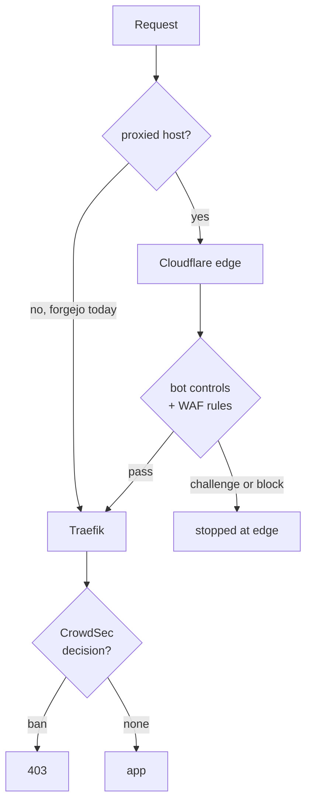

# Crawler defence at the Cloudflare edge

Status: approved, not started
Date: 2026-09-06 (revised the same day)
Author: Viktor Barzin (design worked through with Claude)

## Goal

Stop AI crawler swarms without maintaining a hand-curated list of one vendor's
address space, and with as little code of our own as possible.

## What changed, and why this document was rewritten

The first version of this design assumed Cloudflare was unavailable to us and
proposed building a Turnstile challenge into our first-party Traefik plugin.
Two measurements overturned that premise, and the design is much smaller as a
result.

**We already proxy almost everything.** Proxied hostnames ride a zone-wide `*`
wildcard CNAME through cloudflared, so `cloudflare_proxied_names = []` means no
per-name records are needed rather than nothing being proxied. Public DNS
confirms it:

| host | resolves to | proxied |
|---|---|---|
| blog, homepage, cyberchef | 172.67.130.8, 104.21.3.16 | yes |
| forgejo | 176.12.22.76 (our WAN IP) | no |

Forgejo is the exception, set explicitly at `stacks/forgejo/main.tf:472`, and it
is where the crawlers go: 22,115 of 22,189 Meta requests and 460 of 464 OpenAI
requests in 24h.

**The size cap that keeps Forgejo unproxied applies to uploads only.**
Cloudflare's free plan caps request bodies at 100 MB and does not limit response
size. Release downloads, one of the two reasons Forgejo was reverted to
non-proxied, were never affected.

**There is no out-of-band decision API.** Cloudflare has no endpoint that takes
request metadata we submit and returns a challenge or ban verdict. Their score
is computed from the TLS handshake and HTTP/2 fingerprint, which exist only on a
connection they terminate. Using their decisions means letting their edge see
the traffic.

## The edge as it stands today

Read live from the zone API on 2026-09-06. The zone is on the Free Website plan.

| setting | value |
|---|---|
| `fight_mode` (Bot Fight Mode) | **true**, already on |
| `enable_js` | true |
| `crawler_protection` | enabled |
| `ai_search` / `ai_training` / `ai_user` | **all disabled** |
| `ai_bots_protection` | disabled, migrated into `crawler_protection` |
| `is_robots_txt_managed` / `cf_robots_variant` | true / **off** |
| WAF custom rules | 1, disabled (a skip rule); 4 of 5 free slots unused |

We already have the machinery. The dials are off. Note that
`ai_bots_protection` had been recorded as enabled at block; Cloudflare has since
reorganised these settings and ours are currently not acting.

## Design

Two layers, and we already own both.

**Edge, Cloudflare, no code.** Bot Fight Mode is running. Turning on the
`crawler_protection` categories makes it act on declared AI crawlers, and
`ai_search` is the category covering OpenAI's `OAI-SearchBot`. One WAF custom
rule with the Managed Challenge action covers declared crawler user-agents; the
free plan allows 5 rules with every action except Log. Managed robots.txt makes
Cloudflare publish and maintain the crawler directives so we never curate them.

**Origin, CrowdSec, already built.** Unchanged. It catches what the edge
misses, covers non-proxied hosts, and remains the enforcement path for our own
scenarios.

### Forgejo

Enable SSH on Forgejo, move git remotes to it, then proxy the hostname. SSH
bypasses Cloudflare entirely, so the 100 MB upload cap stops mattering for git,
and the crawled web surface gains the same edge protection as every other host.

Forgejo traffic is overwhelmingly the surface that benefits:

| forgejo, 24h | requests | share |
|---|---|---|
| web commit pages | 165,359 | 57% |
| web other | 81,992 | 28% |
| raw file | 19,565 | 6.7% |
| blame | 15,449 | 5.3% |
| API | 4,037 | 1.4% |
| git protocol | 3,413 | 1.2% |
| release downloads | 0 | 0% |

## What this removes from the previous design

- The custom Turnstile verification inside the Traefik plugin, roughly 200 lines
  ported from upstream plus a template. No longer needed.
- The Turnstile widget and hostname registration chore, which would have meant
  listing ~110 hosts by hand across at least 11 widgets.
- The restored `captcha_remediation` CrowdSec profile, which only made sense if
  we were building our own challenge.

The `/64` crawl detector is not deleted but drops down the list. It still has
value for undeclared crawlers that clear the edge, and it is the fallback if the
declared user-agents disappear again. Revisit it once we can see what the edge
actually stops.

## Decisions taken

| Decision | Choice |
|---|---|
| Where challenge decisions are made | Cloudflare's edge, for every proxied host |
| Custom challenge code | None. The previous plugin-based Turnstile layer is dropped |
| Edge controls to enable | `crawler_protection` AI categories, a WAF Managed Challenge rule, managed robots.txt |
| Forgejo | Enable SSH, move remotes, then proxy the hostname |
| CrowdSec | Keep as-is, behind the edge |
| Static AS32934 list | Retire once the edge is proven, not before |

## Sequence

1. **Turn on the three edge controls.** Proxied hosts only, immediate, no code.
2. **Enable SSH on Forgejo** and move remotes on this box, in CI and in
   Woodpecker.
3. **Proxy `forgejo.viktorbarzin.me`.**
4. **Watch what the edge stops**, then decide whether the `/64` detector is
   still worth building.
5. **Retire the 117-range static blocklist.**

## Risks

**Bot Fight Mode is already on and is known to challenge legitimate automated
clients.** Proxying Forgejo brings our own API consumers, CI and agent traffic
under it for the first time. This is the most likely source of breakage and the
reason step 3 follows step 2 rather than leading.

**The API still goes over HTTPS.** SSH fixes git push, but release asset uploads
and LFS over HTTPS stay under the 100 MB cap once Forgejo is proxied. We
observed zero release downloads in 24h, and did not manage to measure our
largest upload, so this is a known unknown rather than a measured risk.

**Free-plan WAF rules have no regex support.** Matching is limited to operators
such as `contains`, which is enough for user-agent matching but constrains
anything more precise.

**Cloudflare will see Forgejo traffic**, including repository paths, once it is
proxied. That is a deliberate trade rather than an oversight.

**Retiring the static list is still the step that can regress.** It is currently
responsible for 100% of Meta blocking.

**Traefik is still being OOMKilled.** `traefik-7bb4fbfd4b-n6f9j` at
2026-09-05T17:35:44Z and `error-pages` 39 seconds later, both after the 768Mi to
1536Mi raise. Forgejo also served 106,664 requests ending in status 499 and
2,948 in 504 over 24h. That load problem is separate from crawler blocking and
is not addressed by anything in this document.

## Open questions

- Our largest HTTPS request body to Forgejo. Needed to judge the 100 MB cap
  against real usage; the log query for it did not return a usable sample.
- What share of Forgejo's 258,634 external requests in 24h are not the two
  crawlers we have identified. Sampling gave conflicting answers and the
  question deserves its own measurement.
- Whether Bot Fight Mode's false-positive rate is acceptable for a git host. No
  way to know before enabling it, which is why step 3 is separated from step 1.
