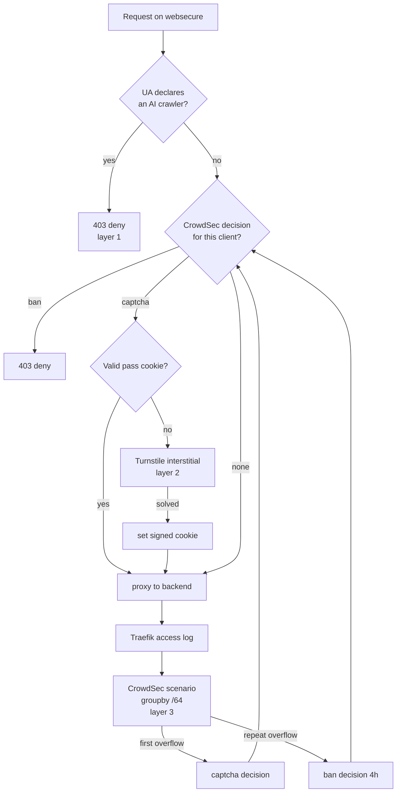

# Native crawler defence: UA deny, a real captcha, and /64 crawl detection

Status: approved, not started  
Date: 2026-09-06  
Author: Viktor Barzin (design worked through with Claude)

## Goal

Stop AI crawler swarms without maintaining a hand-curated list of one vendor's
address space. Today Meta is held off by a static blocklist of 117 ranges
derived from AS32934's announced prefixes. That list is effective against Meta
and covers no other crawler. This design replaces it with three layers that
generalise, and retires the list once they are proven.

## What we measured first

All figures are from our own Traefik access logs in Loki, trailing 24h, read on
2026-09-06.

| Meta traffic (`2a03:2880::/32`) | count |
|---|---|
| requests blocked (403) | 22,187 |
| requests served (200) | 1 |
| distinct source addresses | 393 |
| share of all Traefik 403s | 95.5% (22,187 of 23,222) |

Two findings changed the design.

**The swarm is six times wider than at the incident.** On 2026-09-02 we counted
61 to 63 distinct addresses. There are now 393. Per-address request rate falls
correspondingly, which reinforces the earlier measurement that no per-IP
threshold can separate this crawler from a human.

**It declares itself now.** 21,804 of 22,189 requests (98.3%) carry `meta-
externalagent/1.1` appended to an otherwise ordinary Chrome user-agent. On
2026-09-02 it sent plain spoofed Chrome and named itself nowhere. This is a
change in the crawler's behaviour, not a correction of the earlier measurement.

A 7-day window could not be computed: the query scans roughly 24 million log
lines and Loki does not return it within our timeout. Everything above is the
24h window only.

We also confirmed that `meta-externalagent` is already denied by the Anubis
policy running on seven content sites, through `(data)/bots/ai-catchall.yaml`.
Forgejo does not sit behind Anubis, which is why the crawl landed there. The
deny rule exists and runs on the seven content sites; Forgejo is not among the
hosts it covers.

## Open questions

- Whether the declared user-agent persists. If Meta drops it again, layer 1
stops carrying 98.3% of the volume and layer 3 becomes the load-bearing one.
- Whether the 24h window is representative. We could not compute 7 days.
- What the single 200 response was. One request in 24h reached a backend and we
have not identified it.

## The three layers

### Layer 1: deny declared AI crawlers by user-agent

A new deny in the first-party Traefik plugin, matching the same user-agent set
Anubis already denies. It runs on the `websecure` entrypoint alongside the
existing CrowdSec middleware, so it covers all ~110 public hosts including those
that bypass `ingress_factory`.

Covers 98.3% of current Meta volume and every other crawler that names itself.
It does not address a crawler that declines to declare itself, which is what
layer 3 covers.

### Layer 2: a captcha that is actually enforced

Cloudflare Turnstile, verified server-side inside the plugin. Turnstile is a
client-side widget plus a server-side verify call, so no traffic is proxied
through Cloudflare and the 100MB request-body cap that rules out proxying does
not apply here.

Feasibility is settled by code we already run: the plugin makes outbound HTTPS
calls today (`http.NewRequest`, `client.Do`) to poll the LAPI decision snapshot
every 30s, and writes its own responses. Yaegi supports what a Turnstile verify
needs.

A pass is remembered in an HMAC-signed cookie carrying the client IP and an
expiry. No server-side state, no Redis on the request path, and it works across
all three Traefik replicas without coordination.

This restores the `captcha_remediation` profile removed on 2026-09-02. That
profile was removed because nothing enforced the decisions it produced: four
scenarios kept firing and each decision was discarded. The ordering matters, so
the profile is restored only after the plugin enforces captcha.

Scenarios routed to captcha: `http-429-abuse`, `http-403-abuse`,
`http-crawl-non_statics`, `http-sensitive-files`. Confident scenarios (CVE
exploits, probing) keep a hard ban.

### Layer 3: crawl detection grouped by /64

Generalise `viktor/forgejo-crawl-slow` by dropping its forgejo-router filter so
it runs on every host, and group by the IPv6 /64 rather than the full address.

Verified against CrowdSec's source rather than assumed:

- `IpToRange(ip, cidr)` is an expr helper (`pkg/exprhelpers/expr_lib.go`), so
`groupby: 'IsIPV6(evt.Meta.source_ip) ? IpToRange(evt.Meta.source_ip, "/64") :
evt.Meta.source_ip'` is expressible.
- A scenario declaring `scope: {type: Range, expression: ...}` produces a
Range-scoped alert (`pkg/leakybucket/overflows.go`). Our `profiles.yaml` already
has `default_range_remediation` filtering on `Alert.GetScope() == "Range"`, and
the Traefik plugin already enforces scope Range.
- `GetDecisionsSinceCount(value, since)` is an expr helper, so escalation needs
no state we do not already keep.

Remediation escalates: the first overflow for a /64 issues a captcha decision, a
repeat overflow issues a 4h ban. Expressed as two scenarios differing only in an
`overflow_filter` on `GetDecisionsSinceCount`.

A single IPv6 /64 is one customer allocation, the IPv4-address equivalent, so
grouping on it is not a range ban in the sense the individual-IP rule was
written to prevent. IPv4 sources stay per-address.

## Decisions taken

| Decision | Choice |
|---|---|
| Scope | Every public HTTP host, at the websecure entrypoint |
| Human friction | Invisible unless the client is already flagged |
| Captcha vendor | Turnstile acceptable; widget only, nothing proxied |
| Captcha purpose | Both a softer response to bots and an escape hatch for false positives |
| Non-browser clients | Never challenge non-GET methods, git protocol paths, `/api/`, or well-known paths |
| Failure mode | Fail open, and alert to Slack #alerts |
| Ban unit | Automatic /64 for IPv6; IPv4 stays per-address |
| Decision lifetime | Captcha long-lived and cheap to clear; hard ban stays 4h |
| Pass state | HMAC-signed cookie, no server-side storage |
| Static AS32934 list | Retire once the three layers are proven, not before |
| Rollout | Enforce on deploy rather than a dryRun period |

## Sequence

1. **robots.txt for Forgejo.** It currently 404s. Meta documents that `meta-
externalagent` honours robots.txt. Publish it because it is correct to publish,
and treat any volume reduction as a bonus rather than a control. 2. **Layer 1,
the UA deny.** Covers 98.3% of current volume. 3. **Layer 2, the captcha.**
Plugin work plus the Turnstile secret in Vault, then restore the
`captcha_remediation` profile. 4. **Layer 3, the /64 crawl detector.** Depends
on layer 2 existing, because captcha-first is what makes it safe to run on every
host. 5. **Retire the 117-range static blocklist** and watch whether Meta volume
returns.

## Risks

**Enforcing without a dryRun period.** The generalised crawl rule fires on any
client fetching 10 distinct pages faster than one per 120s, across every host.
Captcha-first is the mitigation: a fast human reader clicks once and continues
rather than losing the site for 4h. If the rule proves noisy in practice, the
lever is its capacity and leakspeed, not a return to banning.

**Dependence on a declared user-agent.** Layer 1 carries most of the volume
today only because the crawler is currently honest. Layer 3 is what remains if
that changes, which is the argument for building it rather than stopping at
layer 1.

**Turnstile is a third-party dependency on a free tier.** Fail-open means an
outage at Cloudflare degrades the defence rather than the site.

**Retiring the static list is the step that can regress.** It comes last, and
Meta volume in Loki is the measurement that says whether it was safe.
