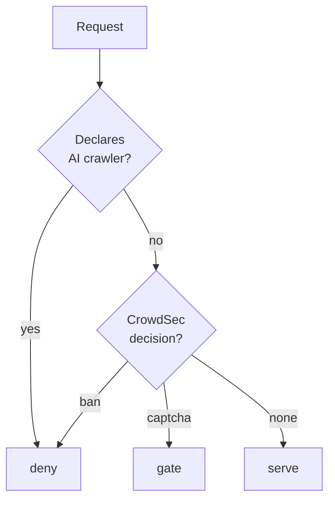
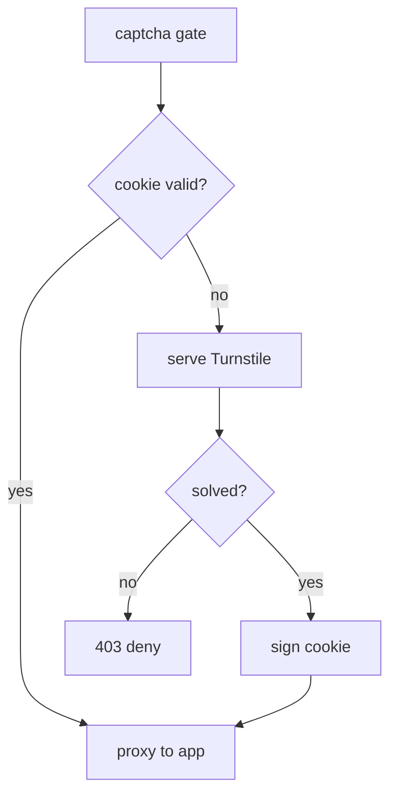
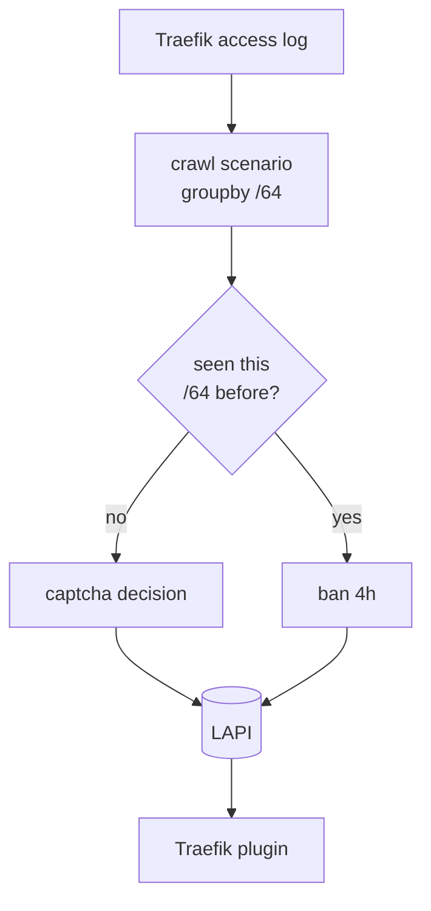

# Native crawler defence: UA deny, a real captcha, and /64 crawl detection

Status: approved, not started  
Date: 2026-09-06  
Author: Viktor Barzin (design worked through with Claude)

## Goal

Stop AI crawler swarms without maintaining a hand-curated list of one vendor's
address space. Today Meta is held off by a static blocklist of 117 ranges
derived from AS32934's announced prefixes. That list is effective against Meta
and covers no other crawler. This design replaces it with three layers that
generalise, and retires the list once they are proven.

## What we measured first

All figures are from our own Traefik access logs in Loki, trailing 24h, read on
2026-09-06.

```stats
22,187 | Meta requests blocked
468 | OpenAI requests served
393 | distinct Meta addresses
98.3% | of Meta declares itself
```

| Meta traffic (`2a03:2880::/32`) | count |
|---|---|
| requests blocked (403) | 22,187 |
| requests served (200) | 1 |
| distinct source addresses | 393 |
| share of all Traefik 403s | 95.5% (22,187 of 23,222) |

Volume over six days, counted in per-day buckets because a single 7-day query
exhausts Loki:

| 24h window ending | total | blocked | served |
|---|---|---|---|
| 09-06 | 22,186 | 22,184 | 1 |
| 09-05 | 9,722 | 9,719 | 1 |
| 09-04 | 30,430 | 30,428 | 1 |
| 09-03 | 120,131 | 55,893 | 63,114 |
| 09-02 | 177,724 | 0 | 176,845 |
| 09-01 | 4,366 | 0 | 4,344 |
| **6-day total** | **364,559** | **118,224** | **244,306** |

09-02 is the incident. 09-03 is the cutover, with the blocklist landing mid-day.

Three findings shaped the design.

**The swarm is six times wider than at the incident.** On 2026-09-02 we counted
61 to 63 distinct addresses. There are now 393. Per-address request rate falls
correspondingly, which reinforces the earlier measurement that no per-IP
threshold can separate this crawler from a human.

> [!IMPORTANT]
> The crawler's behaviour changed between the incident and this measurement.
> Layer 1 carries 98.3% of the volume only while it keeps declaring itself.

**It declares itself now.** 21,804 of 22,189 requests (98.3%) carry
`meta-externalagent/1.1` appended to an otherwise ordinary Chrome user-agent.
On 2026-09-02 it sent plain spoofed Chrome and named itself nowhere. This is a
change in the crawler's behaviour, not a correction of the earlier measurement.

> [!WARNING]
> **A second crawler is getting through right now.** OpenAI's `OAI-SearchBot/1.4`
> received **468 responses with status 200** in the same 24h window, against a
> single 403, across 18 addresses in AS8075, almost all of it on Forgejo. It
> declares itself exactly as Meta does. Meta is blocked because its address space
> is on the static list and OpenAI's is not, which is the clearest available
> argument for layer 1: a rule keyed on the declaration covers both without
> anyone curating a second address list.

`OAI-SearchBot` is already named in Anubis's `(data)/crawlers/ai-search.yaml`,
which `ai-block-aggressive.yaml` imports, so layer 1 as designed covers it with
no extra work.

We also confirmed that `meta-externalagent` is already denied by the Anubis
policy running on seven content sites, through `(data)/bots/ai-catchall.yaml`.
Forgejo does not sit behind Anubis, which is why the crawl landed there. The
deny rule exists and runs on the seven content sites; Forgejo is not among the
hosts it covers.

### What is doing the blocking today

The static blocklist accounts for all 118,224 Meta 403s on its own: every one
of the 392 observed Meta addresses falls inside `2a03:2880::/32`. The
`viktor/forgejo-crawl-slow` scenario has produced 41 alerts across 28 addresses
all-time, of which the 14 on AS32934 were redundant with the static list. Its
load-bearing output is the 25 alerts on AS8075, where it bans OpenAI's bot and
the bot returns each time the ban lapses, eight times since 09-03.

So the scenario is not currently what stops Meta, and the earlier reading that
it was catching Meta natively was measuring a redundant ban.

## Open questions

- Whether the declared user-agent persists. If Meta drops it again, layer 1
stops carrying 98.3% of the volume and layer 3 becomes the load-bearing one.
- Whether the 24h window is representative. We could not compute 7 days.
- What the single 200 response was. One request in 24h reached a backend and we
have not identified it.

## The three layers



Layer 1 is the `UA` test. The captcha gate is layer 2:



Layer 3 is the feedback loop that produces the CrowdSec decision:



### Layer 0: a host-wide rate limit as a safety net

Traefik 3.4 added Redis-backed distributed rate limiting, so a limit shared
across all three replicas is configuration rather than code. We run 3.7.1 and a
Redis stack is already in the cluster.

A limit on the Forgejo router with `sourceCriterion: requestHost` counts every
request to the forge in one bucket, which makes it the only lever here that does
not care how many source addresses a crawler spreads across. Set well above
human use, it never fires for a person and caps any crawler's total draw. On its
own it would have prevented the September outage, which was resource exhaustion
rather than the crawl itself.

It does not identify or stop a crawler, so it complements the layers below
rather than replacing them.

### Layer 1: deny declared AI crawlers by user-agent

A new deny in the first-party Traefik plugin, matching the same user-agent set
Anubis already denies. It runs on the `websecure` entrypoint alongside the
existing CrowdSec middleware, so it covers all ~110 public hosts including those
that bypass `ingress_factory`.

Covers 98.3% of current Meta volume and every other crawler that names itself.
It does not address a crawler that declines to declare itself, which is what
layer 3 covers.

### Layer 2: a captcha that is actually enforced

Cloudflare Turnstile, verified server-side inside the plugin. Turnstile is a
client-side widget plus a server-side verify call, so no traffic is proxied
through Cloudflare and the 100MB request-body cap that rules out proxying does
not apply here.

Feasibility is settled by code we already run: the plugin makes outbound HTTPS
calls today (`http.NewRequest`, `client.Do`) to poll the LAPI decision snapshot
every 30s, and writes its own responses. Yaegi supports what a Turnstile verify
needs.

A pass is remembered in an HMAC-signed cookie carrying the client IP and an
expiry. No server-side state, no Redis on the request path, and it works across
all three Traefik replicas without coordination.

This deliberately differs from the upstream `crowdsec-bouncer-traefik-plugin`,
which stores a pass as a cache entry keyed on the client IP alone
(`remoteIP+"_captcha"`, 1800s default) with no cookie. That design frees every
client behind a shared NAT once one of them solves, and re-challenges a visitor
who lands on a different Traefik replica unless the cache points at Redis. The
signed cookie avoids both.

Porting cost from upstream, if we take that route: `pkg/captcha/captcha.go` is
166 lines, the interstitial template is 338 (mostly inlined CSS), and the wiring
is 13 lines. Turnstile's free tier is unlimited verifications but caps at 20
widgets per account and 10 hostnames per widget, which needs planning against
~110 hosts.

Turnstile is confirmed free against Cloudflare's own plans page: unlimited
challenges and verification requests, no billing account, capped at 20 widgets
per account and 10 hostnames per widget. That is 200 hostname slots against our
~110 hosts. The free plan has no "any hostname" option, so **every public host
must be enumerated in a widget by hand**, and a host added without registering
it will fail the challenge. This is a known ongoing cost, accepted deliberately;
if it becomes a source of drift, Anubis below is the fallback.

> [!NOTE]
> The alternative considered and not chosen. **Anubis in subrequest-auth mode** (`TARGET=" "` plus a
> `status_codes` override) turns the Anubis we already run into a challenge
> sidecar, adds no vendor, and brings a no-JS `metarefresh` path that no token
> provider offers; the handoff back to Traefik has no documented precedent, so
> we would be designing it. **Altcha** is MIT, self-hosted, and verifies an HMAC
> in-process with no outbound call at all, at roughly 40 lines. Viktor's call:
> use Cloudflare while it is genuinely free, and fall back to the Anubis stack
> otherwise.

This restores the `captcha_remediation` profile removed on 2026-09-02. That
profile was removed because nothing enforced the decisions it produced: four
scenarios kept firing and each decision was discarded. The ordering matters, so
the profile is restored only after the plugin enforces captcha.

Scenarios routed to captcha: `http-429-abuse`, `http-403-abuse`,
`http-crawl-non_statics`, `http-sensitive-files`. Confident scenarios (CVE
exploits, probing) keep a hard ban.

### Layer 3: crawl detection grouped by /64

Generalise `viktor/forgejo-crawl-slow` by dropping its forgejo-router filter so
it runs on every host, and group by the IPv6 /64 rather than the full address.

Verified against CrowdSec's source rather than assumed:

- `IpToRange(ip, cidr)` is an expr helper (`pkg/exprhelpers/expr_lib.go`), so
`groupby: 'IsIPV6(evt.Meta.source_ip) ? IpToRange(evt.Meta.source_ip, "/64") :
evt.Meta.source_ip'` is expressible.
- A scenario declaring `scope: {type: Range, expression: ...}` produces a
Range-scoped alert (`pkg/leakybucket/overflows.go`). Our `profiles.yaml` already
has `default_range_remediation` filtering on `Alert.GetScope() == "Range"`, and
the Traefik plugin already enforces scope Range.
- `GetDecisionsSinceCount(value, since)` is an expr helper, so escalation needs
no state we do not already keep.

Remediation escalates: the first overflow for a /64 issues a captcha decision, a
repeat overflow issues a 4h ban. Expressed as two scenarios differing only in an
`overflow_filter` on `GetDecisionsSinceCount`.

A single IPv6 /64 is one customer allocation, the IPv4-address equivalent, so
grouping on it is not a range ban in the sense the individual-IP rule was
written to prevent. IPv4 sources stay per-address.

## Decisions taken

| Decision | Choice |
|---|---|
| Scope | Every public HTTP host, at the websecure entrypoint |
| Human friction | Invisible unless the client is already flagged |
| Captcha vendor | Turnstile acceptable; widget only, nothing proxied |
| Captcha purpose | Both a softer response to bots and an escape hatch for false positives |
| Non-browser clients | Never challenge non-GET methods, git protocol paths, `/api/`, or well-known paths |
| Failure mode | Fail open, and alert to Slack #alerts |
| Ban unit | Automatic /64 for IPv6; IPv4 stays per-address |
| Decision lifetime | Captcha long-lived and cheap to clear; hard ban stays 4h |
| Pass state | HMAC-signed cookie, no server-side storage |
| Static AS32934 list | Retire once the three layers are proven, not before |
| Rollout | Enforce on deploy rather than a dryRun period |
| Host-wide rate limit | Add it, Redis-backed, keyed on `requestHost`, set above human use |
| Challenge provider | Turnstile while its free tier holds; Anubis subrequest-auth as the fallback |

## Sequence

1. **Layer 0, the Redis-backed rate limit.** Configuration only, and it closes
   the outage failure mode independently of everything below.
2. **robots.txt for Forgejo.** It currently 404s. Meta documents that
   `meta-externalagent` honours robots.txt. Publish it because it is correct to
   publish, and treat any volume reduction as a bonus rather than a control.
3. **Layer 1, the UA deny.** Covers 98.3% of current volume.
4. **Layer 2, the captcha.** Plugin work plus the Turnstile secret in Vault,
   then restore the `captcha_remediation` profile.
5. **Layer 3, the /64 crawl detector.** Depends on layer 2 existing, because
   captcha-first is what makes it safe to run on every host.
6. **Retire the 117-range static blocklist** and watch whether Meta volume
   returns.

## Risks

**Enforcing without a dryRun period.** The generalised crawl rule fires on any
client fetching 10 distinct pages faster than one per 120s, across every host.
Captcha-first is the mitigation: a fast human reader clicks once and continues
rather than losing the site for 4h. If the rule proves noisy in practice, the
lever is its capacity and leakspeed, not a return to banning.

**Dependence on a declared user-agent.** Layer 1 carries most of the volume
today only because the crawler is currently honest. Layer 3 is what remains if
that changes, which is the argument for building it rather than stopping at
layer 1.

**Turnstile is a third-party dependency on a free tier.** Fail-open means an
outage at Cloudflare degrades the defence rather than the site.

**Retiring the static list is the step that can regress.** It comes last, and
Meta volume in Loki is the measurement that says whether it was safe. It is
currently responsible for 100% of Meta blocking, so this step has the least
margin in the plan.

**A captcha may not stop a determined crawler.** Codeberg, a Forgejo host with
the same git-history crawling problem, reported in August 2025 that many AI
scrapers had learned to solve Anubis proof-of-work challenges after months of it
working. Commercial solver services advertise support for Turnstile, hCaptcha
and reCAPTCHA, though those are vendor claims about their own success rates. No
public measurement establishes what fraction of undeclared crawlers execute
JavaScript, so whether our specific swarm would solve or turn away is not
settled either way. This is the reason the captcha is scoped as an escape hatch
for false positives rather than as the defence.

**Traefik is still being OOMKilled.** `traefik-7bb4fbfd4b-n6f9j` was OOMKilled
at 2026-09-05T17:35:44Z and `error-pages` 39 seconds later, both after the
768Mi to 1536Mi raise. That is a separate open problem from crawler blocking,
and it means the failure mode from the September incident has not been closed by
the memory increase alone.
