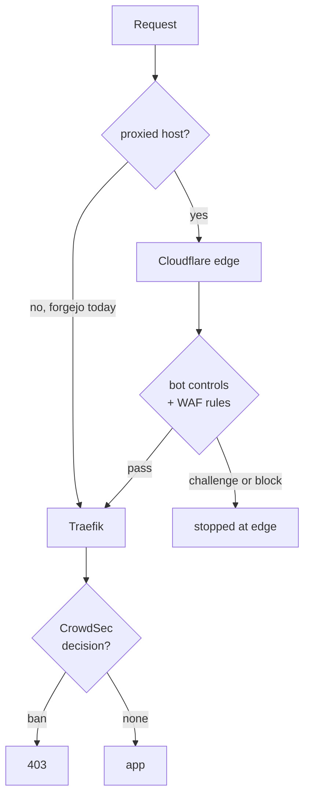

# Crawler defence at the Cloudflare edge

Status: approved, not started
Date: 2026-09-06 (revised the same day)
Author: Viktor Barzin (design worked through with Claude)

## Goal

Stop AI crawler swarms across **every host we run**, without maintaining a
hand-curated list of one vendor's address space, and with as little code of our
own as possible.

Scope is the whole estate, not one service. The edge controls below are
zone-wide and cover all ~110 proxied hosts the moment they are enabled. Forgejo
appears often in this document only because it is the single public HTTP host
currently outside that coverage, so it needs work to join. The handful of
non-HTTP names (`turn`, `vpn`, `xray-reality`) cannot be covered by Cloudflare
at all and stay with CrowdSec and the firewall bouncer, as today.

| surface | covered by |
|---|---|
| ~110 proxied HTTP hosts | Cloudflare edge, from step 1 |
| forgejo | Cloudflare edge, from step 3 |
| non-HTTP names, internal `.lan` | CrowdSec + firewall bouncer, unchanged |

## What changed, and why this document was rewritten

The first version of this design assumed Cloudflare was unavailable to us and
proposed building a Turnstile challenge into our first-party Traefik plugin.
Two measurements overturned that premise, and the design is much smaller as a
result.

**We already proxy almost everything.** Proxied hostnames ride a zone-wide `*`
wildcard CNAME through cloudflared, so `cloudflare_proxied_names = []` means no
per-name records are needed rather than nothing being proxied. Public DNS
confirms it:

| host | resolves to | proxied |
|---|---|---|
| blog, homepage, cyberchef | 172.67.130.8, 104.21.3.16 | yes |
| forgejo | 176.12.22.76 (our WAN IP) | no |

Forgejo is the exception, set explicitly at `stacks/forgejo/main.tf:472`, and it
is where the crawlers go: 22,115 of 22,189 Meta requests and 460 of 464 OpenAI
requests in 24h.

**The size cap that keeps Forgejo unproxied applies to uploads only.**
Cloudflare's free plan caps request bodies at 100 MB and does not limit response
size. Release downloads, one of the two reasons Forgejo was reverted to
non-proxied, were never affected.

**There is no out-of-band decision API.** Cloudflare has no endpoint that takes
request metadata we submit and returns a challenge or ban verdict. Their score
is computed from the TLS handshake and HTTP/2 fingerprint, which exist only on a
connection they terminate. Using their decisions means letting their edge see
the traffic.

## The edge as it stands today

Read live from the zone API on 2026-09-06. The zone is on the Free Website plan.

| setting | value |
|---|---|
| `fight_mode` (Bot Fight Mode) | **true**, already on |
| `enable_js` | true |
| `crawler_protection` | enabled |
| `ai_search` / `ai_training` / `ai_user` | **all disabled** |
| `ai_bots_protection` | disabled, migrated into `crawler_protection` |
| `is_robots_txt_managed` / `cf_robots_variant` | true / **off** |
| WAF custom rules | 1, disabled (a skip rule); 4 of 5 free slots unused |

We already have the machinery. The dials are off. Note that
`ai_bots_protection` had been recorded as enabled at block; Cloudflare has since
reorganised these settings and ours are currently not acting.

## Design

Two layers, and we already own both.

**Edge, Cloudflare, no code.** Turning on the `crawler_protection` categories
makes the edge act on declared AI crawlers across every proxied host.
Cloudflare defines the categories as Search ("crawlers that collect or index
your content to answer questions about it later"), Agent ("automated activity
acting in real time on a person's behalf") and Training. Whether OpenAI's
`OAI-SearchBot` is classified Search is not yet verified. One WAF custom rule
with the Managed Challenge action covers declared crawler user-agents; the free
plan allows 5 rules with every action except Log, and no regex. Managed
robots.txt makes Cloudflare publish and maintain the crawler directives so we
never curate them.

**Bot Fight Mode stays on.** It is running today, and on the free plan it is the
only control that detects undeclared automation. Cloudflare describes it as
catching "simple bots from cloud hosting providers and headless browsers". The
paid detection that would do this better, bot score and JA3/JA4 fingerprinting,
requires Enterprise with Bot Management, so on our plan Bot Fight Mode is the
detector for exactly the crawl shape Meta used on 2026-09-02, when it declared
itself nowhere.

It carries a real constraint. Cloudflare documents that "You cannot bypass or
skip Bot Fight Mode using WAF custom rules or Page Rules", that exceptions "for
example, your own API clients or monitoring tools" require Super Bot Fight Mode
(Pro and above), that JavaScript Detections "is automatically enabled and cannot
be disabled", and that these products "may challenge API or mobile app traffic".

That constraint does not bite here, because split DNS keeps our own automation
off the edge entirely:

| client | resolves `forgejo.viktorbarzin.me` to |
|---|---|
| in-cluster pods (Woodpecker, agent service) | 10.111.111.95, the service IP |
| devvm and WireGuard clients | 10.0.20.203, the internal Traefik LB |
| external clients | the public record |

Woodpecker, the agent service, the devvm and anything arriving over WireGuard
reach Forgejo without a Cloudflare hop. Proxying the public name exposes only
genuinely external traffic to Bot Fight Mode, which is crawlers, search engines
and occasional human browsing.

An earlier revision of this document proposed disabling Bot Fight Mode to
protect our own API clients. That reasoning did not survive checking where those
clients actually resolve.

The residual risk is that we cannot enumerate every external automated client,
and if one is challenged there is no exception mechanism on this plan. That is
accepted as smaller than losing the only detector we have for crawlers that do
not declare themselves.

### Forgejo

Enable SSH on Forgejo, move git remotes to it, then proxy the hostname. SSH
bypasses Cloudflare entirely, so the 100 MB upload cap stops mattering for git,
and the crawled web surface gains the same edge protection as every other host.

Forgejo traffic is overwhelmingly the surface that benefits:

| forgejo, 24h | requests | share |
|---|---|---|
| web commit pages | 165,359 | 57% |
| web other | 81,992 | 28% |
| raw file | 19,565 | 6.7% |
| blame | 15,449 | 5.3% |
| API | 4,037 | 1.4% |
| git protocol | 3,413 | 1.2% |
| release downloads | 0 | 0% |

## What this removes from the previous design

- The custom Turnstile verification inside the Traefik plugin, roughly 200 lines
  ported from upstream plus a template. No longer needed.
- The Turnstile widget and hostname registration chore, which would have meant
  listing ~110 hosts by hand across at least 11 widgets.
- The restored `captcha_remediation` CrowdSec profile, which only made sense if
  we were building our own challenge.

The `/64` crawl detector is not deleted but drops down the list. It still has
value for undeclared crawlers that clear the edge, and it is the fallback if the
declared user-agents disappear again. Revisit it once we can see what the edge
actually stops.

## Decisions taken

| Decision | Choice |
|---|---|
| Where challenge decisions are made | Cloudflare's edge, for every proxied host |
| Custom challenge code | None. The previous plugin-based Turnstile layer is dropped |
| Edge controls to enable | `crawler_protection` AI categories, a WAF Managed Challenge rule, managed robots.txt |
| Forgejo | Enable SSH, move **all** remotes including CI, then proxy the hostname |
| Bot Fight Mode | Keep enabled. The only free detector for undeclared crawlers, and split DNS keeps our own automation off the edge |
| CrowdSec | Keep as-is, behind the edge |
| Static AS32934 list | Retire once the edge is proven, not before |

## Sequence

1. **Turn on the three edge controls.** Bot Fight Mode stays as it is. Applies
   to all ~110 proxied hosts immediately, no code.
2. **Enable SSH on Forgejo** and move remotes on this box, in CI and in
   Woodpecker.
3. **Proxy `forgejo.viktorbarzin.me`.**
4. **Watch what the edge stops**, then decide whether the `/64` detector is
   still worth building.
5. **Retire the 117-range static blocklist.**

## Risks

**Bot Fight Mode cannot be excepted, and Forgejo joins it in step 3.** Split DNS
means our own automation never meets it, but any external automated client we
have not thought of would be challenged with no way to exempt it. The signal
would be an external integration failing after step 3, and the remedy is to
unproxy Forgejo again.

**The detection we most want is the detection we cannot buy.** Undeclared
crawlers are caught on this plan only by Bot Fight Mode's heuristics. Bot score
and JA3/JA4 fingerprinting need Enterprise with Bot Management. If Meta returns
in its 2026-09-02 form, declaring nothing, the edge may not stop it and the
CrowdSec `/64` detector becomes the thing that matters.

**The API still goes over HTTPS.** Moving every git remote to SSH takes git
entirely off the proxy, so neither the 100 MB cap nor the 100-second read
timeout applies to clone, fetch or push. Release asset uploads and LFS over
HTTPS remain under the 100 MB cap once Forgejo is proxied. We observed zero
release downloads in 24h and did not manage to measure our largest upload, so
this is a known unknown rather than a measured risk.

**Cloudflare's proxy read timeout is 100 seconds and Enterprise-only to raise.**
Cloudflare's own advice for long requests is a DNS-only subdomain. Moving CI
clones to SSH removes the exposure; leaving any git operation on HTTPS keeps
it.

**Free-plan WAF rules have no regex support.** Matching is limited to operators
such as `contains`, which is enough for user-agent matching but constrains
anything more precise.

**Cloudflare will see Forgejo traffic**, including repository paths, once it is
proxied. That is a deliberate trade rather than an oversight.

**Retiring the static list is still the step that can regress.** It is currently
responsible for 100% of Meta blocking.

**Traefik is still being OOMKilled.** `traefik-7bb4fbfd4b-n6f9j` at
2026-09-05T17:35:44Z and `error-pages` 39 seconds later, both after the 768Mi to
1536Mi raise. Forgejo also served 106,664 requests ending in status 499 and
2,948 in 504 over 24h. That load problem is separate from crawler blocking and
is not addressed by anything in this document.

## Open questions

- Our largest HTTPS request body to Forgejo. Needed to judge the 100 MB cap
  against real usage; the log query for it did not return a usable sample.
- What share of Forgejo's 258,634 external requests in 24h are not the two
  crawlers we have identified. Sampling gave conflicting answers and the
  question deserves its own measurement.
- Whether Bot Fight Mode's false-positive rate is acceptable for a git host. No
  way to know before enabling it, which is why step 3 is separated from step 1.
