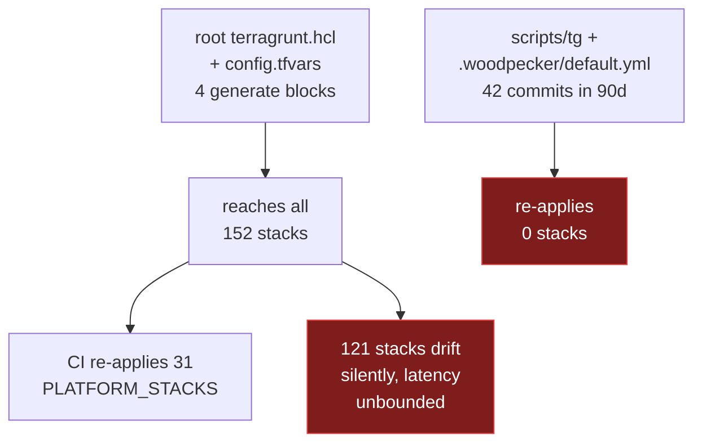
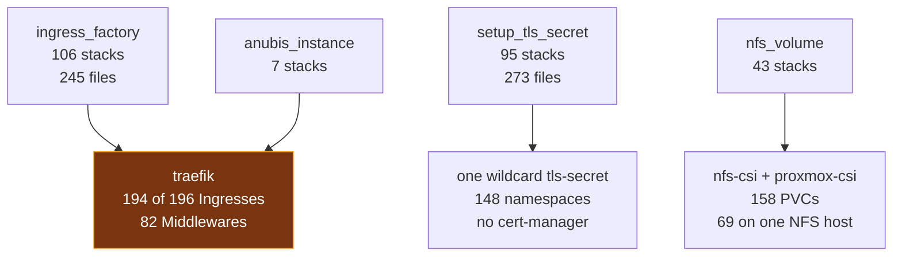
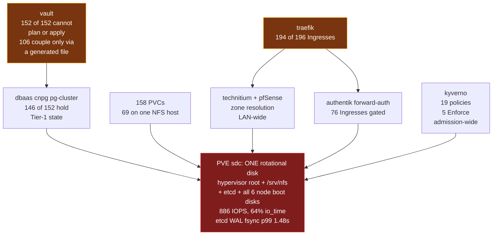

# Where this infra actually breaks, and the cheapest ten things worth building

Status: draft for review
Date: 2026-09-08
Scope: `/home/wizard/code/infra`, 152 stacks, 46 incidents 2026-03-06 to 2026-09-06
Method: 3 evidence agents, 16 option lanes, 178 candidate controls deduplicated to 134, 8 blind challenger passes on the top 8

---

## 1. The answer

The premise is refuted. Coupling is 3 of 46 incidents, and nothing is getting worse: the fix-commit ratio fell from 21.5% in February to 5.3% in the first week of September while commit volume quadrupled, and time-to-fix collapsed from days to 8-23 minutes.

What is actually wrong is narrower and more fixable. One live Kubernetes field collision in `svc/traefik` re-arms itself on every client-side apply and has already produced 178 minutes of total ingress loss across three episodes. Alongside it, CI runs `terragrunt apply` with no `validate` in front of it, and the fixer agent plans on Terraform 1.5.7 while CI runs 1.15.4.

Do first: fix the Traefik 443 collision. It is provable with one command, it is armed today, and it removes a fault rather than detecting one.

---

## 2. Is it getting worse? No

Plainly: no. The evidence refutes it, and I looked for a way to rescue the premise and could not find one.

| month | commits | fix-subject share | user-visible incidents |
|---|---:|---:|---:|
| 2026-02 | 325 | **21.5%** | not recorded |
| 2026-03 | 705 | 18.2% | 2 |
| 2026-04 | 865 | 13.2% | 3 |
| 2026-05 | 773 | 6.6% | 4 |
| 2026-06 | 798 | 11.8% | 7 |
| 2026-07 | 548 | 12.6% | 3 |
| 2026-08 | 525 | 12.2% | 4 |
| 2026-09 (7d) | 396 | **5.3%** | 3 |

Absolute user-visible incidents per month: 2, 3, 4, 7, 3, 4, 3. Flat, on 2,074 commits to master in 90 days.

### What changed instead

Time-to-fix, by an order of magnitude, on the same repo and the same team.

| period | representative fixes |
|---|---|
| spring 2026 | blog down 6 days, Anubis applies failing 17 days, NFS CSI 47h, nodes unrebooted 6 days |
| Aug-Sep 2026 | frigate 10 min then 8 min, tailnet 12 min, forgejo edge revert 23 min |

That is the fixer-agent and issue-dispatch path working, and it is the single clearest improvement in the window.

### Where the feeling of "worse" comes from, honestly

Three real effects, none of them a rising defect rate.

1. **More of everything.** 2,074 commits in 90 days, roughly 25 a day, about half carrying a Claude co-author trailer. More changes means more applies and more chances to notice one.
2. **The recording apparatus improved mid-window.** March to June is recorded almost entirely in post-mortems, which get written for incidents someone judged worth one. July to September is recorded through commit archaeology and Forgejo issues, which catch much smaller things. A row like "a pipeline reported success having applied nothing" would never have earned a post-mortem in March, and four of the six September rows are that size. The per-100-commit rate looks 2x higher in summer for this reason, and I cannot separate the two effects with the sources available.
3. **The `broken` label overcounts by about 3x.** 20 of the 31 `broken`-labelled Forgejo issues are synthetic fixer drills from 2026-08-26 to 2026-08-28. Anyone reading that label as an incident rate is reading three times the real number.

### One correction to the count, stated loudly

`evidence-outages.md` is missing the largest user-visible outage in the window. On 2026-09-01, Traefik helm revision 75 corrupted `Service.spec.ports` on the TCP/443 merge key and all 196 Ingresses refused connections for **169 minutes**, with the apply green and every pod Ready. Two adjacent occurrences of the identical fault are also uncounted: revision 72 on 2026-08-31 and revision 76 on 2026-09-03. There is no post-mortem file. A third missing row: `stacks/learning` carried `wait_until_bound` inside a PVC spec block and was unplannable for 18 days, with `learn.viktorbarzin.me` serving an Ingress pointing at a Service with no endpoints.

So the count is at least 46, not 43. This matters for ranking, because roughly a dozen candidates rest on those rows.

---

## 3. What actually breaks, and how you find out

### The six buckets

| bucket | count | share | what it is here |
|---|---:|---:|---|
| runtime-dependency | 15 | 35% | shared NFS, one GPU, one MySQL at 80 connections, one Redis, one PG, DNS, the ingress chain. Cluster coupling, not repo coupling |
| drift | 7 | 16% | Terraform, Keel, Kyverno, MetalLB and Reloader writing the same fields |
| upgrade | 7 | 16% | unpinned charts, floating tags, auto-updaters, kernel and k8s bumps |
| pipeline | 7 | 16% | change-detection defects. Mostly "the change silently did not apply" |
| config-typo | 4 | 9% | one stack, one blast radius |
| **shared-root** | **3** | **7%** | a shared module or root file edit reaching unrelated stacks |

The shared-root three all landed after 2026-07-01, all were silent, and detection was the slowest of any bucket at up to 17 days. Treat "this bucket is growing" as a hypothesis on three data points, not a finding.

`config-typo` at 4 of 46 understates the raw rate of plain mistakes, and the reason is selection: a typo `terraform plan` rejects never becomes an incident. The four that got here escaped because nothing validated them before CI or a user did.

### How they were found

| detected by | count |
|---|---:|
| a human noticing, or a user report | 13 |
| CI or a pipeline failing | 7 |
| the cluster-health checker | 4 |
| nightly drift detection | 4 |
| **a Prometheus alert that fired and was acted on** | **4** |
| a Forgejo issue filed by an agent or a person | 4 |
| found by accident, or by a deliberate drill | 3 |
| manual audit, or self-noticed while working | 3 |
| a purpose-built probe (`forgejo-integrity-probe`) | 1 |

Alerting found 4 of 46. The alert inventory is not thin at 375 definitions, so the gap is which conditions are covered, not whether alerting exists. Five watchdogs are deployed (whisker, t3, gpu-vram, the Kyverno post-boot reconcile, the fixer agent) and none caught an incident first, which is expected: each was built in response to a specific incident and is watching for its repeat.

### The number that ranks everything

Against 188 running workloads:

| coverage | count | share |
|---|---:|---:|
| generic alert within 5 min (`PodCrashLooping`) | 188 | 100%, one failure shape |
| generic alert within 30 min (`ReplicasMismatch`) | 188 | 100% |
| Uptime Kuma monitor | 134 of 157 hosts | 85% of hosts |
| hand-named down alert | 26 | 14% |
| blackbox probe target | 27 over 8 jobs | ~4% of hosts |
| nothing within an hour | 0 | 0% |
| **end-to-end functional probe** | **5** | **2.7%** |

Availability coverage is genuinely complete. What it measures is `spec.replicas - available > 0`, which is "the pod is not Ready", and **every incident in the window kept its pods Ready.** That is why long incidents were long: time-to-detect is the dominant term in nearly every one, and time-to-fix once someone knew is usually minutes.

The 6 in `evidence-safety-nets.md` is 5 today. Two of the six named probes have been suspended since 2026-08-16T14:10Z for per-run disk churn (`webterminal-probe` wrote ~13.2 GB/day, `aiostreams-stream-probe` ~3.9 GB/day, both from `apk add` on every invocation). A seventh the inventory missed, `vaultwarden-integrity-check`, is active and is the one backup job that reads its own output back.

### The real dependency graph



Apply time: what one edited file can reach, against what the pipeline re-applies. The `modules/`
fan-out that ADR-0023 added closed this hole for the four shared modules; the two root files sit in
the same regex and still take the narrow path.



The four shared modules and what each one reaches. Caller counts measured 2026-09-06 with the same
grep the pipeline uses.



The runtime singletons, and where they converge. Every edge into `sdc` is "runs on a VM whose disk
lives there" rather than a declared dependency, which is why no `dependency` block and no stack's
own Terraform mentions it. Two other edges are also invisible in the repo: Vault couples through the
generated `cloudflare_provider.tf`, which emits a `vault_kv_secret_v2` data source into every stack,
so 106 stacks depend on Vault without naming it; CNPG couples through `scripts/tg`, which fetches
the PG state credential for all 146 Tier-1 stacks.

Two edges in that graph appear in no `dependency` block and in most stacks' own Terraform. Vault couples through the generated `cloudflare_provider.tf`, which emits a `vault_kv_secret_v2` data source into every stack, so 106 stacks depend on Vault without naming it. CNPG couples through `scripts/tg`, which fetches the PG state credential for all 146 Tier-1 stacks.

The declared graph is inert and wrong. 231 `dependency` blocks exist across 143 stacks, all 231 carry `skip_outputs = true`, there is no `run --all` anywhere, and the whole `stacks/` tree holds 11 `output` blocks. Measured against reality: 146 stacks depend on `dbaas` for state and 1 declares it; 106 create Traefik objects and 2 declare `traefik`; 43 use `nfs_volume` and 0 declare `storage`; 40 declare `dependency "vault"` while using no Vault resource of their own.

### One host that no proposal in this study reaches

`sdc` on the Proxmox host is a single 10.7 TB rotational device behind a PERC H730 Mini carrying the hypervisor root, `/srv/nfs` (69 PVCs), pfSense, Home Assistant, the devvm, and all six k8s node boot disks including the one running etcd. Measured: 886 read+write IOPS against the 150-200 random IOPS a 7200rpm pair sustains, 64% `io_time`, queue depth 16.7, 38 ms read latency, etcd WAL fsync p99 1.48 s against etcd's own 10 ms guidance. Five incidents trace to it. Every `sdc` alert threshold is deliberately set above today's p99, and the rule comments say so: they detect a regression from this baseline, and this baseline is the problem.

---

## 4. The ranked table

### Scoring formula

```
score = incidents_caught / cost_units
cost_units = build_effort_points x ongoing_friction_multiplier

build_effort:  hours 1   days 3   weeks 10   months 40
friction:      none 1.0   per-change-seconds 1.3   per-change-minutes 2.0
               human-step 3.0   continuous-maintenance 4.0
```

Units are incidents caught per cost-unit, where one unit is roughly an hours-sized build with no recurring cost. Friction multiplies rather than adds because a per-change cost is paid on every one of ~25 commits a day, so it scales with throughput while build effort is paid once.

Two adjustments I applied after the challenge pass, and they are what reordered the list:

1. **Marginal-value discount.** If a deployed control already catches an incident at equal or better latency, the candidate scores zero on that row. This is what collapsed the original ranks 1 to 7. `IngressAllTargetsUnreachable` (live, `for: 2m`, backtested over 9,929 samples) already catches the Traefik class; `PodCrashLooping` at `for: 5m` and the 30-minute replica net already catch every pods-not-Ready row; `DriftStackErrored` (live since 2026-08-14) already catches the whole "this stack cannot be planned" class.
2. **False-positive cap.** A candidate that goes red on correct behaviour on arrival is capped until its floor is cleared. Three candidates fail this outright today, and the repo has already written down why it matters: turning 4 of 32 runs red for doing the right thing trains people to ignore red.

### Recalibrated top 20

`caught` is the post-challenge count. `in-repo` means the change lands in `infra`.

| # | control | caught | build | friction | layer | audience | in-repo |
|---:|---|---:|---|---|---|---|---|
| 1 | Remove the duplicate 443 key from `svc/traefik`, or take it off helm's client-side patch path | 3 | days | none | prevention | human | yes |
| 2 | Post-apply readback of `svc/traefik` ports in the apply shell | 2 | hours | per-change-seconds | detection | both | yes |
| 3 | `terragrunt validate` in `scripts/tg`'s existing pre-flight block | 3 | hours | per-change-seconds | prevention | both | yes |
| 4 | One Terraform and Terragrunt version everywhere, asserted by `required_version` | 1 | hours | none | prevention | both | yes |
| 5 | Give the existing page an actor: fixer notification path off the VIP, then dispatch on a total-outage critical | 2 | days | none | recovery | agent | yes |
| 6 | Call the image-ownership auditor the repo already has, before the apply loop | 2 | hours | per-change-seconds | prevention | both | yes |
| 7 | Make the Keel namespace exclusions actually hold | 2 | hours | none | prevention | both | yes |
| 8 | Per-tenant connection caps on the shared MySQL and Postgres, plus a reserved pool for the apply path | 1 | hours | none | prevention | both | yes |
| 9 | Blackbox probes on the 89 forward-auth hosts, tolerating the auth 302, failing only on 5xx | 1 | hours | per-change-seconds | detection | both | yes |
| 10 | Stop the Kuma sync accepting 400-499 on gated hosts, and add `forgejo /api/healthz` as a blackbox target | 1 | hours | none | detection | both | yes |
| 11 | Make `DriftUnaddressed` fire on the day it claims | 2 | hours | none | detection | human | yes |
| 12 | cgroup IO limits on the shared PVE spindle for NFS-serving and batch workloads | 2 | hours | none | prevention | both | no |
| 13 | Assert the pipeline applied what it selected | 3 | hours | per-change-seconds | detection | both | yes |
| 14 | Block an agent's push of Terraform nobody validated (provisioned PreToolUse hook) | 0 marginal | hours | per-change-seconds | prevention | agent | no |
| 15 | Give the three seatless GPU tenants a declared VRAM seat | 1 | hours | none | prevention | both | yes |
| 16 | Refuse a mutable image tag with `IfNotPresent` | 1 | hours | none | prevention | both | yes |
| 17 | Alert when a pending node reboot never happens, and publish its age | 1 | hours | none | detection | both | yes |
| 18 | Alert when the websecure entrypoint stops serving | 1 | hours | none | detection | both | yes |
| 19 | Static check that every Traefik middleware ref names a declared middleware | 1 | hours | per-change-seconds | prevention | both | yes |
| 20 | Extend the drill harness to shapes that keep pods Ready | 4 | days | none | detection | both | yes |

Rank 14 keeps its place despite zero marginal incidents over rank 3. It buys a shorter loop for the party writing roughly half the commits at ~25 a day, and the provisioned hook channel (7 hooks, both users, hourly, unit-tested) is the only agent-binding vehicle here that can intercept a command. Note the measured contrast: `--dry-run=server` appears twice in 1,847 transcripts despite being mandated in bold in `infra/.claude/CLAUDE.md`, while `zsh-guard.py` states the case in its own docstring ("memory cannot intercept a command, this hook can").

### Ranks 21 to 45, compact

| control | caught | cost | layer | note |
|---|---:|---|---|---|
| Extract the change-detection shell into a tested script | 4 | days | prevention | 292 tests exist under `scripts/`, no CI runs any, 5 red for 44 days |
| Repo-wide controller-field-ownership linter | 4 | days x sec | prevention | must ship with the declared-vs-live check or it nudges toward more suppression |
| Turn on the helm provider's rendered-manifest diff and lint | 2 | hours x sec | detection | one line in the root generate block, worthless without a plan step to read it |
| Blast-radius readout at `work land`, root-file changes only | 1 | hours x sec | detection | 10 commits of true signal per 90 days |
| Commit-time check on image lines that sit under `ignore_changes` | 1 | hours | detection | fires on a diff, not on fleet state |
| Drift report says which attribute, and which side moved | 2 | days | detection | the side label answers "did something else write this, or did the code never apply" |
| Collapse the two copy-pasted apply loops into one, with an outcome enum | 1 | hours | prevention | makes a silent skip unrepresentable |
| Run the fixer drill on a schedule | 1 | hours | recovery | `FixerDrillStale` matters more than `FixerDrillFailing` |
| Probe pfSense's resolver, not only Technitium | 1 | hours | detection | one target on an existing job; the whole 7.5h remediation is unmonitored |
| Enumerate PVE host files the repo no longer declares | 1 | hours | detection | reports 8 today, including an active `mdns-dns-bridge` in no repository |
| Mutate a sized `/dev/shm` onto tier-0 and tier-1 containers | 1 | hours | prevention | 3 CNPG shm volumes carry no sizeLimit on nodes at 85-94% memory requests |
| Report when the node fleet stops running one OS release | 1 | hours x human | detection | true today and until the fleet converges, so a panel not a page |
| Add a 502-band condition to the one alerting gatus edge sentinel | 0 (prevents a repeat) | hours + hand-converge | detection | blocked on `ignore_changes = [metadata]`, see §8 |
| Pin the 7 unpinned helm_release blocks | 2 | hours x maintenance | prevention | closes the 2026-05-17 post-mortem's open item verbatim |
| A shared ExternalSecret module | 2 | days | prevention | removes the largest fleet-sweep driver, 4 sweeps and 239 stack-touches in 90 days |
| `terraform test` suites with mock providers for the 4 shared modules | 2 | days x sec | prevention | `mock_provider` verified working offline on `ingress_factory` in ~2s |
| Make `apply exited 0` mean `apply converged` | 3 | days x min | detection | 13 stacks drifting now would go red on arrival, so warn-only first |
| Make the global-change selector reach app stacks | 1 | hours x min | prevention | does not fit as specified: 151 serial applies is ~63 min against a 60-min timeout |
| Server dry-run every CRD manifest the repo declares | 1 | days x min | prevention | the cheap equivalent of the one acid test a typed SDK wins |
| One per-stack declaration all three classifications read | 0 | days | prevention | 3 classifications disagree on 17 stacks; `calico` and `kyverno` carry no tier label |
| Move etcd off the shared HDD | 1 | days | prevention | 1 confirmed incident plus a live chronic condition; migration risk is why bead `code-oflt` deferred it |
| Split the shared Redis by criticality, ACL half first | 1 | days | prevention | one ACL user, `nopass`, `+@all`, shared by 24-26 stacks including Authentik sessions |
| Seeded control-plane-only rehearsal: apiserver plus etcd, no kubelet | 4 | weeks x min | prevention | the only genuine environment that is affordable here |
| Single-purpose ephemeral Proxmox cluster for upgrade rehearsal | 3 | weeks x human | prevention | holds no state, so nothing to drift |
| Move pod-owning resources to SSA with conflicts armed | 5 | weeks x maintenance | prevention | all 127 field-manager blocks set `force_conflicts = true`, pre-disarming it |

### Costed and not recommended

| control | why not |
|---|---|
| Post-apply smoke across all 152 stacks | marginal yield over the 5-stack version, measured: zero. Every smoke-catchable incident sits in a platform stack |
| kind or k3d on the devvm | four measured blockers, any one disqualifying: `/` 95% full with 13 GB free, 10 GB RAM with 11 of 23 GB swap used, the devvm is IOPS-capped as etcd's largest read contributor, and `deny-privileged-containers` is Enforce |
| A standing second environment | 58 of 152 stacks touched per week (median over 12 weeks, max 123). An environment reconciled less often produces green results that mean nothing |
| Split platform and app into separate directory trees | catches 0 of 46. Dominant cost is 146 PostgreSQL state schema renames, because the root derives `schema_name` from the path |
| Version the 4 shared modules so callers opt in | catches 0 of 3 shared-root incidents and makes the worst one worse. 2026-07-09 was under-propagation, and pinning increases under-propagation by design |
| Argo CD for the app tier | deletes the pipeline bucket, which is 7 of 46, and is the only candidate that does. Also 928 resources of hand translation plus 928 `state rm` against a backend whose restore has never been performed |
| Rewrite all 152 stacks in Pulumi TypeScript | see §7 |
| Terramate, KCL plan linting, cdk8s typed CRDs, CUE manifest bodies | see §7 |

### Speculative section

54 of the 134 candidates cannot name a single incident they would have caught, so they score 0 by construction and are ranked by cost ascending. Five are cheap and genuinely worth doing on their own merits: fix the shared MySQL PodDisruptionBudget (it selects the abandoned StatefulSet at 0 replicas, so the datastore behind a seven-service outage has no disruption budget); stop routing every stack's Vault reads through Traefik; take the Cloudflare KV data source out of the root generate block; generate one freshness alert per backup CronJob instead of hand-naming 14 (it finds `drone-logbook` at 35 days and `postiz` at 73 days today, neither noticed); and read shared agent rules from `origin/master` rather than a working tree.

---

## 5. The top five, filed

### 1. Remove the duplicate 443 key from `svc/traefik`

The collision is armed right now. Verified 2026-09-08 04:52 UTC:

```
$ helm get manifest traefik -n traefik > t.yaml && kubectl diff -f t.yaml
--- LIVE/v1.Service.traefik.traefik
+++ MERGED/v1.Service.traefik.traefik
     nodePort: 30703
     port: 443
     protocol: TCP
-    targetPort: websecure
+    targetPort: websecure-http3
```

One hunk, one field. The next client-side apply of the current chart points TCP/443 at the QUIC target port, which is the 169-minute outage exactly.

**Mechanism.** `Service.spec.ports` carries `x-kubernetes-patch-merge-key: port` and `x-kubernetes-patch-strategy: merge`, so client-side strategic merge keys on the port number alone. `websecure` 443/TCP and `websecure-http3` 443/UDP therefore fold into one entry, and the UDP entry's `targetPort` wins. Server-side apply keys the same list on `["port","protocol"]` and returns a named Conflict instead. Confirmed from this cluster's own OpenAPI v3 schema, and confirmed by running `kubectl diff --server-side` against the same manifest, which errors rather than folding.

**Files.** `stacks/traefik/modules/traefik/main.tf` (the `helm_release` at lines 42-56, `version = "40.2.0"`, `atomic = true`), plus `docs/architecture/networking.md:341` and the write-up comment at `main.tf:238-251`.

**What to build.** Two options, and the second is smaller.
- (a) Take TCP/443 and UDP/443 off the same port number: move HTTP/3 to a separate Service, or strip `alt-svc` with a middleware and drop the QUIC entrypoint. The chart's own comment at `main.tf:255` already contemplates this.
- (b) Take the Service out of helm's client-side patch path: declare it as a `kubernetes_manifest` with `field_manager` and `force_conflicts = false`, so the apiserver keys on `(port, protocol)` and a future collision surfaces as an error.

**Acceptance criteria.**
- `helm get manifest traefik -n traefik | kubectl diff -f -` returns empty, exit 0.
- `kubectl get svc -n traefik traefik -o json` shows TCP/443 with `targetPort: websecure` and UDP/443 with its own target, and the two entries do not share a merge key.
- `curl -sk https://<one gated host>` returns its normal status from outside the cluster after the change.

**Incidents it would have caught.** 2026-09-01 revision 75, 169 minutes of total ingress loss (196 Ingresses, apply green, all pods Ready, recovery needed a hand-written `kubectl patch --type=json`). 2026-08-31 revision 72, probes down 11:19 to 11:22. 2026-09-03 revision 76, probes down 04:56 to 04:57. Zero of the 43 rows in the evidence file, three of the three missing ones.

**Sequencing.** Land item 2 first. A change to this entrypoint has already taken HTTPS down once, and item 2 is the thing that tells you inside the same shell.

### 2. Post-apply readback of `svc/traefik` ports

**What to build.** After any apply whose selected set includes `stacks/traefik`, read the live Service and assert additively on the one port entry:

```sh
kubectl get svc -n traefik traefik -o json | jq -e '
  [.spec.ports[] | select(.port==443 and .protocol=="TCP")]
  | length == 1 and .[0].targetPort == "websecure"'
```

Write it additively against that entry, never as a declared-versus-live diff, or it inherits the 14 Keel `patch`-policy workloads across the platform stacks and the wildcard-cert drift that is red on `stacks/authentik` today.

**Files.** `.woodpecker/default.yml` (the platform apply loop at lines 283-350). CI already has cluster-admin kubectl and a kubeconfig written from the projected SA token at lines 120-142, and the exact jq is already written verbatim twice in the repo, at `prometheus_chart_values.tpl:4277` and `stacks/traefik/modules/traefik/main.tf:257`.

**Acceptance criteria.**
- The assertion runs only when `traefik` is in `.platform_apply`.
- It fails the step within ~60 s of the apply, and the failure message carries the recovery patch.
- Replaying it against the live cluster today passes; replaying it against a Service with the folded port fails.

**Incidents.** 2026-09-03 revision 76, a 1-minute episode the shipped `IngressAllTargetsUnreachable` deliberately declines to fire on, because at 1-minute scrape resolution it cannot be told from one bad probe round. And 2026-08-31 revision 72 at 3 minutes, where it beats the shipped alert's `for: 2m` by about a minute and, more usefully, attributes the break to the apply that caused it.

Read the original 10-incident claim for this candidate as an upper bound. Six of its assertions are reverse-engineered from post-mortems, so they are conditional on someone having written that specific assertion before the failure mode was known. The Traefik one is the exception: one command reproduces the fault today.

### 3. `terragrunt validate` in `scripts/tg`'s pre-flight block

**What to build.** One call in the block that already runs three blocking Python checks on `plan|apply|destroy|refresh`. Gate on `error_count` only, since `stacks/monitoring` alone emits 144 provider deprecation warnings.

**Files.** `scripts/tg`, lines 132-148, inside the existing `if $is_tf_op && [ -n "$STACK_NAME" ]` guard. That placement is the whole point: it covers CI, the workstation, and the fixer agent from one line, and adds nothing to `.woodpecker/default.yml`, which is the one file that currently re-applies zero stacks and therefore ships unexercised.

**Cost, measured.** The three existing checks cost 0.41-0.48 s per stack. `terraform validate` on an initialised stack is 2.6-4.3 s; `homelab tf validate speedtest` end to end is 4.6-5.7 s. `terraform fmt -check` passes on both defect files, so `fmt` is not a substitute.

**Acceptance criteria.**
- `git show 1edbc73b^:stacks/wireguard/modules/wireguard/main.tf` in a scratch tree fails with "Duplicate lifecycle block" (measured: 0.06 s, no init needed).
- `git show a338c462^:stacks/traefik/modules/traefik/middleware.tf` fails with "Blocks of type resource are not expected here" (measured: 1.05 s after an 8.5 s `init -backend=false`).
- A full sweep of the 152 stacks reports 0 errors before the gate goes live. Sampled 11 already-initialised stacks: all clean. Note that 141 of 158 stack directories on the shared checkout currently cannot `plan` at all, because the Vault static role rotates the PG state password every 7 days and `scripts/tg` never passes `-reconfigure`; `validate` is unaffected because Terragrunt does not pass `-var-file` to it.

**Incidents.** 2026-08-15 wireguard duplicate `lifecycle` block, written by a bulk-edit script that crashed partway through with a brace matcher that did not understand heredocs. 2026-09-01 nested `resource` block, which failed the Traefik apply and every stack queued behind it. 2026-07-27 `stacks/learning` `wait_until_bound`, 18 days unplannable and user-visible, which `validate` rejects in under a second. All three were caught by CI or a drift alert within minutes to hours, so the gain is red pipelines and a blocked platform queue avoided rather than an outage prevented. That is a real but modest win, and it is nearly free.

### 4. One Terraform and Terragrunt version everywhere

**Still live today, verified 2026-09-08.** `ci/Dockerfile:9` pins `TERRAFORM_VERSION=1.15.4`; `claude-agent-service/Dockerfile:13` pins `1.5.7`. `required_version` appears twice in the whole repo and both occurrences are commented out. The devvm carries terragrunt 0.77.20 against CI's 0.99.4.

**What to build.** Both halves.
- Align the images. `ci/Dockerfile` records 1.5.7 plus `hashicorp/kubernetes` 3.x as the pairing that broke redis and dbaas in issue #68, so the direction of travel is toward 1.15.4.
- Add `required_version` to the root `generate "k8s_providers"` block, so the failure names itself in every environment instead of presenting as a null dereference.

**Acceptance criteria.**
- `terraform version` reports the same major.minor in `ci/Dockerfile`, `claude-agent-service/Dockerfile` and on the devvm.
- Running any stack under a mismatched binary produces "Unsupported Terraform Core version" at init (measured in a scratch tree).
- The fixer agent plans `stacks/speedtest` successfully.

**Incident.** 2026-09-02: every plan of 91 consumer stacks failed because `ingress_factory`'s sablier validation dereferences a null on 1.5.7, which does not short-circuit `var.sablier == null ||`, while 1.15.4 does. Only the fixer agent hit it. The fix commit says so: "Not fixed here: the version skew itself." Six separate candidate submissions across the lanes describe this one open defect.

Note the interlock: this is a root-file change, so it reaches 152 stacks and re-applies 31.

### 5. Give the existing page an actor

This is the one item aimed at response rather than detection, and the measured evidence says response is the binding constraint.

**The measurement.** On 2026-09-01, gatus on mx2 posted to Slack at 07:49:01Z, 2 minutes 42 seconds after every ingress died, from the endpoint whose stated purpose is exactly that. Five alert families fired 18 series, 14 of them critical, by 07:52. The first human word came at 10:33:13Z. The repair then took 3 minutes 12 seconds. That is 2m42s of detection and 164m12s of nobody responding.

Two contributing facts, both measured. An autonomous subagent had a complete diagnosis 26 minutes before the human: at 10:07:06 it confirmed 443 REFUSED on the LB VIP and three hosts at 000, concluded "this is the devvm's path to the LB, not an outage", and returned a structured result about its assigned task that never mentioned the outage. And the fixer agent failed all 85 of its ticks over the outage, because `ntfy.viktorbarzin.me` and `claude-memory.viktorbarzin.me` both resolve to the MetalLB VIP `10.0.20.203` and both Ingresses are Cloudflare-proxied.

**What to build, in order.**
1. Move the fixer's notification and memory paths off the VIP: two `ntfy` and two `claude-memory` URL literals in `stacks/claude-agent-service/main.tf`. Leave the Forgejo ones alone. `forgejo.viktorbarzin.me` already resolves in-cluster to Traefik's ClusterIP via a CoreDNS hosts block, so moving it removes only Traefik and six middlewares, and it would silence `CronJobFailingRepeatedly`, which replayed over that window is continuously true for 188 minutes against a `for: 2h`. Keep `FIXER_FORGEJO_WEB` on the public hostname or every notification links somewhere no phone can reach.
2. Add a fixer-tick rule beside `CronJobFailingRepeatedly` at `for: 10m`, severity critical, so 5 missed ticks page. Roughly 8 lines in one `.tpl`.
3. Re-notify and escalate a total-outage critical by duration, gated on an explicit `escalate=page` label on a handful of rules, with a named owner for the label list and a second destination not served through Traefik.
4. Then, and only then, dispatch a `broken` issue automatically on a total-outage critical, bound to an explicit allowlist of alertnames with a dedupe key and an hourly cap.

**Acceptance criteria.**
- With Traefik's 443 path broken in a drill, the fixer tick still reaches ntfy and claude-memory.
- A synthetic total-outage critical held for 20 minutes produces a second notification on a path that does not traverse Traefik.
- The escalation label list is a named file with an owner, and step 4 does not ship until steps 1 to 3 are exercised.

**Incidents.** 2026-09-01 revision 75 (the page existed at 07:49:01 and nothing acted for 164 minutes while the eventual repair took 3m12s). 2026-08-28 (the fixer's fix existed on no branch; the next mirror sync force-overwrote it). Step 4 is the highest-risk item in this whole document: a fix-forward agent acting on a wrong diagnosis mid-outage is a real hazard, which is why it is fourth and gated.

---

## 6. Roadmap

### Phase 0, this week. Goal: the fault that is armed today stops being armed

Rank 2 then rank 1. The post-apply readback first, because it is an hour and it watches the change that removes the collision. Then remove the collision. Nothing else competes for this slot: it is the only fault in the study that is provable with one command, has already caused 178 minutes of user-visible outage across three episodes, and is live.

Exit condition: `kubectl diff` against the current helm manifest returns empty.

### Phase 1, next two weeks. Goal: a bad change names itself before it lands, in every environment that applies

Ranks 3, 4, 6, 14. `validate` in `scripts/tg`, the toolchain pin, the finished image-ownership auditor wired into CI, and the agent pre-push hook. These share one property: the machinery exists, and what is missing is a call site. `scripts/audit-keel-image-ownership.py` runs in 2.6 s, exits 1 by design, finds 4 real gaps today, and is called by nothing but `AGENTS.md:259`. Fix the 4 gaps in the same change or the gate is red on arrival.

Exit condition: a push of unparseable HCL fails on the pusher's own machine, and the three toolchains report one version.

### Phase 2, weeks 3 to 6. Goal: an outage that is already detected reaches somebody who acts

Rank 5, all four steps in order. Plus rank 11 (`DriftUnaddressed`, one PromQL expression, currently unable to fire because a nightly-computed gauge steps 0/23/47/71/95 so `>72` first trips on day 5 and max age peaked at 71) and rank 18 (`websecure` request-rate floor, one rule, 4.75x margin against a measured 6.5-day floor with zero of 308 samples below threshold).

Clear the alert floor in the same phase or none of this lands. 17 to 26 alerts are firing right now depending on when you look, three to four critical, `DriftStacksMany` fires and stays fired, `K8sUpgradeChainJobFailed` has blocked the 1.35.8 patch for 28 hours because an offsite destination is filling, and backup freshness has two stale readings: the live `drone-logbook` CronJob at 35 days, and a gauge stuck at 73 days for `postiz`, a stack that no longer exists. A new page into that stream is unlikely to be read.

Exit condition: firing-alert count below 5, and a synthetic total-outage critical produces a second notification after 20 minutes.

### Phase 3, weeks 4 to 10, parallel. Goal: the shared singletons stop being able to take each other down

Ranks 7, 8, 12, 15, 16, and the Redis ACL half of the split. These are the 35% bucket, they are mutually independent, and each is hours. Per-tenant connection caps first: `max_user_connections = 0` on all 15 MySQL tenants and `rolconnlimit = -1` on all 39 PG roles means any tenant can take the whole pool, and the PG pool also carries the apply path for 146 stacks. Then IO limits on the PVE spindle, where the pattern already exists in this repo for the devvm slice and is absent on the host with the largest measured blast radius.

Exit condition: no single tenant can exhaust either shared database, and a batch job cannot saturate the disk carrying etcd.

### Phase 4, weeks 8 onward. Goal: the drift bucket becomes loud instead of silent, and the shared modules get a test

Ranks 20, 21, 22, plus the shared ExternalSecret module, `terraform test` on the four shared modules, and the post-apply convergence check as warn-only. This is the phase to do carefully and slowly, because the field-ownership linter and the convergence check both risk nudging the repo toward more suppression, which is where three of the seven drift incidents lived. Ship the declared-versus-live check alongside the linter, never the linter alone.

Exit condition: `drift_stack_count` reaches 0 at least once, and the shared modules have a `.tftest.hcl` that runs in CI.

### Not scheduled

Everything in "costed and not recommended", plus the whole typed-language and second-environment family. If shared-root grows past three data points, revisit the seeded control-plane rehearsal first, because it is the only genuine environment in the survey that is affordable here.

---

## 7. Typed infrastructure languages

**Verdict: no. Not worth it here, and the cheap dependency-contract route gets most of the benefit for a fraction of the cost.**

You asked whether a typed language would let you refactor and know what depends on what. The honest answer has three parts.

### The type system you already own is not being called

`terraform validate` performs the cross-module interface checks you described, across all 106 `ingress_factory` consumers and all 95 `setup_tls_secret` consumers, in 0.09 s of core time and 2.6-4.3 s per stack end to end. Measured, all six cases:

| defect | `validate` result |
|---|---|
| unknown resource argument | Error: Unsupported argument |
| undeclared variable passed to a shared module | Error: Unsupported argument |
| reference to a nonexistent resource | Error: Reference to undeclared resource |
| reference to a nonexistent module output | Error: Unsupported attribute |
| duplicate `lifecycle` block | Error: Duplicate lifecycle block |
| nested `resource` block | Error: Unsupported block type |

CI calls it zero times. So does `terraform fmt -check` (6 files unformatted today), `terragrunt hclvalidate` (51 s repo-wide, no findings), and the 292 tests already sitting under `scripts/`.

### No configuration language can type a Terraform dependency

This is structural, not a gap in any particular tool. Terraform's JSON syntax expresses every cross-resource reference as a `${}` string template inside a JSON string, evaluated after parsing. So any language that generates Terraform emits references as opaque strings its own type system cannot see through. The one project that tried, `tf-ncl`, has that feature unimplemented since 2022 and its own issue states the blocker precisely.

State of the seven candidate languages: CUE and Nickel merge or gradualise types by design, Jsonnet and Starlark are dynamically typed on purpose, KCL's last release was 17 months ago, Dhall's was 20 months, and Pkl has no HCL renderer at all (issue open since 2024-05). Nobody publicly runs any of them for Terraform at scale; every production reference is Kubernetes YAML.

### The typed SDK route is mostly dead, and Pulumi does not pay

Three of the six SDK options are archived or defunct: CDKTF was deprecated 2025-12-10 with HashiCorp's own migration advice being to export back to HCL, System Initiative's repo is archived, and Wing has had no release in 19 months. cdk8s emits YAML with no state, no apply and no drift detection, and cannot express the 232 non-Kubernetes resource blocks here.

That leaves Pulumi TypeScript, which is alive and credible. Compiled against the real acid tests:

| test | Pulumi TypeScript |
|---|---|
| sablier null dereference (2026-09-02, 91 stacks) | **caught**, `TS18049`, version-independently |
| duplicate `lifecycle` block (2026-08-15) | **caught**, `TS1117` |
| invalid HCL (2026-09-01) | **caught**, does not parse |
| missed `ExternalSecret` v1beta1 (2026-07-09, 17 days) | **not caught** with the built-in escape hatch: `apiextensions.CustomResource` takes `apiVersion` and `kind` as bare strings and everything else untyped, so the removed API version plus two invented field names compile clean. Caught only with generated `crd2pulumi` classes, i.e. 30,000-50,000 generated lines regenerated on every CRD upgrade |
| Traefik 443 collision (169 min) | **not caught**. A Service with two 443 entries and a selector matching nothing compiles clean |
| middleware ref missing its namespace prefix (2026-06-14) | **not caught**. It is a string Traefik resolves |
| Vault coupling visible? | **yes**, an import statement the compiler records. But no row in the window was caused by that coupling |
| cross-stack dependency typed? | **no**. `StackReference.getOutput` returns `Output<any>`; the typing request has been open 3.5 years |

Score: 4 of 42 human-fixed incidents, and the exclusive column is empty. Every one of those 4 is also caught by something costing hours: `required_version` for the first, `terraform validate` for the second and third, `kubectl apply --dry-run=client` for the fourth.

On your largest coupling surface it regresses. 581 `ignore_changes` entries carry 1,018 field-ownership markers across 147 of 152 stacks. Pulumi declares `ignoreChanges?: string[]`, and four completely invented field paths compile clean, where `terraform validate` rejects the same paths and suggests the correction ("This object has no argument, nested block, or exported attribute named `containerz`. Did you mean `container`?").

Migration cost, measured rather than estimated: Terragrunt has never been supported by the converter, so the root generate blocks, the `include` in all 152 stacks and the 231 `dependency` blocks convert to nothing. `path.module` and `path.root` appear 147 times across 69 files in 48 stacks and are documented as preventing conversion. 500 of 1,583 resource blocks (32%) sit inside Terraform modules, which the state importer skips, so those need hand-importing against live infrastructure where a mismatch is destroy-and-recreate. There is no first-party `authentik` provider and no Pulumi bridge for `telmate/proxmox`, which the repo pins at `3.0.2-rc07`. And Pulumi Cloud's free tier is one user against two devvm users and 1,583 resources, so it needs the DIY `postgres://` backend on the same CNPG cluster whose restore has never been performed.

### What to do instead, for the "know what depends on what" half

The generated, diffable artefact you want already exists in two places, both reachable today.

- `terragrunt render-json` emits each stack's fully composed configuration, including the generated `cloudflare_provider.tf` with its `vault_kv_secret_v2` data source. That is the Vault coupling as data rather than as a grep. Measured 0.40 s to 78 s per stack. `.gitignore` already reserves `stacks/*/terragrunt_rendered.json`, and nothing in `.woodpecker/` or `scripts/` uses it.
- A 90-line static reach script runs in 0.15 s with no Terraform, no cluster, no state and no lock, and backtested against the real commits it prints the exact gaps the evidence names: `f4e190bb` 144 reachable / 31 applied, `2535d269` 152 / 31, `ec681ba6` 141 / 0, and `95212b58` 106 / 123 / gap 0, correctly showing that ADR-0023's fan-out now covers `modules/`.
- Terragrunt v0.77.20 already ships `run --all --queue-include-units-reading <file>`, which would give the root-file selector its correct answer. It is unverified here, because adopting `run --all` hands execution order to a graph this study measured as wrong by 3x to 145x per edge class, and DAG order over a graph missing most of its edges is differently wrong.

One thing not to do: a hand-authored per-stack contract catalog. This repo has three measured instances of hand-maintained metadata going stale (the module consumer counts in `default.yml:236-239` matched no commit at any point, `monitoring.md:443` says 162 state schemas against 152 stacks, and `declared_tier0.json` needs manual regeneration with its own header warning that forgetting produces a false positive). Generate the catalog from the derived graph and have CI check it is current, or do not build it.

---

## 8. What the challengers killed

Eight blind challengers, briefed to disprove, ran against the top 8. Seven verdicts came back REFUTED and one WEAKENED. This section is how you calibrate everything above it, and none of it is softened.

### Rank 1, Kuma into Alertmanager. Refuted, 10 incidents down to 1

The single best-covered detection layer in the estate is shallower and narrower than the evidence file records, on five measured counts.

- **133 of 134 monitors accept HTTP 400-499 as healthy.** `STATUSCODES_LENIENT` applies whenever no probe-path annotation is set, and exactly 1 of 196 Ingresses sets one. So the 2026-04-18 Authentik outage, where the outpost returned HTTP 400 on every forward-auth request for 44 hours, would have kept all 66 gated monitors green. Three of the five undetected incidents in `evidence-safety-nets.md` §2 are this shape.
- **The fleet probes the internal path for every name, proxied included.** The repo's own doc says it: "genuine edge-path fidelity is the job of a true external vantage, not in-cluster probes." So the whole external-only class is invisible to it: the 2026-06-01 cloudflared 502, the 2026-07-14 Anubis blank pages, the 2026-09-06 Bot Fight Mode 403.
- **The blog is not monitored and cannot be.** Discovery filters on `host.endswith(".viktorbarzin.me")`; the blog's Ingress host is the bare apex. Re-simulating discovery against all 196 live Ingresses reproduces exactly 134 targets and the apex is one of 12 hosts the filter skips. That was the largest claimed win, 6 days of downtime, and it is not covered at all.
- **The status page carries zero monitors.** `/api/status-page/infra` returns `publicGroupList: []` and the heartbeat endpoint returns `{}`. So the human fallback that two in-repo comments rest on does not exist; the 134 monitors are visible only inside the Authentik-gated dashboard.
- **This control was already built here and died silently 104 days ago.** `external_internal_divergence_count` was pushed from Kuma monitor state, and `ExternalAccessDivergence` is still in the live rule file and in two inhibition lists. The pusher was disabled 2026-05-26 for an unrelated reason (it wrote ~804 GB in 18 hours from `apk add` per invocation). The metric has no series. `docs/architecture/dns.md:547` still lists it as coverage.

The mechanism also self-refutes: taking the metrics-scrape route puts the entire signal path inside Prometheus, which is the component that was broken on 2026-08-16.

**Survives:** exactly one monitor is a real functional probe, `forgejo.viktorbarzin.me/api/healthz`, the only one with an explicit path and therefore the only one scored 200-299. Capture it as one blackbox target, not as a Kuma scrape plus an API key plus an aggregate threshold. And fix the status codes on the gated hosts, which is cheap and independent.

### Rank 2, blackbox over all 157 ingress hosts. Refuted, 9 down to 1

76% of hosts cannot be probed at `/` with a generic status check: 89 behind Authentik forward-auth (a `/` GET is a 302 to Authentik, so the probe measures Authentik), 22 sablier scale-to-zero, 18 IP-allowlisted, 8 Anubis-fronted, 17 opted out. Only 38 are cleanly probeable. "Discovered from the API" cannot produce those 119 decisions, and the repo's single existing instance of this pattern spends about six lines of recorded reasoning per target with a mandated per-target verification procedure.

The sablier interaction is unavoidable either way. `ingress_factory` deliberately sets `ignoreUserAgent = ["(?i)blackbox", ...]` so probes never wake a service, and Traefik runs `allowEmptyServices: true`, so 22 targets report permanently down while nothing is wrong. Removing the exclusion is worse: a 60-second probe refreshing a 3-hour session holds all 22 workloads awake forever, re-consuming the RAM and the T4 that ADR-0022 exists to free.

**Survives:** the existing 13 blackbox targets are all `auth=none` carve-outs that bypass Authentik, so they structurally cannot see a forward-auth-wide failure. A purpose-built module over the 89 gated hosts, tolerating the auth 302 and failing only on 5xx, catches 2026-06-10 in about 2 minutes. That is rank 9 above.

### Rank 3, validate-then-plan-then-apply gate. Refuted, 8 down to 2, and the blocking half carries its own risk

The plan half catches zero marginal incidents. Four of its eight claims are in-place drift, where the proposal's own design says exit 2 warns and only destroy or replace blocks, so the apply proceeds. Two more are HCL config-loader errors that `terragrunt apply` already rejects before touching state, so a plan step moves the identical error one log line earlier in the identical pipeline. One is already covered: `DriftStackErrored` (`drift_error_count > 0`, `for: 2h`, live since 2026-08-14) catches the whole "cannot be planned at all" class, and its own commit message uses the `stacks/learning` case as the worked example. One is the 2026-06-10 Authentik image rollback, where the image tag was never a Terraform-tracked field at all.

The destroy-or-replace blocking half blocks every push to `stacks/monitoring`, forever. `null_resource.grafana_admin_only_folder_acl` sets `triggers = { always = timestamp() }` by design, so both instances report "must be replaced" on every plan, and they are drifting in the live nightly run right now. `stacks/monitoring` is the repo's busiest stack at 194 commits in 90 days and holds all 375 alert definitions, so the gate would block exactly the pushes that add the detection coverage this study ranks first. `stacks/infra` is the same shape. The wider surface is 27 `null_resource` declarations across 8 stacks and 12 `kubernetes_job` resources across 11, so 17 stacks in total.

Cost was also understated. Plan and apply both do a full init, refresh and graph walk, so the gate roughly doubles Terraform work per stack: 20-60 s per changed stack against real applies of 21-133 s, times ~39 stack-plans a day, which is 6 to 20 hours of CI a month. And it doubles the PG advisory-lock exposure window on 146 of 152 stacks, on a file whose own header calls contended state locks the number-one cause of infra CI failures.

**Survives:** the static half, moved to `scripts/tg`. That is rank 3 above.

### Rank 4, declared-versus-live image audit. Refuted, 4 down to 1

Run against the live cluster, the prototype returns 84 class-A rows. One is real (`changedetection`, crossed containers, benign for 104 days at 2/2 Ready serving HTTP 200). The other 83 are the designed state: Keel moved the tag forward and the `.tf` value is inert by policy. Eleven rows read `TF=...:latest LIVE=...:0.1.106`, which is exactly the documented deploy path for first-party apps. Wired as a CI gate, the only way to get a green build is to hand-edit 84 declared image strings to match Keel's current output, which re-couples Terraform to the tag Keel owns, which is the invariant commit `174040f2` was written to establish.

The flagship claim also inverts. Frigate issue #77 (declared pin never applied, 6 days) is real but caused no camera outage; the nine-cameras-down outage is issue #78, caused by the roll that #77 triggered, because the new pod could not allocate CUDA memory after the old pod released its 2,659 MiB. Firing on day 1 instead of day 6 would have caused that outage five days earlier. And the prototype reports frigate as pin-defeated today only because it matches a commented-out `# image =` line two lines above the real one.

**Survives:** a commit-time check, fired on a diff rather than on fleet state. When a commit modifies an `image = "..."` line inside a resource whose `lifecycle` ignores that container's image, print "this commit raises the declared floor and will not roll the pod" plus the exact `kubectl set image` line. Zero output on a clean fleet, bounded by 136 image commits per 90 days. Better still, have the pipeline run that `kubectl set image` itself, which is what Woodpecker already does for every app repo.

### Rank 5, blast-radius readout. Refuted, 4 down to 1

Two of its four incidents are circular: every selector input is `git diff --name-only "$DIFF_BASE" HEAD`, so a readout whose reachable column comes from the same diff cannot see a wrong diff base. On 2026-06-12 it would have printed all-clear on exactly the run that applied nothing. Both defects are also already fixed (`c16ebfb5` replaced `HEAD~1` with `git merge-base HEAD^1 HEAD^2`).

The third was measured-failed in production, in this exact form. The 2026-09-02 pipeline printed `[vault] SKIPPED (Tier-0, human-applied via OIDC)` and issue #84 was still filed asking why a pipeline reported success having applied nothing. A printed line was the control and it did not work. What did work was the Slack post plus `ci_stack_pending_human_apply` plus `CIStackPendingHumanApply` at `for: 2h`, all shipped in `c16ebfb5`.

And the false-positive volume is inverted against the true-positive volume. To cover its own stated gap, the readout must report `reachable 152 / applied 0 / gap 152` for any `.woodpecker/` change, which is 37 commits per 90 days, against 10 true positives from root files in the same window. Wrong more often than right, at higher magnitude.

**Survives:** the root-file line only, at `work land`. 10 commits of true signal per 90 days, and fixing the selector is cheaper than reporting the gap. Worth 20 minutes as a one-off script while doing the selector fix, not a shipped control.

### Rank 6, gatus service endpoints. Refuted, 3 down to 0, and the edit does not reach the machine

Two of the three named incidents predate the instrument: gatus's own event table starts 2026-07-08. The third already paged from an endpoint that already alerts.

The blocking finding is different and matters for anything else on that box. `stacks/backup-mx/main.tf` ends the instance resource with `lifecycle { ignore_changes = [source_details, metadata] }`, and the gatus config renders into `metadata.user_data`. So editing `cloud-init.yaml.tftpl` produces no plan diff and never reaches the live VM. The runbook says so at line 279. That also means nightly drift detection is structurally blind to mx2's config: repo and live can diverge forever with a clean plan, which is the same shape as the 2026-06-01 incident this candidate claimed to fix.

False positives are large and dated. 48 services-group episodes lasted 3 minutes or more in 62 days, against 15 edge-group episodes, so enabling the ten takes gatus paging from 0.24 to 1.02 pages a day. `forgejo` sat red for 892 continuous minutes on 2026-09-06 while the service was up and `replicas_available` was flat at 1, because Bot Fight Mode is zone-wide against a Go client egressing from an OCI datacenter ASN. `nextcloud` goes red for 3 to 15 minutes every Thursday at 18:53:58 UTC, four weeks running, matching no incident anywhere.

**Survives:** one condition change. The existing edge sentinels use `[STATUS] < 520` with an in-config comment that app-level 5xx must not page from there, so a 502 across the whole proxied surface has no pager. Add a 502-band condition to the one endpoint that already alerts. That is prevention of a repeat, not a catch, and it needs the hand-converge the ADR prescribes.

### Rank 7, fixer off the ingress. Refuted, 3 down to 0

`forgejo.viktorbarzin.me` already resolves inside the cluster to Traefik's ClusterIP, pinned in a CoreDNS hosts block with the comment "forgejo stays pinned to Traefik's ClusterIP so CI pushes survive a Technitium outage." So "off the public ingress" describes a hop that does not exist; the only shared component removed is Traefik and six middlewares.

The scope is inverted. The 7 Forgejo literals already resolve to a ClusterIP. The 4 the proposal leaves alone are the ones that travel: two `ntfy` and two `claude-memory`, both on the MetalLB VIP `10.0.20.203`, both Cloudflare-proxied, and `ntfy` is the fixer's only channel to a human.

Worse, the change introduces a false negative in the one control that did cover this. `CronJobFailingRepeatedly` (shipped 2026-09-03) replayed over the outage window is continuously true for 188 minutes against a `for: 2h`, so on the next repeat it pages about 68 minutes before the outage ends. Given functional coverage is 5 of 188 workloads, the fixer tick is accidentally one of the few, running every 2 minutes over the whole Traefik-to-Forgejo chain.

Also: `FIXER_FORGEJO_WEB` is used only to build human links for ntfy pushes and issue footers. Moving it with the others gives every notification a `.svc.cluster.local` URL that resolves from no phone.

**Survives:** reordered and rescoped. Move ntfy and claude-memory first, keep the Forgejo literals, add a replacement 2-minute probe before touching the tick. That is rank 5 above.

### Rank 8, post-apply platform assertions. Weakened, 10 down to 2

Scope removes six: three are app stacks, not platform (`kured`, `health`, and the four rolled-backwards services), and three are platform stacks outside the top-five blast radius (`redis`, `cloudflared`, `headscale`). Two of the remaining are already caught at 2 minutes by the shipped `IngressAllTargetsUnreachable`. The Authentik one was already detected in minutes; the 50 minutes was fix time.

Two of the five nominal targets cannot host a CI post-apply assertion at all: `stacks/vault` is skipped unconditionally because the CI Vault role lacks `sys/mounts` and `sys/policies/acl`, and the wildcard `tls-secret` is a module across 95 stacks rather than a platform stack.

Two assertions would also be red on arrival. `stacks/authentik` is drifting today on `module.tls_secret_outpost.kubernetes_secret.tls_secret`, the wildcard cert that `ci-cd.md:302` already records as known noise. And across the five candidate stacks, 14 workloads sit on `keel.sh/policy: patch` and 6 carry Reloader annotations, all designed to have a live image differing from the declared one, so a declared-versus-live readback must re-implement each stack's `ignore_changes` allowlist as a second hand-maintained copy.

Also, two duration figures in the original claim contradict the repo's own backtest: rev 72 is 3 minutes measured, not 5m42s (5m42s is time-to-rollback), and rev 76 is 1 minute measured, not 3m01s.

**Survives:** one assertion, the Traefik Service port readback, written additively. That is rank 2 above, and the challenge is what moved it from a 3-day five-stack build to a one-hour single check.

### The pattern across all eight

Every refutation had the same shape. The candidate's incident list credited it for rows that a deployed control already catches at equal or better latency, or for rows whose mechanism has since been removed, or for rows where the reported failure shape does not match what the control can see. That is not a flaw in the lanes; it is what a challenge pass is for, and the recalibrated list is smaller, cheaper and better targeted than what went in.

---

## 9. Uncovered incidents

Three rows in the coverage matrix have no candidate at all.

| date | what broke | why nothing here reaches it |
|---|---|---|
| 2026-05-16 | Woodpecker Tier-1 applies failed ~5 days, misreported as "Cannot read PG credentials". MetalLB treated `ServiceL2Status.status.node` as immutable, the PG VIP flapped, and state locks straddled the flaps | The symptom is a lie about its own cause. No candidate detects a misattributed error, and none watches VIP stability. Closest neighbour is the MetalLB field-ownership marker, which addresses the drift and not the flap |
| 2026-06-09 | Every devvm user dropped to the t3 pairing prompt. `t3-autoupdate` pulled `t3@nightly`, which ran forward schema migrations and changed the bootstrap API | Out of the infra repo, out of the cluster, and the auto-updater is by design. `T3AutoUpdateRolledBack` exists now. A candidate would have to gate a third party's nightly channel |
| 2026-06-19 | Forgejo sign-in through Authentik returned 500. `ENABLE_AUTO_REGISTRATION`, a global `[oauth2_client]` setting, derived a username from the email claim | Application-level auth semantics inside one service's config. No probe, no lint and no type system reaches it; only an end-to-end login test would, and that means a real credential in a probe |

Three more are covered only by a control that is already deployed, so no candidate here adds anything.

| date | covered by |
|---|---|
| 2026-06-02 GPU contention | the `gpumem` extended resource plus `require-gpumem-declaration` in Enforce (ADR-0016). The one incident in the window that produced a control which would stop a repeat |
| 2026-06-10 kms-website unpullable images | `forgejo-integrity-probe`, which found it in ~4.5 hours, working as designed |
| 2026-06-28 double-apply, ~20% of runs red for months | the forge guard at `.woodpecker/default.yml:76-82`. A real fix for a real problem, and the duplicate Woodpecker registration is still live because it runs the crons |

So: 6 of 46 rows are outside what this proposal can reach, and half of those are already handled by work that shipped.

Two structural blind spots the coverage matrix does not express. First, the 15 runtime-dependency incidents (35%, the largest bucket) all involve a singleton: one NFS host, one 16 GB T4, one MySQL at 80 connections, one Redis, one HDD carrying etcd. No restructuring, no typed language and no second environment reaches them, because a rehearsal environment cannot have a second T4. What reaches them is per-tenant caps and IO isolation, which is Phase 3. Second, the whole detection layer except gatus sits inside the cluster it watches, so a whole-cluster outage erases its own record: on 2026-09-01 the Claude session stream lost 3h20m, the devvm journal lost 2h34m outright, and both CLI verbs the rules tell an agent to reach for first returned connection refused mid-incident.

---

## 10. The case for doing nothing, stated fairly

This is the strongest counter-argument in the study, and anything above has to beat it.

**The trend is good and the premise is refuted.** Fix-commit ratio 21.5% in February, 12-13% April to August, 5.3% in the first week of September. User-visible incidents per month flat at 2, 3, 4, 7, 3, 4, 3 on quadrupled volume. 42 of the 43 originally recorded incidents were fixed by a person, and that person is measurably getting faster: days in spring, 8 to 23 minutes in late summer.

**The structural argument is stronger than the trend.** The binding constraint is response, not detection, and adding detectors makes the binding constraint worse. 17 to 26 alerts are firing right now, three to four critical. `DriftStacksMany` fires and stays fired. `K8sUpgradeChainJobFailed` has blocked the 1.35.8 patch for 28 hours because an offsite destination is filling. Backup freshness has two stale readings, with no alert firing on either: the live `drone-logbook` CronJob at 35 days, and a gauge stuck at 73 days for `postiz`, a stack that no longer exists. And the proof is the longest outage in the window: gatus paged at 07:49:01Z, 2 minutes 42 seconds after every ingress died, five alert families fired 18 series by 07:52, and nothing happened for 164 minutes. A control that lands another red line in that stream is unlikely to be read.

**The cost argument.** 54 of the 134 candidates cannot name a single incident they would have caught. Six of 46 incidents are reachable by no candidate. And two of the largest buckets are untouched by anything structural: the 15 runtime-dependency incidents are singleton exhaustion, and the 7 upgrade incidents are unpinned versions and auto-updaters.

**Where I think it loses.** Two facts the improving trend does not close.

First, the Traefik collision is armed today. I reproduced it with one command at 04:52 UTC on 2026-09-08: a `kubectl diff` against the current helm manifest rewrites TCP/443's `targetPort` to the QUIC port. That is not a trend, a probability or a monitoring gap. The same fault has already produced three outages in nine days, and doing nothing accepts the next one.

Second, functional coverage is 5 of 188 workloads (2.7%) and every incident kept its pods Ready. That is why the long ones were long: blog down 6 days, Prometheus mostly unavailable for weeks, Authentik logins dead 44 hours, Anubis serving blank pages for 2 days. In every one, time-to-detect accounted for nearly all of the duration. Doing nothing accepts that the next one of those also runs for days.

**So the honest verdict on doing nothing:** do nothing about coupling, restructuring, typed languages and second environments. That is most of what was on the table, and the case against it is measured rather than argued. Do Phase 0, which is a fault and not a policy, and then reduce the firing-alert count before adding any new signal at all.

---

## 11. Baseline numbers for a re-run in three months

Everything here was measured 2026-09-06 to 2026-09-08 unless the row says otherwise. A re-run should compare against these.

| # | metric | baseline | how to re-measure |
|---:|---|---|---|
| 1 | Fix-commit share, trailing month | 5.3% (Sep 1-7), 12.2% (Aug) | `git log --since` subject scan for `fix`, excluding Woodpecker commits |
| 2 | User-visible incidents per month | 3 (Sep, 7d), 4 (Aug) | post-mortems plus Forgejo issues, minus drill-labelled |
| 3 | Commits to master, 90 days | 2,074 | `git log master --no-merges` |
| 4 | Share of commits with a Claude co-author trailer, 180 days | 2,245 of 4,574 (49%) | `git log --grep` |
| 5 | Traefik 443 merge collision armed | **yes**, one hunk | `helm get manifest traefik -n traefik \| kubectl diff -f -` |
| 6 | CI calls `validate`, `plan` or `fmt` | no, zero call sites | `grep -rniE 'terraform (validate\|fmt)\|terragrunt (validate\|plan)' .woodpecker/` |
| 7 | Terraform version skew, CI vs fixer agent | 1.15.4 vs 1.5.7 | `grep TERRAFORM_VERSION` in both Dockerfiles |
| 8 | `required_version` declarations, live | 0 (2 commented out) | `grep -rn required_version terragrunt.hcl stacks/ modules/` |
| 9 | End-to-end functional probes / running workloads | 5 of 188 (2.7%) | `kubectl get cronjob -A`, minus suspended |
| 10 | Suspended functional probes | 2, both since 2026-08-16T14:10Z | same |
| 11 | Alerts firing | 17 to 26 depending on sample, 3-4 critical | `count by (severity) (ALERTS{alertstate="firing"})` |
| 12 | `drift_stack_count` | 13 to 15, oldest first-seen 2026-09-04 | `homelab metrics query 'drift_stack_count'` |
| 13 | `DriftUnaddressed` pages in 30 days | 0. Max `drift_stack_age_hours` 71 against a >72 threshold | `count_over_time(ALERTS{alertname="DriftUnaddressed"}[30d])` |
| 14 | `ignore_changes` blocks / marker occurrences / stacks | 535-581 blocks, 1,018 markers, 146-147 of 152 stacks | `grep -rn ignore_changes stacks/ modules/` |
| 15 | Kuma monitors accepting 400-499 | 133 of 134 | Kuma MariaDB `accepted_statuscodes_json` |
| 16 | Kuma monitors attached to a notifier | 0 of 135 external | `monitor_notification` join |
| 17 | Monitors on the public status page | 0 | `curl /api/status-page/infra` |
| 18 | Blackbox targets / ingress hosts | 27 over 8 jobs / 157 hosts | `count by (job)(probe_success)` |
| 19 | Keel workloads auto-upgrading unattended | 169 of 234-259 | `kubectl get deploy,sts,ds -A -o json`, `keel.sh/policy` |
| 20 | Auto-upgrading workloads outside an enrolled namespace | 23, including CoreDNS and Calico control plane | same, crossed with `keel.sh/enrolled=true` |
| 21 | Unpinned active `helm_release` blocks | 7 of 27 active (not 13 of 33; 6 are commented out) | parse `stacks/**/*.tf` |
| 22 | `scripts/audit-keel-image-ownership.py` gaps | 4, exit 1, 2.6 s | run it |
| 23 | MySQL per-tenant connection cap | `max_user_connections = 0` on all 15 tenants, `max_connections = 80` | `SELECT user, max_user_connections FROM mysql.user` |
| 24 | PG per-role connection cap | `rolconnlimit = -1` on all 39 roles, `max_connections = 200`, 107 in use | `SELECT rolname, rolconnlimit FROM pg_roles` |
| 25 | Redis ACL users | 1, `nopass`, `+@all`, no `requirepass`, 640 MB `volatile-lru`, 24-26 tenant stacks | `redis-cli ACL LIST` |
| 26 | Untainted worker memory headroom | 11.6 GiB total against 26.7-29.4 GiB per worker. Nodes at 85-94% of allocatable requests | `kubectl get nodes/pods -o json`, sum effective requests |
| 27 | Single-replica Deployments, worst node | 155-159 of 226 total; 49 on k8s-node2 | `kubectl get deploy -A -o json` |
| 28 | PVE `sdc` IOPS / io_time / read latency | 886 IOPS, 64%, 38 ms, against 150-200 sustainable | `rate(node_disk_*_completed_total{device="sdc"}[10m])` |
| 29 | etcd WAL fsync p99 | 1.48 s live, 8.19 s 7-day max, against a 25 ms threshold and etcd's 10 ms guidance | `histogram_quantile(0.99, ...etcd_disk_wal_fsync...)` |
| 30 | kured blocked | 34.8 h continuous; `ClusterCannotTolerateNonGpuNodeLoss` firing 100% of 30 days; 3 nodes carry the sentinel; node2 up 52 days | kured logs plus `ALERTS_FOR_STATE` |
| 31 | Backup CronJobs with a read-back | 1 of 20 (`vaultwarden`) | parse cronjob specs |
| 32 | Backup CronJobs with a freshness alert | 7 of 20, via 14 hardcoded rules | `grep 'alert:.*Backup'` |
| 33 | Stalest backup | `drone-logbook` 35 days, `postiz` gauge 73 days for a deleted stack | `time() - kube_cronjob_status_last_successful_time` |
| 34 | Restore runbooks / performed | 8 / no evidence of any | grep for a tested-on marker |
| 35 | Restore runbooks naming the decommissioned `/mnt/main` | 4 of 8, including `restore-etcd.md` which names no working path | `grep -rn /mnt/main docs/runbooks/restore-*.md` |
| 36 | Repo tests / CI runs them | 292 under `scripts/`, 0 run by CI, 5 red for 44 days | `pytest scripts/ -q` |
| 37 | Terragrunt `dependency` blocks / with outputs / `output` blocks in `stacks/` | 231 / 0 / 11 | grep |
| 38 | Root-file commits with no app-stack apply, 90 days | 10 (4 `terragrunt.hcl`, 6 `config.tfvars`) | `git log -- <path>` |
| 39 | `.woodpecker/` and `scripts/tg` commits re-applying 0 stacks, 90 days | 42 (37 + 5) | same |
| 40 | Apply pipelines killed by the next push, 7 days | 45 of 300 (15%), `notify-failure` cancelled on all | Woodpecker API |
| 41 | Applies that started and never reported an outcome, 7 days | 30 of 186 pipelines (16%) | Loki, paired apply markers |
| 42 | Resources destroyed by CI applies, 7 days | 158 across 88 of 429 applies, none identifiable by kind | Loki `Apply complete! Resources:` |
| 43 | `prevent_destroy` / `create_before_destroy` in use | 1 (in a module 0 stacks reference) / 0 | grep |
| 44 | Fleet plan cost | 149-152 stacks in 24-33 min, median 11.9 s per stack | nightly drift cron timestamps |
| 45 | Days since last own-path commit, app stacks | median 4, p90 24, max 90 (`status-page`, `_template`); `calico` 55 | `git log -1 -- stacks/<x>` |
| 46 | Bare `sleep N` vs condition-waiting verbs, transcript corpus | 3,537 vs 210 | transcript parse |
| 47 | `claude_code` metric families with series | 7 of 16 ADR-0025 lists | `group by (__name__) ({__name__=~"claude_code.*"})` |

---

## 12. Open questions and what is not established

**Not established, and I did not estimate it.**

- Whether the 2x rise in incidents per commit from spring to summer is real. Post-mortem coverage gave way to commit archaeology and issue filing mid-window, and I cannot separate a real rise from better recording with these sources. A clean answer needs one incident definition applied retroactively.
- Time-to-detect for 11 of the 46 rows. Left blank rather than guessed.
- One row's resolution: 2026-03-16 NFS CSI, post-mortem status Draft, 47h and ongoing at the time of writing. Excluded from the fixed-by rate.
- Whether the shared-root bucket is actually growing. Three data points.
- Which physical device backs the 475 GB free `ssd` Proxmox pool. All three PVE block devices report `rotational=1` behind the PERC H730, so the controller hides the media, and this decides whether an ephemeral rehearsal cluster can avoid the contended disk. `pvs -o+vg_name,pv_name` on the host settles it.
- Whether Kuma 2.3.2 still serves `/metrics` while heartbeat writes to the shared MariaDB are failing. That is the exact condition of the 2026-09-01 MySQL exhaustion, and it decides whether Kuma survives the incident it would report.
- Whether the traefik 443 merge-key collision is visible in `tfplan.json`. It is not visible in a `helm_release` plan, which compares chart version and values rather than rendered objects, so any plan-linting candidate that names this incident is unverified on it.
- Whether `terragrunt run --all --queue-include-units-reading` returns the right set here. It exists in v0.77.20 and would give the root-file selector its correct answer, but exercising it means adopting `run --all`, which hands execution order to a graph measured as wrong.
- Whether one failed stack really costs the run its Tier-0 state writeback. The `exit 1` sits at line 396 and the commit-and-push block starts at line 422 in the same shell script, which implies yes, but a comment at line 108 about fresh shells cuts the other way. Read from the step, not observed.
- Why the live `prometheus-server` ConfigMap carries three `BankSync*` alert rules that the helm manifest for the currently-deployed revision does not. Found while measuring rendered-versus-live drift; cause unknown; nothing in the repo reports this class.
- Whether `terragrunt find --json --dependencies` completes in reasonable time on this tree. One lane measured 24.0 s; another let it run past 240 s without finishing. The discrepancy is unexplained.

**Corrections to the evidence files, so a re-run starts from the right numbers.**

1. The incident count is at least 46, not 43. Missing: 2026-09-01 Traefik rev 75 (169 min, all 196 Ingresses, no post-mortem), 2026-08-31 rev 72 and 2026-09-03 rev 76 (the identical fault, 3 min and 1 min), and 2026-07-27 to 2026-08-14 `stacks/learning` (18 days unplannable, user-visible).
2. "Unnoticed" is wrong for 2026-09-01. gatus paged at 07:49:01Z, 2m42s after the break. It was a response failure, not a detection failure.
3. Functional probe coverage is 5 of 188 (2.7%), not 6 of 188 (3%). Two probes have been suspended since 2026-08-16.
4. Unpinned helm releases are 7 of 27 active, not 13 of 33. Six of the counted blocks are commented out, and four of those even carry `version` plus `atomic`. Non-atomic is 8 of 27, not 14 of 33, and unpinned-and-non-atomic is 1, not 6.
5. Keel manages 259 workloads, not 234, and the auto-upgrading set that a semver policy can actually move is 104, because 34 are first-party ghcr images (which is what Keel is for) and 31 carry non-semver tags where the patch policy is inert.
6. `evidence-safety-nets.md` gap 2 says Kuma's monitors "would have gone red" for the 2026-06-01 cloudflared 502. They would not: the fleet resolves internally for all names, proxied included, per the repo's own docs. Its "134 red dots feed a status page a human has to look at" is also wrong: the status page carries zero monitors.
7. `etcd-off-shared-hdd` claims 3 incidents; 1 holds. 2026-05-25 was the NFS export path and 2026-06-19 was `git cat-file` over NFS, so moving etcd catches neither.
8. `evidence-coupling.md` §4 does not include the PVE `sdc` spindle, which by measured blast radius outranks several items that are in the table.

**One thing worth a follow-up measurement rather than a control.** `ADR-0025` lists 16 `claude_code` metric families and 7 have series, so "what did the agent reach for" currently needs a 2 GB transcript parse. Every agent-facing candidate in this study is therefore unverifiable in production as written. Emitting the tool-execution telemetry the ADR already promised is a measurement prerequisite, not a safety control, and it should be sized as such.

---

## 13. ADR drafts accompanying this document

Six structural choices among the survivors, drafted in the repo's `docs/adr` format and numbered from the current head of that directory (0026).

| ADR | decision |
|---|---|
| 0027 | Own `svc/traefik` outside helm's client-side patch path |
| 0028 | Static validation belongs in `scripts/tg`, not in a pipeline plan gate |
| 0029 | One Terraform and Terragrunt version, asserted rather than trusted |
| 0030 | The automated repairer and the notification path sit outside the failure domain they serve |
| 0031 | No typed infrastructure language; generate the dependency artefact instead |
| 0032 | Per-tenant caps on the shared datastores, and IO limits on the shared spindle |

ADR-0031 is the one worth reading even if none of the work happens, because it records the measurements that make a language migration a bad trade here, and they will not need re-deriving next time the question comes up.