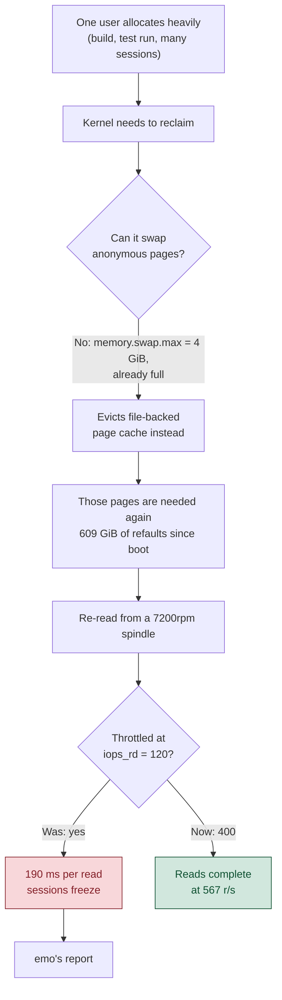
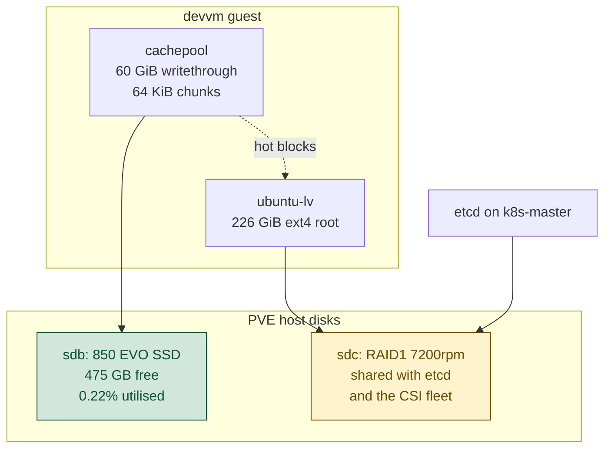

# devvm: fairness and responsiveness for multiple users

Status: approved 2026-09-12. Steps 0 to 8 executing. Step 9 deferred.
Date: 2026-09-12
Author: wizard (with Claude)
Trigger: emo reported that his sessions on the shared devvm become unusable
when the machine is under load.

## Summary

emo's report was accurate and the cause was not what any of us expected. It was
not CPU, and it was not one user out-competing another. devvm's own QEMU disk
throttle was clipping reads at 120 IOPS, and a session whose pages had been
reclaimed could not fault them back in at a usable rate.

Raising that cap is done and measured. The rest of this document proposes the
work that makes the box fair between users once the cap is no longer the
binding constraint, because removing one bottleneck usually reveals the next.

## What the measurements say

### The read cap, not the disk

| layer | read await |
|---|---|
| inside the guest, `dm-0` | 190 ms |
| the PVE host serving the same LV | 21.65 ms |
| `sdc` raw | 19.91 ms |

The difference between 190 ms and 21.65 ms is the QEMU token bucket, not the
disk. The guest sat at 119.6 reads/s against an `iops_rd=120` ceiling, and
devvm was the only one of nine VMs carrying an IOPS cap at all.

### It was never CPU

Per-user cgroup pressure, read live while emo's sessions were frozen:

| slice | `cpu.pressure` avg60 | `io.pressure` avg60 |
|---|---|---|
| emo | 0.00 | 73.93 |
| wizard | 0.44 | 60.35 |
| ancamilea | 0.00 | 0.00 |

Box-wide over five minutes, CPU pressure read 0.61 against IO at 80.20. At a
load average of 46 on 32 cores, `procs_running` was 8 and `procs_blocked` 23.

High CPU readings on this box are usually iowait rather than work. Decomposed
over 30 days:

| 32 cores, 30 days | including iowait | real work only |
|---|---|---|
| p95 busy | 27.7% | 20.2% |
| peak busy | 98.2% | 97.0% |
| hours above 90% | 2.00 h | 1.42 h |

iowait alone peaks at 89.8% of all 32 cores. Genuine CPU saturation happens,
during large builds, for about 1.42 hours in every 720.

### Memory pressure lands on the page cache

Since the 18 July boot, wizard's slice re-read 609 GiB of file pages against
196 MiB of anonymous pages, a ratio of 3183 to 1. Both active users sit pinned
at `memory.swap.max` of 4 GiB, with 2,005,549 failed swapout attempts for
wizard and 125,518 for emo. With swap unable to absorb more, reclaim evicts
file cache instead, and that cache is then re-read from a spindle.

### Existing controls, and which of them work

| control | state |
|---|---|
| `CPUWeight` per user slice | 100 each, enforced, already fair |
| `memory.max` per user slice | 24 GiB each on a 31 GiB box, so it cannot isolate. It does fire: wizard hit it 505,641 times with 71 OOM kills, emo 16,295 times with none |
| `io.weight` per user slice | reads `default 100` but is inert, because sda's scheduler is `[none]` and no cost model is configured |
| per-pane `MemoryMax=6G` | inert since 2026-09-02, see below |
| `DefaultIOAccounting` | off, so per-user IO is not measured at all |

### A regression that overlaps the complaint

Commit `c61292f7` on 2026-09-02 rewrote the comment block of
`playbooks/files/devvm/50-devvm-pane-cap.conf.j2` and removed the `[Scope]`
header and the `MemoryMax` line with it. systemd loads the drop-in and applies
nothing from it. Every `tmux-spawn-*.scope` reports `MemoryMax=infinity` and
`OOMPolicy=stop`.

An `ansible-playbook --check` run is a clean no-op here, because the box
matches the template exactly and the template is what is wrong. That is worth
recording on its own: a config-management check proves the box matches the
repo, not that the repo is correct.

## What has already landed

Commit `cf71d9ca` raises devvm's read cap from `iops_rd=120` with a 400/10s
burst to `iops_rd=400` with an 800/30s burst, in
`scripts/apply-mbps-caps.sh`.

| | before | after |
|---|---|---|
| read IOPS one slice sustained over 21 s | 120 ceiling | 247 |
| `dm-0` device rate | 119.6 r/s | 567.5 r/s |
| `dm-0` utilisation | 100% | 31% |

The 10 second burst window was part of the problem. A session whose pages have
been reclaimed faults its working set back in over tens of seconds, so
re-attaching dropped to the sustained rate partway through.

etcd shares the spindle and was the reason the cap existed, so it was watched
throughout:

| etcd p99 WAL fsync | |
|---|---|
| baseline before the change | 86.2 ms |
| during a deliberate load test | 123.5 ms |
| settled | 13 to 15 ms |

Zero leader changes across the observation window. The 123.5 ms reading came
from a synthetic read test rather than from the change itself.

## Proposal

Nine changes, in the order they should land.

### 1. Restore the per-pane memory cap

Put `[Scope]` and `MemoryMax={{ devvm_pane_memory_max }}` back into
`50-devvm-pane-cap.conf.j2`, alongside the `OOMPolicy=continue` that survived.
This is the guard designed to fire first, so a runaway build dies inside its
own pane rather than taking the user's whole slice to its ceiling. Two lines,
and it has been missing for ten days.

Verification should assert the outcome rather than the file: check
`systemctl --user show <scope> -p MemoryMax` rather than trusting a `--check`
no-op.

### 2. Memory floors per user

Set `memory.low` so that each user has a protected working set that reclaim
leaves alone, and so that whoever is above their share becomes the natural
reclaim target.

| slice | `memory.low` |
|---|---|
| every user slice, via the `user-.slice` template | 8.5 GiB |
| `system.slice` | 2 GiB |
| `user.slice` (parent) | 17 GiB |

Sized for the users who are actually active rather than the four enrolled.
ancamilea has not logged in and holds 13 pids and zero bytes, so the floors are
divided between wizard and emo.

One uniform value on the template rather than per-uid drop-ins, because an empty
slice protects nothing. An absent user reserves no memory while away and is
covered automatically if they return, which gets the same result as carving out
per-user files without the files.

The parent is set to the sum of the two active floors, and that is
self-balancing. If more users become active than 17 GiB covers, the kernel
scales every child's protection down proportionally, which is still an equal
share of the protection that exists. Summing all four enrolled accounts would
reserve 34 GiB on a 31 GiB box and dilute every floor to nothing.

The parent matters. `memory.low` protection is distributed from the parent
down, so leaving `user.slice` at zero would cap every child's effective
protection at zero.

Total protection is 19 GiB of 31 GiB, leaving roughly 12 GiB unprotected.
That headroom is deliberate: `memory.low` is best-effort, and once every
remaining page sits inside somebody's floor, reclaim proceeds anyway and the
protection stops meaning anything.

This is work-conserving with no extra machinery. An empty slice protects
nothing, so one user alone can still use most of the box and is only reclaimed
when somebody else actually needs memory. For context, emo's slice currently
holds 4.24 GiB and wizard's 21.49 GiB, so an 8.5 GiB floor protects emo's whole
working set twice over and makes wizard's excess the first thing reclaimed.

`system.slice` needs its floor for a reason that is easy to miss: protecting
the user slices makes everything unprotected into the preferred reclaim
target, and `system.slice` holds sshd, tmux and the t3 stack.

### 3. No `memory.high`

A 12 GiB `memory.high` band was set on 2026-06-22 and removed on 2026-07-02
after a 12.35 GB process plateaued inside the band, became unreclaimable, and
parked every allocating task in the cgroup including the t3 event loop.
t3.viktorbarzin.me was unavailable for about 53 minutes. The recorded
conclusion was that with swap at zero, `memory.high` behaves as a stall
injector rather than a gentler `memory.max`.

Slices have 4 GiB of swap now rather than none, so the precondition has
changed. It has not changed much: both users sit at that ceiling with two
million failed swapout attempts between them, so at the margin swap is still
effectively absent. `memory.low` is doing the fairness work and `memory.max`
remains as a backstop, so the band is not needed.

### 4. Leave `memory.max` at 24 GiB

It fires and it kills, so lowering it is a live decision rather than a
theoretical one. With the pane cap restored and floors in place, the
expectation is that the 505,641 ceiling hits fall. Watching that count is the
cheapest way to find out whether anything further is needed.

### 5. Protect recently used panes from swap

Exempt panes that are attached now or were attached within the last 24 hours,
keyed on the existing `tmux-spawn-<uuid>.scope` cgroups. tmux 3.4 exposes
`session_last_attached`, and mapping a pane to its scope through `pane_pid`
works cleanly.

The 24 hour window matters because attachment alone protects almost nothing at
any given instant. Of 47 sessions across both users, one was attached when
this was measured. The pain lands at re-attach, on a session detached for
days, and a 24 hour window covers nearly all of both users' real activity
while leaving genuinely cold panes swappable.

This is the smallest of the memory changes by expected value. Swap accounts
for 0.34 MB/s against the filesystem's 6.48 MB/s inside stall windows, so the
floors in step 2 are the lever that matters.

### 6. Make IO fairness real

Switch sda to the BFQ scheduler, turn on `DefaultIOAccounting`, and the
`io.weight` values already declared start doing something. BFQ suits this case:
interactive latency on a rotational device, with cgroup weights. It costs some
CPU, and CPU pressure on this box sits at 0.61.

This matters more now than it did last week. While reads were capped at 120,
no user could saturate the disk. At 400 they can.

### 7. Leave CPU alone

`CPUWeight` is already 100 on every user slice and cgroup v2 already enforces
it. Under real contention the shares are already equal. Nothing to change, and
saying so explicitly is part of the proposal.

### 8. Declare `vm.swappiness`

The value 10 lives in two byte-identical files under `/etc/sysctl.d/`, dated
23 May and 8 June, neither in any repository. Move it into the playbook as one
file and keep the value.

Keeping 10 is deliberate. It biases the kernel towards evicting file pages,
which is the mechanism behind the refaults, but the cache in step 9 changes
what that costs. Once a refault is served from flash in about a millisecond
instead of twenty from the spindle, preferring file eviction stops being
expensive.

### 9. An SSD read cache in front of the root LV (deferred)

Deferred on 2026-09-12, after the cap raise. Not rejected: the research below
stands and the configuration is settled, so this is ready to pick up if steps
1 to 8 leave the box still stalling on refaults. Deferring it also avoids
adding a new hardware dependency and a new failure mode while we are still
measuring what the cap raise alone was worth.

Add a 60 GiB disk from the `ssd` volume group, add it as a second PV to the
guest's `ubuntu-vg`, and convert the root LV to a cached LV in writethrough
mode using a cachepool.

This was researched against the running stack rather than from documentation,
using loopback volume groups. Findings are in
`docs/research/2026-09-12-lvmcache-for-devvm.md`.

| decision | why |
|---|---|
| 60 GiB, not 64 | LVM caps a cache at 1,000,000 chunks. Over a 226 GiB origin, 64 GiB fails at the 64 KiB default and at 32 KiB. 60 GiB at the default converts cleanly with metadata at 16.11% |
| default 64 KiB chunk | 3.2x the 20 KB average read. 128 KiB would allow the full 64 GiB but at 6.4x, and every miss promotes a whole chunk off the spindle |
| cachepool, not cachevol | snapshotting a cachevol-backed LV fails on this stack and aborts half-done, reproduced twice. `lvmcache(7)` for 2.03.16 also prefers separate metadata and data LVs |
| writethrough | the load is 1.8 to 1 read-heavy, and writethrough keeps the RAID1 origin authoritative at all times |

Attach and detach are both online. Measured at 1.83 s and 1.18 s on a mounted
LV under a concurrent writer, filesystem never unmounted, checksums identical.
An earlier internal note claiming 5 to 10 minutes of downtime is superseded.

On efficacy, a repeated random 20 KB hot set filled the cache and reached a
73.6% hit rate within 60 seconds in one rig and 100% after three passes in
another. Promotions then stop. At a 32 KiB chunk, caching a 400 MB working set
wrote 394 MB, so promotion waste is small.

The working set this has to hold is modest. `/home` totals 113 GB, of which
43 GB is one user's `.cache`. The genuinely hot data is roughly 27 GB across
all users.

## Where each change is declared

| change | home |
|---|---|
| steps 1 to 8 | `playbooks/devvm.yml` and its `files/devvm/` templates |
| IO caps including the one already landed | today `scripts/apply-mbps-caps.sh`, which is hand-copied to the PVE host. Proposed: an Ansible playbook targeting the host, so `--check` shows drift |
| step 9 | guest-side, so `playbooks/devvm.yml`, with the PVE-side disk added by hand as devvm is deliberately outside Terraform |

The deployment gap is worth naming. `scripts/apply-mbps-caps.sh` reached the
PVE host as a copy at `/usr/local/bin/`, dated 8 September, and nothing
reconciles it with the repository. Landing a commit changed nothing on the
host until the file was copied across by hand. The earlier version of the same
script lived in `/tmp`.

## Risks accepted

**Raising the read cap puts load back on etcd's spindle.** This can take sdc
towards 500 reads/s against the 150 to 200 random IOPS a 7200rpm RAID1 pair
sustains. The host measured 19.9% utilisation and 5.31 ms read await when the
change landed, and etcd has settled at 13 to 15 ms fsync with no leader
changes. `mbps_rd=60` remains as the bound on bulk sequential reads. Reverting
is a one-line change.

**A dead cache SSD takes devvm down immediately.** In writethrough the data
survives byte-identical, verified independently twice with a clean `e2fsck`.
Availability does not: the live LV enters `cache Error` and returns EIO on
every read, including blocks that were never cached, because dm-cache fails
the target rather than falling back to the origin. Recovery is
`lvconvert --force --uncache` then `vgreduce --removemissing --force`, and on
a root LV that runs from a rescue boot rather than the running system. This
sequence needs a runbook before step 9 lands.

The drive is a 2.23 year old consumer SSD with 6,420 power cycles and 732
unclean-shutdown recoveries, against zero reallocated sectors, zero reserve
blocks used and 3% erase-count wear. 42.8 TB written of a 150 TBW rating.
Age and sudden death are the plausible failure modes rather than write wear.

**A known initramfs trap.** Ubuntu bug #1423796, open since 2015, is a cached
root LV failing to boot because initramfs lacks the dm-cache modules and
`cache_check`. The running initramfs has all of them because `MODULES=most`.
If that ever becomes `dep`, the VM will not come up.

**Resize.** Kernel resize fixes from 2024-10 and 2025-03 are not in 6.8
mainline and Ubuntu's backport status was not audited. Detach the cache before
resizing a cached LV.

## How we will know it worked

Keystroke-to-render latency in an emo session, measured before and after under
a synthetic load, with both numbers reported. The supporting mechanism test is
that a session with an attached terminal should not be a swap victim.

Secondary signals already available: `memory.events` ceiling hits and OOM
kills per slice, `io.pressure` per slice, and the cache hit rate from
`dmsetup status` once step 9 lands.

## Out of scope

Decided deliberately, not overlooked.

- Priority for interactive sessions over batch work within one user. Revisit
  if a user's own builds keep starving that user's own sessions.
- Surfacing or reaping idle sessions.
- Moving the whole devvm disk to the SSD.
- Backups, which already run daily, weekly and monthly.
- Raising the per-user swap ceiling.
- Any change to CPU shares, which are already equal.

## Is more swap worth it

No. The box has 24 GiB of swap and 8.8 GiB of it is in use. The remaining
15 GiB is unreachable, because `memory.swap.max` bounds each user at 4 GiB and
neither can get to it. Adding swap would add a file nothing touches.

The question worth asking is whether to raise the per-user ceiling, and the
answer for now is not yet, for three reasons. Swap moves 0.34 MB/s against the
filesystem's 6.48 MB/s inside stall windows, so it is a small share of the
problem. It sits on the same spindle that is already the constraint. And the
4 GiB bound was chosen deliberately on 2026-09-02, after a runaway ran swap to
15 GB in June and the box had to be hard-killed.

The floors in step 2 change which pages get reclaimed in the first place. If
the failed-swapout counts are still in the millions afterwards, raising the
ceiling is the next lever and there will be evidence for the number.

## Open questions

- Clearing the 43 GB of `.cache` under `/home/wizard` would take `/` from 86%
  to about 61% and shrink what the cache has to hold. It is a deletion, so it
  needs a decision rather than an assumption.
- Whether the raised cap plus steps 1 to 8 are enough on their own. Step 9 is
  deferred on exactly that question.
