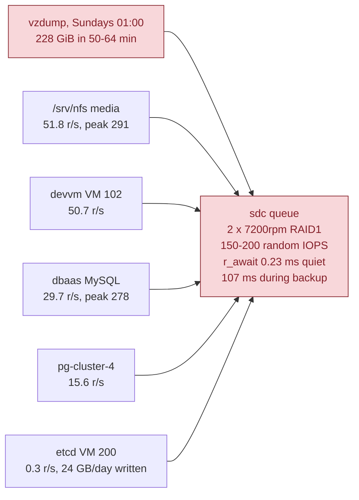
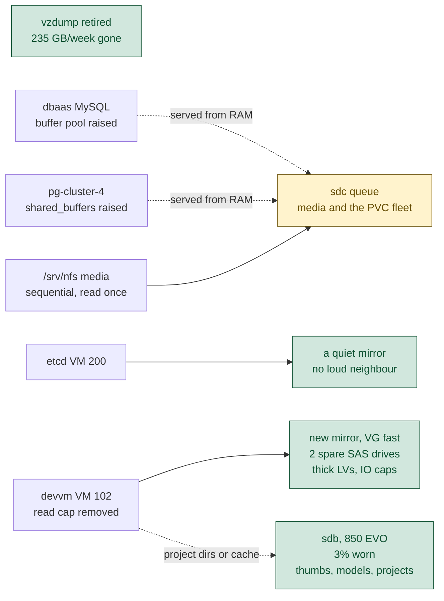

# Relieving the IO bottleneck on the Proxmox host

Status: draft. Decisions agreed in session on 2026-09-12. Revised 2026-09-13
after four measurements landed, one of which changed the ordering.

## Summary

The host is short of **random read IOPS**, not write bandwidth. Writes land in
the PERC H730's battery-backed cache at 1.929 ms lifetime mean across 1.32
billion writes. Reads are not cached, cost 4.483 ms across 736 million, and the
`sdc` mirror of two 7200rpm drives supplies roughly 150 to 200 random IOPS.

Two options were weighed: put workloads on the idle Samsung 850 EVO, or fit
spare enterprise SAS drives as extra spindles. Measurement moved three other
things ahead of both.

1. **The weekly image backup is the largest single cliff, and its throttle does
   nothing.** `vzdump-vms` reads all 228 GiB of devvm's disk every Sunday at
   01:00. Measured live during the run, `sdc` read latency went from 0.23 ms to
   107.26 ms and etcd's write latency from 1.36 ms to 22.07 ms. The job already
   passes `--ionice 7`, but `sdc` runs `mq-deadline`, which ignores ionice
   classes, so that flag has no effect. Decision: retire the image backup rather
   than throttle it, since `/home` is already backed up daily and the rest of
   the box is declared in Ansible.
2. **Two of the four heaviest readers are short of memory rather than disk.**
   MySQL runs a 2 GB InnoDB buffer pool against 28.6 GB of data and is 41% of
   the box's peak read load inside 29 GiB. `pg-cluster-4` re-reads its whole
   dataset 2.32 times a day against roughly 1 GB of `shared_buffers`. Every k8s
   node sits below 53% memory use, so raising both costs nothing.
3. **The single biggest reader is the worst cache candidate.** `/srv/nfs` moves
   238 GB a day across 3,123 GiB of media, read sequentially and rarely twice.
   Per GB of cache it is 76 times less efficient than MySQL, and `smq` promotes
   sequential streams barely at all.
4. **One spare SSD is worth about 50 spindle pairs for this workload.** Flash
   serves 10,000+ random read IOPS; a mirror of two 7200rpm drives serves 150 to
   200. The spare SAS drives buy capacity, endurance, mirroring and queue
   isolation rather than read throughput.
5. **Wear is not the binding constraint on the 850 EVO**, and flash wear from a
   writethrough cache is a dial rather than a fixed cost. See below.

## What the disk is short of

Measured from `/proc/diskstats` lifetime counters over 56.66 days of host
uptime, cross-checked against `docs/research/2026-09-06-etcd-fsync-root-cause.md`.

| device | what it is | read GB/day | write GB/day |
|---|---|---|---|
| `sdc` | 2 x ST12000NM007H 11.7 TB 7200rpm, RAID1, VG `pve` | 566.6 | 422.8 |
| `sda` | 2 x ST1200MM0099 1.2 TB 10k SAS, RAID1, VG `backup` | 64.6 | 76.1 |
| `sdb` | 1 x Samsung 850 EVO 1TB, RAID0 VD, VG `ssd` | 8.7 | 0.5 |

`sdc` carries the whole estate: every VM disk, the proxmox-csi PVC fleet, and
the 4 TB `/srv/nfs` share. `sda` and `sdb` are close to idle.

## The weekly backup, measured live

`/usr/local/bin/vzdump-vms` line 39 reads `VMIDS="${VZDUMP_VMIDS:-102}"`. devvm
is the only VM on this host that gets an image-level backup, which is why it is
the only VM whose host-side reads exceed its guest-side reads. The schedule
moved from nightly to weekly on 2026-08-16 in commit `232253ba`, because `.vma`
has no incremental mode and every run is a full 228 GiB read.

Two consecutive 45-second `iostat -x` windows on 2026-09-13, the first before
the job ramped and the second during it:

| | quiet | during backup | change |
|---|---|---|---|
| `sdc` reads/s | 167.2 | 826.8 | 4.9x |
| `sdc` r_await | 0.23 ms | 107.26 ms | 466x |
| `sdc` utilisation | 19.9% | 79.2% | |
| `sdc` queue depth | 0.60 | 89.55 | 149x |
| devvm LV (dm-217) r_await | 1.40 ms | 266.85 ms | 191x |
| **etcd LV (dm-220) w_await** | **1.36 ms** | **22.07 ms** | **16x** |
| etcd LV utilisation | 4.5% | 66.4% | |

Host `/proc/pressure/io` read `some avg10=57.25`. During this window devvm's own
LV answered reads in 266.85 ms, so the box devvm's users work on is effectively
unusable for the duration.

The mitigation already in the job does not work here. `vzdump` is invoked with
`--mode snapshot --ionice 7` and no `--bwlimit`. `/sys/block/sdc/queue/scheduler`
reads `none [mq-deadline]`, and mq-deadline has no ionice handling, so the
priority class is discarded. It would miss under BFQ too, for an independent
reason: the reads are not issued by the vzdump process. They come from the
long-running `kvm` process (pid 4596, `nice 0`, `ionice` reporting `none: prio
0`, cgroup `/qemu.slice/102.scope`), while the unit's `Nice=10` and
`IOSchedulingClass=idle` apply only to the script that starts the job.

This also resolves a discrepancy that had been open since the 2026-09-06
research. devvm's host-side reads exceeded its guest-side reads by 4.3x over 56
days. The cause is QEMU's backup block job reading the LV through a
`copy-before-write` filter: those reads reach dm-217 but never reach the guest,
and they are not counted in `drive-scsi0` blockstats either, because that
BlockBackend sits above the throttle while the backup job attaches below it.

The 4.3x is a stale average. Over the last 30 days, **26 of 30 show host reads
equal to guest reads to four digits**; only the four backup Sundays show excess,
each of 217 to 245 GB. Cumulative excess measured at 7,966 GB against 8,010 GB
predicted from 28 nightly plus 5 weekly runs, within 0.6%. devvm's genuine read
load is 9.9 to 149 GB/day depending on the day, not 169.8.

## Where the reads come from

Lifetime columns measured over 56.66 days from `/proc/diskstats`. "Peak read
size" is the median 5-minute read size during the 06:00 to 09:00 peak over 14
days, and where it disagrees with the lifetime mean it is the one that matters,
because it is free of backup traffic. Identities resolved through
`kubectl get pv`.

| workload | size (used) | read GB/day | write GB/day | read IOPS (peak) | mean read | peak read | re-reads/day | IOPS per GB |
|---|---|---|---|---|---|---|---|---|
| dbaas MySQL `data-mysql-standalone-0` | 30 (29) GiB | 42.0 | 56.9 | 29.7 (**278**) | 16.0 KB | 16.0 KB | 1.47x | 0.99 |
| dbaas `pg-cluster-4` | 35 (17) GiB | 39.3 | 10.7 | 15.6 (14) | 28.4 KB | 9.7 KB | **2.32x** | 0.45 |
| devvm VM disk (VM 102) | 228 (214) GiB | 182.3 | 39.4 | 50.7 (49) | 40.7 KB | 10.6 KB | 0.85x | 0.85 |
| immich postgres | 20 (17) GiB | 3.2 | 2.7 | 1.5 | 23.4 KB | 5.3 KB | 0.19x | 0.08 |
| dbaas `pg-cluster-2` | 35 (23) GiB | 6.3 | 9.0 | 3.1 | 22.6 KB | not sampled | 0.17x | 0.09 |
| repowise workspace | 20 (14) GiB | 2.9 | 7.6 | 2.2 | 14.9 KB | not sampled | 0.21x | 0.14 |
| Windows10 (VM 300) | 100 (99) GiB | 10.4 | 10.9 | 4.3 | 27.5 KB | not sampled | 0.10x | 0.04 |
| home-assistant (VM 103) | 64 (63) GiB | 7.1 | 18.3 | 2.5 | 32.2 KB | not sampled | 0.11x | 0.04 |
| paperless-ngx | 40 (39) GiB | 3.0 | 2.0 | 0.6 | 55.1 KB | not sampled | 0.08x | 0.02 |
| **`/srv/nfs` media** | **4096 (3123) GiB** | **238.1** | 23.1 | 51.8 (**291**) | 52.0 KB | 33.6 KB | **0.05x** | **0.013** |
| prometheus-data | 433 (149) GiB | 4.8 | 1.3 | 1.0 | 56.0 KB | not sampled | 0.01x | 0.002 |
| etcd (k8s-master VM 200) | 64 (29) GiB | 1.5 | 24.1 | 0.3 | n/a | n/a | 0.02x | 0.001 |

Three readings stand out.

**MySQL reads in 16.0 KB units at both scales**, which is InnoDB's page size
exactly, and re-reads its whole 29 GiB allocation 1.47 times a day. It is 41% of
the box's peak read load, and the entire dataset would fit in 29 GiB of anything.

**`pg-cluster-4` has the highest re-read rate on the box** at 2.32x/day, reads at
9.7 KB under peak (the 8 KiB Postgres page plus readahead), and writes only 10.7
GB/day. It is the best value per GB of flash or per GB of RAM.

**etcd writes 24.1 GB/day and reads almost nothing.** It is the one workload the
whole cluster depends on and the one workload a read cache cannot help. Its
problem is waiting behind other tenants' reads, which is placement rather than
speed.

`/srv/nfs` holds Immich at 1.7 TB, anca-elements at 771 GB, frigate at 134 GB,
plus servarr, audiobookshelf and navidrome. Immich's thumbnails and ML data
already sit on the SSD at `/srv/nfs-ssd/immich`, 67 GB and 3.3 GB, drawing 1.2
read IOPS between them. That placement is already correct.

## Three of the top four readers are short of memory

| | dataset | cache it has | pod limit | node memory in use |
|---|---|---|---|---|
| dbaas MySQL | 28.6 GB | 2 GB InnoDB buffer pool | 6 GB | 44 to 53% on all five nodes |
| `pg-cluster-4` | 17 GB | ~1 GB `shared_buffers` (CNPG default) | 4 GB | same |
| devvm | 113 GB of `/home` | 31 GiB shared by three users | n/a | host committed 264 of 267 GB |

The two databases can be fixed inside memory the node VMs already hold, so that
change is free and reversible. devvm cannot: the host has 264 of 267 GB
committed and is 5 GB into swap, and reallocating RAM between guests was ruled
out for this piece of work. devvm's reads stay a storage problem.

devvm's own counters over the same window:

| | value |
|---|---|
| guest block writes | 36.7 GB/day |
| of which swap | 1.87 GB/day |
| page-cache refaults | 19.1 GB/day |
| major faults | 290,816/day |

Roughly half of what devvm reads is re-reading pages the kernel had just
evicted, matching `docs/plans/2026-09-12-devvm-multiuser-fairness.md`.

## Which directories devvm reads

Measured with `bpftrace` on 2026-09-12, two windows, correlating
`mm_filemap_add_to_page_cache` back to the enclosing readahead call so the
figures are bytes actually fetched rather than bytes requested. Overall
overstatement between the two is 1.18x, and the inflated entries are all worth
tenths of a percent, so the ranking is unaffected.

**The working set moves, and that is the finding.** Two windows 45 minutes
apart:

| tree | 23:06 window, 13 min | 23:52 window, 4 min |
|---|---|---|
| `/home/wizard/.rustup` | absent | **38.4%** |
| `/home/emo/.claude` | 22.6% | 31.7% |
| `/var/lib/docker` | 2.0% | 16.0% |
| `/var/lib/containerd` | 0.7% | 5.7% |
| `/home/wizard/.local` | 12.2% | 4.3% |
| `/home/wizard/code` | **32.1%** | 2.4% |
| `/usr/bin/terraform` | 20.5% | absent |

Whichever agents happen to be running decides the shape, so sizing against one
window understates it. Sizing against the union of both:

| tree | size |
|---|---|
| `/home/wizard/code` | 10.91 GB |
| `/var/lib/docker` | 6.49 GB |
| `/home/wizard/.local` | 3.83 GB |
| `/home/wizard/.claude` | 3.49 GB |
| `/var/lib/containerd` | 2.27 GB |
| `/usr/bin` | 1.77 GB |
| `/home/wizard/.rustup` | 1.26 GB |
| `/home/wizard/.cargo` | 0.68 GB |
| `/home/emo/.claude` | 0.29 GB |
| **total** | **30.99 GB** |

**Volume size: 32 GB floor, 48 GB comfortable.** That lands on the earlier
estimate of roughly 27 GB of hot data rather than contradicting it.
`/home/wizard/.cache` stays on spinning disk: about 43 GB for 0.17% of reads,
the worst ratio on the box.

Three other measurements from the same run:

- Two thirds of read IOs are 4 KiB random metadata, and 223 of 226 one-GiB
  regions of the disk were touched in 13 minutes. The access pattern is
  scattered, which is the case flash serves well and a spindle serves worst.
- PSI `io full avg10` read 76.28 during the window, so the box was genuinely
  blocked on IO rather than merely busy.
- **23:00 UTC is near devvm's daily peak, not a quiet hour.** Its load tracks
  agent activity rather than office hours: 13:00 to 23:00 UTC runs 1.3 to
  4.0 MB/s, and 05:00 to 10:00 UTC runs 5 to 33 KB/s. The 7-day mean is
  523 kB/s, or 45.2 GB/day.

This also settles the choice between explicit placement and a cache. A
writethrough cache costs flash writes in proportion to its write hit rate, and
the same rig measured that a **shifting** working set restarts promotion in
bursts and roughly doubles that ratio against a stable one. devvm's working set
shifts hard, so explicit directory placement is both cheaper in wear and more
predictable here.

## The 850 EVO's wear, measured

From `smartctl -A -d sat+megaraid,4 /dev/sdc`.

| attribute | raw | reading |
|---|---|---|
| `Wear_Leveling_Count` | 61 | normalized 97, so 3% of the P/E budget used |
| `Total_LBAs_Written` | 83,598,075,428 | 42.80 TB written, 28.5% of the 150 TBW rating |
| `Power_On_Hours` | 19,581 | 816 days, across 6,420 power cycles of which 732 unclean |
| `Reallocated_Sector_Ct` | 0 | no bad blocks, reserve pool untouched, error log empty |

61 P/E cycles for 42.8 TB of host writes gives a real write amplification of
1.43. 61 cycles costing 3 normalized points implies Samsung rates it near 2,000
cycles, leaving roughly 1.36 PB of headroom.

| scenario | host writes/yr | years to the 150 TBW warranty | years to the drive's own counter |
|---|---|---|---|
| today | 0.19 TB | 380 | ~7,000 |
| devvm's whole disk on it | 13.4 TB | 4.0 | ~101 |

The two readings differ by a factor of 25. Both are shown because the honest
answer sits between them.

What constrains this drive is not wear. It is a single device with no
power-loss protection, in a server that bead `code-xgcg` records hard-dying in
an outage, and it has already logged 732 unclean power cycles.

## Flash wear from a cache is a dial, not a fixed cost

Measured on this stack with loopback rigs, dm_cache v2.2.0, LVM 2.03.16.

**SSD bytes written divided by application bytes written equals the dm-cache
write hit rate, exactly.** Three cache sizes, three exact matches. Writethrough
never exceeds 1:1.

| behaviour | measured ratio | note |
|---|---|---|
| write to an uncached block | 0.013 to 0.014 | misses are not promoted; the data goes to the origin only |
| write to a cached block | 1.000 | no read-modify-write at chunk granularity; a 20 KiB write puts 20 KiB on flash |

Sizing the cache against a 4.6:1 read-heavy 20 KiB random workload:

| cache vs working set | SSD write ratio | read hit rate | GB/day on flash at devvm's write rate |
|---|---|---|---|
| 0.11x | 0.134 | 12% | 4.9 |
| 0.45x | 0.475 | 48% | 17.4 |
| 2.2x (fits entirely) | 1.000 | 100% | 36.7 |

Read performance and flash wear move together on a straight line, so the cache
size is the knob. **A smaller cache does not thrash**: demotions stayed at zero
in every steady-state pass, including at 8.5x oversubscription. Cold fill costs
1.02x the cache size once. One caveat: with a working set that shifts rather
than repeats, promotion restarts in bursts and the ratio roughly doubles.

## The two options, compared

| | idle SSD (850 EVO) | spare enterprise SAS drives |
|---|---|---|
| random read IOPS added | ~10,000+ for what it holds | ~150 to 200 per mirror |
| capacity available | 475 GB unallocated in VG `ssd` | up to 1 TB usable per mirror |
| bays needed | 0, already fitted | 2 per mirror, 3 free |
| redundancy | none, single RAID0 VD | RAID1 |
| wear | 3% consumed, ~1.36 PB left | not a consideration |
| power-loss protection | none, 732 unclean cycles logged | PERC BBU, status Ready |
| what it is good for | random re-reads of a small hot set | capacity, endurance, queue isolation |

They are complementary. The SAS drives give a latency-sensitive tenant a queue
nobody else shares, which is what etcd needs. The SSD serves random re-reads at
a rate no number of 7200rpm spindles reaches, which is what devvm needs.

## Hardware inventory

PowerEdge R730, service tag GCFSDN2. `racadm storage get enclosures -o` reports
`SlotCount = 8` for `Enclosure.Internal.0-1` (BP13G+ 0:1, firmware 2.25), and
`ipmitool sdr elist` shows only BP2 present, so there is no rear flex bay.
Bays are 3.5 inch LFF, confirmed by `smartctl` reporting
`Form Factor: 3.5 inches`. Five bays populated, **three free**.

| bay | drive | serial | virtual disk | role |
|---|---|---|---|---|
| 0 | ST12000NM007H, 11.7 TB, 7200rpm | ZZ301LW9 | VD2, RAID-1 | `sdc`, VG `pve` |
| 1 | ST12000NM007H, 11.7 TB, 7200rpm | ZZ301N21 | VD2, RAID-1 | `sdc`, VG `pve` |
| 2 | ST1200MM0099, 1.2 TB, 10,000rpm | WFK068MP | VD3, RAID-1 | `sda`, VG `backup` |
| 3 | ST1200MM0099, 1.2 TB, 10,000rpm | WFK04FV2 | VD3, RAID-1 | `sda`, VG `backup` |
| 4 | Samsung SSD 850 EVO 1TB | S2RFNX0J411986X | VD4, **RAID-0** | `sdb`, VG `ssd` |

Controller state: PERC H730 Mini, 1024 MB cache, BBU `Status Ok, State Ready`,
`PreservedCache Not Present`, all three VDs Write Back, zero
unconfigured-good drives and zero hot spares. New virtual disks can be created
online: `RealtimeConfigurationCapability = Capable`.

Two things worth knowing before ordering carriers or planning a cache.

- **`sdb` is not a non-RAID passthrough.** It is a single-drive RAID-0 virtual
  disk, so it already sits behind the BBU-backed write cache, and **TRIM does
  not reach the SSD**. Write amplification is measured at 1.43 today, so this
  is not biting yet, but it will not improve as the drive fills.
- **The three free bays are 3.5 inch.** Bays 2 to 4 already use hybrid carriers
  for 2.5 inch drives. 1 TB enterprise SAS is usually a 2.5 inch part, so this
  probably needs three more hybrid carriers.

## Decisions taken

| decision | rationale |
|---|---|
| etcd stays on spinning disk | Its writes are 94% of its IO. Moving it to flash spends wear on the one workload a read cache cannot help. Isolating it addresses the measured cause, which is queue wait behind neighbours' reads. |
| Database memory before any hardware | 45.3 read IOPS for a config change, inside RAM the node VMs already hold. |
| `/srv/nfs` stays on `sdc` | 0.013 IOPS per GB of cache, 76x worse than the best candidate. A 10.7 TB mirror is the right home for 3 TB of sequentially read media. |
| Anything stateful is mirrored | A single consumer SSD does not hold an authoritative copy. |
| New storage is thick, no thin pool, no snapshots | Removes copy-on-write amplification on a small mirror. |
| The new mirror is a shared pool, with IO controls | Per-VM QEMU caps plus a cgroup `io.latency` floor, so sharing does not recreate the contention being removed. |
| devvm's read cap is removed once it is isolated | The 400 IOPS cap exists only to protect etcd on a shared spindle. |
| Project directories move to flash, backed by git remotes | Uncommitted work is accepted as losable, so the nightly `/home` rsync does not need extending. |
| TrueNAS VM 9000 is kept | It is a useful historical snapshot, worth more than the 256 GB of SSD and 2.46 TB of thin pool it holds. |
| The weekly devvm image backup is disabled, not throttled | Everything on that machine should be declared in configuration and its code committed, which makes a full-image backup redundant rather than merely expensive. A `--bwlimit` would spread 235 GB/week that does not need to be read at all. Costs and residual risk in the section above. |
| Spindles are held until the free changes are measured | The backup explained most of devvm's apparent read load and the databases are fixable in RAM, so the hardware case should be re-made against post-change numbers. Doing hardware first would also mix several changes into one measurement. |
| Zero spend holds | Existing hardware, drives already bought, and the hybrid carriers are on hand. Nothing in this plan costs money. |

## Plan

Free and reversible first, hardware last, one change at a time so each stays
attributable.

| # | change | cost | expected gain | reversible |
|---|---|---|---|---|
| 1 | Disable the weekly `vzdump-vms` image backup of devvm | free | removes 235 GB/week and a 466x latency cliff | yes, one timer |
| 2 | Raise MySQL's InnoDB buffer pool and its pod memory limit | free | up to 29.7 read IOPS, 41% of peak read load | yes |
| 3 | Raise `pg-cluster-4` `shared_buffers` and its pod limit | free | up to 15.6 read IOPS, the highest re-read on the box | yes |
| 4 | Re-measure `sdc` read IOPS and per-user `io.pressure` after 48 h | free | establishes what remains, and whether steps 6 to 9 are needed at all | n/a |
| 5 | Attach a 32 to 48 GB SSD volume for devvm's hottest directories | free | 94% of devvm's reads served from flash, measured | yes |
| 6 | Fit two spare SAS drives, create a mirrored VD online, new thick VG | 2 bays, carriers on hand | a queue not shared with `sdc` | yes |
| 7 | Move devvm's disk to the new mirror, remove its read cap | none | devvm stops contending with `/srv/nfs` | yes |
| 8 | Add per-VM IO caps and a cgroup `io.latency` floor on the new pool | free | makes sharing safe | yes |
| 9 | Consider moving etcd to a quiet mirror once `sda`'s future is settled | free | removes the last neighbour from the control plane | yes |

**Steps 6 to 9 are held at the gate in step 4.** The backup accounted for most
of devvm's apparent read load and the two databases are fixable in RAM, so the
case for new spindles should be re-made against measurements taken after steps
1 to 3, not against the numbers that opened this document. The drives and their
hybrid carriers are on hand either way, so holding costs nothing.

Steps 1 to 5 need no chassis access and no downtime. Step 6 needs the drives
fitted, which the backplane supports without a reboot
(`RealtimeConfigurationCapability = Capable`).

### What disabling the image backup costs, measured

devvm holds the irreplaceable local state on this host: three home directories
totalling 115 GB, local-only git repositories, and a monorepo root with no
remote. Removing `vzdump` removes the one-shot bare-metal restore, so the
decision rests on everything else being declared and committed.

**That premise is partly true today, and the measurement is worth recording.**
`ansible-playbook --check --diff` against the live box returns `ok=84
changed=1 failed=0`, the single change being the per-user Claude skills policy
directory, which is the repo carrying something the box does not yet have.
That direction is benign.

The direction `--check` cannot see is the one that matters here: it compares
only what the playbook already declares, so state on the box that no task
mentions is invisible to it. Classifying all 59 unit files in
`/etc/systemd/system` by owner:

| owner | units | what a rebuild does | after 2026-09-13 |
|---|---|---|---|
| `playbooks/devvm.yml` | 23 | reinstalled automatically | 30 |
| Debian packages (terminal-lobby 10, nvidia 2) | 12 | reinstalled by apt | 12 |
| committed under `infra/scripts/` but installed by no task | 19 | recoverable from git, but someone has to remember | 19 |
| nowhere in the repository or any package | 6 | present only on that disk | **0** |

The 19 are the t3 fleet (`t3-serve@`, `t3-dispatch`, `t3-watchdog`,
`t3-migrate-idle`, `t3-provision-users`, `t3-backup-state`, `t3-cgroup-snap`),
`tmux-persist-*`, `claude-auth-sync@`, `playwright-snapshot-refresh@` and
`promtail`. Their unit files are committed; nothing installs them.

The 6 with no copy anywhere were `acd-demux`, `ac-relay@.service`,
`ac-relay@.socket` and `ac-spa` (agent-conductor, binaries dated 2026-07-16
plus 15 MB of static assets, source not present in `~/code`), and `orca-serve`
and `orca-xvfb` (Orca, a 748 MB third-party AppImage from the 2026-08-29
evaluation, re-downloadable).

**Retired on 2026-09-13**, commits `1a4ddf46` and `7e19701c`. All six are
stopped and disabled, the `sockets.target.wants` symlink that would have
restarted the relay at boot is gone, and `multipathd` went with them because
this VM presents no multipath devices. `ansible-playbook --check` against the
box now returns `changed=0`, and a re-run of the ownership audit returns zero
units with no copy anywhere. The files were archived first to
`/mnt/backup/devvm-retired-2026-09-13/` (114 files, sha256 `1f607238a251`),
since agent-conductor has no other copy.

Two things that cost a second commit and are worth remembering. **A unit whose
file lives in `/etc/systemd/system` cannot be masked**, because masking places a
symlink to `/dev/null` at a higher-priority path and that is already the path
the file occupies; ansible reports `changed` every run and the mask never
sticks, so declaring it makes `--check` report drift that no apply can settle.
And **a template unit's enablement lives on the instance**: stopping
`ac-relay@wizard.socket` left `sockets.target.wants/ac-relay@wizard.socket` in
place, so it would have come back on the next reboot.

**What makes the decision safe to take now anyway:** retention runs inside the
job, so stopping the timer freezes what is already on disk. `/mnt/backup/vzdump`
currently holds three complete images, 81 GB, 89 GB and 84 GB, the newest taken
at 02:26 today. Disabling the timer leaves a 14-hour-old full image in place
indefinitely rather than removing the restore floor. The floor simply stops
advancing, so the declaration gap above becomes follow-up work with a deadline
of "before that image is too stale to be worth restoring" rather than a blocker.

Two consequences to note. Those three images pin 254 GB of the 1.09 TB backup
disk permanently; keeping only the newest would release 170 GB. And
`devvm-home-backup` continues daily at 03:30, 14 hardlinked generations of a
~29 GB tracked set including `~/code`, `~/.ssh`, `~/.config` and `~/.claude`,
pulled by the PVE host so a compromised devvm cannot delete its own backups.

Recommended form: mask the timer, declare the disabled state in the repository,
and keep `scripts/vzdump-vms.sh` in place, so it is one command from coming
back and the box and the repo agree.

## Which directories devvm reads

Measured with `bpftrace` on 2026-09-12, two windows, correlating
`mm_filemap_add_to_page_cache` back to the enclosing readahead call so the
figures are bytes actually fetched rather than bytes requested. Overall
overstatement between the two is 1.18x, and the inflated entries are all worth
tenths of a percent, so the ranking is unaffected.

**The working set moves, and that is the finding.** Two windows 45 minutes
apart:

| tree | 23:06 window, 13 min | 23:52 window, 4 min |
|---|---|---|
| `/home/wizard/.rustup` | absent | **38.4%** |
| `/home/emo/.claude` | 22.6% | 31.7% |
| `/var/lib/docker` | 2.0% | 16.0% |
| `/var/lib/containerd` | 0.7% | 5.7% |
| `/home/wizard/.local` | 12.2% | 4.3% |
| `/home/wizard/code` | **32.1%** | 2.4% |
| `/usr/bin/terraform` | 20.5% | absent |

Whichever agents happen to be running decides the shape, so sizing against one
window understates it. Sizing against the union of both:

| tree | size |
|---|---|
| `/home/wizard/code` | 10.91 GB |
| `/var/lib/docker` | 6.49 GB |
| `/home/wizard/.local` | 3.83 GB |
| `/home/wizard/.claude` | 3.49 GB |
| `/var/lib/containerd` | 2.27 GB |
| `/usr/bin` | 1.77 GB |
| `/home/wizard/.rustup` | 1.26 GB |
| `/home/wizard/.cargo` | 0.68 GB |
| `/home/emo/.claude` | 0.29 GB |
| **total** | **30.99 GB** |

**Volume size: 32 GB floor, 48 GB comfortable.** That lands on the earlier
estimate of roughly 27 GB of hot data rather than contradicting it.
`/home/wizard/.cache` stays on spinning disk: about 43 GB for 0.17% of reads,
the worst ratio on the box.

Three other measurements from the same run:

- Two thirds of read IOs are 4 KiB random metadata, and 223 of 226 one-GiB
  regions of the disk were touched in 13 minutes. The access pattern is
  scattered, which is the case flash serves well and a spindle serves worst.
- PSI `io full avg10` read 76.28 during the window, so the box was genuinely
  blocked on IO rather than merely busy.
- **23:00 UTC is near devvm's daily peak, not a quiet hour.** Its load tracks
  agent activity rather than office hours: 13:00 to 23:00 UTC runs 1.3 to
  4.0 MB/s, and 05:00 to 10:00 UTC runs 5 to 33 KB/s. The 7-day mean is
  523 kB/s, or 45.2 GB/day.

This also settles the choice between explicit placement and a cache. A
writethrough cache costs flash writes in proportion to its write hit rate, and
the same rig measured that a **shifting** working set restarts promotion in
bursts and roughly doubles that ratio against a stable one. devvm's working set
shifts hard, so explicit directory placement is both cheaper in wear and more
predictable here.

## The 850 EVO's wear, measured

From `smartctl -A -d sat+megaraid,4 /dev/sdc`.

| attribute | raw | reading |
|---|---|---|
| `Wear_Leveling_Count` | 61 | normalized 97, so 3% of the P/E budget used |
| `Total_LBAs_Written` | 83,598,075,428 | 42.80 TB written, 28.5% of the 150 TBW rating |
| `Power_On_Hours` | 19,581 | 816 days, across 6,420 power cycles of which 732 unclean |
| `Reallocated_Sector_Ct` | 0 | no bad blocks, reserve pool untouched, error log empty |

61 P/E cycles for 42.8 TB of host writes gives a real write amplification of
1.43. 61 cycles costing 3 normalized points implies Samsung rates it near 2,000
cycles, leaving roughly 1.36 PB of headroom.

| scenario | host writes/yr | years to the 150 TBW warranty | years to the drive's own counter |
|---|---|---|---|
| today | 0.19 TB | 380 | ~7,000 |
| devvm's whole disk on it | 13.4 TB | 4.0 | ~101 |

The two readings differ by a factor of 25. Both are shown because the honest
answer sits between them.

What constrains this drive is not wear. It is a single device with no
power-loss protection, in a server that bead `code-xgcg` records hard-dying in
an outage, and it has already logged 732 unclean power cycles.

## Flash wear from a cache is a dial, not a fixed cost

Measured on this stack with loopback rigs, dm_cache v2.2.0, LVM 2.03.16.

**SSD bytes written divided by application bytes written equals the dm-cache
write hit rate, exactly.** Three cache sizes, three exact matches. Writethrough
never exceeds 1:1.

| behaviour | measured ratio | note |
|---|---|---|
| write to an uncached block | 0.013 to 0.014 | misses are not promoted; the data goes to the origin only |
| write to a cached block | 1.000 | no read-modify-write at chunk granularity; a 20 KiB write puts 20 KiB on flash |

Sizing the cache against a 4.6:1 read-heavy 20 KiB random workload:

| cache vs working set | SSD write ratio | read hit rate | GB/day on flash at devvm's write rate |
|---|---|---|---|
| 0.11x | 0.134 | 12% | 4.9 |
| 0.45x | 0.475 | 48% | 17.4 |
| 2.2x (fits entirely) | 1.000 | 100% | 36.7 |

Read performance and flash wear move together on a straight line, so the cache
size is the knob. **A smaller cache does not thrash**: demotions stayed at zero
in every steady-state pass, including at 8.5x oversubscription. Cold fill costs
1.02x the cache size once. One caveat: with a working set that shifts rather
than repeats, promotion restarts in bursts and the ratio roughly doubles.

## The two options, compared

| | idle SSD (850 EVO) | spare enterprise SAS drives |
|---|---|---|
| random read IOPS added | ~10,000+ for what it holds | ~150 to 200 per mirror |
| capacity available | 475 GB unallocated in VG `ssd` | up to 1 TB usable per mirror |
| bays needed | 0, already fitted | 2 per mirror, 3 free |
| redundancy | none, single RAID0 VD | RAID1 |
| wear | 3% consumed, ~1.36 PB left | not a consideration |
| power-loss protection | none, 732 unclean cycles logged | PERC BBU, status Ready |
| what it is good for | random re-reads of a small hot set | capacity, endurance, queue isolation |

They are complementary. The SAS drives give a latency-sensitive tenant a queue
nobody else shares, which is what etcd needs. The SSD serves random re-reads at
a rate no number of 7200rpm spindles reaches, which is what devvm needs.

## Hardware inventory

PowerEdge R730, service tag GCFSDN2. `racadm storage get enclosures -o` reports
`SlotCount = 8` for `Enclosure.Internal.0-1` (BP13G+ 0:1, firmware 2.25), and
`ipmitool sdr elist` shows only BP2 present, so there is no rear flex bay.
Bays are 3.5 inch LFF, confirmed by `smartctl` reporting
`Form Factor: 3.5 inches`. Five bays populated, **three free**.

| bay | drive | serial | virtual disk | role |
|---|---|---|---|---|
| 0 | ST12000NM007H, 11.7 TB, 7200rpm | ZZ301LW9 | VD2, RAID-1 | `sdc`, VG `pve` |
| 1 | ST12000NM007H, 11.7 TB, 7200rpm | ZZ301N21 | VD2, RAID-1 | `sdc`, VG `pve` |
| 2 | ST1200MM0099, 1.2 TB, 10,000rpm | WFK068MP | VD3, RAID-1 | `sda`, VG `backup` |
| 3 | ST1200MM0099, 1.2 TB, 10,000rpm | WFK04FV2 | VD3, RAID-1 | `sda`, VG `backup` |
| 4 | Samsung SSD 850 EVO 1TB | S2RFNX0J411986X | VD4, **RAID-0** | `sdb`, VG `ssd` |

Controller state: PERC H730 Mini, 1024 MB cache, BBU `Status Ok, State Ready`,
`PreservedCache Not Present`, all three VDs Write Back, zero
unconfigured-good drives and zero hot spares. New virtual disks can be created
online: `RealtimeConfigurationCapability = Capable`.

Two things worth knowing before ordering carriers or planning a cache.

- **`sdb` is not a non-RAID passthrough.** It is a single-drive RAID-0 virtual
  disk, so it already sits behind the BBU-backed write cache, and **TRIM does
  not reach the SSD**. Write amplification is measured at 1.43 today, so this
  is not biting yet, but it will not improve as the drive fills.
- **The three free bays are 3.5 inch.** Bays 2 to 4 already use hybrid carriers
  for 2.5 inch drives. 1 TB enterprise SAS is usually a 2.5 inch part, so this
  probably needs three more hybrid carriers.

## Decisions taken

| decision | rationale |
|---|---|
| etcd stays on spinning disk | Its writes are 94% of its IO. Moving it to flash spends wear on the one workload a read cache cannot help. Isolating it addresses the measured cause, which is queue wait behind neighbours' reads. |
| Database memory before any hardware | 45.3 read IOPS for a config change, inside RAM the node VMs already hold. |
| `/srv/nfs` stays on `sdc` | 0.013 IOPS per GB of cache, 76x worse than the best candidate. A 10.7 TB mirror is the right home for 3 TB of sequentially read media. |
| Anything stateful is mirrored | A single consumer SSD does not hold an authoritative copy. |
| New storage is thick, no thin pool, no snapshots | Removes copy-on-write amplification on a small mirror. |
| The new mirror is a shared pool, with IO controls | Per-VM QEMU caps plus a cgroup `io.latency` floor, so sharing does not recreate the contention being removed. |
| devvm's read cap is removed once it is isolated | The 400 IOPS cap exists only to protect etcd on a shared spindle. |
| Project directories move to flash, backed by git remotes | Uncommitted work is accepted as losable, so the nightly `/home` rsync does not need extending. |
| TrueNAS VM 9000 is kept | It is a useful historical snapshot, worth more than the 256 GB of SSD and 2.46 TB of thin pool it holds. |
| The weekly devvm image backup is disabled, not throttled | Everything on that machine should be declared in configuration and its code committed, which makes a full-image backup redundant rather than merely expensive. A `--bwlimit` would spread 235 GB/week that does not need to be read at all. Costs and residual risk in the section above. |
| Spindles are held until the free changes are measured | The backup explained most of devvm's apparent read load and the databases are fixable in RAM, so the hardware case should be re-made against post-change numbers. Doing hardware first would also mix several changes into one measurement. |
| Zero spend holds | Existing hardware, drives already bought, and the hybrid carriers are on hand. Nothing in this plan costs money. |

## Plan

Free and reversible first, hardware last, one change at a time so each stays
attributable.

| # | change | cost | expected gain | reversible |
|---|---|---|---|---|
| 1 | Disable the weekly `vzdump-vms` image backup of devvm | free | removes 235 GB/week and a 466x latency cliff | yes, one timer |
| 2 | Raise MySQL's InnoDB buffer pool and its pod memory limit | free | up to 29.7 read IOPS, 41% of peak read load | yes |
| 3 | Raise `pg-cluster-4` `shared_buffers` and its pod limit | free | up to 15.6 read IOPS, the highest re-read on the box | yes |
| 4 | Re-measure `sdc` read IOPS and per-user `io.pressure` after 48 h | free | establishes what remains, and whether steps 6 to 9 are needed at all | n/a |
| 5 | Attach a 32 to 48 GB SSD volume for devvm's hottest directories | free | 94% of devvm's reads served from flash, measured | yes |
| 6 | Fit two spare SAS drives, create a mirrored VD online, new thick VG | 2 bays, carriers on hand | a queue not shared with `sdc` | yes |
| 7 | Move devvm's disk to the new mirror, remove its read cap | none | devvm stops contending with `/srv/nfs` | yes |
| 8 | Add per-VM IO caps and a cgroup `io.latency` floor on the new pool | free | makes sharing safe | yes |
| 9 | Consider moving etcd to a quiet mirror once `sda`'s future is settled | free | removes the last neighbour from the control plane | yes |

**Steps 6 to 9 are held at the gate in step 4.** The backup accounted for most
of devvm's apparent read load and the two databases are fixable in RAM, so the
case for new spindles should be re-made against measurements taken after steps
1 to 3, not against the numbers that opened this document. The drives and their
hybrid carriers are on hand either way, so holding costs nothing.

Steps 1 to 5 need no chassis access and no downtime. Step 6 needs the drives
fitted, which the backplane supports without a reboot
(`RealtimeConfigurationCapability = Capable`).

### What disabling the image backup costs

devvm is the only VM on this host with an image-level backup, and it holds the
irreplaceable local state: three home directories totalling 115 GB, local-only
git repositories, and a monorepo root with no remote. Removing `vzdump` removes
the one-shot bare-metal restore.

The reasoning for removing it anyway is that everything on that box should be
declared and committed, so the restore path becomes: clone Proxmox template
1000, run `playbooks/devvm.yml`, restore `/home` from `devvm-home-backup`. That
path was validated end to end on 2026-08-29 against a fresh VM, all six
services up and all eight verification probes passing.

What stays covered: `devvm-home-backup` runs daily at 03:30, keeps 14
hardlinked generations of a ~29 GB tracked set, deliberately includes `~/code`,
`~/.ssh`, `~/.config` and `~/.claude`, and is pulled by the PVE host rather
than pushed, so a compromised devvm cannot delete its own backups.

What stops being covered: anything on the box that is neither in `/home` nor
declared in the playbook. The ongoing proof that this set is empty is that
`ansible-playbook --check --diff` against the live box returns a no-op. Worth
re-running before the timer is disabled rather than after.

Recommended form: mask the timer and declare the disabled state in the
repository, keeping `scripts/vzdump-vms.sh` in place. That keeps it one command
from coming back and matches the principle that drove the decision, rather than
deleting a script and leaving the box and the repo disagreeing.

## How we will know it worked

- Per-user `io.pressure` avg60 on devvm below 10 during normal work. It read
  73.93 for one user and 60.35 for another while sessions were frozen.
- Zero kube-scheduler and kube-controller-manager restarts over seven days,
  against 289 in the preceding thirty.
- For step 1 specifically: `sdc` r_await during the Sunday 01:00 window stays
  under 10 ms, against the 107.26 ms measured on 2026-09-13.

Baseline before step 1, and re-measure after each numbered step rather than at
the end. The 2026-09-08 etcd work sized itself against a single anomalous day
and overstated its own effect, which is the mistake this sequencing avoids.

## Open questions

1. **Does the 32 GB volume hold up across a working week?** Two windows gave
   a 31 GB union, and the shape moved sharply between them, so a third sample
   on a different day would firm up whether 32 GB is the floor or the target.
2. **Should the 19 committed-but-uninstalled units be adopted?** The 6 with no
   copy anywhere are done, so this is what is left of the gap: the t3 fleet,
   `tmux-persist-*`, `claude-auth-sync@`, `playwright-snapshot-refresh@` and
   `promtail` have their unit files committed under `infra/scripts/` and no
   task installs them. A rebuild would need someone to remember. Contained
   work, since the files already exist.
3. **Does VM 105, the stopped `pbs`, have a purpose now?** It is an abandoned
   trial from 2025-10-11 that never got past the installer: the
   `proxmox-backup-server_4.0-1.iso` is still in `ide2` and the boot order
   still puts it second. With the image backup retired it has no role in this
   plan, so it is either a future incremental-backup host or a VM to delete.
   If it is ever revisited, the datastore belongs on VG `ssd`: `/mnt/backup`
   shows 301 GB free on the filesystem but VG `backup` has **0** free extents
   so it cannot grow, VG `pve` is the source spindle, and a Synology NFS mount
   would put millions of small chunk files and a garbage collector that walks
   all of them on the worst possible transport. 8 GB of RAM is ample at the
   150 to 250 GB a store of this size would reach.
4. **What is `pg-cluster-4`'s actual `shared_buffers`?** Inferred from the CNPG
   default of 25% of a 4 GB limit. Worth reading from the live cluster first.
5. **Does `sda` have a future as a quiet mirror for etcd?** It holds
   `/mnt/backup`, it is full, and it is the only storage independent of `sdc`.
   Freeing 300 GB was agreed as acceptable if a copy still lands on the
   Synology, but the trade against backup independence is not worked through.
6. **Does the missing TRIM passthrough matter over time?** Measured write
   amplification is 1.43 today with the drive 20% full. It is worth re-reading
   `Wear_Leveling_Count` after any cache goes in.

## How the IO paths change

Today, five tenants share one queue in front of a pair of 7200rpm platters, and
once a week a full-image backup joins them.

After the plan, the image backup is gone, two tenants stop reading, two move to their own devices, and what is left on `sdc` is sequential
media.

## Where each change is declared

| change | home |
|---|---|
| Disabling the `vzdump-vms` timer | `scripts/vzdump-vms.timer` plus `playbooks/pve-host.yml`, so the box and the repo agree. The script itself stays in `scripts/vzdump-vms.sh`. |
| MySQL and Postgres memory | `stacks/dbaas/` |
| PVE host storage layout, VG and LV creation | `playbooks/pve-host.yml` |
| Per-VM IO caps | `scripts/apply-mbps-caps.sh`, installed by `playbooks/pve-host.yml` |
| cgroup `io.latency` floors | `playbooks/pve-host.yml` |
| devvm guest mounts for the project volume | `playbooks/devvm.yml` |

devvm is deliberately outside Terraform, so its PVE-side disk is added by hand
while the guest-side mount is declared in the playbook.

## Prior work this builds on

- `docs/research/2026-09-06-etcd-fsync-root-cause.md` established that the
  contended resource is the `sdc` queue and that the QEMU throttle, the missing
  iothread and dm-thin metadata commits each contribute zero. It listed
  `--bwlimit 40000` on `vzdump-vms` as row 8 of 12 and judged that it "does not
  move the weekly p99". The live measurement above suggests promoting it: the
  cliff is 466x on read latency and 16x on etcd's writes.
- `docs/plans/2026-09-12-devvm-multiuser-fairness.md` established that devvm's
  stalls were the 120 IOPS read cap plus page-cache refaults under memory
  pressure, and raised the cap to 400.
- `docs/research/2026-09-12-lvmcache-for-devvm.md` measured dm-cache on this
  exact stack: 1.83 s online attach, the 1,000,000 chunk ceiling, cachepool over
  cachevol, and that a dead cache in writethrough costs uptime rather than data.

Two corrections to figures carried in older notes.

The count of 462 daily LVM snapshots, carried since 2026-06-29, is out of date.
There are 234, being 78 PVCs at three days of retention, expiring on schedule.
Retention was cut from seven days to three on 2026-06-29 under bead `code-oflt`,
and the note predates the change. They hold 597.6 GiB of copy-on-write.

`sdb` has been described as a single non-RAID SSD. It is a single-drive RAID-0
virtual disk behind the PERC, which means it gets the BBU-backed write cache and
does not get TRIM.
