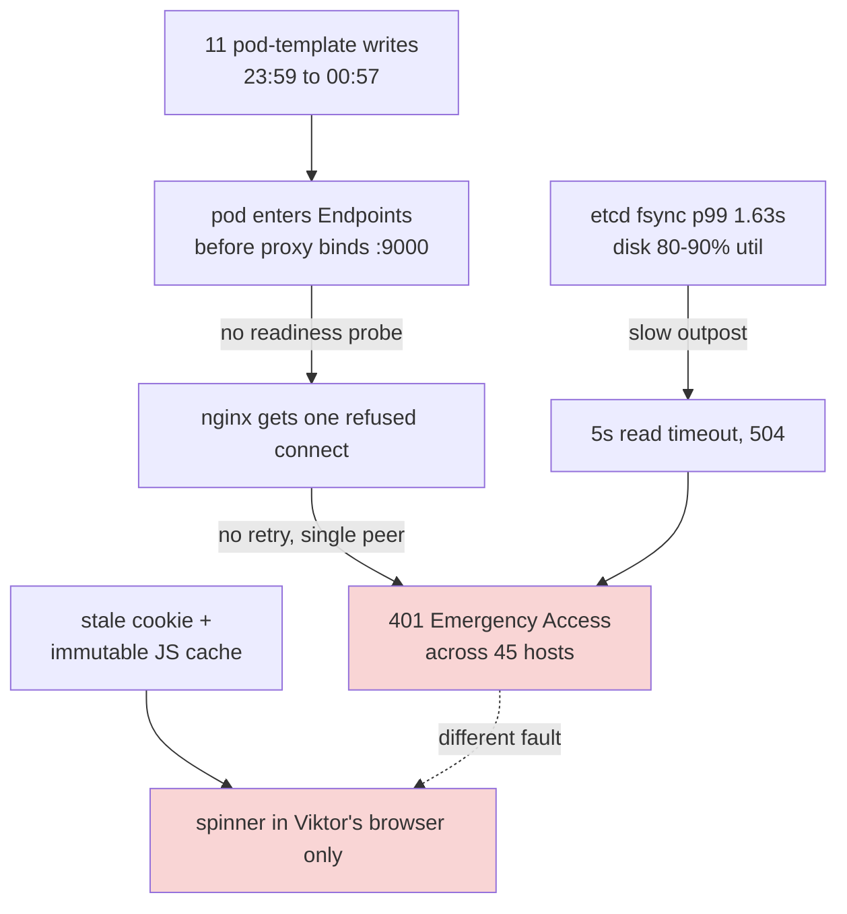

# authentik outage recovery and safe-upgrade plan

**Status:** frozen, awaiting Viktor
**Written:** 2026-09-13 01:45 UTC, during the incident
**Owner:** Viktor, with Claude executing

Everything is healthy right now. Nothing will change on its own overnight. This
document says what broke, what is currently frozen and how to unfreeze it, and
the order to do the cleanup in when you are back.

---

## 1. Where things stand

| | state |
|---|---|
| forward-auth (grafana, terminal, pages) | healthy, 12/12 clean samples, zero Emergency Access |
| login executor latency | 0.19-0.31s (was 3.71s at the worst) |
| apiserver `/readyz` | ok on repeated probes (was refusing connections, crashloop attempt 13) |
| etcd fsync p99 | 0.181s (was 1.63s) |
| embedded outpost | stable on `proxy:2026.2.6`, no churn since 00:57 |
| nginx retry fix | live (commit `b64239e1`) |
| **server image** | **drifted: running stock, commit says overlay** |

---

## 2. What actually broke, in two separate parts

These were conflated for several hours, which is why fixes kept not working.

### Part A, server side

Two defects that only matter together:

- `ak-outpost-authentik-embedded-outpost` has `readinessProbe`, `livenessProbe`
  and `startupProbe` all null, and rolls at `maxUnavailable 25%`. A pod joins
  Service Endpoints the instant its container is Running, seconds before the Go
  proxy binds `:9000`.
- The nginx auth-proxy had one upstream peer, no `proxy_next_upstream` and no
  retry, with `error_page 502 503 504 = @fallback_auth`. One refused connect
  therefore challenged every protected host at once.

The trigger was 11 pod-template writes to that Deployment between 23:59:10 and
00:57:10, nine from `system:serviceaccount:claude-agent:claude-agent` and two
from `kubernetes-admin`. No controller identity appears in the apiserver audit
log at all.

The signature that distinguished a half-up backend from a dead one: 200 and 401
interleaved for the same host **within the same second**.

### Part B, browser side

Independent of all of the above, and the reason Viktor stayed locked out after
the server was healthy: his Chrome profile held a stale `authentik_proxy_*`
cookie and a year-long `immutable` JS cache. His browser made zero `/static/`
requests across 40 minutes, so every bundle came from cache and no server-side
fix could reach it. Incognito worked immediately; clearing site data fixed it.

---

## 3. What is frozen, and how to undo it

Applied 2026-09-13 ~01:44 UTC. All four are live-cluster changes, not committed,
so a `terragrunt apply` on those stacks would undo them on its own.

Three of the four are now COMMITTED (`1488c914`), so an unattended apply cannot
lift them. keel is the exception and is held live only.

| what | how it is frozen | committed? | undo |
|---|---|---|---|
| kured (node reboots) | `var.frozen` in `stacks/kured/main.tf`, a nodeSelector no node carries | yes | set `var.frozen = false` |
| kured sentinel gate | same variable | yes | same |
| fixer agent | `suspend = true` on the CronJob | yes | set `suspend = false` |
| keel (image auto-upgrades) | `kubectl -n keel scale deploy keel --replicas=0` | **no, live only** | `kubectl -n keel scale deploy keel --replicas=1` |

Verified after freezing: both kured DaemonSets report `desired=0 current=0`,
keel has 0 pods, `fixer-tick` is `suspend=true`, and auth still answers 302.

> [!WARNING]
> **keel's hold is drift, and that is deliberate after two failed attempts.**
> This chart cannot express the freeze. `replicaCount = 0` is silently ignored:
> keel 1.2.0 renders `replicas: {{ .Values.replicaCount | default 1 }}` and
> Helm's `default` treats 0 as empty, so it renders 1 while `helm get values`
> reports 0 and the release says "Upgrade complete". An unschedulable
> nodeSelector is worse: the release sets `atomic = true`, so helm waits for a
> readiness that can never come, and the upgrade rolled back and failed pipeline
> #1704. Making it work would mean disabling `atomic` and `wait` on this
> release, trading a real safety property for a temporary hold.
>
> So `stacks/keel` was reverted to its pre-freeze content (`47e38eed`) and keel
> is scaled to 0 by hand. That is safe only because CI applies changed stacks
> and nothing in `stacks/keel` now differs from what is deployed. **Editing that
> stack un-freezes keel** — which is exactly what my own two commits did tonight.
> Nightly drift detection only plans, never applies.
>
> By implication, the 2026-05-26 emergency stop recorded in that file as
> `replicaCount = 0` cannot have worked either.

### Why each one

- **kured.** Four nodes carry `/var/run/reboot-required`: master, node2, node3,
  node4. Its window is 02:00-06:00 Europe/London, which was **open at the time
  of writing**. Two conditions were holding it back: no
  `/sentinel/gated-reboot-required` existed, and `ClusterCannotTolerateNonGpuNodeLoss`
  was firing, which is in its `--alert-filter-regexp` block list. Both could
  clear on their own, so the hold is now deliberate.
- **fixer agent.** Runs every 2 minutes and dispatches autonomous repair agents
  at `broken` issues. It was idle at freeze time (`0 dispatched, 0 in flight`),
  but it is the most likely source of the nine agent writes.
- **keel.** ns authentik is not enrolled, but keel wrote `ak-outpost-rac` at
  20:57 on 2026-09-12 despite `keel.sh/policy=never` (bead `code-q9iy`). Until
  that is understood, it should not be moving images unattended.

### One thing NOT frozen

Woodpecker still applies on push to master, and the CI bot commits TLS
certificate renewals on its own. If a renewal lands overnight, the authentik
stack applies and the server image changes from stock back to the overlay,
restarting the pods. That is desirable in itself (it fixes the drift in step 3)
and the nginx retry should now make it invisible, but it would happen
unattended. Stopping it would mean stopping certificate renewal, which is worse.

---

## 4. The plan, in order

The ordering matters: make restarts safe **before** causing restarts, and before
re-enabling the things that cause restarts.

### Step 1. Readiness probe on the embedded outpost (`code-f1zd`, P1)

Add `readinessProbe` httpGet `/outpost.goauthentik.io/ping` on 9000 expecting
204, `initialDelaySeconds 3`, `periodSeconds 3`, `failureThreshold 2`, and change
the strategy to `maxUnavailable 0`, `maxSurge 1`.

The hard part is durability. That Deployment is not created by Terraform, it is
unowned, and a `kubectl`-applied probe is replaced by the next writer. It needs a
home CI reasserts, most likely the outpost's `kubernetes_json_patches`, but that
patch mechanism has previously been observed never to re-apply for the embedded
outpost. Confirm before relying on it.

**Proof it worked:** delete the probe by hand and watch CI put it back; then do a
deliberate rollout restart of the outpost while probing a protected host once a
second, and see zero fallback responses.

### Step 2. Narrow claude-agent's write access (`code-7u62`, P1)

Find the grant, exclude deployments in ns authentik, apply through CI.

**Needs your decision.** This removes a capability you may rely on. The stopgap
(`scale deploy claude-agent-service --replicas=0`) costs headless agent jobs
entirely, so it is not a silent change either way.

**Proof:** a dry-run write as that ServiceAccount is denied, and a
`POST /execute` job still completes.

### Step 3. Reconcile the server image (`code-9v05`, P2)

`goauthentik-server` runs stock `ghcr.io/goauthentik/server:2026.8.2`;
`goauthentik-worker` and the commit both say
`ghcr.io/viktorbarzin/authentik-server:2026.8.2-patch4`. Re-run the stack apply
through CI so both match the commit.

Do this **after** steps 1 and 2, so the restart it causes is survivable and
nothing rewrites the outpost mid-rollout.

**Proof:** both deployments on the same image, and a real login carrying a
session reaches a protected app with HTTP 200. An unauthenticated 302 proves
nothing here and must not be accepted as evidence.

### Step 4. Unfreeze, one at a time, watching

In this order, with a few minutes between each: keel, then the fixer agent, then
kured. Watch for Emergency Access responses after each. Reversing one is a single
command from the table above.

### Step 5. The four pending node reboots

master, node2, node3, node4. Do these deliberately, one at a time, draining
first, rather than letting kured do all four unattended. The master last.

### Step 6. The alert that did not fire (`code-c4b1`, P2)

`AuthentikForwardAuthFallbackActive` fires on a 401 rate above 5/s sustained for
5 minutes. Tonight peaked at 1.4/s in 3-4 minute windows, so it never fired
while the whole estate was behind a basic-auth prompt. Any fallback-served
response at all is already an incident. Replaying the 00:30-00:57 window against
the new rule should fire it.

### Step 7. Understand keel's write (`code-q9iy`, P3)

Why did keel write `ak-outpost-rac` with `keel.sh/policy=never` set? Every fix
above assumes only declared actors write these objects.

### Step 8. etcd off the spindles (needs a window)

`sdc` sits at 80-90% utilisation with a 20-26 deep queue and 55-62ms read
latency at only 3-11 MB/s, with no backup running. etcd fsync p99 hit 1.63s.
That did not open tonight's windows but it lengthened every one of them and it
is what pushed forward-auth past its timeouts. Groundwork is in the untracked
`docs/plans/2026-09-12-io-bottleneck-ssd-vs-spindles.md`.

This is the largest and most valuable item, and the only one that needs a real
maintenance window.

---

## 5. Optional, worth considering

**A `Clear-Site-Data` reset endpoint.** Part B of this outage cost about an hour
because the `authentik_proxy_*` cookie is `HttpOnly` (so the console cannot clear
it) and the JS bundles are `max-age=31536000, immutable` (so a normal reload will
not revalidate them). A path such as `authentik.viktorbarzin.me/__reset`
returning `Clear-Site-Data: "cache", "cookies", "storage"` turns that into a link
you can send someone. Small Traefik change, genuinely useful next time.

**The terminal-lobby escape hatch** (`code-dp9x`) is already filed and deferred.
Worth noting that SSH kept working throughout the entire outage, so the escape
hatch already exists; the open question is only whether you want a browser one.

---

## 6. Open questions for Viktor

1. Did clearing **cookies** alone fix your browser, or did you need the **cache**
   too? This decides whether `code-c4b1` should also watch for stale-bundle
   symptoms.
2. Step 2 removes write access from the agent service. Confirm the scope you
   want before it lands.
3. Is a maintenance window for step 8 (etcd onto SSD) something you want
   scheduled, or left until it bites again?

---

## 7. Honest note on how this was handled

Three things went wrong in my process tonight.

I reported the stock-image change as verified when my test had navigated
straight to a source login and never rendered the SPA form. I checked that a
bundle was *served*, not that the page *worked*.

I then diagnosed the outage repeatedly from unauthenticated probes. This failure
mode is invisible to those: a 302-to-login is the correct answer for a request
with no session, so every host looks healthy while signed-in users are stuck.

And I offered three theories before driving a browser at the actual login page,
which is what finally separated the server fault from the browser one.

The fixes that landed are real and verified. The path to them was longer than it
needed to be.
