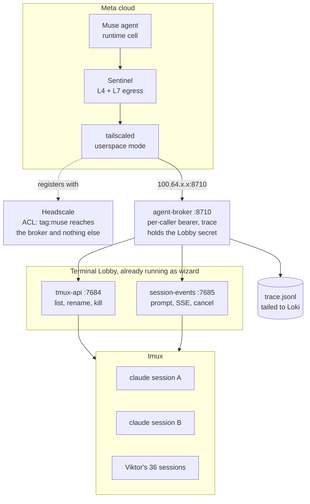
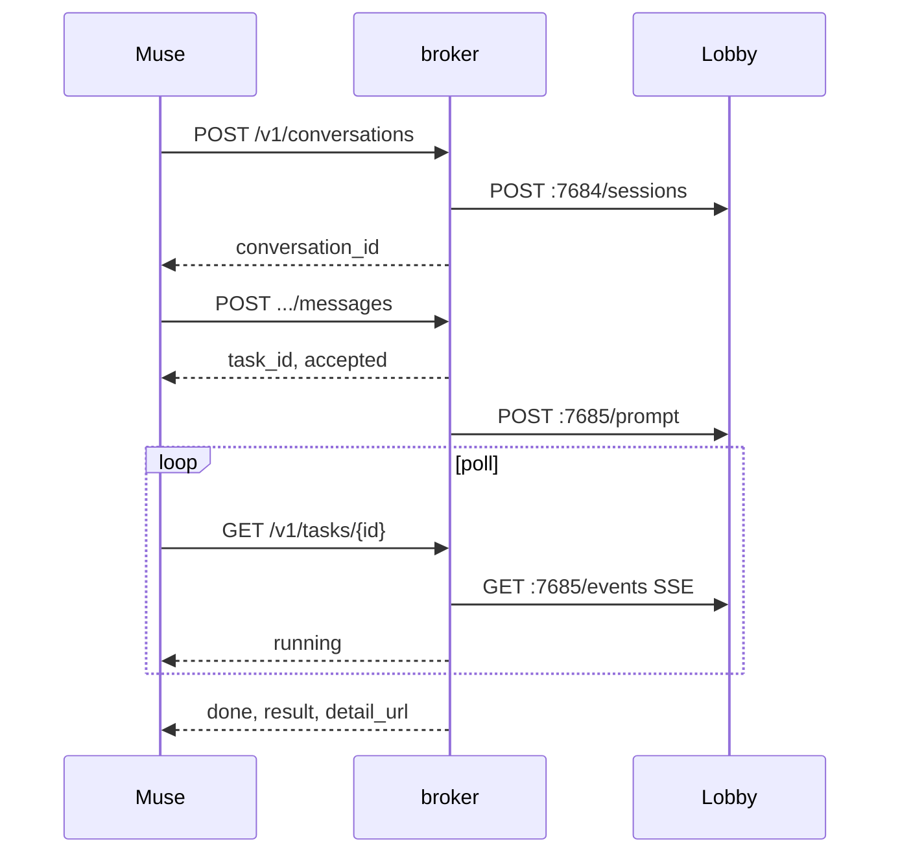

# Muse as an orchestrator of homelab agents

**Status:** approved, not started
**Date:** 2026-09-14, revised 2026-09-16
**Author:** Viktor Barzin (design worked out with Claude in a grilling session)
**Component:** `agent-broker` (new), Headscale, devvm

## Summary

Meta released Muse on 2026-09-08, a personal AI agent that runs in a Meta-hosted
VM. We want it to act as an orchestrator over the agents that already run on the
devvm: Muse holds the conversation with Viktor, and the real work happens here,
in Claude Code sessions it can create, address and read.

Muse reaches exactly one thing: a small REST service called `agent-broker`,
listening on the devvm's Headscale tailnet address. The broker starts and
resumes Claude Code conversations, returns task ids, and writes a replayable
trace of everything Muse asked for. Nothing else on the tailnet is reachable
from Muse's node.

Research shrank the build twice. Claude Code 2.1.270 already provides
persistent conversations addressable by id, a background session manager and a
machine-readable directory of live sessions. Then a second pass found that
**Terminal Lobby already serves most of the broker's job over HTTP**: it keeps
interactive Claude conversations alive in tmux and exposes them on the devvm at
`:7684` and `:7685`. The broker is therefore an authenticating, translating,
tracing proxy in front of services that are running today, plus one small
addition upstream, plus the network policy.

**Revision, 2026-09-16.** The first version of this design had the broker drive
`claude -p --session-id` / `--resume` itself. That works, and was verified, but
it reimplements prompt injection and transcript reading that Terminal Lobby
already does. Building on Lobby is the reuse-first choice; the consequences are
recorded in the decisions table and the risk register.

## What Muse is

Facts gathered 2026-09-13 and 2026-09-14, with sources.

| Property | Value |
|---|---|
| Released | 2026-09-08, US only. Web `muse.ai`, iOS, Android, WhatsApp |
| Model | Muse Spark 1.3 |
| Tiers | Free (about 100M tokens/week), Power $20/mo, Maximum $100/mo |
| Runtime | Per-user Muse Secure VM: Debian runtime container, Chromium, `systemd-nspawn` with root mapped to an unprivileged user, `io_uring` filtered, `CAP_SYS_PTRACE` and `CAP_NET_ADMIN` dropped |
| Capacity | Compiles code, runs concurrent subagents, runs scheduled cron jobs, keeps working when the app is closed |
| Egress control | Sentinel, a host-side process outside the sandbox. Sole authority for connector actions and all network egress, with no bypass |
| Egress checks | L4 (hostname, resolved IP, port, protocol) and L7 (decoded HTTP method, path, request contents) |
| SSRF control | "SSRF restrictions prevent an apparently public hostname resolving private infrastructure after DNS lookup" |
| Credentials | Stored in a Secure Credentials Store on the VM. Built-in connectors use surrogate tokens and just-in-time insertion at the network boundary, so the model never holds the real token |
| Custom tools | Muse writes its own connector against any public API or CLI, using credentials the user supplies. Meta does not review these |
| MCP | **Not supported in consumer Muse.** MCP is a Muse Code feature (the terminal coding agent, beta 2026-08-05, config in `~/.config/muse/settings.json` with `stdio` and `streamable_http`) |

Sources: [Meta AI Research, How We Built Safety Into Muse](https://research.meta.ai/blog/security-and-safety-for-ai-agents-our-approach-with-muse);
[Meta Help Center, How Muse works with Connectors](https://www.meta.com/help/artificial-intelligence/1687253048996149/);
[Axios, 2026-09-08](https://www.axios.com/2026/09/08/meta-debuts-muse-personal-ai-agent);
[TechCrunch, 2026-09-08](https://techcrunch.com/2026/09/08/meta-debuts-its-muse-ai-agent-will-consumers-trust-it/);
[explainx.ai architecture write-up, 2026-09](https://www.explainx.ai/blog/meta-muse-personal-agent-launch-sentinel-vm-security-2026);
[Muse Code MCP configuration](https://porteden.com/blog/muse-code-mcp-servers/).

Two consequences shape the whole design. Muse cannot speak MCP, so the contract
is a plain REST API that Muse reads and writes a connector for. And Muse runs on
Meta's hardware with Meta's egress policy in front of it, so whether it can reach
a tailnet address at all is the one thing we test before building anything.

## Shape



## Decisions

Settled during the grilling session on 2026-09-13 and 2026-09-14. Four rows were
revised on 2026-09-16 when the recon found Terminal Lobby already serving this;
those rows say so.

| Decision | Settled as | Why |
|---|---|---|
| Name | `agent-broker`, systemd unit on the devvm | Describes the role without naming one caller, so it survives the next SaaS agent |
| Placement | devvm, declared in `playbooks/devvm.yml` | It drives `claude` processes that live on the devvm as `wizard`. Anywhere else needs a remote-exec hop |
| Transport | Headscale tailnet only | We own the coordination server, so we own the policy and the revocation |
| Kill switch | Revoke the `tag:muse` node in Headscale | Removes network reachability rather than relying on the service behaving |
| Auth | Long-lived bearer token from Vault | What a Muse-written custom connector does naturally. Muse stores it where its model cannot freely read it |
| Protocol | REST plus a published OpenAPI document | Consumer Muse has no MCP. An MCP face over the same handlers can be added later if a caller wants one |
| Worker (**revised**) | Terminal Lobby: `POST /prompt/{session}` and `GET /events/{session}` on `:7685` | Running today, verified by curl. Keeps the conversation in tmux, so it survives every reconnect and service restart. Supersedes driving `claude -p --resume` directly, which was verified working and stays the fallback |
| Directory (**revised**) | `GET /sessions` on tmux-api `:7684` | Returns 36 live sessions with name, state, owner, tool, origin, lastActivity, driven. Richer than `claude agents --json`, and it is the same set |
| Durability (**revised**) | Always warm, in tmux | Supersedes "warm while active, cold after idle". Lobby holds every session resident. The cost is recorded under resource pressure below |
| Auth layering (**new**) | Broker holds the Lobby secret; Muse gets its own bearer | Lobby authenticates with one shared `TL_PROXY_SECRET` and a spoofable identity header, so it has no per-caller credential. The broker supplies that, and is the only thing that ever sees the Lobby secret |
| Conversations | Muse creates and addresses many by id. Nothing auto-closes; compact in place | Matches "remembers what we did last week" |
| Concurrency | One turn per conversation, parallel across conversations | A second message to a busy conversation queues, which keeps each history coherent |
| Async | Task id, Muse polls | Muse runs cron jobs and persists when closed, so polling is native to it. No inbound path into Meta's VM is needed |
| Blocked task | Parks as `needs_input` with the question attached | Muse is already Viktor's interface, so it relays the question at no build cost. Lobby already models this: sessions carry a `state` field and `POST /answer/{session}` answers a permission dialog |
| Viktor's own sessions | Visible, full transcript on request | Accepted risk, recorded below |
| Muse chooses per conversation | cwd, model, effort, permission mode | Not the system prompt, which is the field an injected instruction would most want |
| cwd allowlist | Everything under `~/code` | See the risk register: with the worker running as `wizard`, this is an affordance rather than a boundary |
| Human approval gate | None | The indirection and the trace are the controls |
| Containment | Runs as `wizard`, full existing access | Infra changes still go through Terraform and CI, which is an org rule rather than a preference |
| Trace | JSONL on disk, tailed into Loki, 30 day rotation | Keeps the simple local file and still answers `homelab logs query`. Confirmed 2026-09-16 that no tracing backend exists in the cluster (no Tempo, Jaeger or OTLP trace receiver), so this adds nothing to run |
| Trace contents | Full replay of a run, and Muse's verbatim request | Chosen over alerting and cost accounting |
| Git attribution | Viktor as author, Muse and the task id in the commit body | Nothing in CI or branch protection changes, and the commit message stays the audit trail |
| Spend | Uncapped, watched through the trace | |
| Tenancy | Single tenant | |

## API

Nine endpoints. The shape is deliberately flat and obvious, because an LLM has
to generate a working client from reading the OpenAPI document.

```
GET    /v1/health
GET    /openapi.json

GET    /v1/conversations                     list, from tmux-api GET /sessions
POST   /v1/conversations                     create -> {conversation_id}
GET    /v1/conversations/{id}                detail
GET    /v1/conversations/{id}/transcript     full history
POST   /v1/conversations/{id}/messages       send -> {task_id, status: "accepted"}

GET    /v1/tasks/{id}                        poll
POST   /v1/tasks/{id}/cancel
```

`POST /v1/conversations` takes `cwd`, `model`, `effort`, `permission_mode` and an
optional `name`. It rejects any `cwd` outside `~/code`.

`GET /v1/tasks/{id}` returns one of `accepted`, `running`, `needs_input`, `done`,
`failed`, `cancelled`. On `needs_input` it carries `question`. On `done` it
carries `result`, the agent's final message, and `detail_url` for the full turn
including tool calls.

Conversations created by Muse are readable and writable by Muse. Conversations
Viktor started are listed and readable, and reject `POST .../messages`.

**How each verb maps onto Terminal Lobby.** The broker translates; it does not
reimplement. Routes take the session as a path segment.

| Broker verb | Lobby call | State |
|---|---|---|
| `GET /v1/conversations` | `GET :7684/sessions` | exists, verified |
| `GET /v1/conversations/{id}` | same listing, filtered | exists, verified |
| `GET /v1/conversations/{id}/transcript` | `GET :7685/events/{session}` SSE, plus `/earlier/{session}` and `/search/{session}` | `/events` verified; the other two read from source, not exercised |
| `POST /v1/conversations/{id}/messages` | `POST :7685/prompt/{session}` | exists, read from source, deliberately not exercised against a live conversation |
| `POST /v1/tasks/{id}/cancel` | `POST :7685/cancel/{session}` | exists, read from source |
| needs-input answer | `POST :7685/answer/{session}` | exists, read from source |
| `POST /v1/conversations` | **nothing** | the one gap, below |

**The one upstream change.** Terminal Lobby has no REST session creation. A
session is born through ttyd's WebSocket; the only HTTP births are
`POST /sessions/prewarm`, restricted to directories already in a project list,
and `POST /restore`, which needs a prior kill snapshot. Closing this is a single
handler: `POST /sessions` in tmux-api calling `sessionio.NewSession` with a
`claude --session-id <uuid>` command. `NewSessionSpec{OSUser, Name, Dir, Command,
Env}` already exists in `terminal-lobby/sessionio/tmux.go`, and `NewSession`
already refuses a duplicate name.



## Network policy

The devvm joins the tailnet as a tagged node running `tailscaled` in
userspace-networking mode. Muse's VM joins as `tag:muse`. The Headscale ACL in
`stacks/headscale/acl.hujson` permits that tag exactly one destination:

```hujson
"tagOwners": {
  "tag:muse": ["group:admin"],
},
"acls": [
  { "action": "accept", "src": ["tag:muse"], "dst": ["tag:agent-broker:8710"] },
],
```

`acl.hujson` is git-crypt encrypted and must be edited and applied from the main
checkout only, per the pfSense subnet router runbook.

Revoking the node in Headscale removes Muse's reachability. That is the kill
switch, and it works whether or not the broker is behaving.

## Trace

One JSON object per line, in `/var/log/agent-broker/trace.jsonl`, rotated at 30
days by logrotate declared in the playbook, scraped into Loki alongside the
existing devvm journal jobs.

```json
{
  "ts": "2026-09-14T11:02:31.442Z",
  "trace_id": "01JB...",
  "task_id": "01JB...",
  "conversation_id": "da3732da-ab3d-4c94-bc21-8b24ef8ed2cd",
  "actor": "muse",
  "verb": "POST /v1/conversations/{id}/messages",
  "request": { "text": "...verbatim..." },
  "response": { "status": "accepted" },
  "tool_calls": [ { "name": "Bash", "input": "...", "result_bytes": 812 } ],
  "duration_ms": 143
}
```

Replay reads the file by `trace_id`. Loki gives cluster-wide search and survives
the devvm being rebuilt.

## What protects us, and what does not

The trace is the main control, so it is worth being precise about its reach.

**Holds.** Muse reaches one host and one port, enforced at the coordination
server rather than by the broker. Revocation is one action and does not depend
on the broker. Every request Muse makes is recorded verbatim and replayable.
Muse cannot set the spawned agent's system prompt. Infra changes take the
Terraform and CI path, so they are reviewable in git regardless of who asked.

**Does not hold, by choice.** There is no approval gate, so a request reaches an
agent before Viktor sees it. The worker runs as `wizard` with full access,
including sudo, `vault-admin` and push rights, which means a successful prompt
injection carries those rights. The cwd allowlist covers everything under
`~/code`, which includes `keys.txt`, `infra-git-crypt-key` and `finance/`; since
the worker runs as `wizard` it could read those from any cwd, so the allowlist is
a usability affordance rather than a security boundary. Muse can read the full
transcript of any of Viktor's own Claude Code sessions, of which 36 were live
when measured, and those transcripts contain whatever has passed through them.

**Scoped narrower than it looks.** Terminal Lobby resolves the OS user from
`/etc/ttyd-user-map` and scopes `/sessions` to that user, so the broker
presenting `vbarzin` sees wizard's 36 sessions and not emo's or ancamilea's.
Verified: `GET :7684/whoami` returns `{"admin":true,"authentik":"vbarzin","osUser":"wizard"}`.

**Closed by the broker.** Terminal Lobby's own auth is one shared 48-character
`TL_PROXY_SECRET` plus an identity header the service cannot verify, so anything
reaching `:7684`/`:7685` with the secret can claim to be any user. That is
adequate for a browser behind forward-auth and inadequate for an external
caller. The broker is the fix: it holds the secret, Muse never sees it, and
Muse's own bearer is revocable on its own. Note the secret does not cover ttyd
on `:7681`, which hands out a shell; the Headscale ACL is what keeps Muse away
from that port.

**Would not hold if we went public.** pfSense NATs WAN :443 straight to Traefik
with no Cloudflare-source restriction, so any control placed at the Cloudflare
edge alone is bypassable by a client hitting the WAN IP with the right SNI. Only
an in-cluster or on-host gate holds. This matters only if the spike fails and
the transport decision reopens.

**Resource pressure is a real constraint on "nothing auto-closes".** Measured
2026-09-16: the devvm root filesystem is 90% full with 24G free, 46 `claude`
processes are running, and 8 of 23G swap is in use. Lobby holds every session
warm, so each conversation Muse opens is resident indefinitely. Watch free disk
before session count.

The attack path we consider most likely is a prompt injection arriving through
one of Muse's own built-in connectors, most plausibly email, that persuades Muse
to delegate a harmful task here. Meta's taint tracking, as described, follows
data leaving the VM rather than instructions arriving. Our side sees a
well-formed authenticated request and runs it.

## Open questions

- Whether Sentinel permits egress to a `100.64.0.0/10` destination. This is the
  spike, and everything else waits on it. The capability half looks answerable:
  userspace-networking mode needs no TUN device and no `CAP_NET_ADMIN`, and that
  exact configuration is running on the devvm today under another user. The
  policy half is unknown.
- Whether Muse's custom-connector code can hold and send a bearer header
  reliably across sessions. Expected to work, not verified.
- How Muse behaves when a tool call returns `needs_input`. The intent is that it
  relays the question; whether it does so promptly is a behaviour we will observe.
- Retention of Muse-side logs of these calls, and what Meta keeps, is unknown.
- The write path into Terminal Lobby (`POST /prompt/{session}`) is read from
  source and its tests, deliberately not exercised, because doing so injects
  text into somebody's live conversation. Exercise it against a session the
  spike creates, not an existing one.
- Whether an always-warm session model is sustainable at the number of
  conversations Muse opens, given the disk figure above. Cold-resume via
  `claude --resume` remains the fallback if it is not; that path was verified
  correct, though never timed.
- `tmux-persist-save.service` is what carries tmux session names across a
  reboot. It was reported as failed; checked 2026-09-16 and it is a
  timer-driven oneshot sitting `inactive (dead)` with `status=0/SUCCESS`, which
  is normal. No action, recorded so the next reader does not re-raise it.

## Plan

**Step 0. Put the devvm on the tailnet.** Add a Tailscale role to
`playbooks/devvm.yml`: `tailscaled` in userspace-networking mode as a systemd
unit, registered to Headscale with a pre-auth key under `tag:agent-broker`.
`playbooks/devvm.yml` has no Tailscale tasks yet, and the userspace daemon
running under `/home/emo/.tailscale-us` since 2026-08-14 predates any playbook
entry for it. Bringing both under the playbook is the tidy outcome; filing the
second as separate drift is equally fine. Run with `--check
--diff` first; a healthy run against the live box is otherwise a no-op.

**Step 1. The spike. This is a gate.** Serve a trivial value from a port bound
only to the devvm's tailnet address. Get Muse's VM onto Headscale as `tag:muse`
and have Muse read that value. Nothing else is built until this passes. If it
fails, the finding is that Sentinel blocks CGNAT destinations, and the design
returns to Viktor for a transport decision rather than adding a public
endpoint without one.

**Step 2. `POST /sessions` in tmux-api.** One handler in the `terminal-lobby`
repo calling `sessionio.NewSession` with `claude --session-id <uuid>`. Its spec
type already exists. This is the only upstream change the design needs, it ships
in the Debian package like every other Lobby change, and it is useful to Lobby
independently of Muse.

**Step 3. `agent-broker` v1.** New repo under `~/code`, semver from `v0.1.0`,
test-first. Per-caller bearer auth against a Vault-held token, the nine verbs
translated onto Lobby's routes, the Lobby secret held here and never passed on,
and the trace file. Concurrency is one turn per conversation; Lobby serializes
that for us, because a tmux session processes one turn at a time.

**Step 4. Connect Muse.** Publish the OpenAPI document at the tailnet address and
have Muse build its custom connector from it. Verify by driving a real task
end to end and reading the trace back.

**Step 5. Observability.** Promtail scrape for the trace file, logrotate at 30
days, both declared in the playbook. No tracing backend is needed and none
exists to reuse.

**Step 6. Optional.** An MCP face over the same handlers, if a caller that speaks
MCP turns out to want one.

## Verification log

What was actually run on 2026-09-13 and 2026-09-14, rather than assumed.

| Claim | How it was checked | Result |
|---|---|---|
| A headless Claude conversation persists across processes | `claude -p --session-id <uuid>` wrote a token, then `claude -p --resume <uuid>` in a separate invocation | Recalled correctly |
| A machine-readable session directory exists | `claude agents --json` | 29 sessions with id, name, cwd, kind, status, waitingFor |
| Background session management exists | `claude --help` on 2.1.270 | `--bg`, `attach`, `logs`, `stop`, `rm`, `respawn`, `--resume`, `--fork-session`. `stop` keeps the conversation |
| Tailscale here is self-hosted | `infra/docs/runbooks/pfsense-tailscale-subnet-router.md`, `stacks/headscale/` | Headscale in-cluster, `100.64.0.0/24`, pfSense subnet router advertising the LAN and both VLANs |
| Live tailnet membership | `headscale nodes list` | 9 nodes. `pfsense` at `100.64.0.9` online, `devvm-emo` at `100.64.0.61` online |
| Wizard's devvm is not enrolled | `tailscale status` as wizard | No daemon socket, system unit disabled and inactive |
| Userspace mode works unprivileged on this box | `ps` on the running `tailscaled` | emo runs `--tun=userspace-networking --socks5-server --outbound-http-proxy-listen`, unprivileged, since 2026-08-14 |
| Design docs are not git-crypt encrypted | `.gitattributes` | `*.hujson` is; `docs/plans/*.md` is not |
| Consumer Muse has no MCP | Meta Help Center connectors page, plus corroborating write-ups | Connectors, user-supplied API credentials, or the browser. MCP is Muse Code only |
| Terminal Lobby serves sessions over HTTP | `ss -ltn`, then curl against `:7684` and `:7685` | Both listening. `/whoami` returned `osUser: wizard`; `/sessions` returned 36 with state, owner, tool, origin; `/events/{session}` streamed `event: ready` |
| Lobby auth is a shared secret | read `/etc/terminal-lobby.local.conf`, then curl | `X-Authentik-Username` plus a 48-char `TL_PROXY_SECRET`. No header gives 401; wrong secret gives `missing or incorrect proxy secret` |
| No tracing backend exists | cluster-wide search for tempo, jaeger, otel, zipkin, signoz | Zero. Two OTLP ingests exist, logs and metrics only |
| Resource pressure on the devvm | `df`, `pgrep`, `free` | Root filesystem 90% full, 24G free; 46 `claude` processes; 8 of 23G swap used |
| `tmux-persist-save` is not failed | `systemctl status` | Timer-driven oneshot, `inactive (dead)`, `status=0/SUCCESS`, last run 83s earlier |
| `OPENAI_COMPAT_AGENT` is no longer `recruiter-triage` | read `claude-agent-service/app/main.py:79` | `None` since 2026-09-11. Memory #6186 corrected |
