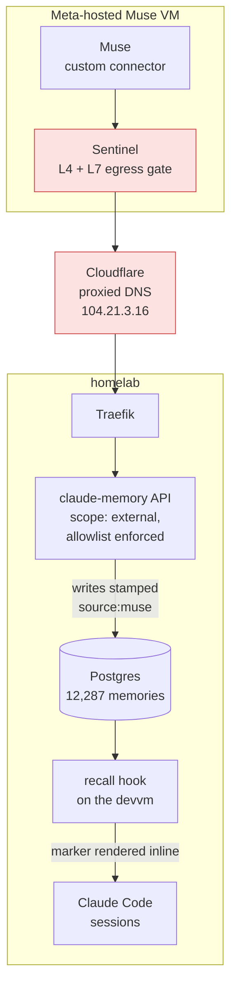

# Muse as a reader and writer of our memory store

**Status:** approved, not started
**Date:** 2026-09-16
**Author:** Viktor Barzin (design worked out with Claude in a grilling session)
**Component:** `claude-memory` (API + stack), devvm playbook (recall hook)

## Summary

Muse holds conversations with Viktor on his phone. This design gives it the same
background Claude Code has here, by letting it call the `claude-memory` API
directly as a tool. Reads and writes, both.

It is a sibling to [agent-broker](2026-09-14-muse-agent-broker-design.md) and a
different job. Memory is a tool Muse uses while talking to Viktor. agent-broker
is a proxy Muse uses to run work in our infrastructure, where the safety comes
from the system prompt on our own agents. Neither blocks the other, and they
share no code.

Nothing is installed in Meta's VM. The starting idea was to put the `homelab`
CLI inside Muse's sandbox and hand it credentials. Two facts point elsewhere:
consumer Muse has no MCP connector and no supported way to run our binaries, and
our API is already on the public internet with an OpenAPI spec it serves itself.
Muse writes its own connector against that spec, which is the path the product
supports.

## How Muse reaches us

`claude-memory.viktorbarzin.me` is published deliberately, and has been since the
stack was written. `infra/stacks/claude-memory/main.tf:541` sets `auth = "none"`
with the comment that forward-auth would break programmatic clients, and
`dns_type = "proxied"` puts it behind Cloudflare. Authentication is the bearer
token alone.

Measured 2026-09-16:

| request | result |
|---|---|
| `getent hosts` on the devvm | `10.0.20.203` (internal Traefik) |
| public DNS via `1.1.1.1` | `172.67.130.8`, `104.21.3.16` (Cloudflare) |
| forced Cloudflare edge, `GET /health` | `200` |
| forced Cloudflare edge, `GET /openapi.json` | `200` |
| forced Cloudflare edge, `GET /api/memories` with no token | `422`, missing header |

Because the name resolves to a Cloudflare address from outside, Sentinel's
private-infrastructure restriction never applies. This is the difference from
agent-broker, which reaches a `100.64.0.0/10` tailnet address and waits on a
spike to find out whether Sentinel permits that at all.

One property of the public path is worth carrying over from the agent-broker
doc, because it shapes a choice below. pfSense NATs WAN `:443` straight to
Traefik with no Cloudflare-source restriction, so a control placed at the
Cloudflare edge alone can be bypassed by a client hitting the WAN IP with the
right SNI. Only an in-app or on-host gate holds. That is why the endpoint
restriction below lives in the application rather than in a Cloudflare rule.

## What the API does today

The write paths are already owner-scoped, and the sharing tables
(`memory_shares`, 18 rows; `tag_shares`, 156 rows) do real work on them. The gap
is on the read side: `recall`, `list` and `get`-by-id carry no owner predicate,
so `user_id` reaches the SQL only as a label.

| endpoint | ownership boundary | evidence |
|---|---|---|
| `POST /api/memories/recall` | none | `recall.py:150-184`, `recall.py:252-282` |
| `GET /api/memories` | none | `app.py:329-354`, code comment reads `all memories are public` |
| `GET /api/memories/{id}` | none | `app.py:978-990` |
| `PUT /api/memories/{id}` | owner, or an explicit write-share | `app.py:822-826`, `permissions.py:5-52` |
| `DELETE /api/memories/{id}` | owner only | `app.py:530-536` |
| `POST /api/memories/{id}/secret` | owner only | `app.py:565-577` |

Confirmed live with the `wizard` key, one recall call, twelve rows returned:

```
id=11811  owner=emo     shared_by=emo
id=13172  owner=emo     shared_by=emo
...
OWNER TALLY: {'emo': 11, 'wizard': 1}
```

Corpus by direct count: 12,287 live memories, `wizard` 11,269 and `emo` 1,018.
Importance distribution is 2,527 in 0.8-1.0, 3,483 in 0.6-0.8, 917 in 0.4-0.6,
4,346 in 0.2-0.4 and 1 below that.

The sensitive-content pipeline detects credential-shaped text and redacts it in
place before insert, which works. The storage half of it is not configured in
this deployment: the live Deployment carries no `VAULT_ADDR`, `VAULT_TOKEN` or
`MEMORY_ENCRYPTION_KEY`, and 0 of 81 sensitive-flagged rows have a `vault_path`
or `encrypted_content`. The original text is discarded at write time, so
`POST /api/memories/{id}/secret` returns the already-redacted content rather
than a recovered secret.

## The design

Five changes, four in `claude-memory` and one in the devvm playbook.

**1. Key scope.** `API_KEYS` is a flat `{"user": "key"}` map today. It grows a
richer form carrying a scope:

```json
{"wizard": {"key": "...", "scope": "admin"},
 "muse":   {"key": "...", "scope": "external"}}
```

The flat form keeps parsing, so existing keys work through the rollout. `AuthUser`
gains the scope alongside `user_id`.

**2. Endpoint allowlist.** A key with scope `external` may call recall, list, get,
store, update and delete on its own entries, link creation, and the tag list.
`POST /api/memories/import`, `POST /api/memories/migrate-secrets`,
`GET /api/users` and `POST /api/memories/{id}/secret` return 403 to it.

**3. Curated spec.** `/muse/openapi.json` is generated from the same allowlist the
auth layer enforces, so the spec and the enforcement cannot drift apart. Muse is
pointed at that URL rather than the full `/openapi.json`.

**4. Origin tag.** Any write from an `external` key is stamped server-side with
`source:muse`. Muse cannot opt out and a leaked token cannot either. There is no
importance ceiling: Muse's entries compete on the same footing as everyone else's.

**5. Provenance in recall.** The recall hook renders the origin tag inline in the
auto-recall block, so every Claude Code session on the devvm can see which claims
came from an external assistant. The hook is provisioned per user by
`playbooks/devvm.yml`, so this half is an Ansible change.



## What we are deliberately not doing

Each of these was decided with its consequence stated. The table records what
each one costs.

| not doing | consequence accepted |
|---|---|
| Adding an owner filter to the read paths | The `muse` key reads `emo`'s 1,018 entries from day one |
| Capping the importance of Muse's writes | A Muse entry can lead the recall block on any turn |
| Building a per-user audit trail | After this ships, "what did Muse read" is unanswerable. "What did Muse write" stays answerable through the origin tag |
| A Cloudflare rate limit | A leaked key can be drained at the default Traefik limit of 10/s, burst 50 |
| Configuring encryption for sensitive entries | Unchanged from today. 81 flagged rows, none recoverable |
| A human approval gate | Consistent with the same call in agent-broker |

The controls this design relies on are the endpoint allowlist, the owner-scoping
already present on delete and update, and the origin tag. Reads, tenancy and
importance are open by choice.

## Rollout

Order matters in one place. The code that parses both `API_KEYS` shapes has to be
running before the Vault value changes to the new shape, or every existing key
fails in the gap between them.

1. Land the scope parsing, the allowlist, the curated spec route and the origin
   tag in `claude-memory-mcp`. Semver bump, image to ghcr, deployed by GitOps.
2. Verify against the live service with a temporary `external`-scope key.
3. Mint the `muse` key in Vault, let ESO sync it, switch `API_KEYS` to the
   richer shape.
4. Land the recall-hook provenance marker in `playbooks/devvm.yml`, apply, and
   confirm with `--check --diff` that the box is a no-op afterwards.
5. Viktor sets up the connector in Muse.

## Setting up the Muse side

These are the steps only Viktor can do, in the Muse app:

1. Create a custom connector and give it the spec URL
   `https://claude-memory.viktorbarzin.me/muse/openapi.json`.
2. Set the authentication to a bearer token and paste the `muse` key.
3. Ask Muse to recall something it could only know from the store, for example a
   preference recorded months ago.
4. Ask it to remember something new, then check from the devvm that the entry
   carries `source:muse`.

## Verification

What can be checked from here, before Viktor touches the app: an `external`-scope
key gets 403 on each of the four closed endpoints and 200 on recall and store; a
store through that key lands with `source:muse` attached; `/muse/openapi.json`
lists exactly the allowlisted operations; and a Claude Code session on the devvm
shows the provenance marker in its recall block.

What cannot be checked from here: whether Muse's connector builder accepts the
spec, and whether it holds the bearer header across sessions. The agent-broker
doc lists that same question as unverified. Without an audit trail we also cannot
confirm the first successful call from Muse by reading logs, so step 4 of the
setup above is the confirmation that the path works end to end.

## Open questions

- Whether Muse's connector builder accepts a curated OpenAPI document of this
  shape. Expected to work, not verified.
- What Meta retains of the request and response bodies that pass through the
  connector. Unknown, and the same unknown the agent-broker doc records.
- Whether `ancamilea`, who appears in `GET /api/users`, holds memories. The
  direct count returned rows for `wizard` and `emo` only.
- How often Muse writes in practice. With no ceiling and no rate limit, the
  first weeks of `source:muse` entries are the measurement that tells us whether
  either is needed.
