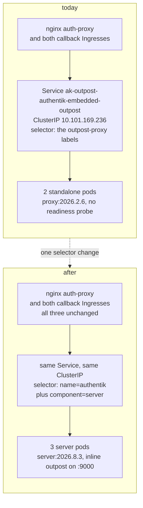
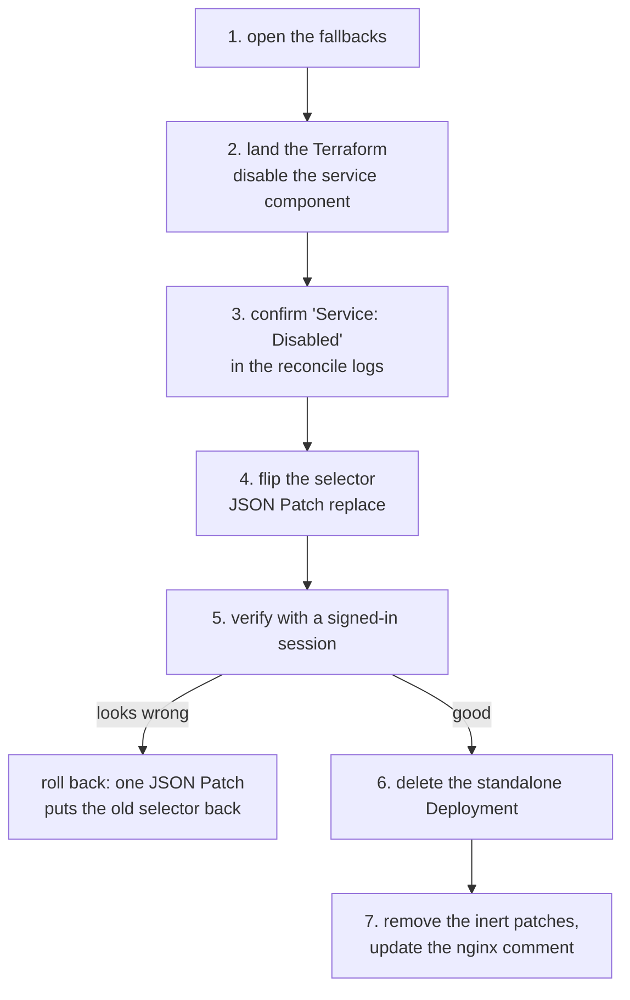

# Move forward-auth to the inline outpost

Bead `code-osvg`. Status: attempted 2026-09-18, rolled back, revised 2026-09-19.
The mechanism works. The session cost is now measured rather than assumed, and the
decision is to pay it at a quiet hour.

Retire the standalone embedded-outpost Deployment and let the outpost that runs
inside the authentik server pods answer forward-auth and the OAuth callback.

```stats
95 | hosts behind the one Service
2026.2.6 | outpost image today
2026.8.3 | server image today
1 | object the cutover changes
```

## Why this is worth doing

Three open problems share one cause, and one change closes all three.

| problem | today | after |
|---|---|---|
| `code-osvg`: the outpost is seven minor versions behind | `proxy:2026.2.6` against a 2026.8.3 server, and it cannot be upgraded | forward-auth runs at the server version by construction |
| `code-f1zd`: no readiness probe on the outpost | pods join Service endpoints before `:9000` binds, which is the 2026-09-13 outage mechanism | the Deployment stops existing, so the bead dissolves |
| the Service gets a new ClusterIP on upgrades | nginx caches the IP for the life of the process and dials a dead address, which is the 2026-08-19 outage | authentik stops managing the Service, so nothing recreates it |

The outpost cannot be upgraded in place because of an upstream design decision,
not a packaging gap. From 2026.8, an outpost marked embedded reaches the core
over a unix socket that only exists inside the server pod
(`src/outpost/event.rs:186`, guarded by `controller.is_embedded()`). Run
`proxy:2026.8.3` in a separate pod and it never listens. `2026.2.6` is the
newest image that works in the standalone shape, so the version gap widens with
every authentik release.

## What happened on 2026-09-02, and what is different now

This change was attempted once and reverted 29 minutes later.

`03692ff0` pointed the nginx forward-auth upstream at `goauthentik-server` and
left the OAuth callback on the standalone outpost. The two implementations
write the same cookie name on the same domain in formats neither can read: the
inline one issues `<base64 hmac>=<uuid>`, the standalone one a bare base32
session id. Forward-auth could not read the cookie the callback had just set,
so every signed-in request looped between login and callback. `OriginStatus 0`
across the estate. `305aaca9` reverted it.

That attempt also recorded a reason for not moving the callback with it: the
`ak-outpost-authentik-embedded-outpost` Ingress belongs to the outpost
controller and cannot be repointed durably. That still holds at 2026.8.3.

The reconciler is easy to miss, because it does not live with the others. While
`authentik/outposts/controllers/k8s/` holds no ingress reconciler in 2026.2.6,
2026.8.1 or 2026.8.3, `ProxyKubernetesController` registers an
`IngressReconciler` from `authentik/providers/proxy/controllers/k8s/ingress.py`
and appends it to the reconcile order. It defines no `noop`, so it inherits
`False` and writes that Ingress on every pass, pointing it at the Service by
name on port `http`. That matches the live object exactly.

So the callback cannot be moved by editing an Ingress, and this plan does not
try. It changes the one object nginx and both Ingresses already resolve
through, which carries the callback along without touching an Ingress at all.

> [!IMPORTANT]
> Forward-auth and the OAuth callback must be answered by the same outpost.
> Splitting them across the two implementations is what took the estate down on
> 2026-09-02. Every step below preserves that invariant.

## The mechanism

`ak-outpost-authentik-embedded-outpost` keeps its name, its ClusterIP
`10.101.169.236` and its ports. Only `spec.selector` changes, from the
outpost-proxy labels to the two labels that identify the server pods. nginx and
both callback Ingresses are untouched, so both halves of the flow move together
in the same instant.



Two facts make this safe, both checked against the live cluster.

**The selector matches only the server pods.** Our own json patch stamps
`app.kubernetes.io/component: server` onto the outpost pods, so that label
alone would match both sets. `app.kubernetes.io/name` separates them: server
pods carry `authentik`, outpost pods carry `authentik-outpost-proxy`. The
two-label AND selector returns the three server pods and nothing else.

**The inline outpost already answers.** Probed directly against a server pod
IP: `/outpost.goauthentik.io/ping` returns 204, and
`/outpost.goauthentik.io/auth/traefik` carrying forward-auth headers returns
302. It is the same outpost object with the same UUID and the same provider
assignments, running in-process instead of in its own pod.

## The patch type decides whether this works

The selector has to be set with an explicit JSON Patch `replace`. A merge patch
of any flavour leaves the four stale keys in place, and the merged six-key
selector matches zero pods. Measured with a server-side dry run against the
live object:

| patch type | resulting selector | matches |
|---|---|---|
| `--type=merge` | 6 keys: the 2 new plus the 4 old | no pods |
| `--type=strategic` | 6 keys, identical result | no pods |
| `--type=json` with `replace` | exactly the 2 new keys, ClusterIP preserved | the 3 server pods |

This matters beyond the one command, because authentik's own reconciler updates
the Service with a whole-object merge patch. It ran that way at 22:01 on
2026-09-18 during the 2026.8.3 upgrade, in place, without changing the
ClusterIP. If the reference selector it computes ever stops matching the live
one, that merge produces the six-key result, and it does not converge on
re-run: the reconciler would keep re-applying the same non-matching patch.

For an embedded outpost the reference selector authentik computes is exactly
the two server labels (`service.py:53-57`). So simply deleting our json patch
override would trigger that merge and take forward-auth down. The override has
to come out together with the reconciler being told to leave the Service alone.

`kubernetes_disabled_components` is the supported way to say that. The
`outpost_controller` task always dispatches through `up_with_logs()`
(`tasks.py:21`), and that path skips any reconciler named in the list
(`kubernetes.py:106`). The plain `up()` does not check the list, but nothing
reaches it on this code path.

## Which reconcilers are live today

Worth recording, because which of them are inert explains several things that
looked puzzling earlier.

Our outpost is a proxy outpost, so the reconciler set is the five in
`KubernetesController` plus three more that `ProxyKubernetesController` adds.

| reconciler | runs for our embedded outpost | consequence |
|---|---|---|
| secret | no, `is_embedded` | authentik never writes the outpost token Secret |
| deployment | no, `is_embedded` | the standalone Deployment is a frozen artifact, and `kubernetes_json_patches.deployment` has no effect |
| **service** | **yes** | the object this plan changes, and the one the disable flag targets |
| service-metrics | no, `is_embedded` | not managed |
| service-monitor | yes | unaffected by this plan |
| ingress | yes, no `noop` | keeps the callback Ingress pointed at the Service by name, which is what carries the callback across |
| httproute | no, the Gateway API CRD is absent | not managed |
| traefik middleware | yes, delegates `noop` to its versioned inner reconciler | the live Middleware is 223 days old, unaffected by this plan |

The inert deployment patches are why the readiness probe in `code-f1zd` could
never be applied. They were written before upstream added the `is_embedded`
guard and have had no effect since.

## Steps



1. **Open the fallbacks before touching anything.** Emergency Access basic auth
   covers the browser path. The loopback terminal-lobby proxy on
   `127.0.0.1:7899` and the ssh plus tmux path cover getting back in if the
   browser path is the thing that breaks. Viktor calls the abort.

2. **Terraform, in `stacks/authentik/authentik_provider.tf`.** On
   `authentik_outpost.embedded`, set
   `kubernetes_disabled_components = ["service"]` and delete the
   `kubernetes_json_patches.service` block. Leave the deployment patches for
   step 7 so this commit stays small.

3. **Confirm authentik has let go.** The reconcile logs should carry
   `Service: Disabled`. Until that is true, step 4 would be undone by the next
   reconcile.

4. **Flip the selector**, with the command below. Endpoints should go from the
   two outpost pod IPs to the three server pod IPs within a second, with the
   ClusterIP unchanged. This is a live write on an object Terraform does not
   own, so it needs a presence claim and a note in the commit body of step 7.

5. **Verify with a request that carries a session.** This is the step the
   2026-09-02 attempt did not do, and its absence is why the loop was not
   caught. An unauthenticated probe gets 302-to-login, which is the correct
   answer for a session-less request, so the estate looks healthy while every
   signed-in request loops. Drive a protected host in the cluster browser with
   a real session and confirm the page renders. Then check that
   `X-Authentik-Username` still reaches terminal-lobby, since its identity
   header comes from this outpost. In Loki, `OriginStatus 200` on real traffic
   rather than a redirect chain is the signal.

6. **Delete the standalone Deployment.** authentik will not recreate it,
   because the deployment reconciler no-ops for embedded outposts. Keep it in
   place until step 5 passes, since scaling it back up is the fast rollback.

7. **Clean up.** Remove the inert `kubernetes_json_patches.deployment` block,
   rewrite the nginx upstream comment in
   `stacks/traefik/modules/traefik/main.tf` (its "STILL OPEN" note about the
   recreated ClusterIP is resolved by this change), and close `code-osvg` and
   `code-f1zd`.

The step-4 command, which has to be a JSON Patch `replace` for the reason above:

```sh
kubectl patch svc ak-outpost-authentik-embedded-outpost -n authentik --type=json \
  -p '[{"op":"replace","path":"/spec/selector","value":{
         "app.kubernetes.io/name":"authentik",
         "app.kubernetes.io/component":"server"}}]'
```

## Every signed-in user is logged out once, and that is not avoidable

This section said the re-authentication would probably be a silent OAuth
round-trip. That was wrong, the cutover was attempted on 2026-09-18 and it is
now measured rather than assumed.

Asking each implementation what cookie it sets on an unauthenticated
forward-auth gives the same cookie name in two incompatible formats:

```
inline Rust       authentik_proxy_34f8da53=<43-char base64 HMAC>=<36-char UUID>
                                           total 82 characters, URL-encoded
standalone Go     authentik_proxy_34f8da53=<52-char base32 session id>
```

Values elided on purpose. They were captured from unauthenticated requests and
are not live sessions, but they are high-entropy session material and do not
belong in the repository. Reproduce them by sending a forward-auth request with
no cookie to a server pod and to a standalone outpost pod on port 9000 and
reading the `set-cookie` header from each.

Go writes a 52-character base32 session id, which is exactly the `session_key`
column in `authentik_providers_proxy_proxysession`. Rust writes an HMAC plus a
UUID, 82 characters. Both implementations read that one shared table, but they
key into it differently, so neither can read the other's cookie.

The cost of that is larger than a redirect. Background XHR and SSE requests
cannot follow a 302, so a signed-in page stops working rather than
re-authenticating itself. Measured on 2026-09-18:
`terminal.viktorbarzin.me` held 100% allowed in every five-minute bucket for the
preceding hour, then went to 0%. Estate-wide allow rate went 68.7%, then 22.9%,
then 0%.

Rolling back does not undo it either. Browsers that completed a callback during
the window hold a Rust cookie that the Go outpost then rejects in turn.
Recovery needed one real navigation per browser, confirmed live when Viktor
reloaded and terminal went from 0 to 49 allowed requests.

So the logout is the price of the migration and every route pays it, including
a move to a separate managed outpost, because both are Rust. Upstream's v2026.8
release note describes the rewrite as aiming to be "a 1-to-1 match with the
previous code" and lists no session break, so this is undocumented.

Decision taken 2026-09-19: cut over at a quiet hour and accept the reloads.

## Two findings that change how the cutover is run

**nginx keepalive hides the cutover for several minutes.** Changing the Service
selector moved no traffic at first, because conntrack keeps established
connections pinned to the old pod IPs and the upstream block carries
`keepalive 32`. The cutover only took effect after `deploy/auth-proxy` was
rolled. Treat that restart as part of the cutover, and do not read health from
the window before it.

**The inline outpost does not log per-request.** It produced five log lines in
twenty minutes while serving, where the Go standalone logs every
`/outpost.goauthentik.io/auth/traefik` call. On the night this was read as
"traffic never reached it", which was an inference with nothing behind it. Judge
the cutover from the auth-proxy verdict counts instead.

## Rollback

The fast path is a single JSON Patch putting the five-key selector back, which
returns traffic to the standalone pods. Keep those pods running until step 5
passes so this stays available.

```sh
kubectl patch svc ak-outpost-authentik-embedded-outpost -n authentik --type=json \
  -p '[{"op":"replace","path":"/spec/selector","value":{
         "app.kubernetes.io/managed-by":"goauthentik.io",
         "app.kubernetes.io/name":"authentik-outpost-proxy",
         "goauthentik.io/outpost-name":"authentik-embedded-outpost",
         "goauthentik.io/outpost-type":"proxy",
         "goauthentik.io/outpost-uuid":"0eecac0797c7443c892505f2f4fe3e47"}}]'
```

Full rollback is that patch plus reverting the step-2 commit. After the
Deployment is deleted in step 6 the fast path is gone, which is the reason
step 6 comes after verification rather than before.

## Blast radius

95 distinct hosts across 103 ingresses use a forward-auth middleware, and all
of them resolve through this one Service. A wrong selector affects every one of
them at the same moment. That argues for doing this with the fallbacks open and
a signed-in browser ready, in the same posture as the 2026.8.3 upgrade.

Out of scope and unaffected: the `public`, `postgres-ldap` and `rac` outposts
are genuine standalone outposts rather than embedded ones, so their reconcilers
work normally and they already run 2026.8.2. `postgres-ldap` and `rac` are
scaled to zero replicas, which predates this work.

## Open questions

- Both of the first two questions here are now ANSWERED, and both answers were
  the unwelcome one. The re-authentication is not silent, and the cookie formats
  do differ on 2026.8.3, re-derived directly from each implementation rather
  than quoted. See the logout section above.
- Still open: whether a cutover can be staged so that fewer sessions are in
  flight, for example by picking an hour with no active browsers, rather than
  simply accepting the reloads. Nothing has been designed for this.
- Whether any consumer other than nginx and the two Ingresses depends on the
  Service was checked cluster-wide and came back clean. A consumer holding the
  ClusterIP in a config file outside the cluster would not show up in that
  sweep.
- Disabling the service component means authentik will no longer recreate that
  Service if it is ever deleted, while the ingress reconciler keeps writing an
  Ingress that points at it by name. That trade is the point of the change, and
  it is worth a line in the runbook when this lands.
