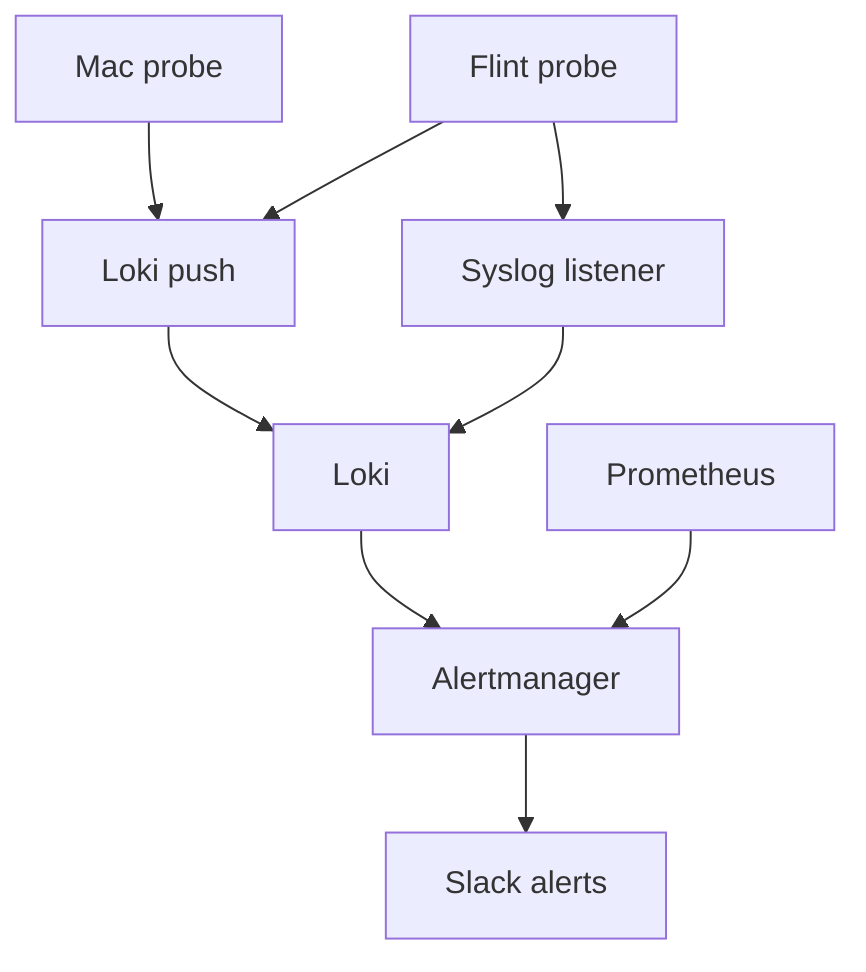

# London Flint as the main router

Status: executing 2026-09-27. Owner: Viktor. Cutover before 6 Oct 2026.

The Hyperoptic router in the London flat goes back to Hyperoptic when the plan
changes to Broadband Only on 6 Oct. The GL.iNet Flint 2 then plugs straight into
the Hyperoptic wall port and becomes the only router at the **London site**.
Clients on the Flint have been seeing **internet drops**: the public internet
goes away for a while, local things keep working, and devices sometimes fall back
to the Hyperoptic Wi-Fi. This plan fixes what we can see now, installs monitoring
that explains the next drop, and covers the cutover.

## Ground rules

- Every change to the router goes through the GL admin UI settings or, where GL
  has no page, LuCI, applied through the same RPC APIs those UIs call (GL `/rpc`,
  OpenWrt ubus/rpcd). Each change is visible in one of the two UIs afterwards.
- Read-only SSH is fine for diagnostics (the kernel log has no API equivalent).
  Nothing is written over SSH.
- Cluster-side pieces go through Terraform in this repo.

## What we know (read-only sweep, 2026-09-27)

| area | finding |
|---|---|
| firmware | GL 4.9.1, the current stable (OpenWrt 21.02, MediaTek closed driver) |
| WPA3 fix of 13 Sep | holding: 0 of the SAE/PMKID error signatures in 6.4 days of kernel log |
| uptime | 6d 18h, load 0.02, 661 MB free, conntrack 871 of 16384 |
| WAN | DHCP 192.168.20.195 behind the Hyperoptic router (double NAT), link up the whole boot |
| routing | internet traffic leaves via the WAN; only 10.0.0.0/8 and the Sofia LANs use the tunnel |
| router's own 10.x traffic | leaks out the WAN. GL installs tunnel routes in its own table (1001), which only forwarded LAN traffic consults; GL's "local access" option opens the tunnel zone for input, it does not route the router's traffic |
| multi-WAN watchdog (kmwan) | failover mode with one WAN, pings 8.8.8.8 / 9.9.9.9 / 208.67.222.222; able to mark the only WAN down |
| DNS | dnsmasq forwards to AdGuard public DNS (94.140.14.14, 94.140.15.15), retrying across both; 150-entry cache evicted 3,038 live entries in 6.8 days |
| 2.4 GHz | channel 1 at 40 MHz; ra0 logged 2.85M receive errors against 2.89M packets; IoT reconnect bursts |
| 5 GHz | auto channel (now 44), 80 MHz, WPA2 |
| regulatory | both radios set to country DE, the factory region; GL applies a per-rate power table only for DE |
| 5 GHz DFS | radar checks enabled, no channels excluded from auto selection |
| WAN exposure | SSH (password login on) and the admin page accept connections on the WAN, v4 and v6; the Hyperoptic router blocks them today |
| guest network | forwards to the tunnel, masqueraded as 10.3.2.6 |
| firmware resets | 2 Wi-Fi chip self-resets on 23 Sep (12:45:26, 15:58:30), clients stayed associated |
| schedule | GL timer reboots the router every Monday 04:00 |
| telemetry | none: no London metrics or logs in Prometheus/Loki; ha-london and rpi-london are both offline |

The symptom Viktor describes (internet gone, everything local fine, "as if DNS
drops or a VPN drops") fits three candidates: an upstream hiccup through the
Hyperoptic router, kmwan pulling the default route, or DNS upstream failure. The
logs roll over too fast to show a past event, so the monitoring below is what
separates them.

## Decisions

| # | decision | where it shows in the UI |
|---|---|---|
| 1 | Set country to GB on both radios, reboot once, confirm TX power afterwards (the DE-only power table stops applying; Viktor's call, 2026-09-27) | LuCI → Network → Wireless |
| 2 | 2.4 GHz to 20 MHz on the quietest of channels 1/6/11 from a scan, pinned | GL → Wireless → 2.4 GHz settings |
| 3 | Pin 5 GHz to channel 44 at 80 MHz, off DFS | GL → Wireless → 5 GHz settings |
| 4 | Remove the Monday 04:00 reboot | GL → System → Scheduled Tasks |
| 5 | dnsmasq cache 150 → 10000 and "All servers" on | LuCI → Network → DHCP and DNS |
| 6 | IPv4 rule: from loopback, to 10.0.0.0/8, lookup table 1001. The router's own 10.x traffic uses the tunnel and is dropped (not leaked) when the tunnel is down | LuCI → Network → Routing → IPv4 Rules |
| 7 | kmwan left as is; it logs nothing, so the router probe records its state during each drop; switch its tracking off if a drop lines up with it | GL → Network → Multi-WAN |
| 8 | GL DPI / per-app stats stay on | unchanged |
| 9 | IPv6 native with the delegated prefix to the LAN, at cutover | GL → Network → IPv6 |
| 10 | Firmware resets: count them, match them to drops, send the evidence to GL support if they line up; open-driver firmware only if they keep recurring | n/a |
| 11 | People on the Hyperoptic Wi-Fi join `5G-Tower` (the guest network) themselves | n/a |
| 12 | ha-london and rpi-london repairs are out of scope, tracked separately | n/a |
| 13 | Guest network keeps its path to Sofia | unchanged |
| 14 | SSH and the admin page stay open on the WAN, password login stays on (Viktor's call, 2026-09-27; after cutover they are reachable from the internet over IPv6) | unchanged |

All router changes go in at once, before the cutover (decision taken 2026-09-27:
fix now rather than monitor first).

## Monitoring

### Two vantage points, one report per drop

The Flint sees drops of its own upstream (Hyperoptic, DNS, kmwan). The Mac sees
drops the router cannot: its own Wi-Fi, and DNS on the client. Each drop is
reported once, by the vantage point that owns the layer:

| layer | reported by |
|---|---|
| upstream: gateway, public IPs, DNS via the router | Flint probe |
| client Wi-Fi (association, signal, rate) | Mac probe |
| client DNS while the router's own lookups work | Mac probe |

Every event from both goes to Loki, so an upstream drop the Mac also saw is still
in the data for comparison; it just doesn't post twice.

### Mac probe

A launchd agent kept in `dot_files`. Every 10 seconds (every 2 seconds after a
failure) it opens TCP connections to the Flint and two public IPs, and every 30
seconds it resolves a name through the Flint. A drop is 30 seconds or more of
failed public checks. Revised 2026-09-28: the first version pinged once a
second with a 5-second threshold, which produced false drops (one-shot pings
through the Hyperoptic router fail about half the time) and more traffic than a
30-second outage threshold needs. When
the path returns, it POSTs one event to Loki and retries until Loki accepts it.
It buffers while offline or on a network without a route to Sofia.

### Router probe and collectors

Installed from the GL plug-ins page and configured in LuCI:

- `prometheus-node-exporter-lua` with the `wifi_stations`, `netstat` and
  `openwrt` collectors, listening on all interfaces (the WAN zone drops port 9100;
  the tunnel zone accepts it). The `wifi` collector is left out: the MediaTek
  iwinfo backend lacks noise, quality and bitrate, and the collector errors on
  them. `wifi_stations` gives per-client signal and rates; its packet counters
  read 0 on this driver.
- Remote syslog to the new Loki listener, carrying kernel Wi-Fi lines and
  firmware resets. The system log is also written to a 512 KB file under
  `/overlay` so the lines survive a tunnel outage.
- A probe running as a procd service (LuCI → System → Startup; revised
  2026-09-28 from a LuCI Scheduled Tasks entry, because busybox crond skipped
  every other minute's run), making HTTP requests to http://1.1.1.1 and https://8.8.8.8
  every 10 seconds (every 2 seconds after a failure) and resolving a name every
  30 seconds; a drop is 30 seconds or more. At the start of a drop it pings the
  current default gateway (read from the route, since it changes at cutover) to
  pick the layer. During a drop it records `ip route show default`,
  `ip route get 8.8.8.8`, the kmwan state from `/proc/gl-kmwan`, and the DPI
  queue counters from `/proc/net/netfilter/nfnetlink_queue`. When the path
  returns it POSTs the drop event to Loki and retries until accepted. The API
  does not allow writing arbitrary files, so the probe ships as a small package
  (`london-drop-probe`, built from this repo) uploaded through LuCI → System →
  Software, where it is listed and can be removed; its init script is what
  Startup shows.

### Event format

Each drop is one Loki line, stamped with the time it is pushed (the ruler only
looks back a few minutes, so a line stamped with the drop's start would never
alert). Labels: `job="london-drops"`, `source` (flint or mac), `drop_id`,
`layer`. The JSON body carries start, end, duration and the samples.

### Cluster side (Terraform, `stacks/monitoring`)

- A one-replica Alloy release (chart pinned at 1.12.1, no CRDs, no cluster RBAC)
  running `loki.source.syslog` on UDP/TCP 514 with `syslog_format = "rfc3164"`,
  exposed on MetalLB IP `10.0.20.208`, labels `{job="syslog", host="flint-london"}`.
- No ingress change for pushes. London traffic reaches Sofia masqueraded as
  10.3.2.6, which the Loki ingress's `local-only` allowlist already admits
  (checked 2026-09-27: the Flint's push returned 204). Both probes post to
  `https://loki.viktorbarzin.lan/loki/api/v1/push` pinned to Traefik's
  10.0.20.203.
- A `flint-london` scrape job for `10.3.2.6:9100`, and a blackbox ICMP job for
  10.3.2.6 on a 30 s interval (the `wan-gateway-icmp` pattern).
- Alerting:
  - `LondonInternetDrop` (Loki rule): one alert per `drop_id`, `for: 0s`, routed
    to a dedicated `slack-event` receiver with `send_resolved: false` and
    `group_by: [alertname, drop_id]`, so each drop posts exactly once.
  - `LondonFirmwareReset` (Loki rule), same shape.
  - `LondonTunnelDown` (Prometheus): ICMP to 10.3.2.6 failing `for: 10m`, so only
    long outages post live; short ones arrive as a drop event after recovery.
    It inhibits the exporter-down and scrape-target-down alerts for the Flint,
    and is itself inhibited by the existing Sofia egress alerts. It never
    inhibits `LondonInternetDrop`.

## Cutover day

Before the day:

1. Read the Hyperoptic router's WAN MAC from its UI and write it down.
2. Silence London alerts in Alertmanager for the swap window.

On the day:

1. Power the Hyperoptic router off, then move the Flint's WAN cable to the wall
   port. I watch the WAN lease, the tunnel handshake and the probe.
2. Check the lease subnet first. If the ISP hands out an address in 10.0.0.0/8,
   the tunnel's 10/8 routes would capture the ISP gateway; stop and adjust before
   going further.
3. No lease: look for tagged frames on the WAN; set a VLAN ID in GL → Internet →
   Ethernet only if Hyperoptic tags. Still nothing: clone the old WAN MAC in
   GL → Network → MAC Address.
4. Lease but no tunnel handshake within about 2 minutes: toggle GL → VPN →
   WireGuard Client off and on (it resolves `vpn.viktorbarzin.me` when it comes
   up; the name has only an A record, so the tunnel stays on IPv4).
5. Enable IPv6 native. If no prefix is delegated, keep NAT6. Confirm clients get
   global addresses, and add the IPv6 probe targets.
6. Lift the silence. The Hyperoptic router goes back.

If the tunnel never comes up, I can't see the router. A one-page checklist covers
that for Viktor: steps 3 and 4 in the GL UI, then how to put the Hyperoptic
router back as a fallback.

## Progress

Done and checked live on 2026-09-27:

| item | evidence |
|---|---|
| Router settings 1–7 applied through the LuCI/GL APIs, one reboot | after the reboot: country GB, 2.4 GHz ch 11 HE20, 5 GHz ch 44 HE80, rule 9950 present, DNS cache 10000, weekly reboot off, all 12 clients back |
| Router's own 10.x traffic uses the tunnel | ping 10.0.20.1 from the Flint: 0% loss at 38 ms (100% loss before) |
| node-exporter scraped | `up{job="flint-london"} = 1`, 14 `wifi_station_signal_dbm` series |
| tunnel ICMP | `probe_success{job="london-flint-icmp"} = 1` |
| remote syslog | Flint lines in Loki under `{job="syslog", host="flint-london"}` |
| drop probe, end to end | a rehearsal drop (`REHEARSAL=1`, fake targets) reached Loki, fired `LondonInternetDrop`, and posted once to #alerts at 22:47 UTC; no RESOLVED followed |
| Mac probe | launchd agent running on mbp-london; a labelled test event reached Loki with the Mac's Wi-Fi block (ch 44, GB, WPA2, -56/-93 dBm) |

Still to do: the cutover itself (`docs/runbooks/london-cutover.md`), with
IPv6 native (decision 9).

## Records

The router stays UI-managed. `docs/architecture/london-site.md` lists every
intended setting and why, so the live config can be compared against it. The
probe script and all cluster pieces live in this repo.

## Open questions

- Hyperoptic's WAN details (VLAN tag, MAC binding, IPv6 prefix size) are from
  community reports, not an official spec. We find out on cutover day.
- Whether Hyperoptic's IPv4 is behind CGNAT for this account. Nothing inbound
  to London depends on it: the tunnel is dialled out from the Flint.
- Whether kmwan can pull the default route on a single-WAN box. Its route
  handling sits in a kernel module; the probe records its state during drops.
- Whether the two firmware resets line up with the drops Viktor saw. The
  monitoring answers that.
