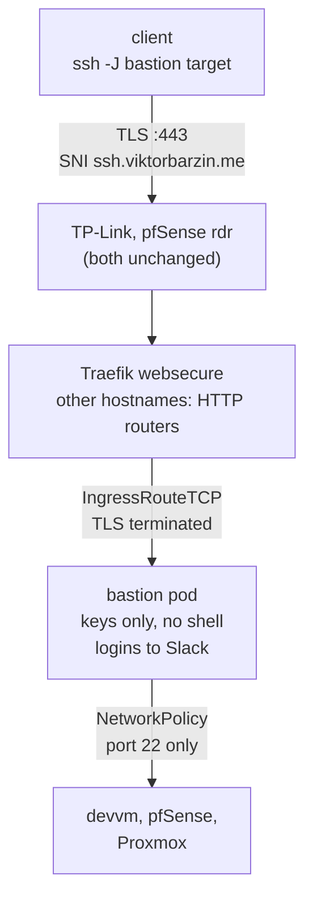

# SSH on port 443 through a bastion

**Status:** done, 2026-09-28 (live; the first client key, `muse`, is added when Viktor shares it)
**Date:** 2026-09-28
**Author:** Viktor Barzin (design worked out with Claude in a grilling session)
**Component:** new `bastion` stack, Traefik `websecure` entrypoint, Cloudflare DNS, Loki ruler

## Summary

Reach internal sshd servers from networks that only allow outbound HTTPS. A client wraps
SSH in TLS, connects to `ssh.viktorbarzin.me:443`, and Traefik routes that TLS hostname to
a jump-only sshd pod (the **Bastion**). From there the client hops with `ProxyJump` to
devvm, pfSense or the Proxmox host. Every other hostname on 443 keeps flowing to the HTTP
routes exactly as it does today.

The request started as "run sslh on pfSense". We chose a Traefik TCP route instead, for the
reasons in [Alternatives](#alternatives-considered).

## Goals

- SSH from networks that allow only 80/443 out (hotel, office, airport Wi-Fi), including
  networks that inspect traffic and drop non-TLS on 443.
- One entry point that fans out to several internal servers.
- No additional open port on the edge.
- A second way in when Tailscale/Headscale is unavailable on a client.

## Non-goals

- Replacing break-glass. The Bastion runs in the cluster, so it is down whenever the cluster
  is. The cluster-independent paths stay as they are: SSH on WAN 52222 to the Proxmox host
  (`docs/runbooks/breakglass-ssh.md`) and WireGuard on pfSense.
- Changing pfSense. Its NAT rules, HAProxy config and its own sshd settings are untouched.
- Plain `ssh -p 443 host` with no client configuration.

## Design



### Path

- **DNS.** `ssh.viktorbarzin.me` is a non-proxied A record to 176.12.22.76 plus an AAAA
  record to the HE tunnel address, like the other non-proxied hosts. Cloudflare's proxy
  cannot carry raw TLS, so the record has to be DNS-only.
- **Edge.** Unchanged. IPv4 443 already reaches Traefik (10.0.20.203) through a pfSense `rdr`
  with the client IP preserved. IPv6 443 reaches it through the pfSense HAProxy bridge with
  PROXY v2, which Traefik already trusts from 10.0.20.1.
- **Traefik.** An `IngressRouteTCP` on `websecure` matches ``HostSNI(`ssh.viktorbarzin.me`)``,
  terminates TLS with the default wildcard certificate, and forwards plain TCP to the Bastion
  service on port 22. Traefik evaluates TCP routers before HTTP routers on a shared
  entrypoint, and a TCP router with a specific `HostSNI` only claims that hostname, so every
  other request continues to the HTTP routers.
- **Rate limiting.** A `MiddlewareTCP` `inFlightConn` caps concurrent connections per client
  IP. Traefik's TCP layer has no connections-per-minute limiter; key-only auth means there is
  no password to guess, so the cap exists to bound resource use.

### Bastion pod

- Image `lscr.io/linuxserver/openssh-server`, used as a base with our own entrypoint
  (the s6 init is bypassed). No custom image build.
- One account per client. Public keys live in Vault KV `secret/bastion` as
  `authorized_key_<client>`, synced into the pod by an ExternalSecret. The entrypoint creates
  an account for each key it finds. Adding or removing a client is a Vault write; Reloader
  restarts the pod when the synced secret changes. No Terraform apply needed.
- The ed25519 host key lives in the same Vault path, so clients see a stable host key across
  restarts.
- sshd settings: public keys only, `PermitOpen` limited to the three targets, `ForceCommand`
  to `nologin`, no TTY, no agent/X11/stream-local forwarding, no tunnels, `MaxAuthTries 2`,
  `LoginGraceTime 20`, `LogLevel VERBOSE` so the key fingerprint is logged with each login.
- **Containment.** A Kubernetes NetworkPolicy lets the pod receive traffic only from Traefik on
  22, and a Calico NetworkPolicy lets it send traffic only to the three targets on 22, then
  denies the rest. (Egress has to be Calico-native: in tier 3-edge/4-aux namespaces the
  `wave1-egress-observe-tier34` policy allows all egress after Kubernetes policies are
  evaluated, so a Kubernetes egress policy alone restricts nothing. Found during rollout.) If sshd ever had a pre-auth vulnerability, a
  compromised pod could reach three sshd prompts and nothing else.

### Client configuration

```sshconfig
Host bastion
  HostName ssh.viktorbarzin.me
  User <client>
  IdentityFile ~/.ssh/<key>
  ProxyCommand openssl s_client -quiet -verify_quiet -verify_return_error -connect %h:443 -servername %h
  ServerAliveInterval 30

Host devvm
  HostName 10.0.10.10
  ProxyJump bastion
Host pfsense
  HostName 10.0.20.1
  User admin
  ProxyJump bastion
Host pve
  HostName 192.168.1.127
  User root
  ProxyJump bastion
```

The target sshd authenticates the user as it does today. The Bastion only relays.

### Login notifications

A Loki ruler rule matches `Accepted publickey` lines from the Bastion and posts one Slack
message to #alerts per login through the existing `lane = "event"` route (one post per
event, no resolve follow-up).

## Decisions

| Decision | Choice | Why |
|---|---|---|
| Where the multiplexing happens | Traefik TCP route on existing 443 | Managed in Terraform, no pfSense change, HTTPS path and client-IP handling unchanged |
| Client wrapping | SSH inside real TLS (ProxyCommand) | Routes by hostname, passes networks that inspect 443 |
| Fan-out model | One Bastion + `ProxyJump` | Target selection stays in SSH; the proxy only knows one hostname |
| Client authentication at the proxy | None (client certificates dropped) | mTLS added a CA and per-client certificates; key-only auth plus the egress lock covers the same risk more simply |
| Bastion accounts | One per client, keys in Vault KV | Logs name the client; removing one account cuts off one client |
| Targets | devvm, pfSense, Proxmox | The hosts needed remotely today |
| Login notifications | Slack on every login | Requested by Viktor |
| Day-one client | `muse` (key supplied by Viktor) | Further clients are added as Vault entries |

## Alternatives considered

- **sslh on pfSense.** No sslh package exists for pfSense 2.7.2, so it would be a hand-installed
  FreeBSD package that upgrades can remove, with no configuration in the repo. It would also
  sit in front of every WAN HTTPS connection and hide client IPs from Traefik (CrowdSec and 13
  rate limiters rely on them) unless it ran in transparent mode.
- **HAProxy on pfSense WAN.** The package is installed and already SNI-routes on the LAN side,
  and it would keep working during a cluster outage. It would add a userspace hop to all WAN
  HTTPS traffic, and pfSense config is edited by hand in the UI.
- **Mutual TLS at Traefik.** Keeps strangers from reaching sshd at all. Dropped because the
  certificate lifecycle (a Vault PKI mount, renewal for an external client) cost more than it
  added once the NetworkPolicy limits what a compromised Bastion can reach.
- **One hostname per target (SNI routing straight to each sshd).** Viable; we preferred a single
  entry point with `ProxyJump`.

## Known limits

- The Bastion logs do not contain client IPs. Traefik forwards plain TCP and OpenSSH cannot read
  the PROXY protocol, so sshd sees Traefik's pod IP. Logs name the account and key fingerprint.
  Accepted.
- Unavailable during a cluster outage (see Non-goals).
- CrowdSec's Traefik plugin is HTTP middleware and does not apply to TCP routes.

## Open questions

- Resolved during the build: `websecure`'s `readTimeout` (3600s) does not cap long SSH sessions.
  Traefik sets that read deadline only while it detects the protocol and clears it once a TCP
  router takes the connection, and `writeTimeout` is 0. The client config still sets
  `ServerAliveInterval 30` so idle NAT mappings on the client's network stay open.
- Whether Muse's runtime has `openssl` for the ProxyCommand. If not, `ncat --ssl` or `socat`
  do the same job.

## Rollout

1. New `stacks/bastion`: namespace, ExternalSecret, Deployment, Service, NetworkPolicy,
   `IngressRouteTCP`, `MiddlewareTCP`, Cloudflare A/AAAA records.
2. Vault `secret/bastion`: host key and the `muse` public key.
3. Loki rule for login notifications in the monitoring stack.
4. Runbook `docs/runbooks/bastion-ssh.md` with the client config and how to add a client.
5. Record corrections found while researching: WAN port 22 is forwarded (to Forgejo git SSH),
   and non-proxied DNS records reach Traefik directly rather than through the Cloudflared tunnel.
6. Verify from outside the network: TLS handshake on `ssh.viktorbarzin.me:443`, a `ProxyJump`
   login to each target, an idle session past 60 seconds, the NetworkPolicy blocking any other
   destination, an ordinary HTTPS site still serving, and the Slack message arriving.
