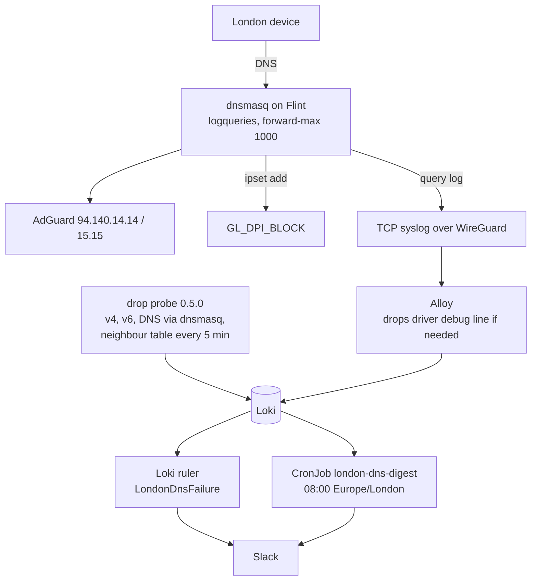

# London DNS block monitoring

Status: done (grilling with Viktor, 2026-10-02; revised the same day after two
independent reviews; built and verified the same day)

## Goal

Everyone in the London flat now uses the Flint 2 directly; the Hyperoptic
router was retired on 2026-10-02. London's DNS is filtered: the Flint forwards
to AdGuard's filtering resolver, and GL's DPI content protection blocks
gambling, adult and malware domains. A filter can block something a person
needs, and a resolver can fail. This plan makes both visible in one daily Slack
digest, and fixes the DNS failures we already found.

## Context

Measured on 2026-10-02:

| piece | state |
|---|---|
| Resolver | dnsmasq 2.92 on the Flint for the LAN (192.168.8.0/24) and guest (192.168.9.0/24) networks. AdGuardHome on the router is off |
| Upstream | AdGuard public DNS 94.140.14.14 / 94.140.15.15 (filtering), "all servers" on. The second upstream averaged 525 ms with 15,447 retries in about 4,000 s of uptime; the first averaged 203 ms |
| Blocked answer | `0.0.0.0` / `::` with NOERROR and a 3,600 s TTL. A name that does not exist gets NXDOMAIN |
| Volume | 21,720 forwarded and 4,968 cached lookups in about 4,000 s, roughly 575k a day |
| Clients | About half of lookups arrive over IPv6 from rotating privacy addresses that the DHCP leases do not list. The Meta Portal sends DNS to 1.1.1.1 directly, bypassing the Flint |
| GL DPI content protection | On. 212 domains in `/var/run/dnsmasq/gl_dpi.conf` feed the `GL_DPI_BLOCK` ipset; the firewall drops traffic to those addresses. The firewall counter read 0 after an hour of uptime |
| DNS failures | The router log shows `Maximum number of concurrent DNS queries reached (max: 150)` four times, next to a 283 s `layer=dns` drop. The drop probe queries 94.140.14.14 directly, not dnsmasq, so it does not test the path clients use |
| Router log | Firmware 4.11 logs a Wi-Fi driver debug line (`MlmeEnqueueForRecv`) about 47 times a second. The 512 KB ring holds about 80 s, and Loki receives about 90k Flint lines an hour (about 2.7k before the upgrade) |
| Log forwarding | `logread -r` sends lines live and drops them while the tunnel is down; it does not replay the ring after reconnecting |

The same day the Flint upgraded itself to GL 4.11.0, which removed every opkg
package. `scripts/london-flint/provision.sh` (bda1de77) reinstalls them; this
plan extends it.

Two review findings changed the first draft. Blocked answers are cached for an
hour by dnsmasq and by each device, so an app that keeps failing does not keep
asking DNS. A "retry storm" alert would rarely fire, and the typical false
positive is a single failed lookup. That is why the trigger is now a daily
digest.

## Decisions

| question | decision |
|---|---|
| Scope | DNS filtering and DNS failures on the Flint: AdGuard blocks, GL DPI blocks, failed lookups |
| Action | Report only. A person decides and applies any unblock |
| Capture | dnsmasq query log through the stock UCI option `logqueries` (`--log-queries=extra`, main instance), sent over the existing TCP syslog. Lines sent while the tunnel is down are lost; we accept that |
| Report | One Slack digest at 08:00 London time in the channel the London drop alerts use, with three sections: DNS errors (SERVFAIL, REFUSED, timeouts) per domain and device; domains newly blocked by AdGuard per device (blocked in the last 24 h, not in the previous 30 days); domains GL content protection added to `GL_DPI_BLOCK`. No post when every section is empty |
| First week | The newly-blocked section stays empty until 7 days of history exist; the errors and DPI sections report from day one |
| Device names | The probe pushes the IPv6 neighbour table and the DHCP leases to Loki every 5 minutes (RAM only), so an address resolves to a MAC and a hostname |
| DNS failure fix | Raise dnsmasq's concurrent-query limit from 150 to 1000 (UCI `dnsforwardmax`). The probe checks DNS through dnsmasq (`127.0.0.1`) |
| DNS failure alert | New `LondonDnsFailure` for `layer=dns` events; `LondonInternetDrop` stops matching them so nothing posts twice |
| Driver debug logging | Turn the driver's debug level down on the router. If the firmware does not allow it, drop the line in Alloy before it reaches Loki |
| Filtering | Keep the AdGuard filtering resolver |
| Unblock | `server=/<domain>/94.140.14.140` on the Flint, then restart dnsmasq. Devices keep the cached block for up to an hour. GL DPI blocks go through the content-protection allowlist |
| Dashboard | None. Loki queries go in `docs/architecture/london-site.md` |
| Probe self-monitoring | None for now (Viktor); `provision.sh` is the recovery path after an upgrade |
| CrowdSec | London's addresses are treated like any public IP: remove 137.220.71.46 from the whitelist and leave the IPv6 /56 unlisted |
| IPv6 | Native with the delegated /56 (set 2026-10-02). The probe adds an IPv6 check |

On CrowdSec, the reviews raised one risk that we are accepting deliberately.
137.220.71.46 is a CGNAT address that every device in the flat shares, so a ban
on it cuts off the whole flat for 4–24 h, including the probe's pushes to Loki.
London had three false bans before (2026-07-19, 2026-08-16, 2026-09-27). A
replay of the last 24 h through the live scenarios peaked at 2 of 10 for
probing and 1.9 of 10 for 403-abuse. The Nextcloud WebDAV, Immich asset and
bouncer-refusal whitelists stay in place. IPv6 bans affect one device each.

## Design

### 1. Router (`provision.sh`)

- `uci set dhcp.@dnsmasq[0].logqueries='1'` and `dnsforwardmax='1000'`, then
  restart dnsmasq. UCI settings survive firmware upgrades; `provision.sh` sets
  them anyway, so one run restores everything.
- Driver debug level: find the setting on 4.11.0 that stops
  `MlmeEnqueueForRecv`, apply it, and add it to `provision.sh` if it does not
  persist across reboots.

### 2. Drop probe 0.5.0

- IPv6 check: `http://[2606:4700:4700::1111]/` (curl 7.83 on the Flint
  returns 301), reported as `layer=ipv6` after 30 s of failure while IPv4 works.
- DNS check through `127.0.0.1`, so a dnsmasq problem shows as `layer=dns`.
- Every 5 minutes, push `ip -6 neigh`, `ip -4 neigh` and `/tmp/dhcp.leases` to
  Loki as one `{job="london-neigh"}` line. RAM only.
- Deployed by bumping `PROBE_VERSION` and running `provision.sh`.

### 3. Alerts

In `stacks/monitoring/modules/monitoring/loki.tf`: `LondonDnsFailure` for
`{job="london-drops", layer="dns"}` on the event lane, and `layer!="dns"` added
to the Flint `LondonInternetDrop` rule.

### 4. Digest

A CronJob in the monitoring namespace runs a small Python script at 08:00
Europe/London. It queries Loki for the last 24 h (and 30 days back for the
newly-blocked comparison), joins client addresses to device names through the
latest `london-neigh` line, and posts to Slack only if a section has entries.
The query patterns match dnsmasq's extra format, for example
`^\d+ (?P<client>[^/]+)/\d+ (reply|cached) (?P<domain>\S+) is (0\.0\.0\.0|::)$`.
The parsing and the "new" comparison are tested first (parameterised tests on
real log lines). Image built off-cluster per ADR-0002.

### 5. CrowdSec

Remove `137.220.71.46` from the whitelist in
`stacks/crowdsec/modules/crowdsec/main.tf`.

### 6. Docs

`docs/architecture/london-site.md`: the query patterns, the digest, the
unblock steps (including the up-to-an-hour cache), `LondonDnsFailure`, the new
UCI settings, and a corrected note on the ring (about 80 s today, and lines are
not replayed after a tunnel outage).

## Plan

1. Router: query log, forward-max, driver debug level (through `provision.sh`).
2. Alloy drop for the driver line if step 1 cannot stop it at the source.
3. Drop probe 0.5.0: IPv6, DNS through dnsmasq, neighbour push.
4. `LondonDnsFailure` and the `LondonInternetDrop` change.
5. Digest script (tests first), image, CronJob.
6. CrowdSec whitelist change.
7. london-site.md.

## Verification

- `nslookup doubleclick.net 127.0.0.1` on the Flint appears in Loki as a
  `reply`/`cached ... is 0.0.0.0` line with a client address.
- The driver debug line stops reaching Loki.
- A rehearsed DNS failure (probe pointed at an unreachable resolver) posts
  `LondonDnsFailure` once and no `LondonInternetDrop`.
- A rehearsed IPv6 failure posts with `layer=ipv6`.
- The digest, run by hand against today's data with the learning window
  shortened, posts the three sections with device names, and posts nothing when
  run against an empty window.
- The live CrowdSec whitelist no longer contains 137.220.71.46.

## Outcome (2026-10-02)

| step | result |
|---|---|
| Router | Query log and `dnsforwardmax 1000` set through `provision.sh` (a8360d67). `iwpriv ra0/rax0 set Debug=0` stopped the driver line at the source; a hotplug hook keeps it at 0 and is listed in `/etc/sysupgrade.conf`. The Alloy fallback was not needed |
| Log volume | Driver lines fell from about 28k to 17 per 10 minutes. The Flint now sends about 68k lines an hour, almost all dnsmasq query lines (about 575k lookups a day), so the 512 KB ring holds about 3 minutes. Loki has the full log; lines from a tunnel outage longer than that are lost |
| Drop probe 0.5.1 | IPv6 checks, DNS through dnsmasq with a fresh name, neighbour push every 5 minutes. A rehearsal with IPv6 and DNS unreachable for 50 s pushed `rehearsal-ipv6` and `rehearsal-dns` events and no alert |
| Alerts | A synthetic `layer=dns` event raised `LondonDnsFailure` on the event lane and no `LondonInternetDrop` |
| Digest | 18 tests pass. A dry run inside the cluster returned errors (SERVFAIL per device), the concurrent-query limit count and newly blocked names with device names. The CronJob runs at 08:00 Europe/London; the newly-blocked section starts on 2026-10-09 |
| CrowdSec | 137.220.71.46 removed; the live whitelist ConfigMap and all five agents carry the new file |
| Unblock path | Tested on the Flint with `doubleclick.net` (resolved to Google's address) and reverted |

## Open questions

- Whether firmware 4.11 lets the driver debug level be lowered; the Alloy drop
  is the fallback.
- How dnsmasq logs upstream timeouts. An upstream SERVFAIL is logged as
  `reply error is SERVFAIL` without the name (the digest joins it to the
  `query[` line by serial); a timeout may produce no per-query line, so the
  probe covers timeouts.
- Lookups that bypass the Flint (the Portal's direct 1.1.1.1, browser DoH,
  iCloud Private Relay) are not visible to this design.
