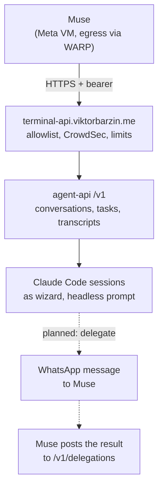
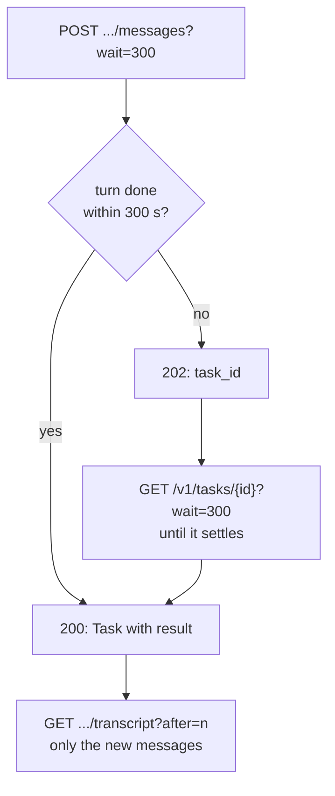
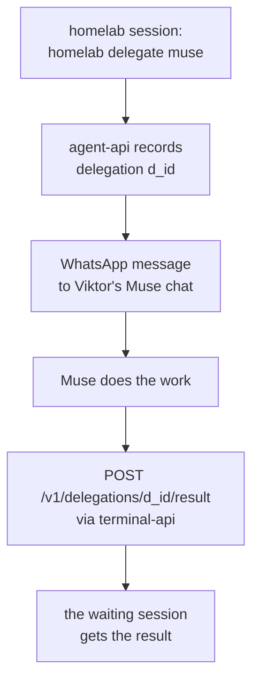

# Muse and the homelab: one integration, both directions

**Status:** approved, 2026-10-02
**Date:** 2026-10-02
**Author:** Viktor Barzin (design worked out with Claude in a grilling session)
**Component:** terminal-lobby `agent-api`, `terminal-api.viktorbarzin.me`, claude-memory, homelab CLI, Headscale

## Summary

Meta Muse is Viktor's personal agent. It holds the conversation with him on his phone and in
WhatsApp, and dispatches real work to Claude Code sessions on the devvm. This document maps every
place Muse touches the homelab today, records the decisions taken on 2026-10-02 about where the
integration goes next, and orders the remaining work.

Two directions:

- **Muse to homelab.** Muse is a **Caller** of Terminal Lobby's `agent-api`: it starts
  conversations, sends messages, follows them to completion and reads transcripts, over the public
  endpoint `terminal-api.viktorbarzin.me`.
- **Homelab to Muse.** A homelab session hands Muse a **Delegation**: something only Muse can do
  (reach Viktor on WhatsApp, act through its own connectors, browse from its VM, run a multi-day
  errand), and waits for the result.

It builds on [agent-broker](2026-09-14-muse-agent-broker-design.md) (the original Caller design)
and the [memory connector](2026-09-16-muse-memory-connector-design.md), and supersedes the
agent-broker's tailnet transport.

## Where things stand



| Surface | Direction | State on 2026-10-02 |
|---|---|---|
| agent-api over `terminal-api.viktorbarzin.me` | Muse to homelab | live since 2026-10-02; 28 conversations created by Muse to date |
| Send-and-wait, task long-poll, incremental transcripts, answer endpoint | Muse to homelab | built 2026-10-02 (agent-api 1.1.0), release in progress |
| Memory connector (claude-memory `muse` key) | Muse to homelab | live since 2026-09-16 |
| Tailnet path (Headscale node `koda`, `tailscaled-agent`) | Muse to homelab | offline since 2026-09-28; to be retired |
| Bastion SSH `muse` account | Muse to homelab | forwarding reverted 2026-10-02; key to be removed |
| Delegations to Muse | homelab to Muse | designed here; not built |

## Decisions

| Area | Decision | Why |
|---|---|---|
| Role | Muse orchestrates homelab agents; the work runs here | Muse is good at the conversation, Claude Code sessions are good at the work |
| Language | **Caller**: a named program driving the lobby with a bearer credential. **Delegation**: work the homelab hands to a Caller | One word each, matching agent-api's code; "agent" stays reserved for Claude Code itself |
| Transport | `terminal-api.viktorbarzin.me` HTTPS is the only path. The tailnet path and the bastion `muse` account are retired | One door to watch. The tailnet node went offline and never returned; the public endpoint works |
| API spec | `/openapi.json` is routed on terminal-api | Muse builds and refreshes its connector from the live contract; the document describes routes and holds no data |
| Following work | Send-and-wait (`?wait=N` on messages), task long-poll, incremental transcripts (`?after`, `?last`), answer endpoint | Every poll costs Muse a model turn, and transcripts were re-read whole (27 KiB for one conversation) |
| Questions | Sessions are told they are headless and must not ask (live since before this design); the answer endpoint is the fallback | Viktor: the prompt should say it is headless so it does not ask |
| Inputs | Images and files, stored in the session's clipboard store, absolute path added to the prompt. Limits 25 MB per image, 100 MB per file, 200 MB per message. Auth is checked before any body is read | Same convention the browser uses; outside every git repo |
| Lifecycle | A Caller session suspends after 24 h without a turn (Claude process freed, transcript kept) and resumes on the next message. `DELETE /v1/conversations/{id}` for a Caller's own conversations | Caller sessions stayed warm indefinitely on a disk around 90% full |
| Visibility | Each Caller gets its own sidebar group (not System). No push notifications. Caller sessions count in usage telemetry, tagged with the Caller | Viktor wants to see Muse's work as Muse's, without being paged by it |
| Token | Rotate on suspicion only | Viktor's choice; rotation is a Vault write and a playbook run |
| Delegation verb | `homelab delegate <caller> "<task>" [--wait] [--expires D]`, usable from any of Viktor's sessions | Generic over Callers; returns a Delegation id |
| Delegation delivery | A structured WhatsApp message to Viktor's Muse chat carrying the whole task and its own callback instructions; auto-sent without per-message approval, to that one chat only | Viktor's choice. Muse has no inbound address, and a WhatsApp message reaches it immediately |
| Delegation limits | 20 per hour, 100 per day; expiry set per delegation, default 24 h, maximum 14 days | Keeps WhatsApp traffic at human scale and bounds forgotten work |
| Delegation store | `agent-api` `/v1/delegations`, persisted on disk; Muse posts results to `POST /v1/delegations/{id}/result` with its existing token | Reuses the transport, auth and trace; the waiting session long-polls it |
| Local credential | A second Caller, `homelab`, whose token only `wizard` can read, used by the CLI over loopback | Same bearer model, separately revocable, and the trace tells `homelab` from `muse` |
| Delivery failure | The delegation closes as `undelivered`, the verb exits non-zero, and #alerts gets one post with the reason | A logged-out WhatsApp Web should be visible, not silent |

## Muse to homelab

### Transport and security

The endpoint's layers, outermost first, are in [terminal-api.md](../runbooks/terminal-api.md):
CrowdSec, a source allowlist (Cloudflare WARP's IPv6 block, which Muse egresses through, and mx2 for
tests), identity headers stripped with no proxy secret, a per-client rate limit and in-flight cap,
then Lobby's bearer check. The `/v1/` route uses its own Traefik transport with a 330 s
response-header timeout, because the cluster default of 30 s would end every long wait early.

Muse's addresses rotate across a range shared with every WARP user, so the allowlist filters
non-WARP traffic but cannot single Muse out, and per-address bans and limits cannot stop a caller
that also rotates through WARP. The bearer token, about 288 bits, is the control that identifies
Muse. It acts as `wizard`, which on the devvm means sudo, a cluster-admin kubeconfig and a Vault
token; Viktor chose this knowing it.

### Following work to completion



A session that still stops on a question puts its task in `needs_input` with the question's
`kind`, `options` and `answer_with`. Muse answers permission and plan prompts through
`POST /v1/tasks/{id}/answer`. AskUserQuestion menus are shown but not answerable through agent-api
(the lobby answers those through a hook held by session-events); the headless system prompt makes
them rare.

### Inputs, lifecycle and visibility

Images and files arrive with the message, are written to
`/var/lib/clipboard-store/wizard/<session>/` after the token is checked, and their absolute paths
are appended to the prompt. Caller sessions suspend after 24 idle hours and resume transparently
on the next message; a Caller can delete its own conversations. In the lobby, each Caller's
sessions collect in a group named after it.

## Homelab to Muse: Delegations



The message carries everything Muse needs, so no standing instruction is required:

```text
[homelab delegation d_01M3X9]
from: session terminal-lobby-404

Check whether my BA flight on 14 Oct still shows seat 32A and tell me.

When done, POST the result to
https://terminal-api.viktorbarzin.me/v1/delegations/d_01M3X9/result
body: {"status":"done","result":"..."}
```

Rules:

- Delegations go only to Viktor's Muse chat. The existing `homelab message` allowlist, audit log
  and wrong-recipient guard apply; delegations are the one unattended send it permits. Viktor's
  draft-only rule for real people is unchanged.
- Muse's own rule that WhatsApp is reply-only (#13313) still governs its own initiative. A
  Delegation may ask it to open a new thread with Viktor, gated per message by Muse's approval
  prompt (decided 2026-09-25, #13999).
- More than 20 in an hour or 100 in a day is refused with a clear error.
- A Delegation past its expiry closes as `expired`; a late result is refused with a message telling
  Muse to drop the work.
- If the WhatsApp send fails, the Delegation closes as `undelivered` and #alerts says why.

## Roadmap

| # | Phase | Contents | Bead |
|---|---|---|---|
| 0 | Done 2026-10-02 | terminal-api; agent-api 1.1.0 (built, release in progress) (send-and-wait, long-poll, incremental transcripts, answer endpoint); 330 s transport | — |
| 1 | Hygiene | Retire the tailnet path (node `koda`, `tailscaled-agent`, Headscale ACL entries, Vault `secret/muse-tailscale`) and the bastion `muse` key; route `/openapi.json`; Muse corrects its own memories #13323 and #13342 | code-tm6a |
| 2 | Inputs | Images and files on the messages endpoint (widened from images to files) | code-1dcq |
| 3 | Lifecycle | 24 h auto-suspend with transparent resume for Caller sessions; `DELETE /v1/conversations/{id}` | code-ufpp |
| 4 | Visibility | One sidebar group per Caller; Caller sessions in telemetry tagged by Caller | code-gr2v |
| 5 | Delegations | `/v1/delegations` in agent-api, the `homelab` Caller, `homelab delegate`, WhatsApp delivery, caps, expiry, failure alert | code-1dbu |

## What Viktor needs to do

- Re-link WhatsApp Web in the shared browser (noVNC at `chrome.viktorbarzin.me`, scan the QR
  code). It was logged out on 2026-10-02; phase 5 depends on it.
- Tell Muse to update its memories #13323 and #13342: they still describe the retired tailnet
  route. Only Muse's own key can edit them; #14441 carries the current facts meanwhile.

## Open questions

- How long Muse's tool calls may run. The wait cap is 300 s on that assumption; raise it if
  Muse's calls can hold longer.
- Whether Muse handles a long-lived event stream (`/events/{session}`); not needed if the waits
  cover it.
- Whether WhatsApp tolerates automated messages into the Muse chat at the capped volume. The
  August 2026 restriction (#11191) came from cold messages to strangers, a different pattern;
  phase 5 starts with the caps above and watches for a repeat.
- What Meta retains of requests, responses and delegation messages. Unknown; unchanged from the
  earlier designs.
