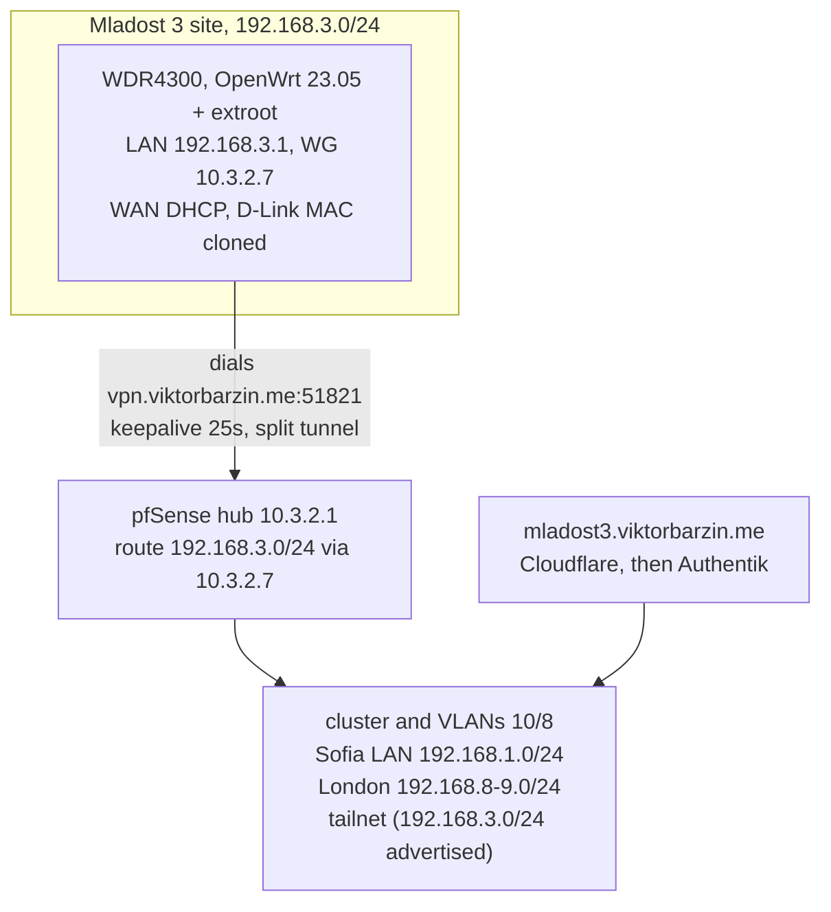
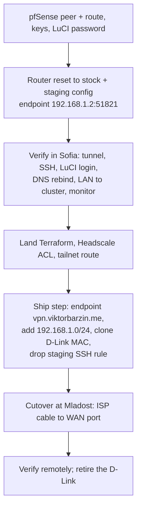

# Mladost 3 site: OpenWrt router on the WireGuard hub

Status: executing. Staged in Sofia; the ship step and cutover are pending.

## Goal

Replace the stock D-Link DIR-657 at the Mladost 3 flat with Viktor's old OpenWrt router and make the site reachable over the VPN, configured like Valchedrym. The site is called `mladost3` (glossary: **Mladost 3 site** in `infra/CONTEXT.md`).

## What we found

- The router is a TP-Link TL-WDR4300 v1 on OpenWrt 23.05.0 with a USB extroot. It was the Sofia edge router before the TP-Link AX6000: the AX6000's cloned WAN MAC (`10:fe:ed:9b:7d:3e`) is this router's own. Its config still carried Sofia-era settings (HE tunnel, mail and HTTPS port forwards, NordVPN and Tailscale interfaces, a guest bridge on 192.168.3.1).
- Plugged into the Sofia LAN by its WAN port, it leased 192.168.1.176 and dropped all IPv4 input. SSH answered over IPv6 link-local, reachable from rpi-sofia.
- The D-Link uses LAN 192.168.0.0/24, the same subnet as Valchedrym, so Mladost 3 needs a new one. Its WAN is plain DHCP with a cloned MAC (`00:18:F3:68:52:92`), WiFi is 2.4 GHz only (WPA/TKIP, WPS on), and it had no port forwards and no clients online at read time.

## Design

| Area | Decision |
|---|---|
| Firmware | Stay on 23.05.0. Userland packages are already at the final 23.05 builds; only the kernel (5.15.134) is behind. A sysupgrade would mean rebuilding the extroot, and nothing listens on the WAN side. |
| Config | Sofia-era config reset to stock (`/rom` defaults + `config_generate`) and backed up on the router at `/root/config-backup-sofia-era-20261003/`, then the Mladost settings applied. |
| LAN | 192.168.3.1/24, dnsmasq DHCP. |
| WiFi | D-Link SSID and password kept so existing devices reconnect, moved to WPA2-AES with WPS off, same SSID on 2.4 and 5 GHz. |
| WAN | DHCP with the D-Link's MAC cloned, in case the ISP is tied to it. No DDNS: the router dials out, and `mladost3.ddns.net` is left to lapse. |
| Tunnel | Spoke dials the hub with a 25s keepalive; the pfSense peer has no endpoint. Allowed IPs `10.0.0.0/8, 192.168.1.0/24, 192.168.8.0/24, 192.168.9.0/24` with routes; the site's own subnet is not in the list. Internet stays on the local ISP. |
| Routing | Both directions: Mladost reaches the cluster, Sofia and London; the homelab and tailnet reach Mladost. The `vpn` zone masquerades, because Sofia LAN hosts default-route to the TP-Link, which routes 10/8 back to pfSense but not 192.168.3.0/24. |
| Management | SSH by key only and LuCI, on the LAN and tunnel addresses, from 10.0.0.0/8. LuCI root password in Vaultwarden `mladost3.viktorbarzin.me`. |
| DNS | dnsmasq forwards to 9.9.9.9 / 8.8.4.4 with `rebind_domain viktorbarzin.me`. Technitium: `mladost3.viktorbarzin.lan` = 10.3.2.7, `openwrt-mladost3.viktorbarzin.lan` = 192.168.3.1, PTR in `3.168.192.in-addr.arpa`. |
| Web UI | `mladost3.viktorbarzin.me` proxies LuCI over the tunnel, public behind Authentik like Valchedrym. |
| Monitoring | Uptime Kuma port monitor on 192.168.3.1:80. |

## Where each piece lives

| Piece | Location |
|---|---|
| pfSense peer, gateway, static route | `infra/scripts/pfsense-mladost3-wg.sh` (package peer, survives reboots) |
| Tailnet route | `infra/playbooks/files/pfsense-tailscale-config.php`, `playbooks/pfsense-tailscale.yml`, `stacks/headscale/acl.hujson` autoApprovers |
| DNS records | `infra/stacks/technitium/modules/technitium/static_records.tf` (`static_lan_a_records`, new `static_ptr_records`) |
| Ingress | `infra/stacks/reverse-proxy/modules/reverse_proxy/main.tf` module `mladost3` |
| LAN allowlist | `infra/stacks/traefik/modules/traefik/middleware.tf` `home-lans-only` |
| Monitor | `infra/stacks/uptime-kuma/modules/uptime-kuma/main.tf` |
| WireGuard keys | Vault `secret/viktor` `mladost3_wg_private_key` / `mladost3_wg_public_key` |
| Router config | On the router (UCI); described in `infra/docs/architecture/vpn.md` |

## Rollout

Steps A to D are done. During staging the tunnel goes to pfSense's LAN leg, and 192.168.1.0/24 stays out of the tunnel, because the router's WAN sits inside that subnet. The ship step runs right before the router leaves Sofia. It changes the WAN MAC, which also ends the temporary link-local SSH path, so after it the router is managed only over the tunnel.

> [!NOTE]
> Fallback at cutover: plugging the D-Link back in restores Mladost exactly as before. It stays as a spare until the new router has run for a while.

## Verified in Sofia (2026-10-03)

- Handshake with pfSense; ping and key-only SSH to 10.3.2.7 and 192.168.3.1 from the devvm; password login refused.
- LuCI login with the Vaultwarden password, over the tunnel address.
- From the router's LAN address: `highlights-immich.viktorbarzin.me` returns 200 through the tunnel (DNS rebind exception, masquerade and allowlist all working), the internet goes out the local WAN, and London (192.168.8.1) answers through Sofia.
- From a cluster pod: LuCI reachable at `mladost3.viktorbarzin.lan` and 192.168.3.1. The public URL redirects to Authentik.
- Technitium answers the A and PTR records; pfSense advertises 192.168.3.0/24 to the tailnet, approved.
- Uptime Kuma monitor is up.

## Open questions

- The public endpoint path (Mladost's ISP to `vpn.viktorbarzin.me:51821`) is proven only once the router is at Mladost.
- No WiFi client has joined the new network yet; the LAN behaviour was tested from the router itself.
- A logged-in view of `mladost3.viktorbarzin.me` through Authentik has not been checked, since it needs Viktor's session.
