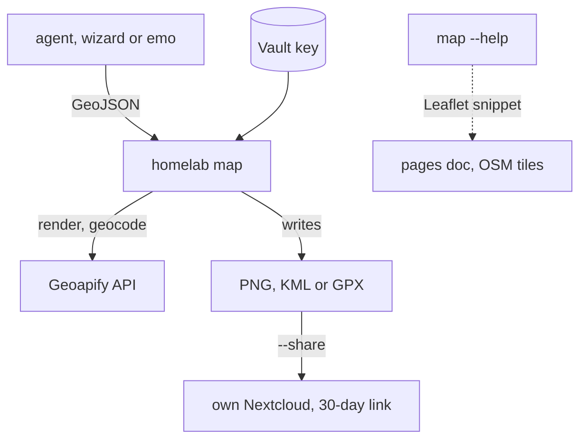

# homelab map: maps on demand for workstation agents

- Status: approved
- Date: 2026-10-08
- Decision record: ADR-0028 (provider, key sharing, page tiles)

## Goal

Any workstation user's agent can produce a map when a task needs one, without
working out providers, keys or upload paths each time:

- a static image (PNG) with pins and lines, for chat or a doc
- a KML or GPX file to open in Google My Maps or a phone navigation app
- coordinates for an address
- an interactive map inside a pages document

Expected volume is a handful of maps a week.

## What exists today

| Piece | State on 2026-10-08 |
|---|---|
| Geoapify key | `geoapify_api_key` in `secret/viktor` and `secret/dawarich` (same value, Dawarich uses it). Verified working |
| Geoapify free plan | 3,000 credits/day, 5 req/s, no card. Static map = 1 + tiles/4 + 1 per marker; geocode = 1 |
| `homelab share` | Uploads a file to the caller's own Nextcloud under `/_share/` and returns a 30-day public link. Credentials from `secret/<user>/nextcloud`, with wizard falling back to `secret/nextcloud/caldav`. emo's credential is present |
| `homelab how` | Searchable catalog in `cli/capabilities.go`; nothing for maps yet |
| Page maps elsewhere | tripit, health and SparkyFitness use Leaflet with keyless `tile.openstreetmap.org` |
| Self-hosted geo | OSRM foot/bicycle, Greater London only. No tile server or geocoder |

## Design



### Commands

```
homelab map render  <file.geojson|-> [-o out.png] [--size 1024x768] [--style osm-bright] [--share]
homelab map export  <file.geojson|-> --format kml|gpx [-o out.kml] [--share]
homelab map geocode "<address>" [--json]
```

- **Input** is one GeoJSON FeatureCollection for every subcommand. Supported
  geometries: Point, LineString, Polygon, and their Multi variants. A feature
  with `"geometry": null` and an `address` property is geocoded first.
  `properties.name` becomes the label; `properties.description` goes into KML.
- **render** posts to Geoapify's static map endpoint (`POST /v1/staticmap`, JSON
  body with `markers` and `geometries` as `{lat, lon}` objects). With no centre
  given, Geoapify fits the view to the features. Markers are numbered in input
  order, and the numbers are printed with their names so a reply can carry the
  legend. Output is PNG. Geoapify's attribution is drawn on the image.
- **export** writes KML (placemarks, line strings, polygons, names and
  descriptions) or GPX (waypoints for points, tracks for lines; polygons are
  skipped with a warning, since GPX has no polygon). No network call unless
  addresses need geocoding.
- **geocode** prints `lat,lon` and the matched address, or JSON with
  `--json`. One Geoapify credit per address.
- **--share** reuses the `homelab share` upload and link code, so the file goes
  to the caller's own Nextcloud with the existing 30-day default. Map uploads are
  named `<stamp>-map-<name>`. Before each upload the verb deletes `-map-` files
  in `/_share/` older than 30 days. Other files in `/_share/` are never touched.
- **Key lookup**: `secret/workstation/shared/maps` field `geoapify_api_key`,
  read with the caller's own Vault token like other verbs. If it can't be read,
  the error names the path and the policy that grants it.
- **Rate**: geocoding is spaced to stay under 5 requests per second.

### Interactive maps in pages

There's no subcommand for this. `homelab map --help` ends with a short Leaflet
snippet: the CDN tags with pinned versions, a `tile.openstreetmap.org` layer
with the "© OpenStreetMap contributors" attribution, and a loader that reads
the same GeoJSON. No key appears in the page.

### Discovery

A `homelab how` entry for "make a map / pin places / KML / geocode an address"
points at `homelab map` and says what not to reach for instead: public Nominatim
from scripts, CARTO tiles (they now watermark without a key), hand-stitched
tiles, Google My Maps automation.

### Vault and access

- New KV secret `secret/workstation/shared/maps` with one field,
  `geoapify_api_key`, holding a copy of the existing key. It is written once with
  `vault kv put`. Like every other KV value here, it lives outside Terraform.
- `stacks/vault/main.tf`: add read on `secret/data/workstation/shared/maps` to
  the `projects-emo` policy. The policy content is evaluated live, so emo's
  current devvm token picks it up with no re-mint. wizard reads it through
  `vault-admin`.

## Out of scope

- `map html` and `map route` subcommands
- Automating Google My Maps import
- A daily credit cap (accepted risk: agents and Dawarich share one budget)
- The openstreetmap.org account and the Mapbox token
- A separate skill. The `how` entry and `--help` carry the guidance

## Implementation plan

1. **Vault policy.** Add the read path to `projects-emo` in `stacks/vault/main.tf`.
   Apply from the main checkout, then commit.
2. **Secret.** Copy the key into `secret/workstation/shared/maps` with
   `vault kv put`. Verify with emo's token capabilities
   (`vault token capabilities` against the path, run as emo) that it returns
   `read`.
3. **CLI, test first.** In `cli/`:
   - `map.go`: pure functions with table tests: GeoJSON parsing, address
     detection, the Geoapify request body, KML and GPX encoding, prune
     selection by name and age.
   - `cmd_map.go`: command wiring, Vault lookup, HTTP calls, `--share` via the
     existing `webdavPut` and `createPublicShare`. HTTP behaviour is tested
     with `httptest`.
   - A `capabilities.go` entry, plus a `cli/README.md` section and a
     `docs/agents/homelab-cli.md` row.
   - Bump `cli/VERSION`.
4. **Land** with `homelab work land --verify-cmd "cd cli && go test ./..."`. The
   hourly provisioner rebuilds `/usr/local/bin/homelab` from the main checkout.
5. **Verify through the real binary.** Build it, then as wizard: geocode an
   address, render a Sofia map with three pins and a line and look at the PNG,
   export KML and GPX and validate them, share one and open the link. As emo,
   run `homelab map geocode` to prove the Vault grant. Render the Leaflet
   snippet in a browser and screenshot it.

## Open questions

- Whether Geoapify counts credits per key or per account was not verified. It
  only matters if a dedicated key is considered later.
