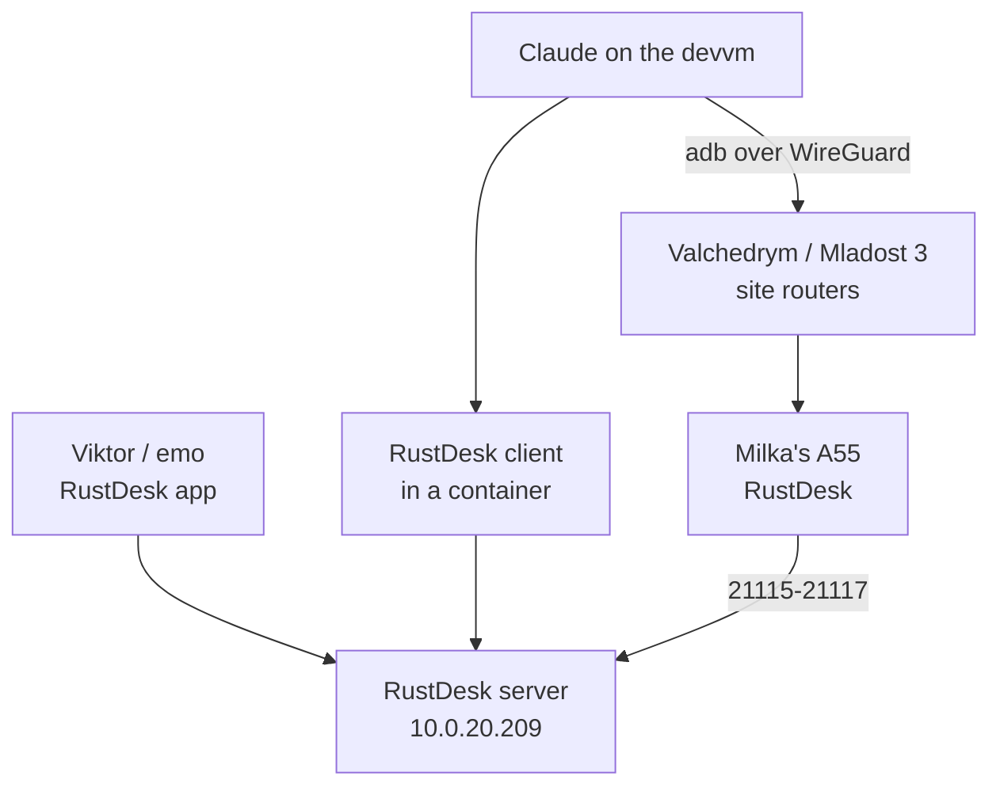
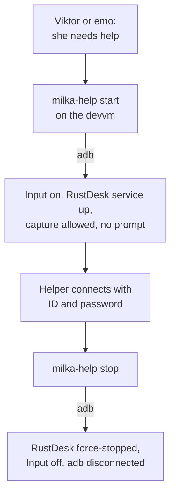

# Remote help for Milka's phone

Status: executing (2026-10-09, revised 2026-10-10). Agreed with Viktor in a grilling session on 2026-10-09. Revised after testing both tools on the shared emulator: RustDesk is the one tool on her phone. Installed on her phone the same day, with an ADB backup path; see "Live setup on her phone". Revised again the same evening: RustDesk now stays off between sessions and nothing from the setup shows a notification; see "Quiet by default".

## Goal

Viktor, emo and Claude can see and operate Milka's phone (Samsung Galaxy A55, Android 16, One UI 8) when she calls for help. She keeps using the phone as she does today. As set up on 2026-10-10 she does nothing per session: a helper starts RustDesk over ADB, connects with the permanent password, and stops it afterwards. Between sessions nothing from the setup runs except a small Automate loop, and nothing shows in her notifications, because she finds unfamiliar notifications worrying.

## Decisions

| Topic | Decision |
|---|---|
| Kind of help | Full control (tap and type), not only viewing |
| Helpers | Viktor and emo, from phone or laptop; Claude through a RustDesk desktop client in a container on the devvm (used on 2026-10-10), plus ADB. Starting RustDesk needs the devvm, so Viktor, emo or Claude runs `milka-help start` first |
| How she asks | She phones a helper as usual. No help button |
| Her part per session | None. RustDesk accepts sessions by password only, and screen capture starts without the Android prompt (see below) |
| Control tool | RustDesk. Her phone runs 1.4.9 from F-Droid; the F-Droid and GitHub builds are signed with different keys, so updates come from F-Droid or need an uninstall first |
| MeshCentral | Not used on her phone (decided 2026-10-10 after the emulator test). MeshCentral itself stays for other devices |
| Server | Self-hosted RustDesk (hbbs + hbbr) in the cluster, public, key-locked |
| Login | One permanent RustDesk password, in Vault `secret/rustdesk-milka` and in Vaultwarden shared with emo |
| RustDesk between sessions | Off. `milka-help start` on the devvm starts it over ADB for a session and `milka-help stop` ends it (see "Quiet by default") |
| Notifications | None from the setup. RustDesk and Automate have the notification permission revoked; during a session Android still shows its own screen-sharing chip in the status bar |
| ADB | ADB over the site-to-site tunnel, kept switched on by an Automate flow (see below). Also the way RustDesk is started |
| Install hygiene | Samsung Auto Blocker turned back on after install; a helper turns it off briefly for each update |
| Claude's limits | Connects only when Viktor or emo ask; never opens banking or payment apps; never sends messages or calls as her; checks with a helper before anything irreversible |

## Why this shape

MeshCentral is already running, but its Android agent is view-only. Its README says the remote desktop "cannot tap, swipe, type, or otherwise control the device", and the request to add control through Accessibility was still open on 2026-10-09. RustDesk is the free option that does control, using its own Accessibility service.

Since Android 14 every screen-capture session needs the user's consent, and on Android 15 QPR1 and later capture stops when the screen locks ([MediaProjection docs](https://developer.android.com/media/grow/media-projection)). The original plan accepted one tap per session for that reason. The live setup removes it: over ADB, RustDesk was granted the `PROJECT_MEDIA` app-op, which lets it start capture without the prompt.

The first draft ruled ADB out because wireless debugging switches off on reboot and is tied to a Wi-Fi network. Two facts changed that. She only uses Wi-Fi at Valchedrym or Mladost 3, and both sites are site-to-site WireGuard spokes, so the devvm reaches her phone directly. And an automation app holding `WRITE_SECURE_SETTINGS` can switch wireless debugging back on by itself on a network the phone already trusts.

Neither MeshCentral nor RustDesk offers an API for a program to take screenshots or send taps. On 2026-10-10 Claude used a RustDesk desktop client in a container (`lscr.io/linuxserver/rustdesk`) on the devvm, driven through its web desktop, plus ADB directly. ADB's `screencap` also shows screens that Android hides from screen sharing, such as Developer options.

## Live setup on her phone (2026-10-10)

| Piece | State |
|---|---|
| RustDesk ID | `1060440055`, also in Vault `secret/rustdesk-milka` (field `id`) |
| Accept mode | Password only. Viewers that tick "Remember password" connect without typing it |
| Screen capture | App-op `PROJECT_MEDIA` set to allow for `com.carriez.flutter_hbb`, so no "Share screen" prompt |
| Battery | RustDesk and Automate exempt from battery optimisation |
| Notifications | `POST_NOTIFICATIONS` revoked for `com.carriez.flutter_hbb` and `com.llamalab.automate`. Both keep running; their ongoing notifications are not shown |
| Wireless debugging | Paired with the devvm's ADB key (wizard's, copied to emo as `~/.android/milka-adbkey`). The connect port changes after every restart; `milka-adb` tries port 5555 and then scans 30000-50000 |
| Keeping ADB on | Automate flow "Keep wireless ADB on": set Global `adb_wifi_enabled` to 1, wait 1 minute (inexact, does not wake the phone), repeat. Automate has `WRITE_SECURE_SETTINGS` and "Run on system startup" |

Restart test, 2026-10-10: after `adb reboot`, RustDesk registered again and accepted a password session showing the lock screen with nobody touching the phone. ADB came back once the phone had been unlocked and the flow ran; that took about 10 minutes with the original 15-minute wait, which is why the wait is now 1 minute. Apps such as Automate only start after the first unlock following a restart.

## Quiet by default (2026-10-10)

Viktor asked for as few notifications as possible and for RustDesk to run only when needed, to save battery. The helper scripts `milka-help` and `milka-adb` do this over ADB. The devvm playbook installs both in `/usr/local/bin` for every user. They run their own adb server on port 5039 with the key her phone trusts at `~/.android/milka-adbkey`; Viktor and emo both have it (one shared key, Viktor's choice), and emo's own adb key for other devices is untouched.

| Command | What it does on her phone |
|---|---|
| `milka-help start` | Switches the "RustDesk Input" accessibility service on, then sends RustDesk's own `DEBUG_BOOT_COMPLETED` broadcast to its `BootReceiver`. That starts the service with no app window, and `PROJECT_MEDIA` lets screen capture start with no prompt. Prints once the service is up |
| `milka-help stop` | Force-stops RustDesk, clears the accessibility entry, disconnects ADB |
| `milka-help status` | Service running or idle, the accessibility entry, and whether wireless debugging is on |

Tested on 2026-10-10 from the idle state with her phone locked: the service started headless and registered with the server within 6 seconds, the devvm viewer connected with the remembered password, showed the lock screen once the screen was on, and controlled the home screen after unlock. During the session her notification list showed only her own apps (step counter, AdGuard, Viber). After `stop`, `dumpsys` showed no RustDesk service and no screen capture, the accessibility entry was empty, and ADB reconnected.

A force stop also puts the app in Android's stopped state, which keeps its boot receiver from running. Restart test, 2026-10-10 21:26 UTC: RustDesk stayed off (no traffic to the server). ADB stayed off until the phone was first unlocked, as expected; Automate started at that unlock, wireless debugging came back, and a test that switched it off again saw it restored within 3 minutes. Then `milka-help start`, `status` and `stop`, run as emo with emo's copy of the key, all worked on her phone.

After a restart nobody can reach the phone remotely until it has been unlocked once by hand, since neither RustDesk nor ADB runs before that.

Things learned while making it quiet:

- Revoking `POST_NOTIFICATIONS` kills the app. For Automate that also stopped the running flow; opening Automate on the phone resumed it, and it then switched wireless debugging back on 40 seconds after a test switched it off.
- The ADB shell may not disable a single component of a third-party app (`Shell cannot change component state`), so the boot receiver cannot be switched off on its own. The stopped state does the same job.
- With the screen off, a connected viewer shows "waiting for image": capture is running but the display sends no frames. It starts as soon as the screen wakes.
- RustDesk's broadcast start shows a short "RustDesk is Open" toast on her screen.

Things learned while setting it up:

- One UI hides Developer options from screen sharing, so pairing wireless debugging needs someone at the phone to read out the code.
- The "RustDesk Input" accessibility service was blocked as a restricted setting. Turning Auto Blocker off, then App info > ⋮ > Allow restricted settings, unblocked it.
- After Input was switched on, RustDesk stayed registered but ignored connection requests until it was force-stopped and reopened. A force stop also switches the Input service off; ADB can switch it back on with `settings put secure enabled_accessibility_services com.carriez.flutter_hbb/com.carriez.flutter_hbb.InputService`.
- MacroDroid's free tier now stops after 7 days unless the user watches ads or pays, so Automate is used instead.
- Her phone also runs AdGuard, which is the VPN key icon in the status bar. It did not interfere with RustDesk or ADB.

## Emulator test (2026-10-10)

Both Android agents were installed on the shared emulator as a stand-in for her phone, pointed at our servers, and driven from a viewer on the devvm.

| | RustDesk 1.5.0 | MeshCentral agent 1.0.23 |
|---|---|---|
| Seeing the screen | Works, near-live, through our relay | Works |
| Taps, home and back, opening apps | Works | No effect, as its README states |
| Typing | Works by tapping the phone's own keyboard in the viewer. Laptop keystrokes did not reach the text field | Not available |
| Prompt per session | "Share screen", defaulting to the entire screen | "Share screen", defaulting to "Share one app", so she would also change a dropdown |
| Staying online | Stayed registered | Defaults to "Only connect when requested": offline after a restart until someone taps Connect |
| Lock, then unlock | Kept sharing (the emulator has no PIN) | Not tested |

The MeshCentral connection default is the likely reason her earlier MeshCentral setup dropped often.

Android discards screen-share consent after a while. When she tapped "Share screen" about 12 minutes before a viewer connected, RustDesk asked again at connect time and the first attempt stalled at "waiting for image". She should tap it when the helper connects, not in advance.

First-time RustDesk setup on the phone asks for: a 6-second scam warning (with "Don't show again"), notifications, display over other apps, the "RustDesk Input" accessibility service, and screen sharing.

The emulator crashed once during the test (exit 139). The GPU driver on the same node was restarting at that moment for an unrelated upgrade, so the cause is not confirmed.

## Components

- `stacks/rustdesk`: hbbs and hbbr in one pod, `rustdesk/rustdesk-server:1.1.16`, both started with `-k _` so only clients holding the server's public key can register or relay. Dedicated MetalLB address `10.0.20.209` with `externalTrafficPolicy: Local`, the same reasoning as coturn. Keypair from Vault `secret/rustdesk` via ESO. Grey-cloud A record `rustdesk.viktorbarzin.me`, plus an internal Technitium record pointing at the LB address.
- pfSense alias `rustdesk_lb` with NAT for 21115-21117/tcp and 21116/udp, and matching forwards on the TP-Link. Both routers are configured by hand, outside Terraform.
- `stacks/meshcentral`: the init container now forces `NewAccounts` off on the existing volume. The live config had `"NewAccounts": "true"`.

## Client settings

Every RustDesk client (her phone, helpers, emulator) uses:

- ID server: `rustdesk.viktorbarzin.me`
- Relay server: `rustdesk.viktorbarzin.me`
- Key: the server's public key, `vault kv get -field=id_ed25519_pub secret/rustdesk`

The permanent password for her phone is in Vault (`secret/rustdesk-milka`, `password`).

## Open questions

- The battery cost of the Automate loop. It wakes for a moment about once a minute while the phone is awake and less often while it dozes (gaps of 6 to 14 minutes in its log on 2026-10-10).
- Wireless debugging still has to be allowed once on the Mladost 3 Wi-Fi before the flow can switch it on there. Until then RustDesk cannot be started while she is at Mladost 3. Planned for when she is there in December 2026.
- Whether laptop keystrokes can reach her text fields with a different RustDesk keyboard mode. Only the legacy mode was tested.
- Where Claude's viewer lives permanently. The container used on 2026-10-10 ran from a session scratch directory on the devvm; it has no permanent home yet.
- Whether RustDesk still reports usage to rustdesk.com when pointed at our own server (F-Droid flags the app for this).
- Whether One UI keeps RustDesk's Accessibility service enabled across app updates. It survived the restart test; a force stop switches it off.
