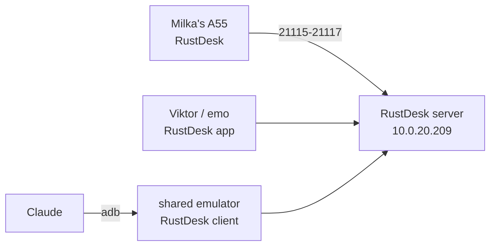

# Remote help for Milka's phone

Status: executing (2026-10-09, revised 2026-10-10). Agreed with Viktor in a grilling session on 2026-10-09. Revised after testing both tools on the shared emulator: RustDesk is the one tool on her phone.

## Goal

Viktor, emo and Claude can see and operate Milka's phone (Samsung Galaxy A55, Android 16, One UI 8) when she calls for help. She keeps using the phone as she does today and does one thing per session: tap "Share screen" when a helper connects.

## Decisions

| Topic | Decision |
|---|---|
| Kind of help | Full control (tap and type), not only viewing |
| Helpers | Viktor and emo, from phone or laptop; Claude through the shared Android emulator |
| How she asks | She phones a helper as usual. No help button |
| Her part per session | One tap on Android's "Share screen" prompt, when the helper connects |
| Control tool | RustDesk 1.5.0, from the GitHub APK (not on the Play Store since 2023) |
| MeshCentral | Not used on her phone (decided 2026-10-10 after the emulator test). MeshCentral itself stays for other devices |
| Server | Self-hosted RustDesk (hbbs + hbbr) in the cluster, public, key-locked |
| Login | One permanent RustDesk password, in Vault `secret/rustdesk-milka` and in Vaultwarden shared with emo |
| Install hygiene | Samsung Auto Blocker turned back on after install; a helper turns it off briefly for each update |
| Claude's limits | Connects only when Viktor or emo ask; never opens banking or payment apps; never sends messages or calls as her; checks with a helper before anything irreversible |

## Why this shape

MeshCentral is already running, but its Android agent is view-only. Its README says the remote desktop "cannot tap, swipe, type, or otherwise control the device", and the request to add control through Accessibility was still open on 2026-10-09. RustDesk is the free option that does control, using its own Accessibility service.

The single tap per session comes from Android, not from RustDesk. Since Android 14 every screen-capture session needs the user's consent, and on Android 15 QPR1 and later capture stops when the screen locks ([MediaProjection docs](https://developer.android.com/media/grow/media-projection)). The one route that avoids the prompt, wireless debugging (ADB), switches itself off on reboot and loses its pairing when the Wi-Fi network changes, so it is not dependable for her.

Neither MeshCentral nor RustDesk offers an API for a program to take screenshots or send taps. Claude therefore uses the RustDesk Android client installed on the shared emulator (`android-emulator.viktorbarzin.me`), which it already drives over adb.

## Emulator test (2026-10-10)

Both Android agents were installed on the shared emulator as a stand-in for her phone, pointed at our servers, and driven from a viewer on the devvm.

| | RustDesk 1.5.0 | MeshCentral agent 1.0.23 |
|---|---|---|
| Seeing the screen | Works, near-live, through our relay | Works |
| Taps, home and back, opening apps | Works | No effect, as its README states |
| Typing | Works by tapping the phone's own keyboard in the viewer. Laptop keystrokes did not reach the text field | Not available |
| Prompt per session | "Share screen", defaulting to the entire screen | "Share screen", defaulting to "Share one app", so she would also change a dropdown |
| Staying online | Stayed registered | Defaults to "Only connect when requested": offline after a restart until someone taps Connect |
| Lock, then unlock | Kept sharing (the emulator has no PIN) | Not tested |

The MeshCentral connection default is the likely reason her earlier MeshCentral setup dropped often.

Android discards screen-share consent after a while. When she tapped "Share screen" about 12 minutes before a viewer connected, RustDesk asked again at connect time and the first attempt stalled at "waiting for image". She should tap it when the helper connects, not in advance.

First-time RustDesk setup on the phone asks for: a 6-second scam warning (with "Don't show again"), notifications, display over other apps, the "RustDesk Input" accessibility service, and screen sharing.

The emulator crashed once during the test (exit 139). The GPU driver on the same node was restarting at that moment for an unrelated upgrade, so the cause is not confirmed.

## Components

- `stacks/rustdesk`: hbbs and hbbr in one pod, `rustdesk/rustdesk-server:1.1.16`, both started with `-k _` so only clients holding the server's public key can register or relay. Dedicated MetalLB address `10.0.20.209` with `externalTrafficPolicy: Local`, the same reasoning as coturn. Keypair from Vault `secret/rustdesk` via ESO. Grey-cloud A record `rustdesk.viktorbarzin.me`, plus an internal Technitium record pointing at the LB address.
- pfSense alias `rustdesk_lb` with NAT for 21115-21117/tcp and 21116/udp, and matching forwards on the TP-Link. Both routers are configured by hand, outside Terraform.
- `stacks/meshcentral`: the init container now forces `NewAccounts` off on the existing volume. The live config had `"NewAccounts": "true"`.

## Client settings

Every RustDesk client (her phone, helpers, emulator) uses:

- ID server: `rustdesk.viktorbarzin.me`
- Relay server: `rustdesk.viktorbarzin.me`
- Key: the server's public key, `vault kv get -field=id_ed25519_pub secret/rustdesk`

The permanent password for her phone is in Vault (`secret/rustdesk-milka`, `password`).

## Open questions

- Whether screen sharing survives a lock and unlock on her Samsung with its PIN. The emulator has no PIN.
- Whether One UI shows the "restricted settings" block for the sideloaded APK before the accessibility service can be turned on. adb installs on the emulator skip it.
- Whether laptop keystrokes can reach her text fields with a different RustDesk keyboard mode. Only the legacy mode was tested.
- Where Claude's viewer runs. The emulator cannot be the viewer and a test target at the same time, and it crashed once. A RustDesk desktop client in a container (`lscr.io/linuxserver/rustdesk`) worked as a viewer during the test.
- Whether RustDesk still reports usage to rustdesk.com when pointed at our own server (F-Droid flags the app for this).
- Whether Android 16 on One UI 8 keeps RustDesk's Accessibility service enabled across reboots and app updates.
